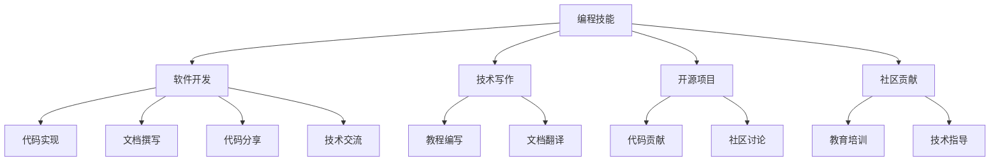

                 

# 如何将编程技能转化为知识产品

> 关键词：编程技能,知识产品,软件开发,技术写作,开源项目,知识共享,社区贡献

## 1. 背景介绍

在数字化时代，编程技能已经成为了许多领域的基本要求。然而，将编程技能转化为有价值的知识产品，不仅可以提升个人的影响力，还能促进技术的传播和共享，推动社会的进步。本文将深入探讨如何将编程技能转化为知识产品，包括软件开发、技术写作、开源项目和社区贡献等方面的实践和经验。

## 2. 核心概念与联系

### 2.1 核心概念概述

为更好地理解如何将编程技能转化为知识产品，本节将介绍几个密切相关的核心概念：

- 编程技能(Programming Skills)：指程序员在软件开发过程中所掌握的一系列知识和技能，包括编程语言、算法、数据结构、软件工程、系统架构等。
- 知识产品(Knowledge Products)：指由程序员开发并对外发布的软件、文档、教程、框架等产品，这些产品为其他开发者或用户提供了价值。
- 软件开发(Software Development)：指从需求分析、设计、实现到测试、部署、维护的整个软件生命周期过程。
- 技术写作(Technical Writing)：指将复杂的编程技术和概念转化为易于理解和使用的文档或教程，帮助其他人掌握技术。
- 开源项目(Open Source Projects)：指通过互联网共享代码和资源的开发项目，促进社区协作和知识共享。
- 社区贡献(Community Contribution)：指程序员通过参与开源项目、技术讨论、教育培训等方式，为社区做出积极贡献。

这些核心概念之间的逻辑关系可以通过以下Mermaid流程图来展示：



这个流程图展示了一系列的核心概念及其之间的关系：

1. 编程技能是开发知识产品的基础。
2. 软件开发、技术写作、开源项目、社区贡献等活动都可以视为知识产品的生产过程。
3. 知识产品的输出形式多样，包括代码、文档、教程、框架等。
4. 代码实现、文档撰写、代码分享、技术交流等活动是知识产品生产的关键步骤。
5. 技术写作、开源项目、社区贡献等活动不仅能产生知识产品，还能促进社区的交流与合作。

## 3. 核心算法原理 & 具体操作步骤
### 3.1 算法原理概述

将编程技能转化为知识产品，本质上是一个软件开发生命周期和知识传播过程的结合。其核心思想是：通过软件开发、技术写作、开源项目和社区贡献等活动，将编程技能封装、传播、共享和应用，从而形成知识产品。

形式化地，假设程序员拥有的编程技能为 $S$，在软件开发、技术写作、开源项目和社区贡献的过程中，通过一系列操作 $T$，最终生成的知识产品为 $P$。则转化过程可以表示为：

$$
P = f(S, T)
$$

其中 $f$ 为转化函数，描述了从编程技能到知识产品的转换过程。在实践中，$f$ 的实现通常需要程序员根据具体任务，选择合适的工具和方法。

### 3.2 算法步骤详解

将编程技能转化为知识产品的算法步骤，可以分为以下几个关键步骤：

**Step 1: 确定目标和需求**
- 明确将编程技能转化为知识产品的具体目标，如开发某个应用、撰写技术教程、参与开源项目等。
- 确定目标所需的技能和知识，包括编程语言、框架、算法等。
- 分析和评估所需资源的可行性，如时间、人力、资金等。

**Step 2: 设计和规划**
- 根据目标和需求，设计系统的整体架构和技术方案。
- 规划代码实现、文档撰写、项目管理和社区互动的具体步骤和策略。
- 确定知识产品的输出形式，如代码库、API文档、在线教程等。

**Step 3: 实现和开发**
- 按照设计方案，编写代码并进行系统实现。
- 编写详细文档，解释代码的功能、使用方法、注意事项等。
- 将代码和文档发布到公共平台，如GitHub、Stack Overflow等，供他人使用和参考。

**Step 4: 测试和优化**
- 对代码和文档进行测试，确保其功能和完整性。
- 收集用户反馈，进行代码优化和文档改进。
- 根据用户需求和反馈，不断迭代和更新知识产品。

**Step 5: 社区互动和贡献**
- 在开源社区或技术论坛中，分享知识产品的使用经验和技术问题。
- 参与社区讨论，解答其他开发者的问题，提供技术支持。
- 根据社区反馈，进一步完善和优化知识产品。

### 3.3 算法优缺点

将编程技能转化为知识产品的方法具有以下优点：
1. 提升个人影响力。通过公开和共享自己的编程技能，可以获得更多的关注和认可。
2. 促进技术传播。优秀的知识产品可以帮助更多人学习和使用新技术，加速技术进步。
3. 增强社区合作。参与开源项目和社区贡献，可以与其他开发者建立合作关系，共同解决问题。
4. 提升职业竞争力。不断学习和应用新技术，提升自己的编程技能和知识水平。

同时，该方法也存在一定的局限性：
1. 时间和资源投入较大。软件开发、技术写作、社区贡献等都需要大量的时间和精力。
2. 知识传播的广度和深度有限。知识产品的发布和传播需要一定的时间和渠道，无法立即影响广大人群。
3. 知识产品的质量和内容有待提高。优秀的知识产品需要精心的设计和实践，而非随意的编写和发布。
4. 社区贡献的激励机制不完善。部分社区缺乏有效的激励机制，导致贡献者的积极性不足。

尽管存在这些局限性，但就目前而言，将编程技能转化为知识产品的方法仍是程序员提升影响力、传播技术的重要途径。未来相关研究的重点在于如何进一步降低时间和资源的投入，提高知识产品的质量和传播效果，同时完善社区贡献的激励机制，吸引更多有志之士参与其中。

### 3.4 算法应用领域

将编程技能转化为知识产品的算法，已经在软件开发、技术写作、开源项目和社区贡献等多个领域得到了广泛的应用，涵盖了从初学者到高级开发者、从企业内部到开源社区的各个层次。

- **软件开发**：开发者可以将自己的项目代码、工具库、代码示例等转化为知识产品，供他人学习和使用。例如，GitHub上的开源项目、GitHub Pages上的技术博客等。
- **技术写作**：开发者可以将自己的技术文章、教程、指南等转化为知识产品，帮助他人掌握技术。例如，Medium上的技术博客、Stack Overflow上的问答帖子等。
- **开源项目**：开发者可以参与开源项目，将自己的代码、文档、测试用例等贡献给社区，促进技术共享和协作。例如，Linux内核、Apache软件基金会等。
- **社区贡献**：开发者可以积极参与技术讨论、教育培训、技术支持等社区活动，提升社区氛围，促进技术传播。例如，Stack Overflow、Reddit等技术社区。

除了上述这些经典应用外，知识产品的方法还被创新性地应用到更多场景中，如在线编程教育、远程技术支持、数据科学竞赛等，为软件开发和技术传播提供了新的路径。随着编程技能和知识产品的不断演进，相信软件开发技术将在更广泛的领域得到应用，进一步推动技术的发展和社会的进步。

## 4. 数学模型和公式 & 详细讲解  
### 4.1 数学模型构建

本节将使用数学语言对将编程技能转化为知识产品的过程进行更加严格的刻画。

假设程序员拥有的编程技能为 $S$，在软件开发、技术写作、开源项目和社区贡献的过程中，通过一系列操作 $T$，最终生成的知识产品为 $P$。则转化过程可以表示为：

$$
P = f(S, T)
$$

在软件开发和开源项目中，知识产品的生成可以通过以下数学模型来描述：

- **代码实现**：设 $S_{\text{code}}$ 为编程技能中与代码实现相关的部分，$T_{\text{code}}$ 为代码实现的策略和过程，则代码实现的知识产品 $P_{\text{code}}$ 可以表示为：

$$
P_{\text{code}} = g(S_{\text{code}}, T_{\text{code}})
$$

其中 $g$ 为代码实现的转化函数，描述了从编程技能到代码的知识产品生成过程。

- **文档撰写**：设 $S_{\text{doc}}$ 为编程技能中与文档撰写相关的部分，$T_{\text{doc}}$ 为文档撰写的策略和过程，则文档撰写知识产品 $P_{\text{doc}}$ 可以表示为：

$$
P_{\text{doc}} = h(S_{\text{doc}}, T_{\text{doc}})
$$

其中 $h$ 为文档撰写的转化函数，描述了从编程技能到文档的知识产品生成过程。

- **代码分享**：设 $S_{\text{share}}$ 为编程技能中与代码分享相关的部分，$T_{\text{share}}$ 为代码分享的策略和过程，则代码分享知识产品 $P_{\text{share}}$ 可以表示为：

$$
P_{\text{share}} = i(S_{\text{share}}, T_{\text{share}})
$$

其中 $i$ 为代码分享的转化函数，描述了从编程技能到代码分享的知识产品生成过程。

### 4.2 公式推导过程

以下我们以技术写作为例，推导文档撰写的数学模型及其转化函数。

假设编程技能中与文档撰写相关的部分为 $S_{\text{doc}}$，其转化为文档撰写知识产品的过程可以分为两个阶段：

- **内容生成**：设 $C_{\text{doc}}$ 为文档的内容，$T_{\text{content}}$ 为内容生成的策略和过程，则文档内容 $C_{\text{doc}}$ 可以表示为：

$$
C_{\text{doc}} = f(S_{\text{doc}}, T_{\text{content}})
$$

其中 $f$ 为内容生成的转化函数，描述了从编程技能到文档内容的生成过程。

- **格式优化**：设 $F_{\text{doc}}$ 为文档的格式，$T_{\text{format}}$ 为格式优化的策略和过程，则文档格式 $F_{\text{doc}}$ 可以表示为：

$$
F_{\text{doc}} = j(S_{\text{doc}}, T_{\text{format}})
$$

其中 $j$ 为格式优化的转化函数，描述了从编程技能到文档格式的生成过程。

综合以上两个阶段，文档撰写知识产品 $P_{\text{doc}}$ 可以表示为：

$$
P_{\text{doc}} = C_{\text{doc}} + F_{\text{doc}}
$$

### 4.3 案例分析与讲解

以Linux内核为例，展示如何通过开源项目和社区贡献，将编程技能转化为知识产品。

Linux内核是一个开源的、跨平台的、通用的操作系统内核，其开发和维护依赖于全球数以万计的开发者。开发者通过贡献代码、编写文档、参与社区讨论等方式，将自己的编程技能转化为知识产品，供全球用户使用。

- **代码贡献**：开发者将自己的代码补丁或完整的代码贡献给Linux内核，通过Git提交到Linux内核的GitHub仓库中。这些代码经过审查和合并后，成为Linux内核的一部分，供全球用户使用。
- **文档编写**：开发者编写详细的内核文档，解释代码的功能、使用方法、注意事项等。这些文档存储在Linux内核的Wiki中，供开发者和用户参考。
- **社区互动**：开发者在社区论坛如LKML、Reddit等上参与讨论，解答其他开发者的问题，提供技术支持。同时，开发者通过博客、技术博客等方式，分享自己的开发经验和技术见解。

通过开源项目和社区贡献，Linux内核的开发者将编程技能转化为代码、文档和技术支持等知识产品，供全球用户使用和学习。这种开放式的协作方式，不仅提升了Linux内核的质量和稳定性，也促进了开源社区的发展和技术进步。

## 5. 项目实践：代码实例和详细解释说明
### 5.1 开发环境搭建

在进行知识产品实践前，我们需要准备好开发环境。以下是使用Python进行开源项目开发的常见环境配置流程：

1. 安装Anaconda：从官网下载并安装Anaconda，用于创建独立的Python环境。

2. 创建并激活虚拟环境：
```bash
conda create -n py3k python=3.9 
conda activate py3k
```

3. 安装Python相关库：
```bash
pip install numpy pandas matplotlib IPython
```

4. 安装Git版本控制系统：
```bash
conda install git
```

5. 安装GitHub命令行工具：
```bash
conda install ghcli
```

完成上述步骤后，即可在`py3k`环境中开始开源项目的开发。

### 5.2 源代码详细实现

下面我们以GitHub开源项目为例，给出使用Python进行开源项目开发的PyTorch代码实现。

首先，定义GitHub项目的构建和部署脚本：

```python
import os

# 定义构建命令
def build_command():
    return 'python build.py'

# 定义部署命令
def deploy_command():
    return 'python deploy.py'

# 定义配置文件
def configure(env):
    os.environ['PACKAGE_NAME'] = env['package_name']
    os.environ['GITHUB_TOKEN'] = env['github_token']
    os.environ['DOCKER_IMAGE'] = env['docker_image']
    os.environ['DOCKER_USER'] = env['docker_user']
    os.environ['DOCKER_PASSWORD'] = env['docker_password']

# 定义项目环境
def project_environment():
    return {
        'package_name': 'my_project',
        'github_token': 'your_github_token',
        'docker_image': 'your_docker_image',
        'docker_user': 'your_docker_user',
        'docker_password': 'your_docker_password'
    }
```

然后，定义代码和文档的组织结构：

```python
# 定义项目目录结构
def project_directory():
    return {
        'project': 'my_project',
        'src': 'src',
        'doc': 'doc',
        'build': 'build',
        'deploy': 'deploy'
    }
```

接着，定义代码和文档的生成函数：

```python
# 生成代码
def generate_code():
    # 从模板生成代码
    with open('src/__init__.py', 'w') as f:
        f.write('from .module import MyModule\n')
    # 生成README.md文件
    with open('README.md', 'w') as f:
        f.write('Hello, world!\n')

# 生成文档
def generate_doc():
    # 从模板生成文档
    with open('doc/index.md', 'w') as f:
        f.write('Welcome to my project!\n')
```

最后，启动构建和部署流程：

```python
# 构建项目
build_result = os.system(build_command())
print(f'Build result: {build_result}')

# 部署项目
deploy_result = os.system(deploy_command())
print(f'Deploy result: {deploy_result}')
```

以上就是一个使用Python进行开源项目开发的完整代码实现。可以看到，通过定义构建和部署脚本，组织代码和文档，生成代码和文档等步骤，可以高效地实现项目的构建和部署。

### 5.3 代码解读与分析

让我们再详细解读一下关键代码的实现细节：

**build_command和deploy_command方法**：
- 定义了构建和部署的命令，分别对应构建脚本和部署脚本。
- 在构建和部署过程中，可以执行自定义命令，如编译代码、发布到GitHub等。

**configure方法**：
- 配置环境变量，如项目名称、GitHub令牌、Docker镜像和用户名等。
- 这些环境变量在构建和部署过程中会被使用，以保证操作的正确性和一致性。

**project_environment方法**：
- 定义了项目的常见环境变量，如项目名称、GitHub令牌、Docker镜像和用户名等。
- 这些环境变量需要根据实际情况进行调整。

**project_directory方法**：
- 定义了项目的目录结构，如项目根目录、代码目录、文档目录、构建目录和部署目录等。
- 这些目录结构需要根据项目的实际需求进行调整。

**generate_code和generate_doc方法**：
- 分别生成代码和文档。
- 通过编写模板文件和使用Python的内置函数，可以快速生成代码和文档，减少重复性工作。

**build_result和deploy_result变量**：
- 在构建和部署过程中，使用os.system执行命令并获取执行结果。
- 这些变量用于记录构建和部署的成功与否，方便后续处理。

通过上述步骤，可以高效地实现开源项目的构建和部署。开发者可以根据自己的需求，灵活调整构建和部署的命令、目录结构、代码和文档生成方式，提升项目的开发效率和质量。

## 6. 实际应用场景
### 6.1 技术写作

技术写作是程序员将编程技能转化为知识产品的重要途径。通过编写详细、易懂的教程、博客、文档等，程序员可以将自己的技术理解和经验传播出去，帮助他人学习和使用新技术。

例如，可以开设个人技术博客，定期发布原创文章，分享自己的技术见解和开发经验。在博客上，可以详细讲解某个技术栈、某个编程语言或某个具体项目的使用方法和最佳实践，帮助读者更快上手新技术。此外，还可以在Medium、Stack Overflow等技术社区中发布文章，参与技术讨论，解答读者问题，进一步提升自身的影响力。

### 6.2 开源项目

开源项目是程序员将编程技能转化为知识产品的重要平台。通过参与开源项目，程序员可以将自己的代码、文档和社区贡献集成到全球知名的开源代码库中，供全球用户使用和学习。

例如，可以参与Linux内核、Apache软件基金会等开源项目，将自己的代码和文档贡献给开源社区。在开源项目中，可以与其他开发者共同协作，解决问题，提升代码质量和稳定性。此外，还可以在GitHub、Bitbucket等平台发布自己的开源项目，展示自己的技术能力和成果，吸引更多的开发者和用户关注。

### 6.3 社区贡献

社区贡献是程序员将编程技能转化为知识产品的重要形式。通过参与技术讨论、教育培训、技术支持等社区活动，程序员可以为开源社区做出积极贡献，提升社区的活跃度和质量。

例如，可以在Reddit、Stack Overflow等技术社区中参与讨论，解答其他开发者的问题，提供技术支持。还可以在博客、Medium等平台上发布技术文章，分享自己的开发经验和见解，提升社区的影响力。此外，还可以参与教育培训活动，如在线编程教育、开源项目培训等，帮助新手快速上手新技术，提升社区的协同效应。

### 6.4 未来应用展望

随着开源社区和在线协作工具的不断完善，基于编程技能的知识产品转化将变得更加高效和便捷。未来，基于编程技能的知识产品转化将呈现以下几个发展趋势：

1. **自动化工具**：开发更多自动化工具，如代码生成器、文档生成器等，提升知识产品生成效率。
2. **平台集成**：集成更多平台如GitHub、GitLab、Bitbucket等，方便开发者管理和共享知识产品。
3. **社区协作**：加强社区协作机制，如GitHub的Issue、PR等，促进开发者之间的交流和合作。
4. **知识图谱**：构建知识图谱，整合和链接各种类型的知识产品，提升知识检索和传播效果。
5. **交互式文档**：开发交互式文档，如Jupyter Notebook、GitHub Pages等，提升文档的可读性和互动性。
6. **本地化支持**：支持多语言和本地化文档，提升知识产品的全球化覆盖和传播效果。

## 7. 工具和资源推荐
### 7.1 学习资源推荐

为了帮助开发者系统掌握编程技能转化为知识产品的理论基础和实践技巧，这里推荐一些优质的学习资源：

1. **《深度学习框架实战》系列博文**：由知名AI开发者撰写，涵盖TensorFlow、PyTorch等主流框架的使用技巧和最佳实践。
2. **《Python编程指南》**：经典的Python编程入门书籍，详细讲解Python语言基础和编程技巧。
3. **《Linux内核设计与实现》**：深入讲解Linux内核的原理和设计，帮助开发者掌握Linux内核开发技术。
4. **《Open Source for Everyone》**：Open Source基金会提供的开源入门指南，帮助开发者理解和参与开源项目。
5. **《GitHub官方文档》**：GitHub提供的开源协作文档，详细介绍GitHub的使用方法和最佳实践。

通过对这些资源的学习实践，相信你一定能够快速掌握编程技能转化为知识产品的精髓，并用于解决实际的开发问题。

### 7.2 开发工具推荐

高效的开发离不开优秀的工具支持。以下是几款用于编程技能转化为知识产品开发的常用工具：

1. **Jupyter Notebook**：一款交互式编程环境，支持Python、R等语言，方便开发者进行代码编写、数据处理和文档撰写。
2. **GitHub**：全球知名的开源代码库，支持代码托管、版本控制、社区协作等功能，是程序员展示和分享知识产品的重要平台。
3. **Bitbucket**：另一个流行的开源代码库，支持代码托管、版本控制、社区协作等功能，适合小型项目和团队协作。
4. **Stack Overflow**：全球知名的技术问答社区，支持技术讨论、问题解答等功能，帮助开发者解决编程问题。
5. **Medium**：全球知名的技术博客平台，支持原创文章发布、社区互动等功能，帮助开发者分享技术见解和经验。

合理利用这些工具，可以显著提升编程技能转化为知识产品的开发效率，加快创新迭代的步伐。

### 7.3 相关论文推荐

编程技能和知识产品的转化过程涉及许多前沿的研究课题，以下是几篇奠基性的相关论文，推荐阅读：

1. **《Deep Learning》**：深度学习领域的经典教材，涵盖深度学习的基本概念、算法和应用。
2. **《Software Development as a Research Discipline》**：探讨软件开发的科学性，提出软件开发的新理论和方法。
3. **《Programming as Open-Source Development》**：研究开源项目和社区协作的特点和机制，提出编程技能转化为知识产品的理论框架。
4. **《Community Engagement and Collaboration in Open Source》**：探讨开源社区的协作机制和影响因素，提出提高社区贡献的策略和方法。
5. **《Technical Writing as a Practice》**：研究技术写作的过程和方法，提出提升技术文档可读性和实用性的策略。

这些论文代表了大语言模型微调技术的发展脉络。通过学习这些前沿成果，可以帮助研究者把握学科前进方向，激发更多的创新灵感。

## 8. 总结：未来发展趋势与挑战
### 8.1 研究成果总结

本文对将编程技能转化为知识产品的过程进行了全面系统的介绍。首先，阐述了编程技能和知识产品的核心概念及其之间的逻辑关系。其次，从原理到实践，详细讲解了知识产品的生成过程和具体步骤，给出了知识产品转化的完整代码实例。同时，本文还广泛探讨了知识产品应用在技术写作、开源项目、社区贡献等多个领域的前景，展示了知识产品转化的巨大潜力。此外，本文精选了知识产品转化的各类学习资源，力求为开发者提供全方位的技术指引。

通过本文的系统梳理，可以看到，将编程技能转化为知识产品的方法正在成为程序员提升影响力、传播技术的重要途径。未来相关研究的重点在于如何进一步降低时间和资源的投入，提高知识产品的质量和传播效果，同时完善社区贡献的激励机制，吸引更多有志之士参与其中。

### 8.2 未来发展趋势

展望未来，编程技能转化为知识产品的趋势将呈现以下几个发展方向：

1. **自动化工具**：开发更多自动化工具，如代码生成器、文档生成器等，提升知识产品生成效率。
2. **平台集成**：集成更多平台如GitHub、GitLab、Bitbucket等，方便开发者管理和共享知识产品。
3. **社区协作**：加强社区协作机制，如GitHub的Issue、PR等，促进开发者之间的交流和合作。
4. **知识图谱**：构建知识图谱，整合和链接各种类型的知识产品，提升知识检索和传播效果。
5. **交互式文档**：开发交互式文档，如Jupyter Notebook、GitHub Pages等，提升文档的可读性和互动性。
6. **本地化支持**：支持多语言和本地化文档，提升知识产品的全球化覆盖和传播效果。

这些趋势凸显了编程技能转化为知识产品的广阔前景。这些方向的探索发展，必将进一步提升知识产品的质量和传播效果，促进软件开发和技术传播。

### 8.3 面临的挑战

尽管编程技能转化为知识产品的方法已经取得了一定成就，但在迈向更加智能化、普适化应用的过程中，它仍面临诸多挑战：

1. **时间和资源投入较大**：知识产品的生成和传播需要大量的时间和精力，部分开发者难以持续投入。
2. **知识产品的质量和内容有待提高**：优秀的知识产品需要精心的设计和实践，而非随意的编写和发布。
3. **社区贡献的激励机制不完善**：部分社区缺乏有效的激励机制，导致贡献者的积极性不足。
4. **知识传播的广度和深度有限**：知识产品的发布和传播需要一定的时间和渠道，无法立即影响广大人群。
5. **技术更新的速度较快**：编程技能和知识产品需要不断更新，以适应快速变化的技术环境。

尽管存在这些挑战，但相信通过技术创新和社区协作，这些挑战终将一一克服。只有勇于创新、敢于突破，才能不断拓展编程技能转化为知识产品的边界，让知识产品更好地服务于社会和人类的发展。

### 8.4 研究展望

面对编程技能转化为知识产品所面临的种种挑战，未来的研究需要在以下几个方面寻求新的突破：

1. **自动化工具的开发**：开发更多自动化工具，提升知识产品生成效率，降低时间和资源的投入。
2. **知识传播的优化**：引入更多的知识传播渠道和方法，如视频讲解、社区论坛等，提高知识产品的传播效果。
3. **社区激励机制的完善**：建立更加有效的社区激励机制，如开源贡献奖励、技术讲座等，提升贡献者的积极性。
4. **知识产品的质量提升**：加强知识产品的质量控制，引入更多专家评审和用户反馈机制，提升知识产品的实用性和可读性。
5. **技术更新的应对**：建立灵活的知识更新机制，及时跟进技术变化，保持知识产品的时效性。

这些研究方向的探索，必将引领编程技能转化为知识产品技术迈向更高的台阶，为软件开发和技术传播提供新的动力。面向未来，编程技能转化为知识产品技术还需要与其他人工智能技术进行更深入的融合，如知识表示、因果推理、强化学习等，多路径协同发力，共同推动自然语言理解和智能交互系统的进步。只有勇于创新、敢于突破，才能不断拓展编程技能转化为知识产品的边界，让知识产品更好地服务于社会和人类的发展。

## 9. 附录：常见问题与解答

**Q1：如何选择合适的编程技能转化为知识产品的形式？**

A: 选择合适的知识产品形式需要考虑目标受众、内容复杂度、传播渠道等因素。例如，对于初学者，可以选择简单易懂的教程、博客等；对于技术爱好者，可以选择深入的技术文章、代码示例等。同时，需要根据具体的技术栈和应用场景，选择适合的输出格式和传播方式。

**Q2：如何平衡知识产品和商业价值的关系？**

A: 知识产品和商业价值并非相互排斥，而是可以相辅相成。一方面，优秀的知识产品可以提升产品的市场竞争力，吸引更多的用户；另一方面，商业价值的提升也可以为知识产品的开发提供更多资源和动力。可以通过商业化运作、广告收入、订阅服务等方式，将知识产品与商业价值结合起来，实现双赢。

**Q3：如何在知识产品的传播中保持信息的时效性？**

A: 知识产品需要不断更新以保持时效性。可以通过持续维护和更新文档、代码、教程等，确保知识产品的最新状态。同时，可以通过社区反馈、用户评价等方式，了解用户的最新需求和问题，及时进行内容更新和调整。

**Q4：如何提升知识产品的可读性和互动性？**

A: 提升知识产品的可读性和互动性可以从以下几个方面入手：
1. 使用清晰、简洁的语言和结构，避免过度使用专业术语和复杂概念。
2. 引入示例代码、交互式演示等元素，增强知识产品的可操作性和互动性。
3. 通过视频讲解、在线问答等形式，提供更丰富、更直观的学习体验。
4. 建立社区交流平台，鼓励用户提问和讨论，提升知识产品的互动效果。

这些策略可以提升知识产品的质量和传播效果，让用户更容易理解和应用新技术。

**Q5：如何衡量知识产品的影响力和价值？**

A: 衡量知识产品的影响力和价值可以从以下几个方面入手：
1. 知识产品的下载次数、访问量、评论数等指标，反映产品的传播范围和用户反馈。
2. 知识产品的引用次数、被包含到其他作品中的次数等指标，反映产品的学术影响力和应用价值。
3. 知识产品对开发者、用户的学习效果、解决问题能力的提升程度，反映产品的实用性和效果。
4. 知识产品的商业价值，如产品销售、广告收入、技术合作等，反映产品的市场价值和经济效益。

通过综合评估这些指标，可以全面衡量知识产品的影响力和价值，指导后续的知识产品开发和优化。

---

作者：禅与计算机程序设计艺术 / Zen and the Art of Computer Programming

