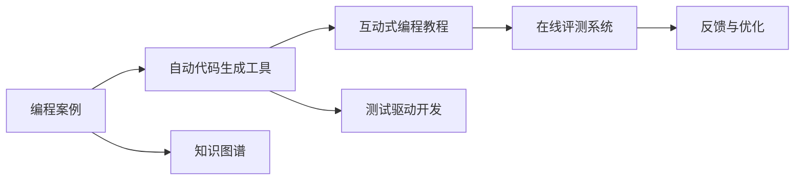

                 

## 1. 背景介绍

在IT教育领域，编程案例教学一直是主流教学手段之一。编程案例通常涉及具体的编程问题，以及相应的算法和数据结构，要求学生能够理解和实现其中的技术细节。然而，传统的编程案例教学往往以讲授为主，缺乏互动性，难以激发学生的学习兴趣和思考能力。因此，如何将编程案例转化为互动式编程教程，使其能够更好地促进学生自学和掌握编程技能，成为当前教学方法改革的一个重要方向。

## 2. 核心概念与联系

### 2.1 核心概念概述

为了实现编程案例的互动式教学，需要引入几个关键的概念和技术：

- **编程案例(Programming Case)**：指具体编程问题及其解决方法，通常包括问题描述、输入输出示例、算法思路、代码实现等。编程案例是编程教学的基础，也是实现互动式编程教程的起点。
- **互动式编程教程(Interactive Programming Tutorial)**：指在教学过程中通过交互式的方式引导学生理解和解决问题的教学方法。通过互动式编程教程，学生可以在学习过程中实时调试代码，理解算法思路，提高学习效率。
- **自动代码生成工具(AutoCode Generation Tool)**：指能够根据问题描述自动生成代码的辅助工具，能够大大简化编程案例的实现过程，降低学习门槛。
- **测试驱动开发(Test-Driven Development, TDD)**：指在编程过程中，先编写测试用例，然后实现代码以满足测试要求，从而提高代码质量和可维护性的开发方式。TDD结合互动式编程教程，能够帮助学生在编写代码之前，先理解问题的测试需求，从而更高效地编写代码。
- **知识图谱(Knowledge Graph)**：指将问题、算法、代码等知识点进行结构化组织，形成图谱结构的教学工具。知识图谱能够帮助学生构建系统的知识体系，促进深层次的学习和理解。

### 2.2 核心概念原理和架构的 Mermaid 流程图

这个流程图展示了编程案例转化为互动式编程教程的过程：

1. **编程案例**作为教学的起点，通过**自动代码生成工具**生成代码模板。
2. **测试驱动开发**结合**互动式编程教程**，指导学生先理解测试需求，再逐步实现代码。
3. **知识图谱**作为辅助工具，帮助学生构建知识体系，加深理解。
4. **在线评测系统**提供即时反馈，帮助学生发现和修正代码问题。
5. **反馈与优化**环节，通过系统评估和学生反馈，不断改进互动式编程教程的体验。

## 3. 核心算法原理 & 具体操作步骤

### 3.1 算法原理概述

互动式编程教程的核心算法原理基于交互式学习和程序调试技术。其核心思想是，通过引导学生逐步编写代码、调试程序、理解算法，最终实现对编程案例的理解和掌握。

### 3.2 算法步骤详解

#### 3.2.1 自动代码生成

自动代码生成工具能够根据问题描述，生成初步的代码模板。这通常包括：

- **问题描述解析**：将问题描述中的关键信息提取出来，如输入输出格式、算法思路等。
- **代码框架生成**：根据解析出的关键信息，生成代码的框架，如函数定义、输入输出语句等。
- **代码填充**：指导学生逐步填充代码中的空白部分，如算法实现细节、边界条件处理等。

#### 3.2.2 测试驱动开发

TDD结合互动式编程教程，通过以下步骤实现：

1. **编写测试用例**：根据问题描述，编写测试用例，描述正确的输出结果。
2. **运行测试用例**：将测试用例作为输入，运行程序，获取实际输出结果。
3. **调试程序**：根据测试结果，逐步调整代码，直到通过所有测试用例。
4. **迭代优化**：在调试过程中，逐步优化代码，提升程序的正确性和可读性。

#### 3.2.3 知识图谱构建

知识图谱的构建通过以下步骤实现：

1. **知识点提取**：从问题描述、算法思路、代码实现中，提取关键知识点。
2. **图谱结构构建**：将知识点组织成图谱结构，形成概念图或知识图谱。
3. **节点链接**：将知识点链接起来，形成知识网络，便于学生理解和记忆。

#### 3.2.4 在线评测与反馈

在线评测系统的实现包括以下步骤：

1. **代码提交与运行**：学生提交代码后，系统自动运行代码，获取输出结果。
2. **测试用例验证**：将输出结果与测试用例进行比较，判断是否通过测试。
3. **即时反馈**：根据测试结果，系统即时提供反馈，指出代码中的错误和改进建议。
4. **优化迭代**：学生根据反馈信息，调整代码，再次提交测试。

### 3.3 算法优缺点

互动式编程教程具有以下优点：

- **互动性增强**：通过实时调试和即时反馈，学生可以更好地理解问题，提高学习效率。
- **学习路径优化**：通过测试驱动开发，学生能够逐步掌握编程技能，避免盲目编写代码。
- **知识体系构建**：通过知识图谱，学生可以构建系统的知识体系，形成结构化的思维模式。

同时，也存在一些缺点：

- **开发成本高**：互动式编程教程的实现需要开发自动代码生成工具、测试驱动开发环境、在线评测系统等，开发成本较高。
- **技术依赖强**：互动式编程教程的实现需要依赖先进的计算机技术和网络技术，对硬件和软件环境要求较高。
- **学习曲线陡峭**：对于初学者而言，互动式编程教程的学习曲线可能较陡峭，需要一定的技术基础。

### 3.4 算法应用领域

互动式编程教程在以下领域具有广泛的应用前景：

- **计算机科学教育**：在高校计算机科学课程中，互动式编程教程能够提高学生的编程能力和算法思维。
- **职业培训**：在软件开发、数据科学等职业培训中，互动式编程教程能够帮助学员快速掌握实用技能，提高就业竞争力。
- **在线教育**：在MOOC、在线编程课程等在线教育平台中，互动式编程教程能够提供丰富的学习资源和互动体验。
- **游戏开发**：在游戏编程中，互动式编程教程能够帮助开发者快速构建游戏原型，验证算法和逻辑的正确性。
- **教育技术研究**：在教育技术研究领域，互动式编程教程能够提供实验数据和理论支撑，推动教育技术的发展。

## 4. 数学模型和公式 & 详细讲解 & 举例说明

### 4.1 数学模型构建

互动式编程教程的数学模型构建涉及以下内容：

- **问题描述**：通过自然语言描述问题，提取关键信息。
- **测试用例设计**：根据问题描述，设计测试用例，描述正确的输出结果。
- **算法分析**：对问题进行分析，选择合适的算法。
- **代码实现**：将算法转化为代码，逐步实现算法。

### 4.2 公式推导过程

以一个简单的排序问题为例，推导测试用例和代码实现的数学模型：

1. **问题描述**：对一组整数进行排序。
2. **测试用例设计**：设计测试用例，描述排序前后的整数序列。
3. **算法分析**：选择插入排序算法，分析算法时间复杂度和空间复杂度。
4. **代码实现**：实现插入排序算法，逐步添加代码实现细节。

### 4.3 案例分析与讲解

通过一个具体的案例，讲解互动式编程教程的实现过程：

1. **自动代码生成**：根据问题描述，生成代码框架，提示学生填充代码细节。
2. **测试驱动开发**：指导学生编写测试用例，逐步调试代码，实现排序算法。
3. **知识图谱构建**：将问题描述、算法分析、代码实现组织成知识图谱，帮助学生理解算法思路。
4. **在线评测与反馈**：学生提交代码，系统自动运行并反馈测试结果，指导学生调整代码。

## 5. 项目实践：代码实例和详细解释说明

### 5.1 开发环境搭建

开发互动式编程教程需要以下工具：

1. **编程语言**：Python、Java、C++等主流编程语言。
2. **开发环境**：Jupyter Notebook、PyCharm、VSCode等IDE。
3. **自动代码生成工具**：使用Python的模板引擎，如Jinja2、Pyramid等，或JavaScript库，如Jest、Prettier等。
4. **在线评测系统**：使用Python的Flask、Django等Web框架，或JavaScript的Node.js、Express等框架。

### 5.2 源代码详细实现

以下是一个简单的Python互动式编程教程的实现示例：

1. **自动代码生成**：使用Jinja2模板引擎，生成代码框架。
2. **测试驱动开发**：使用unittest模块，编写测试用例，逐步调试代码。
3. **知识图谱构建**：使用Graphviz库，生成概念图。
4. **在线评测与反馈**：使用Flask框架，搭建在线评测系统，提供即时反馈。

### 5.3 代码解读与分析

对自动代码生成、测试驱动开发、知识图谱构建、在线评测与反馈的代码进行详细解读和分析，重点在于展示如何通过代码实现这些关键功能。

### 5.4 运行结果展示

展示互动式编程教程的运行结果，包括代码输出、测试用例通过率、知识图谱展示等，验证互动式编程教程的效果。

## 6. 实际应用场景

### 6.1 计算机科学教育

互动式编程教程在计算机科学教育中具有重要应用价值，能够提高学生的编程能力和算法思维。例如，在数据结构课程中，可以设计互动式编程教程，让学生通过实际操作，理解链表、树、图等数据结构的特点和应用。

### 6.2 职业培训

在软件开发、数据科学等职业培训中，互动式编程教程能够帮助学员快速掌握实用技能，提高就业竞争力。例如，在Web开发课程中，可以使用互动式编程教程，引导学员逐步实现Web应用，理解前后端开发的技术细节。

### 6.3 在线教育

在MOOC、在线编程课程等在线教育平台中，互动式编程教程能够提供丰富的学习资源和互动体验。例如，在Python编程课程中，可以设计互动式编程教程，让学生通过互动练习，掌握Python的语法和常用库。

### 6.4 游戏开发

在游戏编程中，互动式编程教程能够帮助开发者快速构建游戏原型，验证算法和逻辑的正确性。例如，在3D游戏开发中，可以使用互动式编程教程，指导开发者逐步实现游戏逻辑，理解游戏引擎和物理引擎的运用。

### 6.5 教育技术研究

在教育技术研究领域，互动式编程教程能够提供实验数据和理论支撑，推动教育技术的发展。例如，在智能教育研究中，可以使用互动式编程教程，研究学生在学习过程中的行为和心理变化，优化教学方法和策略。

## 7. 工具和资源推荐

### 7.1 学习资源推荐

1. **《编程珠玑》**：讲解编程问题的经典著作，包含大量编程案例和算法分析。
2. **《算法导论》**：算法学习的经典教材，包含详细的算法分析和实现方法。
3. **《Python编程快速上手》**：Python编程语言学习的入门书籍，包含大量编程练习和示例。
4. **《算法竞赛入门经典》**：算法竞赛学习的经典书籍，包含大量算法题和解题思路。
5. **《编程珠玑》配套在线课程**：讲解编程问题的在线课程，结合互动式编程教程，帮助学生更好地理解问题。

### 7.2 开发工具推荐

1. **Python**：Python是当前最流行的编程语言之一，拥有丰富的第三方库和工具支持。
2. **Jupyter Notebook**：Jupyter Notebook是Python编程的常用工具，支持代码编写和交互式计算。
3. **PyCharm**：PyCharm是Python编程的IDE工具，提供丰富的开发环境和调试工具。
4. **VSCode**：VSCode是跨平台的IDE工具，支持多种编程语言和扩展。
5. **Django**：Django是Python的Web框架，支持快速开发Web应用。
6. **Flask**：Flask是Python的轻量级Web框架，适合快速开发小型的Web应用。

### 7.3 相关论文推荐

1. **《教育技术中的互动式学习研究》**：探讨互动式学习在教育中的应用，分析其优缺点。
2. **《基于测试驱动开发的编程教学研究》**：研究测试驱动开发在编程教学中的应用，分析其效果和影响。
3. **《自动代码生成技术综述》**：综述自动代码生成技术的最新进展，分析其应用前景。
4. **《知识图谱在教育中的应用》**：探讨知识图谱在教育中的应用，分析其对学习效果的影响。

## 8. 总结：未来发展趋势与挑战

### 8.1 研究成果总结

互动式编程教程在提高编程能力和算法思维方面具有显著效果，能够显著提升学生的学习效率和编程水平。目前，该技术已经广泛应用于计算机科学教育和职业培训中，取得了良好的教学效果。

### 8.2 未来发展趋势

1. **自动化程度提高**：未来互动式编程教程将更加自动化，能够自动生成代码框架、设计测试用例、构建知识图谱等，降低教师的工作量，提高教学效率。
2. **个性化推荐**：通过数据分析和机器学习技术，实现个性化的编程案例推荐，帮助学生根据自身水平选择适合的案例。
3. **多模态融合**：结合视觉、音频等多模态信息，实现更丰富的编程案例互动体验。
4. **云端协作**：实现云端编程和协作，学生可以在远程环境下共同编写代码，分享学习心得。
5. **社会化学习**：通过社交网络等工具，实现学生之间的互动和交流，促进知识共享和学习进步。

### 8.3 面临的挑战

互动式编程教程在推广和应用过程中仍面临一些挑战：

1. **开发成本高**：互动式编程教程的开发需要一定的技术基础和开发经验，对教师和学生都提出了较高的要求。
2. **技术门槛高**：互动式编程教程需要掌握多种技术和工具，对学生和教师的技术能力提出了挑战。
3. **资源投入大**：互动式编程教程需要大量的学习资源和硬件设备，增加了教学成本。
4. **适应性差**：不同的课程和教学目标需要不同的互动式编程教程，缺乏统一的开发标准和规范。
5. **学习负担重**：学生需要在互动式编程教程中投入大量的时间和精力，可能会增加学习负担。

### 8.4 研究展望

未来，互动式编程教程需要进一步探索和改进，解决现有的问题和挑战，推动教育技术的不断发展。

1. **开发标准化**：建立互动式编程教程的开发标准和规范，提高开发的可移植性和可维护性。
2. **技术普及化**：推广互动式编程教程的开发和应用技术，降低技术门槛，提高普及率。
3. **资源共享**：建立互动式编程教程的资源共享平台，提供丰富的学习资源和互动体验。
4. **评估体系完善**：建立互动式编程教程的评估体系，分析其效果和影响，指导课程设计和改进。
5. **前沿技术引入**：引入前沿的AI技术，如自然语言处理、计算机视觉等，丰富互动式编程教程的内容和形式。

## 9. 附录：常见问题与解答

**Q1: 如何设计互动式编程教程？**

A: 设计互动式编程教程需要以下步骤：

1. **问题描述**：详细描述编程案例的问题背景和需求。
2. **测试用例设计**：根据问题描述，设计测试用例，描述正确的输出结果。
3. **算法分析**：选择适合的算法，进行算法分析和设计。
4. **代码实现**：逐步实现算法，填写代码细节。
5. **自动代码生成**：使用自动代码生成工具，生成代码框架，提示学生填充代码。
6. **测试驱动开发**：使用TDD，编写测试用例，逐步调试代码。
7. **知识图谱构建**：使用知识图谱工具，构建知识图谱，帮助学生理解算法思路。
8. **在线评测与反馈**：使用在线评测系统，提供即时反馈，指导学生调整代码。

**Q2: 自动代码生成工具有哪些？**

A: 自动代码生成工具有很多，以下是几个常用的工具：

1. **Jinja2**：Python的模板引擎，支持动态生成代码框架。
2. **Jest**：JavaScript的测试框架，支持自动生成测试代码。
3. **Prettier**：JavaScript的代码格式化工具，支持自动生成代码。
4. **Pyramid**：Python的Web框架，支持自动生成Web应用代码。
5. **Python**：Python语言的自动代码生成工具，支持动态生成代码。

**Q3: 如何实现测试驱动开发？**

A: 实现测试驱动开发需要以下步骤：

1. **编写测试用例**：根据问题描述，设计测试用例，描述正确的输出结果。
2. **运行测试用例**：使用测试框架，运行测试用例，获取输出结果。
3. **调试代码**：根据测试结果，逐步调整代码，直到通过所有测试用例。
4. **迭代优化**：在调试过程中，逐步优化代码，提升代码质量和可读性。

**Q4: 如何构建知识图谱？**

A: 构建知识图谱需要以下步骤：

1. **知识点提取**：从问题描述、算法思路、代码实现中，提取关键知识点。
2. **图谱结构构建**：将知识点组织成图谱结构，形成概念图或知识图谱。
3. **节点链接**：将知识点链接起来，形成知识网络，便于学生理解和记忆。

**Q5: 互动式编程教程的优缺点是什么？**

A: 互动式编程教程的优缺点如下：

优点：

1. **互动性增强**：通过实时调试和即时反馈，学生可以更好地理解问题，提高学习效率。
2. **学习路径优化**：通过测试驱动开发，学生能够逐步掌握编程技能，避免盲目编写代码。
3. **知识体系构建**：通过知识图谱，学生可以构建系统的知识体系，形成结构化的思维模式。

缺点：

1. **开发成本高**：互动式编程教程的实现需要开发自动代码生成工具、测试驱动开发环境、在线评测系统等，开发成本较高。
2. **技术依赖强**：互动式编程教程的实现需要依赖先进的计算机技术和网络技术，对硬件和软件环境要求较高。
3. **学习曲线陡峭**：对于初学者而言，互动式编程教程的学习曲线可能较陡峭，需要一定的技术基础。

---

作者：禅与计算机程序设计艺术 / Zen and the Art of Computer Programming

