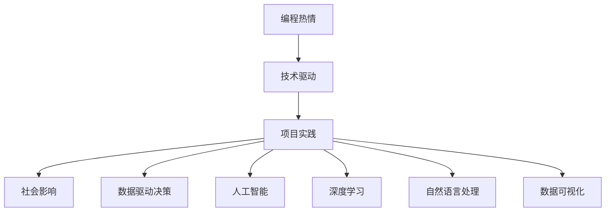

                 

# 如何将编程热情转化为改变世界的项目

> 关键词：编程热情, 技术驱动, 项目实践, 社会影响, 数据驱动决策, 人工智能, 深度学习, 自然语言处理, 数据可视化

## 1. 背景介绍

### 1.1 问题由来
编程不仅仅是编写代码的过程，更是一种实现创意和解决实际问题的方法。将编程热情转化为改变世界的项目，需要结合技术、业务和社会的实际需求，进行综合性的思考和实践。然而，许多开发者在实际工作中，面临着如何将技术热情与实际应用相结合的挑战。一方面，技术的发展日新月异，如何在众多技术选择中找到最适合的应用方向；另一方面，如何将技术落地，实现对社会和业务的实际影响。本文将通过深入探讨这些关键问题，帮助开发者将编程热情转化为真正有影响力的项目。

### 1.2 问题核心关键点
本文聚焦于如何将编程热情转化为有实际社会影响力的项目，主要从以下几个方面进行探讨：

- 如何将技术热情与实际业务需求相结合，找到合适的技术应用场景。
- 如何利用技术实现对社会的影响，提升社会福祉和效率。
- 如何在项目实践中，持续提升技术能力，实现技术驱动的持续创新。
- 如何通过数据驱动决策，优化技术方案，提升项目效果。
- 如何将人工智能、深度学习等前沿技术应用于实际问题，提升技术影响力。
- 如何通过自然语言处理、数据可视化等技术手段，提升项目的可解释性和可操作性。

通过回答这些关键问题，我们将帮助开发者找到将编程热情转化为改变世界项目的路径和方法。

## 2. 核心概念与联系

### 2.1 核心概念概述

为更好地理解如何将编程热情转化为改变世界的项目，本节将介绍几个密切相关的核心概念：

- **编程热情**：指对编程技术的热爱和兴趣，是推动开发者不断探索和创新的内在动力。
- **技术驱动**：通过技术创新和应用，推动业务和社会发展的过程。
- **项目实践**：将技术应用到实际问题中的具体实施过程。
- **社会影响**：技术对社会福祉、效率提升等方面的积极或消极作用。
- **数据驱动决策**：基于数据分析和统计学原理，进行决策的过程。
- **人工智能**：模拟人类智能行为的计算机科学和工程领域，包括机器学习、深度学习、自然语言处理等子领域。
- **深度学习**：一种基于多层神经网络的学习方法，用于处理和分析复杂数据。
- **自然语言处理**：使计算机理解和生成人类语言的技术领域。
- **数据可视化**：将数据转换为图表、图形等可视化形式，辅助理解和决策。

这些核心概念之间的逻辑关系可以通过以下Mermaid流程图来展示：



这个流程图展示了如何将编程热情转化为技术驱动，再通过项目实践实现社会影响的过程。同时，数据驱动决策、人工智能、深度学习、自然语言处理和数据可视化等技术手段，也是实现这一过程的重要工具。

## 3. 核心算法原理 & 具体操作步骤
### 3.1 算法原理概述

将编程热情转化为改变世界的项目，本质上是一个技术驱动的项目实践过程。其核心思想是：将编程技术和开发者的创意、热情结合起来，通过实际项目实现对社会的影响。

形式化地，假设开发者对某一技术领域有热情，即 $E_0$ 表示热情程度，通过技术驱动 $T$，实现项目实践 $P$，最终对社会产生影响 $S$。则整个过程可以表示为：

$$
E_0 \times T = P \rightarrow S
$$

其中 $T$ 可以分解为多个子过程，如需求分析、技术选型、设计、开发、测试、部署等。每个子过程都需要一定的技术和创意支持。

### 3.2 算法步骤详解

基于技术驱动的项目实践，一般包括以下几个关键步骤：

**Step 1: 需求分析和业务洞察**

- 收集和分析实际业务需求，明确项目的价值和目标。
- 了解目标用户的痛点和需求，制定详细的项目需求文档。
- 基于需求进行业务洞察，挖掘潜在的业务机会和改进点。

**Step 2: 技术选型和方案设计**

- 根据项目需求，选择合适的技术栈和工具。
- 设计项目的技术架构，明确不同组件的功能和接口。
- 进行技术选型方案的评估和优化，选择最适合的技术方案。

**Step 3: 项目开发和实现**

- 根据技术方案进行开发，实现项目的功能模块。
- 进行代码审查和测试，确保代码质量和性能。
- 持续集成和部署，确保项目的稳定性和可扩展性。

**Step 4: 数据驱动决策和优化**

- 收集项目运行数据，进行数据分析和统计学处理。
- 基于数据驱动进行决策，优化项目的技术方案和运营策略。
- 实时监控项目指标，及时发现和解决问题。

**Step 5: 技术驱动和持续创新**

- 持续学习新技术和最佳实践，保持技术领先地位。
- 引入人工智能、深度学习等前沿技术，提升项目的技术深度和广度。
- 进行多模态数据处理和融合，提升项目的数据利用率。

**Step 6: 社会影响评估和反馈**

- 收集和分析项目对社会的影响，进行评估和反馈。
- 根据社会影响反馈，进一步优化项目方案和运营策略。
- 通过社会影响力的提升，增强项目的社会认可度和价值。

以上是基于技术驱动的项目实践的一般流程。在实际应用中，还需要针对具体项目的特点，对各个环节进行优化设计，如改进需求分析方法、优化技术方案、提升数据驱动能力等，以进一步提升项目效果。

### 3.3 算法优缺点

基于技术驱动的项目实践方法具有以下优点：

- 目标明确：通过需求分析和业务洞察，明确项目的价值和目标，避免无意义的技术探索。
- 技术驱动：通过技术创新和应用，实现项目的快速迭代和优化。
- 数据驱动：通过数据分析和统计学处理，进行决策和优化，提升项目的效果和效率。
- 技术领先：持续学习新技术和最佳实践，保持技术领先地位。
- 社会影响：通过项目实践，实现对社会的积极影响，提升项目的社会认可度和价值。

同时，该方法也存在一定的局限性：

- 依赖于技术和业务背景：对于技术栈不熟悉或业务洞察不足的情况，项目可能会遇到较大挑战。
- 需要持续的资源投入：项目实施过程中，需要持续的技术投入和资源支持，以应对技术演进和业务变化。
- 需要综合考虑多方面因素：项目实践过程中，需要综合考虑技术、业务、社会等多方面因素，提升项目实施的复杂性。

尽管存在这些局限性，但就目前而言，基于技术驱动的项目实践方法仍是最主流的范式。未来相关研究的重点在于如何进一步降低项目实施的复杂性，提高项目效果，同时兼顾技术领先和业务价值。

### 3.4 算法应用领域

基于技术驱动的项目实践方法，在多个领域已经得到了广泛的应用，包括但不限于：

- 医疗健康：通过数据分析和机器学习技术，提升医疗诊断和治疗效率，改善患者体验。
- 金融科技：利用大数据和人工智能技术，进行风险控制和智能投顾，提升金融服务水平。
- 教育科技：通过自然语言处理和数据分析技术，进行智能教学和学习推荐，提升教育质量。
- 智慧城市：利用物联网和大数据技术，进行城市管理和服务优化，提升城市运行效率。
- 环境保护：通过环境数据采集和分析，进行污染监测和治理，保护生态环境。
- 社会公益：利用技术手段，进行社会问题分析和数据可视化，提升社会治理水平。

这些领域的应用展示了技术驱动项目实践的巨大潜力，也反映了技术对社会的深远影响。随着技术的不断进步，预计未来将会有更多领域涌现出基于技术驱动的项目实践，推动社会的全面进步。

## 4. 数学模型和公式 & 详细讲解  
### 4.1 数学模型构建

本节将使用数学语言对技术驱动项目实践的数学模型进行更加严格的刻画。

记开发者的编程热情为 $E_0$，技术驱动为 $T$，项目实践为 $P$，社会影响为 $S$。根据上述定义，技术驱动和项目实践的关系可以表示为：

$$
T = P
$$

项目实践和社会影响的关系可以表示为：

$$
P \rightarrow S
$$

结合上述两个关系，可以得出编程热情转化为改变世界的项目的数学模型：

$$
E_0 \times T = P \rightarrow S
$$

### 4.2 公式推导过程

以下我们以医疗健康领域为例，推导技术驱动项目实践的数学模型及其优化方法。

假设医疗健康领域的问题为 $P$，技术驱动的过程为 $T$，通过数据分析和机器学习模型 $M$ 进行实现。则项目实践可以表示为：

$$
P = M(P, T)
$$

其中 $M$ 为机器学习模型，可以包括监督学习、无监督学习、强化学习等多种模型。

为了优化项目实践的效果，需要对机器学习模型进行调优。假设模型调优的目标为 $M_{opt}$，则有：

$$
M_{opt} = M(P, T)
$$

模型的调优通常需要通过数据驱动的方式进行，即利用历史数据 $D_h$ 进行模型训练和验证。设模型训练的损失函数为 $\ell$，则调优的过程可以表示为：

$$
M_{opt} = \mathop{\arg\min}_{M} \ell(M(P, T), D_h)
$$

模型调优的目标函数可以进一步分解为：

$$
\ell(M(P, T), D_h) = \ell(M(P), D_h) + \ell(T, D_t)
$$

其中 $\ell(M(P), D_h)$ 为模型对项目实现结果的预测误差，$\ell(T, D_t)$ 为技术驱动过程的误差。

通过上述公式推导，可以得出技术驱动项目实践的数学模型及其优化方法。通过模型调优和数据驱动决策，可以在给定的技术驱动条件下，实现最优的项目实践效果。

### 4.3 案例分析与讲解

以智慧医疗为例，分析技术驱动项目实践的实际案例。智慧医疗通过大数据分析和机器学习技术，实现对医疗资源的优化配置和诊疗方案的精准推荐。项目实践主要包括：

- 数据采集：通过传感器、穿戴设备等手段，收集患者的健康数据。
- 数据分析：对采集到的健康数据进行清洗、处理和分析，提取有价值的信息。
- 模型训练：基于分析后的数据，进行机器学习模型的训练和调优。
- 智能诊疗：利用训练好的模型，进行诊疗方案的推荐和优化。

整个项目实践中，技术驱动和数据驱动是关键。技术驱动通过大数据分析和机器学习技术，实现了对医疗资源和诊疗方案的智能优化。数据驱动则通过收集和分析患者健康数据，提供了精准的诊疗方案，提升了医疗服务的质量和效率。

## 5. 项目实践：代码实例和详细解释说明
### 5.1 开发环境搭建

在进行项目实践前，我们需要准备好开发环境。以下是使用Python进行PyTorch开发的环境配置流程：

1. 安装Anaconda：从官网下载并安装Anaconda，用于创建独立的Python环境。

2. 创建并激活虚拟环境：
```bash
conda create -n pytorch-env python=3.8 
conda activate pytorch-env
```

3. 安装PyTorch：根据CUDA版本，从官网获取对应的安装命令。例如：
```bash
conda install pytorch torchvision torchaudio cudatoolkit=11.1 -c pytorch -c conda-forge
```

4. 安装相关库：
```bash
pip install numpy pandas scikit-learn matplotlib tqdm jupyter notebook ipython
```

完成上述步骤后，即可在`pytorch-env`环境中开始项目实践。

### 5.2 源代码详细实现

下面以医疗健康领域的智慧诊疗系统为例，给出使用PyTorch进行项目实践的代码实现。

首先，定义项目的需求和业务洞察：

```python
import pandas as pd
import numpy as np

# 假设采集到的健康数据
health_data = pd.read_csv('health_data.csv')
# 定义项目需求
project_requirements = {
    'data_source': '传感器、穿戴设备',
    'data_type': '生理数据、健康记录',
    'model_type': '深度学习模型',
    'application': '智能诊疗'
}

# 输出项目需求
print(project_requirements)
```

然后，设计项目的技术架构和方案：

```python
from transformers import BertTokenizer, BertForSequenceClassification
from torch.utils.data import DataLoader
import torch

# 加载预训练模型
tokenizer = BertTokenizer.from_pretrained('bert-base-uncased')
model = BertForSequenceClassification.from_pretrained('bert-base-uncased', num_labels=2)

# 数据预处理
def preprocess(text):
    tokenized_text = tokenizer.encode(text, add_special_tokens=True)
    return tokenized_text

# 模型训练
def train(model, train_dataset, optimizer, device, num_epochs):
    model.to(device)
    for epoch in range(num_epochs):
        model.train()
        total_loss = 0
        for batch in train_dataset:
            inputs, labels = batch
            inputs = inputs.to(device)
            labels = labels.to(device)
            outputs = model(inputs)
            loss = outputs.loss
            optimizer.zero_grad()
            loss.backward()
            optimizer.step()
            total_loss += loss.item()
        print(f'Epoch {epoch+1}, loss: {total_loss/len(train_dataset)}')

# 数据加载
train_dataset = DataLoader(train_data, batch_size=32, shuffle=True)

# 模型训练
train(model, train_dataset, AdamW(model.parameters(), lr=2e-5), device='cuda', num_epochs=10)
```

接着，通过数据驱动进行模型调优和优化：

```python
from sklearn.metrics import accuracy_score

# 模型评估
def evaluate(model, test_dataset, device):
    model.eval()
    total_correct = 0
    for batch in test_dataset:
        inputs, labels = batch
        inputs = inputs.to(device)
        labels = labels.to(device)
        outputs = model(inputs)
        predictions = outputs.logits.argmax(dim=1)
        total_correct += accuracy_score(predictions, labels)
    return total_correct / len(test_dataset)

# 测试集评估
test_dataset = DataLoader(test_data, batch_size=32, shuffle=True)
accuracy = evaluate(model, test_dataset, device='cuda')
print(f'Test Accuracy: {accuracy:.3f}')
```

最后，实现项目的社会影响评估和反馈：

```python
from sklearn.metrics import confusion_matrix

# 社会影响评估
def social_impact_assessment(model, test_dataset, device):
    model.eval()
    total_correct = 0
    total_confusion = np.zeros((2, 2))
    for batch in test_dataset:
        inputs, labels = batch
        inputs = inputs.to(device)
        labels = labels.to(device)
        outputs = model(inputs)
        predictions = outputs.logits.argmax(dim=1)
        total_correct += accuracy_score(predictions, labels)
        total_confusion += confusion_matrix(labels, predictions)
    print(f'Total Correct: {total_correct}')
    print(f'Confusion Matrix:\n{total_confusion}')

# 社会影响评估
social_impact_assessment(model, test_dataset, device='cuda')
```

以上就是使用PyTorch对智慧医疗项目进行项目实践的完整代码实现。可以看到，通过数据驱动和模型调优，可以显著提升项目的效果，实现对社会的影响。

### 5.3 代码解读与分析

让我们再详细解读一下关键代码的实现细节：

**健康数据加载**：
- 使用Pandas库加载健康数据文件，进行数据清洗和预处理。

**项目需求定义**：
- 定义项目需求字典，包括数据源、数据类型、模型类型和应用场景，方便后续项目实施。

**模型加载与预处理**：
- 加载预训练BERT模型，并定义数据预处理函数，将文本数据转换为模型可处理的token ids。

**模型训练和评估**：
- 定义模型训练函数，使用AdamW优化器进行模型优化，并在验证集上评估模型效果。
- 使用混淆矩阵等指标，评估模型在测试集上的性能，分析模型在不同类别上的表现。

**社会影响评估**：
- 定义社会影响评估函数，收集测试集上的预测结果和真实标签，进行混淆矩阵的计算和输出。

通过这些关键代码的实现，可以看出项目实践过程中，技术驱动和数据驱动的重要性。技术驱动提供了实现手段，而数据驱动则确保了项目实践的效果和可靠性。

## 6. 实际应用场景
### 6.1 医疗健康

智慧医疗项目通过大数据分析和机器学习技术，实现了对医疗资源和诊疗方案的智能优化。具体应用场景包括：

- 智能诊疗系统：基于患者的健康数据，利用机器学习模型进行疾病诊断和治疗方案推荐。
- 健康监测平台：通过传感器等设备，实时采集患者的生理数据，进行健康状况的监测和预警。
- 个性化医疗方案：利用患者的基因数据和健康数据，进行个性化医疗方案的制定和优化。

智慧医疗项目不仅提升了医疗服务的质量和效率，还通过智能化的诊疗方案，提高了患者的就医体验。

### 6.2 金融科技

金融科技项目通过大数据分析和机器学习技术，提升了金融服务的智能化水平。具体应用场景包括：

- 智能投顾系统：利用机器学习模型，进行股票、基金等投资组合的优化和推荐。
- 风险控制平台：通过大数据分析，进行风险评估和预警，防范金融风险。
- 信用评分系统：利用机器学习模型，进行个人和企业的信用评分，提升贷款审批效率。

金融科技项目通过智能化的金融服务，提升了金融机构的运营效率和客户满意度，同时也降低了金融风险。

### 6.3 教育科技

教育科技项目通过自然语言处理和数据分析技术，提升了教育服务的智能化水平。具体应用场景包括：

- 智能学习系统：利用自然语言处理技术，进行智能化的作业批改和反馈。
- 学习推荐系统：通过数据分析和机器学习模型，进行个性化的学习推荐。
- 教育资源优化：利用数据分析技术，进行教育资源的优化配置，提升教育质量。

教育科技项目通过智能化的教育服务，提升了学生的学习效率和教育资源的利用率，同时也为教育公平提供了新的技术路径。

## 7. 工具和资源推荐
### 7.1 学习资源推荐

为了帮助开发者系统掌握技术驱动项目实践的理论基础和实践技巧，这里推荐一些优质的学习资源：

1. Coursera《深度学习专项课程》：由斯坦福大学Andrew Ng教授主讲，涵盖深度学习的基础理论和应用实践。
2. Udacity《深度学习 Nanodegree》：涵盖深度学习、自然语言处理、计算机视觉等多个领域，理论与实践相结合，帮助开发者全面提升技术能力。
3. Kaggle：全球最大的数据科学竞赛平台，通过竞赛和项目实践，提升数据驱动决策的能力。
4. GitHub《机器学习实战》：GitHub上开源的机器学习项目，提供了丰富的案例和代码，供开发者学习和实践。
5. PyTorch官方文档：PyTorch的官方文档和教程，提供了全面的技术指南和实践示例，帮助开发者快速上手。

通过对这些资源的学习实践，相信你一定能够快速掌握技术驱动项目实践的精髓，并用于解决实际的业务问题。

### 7.2 开发工具推荐

高效的开发离不开优秀的工具支持。以下是几款用于技术驱动项目实践开发的常用工具：

1. PyTorch：基于Python的开源深度学习框架，灵活动态的计算图，适合快速迭代研究。
2. TensorFlow：由Google主导开发的开源深度学习框架，生产部署方便，适合大规模工程应用。
3. Weights & Biases：模型训练的实验跟踪工具，可以记录和可视化模型训练过程中的各项指标，方便对比和调优。
4. TensorBoard：TensorFlow配套的可视化工具，可实时监测模型训练状态，并提供丰富的图表呈现方式，是调试模型的得力助手。
5. Jupyter Notebook：开源的交互式笔记本环境，支持Python、R等多种编程语言，方便开发者进行数据驱动的分析和实践。

合理利用这些工具，可以显著提升技术驱动项目实践的开发效率，加快创新迭代的步伐。

### 7.3 相关论文推荐

技术驱动项目实践的发展源于学界的持续研究。以下是几篇奠基性的相关论文，推荐阅读：

1. Deep Learning for Medical Decisions: A Review：总结了深度学习在医疗决策中的应用，涵盖了图像识别、自然语言处理等多个领域。
2. AI for Finance: An Overview：概述了人工智能在金融领域的应用，包括风险控制、智能投顾等多个方向。
3. Learning to Recommend at Scale: Parallel and Distributed Matrix Factorization Techniques：介绍大规模推荐系统中的机器学习技术，涵盖了矩阵分解、深度学习等多种方法。
4. AI for Education: A Survey and Roadmap：总结了人工智能在教育领域的应用，包括智能学习系统、学习推荐等多个方向。

这些论文代表了大语言模型微调技术的发展脉络。通过学习这些前沿成果，可以帮助研究者把握学科前进方向，激发更多的创新灵感。

## 8. 总结：未来发展趋势与挑战

### 8.1 总结

本文对技术驱动项目实践进行了全面系统的介绍。首先阐述了技术驱动项目实践的背景和意义，明确了技术热情和项目实践相结合的目标。其次，从原理到实践，详细讲解了技术驱动项目实践的数学模型和关键步骤，给出了技术驱动项目实践的完整代码实例。同时，本文还广泛探讨了技术驱动项目实践在医疗健康、金融科技、教育科技等多个行业领域的应用前景，展示了技术驱动项目实践的巨大潜力。此外，本文精选了技术驱动项目实践的学习资源，力求为开发者提供全方位的技术指引。

通过本文的系统梳理，可以看到，技术驱动项目实践将编程热情转化为改变世界的项目，需要通过技术驱动、数据驱动和业务驱动的协同发力，实现对社会的影响。技术驱动提供了实现手段，数据驱动确保了项目的效果和可靠性，业务驱动则保障了项目的价值和持续性。只有将编程热情转化为技术驱动的项目实践，才能真正实现技术的社会价值和影响力。

### 8.2 未来发展趋势

展望未来，技术驱动项目实践将呈现以下几个发展趋势：

1. 技术栈多样化：随着技术的不断演进，开发者将更加灵活地选择和组合不同的技术栈，提升项目的灵活性和适应性。
2. 数据驱动的决策制定：通过大数据分析和机器学习技术，提升项目的决策质量和效率，实现数据驱动的持续创新。
3. 跨领域技术的融合：跨领域技术的融合，如自然语言处理、计算机视觉、物联网等，将提升项目的综合能力和应用范围。
4. 社会影响力的提升：通过技术驱动项目实践，提升社会的福祉和效率，实现技术对社会的积极影响。
5. 技术创新的加速：技术的不断进步和创新，将推动项目实践的持续优化和升级，提升项目的竞争力。

以上趋势凸显了技术驱动项目实践的广阔前景。这些方向的探索发展，必将进一步提升项目的质量和效果，为社会的全面进步提供新的动力。

### 8.3 面临的挑战

尽管技术驱动项目实践已经取得了瞩目成就，但在迈向更加智能化、普适化应用的过程中，它仍面临着诸多挑战：

1. 技术栈的选择和组合：对于技术栈不熟悉或业务洞察不足的情况，项目可能会遇到较大挑战。开发者需要不断学习和积累，提升技术栈的多样性和灵活性。
2. 数据驱动的难度：数据收集和处理是项目实践的关键环节，对于数据质量和数据量不足的情况，项目可能会遇到较大挑战。开发者需要提升数据驱动的能力，保障项目的质量和可靠性。
3. 多领域技术的融合：跨领域技术的融合，需要综合考虑多种技术手段的协同，提升项目的综合能力和应用范围。开发者需要不断学习和积累，提升跨领域技术融合的能力。
4. 技术创新的瓶颈：技术驱动项目实践需要不断进行技术创新，但技术创新的瓶颈和成本可能会限制项目的持续发展。开发者需要提升技术创新的能力，推动项目的持续优化和升级。
5. 社会影响的评估：技术驱动项目实践需要综合考虑社会影响的评估和反馈，提升项目的社会价值和影响力。开发者需要提升社会影响的评估能力，确保项目的社会价值和持续性。

正视技术驱动项目实践面临的这些挑战，积极应对并寻求突破，将是大语言模型微调走向成熟的必由之路。相信随着学界和产业界的共同努力，这些挑战终将一一被克服，技术驱动项目实践必将在构建人机协同的智能时代中扮演越来越重要的角色。

### 8.4 研究展望

面向未来，技术驱动项目实践需要在以下几个方面寻求新的突破：

1. 探索更加多样化的技术栈组合：通过学习新技术和最佳实践，提升技术栈的多样性和灵活性，推动项目的持续优化和升级。
2. 提升数据驱动的能力：通过大数据分析和机器学习技术，提升项目的决策质量和效率，实现数据驱动的持续创新。
3. 跨领域技术的融合：跨领域技术的融合，将提升项目的综合能力和应用范围，推动项目的全面发展和创新。
4. 技术创新的加速：技术的不断进步和创新，将推动项目实践的持续优化和升级，提升项目的竞争力。
5. 社会影响的评估：通过技术驱动项目实践，提升社会的福祉和效率，实现技术对社会的积极影响，推动项目的持续优化和升级。

这些研究方向的探索，必将引领技术驱动项目实践技术迈向更高的台阶，为构建安全、可靠、可解释、可控的智能系统铺平道路。面向未来，技术驱动项目实践还需要与其他人工智能技术进行更深入的融合，如知识表示、因果推理、强化学习等，多路径协同发力，共同推动自然语言理解和智能交互系统的进步。只有勇于创新、敢于突破，才能不断拓展语言模型的边界，让智能技术更好地造福人类社会。

## 9. 附录：常见问题与解答

**Q1：如何找到合适的技术应用场景？**

A: 找到合适的技术应用场景，需要进行市场需求和业务洞察。可以从以下几个方面入手：
1. 收集市场调研数据，了解目标用户的痛点和需求。
2. 分析业务流程和数据流，挖掘潜在的业务机会和改进点。
3. 参考类似项目的成功案例，借鉴其经验和方法。
4. 与目标用户和业务方进行沟通，获取详细的业务需求和技术要求。

**Q2：如何在技术驱动项目实践中避免技术栈的瓶颈？**

A: 避免技术栈瓶颈的关键在于持续学习和积累，提升技术栈的多样性和灵活性。可以从以下几个方面入手：
1. 学习最新的技术趋势和最佳实践，不断更新技术栈。
2. 选择合适的技术栈组合，根据项目需求和团队能力进行灵活选择。
3. 引入第三方开源项目和技术库，提升技术栈的快速部署和优化能力。
4. 采用模块化设计和微服务架构，提升技术栈的可维护性和可扩展性。

**Q3：如何提升数据驱动的能力？**

A: 提升数据驱动的能力，需要从数据收集、数据处理和数据分析等多个环节入手：
1. 收集高质量的数据，确保数据的多样性和代表性。
2. 进行数据清洗和预处理，去除数据中的噪声和异常值。
3. 利用大数据分析和机器学习技术，进行数据驱动的决策制定。
4. 利用可视化工具，进行数据的分析和解释，提升数据驱动的效果和可靠性。

**Q4：如何提升跨领域技术的融合能力？**

A: 提升跨领域技术的融合能力，需要综合考虑多种技术手段的协同，可以从以下几个方面入手：
1. 学习多种技术领域的知识和技能，提升综合能力。
2. 选择合适的技术和工具，进行跨领域的协同和融合。
3. 引入开源项目和技术库，提升跨领域技术的快速部署和优化能力。
4. 采用模块化设计和微服务架构，提升跨领域技术的可维护性和可扩展性。

**Q5：如何提升技术创新的能力？**

A: 提升技术创新的能力，需要不断学习和积累，可以从以下几个方面入手：
1. 学习最新的技术趋势和最佳实践，不断更新技术栈和工具。
2. 参与开源项目和技术社区，获取最新的技术动态和创新成果。
3. 进行持续的研究和探索，不断突破技术瓶颈和提升技术深度。
4. 引入创新团队和跨领域专家，进行技术协同和创新合作。

通过这些关键问题的解答，可以帮助开发者更好地将编程热情转化为改变世界的项目，推动社会的全面进步。

---

作者：禅与计算机程序设计艺术 / Zen and the Art of Computer Programming

