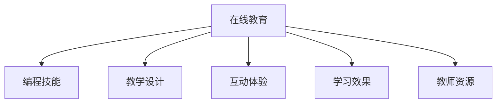

                 

# 如何将编程经验转化为在线训练营

> 关键词：在线教育,编程技能,教学设计,互动体验,学习效果

## 1. 背景介绍

### 1.1 问题由来

随着互联网的普及和技术的进步，在线教育已成为一种主流学习方式。特别是在编程领域，大量的在线课程和训练营帮助初学者和进阶者提升技能，同时在线教育平台也为教育机构和讲师提供了新的教学模式和商业机会。然而，在线教育的效果并不总是令人满意。学生对课程的参与度、学习效果以及讲师与学生的互动等问题仍困扰着在线教育的发展。

### 1.2 问题核心关键点

在线教育的核心在于如何将编程经验转化为易于理解和应用的教学内容，同时提升学生的学习动力和互动性。常见的挑战包括：

1. **内容冗余和枯燥**：传统在线课程往往过于理论化，缺乏实战练习。
2. **互动不足**：在线课程缺乏面对面的互动，难以实时解决学生的疑问。
3. **个性化不足**：大规模在线课程难以针对学生的个性化需求进行定制。
4. **学习效果评估困难**：传统的考试和测验无法全面评估学生的编程能力。
5. **教师资源有限**：高质量的编程教师资源有限，难以满足大量学生的需求。

### 1.3 问题研究意义

开发高效、互动性强、个性化和易于评估的在线训练营，对于提升编程教育的普及度和质量，具有重要意义：

1. **提升学生参与度**：通过丰富的互动和实战练习，提高学生对编程课程的兴趣和参与度。
2. **提升学习效果**：通过个性化的学习路径和实时反馈，帮助学生更高效地掌握编程技能。
3. **提升教师效率**：通过自动化的教学工具，减轻教师的工作负担，使其专注于教学和互动。
4. **降低教育成本**：通过在线平台降低场地和资源成本，让更多人能接触到高质量的编程教育。
5. **促进教育创新**：通过技术手段创新教学模式，推动编程教育的数字化转型。

## 2. 核心概念与联系

### 2.1 核心概念概述

为更好地理解如何将编程经验转化为在线训练营，本节将介绍几个密切相关的核心概念：

- **在线教育**：基于互联网的教育模式，能够提供灵活的学习时间和地点，打破传统教育的地理和时间的限制。
- **编程技能**：编程语言和工具的使用技能，包括算法设计、代码编写、调试等。
- **教学设计**：根据学习者的特点和需求，设计教学内容和互动方式，以达到最佳的教学效果。
- **互动体验**：通过互动练习、实时反馈等方式，提升学生的参与感和学习动力。
- **学习效果**：通过测试、项目评估等方式，全面评估学生的学习效果和编程能力。
- **教师资源**：指能够教授编程技能的专业教师和助教，包括在线讲师和实体教师。

这些核心概念之间的逻辑关系可以通过以下Mermaid流程图来展示：



这个流程图展示了这个系统的核心概念及其之间的关系：

1. 在线教育作为平台和载体，提供编程技能的教学。
2. 教学设计决定课程内容和互动方式。
3. 互动体验增强学生的参与感和学习动力。
4. 学习效果评估学生的学习成果和进步。
5. 教师资源保障高质量的教学和互动。

## 3. 核心算法原理 & 具体操作步骤

### 3.1 算法原理概述

在线训练营的核心在于将编程经验转化为易于理解和应用的教学内容，同时提升学生的学习动力和互动性。这涉及以下关键步骤：

1. **内容设计**：将编程知识分解为易于理解的小模块，并通过实战练习巩固。
2. **互动设计**：设计实时互动环节，如代码评估、讨论区、直播互动等，增强学生的参与感。
3. **个性化教学**：根据学生的学习进度和理解情况，调整教学内容和节奏，实现个性化教学。
4. **学习效果评估**：通过项目评估、代码评审等手段，全面评估学生的学习效果和编程能力。
5. **教师资源优化**：通过技术手段和工具，提高教师的教学效率和互动能力。

### 3.2 算法步骤详解

以下是将编程经验转化为在线训练营的具体操作步骤：

**Step 1: 确定课程目标和内容**
- 根据市场需求和学生需求，确定课程的目标和内容。
- 将编程技能分解为若干个模块，每个模块涵盖特定的知识点和实战练习。

**Step 2: 设计互动环节**
- 设计实时互动环节，如代码评估、讨论区、直播互动等。
- 引入游戏化元素，如编程挑战、排行榜、积分等，提升学生的参与度。

**Step 3: 实现个性化教学**
- 通过学生学习数据（如成绩、答题时间等），分析学生的学习情况和难点。
- 根据分析结果，调整教学内容和节奏，提供个性化的学习路径和推荐。

**Step 4: 开发在线平台**
- 开发交互式编程界面和实时互动功能，提供代码编写、运行和调试工具。
- 集成在线讨论区、直播互动等功能，促进学生之间的交流和合作。

**Step 5: 开发学习效果评估工具**
- 设计多维度的评估标准，如代码质量、项目完成度、实时反馈等。
- 开发自动化的评估工具，如代码评审系统、项目评估工具等。

**Step 6: 优化教师资源**
- 引入先进的教学工具和平台，如AI助教、自动生成练习等。
- 定期培训教师，提高其教学技巧和互动能力。

### 3.3 算法优缺点

在线训练营的优点包括：

1. **灵活性和便利性**：学生可以在任何时间和地点学习，打破了时间和地点的限制。
2. **互动性和参与度**：实时互动和游戏化元素增强了学生的参与感，提高了学习效果。
3. **个性化教学**：通过数据分析和个性化调整，提供更贴合学生需求的学习路径。
4. **成本效益**：在线平台降低了场地和资源成本，使得教育资源更加普及。

但该方法也存在以下局限性：

1. **对技术依赖**：开发和维护在线平台需要较高的技术投入。
2. **个性化不足**：虽然个性化教学有提升，但无法完全满足每个学生的独特需求。
3. **教师资源有限**：高质量教师资源有限，难以满足大量学生的需求。
4. **学习效果评估困难**：自动化评估工具虽然方便，但无法完全替代人工评审。

## 4. 数学模型和公式 & 详细讲解 & 举例说明

### 4.1 数学模型构建

本节将使用数学语言对在线训练营的学习效果评估模型进行更加严格的刻画。

记学生学习数据为 $D=\{(x_i,y_i)\}_{i=1}^N$，其中 $x_i$ 为学生的学习数据（如成绩、答题时间等），$y_i$ 为学生的学习效果评估指标（如项目完成度、代码质量等）。

定义学生学习效果评估模型为 $f(x_i; \theta)$，其中 $\theta$ 为模型参数。评估模型的目标是最小化评估误差，即：

$$
\theta^* = \mathop{\arg\min}_{\theta} \sum_{i=1}^N (y_i - f(x_i; \theta))^2
$$

在实践中，我们通常使用最小二乘法或梯度下降等优化算法来近似求解上述最优化问题。

### 4.2 公式推导过程

以下我们以项目评估为例，推导评估模型的最小二乘法解：

设评估指标为项目完成度 $y_i$，学习数据为学生学习时间 $x_i$。则最小二乘法的评估模型可表示为：

$$
f(x_i; \theta) = \theta_0 + \theta_1 x_i
$$

其中 $\theta_0$ 为截距，$\theta_1$ 为斜率。

由最小二乘法的目标函数可得：

$$
\sum_{i=1}^N (y_i - (\theta_0 + \theta_1 x_i))^2
$$

通过求偏导数，解得：

$$
\theta_1 = \frac{\sum_{i=1}^N (y_i - \bar{y})(x_i - \bar{x})}{\sum_{i=1}^N (x_i - \bar{x})^2}
$$

$$
\theta_0 = \bar{y} - \theta_1 \bar{x}
$$

其中 $\bar{x} = \frac{1}{N}\sum_{i=1}^N x_i$，$\bar{y} = \frac{1}{N}\sum_{i=1}^N y_i$。

### 4.3 案例分析与讲解

以Python编程为例，分析在线训练营的评估模型。

假设学生在完成一个项目时，需要提交代码、项目文档和演示视频。教师根据代码质量、项目完成度和演示效果进行综合评估，得到评分 $y_i$。学生在学习过程中记录了学习时间和代码修改次数等学习数据 $x_i$。

1. **数据准备**：收集学生提交的代码、项目文档和演示视频，提取关键指标（如代码行数、错误数、演示效果等），计算学生的项目完成度 $y_i$。同时记录学生的学习数据 $x_i$。

2. **模型训练**：使用最小二乘法或梯度下降等优化算法，训练评估模型 $f(x_i; \theta)$，求得 $\theta_0$ 和 $\theta_1$。

3. **学习效果评估**：将学生的新学习数据 $x_{new}$ 输入评估模型，得到新的评估指标 $y_{predict}$。通过对比 $y_{predict}$ 和 $y_i$，评估学生的新学习效果。

通过这种评估模型，在线训练营可以实时监控学生的学习进度和效果，及时调整教学策略，提升整体学习效果。

## 5. 项目实践：代码实例和详细解释说明

### 5.1 开发环境搭建

在进行训练营开发前，我们需要准备好开发环境。以下是使用Python进行Flask框架开发的环境配置流程：

1. 安装Anaconda：从官网下载并安装Anaconda，用于创建独立的Python环境。

2. 创建并激活虚拟环境：
```bash
conda create -n train-camp python=3.8 
conda activate train-camp
```

3. 安装Flask：
```bash
pip install Flask
```

4. 安装其他必需的Python包：
```bash
pip install Flask-WTF Flask-SocketIO Flask-Uploads
```

5. 安装相关的Web前端框架：
```bash
pip install Bootstrap Socket.IO-Client
```

完成上述步骤后，即可在`train-camp`环境中开始训练营开发。

### 5.2 源代码详细实现

下面以一个简单的在线编程练习平台为例，展示如何使用Flask框架实现实时互动和个性化教学：

首先，创建一个Flask应用，并引入必要的模块：

```python
from flask import Flask, render_template, request, jsonify
from flask_socketio import SocketIO
from flask_wtf import FlaskForm
from wtforms import StringField, SubmitField, TextAreaField
from wtforms.validators import DataRequired

app = Flask(__name__)
socketio = SocketIO(app)
```

然后，定义用户注册和登录表单：

```python
class UserForm(FlaskForm):
    username = StringField('Username', validators=[DataRequired()])
    password = PasswordField('Password', validators=[DataRequired()])
    submit = SubmitField('Submit')

@app.route('/login', methods=['GET', 'POST'])
def login():
    form = UserForm()
    if form.validate_on_submit():
        # 登录处理
        return jsonify({'status': 'success'})
    return render_template('login.html', form=form)
```

接着，定义实时互动和代码评估功能：

```python
class CodeEvaluationForm(FlaskForm):
    code = TextAreaField('Code', validators=[DataRequired()])
    submit = SubmitField('Submit')

@app.route('/evaluate', methods=['POST'])
def evaluate_code():
    form = CodeEvaluationForm()
    if form.validate_on_submit():
        code = form.code.data
        # 评估代码并返回结果
        return jsonify({'result': 'success'})
    return jsonify({'status': 'error'})

@socketio.on('code submission')
def handle_code_submission(data):
    # 接收代码提交
    code = data['code']
    # 实时评估代码并返回结果
    result = evaluate_code(code)
    socketio.emit('code result', {'result': result})
```

最后，启动应用并实现个性化教学：

```python
if __name__ == '__main__':
    socketio.run(app, debug=True)
```

在这个例子中，我们使用了Flask和SocketIO实现了实时代码提交和评估功能。通过Flask表单收集用户输入的代码，并使用SocketIO实现实时的代码提交和评估。当代码被提交时，触发SocketIO事件，评估代码并返回结果。

## 6. 实际应用场景

### 6.1 在线编程练习平台

在线编程练习平台是训练营的核心应用场景之一。它提供了实时代码提交、自动评估和可视化反馈等功能，帮助学生巩固编程技能。

在技术实现上，可以结合Flask和SocketIO等工具，开发实时互动的编程练习平台。平台支持多种编程语言和编辑器，学生可以自由选择喜欢的编程工具。平台提供丰富的编程练习题，涵盖算法、数据结构、Web开发等多个方向。通过实时评估和可视化反馈，学生可以及时了解自己的学习效果和不足之处。

### 6.2 在线项目实战平台

在线项目实战平台帮助学生将理论知识应用于实际项目，提升实战能力。通过构建真实项目的开发环境，学生可以在平台上进行项目设计和开发，并获得导师的实时指导和反馈。

平台可以集成版本控制系统（如Git）、问题跟踪系统（如JIRA）和团队协作工具（如Slack），支持多人协作开发。学生可以在项目开发过程中实时提交代码、撰写文档和讨论问题，导师可以实时审查代码、提出建议并进行反馈。通过这种实践教学方式，学生可以更好地理解和应用编程知识。

### 6.3 在线编程社区

在线编程社区提供了一个交流、学习和分享的平台，帮助学生扩展知识面，提升编程能力。社区可以包含编程问答、项目分享、技术讨论等多个功能模块。

社区平台可以集成Markdown编辑器、代码高亮和实时预览功能，方便用户撰写和分享技术文章和项目代码。平台支持实时讨论和问答功能，用户可以提出问题并获得社区成员的解答。通过这种互动学习方式，学生可以不断扩展自己的知识面，提升编程能力。

## 7. 工具和资源推荐

### 7.1 学习资源推荐

为了帮助开发者系统掌握编程训练营的开发技术，这里推荐一些优质的学习资源：

1. Flask官方文档：Flask框架的官方文档，提供了详细的教程和API参考。
2. SocketIO官方文档：SocketIO库的官方文档，提供了丰富的API和示例代码。
3. Bootstrap官方文档：Bootstrap前端框架的官方文档，提供了全面的组件和样式说明。
4. Web前端开发教程：如《Web前端开发入门》，帮助开发者掌握Web前端开发技术。
5. 《Python Web开发实战》书籍：介绍了Python Web开发的各种技术和工具，适合进阶开发者阅读。

通过对这些资源的学习实践，相信你一定能够快速掌握编程训练营的开发技术，并用于解决实际的在线教育问题。

### 7.2 开发工具推荐

高效的开发离不开优秀的工具支持。以下是几款用于编程训练营开发的常用工具：

1. Flask：基于Python的开源Web框架，灵活易用，适合快速迭代研究。
2. SocketIO：基于WebSocket的实时通信库，支持实时数据交换和事件驱动。
3. Bootstrap：前端UI框架，提供丰富的组件和样式，提升页面美观和交互性。
4. JIRA：问题跟踪系统，支持团队协作和项目管理。
5. Git：版本控制系统，支持代码版本管理和协作开发。
6. Slack：即时通讯工具，支持团队协作和沟通。

合理利用这些工具，可以显著提升编程训练营的开发效率，加快创新迭代的步伐。

### 7.3 相关论文推荐

编程训练营的发展源于学界的持续研究。以下是几篇奠基性的相关论文，推荐阅读：

1. **《面向高阶思维技能发展的翻转课堂教学模式研究》**：探讨翻转课堂在编程教育中的应用，强调互动和个性化教学。
2. **《基于问题解决的编程教育模型》**：介绍问题解决教学法在编程教育中的实施，提升学生的问题分析和解决能力。
3. **《大规模在线编程教育的评估与反馈机制研究》**：讨论在线编程教育中的评估和反馈机制，提升学习效果。
4. **《基于机器学习的在线编程教育评估》**：通过机器学习技术进行在线编程教育的评估和改进，提升教学效果。

这些论文代表了大规模在线编程教育的发展脉络。通过学习这些前沿成果，可以帮助研究者把握学科前进方向，激发更多的创新灵感。

## 8. 总结：未来发展趋势与挑战

### 8.1 总结

本文对将编程经验转化为在线训练营的方法进行了全面系统的介绍。首先阐述了在线教育的核心问题及其背景，明确了编程训练营在提升学生学习动力和互动性方面的独特价值。其次，从原理到实践，详细讲解了编程训练营的数学模型和核心操作步骤，给出了具体的代码实例。同时，本文还探讨了编程训练营在在线编程练习、项目实战和编程社区等多个场景中的应用前景，展示了编程训练营的广阔应用范围。最后，本文精选了编程训练营开发的相关资源，力求为读者提供全方位的技术指引。

通过本文的系统梳理，可以看到，编程训练营通过将编程经验转化为易于理解和应用的教学内容，有效提升了学生的学习效果和互动性。未来，随着技术的不断进步和应用场景的不断拓展，编程训练营必将在教育领域发挥更大的作用，推动编程教育的数字化转型。

### 8.2 未来发展趋势

展望未来，编程训练营的发展趋势如下：

1. **技术融合与创新**：编程训练营将更多地融合人工智能、大数据等技术，提升教学效果和个性化教学能力。
2. **多平台协同**：编程训练营将实现多平台协同，支持桌面、移动和Web等多种终端设备，满足不同用户的需求。
3. **实时反馈与评估**：通过实时反馈和自动评估工具，提升学生学习效果和评估准确性。
4. **虚拟现实与增强现实**：利用VR/AR技术，提供沉浸式的编程学习和实践体验。
5. **游戏化与个性化**：通过游戏化元素和个性化教学路径，提升学生的学习动力和效果。
6. **社会化与协作**：支持社区交流和协作开发，提升学生的团队合作和项目实战能力。

以上趋势凸显了编程训练营在技术创新和教育模式创新方面的巨大潜力。这些方向的探索发展，必将进一步提升编程训练营的教学效果和应用范围，为编程教育的普及和提升提供新的突破。

### 8.3 面临的挑战

尽管编程训练营在教育领域展现了巨大的潜力，但在迈向更加智能化、普适化应用的过程中，它仍面临诸多挑战：

1. **技术门槛高**：开发和维护在线平台需要较高的技术投入，需要具备一定的编程和网络技术基础。
2. **个性化不足**：虽然个性化教学有提升，但无法完全满足每个学生的独特需求。
3. **互动效果有限**：实时互动和实时反馈虽然有助于提升学生参与感，但在大规模应用时可能存在瓶颈。
4. **学习效果评估困难**：自动化评估工具虽然方便，但无法完全替代人工评审。
5. **教师资源有限**：高质量教师资源有限，难以满足大量学生的需求。
6. **数据安全和隐私**：在线平台需要保障数据安全和隐私，避免用户数据泄露。

正视这些挑战，积极应对并寻求突破，将是大规模在线编程教育走向成熟的必由之路。相信随着学界和产业界的共同努力，这些挑战终将一一被克服，编程训练营必将在构建智能学习平台中扮演越来越重要的角色。

### 8.4 研究展望

面对编程训练营所面临的挑战，未来的研究需要在以下几个方面寻求新的突破：

1. **探索无监督和半监督训练方法**：摆脱对大规模标注数据的依赖，利用自监督学习、主动学习等无监督和半监督范式，最大限度利用非结构化数据，实现更加灵活高效的编程训练营。
2. **研究参数高效和计算高效的微调范式**：开发更加参数高效的微调方法，在固定大部分预训练参数的同时，只更新极少量的任务相关参数。同时优化微调模型的计算图，减少前向传播和反向传播的资源消耗，实现更加轻量级、实时性的部署。
3. **融合因果和对比学习范式**：通过引入因果推断和对比学习思想，增强编程训练营建立稳定因果关系的能力，学习更加普适、鲁棒的语言表征，从而提升模型泛化性和抗干扰能力。
4. **引入更多先验知识**：将符号化的先验知识，如知识图谱、逻辑规则等，与神经网络模型进行巧妙融合，引导编程训练营过程学习更准确、合理的编程模型。同时加强不同模态数据的整合，实现视觉、语音等多模态信息与文本信息的协同建模。
5. **结合因果分析和博弈论工具**：将因果分析方法引入编程训练营模型，识别出模型决策的关键特征，增强输出解释的因果性和逻辑性。借助博弈论工具刻画人机交互过程，主动探索并规避模型的脆弱点，提高系统稳定性。
6. **纳入伦理道德约束**：在模型训练目标中引入伦理导向的评估指标，过滤和惩罚有偏见、有害的输出倾向。同时加强人工干预和审核，建立模型行为的监管机制，确保输出符合人类价值观和伦理道德。

这些研究方向的探索，必将引领编程训练营技术迈向更高的台阶，为编程教育的普及和提升提供新的突破。面向未来，编程训练营技术还需要与其他人工智能技术进行更深入的融合，如知识表示、因果推理、强化学习等，多路径协同发力，共同推动编程教育的进步。只有勇于创新、敢于突破，才能不断拓展编程训练营的边界，让智能技术更好地造福编程教育。

## 9. 附录：常见问题与解答

**Q1：编程训练营是否适用于所有编程教育场景？**

A: 编程训练营适用于大多数编程教育场景，特别是大规模在线编程教育。但对于一些特定领域的应用，如专业编程技能培训、个性化编程辅导等，可能还需要结合其他教育方式和工具。

**Q2：如何选择合适的编程语言和工具？**

A: 选择编程语言和工具应根据学生的学习目标和需求来确定。对于初学者，建议选择简单易学的编程语言，如Python、JavaScript等；对于进阶开发者，可以选择Java、C++等更复杂的语言。同时，选择工具时也要考虑平台的兼容性、社区支持和扩展性。

**Q3：编程训练营的互动效果如何提升？**

A: 提升编程训练营的互动效果，可以从以下几个方面入手：
1. 设计实时互动环节，如代码评估、讨论区、直播互动等。
2. 引入游戏化元素，如编程挑战、排行榜、积分等，提升学生的参与感。
3. 使用先进的技术工具，如自动生成练习、AI助教等，提高互动效率和质量。
4. 定期举办线上和线下的编程比赛、黑客松等活动，增强学生的互动和合作能力。

**Q4：如何评估编程训练营的学习效果？**

A: 评估编程训练营的学习效果，可以从以下几个方面入手：
1. 使用多维度的评估标准，如代码质量、项目完成度、实时反馈等。
2. 开发自动化的评估工具，如代码评审系统、项目评估工具等。
3. 定期进行学习效果调研和反馈，了解学生的需求和建议，不断优化课程内容和互动方式。
4. 结合导师和社区的反馈，进行综合评估，全面了解学生的学习效果和编程能力。

**Q5：编程训练营在落地部署时需要注意哪些问题？**

A: 编程训练营在落地部署时，需要注意以下几个问题：
1. 数据安全和隐私：保障用户数据的安全和隐私，避免数据泄露和滥用。
2. 系统稳定性和可用性：确保系统的稳定性和高可用性，避免服务中断和用户体验差。
3. 用户体验和界面设计：提升用户体验和界面设计，提高学生的使用感受和满意度。
4. 扩展性和可维护性：考虑系统的扩展性和可维护性，支持未来的功能扩展和升级。
5. 持续改进和优化：定期收集用户反馈和数据分析，不断改进和优化编程训练营的功能和体验。

通过合理解决这些问题，可以确保编程训练营的顺利部署和运行，为用户提供高质量的编程教育服务。

---

作者：禅与计算机程序设计艺术 / Zen and the Art of Computer Programming

