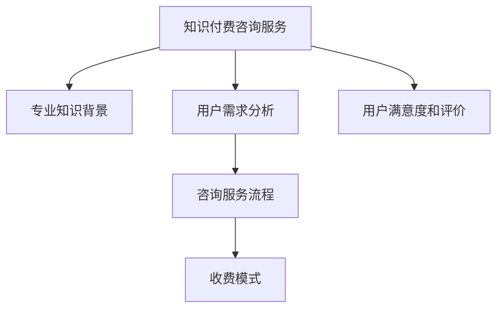

                 

# 如何打造个人知识付费咨询服务

## 1. 背景介绍

在信息爆炸的时代，知识不再是稀缺资源，但高质量、专业化的知识仍然具有巨大价值。个人知识付费咨询服务，就是通过专业知识和技能，为用户提供针对性解决方案的收费服务。通过这种方式，专业人士可以分享其独特见解，创造高价值内容，实现自我增值和用户满意。

### 1.1 问题由来

知识付费咨询服务的兴起，源于知识经济的发展和人们对于高质量信息的需求。传统的一对一咨询服务往往价格高昂、供给有限，而互联网平台则降低了知识获取的门槛，使更多人能够接触到专业内容。

### 1.2 问题核心关键点

知识付费咨询服务的核心在于：

1. 知识内容的专业性。服务内容需要基于深厚的专业知识背景，具备权威性和实用性。
2. 用户需求的对接。服务应精准捕捉用户问题，提供针对性的解决方案。
3. 用户体验的满意度。通过良好的交流方式和反馈机制，提高用户的使用体验。
4. 收费模式的合理性。明确收费标准，提供清晰的价值主张，确保用户支付的价值。
5. 服务运营的效率。高效的管理和运营，确保服务能够持续、稳定地提供。

### 1.3 问题研究意义

打造个人知识付费咨询服务，不仅有助于提升个人品牌价值，还可以通过收费模式实现经济回报。同时，服务本身能够推动知识传播，促进社会知识水平提升。对于个人来说，通过咨询服务实现自我价值最大化，对于用户来说，能够快速获取高质量的专业信息，双方均可受益。

## 2. 核心概念与联系

### 2.1 核心概念概述

为更好理解知识付费咨询服务的构建流程，本节将介绍几个密切相关的核心概念：

- **知识付费咨询服务**：通过收费方式提供的专业知识咨询服务。服务形式多样，包括一对一咨询、远程在线答疑、电话沟通、视频会议等。
- **专业知识背景**：咨询师在特定领域长期积累的知识、经验和技能。
- **用户需求分析**：通过问卷、访谈等方式，深入了解用户的具体问题和需求，确保服务的精准对接。
- **咨询服务流程**：从问题搜集、需求分析、内容创作、交流沟通到用户反馈的完整服务流程。
- **收费模式**：根据服务形式和内容，确定合理的收费标准，如按次收费、按小时收费、包月订阅等。
- **用户满意度和评价**：通过用户反馈和评价，不断优化服务内容和流程，提升用户体验。

这些概念之间的逻辑关系可以通过以下Mermaid流程图来展示：



这个流程图展示出知识付费咨询服务构建的核心要素及其之间的关系：

1. 咨询师的知识背景是服务的基础。
2. 用户需求分析决定了服务的精准度。
3. 咨询服务流程保障了服务的完整性和有效性。
4. 收费模式影响服务的市场接受度。
5. 用户满意度和评价是服务持续改进的动力。

## 3. 核心算法原理 & 具体操作步骤

### 3.1 算法原理概述

知识付费咨询服务的构建，本质上是一个数据驱动的过程。通过对用户需求和专业知识的分析，制定合理的策略和流程，使用机器学习算法优化服务质量和用户体验。

形式化地，假设咨询师的知识库为 $K$，用户需求集合为 $D$，咨询服务流程为 $P$，收费模式为 $M$，目标是最小化用户不满意度 $U$，即：

$$
\min_{K,D,P,M} U(K,D,P,M)
$$

其中 $U$ 为满意度函数，根据用户的反馈和评价计算得出。

### 3.2 算法步骤详解

基于数据驱动的知识付费咨询服务构建，一般包括以下几个关键步骤：

**Step 1: 建立专业知识库**
- 收集咨询师在各领域的知识、技能和经验，整理成文档或数据库。
- 对知识进行分类和索引，便于查询和使用。
- 定期更新知识库，确保内容的最新和权威。

**Step 2: 用户需求分析**
- 设计问卷、访谈等方式，广泛收集用户需求和痛点。
- 使用文本分析、情感分析等技术，从用户反馈中提取关键信息。
- 结合领域专家意见，筛选出最具价值的需求点。

**Step 3: 制定咨询服务流程**
- 确定服务流程的各阶段，如需求分析、内容创作、交流沟通、反馈改进等。
- 设计每个阶段的具体步骤和操作，确保流程的科学性和可操作性。
- 根据服务流程，配置相应的技术工具和平台支持。

**Step 4: 选择收费模式**
- 根据服务内容和形式，选择合适的收费标准和模式，如按次收费、按小时收费、包月订阅等。
- 设计合理的定价策略，确保服务的可持续性和市场竞争力。
- 提供清晰的价值主张，让用户明确服务内容和使用价值。

**Step 5: 实施并优化**
- 将知识库和咨询流程部署到技术平台，如SaaS平台、App等。
- 收集用户反馈，使用机器学习算法进行用户满意度分析，不断优化服务内容和方法。
- 定期更新和维护服务流程和知识库，确保服务的持续性和高效性。

以上是构建知识付费咨询服务的步骤和流程，但具体实施时还需结合实际情况和需求，灵活调整和优化。

### 3.3 算法优缺点

知识付费咨询服务的构建具有以下优点：

1. 专业性强。咨询师的知识库和经验为服务提供了坚实的专业基础。
2. 市场接受度高。通过收费模式，用户支付了对知识的价值认可。
3. 用户个性化高。根据用户需求定制服务内容，提供个性化解决方案。
4. 技术支持好。借助SaaS平台、App等技术工具，提升了服务的便捷性和可靠性。

同时，该方法也存在一些局限性：

1. 对咨询师要求高。需要咨询师具备较强的专业知识和技术能力。
2. 用户需求复杂。用户需求多样，需要灵活应对和处理。
3. 服务质量依赖于技术实现。技术平台和工具的优劣直接影响服务效果。
4. 收费标准不确定。需要根据市场和用户反馈不断调整，确定合理的收费模式。

尽管存在这些局限性，但知识付费咨询服务作为新型的知识服务形式，仍具有广阔的发展前景和应用价值。

### 3.4 算法应用领域

知识付费咨询服务的应用领域非常广泛，包括但不限于：

- **企业管理咨询**：提供战略规划、组织结构优化、人力资源管理等方面的专业建议。
- **医疗健康咨询**：提供疾病诊断、健康管理、心理辅导等个性化健康建议。
- **教育培训咨询**：提供学科辅导、职业规划、考试指导等教育服务。
- **财经金融咨询**：提供投资理财、财务规划、市场分析等专业意见。
- **法律咨询**：提供合同审核、法律诉讼、风险评估等法律服务。
- **信息技术咨询**：提供软件开发、系统架构、技术选型等方面的专业建议。
- **人力资源咨询**：提供招聘策略、绩效评估、团队建设等方面的专业服务。

随着互联网技术和用户需求的不断变化，知识付费咨询服务的市场将不断扩大，应用领域也将不断丰富。

## 4. 数学模型和公式 & 详细讲解 & 举例说明

### 4.1 数学模型构建

知识付费咨询服务构建的数学模型，主要涉及用户满意度分析。假设满意度函数 $U$ 为：

$$
U = f(\text{专业知识}_k, \text{用户需求}_d, \text{服务流程}_p, \text{收费模式}_m)
$$

其中 $f$ 为满意度函数，可根据用户反馈和评价进行拟合和优化。

### 4.2 公式推导过程

满意度函数 $U$ 的推导过程如下：

设 $x$ 为咨询师的知识库中的知识元素，$y$ 为用户的当前需求，$\text{Conformity}(x,y)$ 表示知识库中 $x$ 与用户需求 $y$ 的匹配度，则满意度函数可表示为：

$$
U = \sum_{x \in K} \sum_{y \in D} \text{Conformity}(x,y) \cdot \text{Satisfaction}(x,y)
$$

其中 $\text{Satisfaction}(x,y)$ 为知识与需求匹配度的满意度评分，可采用线性回归、逻辑回归等方法进行建模。

### 4.3 案例分析与讲解

以企业管理咨询为例，分析如何通过知识付费咨询服务解决企业问题。

假设某企业面临市场需求下降、成本上升的问题，咨询师可收集并整理相关的市场调研报告、成本分析模型等知识。通过问卷和访谈，深入了解企业需求，识别出具体问题和挑战。根据企业需求，制定咨询服务流程，包括市场分析、成本优化、运营调整等。根据服务内容和形式，选择合适的收费模式，如按次收费或包月订阅。在实施过程中，收集企业反馈，通过满意度评分模型不断优化服务内容和流程。

通过这种方式，咨询师不仅能够提供高质量的咨询服务，还能不断提升自身知识和技能，形成良性循环。

## 5. 项目实践：代码实例和详细解释说明

### 5.1 开发环境搭建

在进行知识付费咨询服务开发前，我们需要准备好开发环境。以下是使用Python进行Web开发的环境配置流程：

1. 安装Python：从官网下载并安装Python，推荐使用3.x版本。
2. 安装Web框架：如Django、Flask等，用于开发Web应用。
3. 安装数据库：如MySQL、PostgreSQL等，用于存储用户数据和知识库信息。
4. 安装依赖库：如TensorFlow、PyTorch等，用于机器学习和数据分析。
5. 安装Web服务器：如Nginx、Apache等，用于部署Web应用。

完成上述步骤后，即可在开发环境中开始服务构建。

### 5.2 源代码详细实现

下面以企业管理咨询为例，给出使用Django框架构建知识付费咨询服务的Python代码实现。

首先，定义用户模型和知识库模型：

```python
from django.db import models

class User(models.Model):
    name = models.CharField(max_length=50)
    email = models.EmailField(unique=True)
    company = models.CharField(max_length=100)
    phone = models.CharField(max_length=20, blank=True)

class Knowledge(models.Model):
    title = models.CharField(max_length=200)
    content = models.TextField()
    category = models.CharField(max_length=100)
    author = models.ForeignKey(User, on_delete=models.CASCADE)
    date_created = models.DateTimeField(auto_now_add=True)
```

接着，定义用户需求和咨询服务流程：

```python
class UserRequest(models.Model):
    user = models.ForeignKey(User, on_delete=models.CASCADE)
    title = models.CharField(max_length=200)
    description = models.TextField()
    status = models.CharField(max_length=20)
    date_created = models.DateTimeField(auto_now_add=True)

class ConsultationProcess(models.Model):
    request = models.ForeignKey(UserRequest, on_delete=models.CASCADE)
    phase = models.CharField(max_length=20)
    description = models.TextField()
    date_created = models.DateTimeField(auto_now_add=True)
```

然后，设计机器学习模型进行满意度评分：

```python
from sklearn.linear_model import LinearRegression

class UserSatisfactionModel(models.Model):
    request = models.ForeignKey(UserRequest, on_delete=models.CASCADE)
    score = models.FloatField()
    date_created = models.DateTimeField(auto_now_add=True)

# 训练线性回归模型
def train_model():
    X = df[['title', 'description', 'author']].values
    y = df['score'].values
    model = LinearRegression()
    model.fit(X, y)
    return model
```

最后，实现Web服务的代码：

```python
from django.shortcuts import render
from django.http import HttpResponse
from .models import User, Knowledge, UserRequest, ConsultationProcess, UserSatisfactionModel
from .services import train_model

def home(request):
    return render(request, 'home.html')

def about(request):
    return render(request, 'about.html')

def knowledge_list(request):
    knowledge = Knowledge.objects.all()
    return render(request, 'knowledge_list.html', {'knowledge': knowledge})

def knowledge_detail(request, pk):
    knowledge = Knowledge.objects.get(pk=pk)
    return render(request, 'knowledge_detail.html', {'knowledge': knowledge})

def user_request(request):
    if request.method == 'POST':
        request_title = request.POST['title']
        request_description = request.POST['description']
        user = User.objects.get(email=request.POST['email'])
        user_request = UserRequest.objects.create(user=user, title=request_title, description=request_description)
        return render(request, 'user_request_success.html')
    else:
        return render(request, 'user_request.html')

def consultation_process(request, pk):
    user_request = UserRequest.objects.get(pk=pk)
    if request.method == 'POST':
        process_title = request.POST['title']
        process_description = request.POST['description']
        user_request.process_set.create(title=process_title, description=process_description)
        return render(request, 'consultation_process_success.html')
    else:
        return render(request, 'consultation_process.html')

def user_satisfaction(request, pk):
    user_request = UserRequest.objects.get(pk=pk)
    model = UserSatisfactionModel.objects.filter(request=user_request).first()
    if model:
        score = model.score
    else:
        score = train_model(user_request.title, user_request.description, user_request.author)
        UserSatisfactionModel.objects.create(request=user_request, score=score)
    return render(request, 'user_satisfaction.html', {'score': score})
```

以上代码实现了知识付费咨询服务的核心功能，包括用户注册、知识浏览、需求提交、服务流程跟踪和满意度评分等。通过这种方式，可以构建一个完整的知识付费咨询服务系统。

### 5.3 代码解读与分析

让我们再详细解读一下关键代码的实现细节：

**User模型**：
- 定义了用户的姓名、邮箱、公司、电话等基本信息。
- 使用Django的内置字段类型，如CharField、EmailField等，方便数据库存储和查询。

**Knowledge模型**：
- 定义了知识库的标题、内容、分类和作者等信息。
- 使用外键关联User模型，表示知识的归属。
- 自动记录创建时间，便于时间序列分析。

**UserRequest模型**：
- 定义了用户需求请求的标题、描述和状态等信息。
- 使用外键关联User模型，表示请求的归属。
- 自动记录创建时间，便于时间序列分析。

**ConsultationProcess模型**：
- 定义了咨询服务流程的阶段、描述和创建时间等信息。
- 使用外键关联UserRequest模型，表示流程的归属。
- 自动记录创建时间，便于时间序列分析。

**UserSatisfactionModel模型**：
- 定义了用户满意度评分的值和创建时间等信息。
- 使用外键关联UserRequest模型，表示评分的归属。
- 自动记录创建时间，便于时间序列分析。

**train_model函数**：
- 使用scikit-learn的LinearRegression模型，对用户需求和知识匹配度进行线性回归训练。
- 根据训练结果，返回模型评分。

**Web服务的实现**：
- 使用Django的路由和视图函数，实现用户的不同交互行为。
- 使用模板引擎（如Jinja2）生成HTML页面，展示给用户。
- 根据用户操作，调用相应的数据库操作和模型评分，返回对应的页面内容。

## 6. 实际应用场景

### 6.1 智能企业服务

知识付费咨询服务可以广泛应用于智能企业服务，为企业提供专业的管理咨询、市场分析和运营优化建议。通过构建知识库和咨询流程，企业能够快速响应市场变化，提升运营效率。

在技术实现上，企业可以接入SaaS平台或内部系统，将知识付费咨询服务嵌入到日常管理中。通过在线咨询、视频会议等方式，提供灵活的咨询服务形式，提升企业服务的专业性和便利性。

### 6.2 医疗健康咨询

知识付费咨询服务在医疗健康领域也有广泛应用。通过提供医疗诊断、健康管理、心理辅导等个性化服务，医生和心理专家可以更好地服务于患者。

在技术实现上，可以开发健康咨询服务App，提供预约、在线咨询、健康监测等功能。通过用户反馈，不断优化咨询服务内容，提升用户满意度和健康管理水平。

### 6.3 教育培训咨询

知识付费咨询服务在教育培训领域同样不可或缺。通过提供学科辅导、职业规划、考试指导等服务，教育专家能够为学生和职场人士提供针对性的指导和建议。

在技术实现上，可以构建在线学习平台，提供个性化学习计划和推荐。通过用户反馈，不断优化学习内容和推荐算法，提升教育效果和用户体验。

### 6.4 财经金融咨询

知识付费咨询服务在财经金融领域也有重要应用。通过提供市场分析、投资理财、财务规划等专业建议，金融顾问能够为投资者提供科学的决策支持。

在技术实现上，可以开发财经咨询App，提供实时市场数据、投资分析工具和财务计算功能。通过用户反馈，不断优化分析算法和决策模型，提升投资收益和风险控制水平。

## 7. 工具和资源推荐

### 7.1 学习资源推荐

为了帮助开发者系统掌握知识付费咨询服务的构建流程，这里推荐一些优质的学习资源：

1. **Django官方文档**：提供了详细的Web开发教程和API文档，是学习Django框架的必备资料。
2. **Python机器学习**：提供了丰富的机器学习算法和实践案例，帮助理解知识付费咨询服务的满意度评分模型。
3. **Kaggle数据科学竞赛**：提供了大量真实数据集和竞赛任务，有助于提升数据处理和分析能力。
4. **Coursera在线课程**：提供了多门关于数据科学和机器学习的在线课程，如《机器学习基础》、《深度学习》等。
5. **GitHub开源项目**：提供了大量知识付费咨询服务的开源代码和项目，可以参考和学习。

通过这些学习资源，相信你一定能够快速掌握知识付费咨询服务的构建流程，并用于解决实际的业务问题。

### 7.2 开发工具推荐

高效的开发离不开优秀的工具支持。以下是几款用于知识付费咨询服务开发的常用工具：

1. **Django框架**：Python的Web开发框架，提供简洁高效的MVC架构，适合快速迭代开发。
2. **MySQL数据库**：开源的关系型数据库，支持高并发和事务处理，适合存储和查询用户数据。
3. **TensorFlow和PyTorch**：深度学习框架，支持高效训练和部署机器学习模型。
4. **Git版本控制**：分布式版本控制系统，支持多人协作开发和代码版本管理。
5. **Jenkins持续集成**：自动化工具，支持持续构建、测试和部署Web应用。

合理利用这些工具，可以显著提升知识付费咨询服务的开发效率，加快创新迭代的步伐。

### 7.3 相关论文推荐

知识付费咨询服务的构建涉及多个领域的技术，以下是几篇奠基性的相关论文，推荐阅读：

1. **《Django官方文档》**：提供了详细的Web开发教程和API文档，是学习Django框架的必备资料。
2. **《Python机器学习》**：提供了丰富的机器学习算法和实践案例，帮助理解知识付费咨询服务的满意度评分模型。
3. **《Kaggle数据科学竞赛》**：提供了大量真实数据集和竞赛任务，有助于提升数据处理和分析能力。
4. **《Coursera在线课程》**：提供了多门关于数据科学和机器学习的在线课程，如《机器学习基础》、《深度学习》等。
5. **《GitHub开源项目》**：提供了大量知识付费咨询服务的开源代码和项目，可以参考和学习。

这些论文代表了大语言模型微调技术的发展脉络。通过学习这些前沿成果，可以帮助研究者把握学科前进方向，激发更多的创新灵感。

## 8. 总结：未来发展趋势与挑战

### 8.1 总结

本文对知识付费咨询服务的构建流程进行了全面系统的介绍。首先阐述了知识付费咨询服务的背景和意义，明确了咨询师的知识背景、用户需求分析和咨询服务流程等核心要素。其次，从原理到实践，详细讲解了知识付费咨询服务的数学模型和具体操作步骤，给出了完整的代码实现。同时，本文还广泛探讨了知识付费咨询服务在企业管理、医疗健康、教育培训、财经金融等多个行业领域的应用前景，展示了知识付费咨询服务的广阔市场和应用价值。

通过本文的系统梳理，可以看到，知识付费咨询服务作为一种新型的知识服务形式，不仅能够提升个人品牌价值，还能实现自我增值和经济回报。未来，随着知识付费咨询服务的不断发展和应用，将为社会知识水平提升和知识传播带来深远影响。

### 8.2 未来发展趋势

展望未来，知识付费咨询服务的构建将呈现以下几个发展趋势：

1. **技术智能化**：通过引入机器学习和人工智能技术，实现服务内容的自动生成和推荐，提升服务效率和质量。
2. **服务个性化**：通过用户画像和大数据分析，实现个性化推荐和服务，提升用户满意度和忠诚度。
3. **服务全场景化**：通过移动应用、智能硬件等设备，实现跨平台、全场景的咨询服务，提升服务便捷性和用户体验。
4. **服务社交化**：通过社交网络平台，建立用户社群，增强用户互动和分享，提升服务传播和影响力。
5. **服务生态化**：通过知识付费服务平台的建设，形成完整的知识服务生态，包括内容生产、平台运营、用户互动等环节。

以上趋势凸显了知识付费咨询服务的广阔前景，这些方向的探索发展，必将进一步提升知识服务的智能化和普适化，为知识传播和应用带来新的突破。

### 8.3 面临的挑战

尽管知识付费咨询服务的构建和应用前景广阔，但在迈向更加智能化、普适化应用的过程中，仍面临诸多挑战：

1. **技术门槛高**：需要具备较强的编程和数据处理能力，技术门槛较高。
2. **用户需求多样**：用户需求复杂多样，需要灵活应对和处理。
3. **服务质量参差不齐**：服务质量和效果依赖于咨询师的专业知识和技术实现。
4. **市场竞争激烈**：知识付费咨询服务市场竞争激烈，需要不断创新和优化。
5. **用户信任度低**：用户对新兴咨询服务的信任度较低，需要建立良好的品牌和口碑。
6. **法规合规问题**：需要遵守相关法律法规，确保服务合法合规。

尽管存在这些挑战，但知识付费咨询服务作为新型的知识服务形式，仍具有广阔的发展前景和应用价值。未来，需要从技术、市场、用户等多个维度协同发力，才能实现服务质量的全面提升和市场的良性发展。

### 8.4 研究展望

面向未来，知识付费咨询服务的构建和应用，需要在以下几个方面寻求新的突破：

1. **技术智能化**：通过引入机器学习和人工智能技术，实现服务内容的自动生成和推荐，提升服务效率和质量。
2. **服务个性化**：通过用户画像和大数据分析，实现个性化推荐和服务，提升用户满意度和忠诚度。
3. **服务全场景化**：通过移动应用、智能硬件等设备，实现跨平台、全场景的咨询服务，提升服务便捷性和用户体验。
4. **服务社交化**：通过社交网络平台，建立用户社群，增强用户互动和分享，提升服务传播和影响力。
5. **服务生态化**：通过知识付费服务平台的建设，形成完整的知识服务生态，包括内容生产、平台运营、用户互动等环节。

这些研究方向将进一步提升知识付费咨询服务的智能化和普适化，为知识传播和应用带来新的突破。

## 9. 附录：常见问题与解答

**Q1：知识付费咨询服务的市场前景如何？**

A: 知识付费咨询服务具有良好的市场前景。随着社会对高价值知识的需求日益增加，个人和企业对于高质量、专业化的咨询服务需求也在不断提升。知识付费咨询服务作为新型的知识服务形式，能够有效满足用户需求，具有广阔的市场空间。

**Q2：知识付费咨询服务需要哪些核心技术？**

A: 知识付费咨询服务需要以下核心技术：

1. **Web开发框架**：如Django、Flask等，用于构建Web应用。
2. **数据库技术**：如MySQL、PostgreSQL等，用于存储和管理数据。
3. **机器学习算法**：如线性回归、逻辑回归等，用于用户满意度评分模型。
4. **自然语言处理技术**：用于用户需求分析和知识库的构建。
5. **前端技术**：如HTML、CSS、JavaScript等，用于页面展示和用户体验优化。

**Q3：如何构建知识付费咨询服务的技术平台？**

A: 构建知识付费咨询服务的平台，一般包括以下步骤：

1. **需求分析和需求调研**：收集用户需求和市场情况，确定服务范围和内容。
2. **技术选型和系统设计**：选择合适的Web开发框架和数据库，设计系统的整体架构和功能模块。
3. **知识库构建和数据管理**：收集和整理知识库，建立数据管理机制。
4. **Web应用开发和测试**：开发Web应用，进行测试和优化。
5. **上线部署和运营维护**：部署Web应用，进行持续的运营和维护。

**Q4：如何提升知识付费咨询服务的用户满意度？**

A: 提升知识付费咨询服务的用户满意度，可以从以下几个方面入手：

1. **服务质量控制**：确保咨询师具备专业的知识和技能，服务过程规范高效。
2. **用户反馈机制**：建立用户反馈机制，及时收集和处理用户意见和建议。
3. **服务流程优化**：不断优化服务流程，提升服务效率和用户体验。
4. **技术平台支持**：引入先进的技术和工具，提升服务的智能化和便捷性。
5. **品牌建设和宣传**：建立品牌形象，进行有效宣传，提升用户信任度和满意度。

通过这些措施，可以有效提升知识付费咨询服务的用户满意度和市场竞争力。

**Q5：知识付费咨询服务如何实现盈利？**

A: 知识付费咨询服务的盈利方式主要包括：

1. **按次收费**：根据服务的次数和时长收费。
2. **按小时收费**：根据服务的时间长度收费。
3. **包月订阅**：用户按月支付固定费用，享受持续的服务。
4. **增值服务**：提供高级定制服务或VIP会员服务等增值服务，提升用户满意度。
5. **广告和推荐**：通过平台流量和推荐系统，获取广告收益。

**Q6：如何平衡知识付费咨询服务的质量和成本？**

A: 平衡知识付费咨询服务的质量和成本，可以从以下几个方面入手：

1. **服务标准化**：制定标准化的服务流程和质量评估标准，确保服务质量。
2. **知识库共享**：建立共享的知识库，减少重复劳动和成本。
3. **技术优化**：优化技术实现，提升服务效率，降低运营成本。
4. **用户画像分析**：通过用户画像分析，实现精准服务和需求预测，提升用户转化率和留存率。
5. **灵活定价策略**：根据市场需求和用户支付意愿，制定合理的定价策略。

通过这些措施，可以在保证服务质量的前提下，实现成本控制和盈利提升。

---

作者：禅与计算机程序设计艺术 / Zen and the Art of Computer Programming

