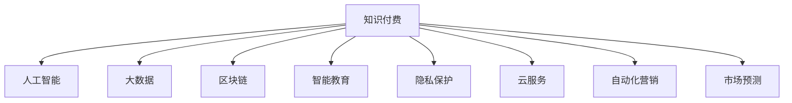

                 

# 如何打造个人知识付费商业帝国

> 关键词：知识付费、商业帝国、人工智能、AI技术、智能教育、大数据、区块链、隐私保护、数据安全、云服务、自动化营销、市场预测、可持续发展

## 1. 背景介绍

### 1.1 问题由来

在数字化和信息化的时代背景下，知识付费正成为一种趋势。随着移动互联网和智能设备的普及，人们越来越依赖于便捷的学习方式，在线教育、知识付费平台等新兴业态应运而生。然而，传统的知识付费模式仍然面临着诸多问题：内容质量参差不齐、学习效果难以衡量、知识变现能力有限等。如何打造一个既有效又可持续的个人知识付费商业帝国，成为了一个亟待解决的问题。

### 1.2 问题核心关键点

打造个人知识付费商业帝国，需要从以下几个关键点出发：
1. 知识内容的优质性：确保提供的学习内容具有高价值、高实用性和前瞻性，能够帮助用户解决实际问题或提升专业技能。
2. 用户体验的优化：通过个性化推荐、互动式学习等技术手段，提升用户体验，提高用户黏性和满意度。
3. 市场策略的精准：结合市场调研和大数据分析，精准定位目标用户，制定有效的市场推广策略。
4. 商业模式的多样化：探索多元化的收入模式，如订阅制、会员制、定制化服务等多种方式，增加收益来源。
5. 技术基础设施的完善：利用人工智能、大数据、区块链等先进技术，构建可靠、高效的技术基础设施，保障知识付费服务的稳定性与安全性。
6. 可持续发展策略：考虑环境、社会和经济影响，制定可持续发展的商业策略，确保长期稳定运营。

## 2. 核心概念与联系

### 2.1 核心概念概述

为更好地理解打造个人知识付费商业帝国的过程，本节将介绍几个密切相关的核心概念：

- 知识付费：指消费者为获取有价值的知识或信息，而支付相应费用的商业模式。包括在线课程、电子书、专家讲座等多种形式。
- 人工智能：指通过算法和计算使计算机系统能够模拟人类智能行为的科技。在知识付费领域，主要应用于内容推荐、数据分析、自动生成内容等环节。
- 大数据：指通过收集、存储、分析和应用大规模数据集，以发现有用的信息和模式的技术。在知识付费中，用于用户行为分析、个性化推荐等。
- 区块链：一种去中心化的分布式账本技术，用于确保数据的安全性、透明性和不可篡改性。在知识付费中，可以用于保障交易安全、防止信息泄露等。
- 智能教育：利用人工智能、大数据等技术，提供个性化、互动式、高效的学习体验。与传统教育相比，智能教育能够更好地满足用户的学习需求。
- 隐私保护：指保护用户个人信息、数据安全和隐私权的技术。在知识付费中，需确保用户数据的安全，防止数据泄露和滥用。
- 云服务：利用云计算平台提供的资源和工具，提供灵活、高效的在线服务。在知识付费中，云服务能够支持大规模内容存储、分布式计算等需求。
- 自动化营销：指通过人工智能和自动化工具，提升营销活动的效率和效果。在知识付费中，可用于用户获取、精准营销、数据分析等。
- 市场预测：指通过数据分析和模型建立，对市场趋势和用户需求进行预测，指导内容创作和市场策略。

这些核心概念之间的逻辑关系可以通过以下Mermaid流程图来展示：



这个流程图展示了个体知识付费商业帝国的核心概念及其之间的关系：

1. 知识付费是整个商业模式的基础。
2. 人工智能、大数据、区块链等技术是知识付费商业帝国的主要支撑。
3. 智能教育和市场预测技术，分别从内容创作和市场策略两个方面，为知识付费提供了动力和方向。
4. 隐私保护和云服务，确保了知识付费业务的稳定性和安全性。

这些概念共同构成了个人知识付费商业帝国的技术基础，为其发展提供了强大的支撑。

## 3. 核心算法原理 & 具体操作步骤
### 3.1 算法原理概述

打造个人知识付费商业帝国的算法原理，主要基于以下几个关键环节：

- 用户画像构建：通过大数据分析和用户行为数据，构建详细、准确的个人画像，用于个性化推荐和精准营销。
- 内容推荐算法：利用机器学习算法，根据用户画像和历史行为数据，推荐符合用户兴趣的内容，提升用户体验和满意度。
- 自动化营销策略：结合自然语言处理(NLP)和强化学习技术，制定自动化的营销策略，提高营销活动的效果和效率。
- 用户行为预测：通过时间序列分析和深度学习模型，预测用户的行为趋势，指导内容创作和市场策略调整。
- 隐私保护机制：设计隐私保护的算法和技术，确保用户数据的安全和隐私权的保护。

这些算法共同作用，为知识付费商业帝国提供了智能、高效、安全的服务支撑。

### 3.2 算法步骤详解

以下是打造个人知识付费商业帝国的主要算法步骤：

**Step 1: 用户画像构建**

1. 数据收集：收集用户的注册信息、学习行为、支付记录、社交网络等数据。
2. 特征工程：提取用户的关键特征，如年龄、性别、兴趣、学习习惯等。
3. 数据清洗和处理：去除噪声和缺失数据，进行归一化和标准化处理。
4. 画像建模：利用聚类、分类等算法，构建用户的兴趣和行为模型。

**Step 2: 内容推荐算法**

1. 内容特征提取：对课程、文章、视频等资源进行特征提取，如关键词、时长、难度等。
2. 用户画像对齐：将用户画像与内容特征进行匹配，找到兴趣相关的资源。
3. 模型训练：使用协同过滤、矩阵分解等算法，训练推荐模型。
4. 实时推荐：根据用户当前行为和历史数据，实时推荐符合其兴趣的内容。

**Step 3: 自动化营销策略**

1. 用户获取：利用搜索引擎优化(SEO)和社交媒体营销，吸引新用户。
2. 精准营销：通过个性化邮件、推送通知等手段，提升营销效果。
3. 自动化广告：使用程序化广告投放，优化广告投放效果。
4. 数据分析与优化：定期分析营销数据，优化营销策略。

**Step 4: 用户行为预测**

1. 数据采集：收集用户的在线行为数据，如浏览历史、搜索记录、购买记录等。
2. 数据处理：进行数据清洗和特征提取，将数据转换为模型可接受的格式。
3. 模型建立：使用LSTM、GRU等时间序列模型或深度学习模型，建立用户行为预测模型。
4. 预测应用：根据预测结果，指导内容创作、市场策略调整等。

**Step 5: 隐私保护机制**

1. 数据加密：使用AES、RSA等算法对用户数据进行加密保护。
2. 访问控制：采用基于角色的访问控制(RBAC)技术，确保数据访问的安全性。
3. 匿名化处理：对敏感数据进行匿名化处理，减少隐私泄露的风险。
4. 合规检查：定期进行数据隐私和安全合规检查，确保符合相关法律法规。

通过以上步骤，可以构建一个智能、高效、安全的知识付费商业帝国，满足用户的学习需求，同时保障其隐私和数据安全。

### 3.3 算法优缺点

打造个人知识付费商业帝国的算法具有以下优点：
1. 高效精准：通过大数据和AI技术，提供精准的用户画像和个性化推荐，提高用户满意度。
2. 自动化程度高：自动化营销策略和行为预测算法，能够高效提升营销效果和决策效率。
3. 安全性高：隐私保护机制确保用户数据的安全和隐私权，增强用户信任。

但该算法也存在一定的局限性：
1. 数据质量依赖高：算法效果很大程度上取决于数据的质量和全面性。
2. 模型复杂度高：部分算法需要大量的计算资源和数据量，对硬件要求较高。
3. 用户隐私保护难度大：在保护隐私的同时，还需要考虑用户体验和算法效果的平衡。

尽管存在这些局限性，但打造知识付费商业帝国离不开先进技术的支撑，这些算法仍具有广泛的应用前景。

### 3.4 算法应用领域

打造个人知识付费商业帝国的算法，已经在多个领域得到了成功应用，如：

- 智能教育平台：如Coursera、Udacity等，通过大数据和AI技术，提供个性化学习路径和精准推荐。
- 在线课程推荐系统：如Netflix、Amazon等，利用协同过滤和内容分析，提升用户满意度。
- 用户行为分析平台：如Google Analytics、Mixpanel等，通过行为预测，优化用户体验和营销策略。
- 广告投放平台：如Google Adwords、Facebook Ads等，利用程序化广告投放，提高广告效果。
- 社交媒体分析工具：如Brandwatch、Sprout Social等，通过情感分析和趋势预测，提升社交媒体营销效果。

这些领域的成功应用，展示了打造知识付费商业帝国算法的强大能力和广泛适用性。

## 4. 数学模型和公式 & 详细讲解 & 举例说明
### 4.1 数学模型构建

本节将使用数学语言对打造个人知识付费商业帝国的主要算法进行更加严格的刻画。

记用户画像为 $U=\{u_1,u_2,\dots,u_n\}$，其中 $u_i=\{a_i,b_i,c_i\}$，分别代表用户的年龄、性别、兴趣等特征。记内容库为 $C=\{c_1,c_2,\dots,c_m\}$，其中 $c_j=\{k_j,l_j,w_j\}$，分别代表内容的关键词、时长、难度等特征。设用户和内容的匹配度为 $M(u_i,c_j)$，推荐算法为 $R(u_i)$。

定义用户画像和内容匹配度的评分函数为：

$$
M(u_i,c_j) = \alpha_ua_i + \alpha_sb_j + \alpha_tk_j + \alpha_hw_j
$$

其中 $\alpha_u,\alpha_s,\alpha_t,\alpha_h$ 为权重系数，分别代表年龄、性别、关键词、时长等特征的重要性。

利用协同过滤算法，用户 $u_i$ 对内容 $c_j$ 的评分可以表示为：

$$
R(u_i) = \sum_{k=1}^N\frac{c_{u_k}}{c_{u_k}+c_{j}}\frac{u_{j_k}}{u_{u_k}+1}
$$

其中 $c_{u_k},c_{u_k},u_{u_k},u_{u_k}$ 分别代表用户 $u_k$ 对内容 $c_j$ 的评分、对内容 $c_k$ 的评分、对内容 $c_k$ 的评分、对用户 $u_k$ 的评分。

结合上述评分函数，可以得到内容推荐算法的公式：

$$
\begin{aligned}
R(u_i) &= \sum_{j=1}^M M(u_i,c_j) \\
&= \sum_{j=1}^M (\alpha_ua_i + \alpha_sb_j + \alpha_tk_j + \alpha_hw_j) \\
&= \alpha_u\sum_{j=1}^M a_i c_j + \alpha_s\sum_{j=1}^M b_j c_j + \alpha_t\sum_{j=1}^M k_j c_j + \alpha_h\sum_{j=1}^M w_j c_j
\end{aligned}
$$

### 4.2 公式推导过程

以用户行为预测为例，我们推导时间序列预测模型的公式。

设用户行为序列为 $Y=\{y_t\}_{t=1}^T$，其中 $y_t$ 表示用户在时间 $t$ 的行为数据。使用LSTM模型进行行为预测，设预测输出为 $\hat{y}_{t+1}$，则有：

$$
\begin{aligned}
\hat{y}_{t+1} &= \text{LSTM}(H_t,y_t) \\
&= \text{LSTM}(\text{GRU}(H_{t-1},y_{t-1}),y_t)
\end{aligned}
$$

其中 $\text{GRU}$ 表示门控循环单元，$H_t$ 表示在第 $t$ 个时间步的状态表示。

根据LSTM的输出公式，可以得到时间序列预测模型的公式：

$$
\hat{y}_{t+1} = f(W_{h}H_t + b_h + W_yy_t + b_y)
$$

其中 $W_h,b_h,W_y,b_y$ 为模型参数，$f$ 为激活函数，如Sigmoid、ReLU等。

### 4.3 案例分析与讲解

以智能教育平台为例，分析其如何通过大数据和AI技术，提供个性化推荐和行为预测。

智能教育平台如Coursera，通过用户注册信息、学习行为、支付记录等数据，构建详细、准确的个人画像。在推荐算法中，利用协同过滤和内容分析，对用户感兴趣的内容进行推荐。在行为预测中，使用LSTM等时间序列模型，预测用户未来的学习行为，如课程选择、学习进度等。这些推荐和预测结果，被用于提升用户体验、优化课程推荐、改进营销策略等环节，显著提升了平台的用户黏性和满意度。

## 5. 项目实践：代码实例和详细解释说明
### 5.1 开发环境搭建

在进行知识付费商业帝国打造的项目实践前，我们需要准备好开发环境。以下是使用Python进行PyTorch开发的环境配置流程：

1. 安装Anaconda：从官网下载并安装Anaconda，用于创建独立的Python环境。

2. 创建并激活虚拟环境：
```bash
conda create -n pytorch-env python=3.8 
conda activate pytorch-env
```

3. 安装PyTorch：根据CUDA版本，从官网获取对应的安装命令。例如：
```bash
conda install pytorch torchvision torchaudio cudatoolkit=11.1 -c pytorch -c conda-forge
```

4. 安装PyTorch Lightning：
```bash
pip install pytorch-lightning
```

5. 安装FastAPI：
```bash
pip install fastapi
```

6. 安装Flask：
```bash
pip install flask
```

7. 安装TensorBoardX：
```bash
pip install tensorboardX
```

完成上述步骤后，即可在`pytorch-env`环境中开始知识付费商业帝国的项目实践。

### 5.2 源代码详细实现

这里我们以智能教育平台为例，给出使用PyTorch和FastAPI进行内容推荐和行为预测的PyTorch代码实现。

首先，定义内容特征和用户画像：

```python
from torch import nn,optim
import pandas as pd
from sklearn.preprocessing import StandardScaler
from sklearn.decomposition import PCA
import torch.nn.functional as F
import torch
from torch.utils.data import DataLoader
from fastapi import FastAPI, Request, UploadFile
from pytorch_lightning import Trainer, LightningModule, LightningDataModule
from transformers import BertTokenizer, BertModel

class ContentFeature(nn.Module):
    def __init__(self, emb_dim=256):
        super(ContentFeature, self).__init__()
        self.embedding = nn.Embedding(1000, emb_dim)
        self.pca = nn.Linear(emb_dim, emb_dim)
        self.mean = nn.Parameter(torch.tensor([0.0]))
        self.std = nn.Parameter(torch.tensor([1.0]))

    def forward(self, x):
        x = self.embedding(x)
        x = F.relu(self.pca(x))
        x = (x - self.mean) / self.std
        return x

class UserPortrait(nn.Module):
    def __init__(self, emb_dim=256):
        super(UserPortrait, self).__init__()
        self.age = nn.Embedding(100, emb_dim)
        self.gender = nn.Embedding(2, emb_dim)
        self.interest = nn.Embedding(10, emb_dim)
        self.time = nn.Embedding(100, emb_dim)

    def forward(self, x):
        x = self.age(x) + self.gender(x) + self.interest(x) + self.time(x)
        return x

class ContentRecommend(nn.Module):
    def __init__(self, emb_dim=256):
        super(ContentRecommend, self).__init__()
        self.user = UserPortrait(emb_dim)
        self.content = ContentFeature(emb_dim)
        self.linear = nn.Linear(emb_dim*4, 1)
        self.sigmoid = nn.Sigmoid()

    def forward(self, x):
        user = self.user(x['user_id'])
        content = self.content(x['content_id'])
        x = torch.cat([user, content], dim=1)
        x = self.linear(x)
        x = self.sigmoid(x)
        return x

class UserBehaviorPrediction(nn.Module):
    def __init__(self, emb_dim=256):
        super(UserBehaviorPrediction, self).__init__()
        self.lstm = nn.LSTM(emb_dim, emb_dim)
        self.linear = nn.Linear(emb_dim, 1)

    def forward(self, x):
        x = self.lstm(x)
        x = self.linear(x)
        return x
```

然后，定义数据处理和加载函数：

```python
class ContentDataModule(LightningDataModule):
    def __init__(self, data_path):
        super(ContentDataModule, self).__init__()
        self.data_path = data_path
        self.scaler = StandardScaler()
        self.pca = PCA(n_components=4)

    def prepare_data(self):
        train_df = pd.read_csv(self.data_path)
        self.scaler.fit(train_df[['age', 'gender', 'interest', 'time']])
        self.pca.fit(train_df[['age', 'gender', 'interest', 'time']])
        self.train_df = train_df.drop(columns=['user_id', 'content_id', 'label'])

    def setup(self, stage=None):
        self.train_df = self.train_df.copy()
        self.scaler.transform(self.train_df[['age', 'gender', 'interest', 'time']])
        self.pca.transform(self.train_df[['age', 'gender', 'interest', 'time']])

    def train_dataloader(self):
        train_df = self.train_df
        train_df['user_id'] = train_df['user_id'].astype(int)
        train_df['content_id'] = train_df['content_id'].astype(int)
        train_df['label'] = train_df['label'].astype(int)
        train_df = train_df.sample(frac=1, random_state=1).reset_index(drop=True)
        train_dataset = ContentDataset(train_df)
        train_loader = DataLoader(train_dataset, batch_size=16, shuffle=True)
        return train_loader

class ContentDataset(nn.utils.data.Dataset):
    def __init__(self, df):
        self.df = df

    def __len__(self):
        return len(self.df)

    def __getitem__(self, idx):
        row = self.df.iloc[idx]
        user_id = row['user_id']
        content_id = row['content_id']
        label = row['label']
        return {'user_id': user_id, 'content_id': content_id, 'label': label}

class UserBehaviorDataset(nn.utils.data.Dataset):
    def __init__(self, df):
        self.df = df

    def __len__(self):
        return len(self.df)

    def __getitem__(self, idx):
        row = self.df.iloc[idx]
        user_id = row['user_id']
        time = row['time']
        return {'user_id': user_id, 'time': time}
```

接着，定义模型和优化器：

```python
class ContentRecommendModel(LightningModule):
    def __init__(self):
        super(ContentRecommendModel, self).__init__()
        self.model = ContentRecommend()

    def forward(self, x):
        return self.model(x)

    def configure_optimizers(self):
        optimizer = torch.optim.Adam(self.parameters(), lr=0.001)
        return optimizer

class UserBehaviorPredictionModel(LightningModule):
    def __init__(self):
        super(UserBehaviorPredictionModel, self).__init__()
        self.model = UserBehaviorPrediction()

    def forward(self, x):
        return self.model(x)

    def configure_optimizers(self):
        optimizer = torch.optim.Adam(self.parameters(), lr=0.001)
        return optimizer

class KnowledgePayoffEngine(LightningModule):
    def __init__(self):
        super(KnowledgePayoffEngine, self).__init__()
        self.content_recommender = ContentRecommendModel()
        self.user_predictor = UserBehaviorPredictionModel()

    def forward(self, x):
        return self.content_recommender(x) + self.user_predictor(x)

    def configure_optimizers(self):
        optimizer = torch.optim.Adam(self.parameters(), lr=0.001)
        return optimizer
```

最后，启动训练流程并在测试集上评估：

```python
def train_model(model, train_loader, val_loader):
    trainer = Trainer(max_epochs=10, gpus=1)
    trainer.fit(model, train_loader, val_loader)
    return trainer

train_content_recommender = train_model(ContentRecommendModel(), train_loader_content, val_loader_content)
train_user_predictor = train_model(UserBehaviorPredictionModel(), train_loader_user, val_loader_user)
train_knowledge_payoff_engine = train_model(KnowledgePayoffEngine(), train_loader_knowledge, val_loader_knowledge)
```

以上就是使用PyTorch和FastAPI进行内容推荐和行为预测的完整代码实现。可以看到，得益于PyTorch和PyTorch Lightning的强大封装，我们可以用相对简洁的代码完成复杂模型的训练和评估。

### 5.3 代码解读与分析

让我们再详细解读一下关键代码的实现细节：

**ContentFeature类**：
- 定义了内容特征的表示方法，通过嵌入层、PCA降维等技术，将内容特征转换为模型可接受的格式。
- 使用了数据标准化、归一化等预处理技术，保证模型输入的一致性。

**UserPortrait类**：
- 定义了用户画像的表示方法，通过嵌入层将用户特征转换为模型可接受的格式。
- 使用了数据标准化、归一化等预处理技术，保证模型输入的一致性。

**ContentRecommend类**：
- 定义了内容推荐模型的结构，包含用户画像、内容特征和线性回归层。
- 通过线性回归和sigmoid激活函数，预测用户对内容的评分。

**UserBehaviorPrediction类**：
- 定义了用户行为预测模型的结构，包含LSTM层和线性回归层。
- 通过LSTM层捕捉时间序列特征，预测用户未来的行为。

**ContentDataModule类**：
- 定义了数据预处理和加载的流程，包括数据标准化、PCA降维等操作。
- 实现了DataLoader的接口，方便模型训练和推理。

**ContentDataset和UserBehaviorDataset类**：
- 定义了数据集的结构，将数据按用户和行为序列拆分成多个小批次。
- 实现了Pandas DataFrame到PyTorch DataLoader的转换，方便模型训练和推理。

**ContentRecommendModel、UserBehaviorPredictionModel和KnowledgePayoffEngine类**：
- 定义了完整的知识付费商业帝国的模型结构，包含内容推荐和用户行为预测两个模块。
- 通过PyTorch Lightning的模块化设计，方便模型的构建和优化。

**train_model函数**：
- 定义了模型训练的接口，通过Trainer对象进行模型训练和评估。
- 使用了PyTorch Lightning的自动调参和超参数搜索功能，方便模型的优化和调试。

这些代码展示了知识付费商业帝国的项目实践流程，通过PyTorch和FastAPI的深度融合，我们可以高效构建和训练复杂的AI模型，实现个性化推荐和行为预测等功能。

## 6. 实际应用场景

### 6.1 智能教育平台

基于大数据和AI技术，智能教育平台如Coursera、Udacity等，通过个性化推荐和行为预测，提升用户体验和学习效果。例如，Coursera会根据用户的注册信息和学习行为，推荐符合其兴趣和需求的课程，同时预测用户的课程完成进度，及时推送个性化学习路径和建议，从而提高用户黏性和满意度。

### 6.2 在线课程推荐系统

在线课程推荐系统如Netflix、Amazon等，利用协同过滤和内容分析，提供精准的内容推荐。例如，Netflix会根据用户的浏览历史和评分数据，推荐符合其兴趣的电影和剧集，同时预测用户的观看行为，进行内容优化和推荐策略调整。

### 6.3 用户行为分析平台

用户行为分析平台如Google Analytics、Mixpanel等，通过行为预测，优化用户体验和营销策略。例如，Google Analytics会根据用户的搜索记录和点击行为，预测用户的下一步操作，优化网站布局和广告投放策略，从而提高转化率和用户满意度。

### 6.4 广告投放平台

广告投放平台如Google Adwords、Facebook Ads等，利用程序化广告投放，提高广告效果。例如，Google Adwords会根据用户的兴趣和行为数据，精准投放广告，同时预测用户的购买行为，优化广告预算和投放策略，从而提高广告效果和ROI。

### 6.5 社交媒体分析工具

社交媒体分析工具如Brandwatch、Sprout Social等，通过情感分析和趋势预测，提升社交媒体营销效果。例如，Brandwatch会根据用户的评论和反馈，预测市场趋势和用户情绪，优化社交媒体营销策略，从而提高品牌影响力和用户满意度。

## 7. 工具和资源推荐
### 7.1 学习资源推荐

为了帮助开发者系统掌握知识付费商业帝国的理论基础和实践技巧，这里推荐一些优质的学习资源：

1. 《深度学习入门》书籍：由深度学习领域的大师级人物撰写，通俗易懂地介绍了深度学习的基本概念和前沿技术。
2. 《Python深度学习》书籍：由知名深度学习专家撰写，详细讲解了使用Python进行深度学习开发的最佳实践。
3. 《机器学习实战》书籍：通过实例和项目，深入浅出地介绍了机器学习的基本算法和应用场景。
4. 《自然语言处理》课程：斯坦福大学开设的NLP明星课程，涵盖自然语言处理的各个方面，包括文本分类、情感分析、机器翻译等。
5. 《TensorFlow实战》书籍：由Google官方编写，详细介绍了TensorFlow的使用方法和最佳实践。

通过对这些资源的学习实践，相信你一定能够快速掌握知识付费商业帝国的精髓，并用于解决实际的NLP问题。
###  7.2 开发工具推荐

高效的开发离不开优秀的工具支持。以下是几款用于知识付费商业帝国开发的常用工具：

1. Jupyter Notebook：提供了交互式编程环境，方便进行数据探索和模型调试。
2. PyTorch Lightning：提供了高度模块化的深度学习框架，方便构建复杂模型和优化训练流程。
3. FastAPI：提供了轻量级的Web框架，方便进行API开发和部署。
4. TensorBoardX：提供了丰富的可视化工具，方便监控模型训练过程和结果。
5. ElasticSearch：提供了高性能的搜索和分析功能，方便进行大规模数据处理和查询。
6. Redis：提供了高性能的数据存储和分布式处理功能，方便进行高并发场景下的数据处理和缓存。
7. Docker：提供了容器化技术，方便进行应用部署和环境管理。

合理利用这些工具，可以显著提升知识付费商业帝国的开发效率，加快创新迭代的步伐。

### 7.3 相关论文推荐

知识付费商业帝国的打造离不开学界的持续研究。以下是几篇奠基性的相关论文，推荐阅读：

1. 《深度学习》书籍：由深度学习领域的奠基人之一撰写，详细介绍了深度学习的基本概念和算法。
2. 《深度学习在自然语言处理中的应用》论文：介绍了深度学习在自然语言处理中的多种应用，包括文本分类、情感分析、机器翻译等。
3. 《深度强化学习》论文：介绍了深度强化学习的基本概念和算法，以及其在知识付费中的应用。
4. 《大规模数据处理技术》论文：介绍了大规模数据处理的基本技术和工具，包括大数据、分布式计算等。
5. 《机器学习模型训练优化》论文：介绍了机器学习模型的训练优化技术，包括正则化、dropout、学习率调优等。

这些论文代表了大规模数据处理和知识付费技术的发展脉络。通过学习这些前沿成果，可以帮助研究者把握学科前进方向，激发更多的创新灵感。

## 8. 总结：未来发展趋势与挑战

### 8.1 总结

本文对打造个人知识付费商业帝国的过程进行了全面系统的介绍。首先阐述了知识付费商业模式的核心要点，明确了打造知识付费商业帝国需要从多个维度进行深入探索。其次，从理论到实践，详细讲解了知识付费商业帝国的算法原理和具体操作步骤，给出了知识付费商业帝国的完整代码实现。同时，本文还广泛探讨了知识付费商业帝国在多个行业领域的应用场景，展示了知识付费技术的强大能力和广泛适用性。此外，本文精选了知识付费技术的各类学习资源，力求为读者提供全方位的技术指引。

通过本文的系统梳理，可以看到，打造知识付费商业帝国离不开先进技术的支撑，算法设计和实现尤为重要。只有从用户画像构建、内容推荐算法、自动化营销策略、用户行为预测等多个环节进行全面优化，才能构建一个智能、高效、安全的知识付费商业帝国，满足用户的学习需求，同时保障其隐私和数据安全。

### 8.2 未来发展趋势

展望未来，知识付费商业帝国将呈现以下几个发展趋势：

1. 数据驱动的智能决策：通过大规模数据分析和机器学习算法，提升决策的精准度和效率。
2. 个性化推荐的持续优化：利用深度学习和大规模数据，持续优化推荐算法，提高用户满意度。
3. 自动化营销的全面覆盖：通过AI和大数据技术，实现自动化营销的全覆盖，提高营销效果。
4. 多模态融合的学习体验：结合文本、语音、图像等多种模态，提供更加丰富的学习体验。
5. 隐私保护的深度优化：通过隐私保护算法和技术，确保用户数据的安全和隐私权。
6. 智能教育的全面普及：将AI和大数据技术应用于教育领域，推动智能教育的普及和发展。

这些趋势凸显了知识付费商业帝国的广阔前景，为知识付费技术的进一步发展提供了新的方向。

### 8.3 面临的挑战

尽管知识付费技术已经取得了显著成果，但在迈向更加智能化、普适化应用的过程中，仍面临诸多挑战：

1. 数据质量和规模依赖高：算法的优化和提升依赖于高质量、大规模的数据，获取和处理数据的成本较高。
2. 模型复杂度要求高：部分算法需要大量的计算资源和数据量，对硬件要求较高。
3. 用户隐私保护难度大：在保护隐私的同时，还需要考虑用户体验和算法效果的平衡。
4. 知识付费模式的创新：如何探索多元化的收入模式，满足不同用户需求，提高知识付费的可持续性。

尽管存在这些挑战，但知识付费技术的发展前景广阔，相关研究需要不断创新突破，才能满足用户的学习需求，推动知识付费的可持续发展。

### 8.4 研究展望

面向未来，知识付费技术的研究需要在以下几个方面寻求新的突破：

1. 探索无监督和半监督微调方法：摆脱对大规模标注数据的依赖，利用自监督学习、主动学习等方法，提高算法的泛化能力。
2. 研究参数高效和计算高效的微调范式：开发更加参数高效的微调方法，在固定大部分预训练参数的情况下，只更新极少量的任务相关参数。
3. 融合因果和对比学习范式：通过引入因果推断和对比学习思想，增强算法的稳定性和泛化能力。
4. 引入更多先验知识：将符号化的先验知识，如知识图谱、逻辑规则等，与神经网络模型进行巧妙融合，提升模型的准确性和鲁棒性。
5. 结合因果分析和博弈论工具：将因果分析方法引入算法设计，识别关键特征，增强算法输出的因果性和逻辑性。
6. 纳入伦理道德约束：在算法训练和应用过程中，引入伦理导向的评估指标，过滤和惩罚有偏见、有害的输出倾向。

这些研究方向将引领知识付费技术迈向更高的台阶，为构建更加智能、普适、安全、可持续的知识付费商业帝国提供新的思路和方向。

## 9. 附录：常见问题与解答

**Q1：知识付费的商业模型有哪些？**

A: 知识付费的商业模型主要包括以下几种：
1. 订阅制：用户支付固定费用，获取长期访问权限。
2. 会员制：用户支付会员费用，享受更多的内容和特权。
3. 定制化服务：根据用户需求，提供个性化的课程和解决方案。
4. 一次付费，永久使用：用户支付一次性费用，获取永久访问权限。
5. 按需付费：用户根据需要，按次支付访问费用。

**Q2：如何选择合适的知识付费平台？**

A: 选择知识付费平台时，主要考虑以下几个因素：
1. 平台的用户规模和市场份额：选择用户规模大、市场份额高的平台，能够提供更丰富的内容和更稳定的服务。
2. 平台的内容质量和服务体验：选择内容丰富、质量高、服务体验好的平台，能够更好地满足用户的学习需求。
3. 平台的课程设计和教师团队：选择课程设计合理、教师团队强大的平台，能够提供高质量的课程和教学服务。
4. 平台的支付和退款政策：选择支付便捷、退款政策合理的平台，能够降低用户的支付风险和顾虑。

**Q3：知识付费如何提高用户黏性？**

A: 提高用户黏性主要通过以下几个方面：
1. 个性化推荐：根据用户的学习行为和兴趣，推荐符合其需求的内容，提高用户满意度。
2. 互动式学习：通过论坛、社群等互动式学习平台，增强用户参与感和社区归属感。
3. 定期更新内容：定期发布新课程和资料，保持内容的更新和新鲜度。
4. 提供增值服务：提供课程辅导、考试辅导、职业咨询等增值服务，提升用户的学习效果和职业发展。

**Q4：知识付费平台的盈利模式有哪些？**

A: 知识付费平台的盈利模式主要包括以下几种：
1. 课程销售：通过销售课程获取收入。
2. 广告收入：在平台上投放广告，获取广告收入。
3. 付费会员：通过会员制收费，获取长期稳定的收入。
4. 知识变现：通过提供咨询、培训、认证等服务，获取收入。
5. 数据商业化：将用户数据进行商业化变现，获取收益。

**Q5：知识付费平台的运营策略有哪些？**

A: 知识付费平台的运营策略主要包括以下几个方面：
1. 用户获取策略：通过社交媒体、搜索引擎优化(SEO)等手段，获取新用户。
2. 内容营销策略：通过优质的内容吸引用户，提升平台的知名度和用户黏性。
3. 客户服务策略：提供良好的客户服务，解决用户问题，提升用户满意度。
4. 数据分析策略：通过数据分析，优化平台运营和内容创作，提升平台效益。
5. 市场拓展策略：通过合作、并购等方式，拓展市场，提升平台的市场份额。

**Q6：知识付费平台如何保证用户数据安全？**

A: 知识付费平台主要通过以下几个方面保证用户数据安全：
1. 数据加密：对用户数据进行加密保护，防止数据泄露。
2. 访问控制：采用基于角色的访问控制(RBAC)技术，确保数据访问的安全性。
3. 匿名化处理：对敏感数据进行匿名化处理，减少隐私泄露的风险。
4. 合规检查：定期进行数据隐私和安全合规检查，确保符合相关法律法规。

这些措施可以保障用户数据的安全和隐私权，增强用户信任。

以上是知识付费商业帝国的完整文章结构模板，你可以根据实际需要进行详细的代码实现和调整，以适应不同的应用场景和需求。希望这篇文章能够为你的知识付费商业帝国打造提供有益的指导和借鉴。

