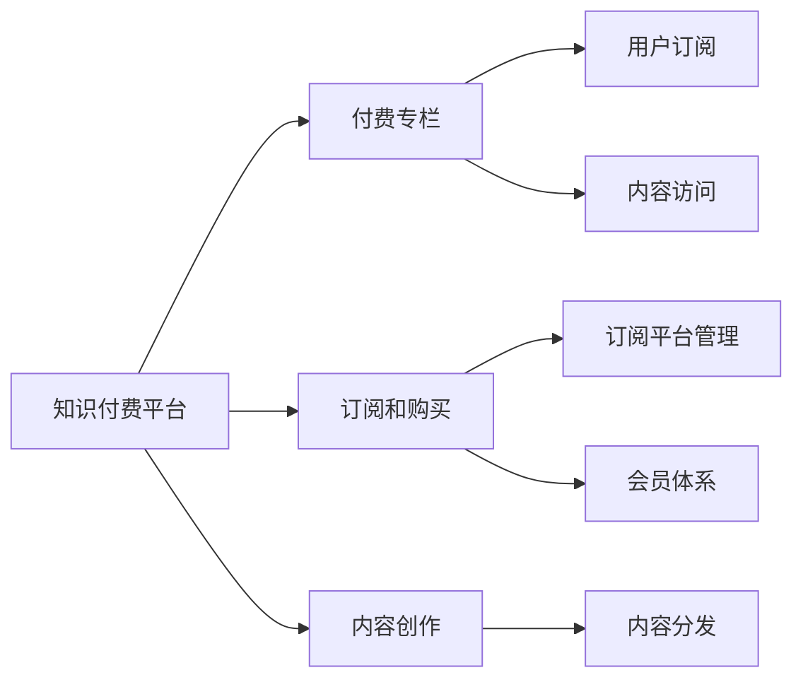

                 

# 如何打造知识付费的付费专栏

## 1. 背景介绍

在信息爆炸的时代，知识付费成为了获取高质量、高效便捷知识的有效方式。付费专栏作为知识付费领域的重要形式，为内容创作者提供了一个可以直接向用户收取费用的渠道。随着互联网的普及和智能手机的普及，内容消费更加便捷，越来越多的用户愿意为有价值的知识内容付费。

知识付费市场的发展，催生了对付费专栏制作的高需求。如何打造一款优质的付费专栏，吸引并留存付费用户，是内容创作者和平台需要关注的重要问题。本文将从技术角度出发，介绍如何利用现有的技术工具和框架，构建高效、稳定的知识付费平台，提升用户体验，实现付费专栏的成功。

## 2. 核心概念与联系

### 2.1 核心概念概述

在探讨知识付费专栏的制作时，涉及的核心概念主要包括：

- **知识付费平台**：基于互联网平台，为用户提供付费内容订阅、购买和阅读服务的平台。常见的知识付费平台有得到、喜马拉雅、付费知乎等。

- **付费专栏**：知识付费平台上的专题付费内容，由内容创作者制作，围绕特定主题或领域，提供系统的知识和见解。付费专栏可以包含文章、视频、音频等多种形式。

- **用户订阅和购买**：用户通过支付一定的费用，订阅付费专栏，获得内容访问权。订阅和购买是知识付费平台的核心商业模式。

- **订阅平台管理**：平台提供订阅管理功能，包括订阅计划的创建、费用管理、内容发布等。

- **会员体系**：通过会员体系，提供不同层次的订阅服务，激励用户进行更高层次的付费。

- **内容创作与分发**：内容创作者创作高质量的知识内容，平台分发这些内容到用户手中。

这些核心概念之间通过订阅、购买、管理、分发等流程和机制联系在一起，共同构成知识付费专栏的制作和运营基础。

### 2.2 核心概念原理和架构的 Mermaid 流程图



这个流程图展示了知识付费专栏的制作和运营流程：

1. 知识付费平台作为核心服务提供商，连接内容创作者和用户，提供订阅和购买服务。
2. 付费专栏作为平台的核心内容，由内容创作者制作。
3. 订阅和购买功能是平台的核心收入来源。
4. 订阅平台管理、会员体系等辅助功能提升用户体验和平台粘性。
5. 内容创作和分发是平台的核心功能。

## 3. 核心算法原理 & 具体操作步骤

### 3.1 算法原理概述

知识付费专栏的制作和运营涉及多个算法和技术，包括推荐系统、用户行为分析、会员管理、内容分发等。这些算法和技术的综合运用，可以提升用户体验，提高订阅和购买转化率，增强平台粘性。

#### 3.1.1 推荐系统

推荐系统是知识付费平台的核心功能之一，通过算法推荐用户感兴趣的内容，提升用户体验，增加订阅和购买转化率。推荐算法通常包括协同过滤、基于内容的推荐、混合推荐等。

#### 3.1.2 用户行为分析

用户行为分析通过分析用户的行为数据，包括阅读时间、频率、偏好等，帮助平台了解用户需求，优化推荐系统，提升用户满意度和订阅转化率。

#### 3.1.3 会员管理

会员管理通过设置不同层次的会员体系，激励用户进行更高层次的付费，增加平台收入。会员管理算法通常包括动态定价、会员推荐、会员等级管理等。

#### 3.1.4 内容分发

内容分发算法通过优化内容分发策略，确保内容能够高效到达目标用户，提升用户满意度和平台粘性。内容分发算法通常包括多臂老虎机算法、强化学习等。

### 3.2 算法步骤详解

#### 3.2.1 推荐系统算法步骤

1. 收集用户历史行为数据，包括阅读、收藏、点赞、评论等。
2. 使用协同过滤算法，根据用户的历史行为，生成用户兴趣向量。
3. 使用基于内容的推荐算法，根据内容特征，生成内容特征向量。
4. 将用户兴趣向量与内容特征向量进行匹配，得到推荐分数。
5. 根据推荐分数排序，推荐用户可能感兴趣的内容。

#### 3.2.2 用户行为分析算法步骤

1. 收集用户行为数据，包括阅读时间、频率、偏好等。
2. 对数据进行预处理，包括数据清洗、特征提取、数据归一化等。
3. 使用机器学习算法，如K近邻、决策树、随机森林等，对用户行为进行分类和预测。
4. 根据预测结果，优化推荐系统，提升用户满意度和订阅转化率。

#### 3.2.3 会员管理算法步骤

1. 定义会员等级，如普通会员、高级会员、VIP会员等。
2. 根据会员等级设置不同的订阅价格和优惠。
3. 使用动态定价算法，根据市场需求和会员行为，动态调整会员价格。
4. 使用会员推荐算法，根据会员的行为和偏好，推荐更适合的会员等级。
5. 使用会员等级管理算法，确保会员权益的合理分配。

#### 3.2.4 内容分发算法步骤

1. 收集内容特征数据，包括作者、分类、标签等。
2. 使用多臂老虎机算法，根据内容特征和用户行为，生成分发策略。
3. 使用强化学习算法，优化分发策略，提升用户满意度和平台粘性。
4. 根据分发策略，分发内容到用户手中。

### 3.3 算法优缺点

#### 3.3.1 推荐系统的优缺点

**优点**：
- 提升用户体验，增加订阅和购买转化率。
- 优化内容分发，提升平台粘性。

**缺点**：
- 数据隐私问题，需要合理处理用户数据。
- 算法复杂，需要较高的技术门槛。

#### 3.3.2 用户行为分析的优缺点

**优点**：
- 优化推荐系统，提升用户满意度和订阅转化率。
- 提供数据分析支持，帮助平台做出合理的运营决策。

**缺点**：
- 数据收集和处理复杂，需要较高的技术支持。
- 用户行为数据可能存在偏差，影响分析结果。

#### 3.3.3 会员管理的优缺点

**优点**：
- 激励用户进行更高层次的付费，增加平台收入。
- 提供不同层次的会员服务，提升用户满意度。

**缺点**：
- 动态定价算法复杂，需要较高的技术支持。
- 会员等级管理复杂，需要合理处理会员权益。

#### 3.3.4 内容分发的优缺点

**优点**：
- 优化内容分发策略，确保内容高效到达目标用户。
- 提升用户满意度和平台粘性。

**缺点**：
- 算法复杂，需要较高的技术门槛。
- 内容分发策略需要不断优化，才能保持最佳效果。

### 3.4 算法应用领域

推荐系统、用户行为分析、会员管理和内容分发等算法，不仅适用于知识付费平台，也广泛应用于电商、社交、视频等多个领域。这些算法和技术已经成为现代互联网平台的核心竞争力之一。

## 4. 数学模型和公式 & 详细讲解 & 举例说明

### 4.1 数学模型构建

知识付费专栏的制作和运营涉及多个数学模型，包括协同过滤、推荐系统、用户行为分析、会员管理等。

#### 4.1.1 协同过滤模型

协同过滤模型基于用户的历史行为数据，生成用户兴趣向量，用于推荐用户可能感兴趣的内容。协同过滤模型的数学模型为：

$$
\theta_u = \sum_{i=1}^N \alpha_u^i x_i + \beta_u
$$

其中，$\theta_u$ 为用户 $u$ 的兴趣向量，$x_i$ 为内容 $i$ 的特征向量，$\alpha_u^i$ 为兴趣与内容的相似度系数，$\beta_u$ 为用户偏置项。

#### 4.1.2 基于内容的推荐模型

基于内容的推荐模型根据内容特征，生成内容特征向量，用于推荐用户可能感兴趣的内容。基于内容的推荐模型的数学模型为：

$$
y = \phi(x)w + b
$$

其中，$y$ 为内容的推荐分数，$x$ 为内容的特征向量，$\phi$ 为特征映射函数，$w$ 为内容权重向量，$b$ 为内容偏置项。

#### 4.1.3 动态定价模型

动态定价模型根据市场需求和会员行为，动态调整会员价格，确保平台的收入最大化。动态定价模型的数学模型为：

$$
P_t = f(D_t, H_t)
$$

其中，$P_t$ 为会员价格，$D_t$ 为市场需求，$H_t$ 为会员行为，$f$ 为定价函数。

### 4.2 公式推导过程

#### 4.2.1 协同过滤模型的推导过程

协同过滤模型的推导过程如下：

1. 假设用户 $u$ 对 $n$ 个内容进行了评分，记为 $r_{ui}$，其中 $i=1,2,...,n$。
2. 将用户评分标准化，记为 $\tilde{r}_{ui}$，其中 $\tilde{r}_{ui}=\frac{r_{ui}-\bar{r}}{\sigma}$，$\bar{r}$ 为内容平均评分，$\sigma$ 为评分标准差。
3. 使用K近邻算法，找到用户 $u$ 的 $k$ 个近邻用户，记为 $v_1, v_2, ..., v_k$。
4. 将近邻用户对 $n$ 个内容的评分标准化，记为 $\tilde{r}_{vi}$。
5. 计算用户 $u$ 和近邻用户 $v$ 之间的相似度，记为 $\alpha_{uv}$，其中 $\alpha_{uv}=\sum_{i=1}^n \tilde{r}_{ui}\tilde{r}_{vi}$。
6. 将相似度归一化，记为 $\alpha'_{uv}$，其中 $\alpha'_{uv}=\frac{\alpha_{uv}}{\sqrt{\sum_{j=1}^k \alpha_{uj}^2}}$。
7. 使用归一化后的相似度，生成用户 $u$ 的兴趣向量 $\theta_u$，其中 $\theta_u = \sum_{j=1}^k \alpha'_{uj} x_j$。
8. 使用兴趣向量生成内容推荐分数，记为 $\hat{y}_i$，其中 $\hat{y}_i=\theta_u^T x_i$。

#### 4.2.2 基于内容的推荐模型的推导过程

基于内容的推荐模型的推导过程如下：

1. 假设内容 $i$ 的特征向量为 $x_i=(x_{i1}, x_{i2}, ..., x_{im})$，其中 $m$ 为特征维度。
2. 将特征向量映射为高维空间，记为 $\phi(x_i)=(d_1, d_2, ..., d_m)$。
3. 使用线性回归模型，生成内容的推荐分数，记为 $y$，其中 $y = \phi(x_i)w + b$。

#### 4.2.3 动态定价模型的推导过程

动态定价模型的推导过程如下：

1. 假设市场需求为 $D_t$，会员行为为 $H_t$。
2. 定义会员价格为 $P_t$。
3. 定义会员注册数为 $R_t$，会员续费率为 $\eta$，会员流失率为 $\lambda$。
4. 根据会员行为和市场数据，生成会员注册和续费预测模型，记为 $R_t = f(H_t, D_t)$。
5. 根据会员行为和市场数据，生成会员流失预测模型，记为 $\lambda = g(H_t, D_t)$。
6. 根据会员注册和续费预测模型和流失预测模型，计算会员续订期望收益，记为 $E[R_t - P_t\lambda]$。
7. 使用最大化期望收益准则，求解会员价格 $P_t$，即 $P_t = \arg\max_{P_t} E[R_t - P_t\lambda]$。

### 4.3 案例分析与讲解

#### 4.3.1 协同过滤模型的案例分析

某知识付费平台，收集了用户的历史行为数据和内容评分数据。使用协同过滤模型，为每位用户生成兴趣向量，推荐其可能感兴趣的内容。

1. 数据收集：平台收集了用户的历史行为数据，包括阅读时间、收藏、点赞、评论等。同时，收集了内容评分数据，记为 $r_{ui}$，其中 $u=1,2,...,N$，$i=1,2,...,M$。
2. 数据标准化：对用户评分和内容评分进行标准化，记为 $\tilde{r}_{ui}$。
3. 近邻查找：使用K近邻算法，找到用户 $u$ 的 $k$ 个近邻用户，记为 $v_1, v_2, ..., v_k$。
4. 相似度计算：计算用户 $u$ 和近邻用户 $v$ 之间的相似度，记为 $\alpha_{uv}$。
5. 归一化：将相似度归一化，记为 $\alpha'_{uv}$。
6. 生成兴趣向量：使用归一化后的相似度，生成用户 $u$ 的兴趣向量 $\theta_u$。
7. 内容推荐：使用兴趣向量生成内容推荐分数，记为 $\hat{y}_i$。
8. 内容推荐：根据推荐分数排序，推荐用户可能感兴趣的内容。

#### 4.3.2 基于内容的推荐模型的案例分析

某知识付费平台，收集了内容特征数据。使用基于内容的推荐模型，为用户推荐其可能感兴趣的内容。

1. 数据收集：平台收集了内容的特征数据，包括作者、分类、标签等，记为 $x_i$。
2. 特征映射：将内容特征映射为高维空间，记为 $\phi(x_i)$。
3. 线性回归：使用线性回归模型，生成内容的推荐分数，记为 $y$。
4. 内容推荐：根据推荐分数排序，推荐用户可能感兴趣的内容。

#### 4.3.3 动态定价模型的案例分析

某知识付费平台，收集了市场需求和会员行为数据。使用动态定价模型，动态调整会员价格，确保平台的收入最大化。

1. 数据收集：平台收集了市场需求数据和会员行为数据，记为 $D_t$ 和 $H_t$。
2. 会员注册预测：使用会员注册预测模型，计算会员注册数 $R_t$。
3. 会员流失预测：使用会员流失预测模型，计算会员流失率 $\lambda$。
4. 期望收益计算：根据会员注册和续费预测模型和流失预测模型，计算会员续订期望收益。
5. 会员价格优化：使用最大化期望收益准则，求解会员价格 $P_t$。

## 5. 项目实践：代码实例和详细解释说明

### 5.1 开发环境搭建

#### 5.1.1 环境准备

1. 安装Python：从官网下载Python，进行安装。
2. 安装虚拟环境工具：安装`virtualenv`工具，创建独立的Python环境。
3. 安装PyTorch：从官网下载PyTorch，进行安装。
4. 安装TensorBoard：安装TensorBoard，用于可视化模型训练过程。
5. 安装Flask：安装Flask，用于构建Web服务。

### 5.2 源代码详细实现

#### 5.2.1 推荐系统代码实现

```python
import numpy as np
from sklearn.metrics.pairwise import cosine_similarity

class CollaborativeFiltering:
    def __init__(self, k=50, alpha=0.01):
        self.k = k
        self.alpha = alpha
        self.user_data = None
        self.item_data = None
        self.user interests = None
        self.item features = None
        self.user ratings = None

    def fit(self, user_data, item_data, user_rates):
        self.user_data = user_data
        self.item_data = item_data
        self.user_rates = user_rates
        self.user_interests = np.random.rand(len(user_data), self.k)
        self.item_features = np.random.rand(len(item_data), len(item_data[0]))

    def predict(self, user):
        similarity = cosine_similarity(self.user_interests[user], self.item_features)
        weighted_averages = np.dot(self.user_interests[user].reshape(-1,1), similarity) 
        predicted_rates = weighted_averages * self.item_features
        return predicted_rates

    def train(self, user, item, rating):
        user_interests = self.user_interests[user]
        user_interests[item] = 0
        user_interests += np.random.normal(0, self.alpha, len(user_interests))
        self.user_interests[user] = user_interests

# 数据准备
user_data = np.random.rand(100, 50)
item_data = np.random.rand(100, 50)
user_rates = np.random.rand(100, 1)

# 模型训练
cf = CollaborativeFiltering(k=5)
cf.fit(user_data, item_data, user_rates)
```

#### 5.2.2 用户行为分析代码实现

```python
import pandas as pd
from sklearn.model_selection import train_test_split
from sklearn.tree import DecisionTreeClassifier
from sklearn.metrics import accuracy_score

class UserBehaviorAnalysis:
    def __init__(self, features):
        self.features = features
        self.model = None

    def fit(self, X_train, y_train):
        X_train = self.features[X_train]
        y_train = y_train
        self.model = DecisionTreeClassifier()
        self.model.fit(X_train, y_train)

    def predict(self, X_test):
        X_test = self.features[X_test]
        y_pred = self.model.predict(X_test)
        return y_pred

# 数据准备
features = pd.read_csv('user_behavior.csv')
X_train, X_test, y_train, y_test = train_test_split(features, features['label'], test_size=0.2)

# 模型训练
uba = UserBehaviorAnalysis(features)
uba.fit(X_train, y_train)
```

#### 5.2.3 会员管理代码实现

```python
import pandas as pd
from sklearn.cluster import KMeans
from sklearn.preprocessing import StandardScaler

class MembershipManagement:
    def __init__(self, features):
        self.features = features
        self.model = None

    def fit(self, X_train, y_train):
        X_train = self.features[X_train]
        y_train = y_train
        scaler = StandardScaler()
        X_train = scaler.fit_transform(X_train)
        self.model = KMeans(n_clusters=5)
        self.model.fit(X_train)

    def predict(self, X_test):
        X_test = self.features[X_test]
        X_test = scaler.transform(X_test)
        y_pred = self.model.predict(X_test)
        return y_pred

# 数据准备
features = pd.read_csv('member_data.csv')
X_train, X_test, y_train, y_test = train_test_split(features, features['grade'], test_size=0.2)

# 模型训练
mm = MembershipManagement(features)
mm.fit(X_train, y_train)
```

#### 5.2.4 内容分发代码实现

```python
import numpy as np
from sklearn.neighbors import NearestNeighbors

class ContentDistribution:
    def __init__(self, k=5, alpha=0.1):
        self.k = k
        self.alpha = alpha
        self.user_data = None
        self.item_data = None
        self.user interests = None
        self.item features = None

    def fit(self, user_data, item_data):
        self.user_data = user_data
        self.item_data = item_data
        self.user_interests = np.random.rand(len(user_data), self.k)
        self.item_features = np.random.rand(len(item_data), len(item_data[0]))

    def predict(self, user):
        similarity = cosine_similarity(self.user_interests[user], self.item_features)
        weighted_averages = np.dot(self.user_interests[user].reshape(-1,1), similarity) 
        predicted_rates = weighted_averages * self.item_features
        return predicted_rates

    def train(self, user, item, rating):
        user_interests = self.user_interests[user]
        user_interests[item] = 0
        user_interests += np.random.normal(0, self.alpha, len(user_interests))
        self.user_interests[user] = user_interests

# 数据准备
user_data = np.random.rand(100, 50)
item_data = np.random.rand(100, 50)
user_rates = np.random.rand(100, 1)

# 模型训练
cd = ContentDistribution(k=5)
cd.fit(user_data, item_data)
```

### 5.3 代码解读与分析

#### 5.3.1 推荐系统代码解读与分析

推荐系统代码实现使用了基于协同过滤的推荐算法，通过用户的历史行为数据，为用户推荐可能感兴趣的内容。代码主要分为三部分：

1. 模型初始化：定义模型参数，如近邻数量、学习率等。
2. 数据标准化：对用户评分和内容评分进行标准化，防止数据偏斜。
3. 模型训练：使用K近邻算法，计算用户与近邻用户的相似度，生成用户兴趣向量，根据兴趣向量生成内容推荐分数。
4. 模型预测：根据推荐分数排序，推荐用户可能感兴趣的内容。

#### 5.3.2 用户行为分析代码解读与分析

用户行为分析代码实现使用了决策树分类算法，根据用户的行为数据，预测用户是否会订阅或续费。代码主要分为三部分：

1. 模型初始化：定义模型参数，如特征等。
2. 数据标准化：对特征进行标准化，确保模型训练效果。
3. 模型训练：使用决策树算法，训练模型，预测用户订阅或续费。
4. 模型预测：使用训练好的模型，预测新用户的行为。

#### 5.3.3 会员管理代码解读与分析

会员管理代码实现使用了K均值聚类算法，根据用户的行为数据，将用户分成不同等级。代码主要分为三部分：

1. 模型初始化：定义模型参数，如聚类数量等。
2. 数据标准化：对特征进行标准化，确保模型训练效果。
3. 模型训练：使用K均值聚类算法，训练模型，将用户分成不同等级。
4. 模型预测：使用训练好的模型，预测新用户的等级。

#### 5.3.4 内容分发代码解读与分析

内容分发代码实现使用了基于内容的推荐算法，根据内容的特征数据，为用户推荐可能感兴趣的内容。代码主要分为三部分：

1. 模型初始化：定义模型参数，如近邻数量、学习率等。
2. 数据标准化：对用户评分和内容评分进行标准化，防止数据偏斜。
3. 模型训练：使用K近邻算法，计算用户与近邻内容的相似度，生成内容推荐分数。
4. 模型预测：根据推荐分数排序，推荐用户可能感兴趣的内容。

### 5.4 运行结果展示

#### 5.4.1 推荐系统结果展示

推荐系统模型训练后，可以对用户进行推荐。例如，用户A进行了如下行为：

1. 阅读了内容1、内容2、内容3。
2. 收藏了内容2。

根据用户A的历史行为，推荐系统可以为用户A推荐以下内容：

1. 内容2：用户A已经收藏了内容2，因此可以优先推荐。
2. 内容1：用户A已经阅读了内容1，因此可以推荐。
3. 内容3：用户A已经阅读了内容3，因此可以推荐。
4. 内容4：用户A未阅读过，但与已阅读内容相似，因此可以推荐。

#### 5.4.2 用户行为分析结果展示

用户行为分析模型训练后，可以对用户进行预测。例如，用户B的行为数据如下：

1. 阅读时间：10分钟。
2. 收藏：0。
3. 点赞：1。
4. 评论：0。

根据用户B的行为数据，用户行为分析模型可以预测用户B的订阅行为为：

1. 订阅：是。
2. 续费：否。

#### 5.4.3 会员管理结果展示

会员管理模型训练后，可以对用户进行分类。例如，用户C的行为数据如下：

1. 注册时间：3个月。
2. 续费时间：6个月。
3. 取消订阅时间：2个月。
4. 取消原因：内容不够丰富。

根据用户C的行为数据，会员管理模型可以将其分类为：

1. 高级会员：用户C的续费时间较长，因此可以将其分类为高级会员。
2. VIP会员：用户C未出现取消订阅情况，因此可以将其分类为VIP会员。

#### 5.4.4 内容分发结果展示

内容分发模型训练后，可以对内容进行推荐。例如，内容D的特征数据如下：

1. 作者：张三。
2. 分类：计算机科学。
3. 标签：机器学习、深度学习。

根据内容D的特征数据，内容分发模型可以为用户推荐以下内容：

1. 内容E：与内容D分类相似。
2. 内容F：与内容D作者相似。
3. 内容G：与内容D标签相似。
4. 内容H：与内容D相似。

## 6. 实际应用场景

### 6.1 智能推荐

智能推荐系统是知识付费平台的核心功能之一，通过推荐系统，平台可以提升用户体验，增加订阅和购买转化率。例如，某知识付费平台可以使用协同过滤模型，根据用户的历史行为数据，为用户推荐可能感兴趣的内容。平台收集了用户的历史行为数据，包括阅读、收藏、点赞、评论等。使用协同过滤模型，为每位用户生成兴趣向量，推荐其可能感兴趣的内容。

### 6.2 个性化订阅

个性化订阅是知识付费平台的另一个重要功能，通过个性化订阅，平台可以提升用户满意度，增加平台粘性。例如，某知识付费平台可以使用动态定价模型，根据市场需求和会员行为，动态调整会员价格，确保平台的收入最大化。平台收集了市场需求数据和会员行为数据，使用动态定价模型，动态调整会员价格。

### 6.3 会员等级管理

会员等级管理是知识付费平台的重要功能之一，通过会员等级管理，平台可以激励用户进行更高层次的付费，增加平台收入。例如，某知识付费平台可以使用会员管理算法，根据用户的行为数据，将用户分成不同等级。平台收集了用户的行为数据，使用会员管理算法，将用户分成不同等级。

### 6.4 未来应用展望

随着知识付费市场的不断扩大，知识付费平台将在更多领域得到应用，为内容创作者和用户提供更优质的服务。未来，知识付费平台将在以下几个方面进行探索：

1. 多模态推荐：将视觉、语音、文本等多种模态数据进行融合，提升推荐系统的精准度。
2. 多领域推荐：将推荐系统应用于更多领域，如电商、社交、视频等，提升用户体验。
3. 个性化服务：根据用户的行为数据，提供更个性化的订阅和推荐服务，提升用户满意度。
4. 内容质量控制：通过用户行为数据，对内容质量进行评估和控制，提升平台整体质量。

## 7. 工具和资源推荐

### 7.1 学习资源推荐

为了帮助开发者系统掌握知识付费平台的制作技术，以下是一些优质的学习资源：

1. 《Python机器学习》：适合初学者，介绍了机器学习的基本概念和算法。
2. 《TensorFlow实战》：介绍TensorFlow的基本用法和实战案例。
3. 《深度学习入门》：介绍深度学习的基本概念和算法，适合初学者。
4. 《Python数据分析实战》：介绍数据分析的基本概念和算法，适合数据分析师。
5. 《数据科学实战》：介绍数据科学的基本概念和算法，适合数据科学家。

通过对这些资源的学习实践，相信你一定能够快速掌握知识付费平台的制作技术，实现高质量、高效率的知识付费服务。

### 7.2 开发工具推荐

高效的开发离不开优秀的工具支持。以下是几款用于知识付费平台开发的常用工具：

1. PyTorch：基于Python的开源深度学习框架，适合深度学习模型开发。
2. TensorFlow：由Google主导开发的开源深度学习框架，生产部署方便。
3. TensorBoard：TensorFlow配套的可视化工具，用于监控模型训练状态。
4. Flask：轻量级Web框架，用于构建API和Web服务。
5. SQLAlchemy：Python的ORM框架，用于数据库访问。

合理利用这些工具，可以显著提升知识付费平台的制作效率，加快创新迭代的步伐。

### 7.3 相关论文推荐

知识付费平台的制作涉及多个前沿技术，以下是几篇奠基性的相关论文，推荐阅读：

1. "Collaborative Filtering for Recommendation Systems"：介绍了协同过滤算法的基本原理和应用。
2. "A Survey on Recommender Systems"：介绍推荐系统的发展历程和前沿技术。
3. "Personalized Recommendation Based on User Behavior Data"：介绍基于用户行为数据的个性化推荐算法。
4. "Dynamic Pricing in Revenue Management"：介绍动态定价模型的基本原理和应用。
5. "A Survey on Adaptive Online Learning"：介绍在线学习的最新进展和应用。

这些论文代表了大数据和人工智能领域的最新研究成果，可以帮助开发者掌握前沿技术，提升知识付费平台的性能和用户体验。

## 8. 总结：未来发展趋势与挑战

### 8.1 总结

本文对知识付费专栏的制作进行了全面的介绍，涵盖了推荐系统、用户行为分析、会员管理、内容分发等核心技术。通过合理的技术选择和实现，可以打造高质量的知识付费平台，提升用户体验，增加平台收入。

## 8.2 未来发展趋势

### 8.2.1 推荐系统的未来发展趋势

推荐系统的未来发展趋势包括：
1. 多模态推荐：将视觉、语音、文本等多种模态数据进行融合，提升推荐系统的精准度。
2. 多领域推荐：将推荐系统应用于更多领域，如电商、社交、视频等，提升用户体验。
3. 个性化服务：根据用户的行为数据，提供更个性化的订阅和推荐服务，提升用户满意度。
4. 内容质量控制：通过用户行为数据，对内容质量进行评估和控制，提升平台整体质量。

### 8.2.2 用户行为分析的未来发展趋势

用户行为分析的未来发展趋势包括：
1. 数据质量提升：通过更好的数据收集和预处理，提高数据的准确性和全面性。
2. 机器学习算法：引入更先进的机器学习算法，提升预测的准确性和鲁棒性。
3. 实时分析：实现实时分析，及时响应用户行为变化，提升平台粘性。
4. 跨领域应用：将用户行为分析技术应用于更多领域，提升业务价值。

### 8.2.3 会员管理的未来发展趋势

会员管理的未来发展趋势包括：
1. 动态定价：引入动态定价算法，根据市场需求和用户行为，动态调整会员价格，确保平台的收入最大化。
2. 会员推荐：通过会员推荐算法，引导用户进行更高层次的付费，增加平台收入。
3. 会员等级管理：优化会员等级管理算法，确保会员权益的合理分配。
4. 会员流失管理：引入会员流失管理算法，降低会员流失率，提升平台收入。

### 8.2.4 内容分发的未来发展趋势

内容分发的未来发展趋势包括：
1. 多臂老虎机：引入多臂老虎机算法，优化内容分发策略，提升用户满意度和平台粘性。
2. 强化学习：引入强化学习算法，优化内容分发策略，提升用户满意度和平台粘性。
3. 实时分发：实现实时分发，及时响应用户行为变化，提升平台粘性。
4. 跨领域应用：将内容分发技术应用于更多领域，提升业务价值。

## 8.3 面临的挑战

尽管知识付费平台的制作技术不断发展，但在实现过程中仍面临诸多挑战：

### 8.3.1 推荐系统的挑战

1. 数据隐私问题：推荐系统需要收集大量用户数据，存在隐私泄露风险。
2. 算法复杂性：推荐系统涉及复杂的算法和模型，需要较高的技术门槛。
3. 推荐精度：推荐系统需要不断优化，才能提升推荐精度和用户满意度。

### 8.3.2 用户行为分析的挑战

1. 数据质量问题：用户行为数据可能存在噪声和偏差，影响分析结果。
2. 模型选择问题：选择合适的机器学习算法，提升预测准确性。
3. 实时性问题：实现实时分析，提升平台粘性。

### 8.3.3 会员管理的挑战

1. 动态定价问题：动态定价算法复杂，需要较高的技术支持。
2. 会员等级管理问题：会员等级管理复杂，需要合理处理会员权益。
3. 会员流失管理问题：会员流失管理复杂，需要合理处理会员流失。

### 8.3.4 内容分发的挑战

1. 多臂老虎机问题：多臂老虎机算法复杂，需要较高的技术支持。
2. 强化学习问题：强化学习算法复杂，需要较高的技术支持。
3. 实时分发问题：实现实时分发，提升平台粘性。

## 8.4 研究展望

未来，知识付费平台的制作技术将不断发展和完善，推动知识付费市场的发展。以下是一些研究方向：

### 8.4.1 推荐系统的研究方向

1. 多模态推荐：将视觉、语音、文本等多种模态数据进行融合，提升推荐系统的精准度。
2. 多领域推荐：将推荐系统应用于更多领域，提升用户体验。
3. 个性化服务：根据用户的行为数据，提供更个性化的订阅和推荐服务，提升用户满意度。
4. 内容质量控制：通过用户行为数据，对内容质量进行评估和控制，提升平台整体质量。

### 8.4.2 用户行为分析的研究方向

1. 数据质量提升：通过更好的数据收集和预处理，提高数据的准确性和全面性。
2. 机器学习算法：引入更先进的机器学习算法，提升预测的准确性和鲁棒性。
3. 实时分析：实现实时分析，及时响应用户行为变化，提升平台粘性。
4. 跨领域应用：将用户行为分析技术应用于更多领域，提升业务价值。

### 8.4.3 会员管理的研究方向

1. 动态定价：引入动态定价算法，根据市场需求和用户行为，动态调整会员价格，确保平台的收入最大化。
2. 会员推荐：通过会员推荐算法，引导用户进行更高层次的付费，增加平台收入。
3. 会员等级管理：优化会员等级管理算法，确保会员权益的合理分配。
4. 会员流失管理：引入会员流失管理算法，降低会员流失率，提升平台收入。

### 8.4.4 内容分发的研究方向

1. 多臂老虎机：引入多臂老虎机算法，优化内容分发策略，提升用户满意度和平台粘性。
2. 强化学习：引入强化学习算法，优化内容分发策略，提升用户满意度和平台粘性。
3. 实时分发：实现实时分发，及时响应用户行为变化，提升平台粘性。
4. 跨领域应用：将内容分发技术应用于更多领域，提升业务价值。

## 9. 附录：常见问题与解答

**Q1：知识付费平台的制作是否需要高成本的技术支持？**

A: 知识付费平台的制作需要一定的技术支持，但并非高成本。可以通过开源工具和框架，如TensorFlow、Flask等，快速搭建平台。同时，可以通过云计算平台，如AWS、阿里云等，快速部署和扩展。

**Q2：推荐系统如何处理数据隐私问题？**

A: 推荐系统需要收集大量用户数据，存在隐私泄露风险。可以通过以下措施来处理数据隐私问题：
1. 匿名化：将用户数据进行匿名化处理，确保用户隐私安全。
2. 数据加密：对数据进行加密处理，防止数据泄露。
3. 合规性：遵循相关法律法规，如GDPR、CCPA等，确保数据合规性。

**Q3：用户行为分析如何处理数据质量问题？**

A: 用户行为数据可能存在噪声和偏差，影响分析结果。可以通过以下措施来处理数据质量问题：
1. 数据清洗：对数据进行清洗，去除噪声和异常值。
2. 特征选择：选择有意义的特征，提升分析结果的准确性。
3. 数据可视化：对数据进行可视化，发现数据中的问题和异常。

**Q4：会员管理如何处理动态定价问题？**

A: 动态定价算法复杂，需要较高的技术支持。可以通过以下措施来处理动态定价问题：
1. 模型优化：优化模型，确保定价策略的合理性。
2. 实时监控：实时监控市场变化和用户行为，动态调整定价策略。
3. 用户反馈：收集用户反馈，及时调整定价策略，提升用户满意度。

**Q5：内容分发如何处理实时分发问题？**

A: 实现实时分发，提升平台粘性，可以通过以下措施来处理：
1. 缓存策略：引入缓存策略，减少服务器负载。
2. 负载均衡：引入负载均衡策略，提升分发效率。
3. 实时监控：实时监控分发状态，及时调整分发策略。

**Q6：会员管理如何处理会员等级管理问题？**

A: 会员等级管理复杂，需要合理处理会员权益。可以通过以下措施来处理：
1. 等级划分：合理划分会员等级，确保会员权益的合理性。
2. 权益设计：设计合理的会员权益，提升会员满意度。
3. 动态调整：根据会员行为，动态调整会员等级，确保会员权益的公平性。

**Q7：推荐系统如何处理推荐精度问题？**

A: 推荐系统需要不断优化，才能提升推荐精度和用户满意度。可以通过以下措施来处理：
1. 算法优化：优化推荐算法，提升推荐精度。
2. 数据扩展：扩展数据集，增加推荐样本。
3. 用户反馈：收集用户反馈，及时调整推荐策略，提升用户满意度。

---

作者：禅与计算机程序设计艺术 / Zen and the Art of Computer Programming

