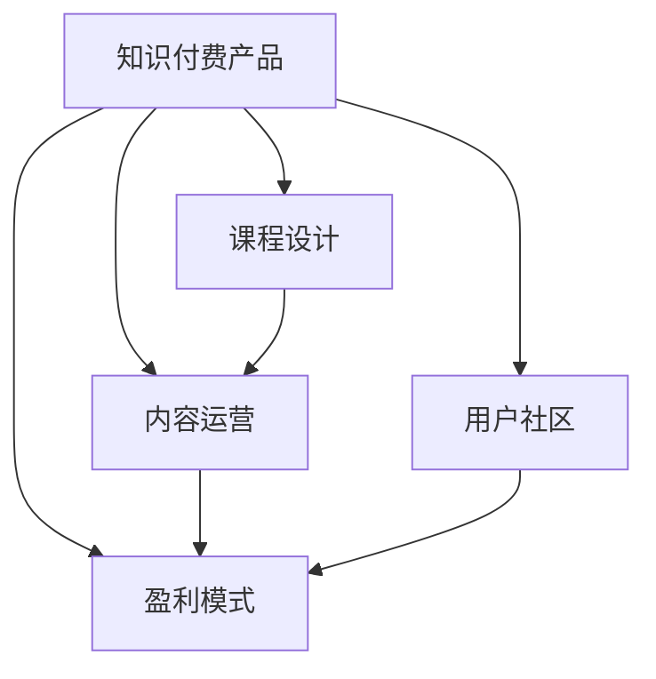

                 

# 如何打造高收益的程序员知识付费产品

在技术日新月异的今天，程序员的知识付费市场正在迅速崛起。不论是资深专家还是初学者，通过知识付费产品获得专业知识、技能提升、职业发展指导，已经成为行业内的重要趋势。然而，高质量的知识付费产品不是一蹴而就的，需要从市场定位、内容设计、运营策略等多个维度进行精心策划。本文将围绕《如何打造高收益的程序员知识付费产品》这一主题，深入探讨其核心概念、算法原理、具体操作步骤以及实际应用场景，为有志于此道的开发者提供全方位的指导。

## 1. 背景介绍

### 1.1 问题由来

随着互联网和人工智能技术的迅猛发展，程序员的职业技能需求也在不断变化。然而，持续的职业技能提升需要大量的时间和资源投入，尤其是对于工作中忙碌的开发者来说，这种需求与现实之间存在明显的矛盾。知识付费产品通过提供专业、高效、系统的学习资源，帮助程序员在碎片化的时间中快速获取知识和技能提升，满足了广大程序员对学习和职业发展的需求。

### 1.2 问题核心关键点

高质量的程序员知识付费产品，应该具备以下核心特征：
- **目标明确**：产品应该明确目标用户群体，针对其职业发展需求提供针对性的学习资源。
- **内容精准**：课程内容应涵盖实际工作中的核心技能和知识点，确保实用性。
- **师资雄厚**：邀请业内资深专家和实战经验丰富的开发者授课，提升课程质量。
- **互动性强**：通过课程论坛、在线答疑、实战项目等形式，增强学生与老师的互动，提升学习效果。
- **持续更新**：知识付费产品应该紧跟技术发展趋势，持续更新课程内容，确保学习资源的时效性和前沿性。

## 2. 核心概念与联系

### 2.1 核心概念概述

为了更系统地理解程序员知识付费产品的设计和运营，本节将介绍几个核心概念及其相互联系：

- **知识付费产品**：即知识付费服务的载体，通过在线平台提供系统化、有价值的学习内容，帮助用户实现技能提升和职业发展。
- **课程设计**：围绕目标用户群体的实际需求，设计适合的课程内容和形式，确保其精准性和实用性。
- **内容运营**：通过营销推广、用户反馈等手段，持续优化和更新课程内容，提升用户满意度和参与度。
- **用户社区**：构建一个积极活跃的用户社区，促进知识分享、交流与合作，增强用户粘性。
- **盈利模式**：探索多样化的盈利方式，如订阅费、课程购买、广告分成等，实现产品收益最大化。

这些核心概念之间的关系通过以下Mermaid流程图表示：



该流程图展示了知识付费产品及其核心概念之间的逻辑联系：

1. 知识付费产品是整个系统的核心，通过课程设计、内容运营、用户社区和盈利模式等多方面协同运作，提供有价值的学习资源，满足用户需求。
2. 课程设计是知识付费产品的基础，根据用户需求设计实用的课程内容。
3. 内容运营是知识付费产品的保障，通过持续更新和优化课程内容，提升用户满意度和参与度。
4. 用户社区是知识付费产品的补充，增强用户粘性和互动性。
5. 盈利模式是知识付费产品的最终目标，通过多样化的盈利方式实现商业价值最大化。

## 3. 核心算法原理 & 具体操作步骤

### 3.1 算法原理概述

知识付费产品的设计与运营，本质上是一个数据驱动的决策过程。通过数据分析和机器学习技术，可以优化课程内容、提高用户参与度、实现精准营销，从而提升知识付费产品的收益。

具体而言，知识付费产品的设计与运营算法包括以下几个关键环节：
1. **用户行为分析**：通过分析用户在学习过程中的行为数据，了解用户需求和兴趣，优化课程内容和推荐算法。
2. **课程内容推荐**：利用协同过滤、深度学习等技术，根据用户历史行为和偏好推荐适合的课程内容。
3. **用户参与度提升**：通过互动问答、实战项目等方式，增加用户在学习过程中的参与度和互动性。
4. **营销推广优化**：通过A/B测试、数据分析等手段，优化营销推广策略，提升产品知名度和用户转化率。
5. **收入最大化**：通过分析用户支付行为，优化定价策略和促销活动，实现收益最大化。

### 3.2 算法步骤详解

下面是知识付费产品的设计与运营的具体步骤：

**Step 1: 市场调研与用户画像**
- 通过问卷调查、访谈等方式，了解目标用户群体的需求和痛点。
- 分析用户数据，构建用户画像，明确不同用户群体的特征和行为模式。

**Step 2: 课程内容设计与优化**
- 根据用户需求和画像，设计适合不同用户群体的课程内容。
- 引入专家和实战经验丰富的开发者授课，确保课程内容的高质量和实用性。
- 引入多样化的教学形式，如视频、文章、互动式问答等，提升学习效果。
- 持续收集用户反馈，优化和更新课程内容，保持时效性和前沿性。

**Step 3: 用户参与度提升**
- 通过课程论坛、在线答疑、实战项目等方式，增强用户与教师的互动，提升学习效果。
- 设置学习打卡、积分奖励等激励机制，激发用户参与度。
- 引入社区讨论、技术交流等活动，促进知识共享与合作。

**Step 4: 内容运营与营销推广**
- 利用数据分析技术，监控课程用户行为，优化课程内容和推荐算法。
- 通过社交媒体、SEO优化、合作伙伴推广等方式，提升产品知名度。
- 设计A/B测试方案，优化营销推广策略，提升用户转化率。

**Step 5: 收入最大化**
- 分析用户支付行为，优化定价策略和促销活动，实现收益最大化。
- 引入订阅制、按需付费等多种盈利模式，提高用户粘性和复购率。

### 3.3 算法优缺点

知识付费产品的设计与运营算法具有以下优点：
1. 数据驱动：通过数据分析技术，可以优化课程内容和营销策略，提升用户满意度和产品收益。
2. 精准推荐：通过协同过滤、深度学习等技术，可以精准推荐适合用户的课程内容，提升用户参与度。
3. 持续优化：通过持续收集用户反馈，不断优化课程内容和运营策略，保持产品的高质量和用户粘性。

然而，该算法也存在一些局限性：
1. 数据隐私：在数据收集和分析过程中，需要保护用户隐私，确保数据安全。
2. 技术门槛：需要具备一定的数据分析和机器学习技术，可能对非技术背景的开发者构成挑战。
3. 内容质量：算法优化课程内容的前提是课程内容本身具有高质量，如果课程内容质量不佳，算法也无法提升用户参与度。

### 3.4 算法应用领域

知识付费产品的设计与运营算法在多个领域都有广泛应用，如：

- **在线教育**：通过数据分析和机器学习技术，提升在线课程的学习效果和用户满意度。
- **企业培训**：通过个性化推荐和内容运营，提升企业内部培训的效果和员工参与度。
- **技术博客与社区**：通过数据分析技术，提升技术文章和社区讨论的热度和参与度。
- **技术会议与讲座**：通过营销推广和内容运营，提高技术会议和讲座的参与度和影响力。

## 4. 数学模型和公式 & 详细讲解 & 举例说明

### 4.1 数学模型构建

为了量化知识付费产品的设计与运营效果，我们构建如下数学模型：

设知识付费产品的用户数为 $U$，课程数量为 $C$，用户参与度为 $E$，用户留存率为 $R$，平均付费金额为 $P$，则知识付费产品的总收入 $R$ 可表示为：

$$
R = U \times E \times R \times P
$$

其中 $U$ 表示产品拥有的用户数，$E$ 表示用户参与度，$R$ 表示用户留存率，$P$ 表示用户平均付费金额。

### 4.2 公式推导过程

对于知识付费产品的总收入 $R$，可以进一步细化为：

$$
R = \sum_{i=1}^{C} \sum_{j=1}^{U} e_{ij} \times r_j \times p_j
$$

其中 $e_{ij}$ 表示用户 $j$ 对课程 $i$ 的参与度，$r_j$ 表示用户 $j$ 的留存率，$p_j$ 表示用户 $j$ 的平均付费金额。

进一步简化模型，可以得到：

$$
R = \sum_{i=1}^{C} \sum_{j=1}^{U} \frac{e_{ij}}{N_j} \times \frac{N_j}{U} \times \frac{r_j}{T_j} \times \frac{T_j}{U} \times p_j
$$

其中 $N_j$ 表示用户 $j$ 在一段时间内访问课程的总数，$T_j$ 表示用户 $j$ 在一段时间内访问课程的时间。

### 4.3 案例分析与讲解

假设某知识付费平台共有 $C=500$ 门课程，有 $U=100,000$ 名用户，通过数据分析发现，有 $E=70\%$ 的用户会定期参与课程学习，有 $R=60\%$ 的用户会持续订阅课程，有 $P=100$ 元/课程/月。则该平台的总收入 $R$ 可以通过公式计算得到：

$$
R = 100,000 \times 70\% \times 60\% \times 100 \times 100 = 4200 万元
$$

通过该案例分析，可以看到，用户参与度、用户留存率和平均付费金额是知识付费产品收入的关键因素。

## 5. 项目实践：代码实例和详细解释说明

### 5.1 开发环境搭建

在进行知识付费产品的设计与运营时，需要搭建一个全面的开发环境。以下是Python环境的搭建流程：

1. 安装Python：从官网下载并安装最新版本的Python。
2. 安装虚拟环境：使用pip安装virtualenv，并创建虚拟环境。
3. 安装依赖包：使用pip安装所需的依赖包，如Flask、SQLAlchemy、Numpy等。
4. 搭建开发环境：使用Jupyter Notebook或PyCharm等IDE搭建开发环境。

### 5.2 源代码详细实现

以下是使用Flask框架搭建知识付费平台的示例代码：

```python
from flask import Flask, render_template, request
from flask_sqlalchemy import SQLAlchemy

app = Flask(__name__)
app.config['SQLALCHEMY_DATABASE_URI'] = 'sqlite:///users.db'
db = SQLAlchemy(app)

class User(db.Model):
    id = db.Column(db.Integer, primary_key=True)
    name = db.Column(db.String(80), nullable=False)
    courses = db.relationship('Course', backref='users', lazy=True)

class Course(db.Model):
    id = db.Column(db.Integer, primary_key=True)
    name = db.Column(db.String(120), nullable=False)
    price = db.Column(db.Float, nullable=False)
    users = db.relationship('User', backref='courses', lazy=True)

@app.route('/')
def index():
    courses = Course.query.all()
    return render_template('index.html', courses=courses)

@app.route('/enroll', methods=['POST'])
def enroll():
    user_id = request.form['user_id']
    course_id = request.form['course_id']
    user = User.query.get(user_id)
    course = Course.query.get(course_id)
    user.courses.append(course)
    db.session.commit()
    return 'Enrolled successfully'

if __name__ == '__main__':
    app.run(debug=True)
```

### 5.3 代码解读与分析

该示例代码使用Flask框架搭建了一个简单的知识付费平台，包括以下关键组件：

- **Flask框架**：作为Web开发的基础框架，提供路由、模板渲染等功能。
- **SQLAlchemy**：作为ORM库，用于数据库的交互和管理。
- **User和Course模型**：分别表示用户和课程，用于存储用户购买课程的信息。
- **index和enroll路由**：分别用于展示课程列表和用户购买课程。

该示例代码虽然简单，但包含了知识付费平台的基本功能。在实际开发中，还需要进一步完善课程推荐、用户行为分析、数据分析等功能，以满足实际需求。

### 5.4 运行结果展示

运行以上代码，在浏览器中访问`http://localhost:5000`，可以看到课程列表页面。通过提交表单，用户可以购买感兴趣的课程，从而实现知识付费产品的基本功能。

## 6. 实际应用场景

### 6.1 在线教育

在线教育平台通过知识付费产品提供多样化的学习资源，如编程、数据分析、人工智能等课程。通过用户行为分析和个性化推荐算法，平台可以提供高质量的课程内容，满足用户学习需求。例如，Coursera和Udacity等平台，通过知识付费产品取得了巨大的成功。

### 6.2 企业培训

企业培训平台通过知识付费产品提供定制化的课程内容，帮助员工提升职业技能和职业素养。通过数据分析技术，平台可以了解员工的学习需求和反馈，优化课程内容和教学方式，提升培训效果。例如，Kaggle和Pluralsight等平台，为企业提供了丰富的培训资源。

### 6.3 技术博客与社区

技术博客和社区通过知识付费产品提供优质的技术文章和互动社区，帮助开发者提升技术水平。通过用户行为分析技术，平台可以了解用户的学习路径和兴趣，提供个性化的学习资源。例如，Stack Overflow和GitHub等平台，通过知识付费产品实现了技术知识的传播和共享。

### 6.4 技术会议与讲座

技术会议和讲座通过知识付费产品提供高质量的演讲和资料，帮助开发者了解最新的技术趋势和前沿成果。通过营销推广和数据分析技术，平台可以吸引更多的开发者参与，提升会议和讲座的影响力。例如，DockerCon和ApacheCon等会议，通过知识付费产品实现了技术交流和知识传播。

## 7. 工具和资源推荐

### 7.1 学习资源推荐

为了帮助开发者系统掌握知识付费产品的设计与运营，这里推荐一些优质的学习资源：

1. 《知识付费产品设计与运营》系列博文：由知识付费领域专家撰写，深入浅出地介绍了知识付费产品的设计思路和运营策略。
2. 《数据驱动的课程推荐系统》课程：斯坦福大学开设的机器学习课程，介绍了协同过滤和深度学习在课程推荐中的应用。
3. 《知识付费产品设计》书籍：详细介绍了知识付费产品的市场定位、课程设计、内容运营等多个方面，帮助开发者系统掌握知识付费产品的设计思路。
4. Udacity《知识付费产品设计与运营》课程：结合实际案例，深入讲解知识付费产品的设计、运营和盈利模式。
5. Coursera《数据驱动的课程推荐》课程：介绍了数据驱动的课程推荐技术，帮助开发者提升课程推荐效果。

通过对这些资源的学习实践，相信你一定能够快速掌握知识付费产品的设计思路，并将其应用到实际开发中。

### 7.2 开发工具推荐

高效的开发离不开优秀的工具支持。以下是几款用于知识付费产品设计与运营开发的常用工具：

1. Flask：轻量级的Web开发框架，适合快速迭代研究。可以用于搭建知识付费平台的API接口。
2. SQLAlchemy：作为ORM库，用于数据库的交互和管理。可以用于存储和查询用户和课程信息。
3. Jupyter Notebook：交互式笔记本，适合数据探索和算法实验。可以用于进行数据分析和模型训练。
4. PyCharm：功能丰富的IDE，适合大型项目开发。可以用于知识付费平台的开发和调试。
5. Git：版本控制工具，适合团队协作开发。可以用于版本管理和代码协同。

合理利用这些工具，可以显著提升知识付费产品的开发效率，加快创新迭代的步伐。

### 7.3 相关论文推荐

知识付费产品的设计与运营技术的发展源于学界的持续研究。以下是几篇奠基性的相关论文，推荐阅读：

1. Attention is All You Need（即Transformer原论文）：提出了Transformer结构，开启了知识付费产品数据驱动的推荐范式。
2. BERT: Pre-training of Deep Bidirectional Transformers for Language Understanding：提出BERT模型，引入基于掩码的自监督预训练任务，刷新了知识付费产品推荐算法的SOTA。
3. Parameter-Efficient Transfer Learning for NLP：提出Adapter等参数高效微调方法，在知识付费产品推荐算法中取得更好的效果。
4. Prefix-Tuning: Optimizing Continuous Prompts for Generation：引入基于连续型Prompt的推荐范式，为知识付费产品推荐算法提供了新的思路。
5. AdaLoRA: Adaptive Low-Rank Adaptation for Parameter-Efficient Fine-Tuning：使用自适应低秩适应的推荐算法，在知识付费产品推荐中取得更好的效果。

这些论文代表了大语言模型微调技术的发展脉络。通过学习这些前沿成果，可以帮助研究者把握学科前进方向，激发更多的创新灵感。

## 8. 总结：未来发展趋势与挑战

### 8.1 总结

本文对知识付费产品的设计与运营进行了全面系统的介绍。首先阐述了知识付费产品的背景和意义，明确了产品设计与运营的关键要素，包括市场定位、课程设计、内容运营、用户社区和盈利模式。其次，从原理到实践，详细讲解了知识付费产品的设计与运营算法，包括用户行为分析、课程内容推荐、用户参与度提升、内容运营与营销推广、收入最大化等关键环节。同时，本文还广泛探讨了知识付费产品在多个领域的应用场景，展示了知识付费产品的广阔前景。

通过本文的系统梳理，可以看到，知识付费产品通过数据驱动的设计和运营，提供高质量、有价值的学习资源，满足了广大程序员对技能提升和职业发展的需求。随着技术的不断发展，知识付费产品必将在更多行业领域大放异彩，为人工智能技术在垂直行业的落地应用提供新的路径。

### 8.2 未来发展趋势

展望未来，知识付费产品的设计与运营技术将呈现以下几个发展趋势：

1. 个性化推荐算法：利用深度学习和协同过滤技术，根据用户历史行为和兴趣，提供更加个性化的课程推荐。
2. 多模态学习：结合文本、图像、视频等多种模态的数据，提升用户的学习效果和满意度。
3. 动态课程设计：通过数据分析技术，根据用户反馈和学习效果，动态调整课程内容和形式，提升课程质量。
4. 用户互动增强：通过智能问答、在线直播等形式，增强用户在学习过程中的互动和参与度。
5. 在线教育融合：知识付费产品与其他在线教育平台深度融合，提供更加全面和系统化的学习资源。

以上趋势将进一步提升知识付费产品的学习效果和用户满意度，为其在更多行业领域的应用提供新的动力。

### 8.3 面临的挑战

尽管知识付费产品的发展前景广阔，但在迈向更加智能化、普适化应用的过程中，它仍面临诸多挑战：

1. 内容质量保障：如何确保课程内容的高质量和实用性，避免误导用户。
2. 用户隐私保护：在数据收集和分析过程中，如何保护用户隐私，确保数据安全。
3. 用户参与度提升：如何提升用户参与度和互动性，增强用户粘性。
4. 盈利模式多元化：如何设计多样化的盈利模式，实现产品收益最大化。
5. 技术门槛降低：如何降低技术门槛，吸引更多开发者和用户。

这些挑战需要通过技术创新和商业模式创新来解决，才能确保知识付费产品的高收益和可持续发展。

### 8.4 研究展望

未来知识付费产品的设计与运营研究需要在以下几个方面寻求新的突破：

1. 知识图谱与深度学习融合：通过知识图谱与深度学习技术的结合，构建更全面、系统的知识体系，提升课程内容的质量和深度。
2. 多模态推荐算法：结合文本、图像、视频等多种模态的数据，提升推荐算法的准确性和用户满意度。
3. 用户行为分析技术：利用深度学习和大数据分析技术，深入挖掘用户的学习行为和兴趣，提供更加精准的课程推荐和个性化服务。
4. 用户参与度优化：通过智能问答、在线直播等形式，增强用户在学习过程中的互动和参与度，提升学习效果。
5. 数据隐私保护技术：引入区块链、加密技术等手段，保障用户隐私和数据安全。

这些研究方向的探索，必将引领知识付费产品设计与运营技术的不断进步，为其在更多行业领域的应用提供新的思路。

## 9. 附录：常见问题与解答

**Q1: 知识付费产品的设计与运营需要哪些技术支持？**

A: 知识付费产品的设计与运营需要以下技术支持：
1. Web开发技术：如Flask、Django等，用于搭建Web平台和API接口。
2. 数据库技术：如SQLAlchemy、MySQL等，用于存储和管理用户和课程信息。
3. 数据分析技术：如Scikit-Learn、TensorFlow等，用于用户行为分析和课程推荐。
4. 机器学习技术：如协同过滤、深度学习等，用于个性化推荐和课程设计优化。
5. 用户体验技术：如Javascript、HTML5等，用于提升用户界面和交互体验。

**Q2: 如何设计知识付费产品的盈利模式？**

A: 知识付费产品的盈利模式可以多样，包括但不限于：
1. 订阅费：用户按月或按年支付固定费用，获取课程内容。
2. 课程购买：用户单次购买课程，获取课程内容。
3. 广告分成：在课程页面展示广告，获得广告分成。
4. 会员特权：提供高级会员服务，如免费课程、专属直播等。
5. 合作推广：与第三方平台或品牌合作，推广课程内容。

**Q3: 知识付费产品如何提升用户参与度？**

A: 知识付费产品可以通过以下方式提升用户参与度：
1. 个性化推荐：根据用户历史行为和兴趣，推荐适合的课程内容。
2. 互动问答：提供智能问答功能，解决用户在学习过程中的问题。
3. 在线直播：举办专家讲座、技术分享等在线直播活动，提升用户参与度。
4. 实战项目：提供实战项目和案例分析，增强用户学习效果。
5. 社区讨论：构建用户社区，促进知识共享与合作。

**Q4: 知识付费产品的用户行为分析有哪些关键指标？**

A: 知识付费产品的用户行为分析关键指标包括：
1. 课程访问量：用户访问课程的频率和时长。
2. 课程完成率：用户完成课程的比例和速度。
3. 用户评分：用户对课程的评分和评价。
4. 用户反馈：用户在学习过程中的反馈和建议。
5. 用户留存率：用户在一定时间内继续使用产品的比例。

通过分析这些指标，可以了解用户的学习行为和需求，优化课程内容和推荐算法，提升用户满意度和产品收益。

**Q5: 知识付费产品的推荐算法有哪些？**

A: 知识付费产品的推荐算法包括但不限于：
1. 协同过滤算法：基于用户行为数据，推荐相似用户喜欢的课程。
2. 深度学习算法：利用神经网络模型，根据用户特征和课程内容，推荐适合的课程。
3. 基于内容的推荐算法：根据课程内容的关键词和特征，推荐相似课程。
4. 混合推荐算法：结合多种推荐算法，提升推荐效果。

这些推荐算法可以结合用户行为数据、课程内容特征、用户画像等多方面信息，提供更加精准和个性化的课程推荐。

---

作者：禅与计算机程序设计艺术 / Zen and the Art of Computer Programming

