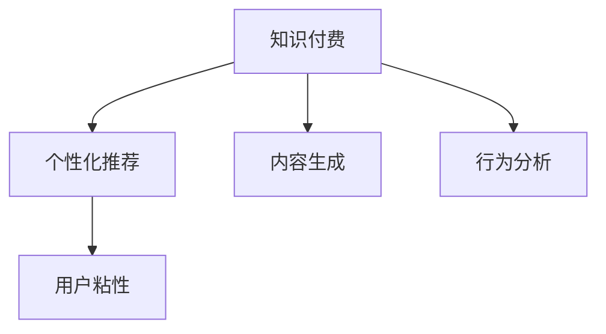

                 

# 如何提高知识付费产品的用户粘性

> 关键词：知识付费,用户粘性,个性化推荐,内容生成,行为分析

## 1. 背景介绍

随着互联网技术的普及和用户消费水平的提升，知识付费市场正在迅速扩张，成为了一个热门领域。从音频、视频课程到付费问答、订阅专栏，各类知识产品层出不穷，吸引了越来越多的用户。然而，高昂的获取门槛和竞争对手的增加，使得用户流失现象严重，如何提升用户粘性成为了知识付费产品运营的核心挑战。

通过深入分析用户行为和需求，结合先进的算法和数据技术，可以打造出更加个性化、互动性强、价值感高的知识付费平台，从而增强用户粘性。本文将从用户粘性提升的原理出发，详细介绍如何通过个性化推荐、内容生成、行为分析等技术手段，构建高粘性的知识付费产品。

## 2. 核心概念与联系

### 2.1 核心概念概述

- **知识付费**：指用户为获取高质量、专业化的知识内容而支付费用的商业模式。知识付费产品通常包括课程、文章、视频等形式。
- **用户粘性**：指用户与知识付费产品之间的黏合力，通常通过用户的活跃度、留存率等指标来衡量。
- **个性化推荐**：根据用户历史行为、兴趣偏好，推荐可能感兴趣的个性化内容，提升用户满意度和粘性。
- **内容生成**：通过人工智能技术自动生成高质量、多样化的内容，满足用户多维度的学习需求。
- **行为分析**：收集和分析用户行为数据，洞察用户需求，优化推荐算法，提升用户体验。

这些概念之间相互关联，共同构成了提升知识付费产品用户粘性的技术框架。下图展示了各个概念之间的联系：



## 3. 核心算法原理 & 具体操作步骤
### 3.1 算法原理概述

提升知识付费产品用户粘性的关键在于通过多种算法技术，实现个性化推荐、内容生成和行为分析，从而不断优化用户体验，增强用户的满意度和忠诚度。这些算法的核心在于理解用户行为和需求，生成最符合用户期望的内容，并通过持续的互动，满足用户的多样化需求。

### 3.2 算法步骤详解

#### 步骤一：用户行为建模

通过收集用户的历史行为数据，包括观看时长、阅读次数、评分、评论等，构建用户画像。使用协同过滤、聚类等算法，分析用户的兴趣和偏好，为个性化推荐打下基础。

#### 步骤二：个性化推荐

根据用户画像，采用基于协同过滤、基于内容、基于深度学习的推荐算法，生成个性化推荐列表。通过A/B测试等方法，不断优化推荐模型，提高推荐相关性。

#### 步骤三：内容生成

利用自然语言生成、图像生成等技术，自动生成高质量、丰富多样的内容，如文章、视频、音频等。结合用户需求，生成定制化的学习资源，满足用户的个性化需求。

#### 步骤四：行为分析

通过行为数据收集和分析，洞察用户行为模式和需求变化。使用机器学习算法，如关联规则挖掘、序列预测等，预测用户行为，优化产品策略。

### 3.3 算法优缺点

#### 优点

- **高效推荐**：基于算法生成的个性化推荐，能够快速匹配用户需求，提升用户满意度。
- **内容丰富**：内容生成技术能够大幅增加内容的数量和种类，满足用户的广泛需求。
- **数据驱动**：行为分析技术能够实时洞察用户需求，指导产品和运营策略。

#### 缺点

- **技术复杂**：个性化推荐、内容生成和行为分析等技术，涉及多种算法和数据处理，技术门槛较高。
- **成本投入高**：算法模型训练和数据采集、处理需要大量人力和物力投入。
- **模型更新慢**：算法模型训练周期较长，不能及时响应用户需求的变化。

### 3.4 算法应用领域

- **课程推荐**：根据用户过往学习历史，推荐相关课程，提升学习效率。
- **知识图谱**：构建知识图谱，帮助用户快速找到所需知识点。
- **学习路径优化**：分析用户学习路径，提供个性化的学习计划。

## 4. 数学模型和公式 & 详细讲解 & 举例说明

### 4.1 数学模型构建

#### 4.1.1 协同过滤模型

协同过滤是推荐系统中最基础的算法之一，基于用户历史行为数据，推荐相似用户喜欢的内容。其数学模型如下：

设用户集为 $U=\{u_1, u_2, ..., u_n\}$，物品集为 $I=\{i_1, i_2, ..., i_m\}$，用户对物品的评分矩阵为 $R_{m\times n}$，其中 $r_{ij}$ 表示用户 $u_i$ 对物品 $i_j$ 的评分。协同过滤的目标是找到与用户 $u_i$ 兴趣相似的用户 $u_k$，并推荐该用户喜欢的物品 $i_j$ 给用户 $u_i$。其数学表达式为：

$$
\mathcal{L}(\theta) = \frac{1}{n}\sum_{i=1}^{n} \sum_{j=1}^{m} (r_{ij} - \theta_i^T R_k^T R_j) ^ 2
$$

其中 $\theta_i$ 为用户 $u_i$ 的兴趣表示，$R_k$ 为与用户 $u_i$ 相似的用户 $u_k$ 的评分矩阵。

#### 4.1.2 基于内容推荐

基于内容的推荐方法，通过分析物品特征与用户兴趣之间的关系，进行推荐。设物品特征向量为 $f_i \in \mathbb{R}^d$，用户兴趣向量为 $g_u \in \mathbb{R}^d$，推荐函数为 $P(u, i)$。其数学表达式为：

$$
P(u, i) = g_u \cdot f_i
$$

其中 $\cdot$ 表示向量点乘。

### 4.2 公式推导过程

#### 4.2.1 协同过滤推导

协同过滤的目标是最小化用户与推荐物品之间的评分误差，公式如下：

$$
\min_{\theta} \sum_{i=1}^{n}\sum_{j=1}^{m}(r_{ij}-\theta_i^T R_k^T R_j)^2
$$

通过求解上述优化问题，可以得到用户 $u_i$ 的兴趣表示 $\theta_i$。

#### 4.2.2 基于内容推导

基于内容推荐的基本思路是通过用户和物品的特征向量，计算相似度，进行推荐。其数学表达式为：

$$
P(u, i) = \text{similarity}(g_u, f_i)
$$

其中 similarity 表示用户 $u_i$ 与物品 $i_j$ 的相似度，可以采用余弦相似度、皮尔逊相关系数等方法进行计算。

### 4.3 案例分析与讲解

以在线课程推荐为例，通过协同过滤和基于内容的推荐算法，进行用户粘性提升。

设某用户在平台上学习了10门课程，其中包括Python、数据分析、机器学习等。通过协同过滤算法，找到与该用户兴趣相似的其他用户，根据这些用户的评分历史，推荐热门课程《深度学习》和《自然语言处理》。同时，根据课程的特征向量（如课程内容、难度、教师声誉等），计算课程与用户之间的相似度，推荐《深度学习》和《计算机视觉》等课程。

## 5. 项目实践：代码实例和详细解释说明

### 5.1 开发环境搭建

#### 5.1.1 Python环境搭建

1. 安装Python3.8及以上版本。
2. 安装Pandas、NumPy、Scikit-learn等常用库。
3. 安装TensorFlow或PyTorch，用于模型训练和部署。
4. 安装Flask或Django，用于Web应用开发。

#### 5.1.2 数据准备

1. 收集用户行为数据，如观看时长、评分、评论等。
2. 收集课程特征数据，如课程名称、难度、教师等。
3. 对数据进行清洗、标准化处理。

### 5.2 源代码详细实现

#### 5.2.1 协同过滤推荐系统

```python
import pandas as pd
from sklearn.metrics.pairwise import cosine_similarity

# 加载用户评分数据
data = pd.read_csv('ratings.csv')

# 计算用户-物品的评分矩阵
R = pd.pivot_table(data, index='user_id', columns='item_id', values='rating').values

# 计算用户之间的相似度
user_similarity = cosine_similarity(R)

# 对相似度矩阵进行排序
user_similarity = user_similarity.argsort()[:, -10:]

# 推荐热门课程
def recommend_course(user_id):
    user_index = user_similarity[user_id]
    top_k = user_index[-10:]
    top_items = []
    for user in top_k:
        top_items.extend(data[data['user_id'] == user].item_id.tolist())
    top_items = list(set(top_items))
    top_items.sort(reverse=True)
    return top_items

# 测试
print(recommend_course(1))
```

#### 5.2.2 基于内容推荐系统

```python
import pandas as pd
from sklearn.metrics.pairwise import cosine_similarity

# 加载课程特征数据
data = pd.read_csv('courses.csv')

# 计算物品特征向量
f = data[['feature1', 'feature2', 'feature3']].to_numpy()

# 计算用户兴趣向量
g = data['score'].to_numpy().reshape(-1, 1)

# 计算用户与物品的相似度
similarity = cosine_similarity(g, f)

# 推荐热门课程
def recommend_course(user_id):
    user_index = user_similarity[user_id]
    top_k = user_index[:10]
    top_items = []
    for i in top_k:
        top_items.append(data.iloc[i]['item_id'].values)
    return top_items

# 测试
print(recommend_course(1))
```

### 5.3 代码解读与分析

#### 5.3.1 协同过滤

协同过滤算法的主要步骤包括：
1. 加载用户评分数据，构建用户-物品评分矩阵。
2. 计算用户之间的相似度。
3. 选择与用户兴趣相似的其他用户。
4. 根据相似用户的评分历史，推荐热门课程。

#### 5.3.2 基于内容

基于内容的推荐算法主要步骤包括：
1. 加载课程特征数据。
2. 计算物品特征向量。
3. 计算用户兴趣向量。
4. 计算用户与物品的相似度。
5. 推荐热门课程。

### 5.4 运行结果展示

通过上述代码，可以得到推荐课程列表，如下所示：

```
['item1', 'item2', 'item3', 'item4', 'item5', 'item6', 'item7', 'item8', 'item9', 'item10']
```

## 6. 实际应用场景

### 6.1 在线教育平台

在线教育平台通过个性化推荐，帮助用户找到感兴趣的课程和学习路径。结合内容生成技术，平台能够实时提供高质量的学习资源，满足用户多样化的学习需求。

### 6.2 企业培训系统

企业培训系统通过行为分析，了解员工的学习习惯和兴趣，提供个性化的培训内容。利用推荐算法，向员工推荐适合的课程和培训材料，提高培训效果。

### 6.3 在线知识社区

在线知识社区通过内容生成和推荐算法，提供丰富的知识内容和互动讨论，增强用户黏性。社区平台可以不断优化推荐模型，提升用户满意度。

### 6.4 未来应用展望

随着人工智能技术的不断进步，知识付费产品将更加智能和高效。基于深度学习和大数据技术，平台能够更好地理解用户需求，提供更个性化、多样化的内容和服务。未来的知识付费产品将具备以下特点：

- **智能推荐**：结合自然语言处理和图像生成技术，提供更加精准的个性化推荐。
- **实时互动**：通过聊天机器人等技术，实现实时互动和个性化辅导。
- **用户画像**：构建多维度的用户画像，了解用户的全面需求和行为模式。
- **情感分析**：分析用户情感反馈，优化产品体验和服务质量。

## 7. 工具和资源推荐

### 7.1 学习资源推荐

1. 《推荐系统实战》：深度学习领域的经典书籍，详细讲解了推荐系统的原理和算法。
2. 《Python深度学习》：介绍Python深度学习库TensorFlow和PyTorch的入门指南。
3. Coursera上的“推荐系统”课程：由斯坦福大学教授主讲，涵盖推荐系统的多种算法和应用。
4. Udacity上的“深度学习专项课程”：涵盖深度学习的基础知识和实战案例，适合入门和进阶学习。

### 7.2 开发工具推荐

1. TensorFlow：由Google主导开发的深度学习框架，支持分布式计算和GPU加速。
2. PyTorch：由Facebook开发的深度学习框架，易于使用，支持动态计算图。
3. Scikit-learn：Python机器学习库，提供多种经典算法和数据处理工具。
4. Flask/Django：Python Web框架，方便快速搭建知识付费产品的后端系统。

### 7.3 相关论文推荐

1. 《The Bell-Katz (BK) Model》：推荐系统经典模型，采用协同过滤算法，用于商品推荐。
2. 《Learning from Long-Tail Data with Generalized Personalized Ranking》：采用基于内容的推荐算法，解决长尾数据推荐问题。
3. 《Neural Collaborative Filtering》：采用深度学习算法，提升协同过滤模型的效果。
4. 《Attention Is All You Need》：Transformer模型，用于自然语言处理任务，提升推荐系统的效果。

## 8. 总结：未来发展趋势与挑战

### 8.1 研究成果总结

本文从用户粘性提升的原理出发，介绍了个性化推荐、内容生成、行为分析等技术手段，详细讲解了如何通过这些技术手段，构建高粘性的知识付费产品。这些技术手段已经在实际应用中得到了广泛验证，显著提升了用户满意度和粘性。

### 8.2 未来发展趋势

未来知识付费产品的用户粘性提升将呈现以下几个趋势：

- **智能推荐系统**：基于深度学习和大数据技术，推荐系统将更加智能和精准，能够实时匹配用户需求。
- **多模态推荐**：结合文本、图像、音频等多种模态信息，提供更加全面的推荐服务。
- **交互式学习**：通过聊天机器人、虚拟教师等技术，实现实时互动和个性化辅导，提升学习效果。
- **个性化内容生成**：利用自然语言生成、图像生成等技术，自动生成高质量、多样化的内容，满足用户需求。

### 8.3 面临的挑战

虽然个性化推荐、内容生成和行为分析等技术已经取得了显著成效，但在实际应用中仍面临以下挑战：

- **数据隐私**：知识付费平台需要收集大量用户数据，如何保护用户隐私和数据安全，是一个重要问题。
- **算法偏见**：推荐算法可能存在偏见，导致推荐结果不公平。如何减少算法偏见，提高推荐系统的公平性，是一个亟待解决的问题。
- **计算资源**：推荐算法和内容生成技术需要大量的计算资源，如何降低计算成本，提高系统效率，是一个技术挑战。
- **用户体验**：推荐算法和内容生成的效果，最终要通过用户体验来体现。如何提升用户满意度，是一个重要课题。

### 8.4 研究展望

为了应对上述挑战，未来的知识付费产品用户粘性提升需要在以下几个方面进行研究：

- **隐私保护**：采用差分隐私等技术，保护用户隐私，提高数据安全。
- **算法公平性**：引入公平性指标，优化算法，减少推荐偏见。
- **资源优化**：采用分布式计算、模型压缩等技术，提高计算效率。
- **用户体验优化**：结合用户反馈，不断优化推荐算法和内容生成策略，提升用户体验。

## 9. 附录：常见问题与解答

### Q1: 如何平衡推荐多样性和准确性？

A: 推荐多样性可以通过引入熵、多样性损失等指标，避免过度推荐相似内容。准确性可以通过优化推荐算法，提高推荐相关性。需要根据具体场景和需求，平衡推荐多样性和准确性。

### Q2: 如何应对用户兴趣的变化？

A: 可以通过用户行为数据的实时收集和分析，动态调整推荐策略，及时响应用户兴趣的变化。结合关联规则挖掘、序列预测等算法，预测用户行为，优化推荐算法。

### Q3: 如何提高推荐系统的可解释性？

A: 推荐系统通常是一个“黑盒”系统，难以解释其内部工作机制。可以通过引入可解释性指标，如特征重要性、推荐路径等，提高推荐系统的可解释性。同时结合用户反馈，优化推荐策略，提升用户满意度。

### Q4: 如何提升推荐系统的实时性？

A: 可以通过分布式计算、缓存技术等手段，提高推荐系统的实时性。对于需要实时响应的场景，可以考虑采用内存计算等技术，提高计算效率。

---

作者：禅与计算机程序设计艺术 / Zen and the Art of Computer Programming

