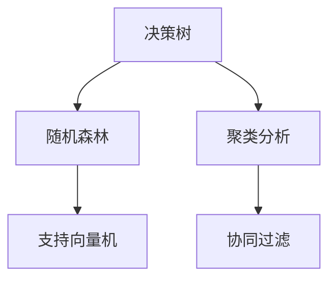

                 

# 如何提高管理决策的质量

在现代企业竞争激烈的环境中，决策速度和质量成为企业成功的关键因素。有效的管理决策不仅能够应对突发情况，还能为公司带来长期的竞争优势。然而，如何确保决策的科学性和准确性，一直是企业面临的巨大挑战。本文将从核心概念、算法原理、实践案例等多个角度探讨如何提高管理决策的质量。

## 1. 背景介绍

### 1.1 问题由来

随着信息技术的飞速发展，企业经营环境发生了巨大的变化。市场竞争日益激烈，用户需求复杂多变，传统的决策方式已经无法适应现代企业的需求。如何在海量数据和复杂环境中做出高效、准确的决策，成为企业管理的核心问题。

### 1.2 问题核心关键点

管理决策的质量依赖于数据的质量、模型的精准度和决策者的经验。高质量的数据和先进的决策模型，可以帮助决策者快速找到最优解，减少决策中的偏差和错误。同时，决策者的经验和直觉也不可或缺，能够弥补模型的不足，提供更灵活的决策方案。

## 2. 核心概念与联系

### 2.1 核心概念概述

为了更好地理解管理决策的优化方法，本节将介绍几个密切相关的核心概念：

- **决策树（Decision Tree）**：一种常见的分类模型，通过树形结构展示决策路径和结果。每个节点表示一个特征，分支代表不同的取值。决策树简单直观，易于理解和解释。

- **随机森林（Random Forest）**：一种集成学习方法，通过组合多个决策树，提高模型的泛化能力和抗干扰性。随机森林是机器学习中应用最广泛的算法之一。

- **支持向量机（Support Vector Machine, SVM）**：一种二分类模型，通过寻找最优超平面，将数据分为两类。SVM在高维空间和非线性问题上有较好的表现。

- **聚类分析（Clustering）**：一种无监督学习方法，通过将数据分为不同的组，发现数据的内在结构。聚类分析在市场细分、用户群体分析等领域有广泛应用。

- **协同过滤（Collaborative Filtering）**：一种推荐系统算法，通过分析用户行为数据，推测用户偏好。协同过滤在电商、社交网络等领域应用广泛。

这些核心概念之间的逻辑关系可以通过以下Mermaid流程图来展示：



这个流程图展示了一些核心概念及其之间的关系：

1. 决策树、随机森林、支持向量机等是监督学习方法。
2. 聚类分析和协同过滤是无监督学习方法。
3. 决策树、随机森林、支持向量机等主要解决分类和回归问题。
4. 聚类分析和协同过滤主要解决聚类和推荐问题。

这些概念共同构成了机器学习在决策中的应用框架，使其能够处理各种复杂的决策场景。通过理解这些核心概念，我们可以更好地把握机器学习在管理决策中的应用方向。

## 3. 核心算法原理 & 具体操作步骤

### 3.1 算法原理概述

基于数据驱动的管理决策，通常需要通过机器学习模型对数据进行分析和预测。常见的决策模型包括分类、回归、聚类、推荐等。其核心思想是：

1. **数据预处理**：对原始数据进行清洗、归一化、特征选择等操作，提高数据的质量和可用性。
2. **模型训练**：使用训练数据对模型进行训练，找到最优的模型参数。
3. **模型评估**：通过测试数据评估模型的性能，确保模型的泛化能力和准确性。
4. **决策制定**：将模型应用于实际决策场景，根据输入数据输出决策结果。

### 3.2 算法步骤详解

#### 3.2.1 数据预处理

数据预处理是管理决策的重要环节。主要包括以下几个步骤：

1. **数据清洗**：去除数据中的异常值、缺失值和重复值，保证数据的质量。
2. **数据归一化**：将数据进行标准化或归一化处理，使其具有可比性和一致性。
3. **特征选择**：选择对模型影响最大的特征，减少模型的复杂度，提高训练效率。

#### 3.2.2 模型训练

模型训练是决策模型的核心步骤。主要包括以下几个步骤：

1. **选择合适的算法**：根据问题的类型（分类、回归、聚类、推荐等），选择合适的机器学习算法。
2. **数据划分**：将数据划分为训练集、验证集和测试集，用于模型训练、调参和评估。
3. **模型训练**：使用训练集对模型进行训练，通过梯度下降等优化算法更新模型参数。

#### 3.2.3 模型评估

模型评估是确保决策模型可靠性的关键步骤。主要包括以下几个步骤：

1. **划分数据集**：将测试集分为交叉验证集和测试集，用于模型评估和调参。
2. **评估指标**：选择合适的评估指标，如准确率、召回率、F1值等，评估模型的性能。
3. **调参优化**：根据评估结果，调整模型参数，优化模型性能。

#### 3.2.4 决策制定

决策制定是将模型应用于实际场景的关键步骤。主要包括以下几个步骤：

1. **输入数据**：收集决策所需的数据，并进行必要的预处理。
2. **模型预测**：将数据输入模型，获取预测结果。
3. **决策执行**：根据预测结果，做出决策并执行。

### 3.3 算法优缺点

#### 3.3.1 优点

1. **高效准确**：基于数据的决策模型能够快速找到最优解，减少决策中的偏差和错误。
2. **可解释性强**：大多数机器学习算法提供了解释性强的特征重要性排序，帮助决策者理解模型的工作机制。
3. **适应性强**：决策模型可以应对复杂多变的决策场景，提供灵活的决策方案。

#### 3.3.2 缺点

1. **数据依赖性强**：决策模型的性能依赖于数据的质量和完整性，数据问题会导致模型失效。
2. **模型复杂度高**：部分决策模型（如神经网络）参数量庞大，训练复杂度较高。
3. **过度拟合风险**：决策模型容易过拟合训练数据，导致泛化能力不足。

### 3.4 算法应用领域

基于机器学习的管理决策模型，已经在企业决策的各个领域得到了广泛的应用，例如：

- **销售预测**：通过历史销售数据预测未来销售趋势，帮助企业制定合理的生产计划和销售策略。
- **客户细分**：通过聚类分析，将客户分成不同的细分市场，提供差异化的营销策略。
- **库存管理**：通过需求预测和库存优化模型，减少库存成本，提升库存周转率。
- **风险评估**：通过信用评分和风险评估模型，识别高风险客户，优化信贷和保险策略。
- **运营优化**：通过生产调度和资源分配模型，优化生产流程，提高运营效率。

除了上述这些经典应用外，管理决策模型还被创新性地应用到更多场景中，如供应链管理、市场分析、人力资源管理等，为企业决策提供了强大的技术支持。

## 4. 数学模型和公式 & 详细讲解 & 举例说明

### 4.1 数学模型构建

#### 4.1.1 分类模型

决策树和随机森林是常见的分类模型，其数学模型可以表示为：

$$
f(x) = \sum_{i=1}^{N} \alpha_i f_i(x)
$$

其中 $f(x)$ 表示模型对输入数据 $x$ 的预测结果，$f_i(x)$ 表示第 $i$ 个基模型对 $x$ 的预测结果，$\alpha_i$ 表示基模型的权重。

#### 4.1.2 回归模型

支持向量机是常见的回归模型，其数学模型可以表示为：

$$
f(x) = w^T x + b
$$

其中 $w$ 和 $b$ 为模型的权重和偏置，$x$ 为输入数据，$f(x)$ 为模型对 $x$ 的预测结果。

### 4.2 公式推导过程

#### 4.2.1 决策树

决策树的构建过程可以归纳为以下几个步骤：

1. **选择最佳特征**：通过计算信息增益（或信息增益比），选择对数据分类贡献最大的特征。
2. **划分数据集**：根据选择的特征，将数据集划分为不同的子集。
3. **递归构建树**：对每个子集重复上述步骤，直到满足停止条件（如节点数据量不足）。

#### 4.2.2 随机森林

随机森林的构建过程可以归纳为以下几个步骤：

1. **构建决策树**：通过随机选择特征和样本，构建多个决策树。
2. **集成决策结果**：对每个决策树输出的结果进行投票，取多数结果作为最终的预测结果。

### 4.3 案例分析与讲解

#### 4.3.1 案例1：销售预测

某电商公司希望预测未来几个月的销售情况，以制定合理的库存和营销策略。可以使用决策树或随机森林对历史销售数据进行建模，并根据外部因素（如季节、促销活动等）进行调参。

1. **数据预处理**：清洗和归一化销售数据，选择影响销售的关键特征（如季节、促销活动、用户行为等）。
2. **模型训练**：使用随机森林对历史数据进行训练，调整超参数（如树的数量、节点大小等），优化模型性能。
3. **模型评估**：通过交叉验证集评估模型性能，选择最优模型。
4. **决策制定**：根据模型预测结果，制定库存和营销策略，优化库存周转率。

#### 4.3.2 案例2：客户细分

某银行希望通过客户行为数据，将客户分成高价值和低价值两类，以制定差异化的营销策略。可以使用聚类分析对客户行为数据进行建模，并根据客户特征（如消费金额、贷款余额等）进行调参。

1. **数据预处理**：清洗和归一化客户行为数据，选择影响客户价值的关键特征。
2. **模型训练**：使用K-means聚类算法对数据进行聚类，调整聚类数量和距离度量。
3. **模型评估**：通过交叉验证集评估模型性能，选择最优聚类数量。
4. **决策制定**：根据聚类结果，制定差异化的营销策略，提高客户价值。

## 5. 项目实践：代码实例和详细解释说明

### 5.1 开发环境搭建

在进行管理决策模型的开发前，我们需要准备好开发环境。以下是使用Python进行Scikit-learn开发的环境配置流程：

1. 安装Anaconda：从官网下载并安装Anaconda，用于创建独立的Python环境。

2. 创建并激活虚拟环境：
```bash
conda create -n sklearn-env python=3.8 
conda activate sklearn-env
```

3. 安装Scikit-learn：使用conda安装Scikit-learn库，方便进行机器学习模型的开发。
```bash
conda install scikit-learn
```

4. 安装各类工具包：
```bash
pip install numpy pandas scikit-learn matplotlib tqdm jupyter notebook ipython
```

完成上述步骤后，即可在`sklearn-env`环境中开始决策模型的开发。

### 5.2 源代码详细实现

下面是使用Scikit-learn库进行决策树模型开发的Python代码实现。

```python
from sklearn.tree import DecisionTreeClassifier
from sklearn.metrics import accuracy_score

# 定义训练集和测试集
X_train, X_test, y_train, y_test = train_test_split(X, y, test_size=0.2, random_state=42)

# 构建决策树模型
clf = DecisionTreeClassifier(max_depth=3, random_state=42)
clf.fit(X_train, y_train)

# 预测测试集
y_pred = clf.predict(X_test)

# 计算准确率
accuracy = accuracy_score(y_test, y_pred)
print(f"Accuracy: {accuracy:.2f}")
```

### 5.3 代码解读与分析

让我们再详细解读一下关键代码的实现细节：

**train_test_split**：用于将数据集划分为训练集和测试集，方便模型训练和评估。

**DecisionTreeClassifier**：定义决策树模型，指定最大深度和随机种子。

**fit**：使用训练集对模型进行训练，更新模型参数。

**predict**：使用测试集进行预测，获取模型输出。

**accuracy_score**：计算模型在测试集上的准确率，评估模型性能。

通过以上代码实现，可以完整地构建一个决策树模型，并在测试集上评估其性能。

## 6. 实际应用场景

### 6.1 销售预测

某电商公司希望预测未来几个月的销售情况，以制定合理的库存和营销策略。决策树和随机森林模型可以在此场景下发挥重要作用。

通过收集历史销售数据和外部因素（如季节、促销活动等），构建决策树或随机森林模型，并在模型训练过程中加入外部因素，优化模型性能。最终，根据模型预测结果，制定库存和营销策略，优化库存周转率。

### 6.2 客户细分

某银行希望通过客户行为数据，将客户分成高价值和低价值两类，以制定差异化的营销策略。聚类分析模型在此场景下非常有价值。

通过收集客户行为数据，选择影响客户价值的关键特征，使用聚类算法对数据进行聚类，并在模型训练过程中调整聚类数量和距离度量。最终，根据聚类结果，制定差异化的营销策略，提高客户价值。

### 6.3 供应链管理

某制造公司希望优化供应链管理，提高运营效率。决策树和随机森林模型可以在此场景下发挥重要作用。

通过收集历史生产数据和供应链数据，构建决策树或随机森林模型，并在模型训练过程中加入供应链因素，优化模型性能。最终，根据模型预测结果，优化生产调度和资源分配，提高运营效率。

### 6.4 未来应用展望

随着机器学习技术的不断发展，基于数据驱动的管理决策将具备更强的灵活性和准确性。未来，管理决策模型将在更多领域得到应用，为传统行业带来变革性影响。

在智慧城市治理中，决策模型可以应用于城市事件监测、舆情分析、应急指挥等环节，提高城市管理的自动化和智能化水平，构建更安全、高效的未来城市。

在智慧医疗领域，决策模型可以应用于疾病预测、治疗方案选择、药品推荐等环节，提升医疗服务的智能化水平，辅助医生诊疗，加速新药开发进程。

在智能教育领域，决策模型可以应用于作业批改、学情分析、知识推荐等方面，因材施教，促进教育公平，提高教学质量。

## 7. 工具和资源推荐

### 7.1 学习资源推荐

为了帮助开发者系统掌握决策模型的理论基础和实践技巧，这里推荐一些优质的学习资源：

1. 《机器学习》（西瓜书）：由清华大学出版社出版的经典教材，系统介绍了机器学习的理论基础和实践应用。
2. 《Python机器学习》：斯坦福大学教授编写的实用指南，介绍了Python中常用的机器学习库和算法。
3. 《深度学习》（Ian Goodfellow）：深度学习领域的权威教材，涵盖了深度学习的理论基础和实际应用。
4. Kaggle竞赛平台：机器学习竞赛社区，提供大量的实战项目和数据集，帮助开发者积累实战经验。
5. Google Cloud Machine Learning Engine：谷歌提供的云机器学习平台，提供了丰富的机器学习服务和工具，方便开发者进行模型训练和部署。

通过对这些资源的学习实践，相信你一定能够快速掌握决策模型的精髓，并用于解决实际的决策问题。

### 7.2 开发工具推荐

高效的开发离不开优秀的工具支持。以下是几款用于决策模型开发的常用工具：

1. Python：开源编程语言，拥有丰富的机器学习库和工具，如Scikit-learn、TensorFlow等。
2. Jupyter Notebook：交互式编程环境，方便开发者进行代码调试和模型验证。
3. Scikit-learn：Python中常用的机器学习库，提供了丰富的算法和工具，如决策树、随机森林、聚类分析等。
4. TensorFlow：由谷歌主导开发的深度学习框架，支持多种模型和算法，如神经网络、卷积神经网络等。
5. Weights & Biases：模型训练的实验跟踪工具，可以记录和可视化模型训练过程中的各项指标，方便对比和调优。

合理利用这些工具，可以显著提升决策模型的开发效率，加快创新迭代的步伐。

### 7.3 相关论文推荐

决策模型的发展源于学界的持续研究。以下是几篇奠基性的相关论文，推荐阅读：

1. "Decision Trees for Medical Diagnosis"：最早提出决策树的论文，介绍了决策树的基本思想和算法。
2. "Support Vector Machines for Pattern Recognition"：提出了支持向量机模型，通过寻找最优超平面，将数据分为两类。
3. "A Framework of Random Forests"：介绍了随机森林模型的基本思想和算法，提供了有效的特征选择和模型集成方法。
4. "K-means: A Case Study in Tractability"：介绍了K-means聚类算法的基本思想和算法，提供了有效的聚类方法和评估指标。
5. "A Survey on Transfer Learning"：综述了迁移学习的基本思想和算法，提供了有效的模型迁移方法和技术。

这些论文代表了大数据驱动决策模型的发展脉络。通过学习这些前沿成果，可以帮助研究者把握学科前进方向，激发更多的创新灵感。

## 8. 总结：未来发展趋势与挑战

### 8.1 总结

本文对基于数据驱动的管理决策模型进行了全面系统的介绍。首先阐述了决策模型的研究背景和意义，明确了数据驱动决策模型在现代企业中的重要作用。其次，从原理到实践，详细讲解了决策模型的数学原理和关键步骤，给出了决策模型开发的完整代码实例。同时，本文还广泛探讨了决策模型在销售预测、客户细分、供应链管理等多个行业领域的应用前景，展示了数据驱动决策模型的巨大潜力。此外，本文精选了决策模型的各类学习资源，力求为读者提供全方位的技术指引。

通过本文的系统梳理，可以看到，基于数据驱动的管理决策模型正在成为企业决策的重要工具，极大地提高了决策的速度和质量，为现代企业带来了新的竞争优势。未来，伴随数据技术的不断发展，决策模型将具备更强的灵活性和准确性，为决策者提供更全面、可靠的支持。

### 8.2 未来发展趋势

展望未来，数据驱动的决策模型将呈现以下几个发展趋势：

1. **自动化决策**：通过AI技术，自动从数据中提取特征，选择模型，并进行优化和调参，降低人工干预的复杂度。
2. **多源数据融合**：将来自不同来源的数据进行融合，提高决策的全面性和准确性，如将客户行为数据和社交媒体数据结合。
3. **实时决策**：通过实时数据流处理和计算技术，实现实时决策和预测，提高决策的及时性和灵活性。
4. **可解释性增强**：通过可解释性模型和工具，提高决策模型的可解释性和透明度，帮助决策者理解和信任模型。
5. **自适应决策**：通过自适应学习算法，使决策模型能够不断学习和更新，适应不断变化的市场环境。

这些趋势凸显了大数据驱动决策模型的广阔前景。这些方向的探索发展，必将进一步提升决策模型的性能和应用范围，为决策者提供更全面、可靠的支持。

### 8.3 面临的挑战

尽管数据驱动的决策模型已经取得了瞩目成就，但在迈向更加智能化、普适化应用的过程中，它仍面临着诸多挑战：

1. **数据隐私和安全**：决策模型需要大量的数据进行训练和预测，但数据隐私和安全问题仍然需要高度重视，如数据脱敏、匿名化等。
2. **模型复杂度**：部分决策模型（如深度学习）参数量庞大，训练复杂度较高，需要高效的优化算法和计算资源。
3. **数据质量和完整性**：决策模型依赖于高质量的数据，数据问题和噪声会导致模型失效。
4. **模型解释性**：部分决策模型（如深度学习）缺乏解释性，难以解释模型内部工作机制和决策逻辑。
5. **实时性问题**：部分决策模型（如神经网络）推理速度较慢，无法满足实时决策的需求。

正视决策模型面临的这些挑战，积极应对并寻求突破，将是大数据驱动决策模型走向成熟的必由之路。相信随着学界和产业界的共同努力，这些挑战终将一一被克服，数据驱动决策模型必将在构建智能决策系统中发挥越来越重要的作用。

### 8.4 研究展望

面对大数据驱动决策模型所面临的挑战，未来的研究需要在以下几个方面寻求新的突破：

1. **数据隐私保护**：开发更高效的数据隐私保护技术，如差分隐私、联邦学习等，保护数据隐私和安全。
2. **模型压缩与加速**：开发更高效的模型压缩和加速技术，如剪枝、量化、模型并行等，提高模型效率。
3. **模型可解释性**：开发更可解释的模型和工具，如可解释性神经网络、LIME等，提高模型的透明度和可信度。
4. **自适应学习**：开发自适应学习算法，使模型能够不断学习和更新，适应不断变化的市场环境。
5. **多源数据融合**：开发更有效的多源数据融合技术，如联邦学习、分布式学习等，提高决策的全面性和准确性。

这些研究方向的探索，必将引领大数据驱动决策模型技术迈向更高的台阶，为决策者提供更全面、可靠的支持，构建更智能、高效的决策系统。面向未来，大数据驱动决策模型需要与其他人工智能技术进行更深入的融合，如知识表示、因果推理、强化学习等，多路径协同发力，共同推动决策技术的进步。只有勇于创新、敢于突破，才能不断拓展决策模型的边界，让决策技术更好地服务于现代企业的发展。

## 9. 附录：常见问题与解答

**Q1：数据驱动的决策模型是否适用于所有决策场景？**

A: 数据驱动的决策模型在大多数决策场景下都能取得不错的效果，特别是对于数据量较大的场景。但对于一些特殊场景，如突发事件、人机交互等，模型的表现可能不如人工决策。因此，在实际应用中需要根据具体情况选择适合的决策方案。

**Q2：如何选择适合的数据驱动决策模型？**

A: 选择适合的数据驱动决策模型需要考虑以下几个方面：

1. **数据类型**：不同类型的数据适合不同的模型，如分类数据适合决策树和随机森林，回归数据适合线性回归和支持向量机。
2. **数据规模**：数据规模较大的场景适合使用深度学习模型，如神经网络。数据规模较小的场景适合使用传统的机器学习模型，如决策树和支持向量机。
3. **业务需求**：根据业务需求选择模型，如实时性要求高的场景适合使用决策树和随机森林，实时性要求低的场景适合使用深度学习模型。
4. **计算资源**：根据计算资源选择模型，如计算资源丰富的场景适合使用深度学习模型，计算资源有限的场景适合使用传统的机器学习模型。

**Q3：数据驱动的决策模型如何处理噪声数据？**

A: 噪声数据会影响模型的性能，常见的处理方式包括：

1. **数据清洗**：去除数据中的噪声值和异常值，保证数据的质量。
2. **数据变换**：对数据进行平滑处理，如中心化、归一化等，减少噪声的影响。
3. **特征选择**：选择对模型影响最大的特征，减少噪声特征的影响。
4. **集成学习**：通过集成多个模型的预测结果，减少噪声对模型性能的影响。

**Q4：数据驱动的决策模型如何提高可解释性？**

A: 提高可解释性是数据驱动决策模型的重要研究方向。常见的可解释性方法包括：

1. **可解释性模型**：使用可解释性较强的模型，如决策树和线性回归，减少模型的黑盒问题。
2. **特征重要性排序**：通过计算特征重要性，识别出对模型影响最大的特征，解释模型的决策依据。
3. **模型可视化**：使用可视化工具，展示模型的内部结构和预测过程，帮助决策者理解模型工作机制。

**Q5：数据驱动的决策模型如何处理多源数据？**

A: 处理多源数据可以提高决策的全面性和准确性。常见的多源数据处理方法包括：

1. **数据融合**：将来自不同来源的数据进行融合，减少数据的冗余性和噪声性。
2. **特征选择**：选择对模型影响最大的特征，减少数据的维度，提高模型的效率。
3. **分布式学习**：通过分布式计算，处理大规模多源数据，提高模型的效率。

通过以上方法，可以有效处理多源数据，提高决策模型的性能和应用范围。

---

作者：禅与计算机程序设计艺术 / Zen and the Art of Computer Programming

