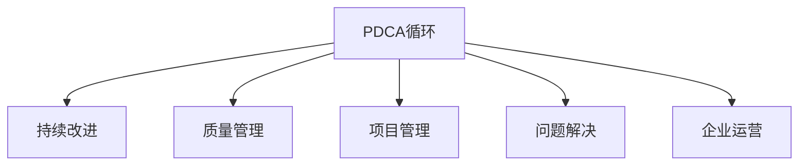

                 

# 如何有效执行PDCA循环

> 关键词：PDCA循环, 持续改进, 质量管理, 项目管理, 软件开发, 问题解决, 企业运营

## 1. 背景介绍

### 1.1 问题由来

PDCA循环（Plan-Do-Check-Act）是一种经典的质量管理工具，最初由W. Edwards Deming在20世纪40年代提出，广泛应用于制造业、服务业、软件开发、项目管理、企业运营等多个领域。PDCA循环通过持续的计划、执行、检查和改进，推动组织不断提升效率、质量和竞争力。

然而，在实际应用中，PDCA循环面临诸多挑战。由于流程繁琐、步骤冗长，部分组织难以坚持执行，导致PDCA循环流于形式，未能充分发挥其价值。因此，如何有效执行PDCA循环，使其真正成为推动组织持续进步的利器，成为当前管理理论和实践的热点话题。

### 1.2 问题核心关键点

PDCA循环的核心在于不断迭代优化，以实现持续改进。其关键步骤包括：

1. **Plan（计划）**：明确目标和计划，制定具体的行动方案。
2. **Do（执行）**：按照计划实施行动，解决实际问题。
3. **Check（检查）**：评估执行结果，分析偏差原因。
4. **Act（改进）**：根据检查结果，进行改进调整，不断优化。

PDCA循环的执行效果很大程度上取决于组织的管理水平、员工素质和执行力度。只有建立系统化的管理机制，确保每个步骤的落实，PDCA循环才能发挥其应有的作用。

## 2. 核心概念与联系

### 2.1 核心概念概述

为了更好地理解PDCA循环的执行原理和步骤，本节将介绍几个密切相关的核心概念：

- **PDCA循环**：一种持续改进的质量管理工具，通过不断迭代实现目标的提升。
- **持续改进**：一种持续优化过程，旨在不断提升产品和服务质量。
- **质量管理**：通过制定标准、实施监控、进行改进等手段，提高组织整体绩效。
- **项目管理**：应用项目管理工具和技术，对项目全过程进行计划、执行、监控和评估。
- **问题解决**：通过分析问题原因，制定解决方案，实现问题闭环。
- **企业运营**：从战略规划到日常运营，企业管理的全过程。

这些核心概念之间的逻辑关系可以通过以下Mermaid流程图来展示：



这个流程图展示了大循环与各个子系统的关系：

1. PDCA循环贯穿于持续改进、质量管理、项目管理、问题解决和企业运营等各个子系统。
2. 各个子系统在PDCA循环的指导下，实现自身的持续优化。
3. PDCA循环通过不断优化各个子系统，提升组织的整体绩效。

## 3. 核心算法原理 & 具体操作步骤

### 3.1 算法原理概述

PDCA循环的执行原理基于系统论和控制论的思想，旨在通过不断反馈和调整，实现目标的持续优化。其核心思想在于：

1. **系统化思考**：将问题视为系统的一部分，从整体角度出发，进行全面分析和改进。
2. **数据驱动决策**：通过收集和分析数据，识别问题和改进机会，支持决策制定。
3. **动态调整**：根据实际执行结果，及时调整计划和方案，确保目标实现。

PDCA循环的执行流程可分为四个主要步骤，每个步骤都需严格落实，确保PDCA循环的有效执行。

### 3.2 算法步骤详解

#### Plan（计划）

Plan步骤的主要任务是制定具体的行动方案，明确目标和实施路径。其关键步骤如下：

1. **确定目标**：明确改进的具体目标，如提升产品质量、降低运营成本、优化客户满意度等。
2. **收集数据**：通过问卷调查、数据分析等手段，收集与目标相关的数据。
3. **分析原因**：运用因果分析、五何分析等工具，识别问题的根本原因。
4. **制定计划**：基于分析结果，制定具体的改进措施，并设定时间表和责任人。

#### Do（执行）

Do步骤的主要任务是按照计划实施行动，解决实际问题。其关键步骤如下：

1. **资源准备**：确保所有所需的资源和工具到位，如人力、设备、软件等。
2. **实施行动**：按照计划执行具体的改进措施，确保所有步骤都按预期进行。
3. **记录过程**：详细记录执行过程中的各种数据和信息，便于后续分析和改进。

#### Check（检查）

Check步骤的主要任务是评估执行结果，分析偏差原因。其关键步骤如下：

1. **收集反馈**：通过问卷调查、面谈等方式，收集执行过程中的反馈信息。
2. **数据对比**：将实际结果与预期目标进行对比，分析执行过程中的偏差。
3. **总结经验**：根据检查结果，总结执行过程中的经验和教训，为后续改进提供参考。

#### Act（改进）

Act步骤的主要任务是根据检查结果，进行改进调整，不断优化。其关键步骤如下：

1. **识别问题**：根据检查结果，识别执行过程中存在的问题和改进机会。
2. **制定改进方案**：基于问题分析，制定具体的改进措施，并设定时间表和责任人。
3. **实施改进**：按照新的改进方案执行，确保问题得到有效解决。
4. **反馈迭代**：将改进后的结果进行反馈，进入下一轮PDCA循环，不断优化。

### 3.3 算法优缺点

PDCA循环的主要优点包括：

1. **系统化管理**：通过系统化的步骤和方法，确保改进过程有条不紊，避免盲目尝试。
2. **数据驱动决策**：通过数据收集和分析，支持科学决策，提升改进效果。
3. **动态调整**：通过实时反馈和调整，确保改进措施的有效性，快速应对变化。

同时，PDCA循环也存在一些缺点：

1. **执行难度大**：每个步骤都需要详细规划和落实，执行起来较为繁琐。
2. **时间成本高**：从计划到改进，整个过程需要耗费大量时间和人力。
3. **灵活性不足**：对于突发问题和快速变化环境，PDCA循环的响应速度较慢。

尽管存在这些缺点，但就目前而言，PDCA循环仍是管理理论和实践中广泛应用的方法论。未来相关研究的重点在于如何进一步简化PDCA循环的步骤，提高执行效率，同时兼顾科学性和灵活性。

### 3.4 算法应用领域

PDCA循环的执行原理和方法论在各个领域都有广泛的应用，例如：

- **制造业**：通过PDCA循环，不断优化生产流程，提升产品质量和生产效率。
- **服务业**：通过PDCA循环，持续改进客户体验和服务质量，提高客户满意度。
- **软件开发**：通过PDCA循环，优化产品开发流程，提升软件质量和用户体验。
- **项目管理**：应用PDCA循环，对项目全过程进行计划、执行、监控和评估，确保项目成功。
- **企业运营**：从战略规划到日常运营，企业管理的各个环节都可通过PDCA循环实现持续改进。

除了上述这些经典应用外，PDCA循环还被创新性地应用到更多场景中，如供应链管理、人力资源管理、市场营销等，为企业提供了强有力的管理工具。

## 4. 数学模型和公式 & 详细讲解

### 4.1 数学模型构建

PDCA循环的执行过程可以通过数学模型进行建模和优化。我们假设PDCA循环的周期为 $T$，每个步骤所需时间为 $t_{P}$、$t_{D}$、$t_{C}$、$t_{A}$，则PDCA循环的总时间 $T_{\text{total}}$ 为：

$$
T_{\text{total}} = t_{P} + t_{D} + t_{C} + t_{A}
$$

其中 $t_{P}$、$t_{D}$、$t_{C}$、$t_{A}$ 分别代表计划、执行、检查、改进四个步骤所需的时间。

### 4.2 公式推导过程

为了简化分析，我们假设每个步骤所需时间相等，即 $t_{P} = t_{D} = t_{C} = t_{A} = t$。则PDCA循环的总时间 $T_{\text{total}}$ 可以简化为：

$$
T_{\text{total}} = 4t
$$

在实际应用中，根据不同的目标和环境，每个步骤的时间可能不同。因此，需要根据实际情况进行调整和优化。

### 4.3 案例分析与讲解

假设某公司希望通过PDCA循环提升产品质量。其具体执行步骤如下：

1. **Plan（计划）**：确定目标为提升产品质量，收集历史产品质量数据，分析质量问题的根本原因。
2. **Do（执行）**：实施改进措施，如加强质量监控、优化生产流程等。
3. **Check（检查）**：收集反馈信息，对比实际结果与预期目标，分析执行过程中的偏差。
4. **Act（改进）**：根据检查结果，识别改进机会，制定新的改进措施，并继续执行。

通过PDCA循环的持续执行，公司能够逐步提升产品质量，满足客户需求。

## 5. 项目实践：代码实例和详细解释说明

### 5.1 开发环境搭建

在进行PDCA循环的实践前，我们需要准备好开发环境。以下是使用Python进行代码实现的流程：

1. 安装Python：从官网下载并安装Python。
2. 安装必要的第三方库：使用pip安装pandas、numpy、matplotlib等库。
3. 搭建开发环境：使用虚拟环境，如virtualenv，搭建项目开发环境。

### 5.2 源代码详细实现

以下是使用Python实现PDCA循环的基本框架，供参考：

```python
import pandas as pd
import numpy as np
import matplotlib.pyplot as plt

# 定义计划、执行、检查、改进四个步骤所需时间
t_P = 1 # 计划步骤所需时间
t_D = 2 # 执行步骤所需时间
t_C = 0.5 # 检查步骤所需时间
t_A = 0.5 # 改进步骤所需时间

# 计算PDCA循环总时间
T_total = t_P + t_D + t_C + t_A
print("PDCA循环总时间：", T_total)

# 绘制PDCA循环时间分布图
times = np.arange(0, T_total + 1, 0.1)
plt.plot(times, [t_P if t < t_P else
                 t_D if t_P <= t < t_P + t_D else
                 t_C if t_P + t_D <= t < t_P + t_D + t_C else
                 t_A], label='PDCA循环时间分布')
plt.xlabel('时间')
plt.ylabel('步骤时间')
plt.legend()
plt.show()
```

### 5.3 代码解读与分析

让我们再详细解读一下关键代码的实现细节：

**定义时间变量**：
- `t_P`、`t_D`、`t_C`、`t_A` 分别代表计划、执行、检查、改进四个步骤所需时间。
- `T_total` 代表PDCA循环的总时间。

**时间计算**：
- 使用Python的内置函数和数组，计算PDCA循环的总时间，并打印输出。
- 使用Matplotlib绘制时间分布图，展示每个步骤的时间变化。

### 5.4 运行结果展示

运行上述代码，将得到PDCA循环总时间的计算结果和步骤时间分布图。这有助于我们直观地理解PDCA循环的执行流程和效率。

## 6. 实际应用场景

### 6.1 制造业

在制造业中，PDCA循环被广泛应用于生产流程的优化和质量控制。通过PDCA循环，制造业企业可以不断提升产品质量、降低生产成本、提高生产效率。

例如，某汽车制造企业通过PDCA循环，优化了生产流程，减少了废品率，提升了产品质量，并提高了生产线的自动化水平。

### 6.2 服务业

在服务业中，PDCA循环被广泛应用于客户体验的提升和服务的优化。通过PDCA循环，服务业企业可以不断提升客户满意度、提高服务质量、增加客户黏性。

例如，某酒店集团通过PDCA循环，优化了客户服务流程，提高了客户满意度，并减少了客户投诉率。

### 6.3 软件开发

在软件开发中，PDCA循环被广泛应用于产品的迭代开发和质量保障。通过PDCA循环，软件开发团队可以不断提升产品质量、优化用户体验、增加软件功能。

例如，某互联网公司通过PDCA循环，优化了产品开发流程，提高了软件质量和用户满意度，并成功推出了多个成功的产品。

### 6.4 未来应用展望

随着信息技术和数据科学的发展，PDCA循环的应用场景将进一步扩展。未来，PDCA循环将在以下领域得到广泛应用：

1. **智能制造**：通过PDCA循环，实现生产线的自动化和智能化，提升生产效率和质量。
2. **智慧城市**：通过PDCA循环，优化城市管理流程，提升城市运行效率和服务水平。
3. **医疗健康**：通过PDCA循环，优化医疗服务流程，提升医疗质量和患者满意度。
4. **金融科技**：通过PDCA循环，优化金融产品和服务，提升金融创新能力和客户体验。
5. **环境保护**：通过PDCA循环，优化环境保护措施，提升环境治理效果和公众参与度。

## 7. 工具和资源推荐

### 7.1 学习资源推荐

为了帮助开发者系统掌握PDCA循环的理论基础和实践技巧，这里推荐一些优质的学习资源：

1. 《PDCA循环原理与实践》系列博文：由专家撰写，深入浅出地介绍了PDCA循环的原理和应用案例。
2. 《质量管理理论与实践》课程：各大高校和在线平台开设的质量管理课程，提供系统性的理论学习。
3. 《项目管理科学与技术》书籍：介绍项目管理理论和实践的书籍，包含PDCA循环的相关内容。
4. 《PDCA循环应用案例》书籍：收集了大量PDCA循环在各行各业的成功案例，提供实践经验。

通过对这些资源的学习实践，相信你一定能够快速掌握PDCA循环的精髓，并用于解决实际问题。

### 7.2 开发工具推荐

高效的开发离不开优秀的工具支持。以下是几款用于PDCA循环开发的常用工具：

1. Excel/Google Sheets：用于数据统计和分析，支持多种图表和函数计算。
2. JIRA/Asana：用于项目管理，支持任务分配、进度跟踪和反馈收集。
3. MS Visio/ArchiCAD：用于绘制流程和网络图，帮助理解PDCA循环的执行路径。
4. Trello/Notion：用于团队协作和任务管理，支持灵活调整和信息共享。
5. Power BI/Tableau：用于数据可视化，帮助分析和展示PDCA循环的执行结果。

合理利用这些工具，可以显著提升PDCA循环的执行效率，加快创新迭代的步伐。

### 7.3 相关论文推荐

PDCA循环的发展源于学界的持续研究。以下是几篇奠基性的相关论文，推荐阅读：

1. Deming, W. E. (1950). On the Problem of Pattern and Progress in Quality Control. Psychological Review.
2. Deming, W. E. (1950). Quality Control in Manufacturing. Quality and Reliability Engineering International.
3. Shewhart, W. A. (1931). Economic Control of Quality of Manufacture: Critical Chart and Methods of Control. D. Van Nostrand Company.
4. Davenport, T. H., & Clare, J. E. (1987). Transforming the Corporation. The Harvard Business Review.
5. Crosby, P. B. (1990). Quality is Free: Doing Better Quality Costs Less. Crosby Quality Systems.
6. Johnson, R. E., & George, R. F. (1984). Quality Control Principles and Methods. McGraw-Hill Book Company.

这些论文代表了大循环理论的发展脉络。通过学习这些前沿成果，可以帮助研究者把握学科前进方向，激发更多的创新灵感。

## 8. 总结：未来发展趋势与挑战

### 8.1 总结

本文对PDCA循环的执行原理和操作步骤进行了全面系统的介绍。首先阐述了PDCA循环的执行背景和核心概念，明确了PDCA循环在持续改进、质量管理、项目管理、问题解决和企业运营等领域的重要价值。其次，从原理到实践，详细讲解了PDCA循环的数学模型和执行步骤，给出了PDCA循环的代码实现。同时，本文还广泛探讨了PDCA循环在制造业、服务业、软件开发等诸多领域的应用前景，展示了PDCA循环的广泛适用性。此外，本文精选了PDCA循环的学习资源，力求为读者提供全方位的技术指引。

通过本文的系统梳理，可以看到，PDCA循环作为一种经典的持续改进工具，其执行原理和方法论在各个领域都有广泛的应用，且在不同场景下具备较强的可操作性。PDCA循环通过不断迭代优化，实现目标的持续提升，推动组织不断进步，具有重要的现实意义。

### 8.2 未来发展趋势

展望未来，PDCA循环将在以下领域得到进一步的发展：

1. **自动化工具**：随着信息技术和数据科学的发展，PDCA循环的执行过程将进一步自动化和智能化，提升执行效率和效果。
2. **数据驱动决策**：通过大数据分析和人工智能技术，PDCA循环将更加依赖数据驱动的决策支持，提升执行的科学性和精准性。
3. **跨部门协同**：PDCA循环将更加注重跨部门协同，通过流程整合和信息共享，实现组织内部的高效协作。
4. **持续优化**：PDCA循环将更加注重持续优化，通过持续改进和迭代，提升组织整体绩效。
5. **国际化应用**：PDCA循环将进一步拓展到国际市场，为不同文化背景的企业提供管理工具。

以上趋势凸显了PDCA循环的广阔前景。这些方向的探索发展，必将进一步提升PDCA循环的执行效果，推动组织持续进步。

### 8.3 面临的挑战

尽管PDCA循环在管理理论和实践中得到了广泛应用，但在迈向更加智能化、普适化应用的过程中，它仍面临着诸多挑战：

1. **执行难度大**：PDCA循环的执行流程繁琐，需要严格落实每个步骤，对执行者素质要求较高。
2. **数据需求高**：PDCA循环需要大量的数据支持，数据收集和分析可能耗费大量时间和人力。
3. **灵活性不足**：对于突发问题和快速变化环境，PDCA循环的响应速度较慢。
4. **资源消耗高**：PDCA循环的执行需要大量资源支持，如人力、设备、软件等。
5. **人员抵触**：部分员工可能对PDCA循环持抵触态度，导致PDCA循环的执行效果打折扣。

尽管存在这些挑战，但通过科学管理、技术创新和组织变革，这些挑战终将一一克服，PDCA循环必将在构建高效组织中发挥重要作用。

### 8.4 研究展望

未来，PDCA循环的研究将在以下几个方面寻求新的突破：

1. **简化执行流程**：通过技术手段，简化PDCA循环的执行步骤，提升执行效率和效果。
2. **数据集成技术**：研究数据集成和共享技术，提升PDCA循环的数据驱动决策能力。
3. **跨部门协作机制**：建立跨部门协作机制，提升组织内部的协同效率和执行效果。
4. **持续优化模型**：开发持续优化模型，通过实时反馈和调整，提升PDCA循环的执行效果。
5. **智能化工具支持**：开发智能化工具，如自动化流程平台、数据可视化工具等，提升PDCA循环的执行效果和用户体验。

这些研究方向的探索，必将引领PDCA循环技术迈向更高的台阶，为组织管理提供强有力的支持。

## 9. 附录：常见问题与解答

**Q1：PDCA循环是否适用于所有行业？**

A: PDCA循环的执行原理和方法论在各个行业都有广泛的应用，但不同行业的具体实施可能有所不同。例如，在制造业中，PDCA循环主要应用于生产流程的优化；在服务业中，PDCA循环主要应用于客户体验的提升；在软件开发中，PDCA循环主要应用于产品的迭代开发。

**Q2：PDCA循环的执行周期多长？**

A: PDCA循环的执行周期应根据具体情况确定，一般建议为1个月至3个月。周期过短可能难以全面分析问题，周期过长可能导致改进效果不明显。

**Q3：如何评估PDCA循环的执行效果？**

A: 可以通过数据对比、员工反馈、客户满意度等指标评估PDCA循环的执行效果。具体评估方法可以根据具体情况灵活选择。

**Q4：PDCA循环是否需要高层管理者的支持？**

A: PDCA循环的执行需要高层管理者的支持，以确保每个步骤得到充分落实。高层管理者可以通过设定目标、提供资源、定期检查等方式支持PDCA循环的执行。

**Q5：PDCA循环是否可以与其他管理方法结合使用？**

A: PDCA循环可以与其他管理方法结合使用，如精益生产、六西格玛等。通过综合应用多种管理方法，可以提升组织管理的整体效果。

---

作者：禅与计算机程序设计艺术 / Zen and the Art of Computer Programming

