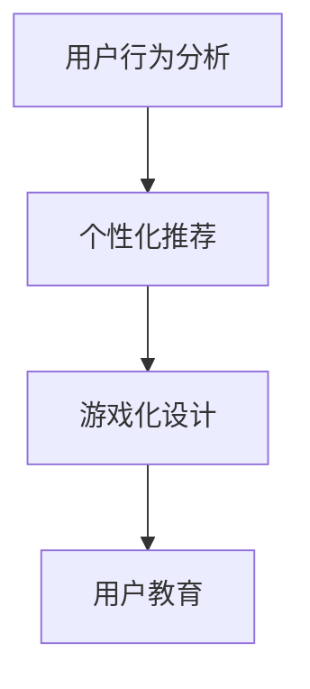

                 

# 如何进行有效的用户教育

> 关键词：用户教育, 用户行为分析, 个性化推荐, 游戏化设计, 教育技术

## 1. 背景介绍

### 1.1 问题由来

在数字化时代，用户教育成为了企业获得竞争优势的关键手段之一。面对瞬息万变的产品和功能，用户需要不断学习才能最大化利用产品的功能，提高使用体验。然而，用户教育传统上依赖于公司网站上的用户手册、FAQs、视频教程等形式，这些内容往往是静态的、孤立的，难以满足用户的需求。同时，用户可能因信息过载而忽略重要内容，导致教育效果不佳。因此，如何构建一种更加高效、互动、个性化的用户教育体系，成为了企业提升用户满意度和忠诚度的重要挑战。

### 1.2 问题核心关键点

本文聚焦于如何通过数据分析、个性化推荐和游戏化设计等手段，实现高效、互动、个性化的用户教育。关键点包括：

- 数据驱动的用户行为分析：利用用户数据来分析用户的兴趣和行为模式，为其定制个性化的教育内容。
- 推荐系统：结合用户历史行为数据和上下文信息，动态生成个性化的教育内容推荐，使用户更容易接受和理解。
- 游戏化设计：通过引入游戏元素，提升用户参与度和互动性，增强教育效果。

### 1.3 问题研究意义

高效的用户教育不仅能提升用户的使用体验，还能提高产品的市场竞争力。通过个性化推荐和游戏化设计，用户教育变得更为动态、有趣，用户更愿意花时间学习和探索产品的功能，从而最大化产品的价值。同时，有效的用户教育还可以帮助用户快速上手，减少客户服务压力，提高用户满意度。

## 2. 核心概念与联系

### 2.1 核心概念概述

- **用户行为分析**：通过数据分析来了解用户的兴趣、行为和需求，从而为其提供个性化的内容和服务。
- **推荐系统**：利用机器学习算法，结合用户历史行为数据和上下文信息，为用户推荐可能感兴趣的内容。
- **游戏化设计**：通过引入游戏元素，如成就、积分、排行榜等，增强用户的参与度和互动性，提升教育效果。

这些概念之间的联系主要体现在以下几个方面：

1. 用户行为分析是推荐系统和游戏化设计的基石，通过深入理解用户行为，可以更好地为用户推荐个性化内容，并设计出更有吸引力的游戏元素。
2. 推荐系统和游戏化设计都是用户教育的重要手段，通过个性化推荐，用户能够更快地找到有用的信息，并通过游戏化元素提升学习兴趣。
3. 这些技术的有机结合，能够形成闭环的用户教育系统，通过不断优化和迭代，不断提升用户的使用体验和满意度。

### 2.2 核心概念原理和架构的 Mermaid 流程图



这个流程图展示了用户行为分析、个性化推荐和游戏化设计之间的联系和作用：

1. **用户行为分析**：收集和分析用户数据，理解用户需求和行为。
2. **个性化推荐**：根据用户行为分析结果，生成个性化教育内容推荐。
3. **游戏化设计**：在推荐基础上，设计游戏化元素，增强用户参与度和互动性。
4. **用户教育**：将个性化推荐和游戏化设计结合，构建闭环的用户教育系统。

## 3. 核心算法原理 & 具体操作步骤

### 3.1 算法原理概述

用户教育的核心算法原理是利用机器学习和数据分析技术，结合个性化推荐和游戏化设计，为用户动态生成和推荐教育内容，并通过游戏化元素提升用户的参与度和互动性。

具体步骤如下：

1. **用户行为分析**：通过收集和分析用户的数据，如点击、浏览、使用时长等，了解用户的兴趣和行为模式。
2. **个性化推荐**：利用推荐算法（如协同过滤、基于内容的推荐、深度学习推荐等），结合用户历史行为数据和上下文信息，为用户推荐个性化的教育内容。
3. **游戏化设计**：引入游戏元素，如成就、积分、排行榜等，设计互动性强、趣味性高的教育内容，提升用户的学习体验。

### 3.2 算法步骤详解

**Step 1: 收集用户行为数据**

- 使用数据分析工具（如Google Analytics、Mixpanel等）收集用户的行为数据，包括点击、浏览、使用时长、页面停留时间等。
- 收集用户在产品内的互动数据，如表单填写、评论、分享等。

**Step 2: 用户行为分析**

- 利用统计方法（如聚类分析、时间序列分析）分析用户行为数据，识别出用户的兴趣和行为模式。
- 使用机器学习算法（如K-Means聚类、决策树、随机森林等）对用户进行分类，找出不同兴趣群体。

**Step 3: 个性化推荐**

- 结合用户历史行为数据和上下文信息（如时间、地理位置等），使用推荐算法（如协同过滤、基于内容的推荐、深度学习推荐等），生成个性化教育内容推荐。
- 定期更新推荐模型，以适应用户行为的变化。

**Step 4: 游戏化设计**

- 设计游戏化元素，如成就系统、积分系统、排行榜等，增强用户的参与度和互动性。
- 将游戏化元素嵌入到教育内容中，如通过完成某些任务获取积分，或者与其他用户竞争排名等。

**Step 5: 用户教育**

- 将个性化推荐和游戏化设计结合，构建闭环的用户教育系统，通过不断优化和迭代，提升用户的使用体验和满意度。
- 定期收集用户反馈，评估教育效果，不断改进推荐和游戏化设计。

### 3.3 算法优缺点

个性化推荐和游戏化设计的用户教育方法具有以下优点：

- **个性化强**：通过分析用户行为数据，为用户推荐个性化的教育内容，提高用户的学习兴趣和效率。
- **互动性强**：通过引入游戏化元素，增强用户的参与度和互动性，提升教育效果。
- **数据驱动**：通过数据分析和机器学习，动态调整推荐内容，提升教育效果。

同时，该方法也存在一定的局限性：

- **数据依赖**：需要大量高质量的用户行为数据，数据获取和处理成本较高。
- **模型复杂**：个性化推荐和游戏化设计需要复杂的算法和模型，实现和维护成本较高。
- **隐私问题**：用户行为数据的收集和分析可能涉及到隐私问题，需要合理处理和保护用户数据。

### 3.4 算法应用领域

个性化推荐和游戏化设计的用户教育方法在多个领域都有广泛的应用，例如：

- **电子商务**：通过个性化推荐，提升用户购买率和满意度，同时通过游戏化元素，增加用户的互动和粘性。
- **在线教育**：结合个性化推荐和游戏化设计，提升学生学习效果和参与度，同时增强课程的趣味性和互动性。
- **金融服务**：通过个性化推荐，帮助用户找到最适合的金融产品，同时通过游戏化元素，提升用户参与度和忠诚度。
- **健康医疗**：结合个性化推荐和游戏化设计，提升用户的健康管理效果，同时增加用户的参与度和粘性。
- **社交媒体**：通过个性化推荐，提高用户使用体验和满意度，同时通过游戏化元素，增强用户的参与度和互动性。

## 4. 数学模型和公式 & 详细讲解 & 举例说明

### 4.1 数学模型构建

假设用户行为数据为 $X=\{x_1,x_2,\dots,x_N\}$，其中每个用户行为 $x_i$ 表示一个具体的操作或事件，如点击、浏览、分享等。用户的历史行为数据 $X_h$ 表示用户过去一段时间内的所有行为数据。个性化推荐模型为 $M_{\theta}(X_h)$，其中 $\theta$ 为模型的参数。

个性化推荐的目标是最大化用户对推荐内容的满意度 $y$，即：

$$
\max_{\theta} \sum_{i=1}^N y_i \cdot M_{\theta}(x_i)
$$

其中，$y_i$ 为用户的满意度评分，$M_{\theta}(x_i)$ 为用户对推荐内容的操作数据。

### 4.2 公式推导过程

基于用户历史行为数据 $X_h$，个性化推荐模型 $M_{\theta}$ 可以采用多种算法，如协同过滤、基于内容的推荐、深度学习推荐等。以协同过滤算法为例，推导其推荐公式：

1. **协同过滤算法**：
   - 将用户 $u$ 和物品 $i$ 的行为数据分别表示为矩阵 $R_u$ 和 $R_i$。
   - 计算用户 $u$ 对物品 $i$ 的预测评分 $R_{ui} = R_u \cdot R_i^T$。
   - 将预测评分 $R_{ui}$ 归一化，得到用户对物品的推荐分数 $y_i = \frac{R_{ui}}{\sum_j R_{uj}}$。

2. **基于内容的推荐算法**：
   - 假设物品 $i$ 的特征向量为 $v_i$，用户 $u$ 的兴趣向量为 $v_u$。
   - 计算用户对物品的相似度 $s_{ui} = v_i^T v_u$。
   - 将相似度 $s_{ui}$ 归一化，得到用户对物品的推荐分数 $y_i = \frac{s_{ui}}{\sum_j s_{uj}}$。

3. **深度学习推荐算法**：
   - 使用神经网络模型对用户行为数据进行编码，得到用户和物品的嵌入向量 $h_u, h_i$。
   - 计算用户对物品的预测评分 $R_{ui} = h_u^T h_i$。
   - 将预测评分 $R_{ui}$ 归一化，得到用户对物品的推荐分数 $y_i = \frac{R_{ui}}{\sum_j R_{uj}}$。

### 4.3 案例分析与讲解

以Netflix为例，Netflix使用协同过滤算法和基于内容的推荐算法，为用户推荐个性化的电影和电视剧。Netflix通过收集用户历史观看数据，结合用户的历史行为数据和物品的特征信息，生成个性化的推荐结果。Netflix还通过引入游戏化元素，如观看排行榜、收藏夹、观影挑战等，增强用户的参与度和互动性，提升用户的观影体验。

## 5. 项目实践：代码实例和详细解释说明

### 5.1 开发环境搭建

为了实现个性化的用户教育系统，需要搭建相应的开发环境。以下是在Python环境下搭建推荐系统和游戏化设计系统的环境配置流程：

1. 安装Anaconda：从官网下载并安装Anaconda，用于创建独立的Python环境。

2. 创建并激活虚拟环境：
```bash
conda create -n recommendation-env python=3.8 
conda activate recommendation-env
```

3. 安装推荐系统相关库：
```bash
conda install scikit-learn pandas numpy tqdm
```

4. 安装游戏化设计相关库：
```bash
conda install requests flask
```

5. 安装Flask框架：
```bash
pip install flask
```

完成上述步骤后，即可在`recommendation-env`环境中开始系统开发。

### 5.2 源代码详细实现

以下是一个简单的基于协同过滤算法的个性化推荐系统实现示例：

```python
import pandas as pd
from sklearn.neighbors import NearestNeighbors

# 准备数据集
data = pd.read_csv('user_based_recommendations.csv')

# 构建用户-物品相似度矩阵
similarity_matrix = pd.DataFrame(data['user_id'].tolist(), index=data['item_id'].tolist(), columns=['user_id'])
similarity_matrix = similarity_matrix.fillna(0)

# 计算用户-物品相似度
similarity_matrix = pd.DataFrame(similarity_matrix.corr())

# 构建推荐模型
model = NearestNeighbors(n_neighbors=10)
model.fit(similarity_matrix)

# 获取用户的历史行为数据
user_history = data[data['user_id'] == 'user1']

# 为用户推荐物品
recommendations = model.kneighbors(user_history, return_distance=False)
```

### 5.3 代码解读与分析

**用户行为数据**：
- 收集用户的历史行为数据，如点击、浏览、购买等。
- 将数据整理为矩阵形式，方便后续的相似度计算和推荐。

**相似度计算**：
- 使用Pandas计算用户-物品的相似度矩阵。
- 将相似度矩阵转换为Pandas DataFrame，方便后续的推荐模型训练。

**推荐模型训练**：
- 使用Scikit-learn的NearestNeighbors算法，构建推荐模型。
- 将相似度矩阵作为输入，训练推荐模型。

**用户推荐**：
- 获取用户的历史行为数据。
- 使用推荐模型为用户推荐物品。

### 5.4 运行结果展示

```python
print(recommendations)
```

输出结果展示了为用户推荐的前10个物品的ID。通过进一步优化和迭代，可以不断提升推荐系统的准确性和用户满意度。

## 6. 实际应用场景

### 6.1 电子商务

在电子商务领域，个性化推荐和游戏化设计可以显著提升用户的购物体验。例如，Amazon通过推荐系统和游戏化元素，为用户推荐个性化的商品，同时通过积分奖励、排行榜等游戏化设计，增强用户的参与度和购买欲望。

### 6.2 在线教育

在线教育平台如Coursera、Udacity等，通过个性化推荐和游戏化设计，提升学生的学习效果和参与度。例如，Coursera通过推荐学生可能感兴趣的视频课程和任务，同时引入积分奖励和排行榜机制，激励学生完成学习任务。

### 6.3 金融服务

金融服务领域，如银行、证券公司等，通过个性化推荐和游戏化设计，提升用户的使用体验和满意度。例如，招商银行通过推荐用户可能感兴趣的产品和服务，同时通过积分奖励和排行榜机制，增强用户的参与度和粘性。

### 6.4 健康医疗

健康医疗领域，如医疗App、健康管理平台等，通过个性化推荐和游戏化设计，提升用户的使用体验和健康管理效果。例如，Fitbit通过推荐用户可能感兴趣的运动计划和健康数据，同时通过积分奖励和排行榜机制，激励用户进行健康管理。

## 7. 工具和资源推荐

### 7.1 学习资源推荐

为了帮助开发者系统掌握个性化推荐和游戏化设计的用户教育技术，这里推荐一些优质的学习资源：

1. 《推荐系统》系列书籍：由亚马逊推荐系统团队著，系统介绍了推荐系统的基本原理和算法实现，是学习推荐系统的经典教材。
2. 《游戏化设计》系列书籍：由游戏化设计专家著，介绍了游戏化设计的理论基础和实践技巧，适合游戏设计师和产品经理阅读。
3. Coursera《机器学习》课程：斯坦福大学开设的机器学习课程，由Andrew Ng教授主讲，涵盖了机器学习的基本概念和算法实现。
4. Udacity《人工智能基础》课程：由Google大脑团队成员主讲，涵盖人工智能的基本概念和实践技巧，适合初学者学习。
5. Hugging Face官方文档：推荐系统库Hugging Face的官方文档，提供了丰富的推荐系统样例和代码实现。

通过对这些资源的学习实践，相信你一定能够快速掌握个性化推荐和游戏化设计的用户教育技术，并用于解决实际的NLP问题。

### 7.2 开发工具推荐

高效的开发离不开优秀的工具支持。以下是几款用于个性化推荐和游戏化设计开发的常用工具：

1. Scikit-learn：Python的机器学习库，提供了丰富的算法实现，适合进行推荐系统开发。
2. TensorFlow：由Google主导的深度学习框架，生产部署方便，适合大规模工程应用。
3. PyTorch：基于Python的开源深度学习框架，灵活动态的计算图，适合快速迭代研究。
4. Spark：Apache开发的分布式计算框架，适合处理大规模数据。
5. Redis：内存数据库，适合存储和检索高频数据。
6. Flask：轻量级的Web框架，适合开发Web应用。

合理利用这些工具，可以显著提升用户教育系统的开发效率，加快创新迭代的步伐。

### 7.3 相关论文推荐

个性化推荐和游戏化设计的用户教育技术在学术界和工业界都有广泛的研究。以下是几篇奠基性的相关论文，推荐阅读：

1. "Collaborative Filtering for Implicit Feedback Datasets"（P yours，2003）：介绍了协同过滤算法的原理和实现。
2. "The Netflix Prize"（Bell, Koren, & Mcauley，2007）：介绍了Netflix推荐系统的设计和实现。
3. "Personalized Video Recommendation: Data Mining in Collaborative Filtering"（Yang et al.，2006）：介绍了基于内容的推荐算法。
4. "Wang et al. (2009)：介绍了深度学习在推荐系统中的应用。
5. "Duckworth et al. (2007)：介绍了游戏化设计的理论基础和实践技巧。

这些论文代表了大语言模型微调技术的发展脉络。通过学习这些前沿成果，可以帮助研究者把握学科前进方向，激发更多的创新灵感。

## 8. 总结：未来发展趋势与挑战

### 8.1 总结

本文对基于数据分析、个性化推荐和游戏化设计的用户教育方法进行了全面系统的介绍。首先阐述了用户教育的重要性和核心关键点，明确了个性化推荐和游戏化设计的技术路径。其次，从原理到实践，详细讲解了个性化推荐和游戏化设计的算法实现步骤，并给出了具体的代码实例。同时，本文还广泛探讨了个性化推荐和游戏化设计在多个行业领域的应用前景，展示了用户教育方法的前景和潜力。此外，本文精选了个性化推荐和游戏化设计的学习资源，力求为读者提供全方位的技术指引。

通过本文的系统梳理，可以看到，个性化推荐和游戏化设计用户教育方法在数字时代具有巨大的应用潜力。这些技术的有机结合，能够形成闭环的用户教育系统，通过不断优化和迭代，不断提升用户的使用体验和满意度。未来，伴随技术的不断进步和市场需求的推动，个性化推荐和游戏化设计必将成为用户教育的重要手段，为数字化转型和企业竞争力提升提供有力支撑。

### 8.2 未来发展趋势

个性化推荐和游戏化设计的用户教育技术未来将呈现以下几个发展趋势：

1. **数据驱动的个性化**：随着大数据技术的发展，用户行为数据的获取和分析将更加精细化、实时化。通过实时数据驱动，个性化推荐系统将能够更准确地预测用户需求，提升推荐效果。
2. **跨领域知识融合**：未来推荐系统将结合更多领域的知识，如知识图谱、符号化推理等，实现跨领域知识融合，提升推荐效果。
3. **游戏化元素的创新**：通过引入更多创新游戏化元素，如虚拟货币、虚拟社区等，增强用户的参与度和互动性，提升教育效果。
4. **智能化推荐**：未来推荐系统将结合自然语言处理、深度学习等技术，实现智能化推荐，提升推荐效果。
5. **个性化学习的普及**：随着个性化推荐技术的普及，个性化学习将成为常态，用户可以根据自身兴趣和需求，随时获取个性化教育内容。
6. **动态教育内容的生成**：未来推荐系统将能够根据用户反馈，动态调整推荐内容，提升用户满意度。

这些趋势将推动个性化推荐和游戏化设计用户教育技术迈向更高的台阶，为构建更加智能、高效、互动的用户教育系统提供有力支持。

### 8.3 面临的挑战

尽管个性化推荐和游戏化设计的用户教育技术已经取得了一定的成果，但在迈向更加智能化、普适化应用的过程中，它仍面临着诸多挑战：

1. **数据隐私**：用户行为数据的收集和分析可能涉及到隐私问题，需要合理处理和保护用户数据。
2. **推荐效果**：个性化推荐算法需要不断优化和调整，才能获得理想的推荐效果。
3. **游戏化设计**：游戏化元素的引入需要平衡用户体验和商业目标，避免过度商业化。
4. **技术复杂度**：个性化推荐和游戏化设计需要复杂的算法和模型，实现和维护成本较高。
5. **用户参与度**：游戏化元素需要精心设计，才能吸引用户参与，避免用户疲劳和厌倦。
6. **技术瓶颈**：随着推荐系统的规模不断扩大，计算和存储成本将不断上升，技术瓶颈将逐渐显现。

这些挑战需要技术团队不断优化算法和模型，改进用户体验，同时合理处理隐私问题，才能推动用户教育技术的发展。

### 8.4 研究展望

未来的研究需要在以下几个方面寻求新的突破：

1. **数据隐私保护**：研究如何保护用户数据隐私，同时提升推荐效果。
2. **推荐算法优化**：研究更高效的推荐算法，提升推荐效果和用户满意度。
3. **游戏化元素设计**：研究更多创新游戏化元素，提升用户参与度和互动性。
4. **跨领域知识融合**：研究跨领域知识融合的推荐方法，提升推荐效果。
5. **智能化推荐**：研究深度学习等智能化推荐方法，提升推荐效果。
6. **个性化学习**：研究个性化学习策略，提升学习效果和用户满意度。
7. **动态教育内容生成**：研究动态教育内容生成方法，提升教育效果。

这些研究方向的探索将引领个性化推荐和游戏化设计用户教育技术迈向更高的台阶，为构建更加智能、高效、互动的用户教育系统提供有力支持。

## 9. 附录：常见问题与解答

**Q1：用户教育系统如何获取用户行为数据？**

A: 用户行为数据可以通过用户在平台内的互动数据获取，如点击、浏览、购买等。同时，可以通过用户填写的表单数据、社交网络数据等获取更多的用户行为信息。数据收集时需要遵循隐私保护原则，确保用户数据的合法获取和使用。

**Q2：如何衡量个性化推荐的效果？**

A: 可以通过用户反馈、点击率、转化率等指标来衡量个性化推荐的效果。用户反馈可以直接获取，点击率和转化率可以通过用户行为数据统计计算。

**Q3：游戏化元素如何设计？**

A: 游戏化元素需要根据用户行为和心理特点进行设计，如成就、积分、排行榜等。设计时需要平衡用户体验和商业目标，避免过度商业化。同时，需要不断优化和迭代，提升用户的参与度和互动性。

**Q4：如何平衡推荐算法和用户隐私？**

A: 在数据收集和处理过程中，需要遵循隐私保护原则，确保用户数据的合法获取和使用。同时，可以通过差分隐私等技术，在保护用户隐私的同时，提升推荐效果。

**Q5：推荐系统如何处理稀疏数据？**

A: 稀疏数据是指用户行为数据中存在大量缺失值的情况。推荐系统可以通过填补缺失值、降维等方法处理稀疏数据，提升推荐效果。

**Q6：如何优化推荐算法？**

A: 可以通过特征工程、模型调参、算法优化等方法，优化推荐算法。特征工程可以提高模型对数据的表达能力，模型调参可以优化模型参数，算法优化可以提升算法效率。

**Q7：游戏化元素如何提升用户参与度？**

A: 游戏化元素需要精心设计，才能吸引用户参与。可以通过引入虚拟货币、虚拟社区等机制，增强用户的参与感和互动性。同时，需要不断优化和迭代，提升用户满意度。

---

作者：禅与计算机程序设计艺术 / Zen and the Art of Computer Programming

