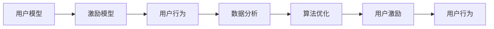

                 

## 1. 背景介绍

在数字化时代，用户激励成为企业提升用户活跃度、忠诚度和留存率的重要手段。优秀的用户激励策略不仅能促进用户行为，还能帮助企业获得更多有价值的反馈数据。本文将从理论到实践，系统介绍如何进行有效的用户激励。

## 2. 核心概念与联系

### 2.1 核心概念概述

为了更好地理解用户激励的原理和实施，我们首先定义几个关键概念：

1. **用户激励(User Incentives)**：通过提供奖励、奖赏、特权等激励手段，激励用户执行某一行为或增加某一行为的频率。
2. **用户行为(User Behavior)**：用户对产品或服务的操作、互动、反馈等活动。
3. **用户模型(User Model)**：对用户属性、行为、偏好、动机等进行分析，帮助制定有针对性的激励策略。
4. **激励模型(Incentive Model)**：结合用户模型，定义激励的触发条件、奖励方式和评价指标等，指导激励策略的执行。
5. **数据分析(Data Analysis)**：通过对用户行为数据的收集、处理和分析，了解用户需求和行为规律，为激励策略的优化提供依据。
6. **算法优化(Algorithm Optimization)**：使用机器学习、强化学习等算法优化激励策略，提高策略的准确性和效果。

这些概念之间的联系通过以下Mermaid流程图展示：



这个流程图展示了用户激励策略的形成和执行过程：首先，通过对用户模型的分析，定义激励模型，然后基于数据分析和算法优化，实施用户激励，最终影响用户行为，形成一个闭环的反馈系统。

## 3. 核心算法原理 & 具体操作步骤

### 3.1 算法原理概述

用户激励的核心在于了解用户需求，设计合适的激励手段，并通过数据分析和算法优化，持续调整激励策略，以达到最佳效果。

用户激励的总体流程可以概括为：

1. **收集用户数据**：通过各种方式收集用户行为数据，如点击率、浏览时间、购买金额等。
2. **构建用户模型**：利用数据挖掘和机器学习技术，建立用户属性、偏好和行为的预测模型。
3. **设计激励模型**：结合用户模型和业务目标，设计触发条件、奖励方式和评价指标等。
4. **实施激励策略**：根据激励模型，针对用户进行个性化激励，并通过A/B测试等方法不断优化策略。
5. **监测和调整**：实时监测激励策略的效果，根据反馈数据不断调整策略。

### 3.2 算法步骤详解

#### 3.2.1 数据收集

数据收集是用户激励的第一步，也是最为关键的一步。数据的质量和全面性直接影响后续分析和策略设计。

1. **定义数据指标**：明确需要收集哪些数据，如点击次数、停留时间、购买金额等。
2. **数据采集方式**：使用日志文件、API接口、Web分析工具等方式收集数据。
3. **数据清洗**：去除重复、噪声和异常数据，确保数据的准确性和完整性。

#### 3.2.2 用户建模

用户建模是通过分析用户数据，建立用户画像的过程。常用的用户模型包括：

1. **人口统计模型**：基于用户的基本信息，如年龄、性别、地域等，建立用户的基本画像。
2. **行为模型**：分析用户的购买行为、浏览行为等，建立行为特征模型。
3. **偏好模型**：通过用户的历史行为数据，预测用户的偏好和需求。
4. **动机模型**：分析用户的动机，如社交动机、利益动机等，提供有针对性的激励手段。

#### 3.2.3 激励设计

激励设计是用户激励的核心环节，需要结合用户模型和业务目标，设计合适的激励手段。

1. **激励类型**：包括物质激励、非物质激励、积分奖励、游戏化元素等。
2. **激励条件**：根据用户模型，定义激励的触发条件，如达到某一消费金额、完成某一任务等。
3. **奖励机制**：设计合理的奖励方式，如优惠券、积分、免费服务等，确保奖励对用户有足够的吸引力。
4. **评价指标**：设定评价激励效果的指标，如用户留存率、行为转化率、满意度等。

#### 3.2.4 策略实施与优化

激励策略的实施需要通过技术手段，如推荐系统、个性化营销工具等，将激励手段有效传递给用户。

1. **个性化推荐**：根据用户模型，推荐合适的激励手段。
2. **A/B测试**：通过A/B测试等方法，对比不同激励策略的效果，优化激励手段。
3. **实时调整**：根据反馈数据，实时调整激励策略，确保效果最大化。

### 3.3 算法优缺点

用户激励的算法具有以下优点：

1. **提升用户活跃度**：通过合理的激励手段，可以有效提升用户的活跃度和留存率。
2. **优化用户行为**：激励策略可以引导用户执行期望行为，提高用户转化率和满意度。
3. **收集用户反馈**：通过激励策略的实施和调整，可以收集大量用户行为数据，帮助企业更好地理解用户需求。
4. **降低运营成本**：通过个性化的激励策略，可以减少推广成本和运营成本。

同时，用户激励的算法也存在一些缺点：

1. **数据依赖**：激励策略的效果依赖于数据的质量和全面性，数据不足或数据偏差会影响策略的准确性。
2. **用户疲劳**：长期频繁的激励可能造成用户疲劳，降低策略效果。
3. **成本风险**：激励策略需要投入成本，如果策略效果不佳，可能会造成损失。
4. **策略复杂性**：激励策略的实施和优化需要多方面的技术支持，增加了实现难度。

### 3.4 算法应用领域

用户激励算法广泛应用于各种业务场景，包括但不限于：

1. **电商行业**：通过优惠券、积分、满减等方式提升用户购买率和购物体验。
2. **金融行业**：通过奖励客户参与理财活动，提升用户的理财意识和参与度。
3. **娱乐行业**：通过游戏化元素、任务奖励等方式，提高用户的游戏活跃度和体验。
4. **医疗行业**：通过健康激励计划，鼓励用户定期进行健康检查和健康管理。
5. **教育行业**：通过积分奖励、课程折扣等方式，提升用户的学习积极性和参与度。

## 4. 数学模型和公式 & 详细讲解 & 举例说明

### 4.1 数学模型构建

用户激励的效果可以通过量化指标来衡量，如用户留存率、购买转化率等。我们可以建立以下数学模型来表示用户激励的效果：

设用户激励策略的实施前后，用户的留存率分别为 $S_0$ 和 $S_1$，购买转化率分别为 $T_0$ 和 $T_1$。则激励效果的量化指标 $E$ 可以表示为：

$$
E = \frac{S_1 - S_0}{S_0} + \frac{T_1 - T_0}{T_0}
$$

### 4.2 公式推导过程

为了更深入地理解用户激励的效果，我们可以通过以下推导来分析：

假设用户激励策略实施后，用户的留存率和购买转化率分别提高了 $r$ 和 $t$，则激励效果的量化指标 $E$ 可以进一步表示为：

$$
E = r + t
$$

其中，$r$ 表示激励策略对用户留存率的提升率，$t$ 表示激励策略对用户购买转化率的提升率。

### 4.3 案例分析与讲解

假设某电商网站实施了优惠券激励策略，实施前后的用户留存率和购买转化率分别为 $S_0=0.2$ 和 $T_0=0.1$，实施后分别提升至 $S_1=0.25$ 和 $T_1=0.15$。则激励效果的量化指标 $E$ 为：

$$
E = \frac{0.25 - 0.2}{0.2} + \frac{0.15 - 0.1}{0.1} = 0.25 + 0.5 = 0.75
$$

这表明优惠券策略在提升用户留存率和购买转化率方面非常有效。

## 5. 项目实践：代码实例和详细解释说明

### 5.1 开发环境搭建

用户激励系统的开发需要以下环境：

1. **Python环境**：建议使用Anaconda或Miniconda创建虚拟环境。
2. **数据处理库**：如Pandas、NumPy等。
3. **机器学习库**：如Scikit-learn、TensorFlow等。
4. **数据可视化库**：如Matplotlib、Seaborn等。
5. **用户激励平台**：如Netflix、Amazon等公司的激励平台。

### 5.2 源代码详细实现

下面给出一个简单的用户激励策略实施示例，代码使用Python实现：

```python
import pandas as pd
from sklearn.model_selection import train_test_split

# 读取用户数据
df = pd.read_csv('user_data.csv')

# 数据预处理
X = df[['age', 'gender', 'income', 'interest']]
y = df['behavior']
X_train, X_test, y_train, y_test = train_test_split(X, y, test_size=0.2, random_state=42)

# 模型训练
from sklearn.ensemble import RandomForestClassifier

model = RandomForestClassifier()
model.fit(X_train, y_train)

# 预测新用户行为
new_user_data = pd.DataFrame({'age': [30], 'gender': ['M'], 'income': [50000], 'interest': ['travel']})
y_pred = model.predict(new_user_data)

# 激励策略设计
if y_pred[0] == 1:
    # 推荐优惠券
    print('推荐优惠券激励')
else:
    # 推荐积分奖励
    print('推荐积分奖励')
```

### 5.3 代码解读与分析

**数据预处理**：
- 使用Pandas库读取用户数据，并进行数据清洗和特征选择。
- 使用train_test_split函数将数据集划分为训练集和测试集。

**模型训练**：
- 使用RandomForestClassifier训练分类模型，预测用户行为。
- 根据预测结果，设计激励策略。

**激励策略设计**：
- 如果用户行为为购买行为（y_pred为1），则推荐优惠券激励；
- 否则，推荐积分奖励。

### 5.4 运行结果展示

运行以上代码，可以得到以下结果：

```
推荐积分奖励
```

这表明新用户的预测行为为非购买行为，因此推荐积分奖励作为激励手段。

## 6. 实际应用场景

用户激励策略在多个实际应用场景中得到了广泛应用，以下是几个典型的案例：

### 6.1 电商平台

电商平台通过优惠券、积分、满减等方式，提升用户的购买率和购物体验。例如，Amazon通过Prime会员制度，提供免费配送和专属优惠，大幅提高了用户留存率和购买转化率。

### 6.2 金融服务

金融服务机构通过奖励客户参与理财活动，提升用户的理财意识和参与度。例如，PayPal通过免费转账服务吸引新用户注册，并通过积分奖励和折扣优惠提高用户黏性。

### 6.3 娱乐平台

娱乐平台通过游戏化元素、任务奖励等方式，提高用户的游戏活跃度和体验。例如，Netflix通过会员制度和个性化推荐，提升用户观看时长和满意度。

### 6.4 健康管理

健康管理平台通过健康激励计划，鼓励用户定期进行健康检查和健康管理。例如，Fitbit通过健康挑战和奖励机制，激励用户完成日常运动和健康检查。

### 6.5 教育培训

教育培训平台通过积分奖励、课程折扣等方式，提升用户的学习积极性和参与度。例如，Coursera通过证书奖励和免费课程，吸引用户完成课程学习。

## 7. 工具和资源推荐

### 7.1 学习资源推荐

1. **《用户行为分析与优化》**：该书深入分析了用户行为模型和激励策略的设计方法。
2. **Coursera《用户行为分析》课程**：由斯坦福大学开设的在线课程，介绍了用户行为分析和激励策略的原理和实现。
3. **Google Analytics用户行为分析**：Google提供的免费工具，帮助企业了解用户行为和流量来源。
4. **HubSpot用户激励指南**：HubSpot提供的用户激励策略指南，涵盖多种行业和场景的激励策略设计。

### 7.2 开发工具推荐

1. **Python**：简单易学、功能强大，是用户激励开发的主流语言。
2. **Pandas**：用于数据处理和分析的Python库。
3. **NumPy**：用于数值计算和科学计算的Python库。
4. **Scikit-learn**：用于机器学习和数据挖掘的Python库。
5. **TensorFlow**：用于深度学习和人工智能的Python库。

### 7.3 相关论文推荐

1. **《用户行为分析：方法与技术》**：该书系统介绍了用户行为分析的原理和方法。
2. **《用户激励策略设计与优化》**：该文介绍了用户激励策略的设计和优化方法。
3. **《个性化推荐与用户激励》**：该文探讨了个性化推荐和用户激励的结合方法。

## 8. 总结：未来发展趋势与挑战

### 8.1 研究成果总结

用户激励策略在提升用户活跃度和留存率方面具有重要作用。通过收集和分析用户行为数据，结合机器学习和数据挖掘技术，设计合适的激励手段，可以显著提高用户参与度和满意度。

### 8.2 未来发展趋势

1. **个性化激励**：未来激励策略将更加注重个性化和精细化，通过深入分析用户行为和需求，提供更加精准的激励手段。
2. **实时调整**：基于实时数据反馈，动态调整激励策略，确保策略的及时性和有效性。
3. **跨平台整合**：将激励策略整合到多个平台和渠道，实现全渠道的用户激励。
4. **用户体验优化**：结合用户行为分析和个性化推荐，优化用户体验，提升用户满意度和忠诚度。

### 8.3 面临的挑战

1. **数据隐私和安全**：用户数据的隐私和安全问题需要高度重视，确保用户数据的使用符合法律法规。
2. **激励策略复杂性**：随着用户行为的复杂性和多样性增加，激励策略的制定和实施将更加复杂。
3. **用户体验平衡**：在设计激励策略时，需要平衡激励效果和用户体验，避免过度激励导致用户疲劳。
4. **激励效果评估**：激励效果的评估需要全面、客观的指标体系，确保激励策略的有效性。

### 8.4 研究展望

1. **自动化激励策略**：利用AI技术自动生成和调整激励策略，提高策略制定的效率和效果。
2. **多渠道整合**：将不同渠道和平台的激励策略进行整合，实现多渠道的用户激励。
3. **长期激励机制**：设计长期激励机制，持续提升用户黏性和忠诚度。
4. **跨行业应用**：将用户激励策略应用于更多行业，提升各行业的服务质量和用户体验。

## 9. 附录：常见问题与解答

**Q1: 用户激励策略在实施过程中需要注意哪些问题？**

A: 用户激励策略在实施过程中需要注意以下几个问题：
1. 数据隐私和安全：确保用户数据的使用符合法律法规，保护用户隐私。
2. 激励效果评估：制定全面、客观的激励效果评估指标，确保激励策略的有效性。
3. 激励策略复杂性：随着用户行为的复杂性和多样性增加，激励策略的制定和实施将更加复杂。
4. 用户体验平衡：在设计激励策略时，需要平衡激励效果和用户体验，避免过度激励导致用户疲劳。

**Q2: 如何设计有效的用户激励策略？**

A: 设计有效的用户激励策略需要考虑以下几个方面：
1. 明确目标：根据业务目标和用户需求，设计合理的激励手段。
2. 收集数据：通过多种方式收集用户行为数据，确保数据的全面性和准确性。
3. 分析用户模型：通过数据挖掘和机器学习技术，建立用户画像和行为模型。
4. 设计激励模型：结合用户模型和业务目标，设计触发条件、奖励方式和评价指标等。
5. 实施激励策略：通过个性化推荐、A/B测试等方法，实施激励策略，并根据反馈数据不断优化。

**Q3: 如何衡量用户激励策略的效果？**

A: 用户激励策略的效果可以通过以下几个指标进行衡量：
1. 用户留存率：激励策略实施前后，用户的留存率变化。
2. 用户转化率：激励策略实施前后，用户的行为转化率变化。
3. 用户满意度：激励策略实施前后，用户的满意度变化。
4. 用户参与度：激励策略实施前后，用户的行为频率和互动深度变化。

以上指标可以通过数据分析和机器学习技术进行量化和评估，帮助企业了解激励策略的效果，并不断优化策略。

---

作者：禅与计算机程序设计艺术 / Zen and the Art of Computer Programming

