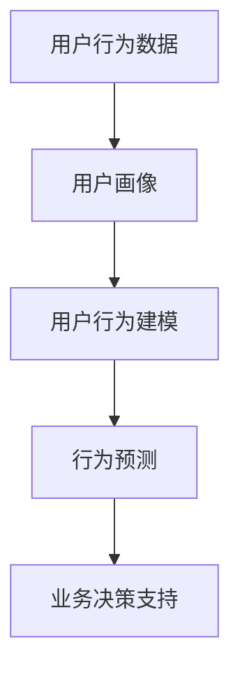

                 

# 如何进行有效的用户行为分析

> 关键词：用户行为分析, 数据分析, 机器学习, 自然语言处理(NLP), 深度学习, 数据挖掘, 用户体验

## 1. 背景介绍

在数字化时代，用户行为数据成为企业理解客户需求、优化用户体验、提升业务决策力的重要依据。如何从海量数据中高效、精准地提取用户行为特征，构建用户画像，成为了数据驱动型企业亟需解决的重大课题。

用户行为分析(User Behavior Analysis, UBA)作为一种数据驱动的用户研究方法，通过挖掘用户在网站、应用中的操作习惯、购买记录、互动轨迹等数据，帮助企业洞察用户需求，预测用户行为，优化产品设计，提升用户体验。

### 1.1 问题由来

随着互联网的普及，用户行为数据的类型和规模呈指数级增长。传统的数据分析方法往往依赖人工标注，难以应对海量数据和复杂任务。现代企业需要一种自动、高效、可靠的用户行为分析方法，以实现对用户行为的深度理解。

这一背景推动了大数据、机器学习、自然语言处理等前沿技术的结合，催生了基于机器学习模型的用户行为分析范式。尤其是深度学习模型，由于其强大的特征提取能力和泛化能力，已经成为UBA领域的主流技术。

### 1.2 问题核心关键点

进行有效的用户行为分析，需要关注以下几个核心关键点：

- 数据获取：从网站、应用、社交平台等渠道收集用户行为数据。
- 数据预处理：清洗、归一化、特征工程等数据预处理操作。
- 用户建模：建立用户行为模型，捕捉用户行为模式。
- 行为预测：使用机器学习模型预测用户行为趋势，提供业务决策支持。
- 效果评估：评估模型性能，优化模型效果。

本文将系统介绍如何进行有效的用户行为分析，包括数据准备、用户建模、行为预测等关键环节，力求为读者提供完整的UBA框架。

## 2. 核心概念与联系

### 2.1 核心概念概述

为更好地理解用户行为分析流程，本节将介绍几个密切相关的核心概念：

- 用户行为数据：用户在网站、应用中的操作记录、点击轨迹、购买历史、评分反馈等数据。
- 用户画像：通过对用户行为数据的分析，构建用户的综合画像，包括兴趣、需求、偏好等特征。
- 用户行为建模：构建模型描述用户行为模式，使用历史数据预测未来行为。
- 行为预测：基于用户行为模型，预测用户后续行为，包括购买、流失、推荐等。
- 业务决策支持：将用户行为分析结果应用到产品优化、市场推广、客户留存等业务决策中。

这些核心概念之间的逻辑关系可以通过以下Mermaid流程图来展示：



这个流程图展示了一些核心概念及其之间的关系：

1. 用户行为数据是大数据分析的起点。
2. 通过用户画像，可以理解用户特征和行为动机。
3. 用户行为建模使用历史数据揭示用户行为规律。
4. 行为预测利用模型预测用户未来行为，提供业务指导。
5. 业务决策支持将UBA结果转化为具体业务策略，实现用户需求与企业目标的对齐。

## 3. 核心算法原理 & 具体操作步骤

### 3.1 算法原理概述

用户行为分析本质上是基于机器学习的大数据分析过程。其核心思想是通过收集、清洗、建模、预测等步骤，从用户行为数据中提取有价值的信息，构建用户画像，预测用户行为，指导业务决策。

具体而言，用户行为分析分为以下几个关键步骤：

1. **数据获取与清洗**：从网站、应用等渠道收集用户行为数据，并进行预处理操作，如去除噪声、填补缺失值等。
2. **用户建模**：使用机器学习模型建立用户行为模型，捕捉用户行为特征。
3. **行为预测**：利用用户行为模型，预测用户未来行为，提供业务决策支持。
4. **效果评估**：评估模型性能，优化模型效果，确保模型预测的准确性和可靠性。

### 3.2 算法步骤详解

下面详细讲解用户行为分析的关键步骤：

**Step 1: 数据获取与清洗**

1. **数据收集**：从网站、应用、社交平台等渠道收集用户行为数据。可以使用API接口、日志文件等方式获取数据。
2. **数据清洗**：
   - 去除异常值和噪声数据。
   - 填补缺失值和异常数据。
   - 归一化和标准化数据，统一数据格式。
   - 去除重复数据，确保数据质量。

**Step 2: 用户建模**

1. **特征选择**：从数据中提取与用户行为相关的特征，如点击次数、停留时间、购买金额等。
2. **模型训练**：
   - 选择合适的机器学习算法，如随机森林、决策树、深度学习等。
   - 使用历史数据训练模型，捕捉用户行为规律。
3. **模型评估**：
   - 使用交叉验证等方法评估模型性能，防止过拟合。
   - 调整模型参数，优化模型效果。

**Step 3: 行为预测**

1. **行为建模**：
   - 使用训练好的用户行为模型，对用户行为进行建模，捕捉行为规律。
   - 预测用户未来行为，如购买、流失、推荐等。
2. **业务决策支持**：
   - 将预测结果应用到产品优化、市场推广、客户留存等业务决策中。

**Step 4: 效果评估**

1. **模型验证**：
   - 使用测试集验证模型效果，确保模型泛化能力。
   - 分析模型预测结果与真实结果的差异。
2. **优化模型**：
   - 根据模型效果，调整模型参数，优化模型效果。
   - 引入新数据，持续更新模型，保持模型有效性。

### 3.3 算法优缺点

用户行为分析作为一种基于机器学习的数据分析方法，具有以下优点：

1. **自动化高效**：自动化处理海量数据，提高数据分析效率。
2. **特征丰富**：利用深度学习模型，挖掘用户行为中的隐含特征。
3. **预测准确**：通过建模预测用户行为，提高业务决策的准确性。
4. **灵活适用**：适用于各种用户行为分析场景，如用户留存、推荐系统、客户分群等。

同时，该方法也存在一些局限性：

1. **数据质量依赖**：模型效果高度依赖于数据质量，数据缺失、噪声等会影响模型性能。
2. **模型复杂度高**：深度学习模型结构复杂，训练和调参难度较大。
3. **解释性不足**：机器学习模型通常是"黑盒"模型，难以解释模型内部的决策过程。
4. **数据隐私风险**：用户行为数据涉及隐私信息，处理不当可能侵犯用户隐私。

尽管存在这些局限性，但用户行为分析作为一种数据驱动的用户研究方法，在提升用户体验、优化产品设计、驱动业务决策等方面仍具有重要价值。未来相关研究将聚焦于提高模型可解释性、保护用户隐私、降低对数据质量的要求等方面，以进一步优化用户行为分析方法。

### 3.4 算法应用领域

用户行为分析技术已经在多个领域得到了广泛应用，包括但不限于：

- **电子商务**：通过分析用户购买记录、浏览历史等数据，预测用户购买行为，推荐商品，提升用户体验。
- **金融服务**：利用用户账户操作、交易记录等数据，预测用户交易行为，防范金融风险，提供个性化服务。
- **移动应用**：分析用户应用使用情况、反馈评论等数据，优化应用功能，提升用户粘性。
- **游戏行业**：通过分析用户游戏行为、消费数据，预测用户留存率，提供个性化推荐和游戏体验优化。
- **社交媒体**：分析用户互动、内容消费等数据，提供精准推荐，优化用户体验。

随着用户行为分析技术的不断演进，未来将在更多领域发挥重要作用，成为驱动企业数字化转型的重要工具。

## 4. 数学模型和公式 & 详细讲解

### 4.1 数学模型构建

用户行为分析涉及多个数学模型，以下将详细介绍一些核心的模型及其构建方法：

**4.1.1 协同过滤推荐模型**

协同过滤推荐是一种基于用户行为数据的推荐算法，通过分析用户历史行为，预测用户未来行为。其基本思想是：对用户和商品进行相似度计算，找到与目标用户相似的用户，再根据这些相似用户的历史行为推荐商品。

协同过滤推荐模型由两部分组成：用户-商品评分矩阵和相似度计算方法。

假设用户集为 $U=\{u_1, u_2, \ldots, u_M\}$，商品集为 $I=\{i_1, i_2, \ldots, i_N\}$，用户 $u$ 对商品 $i$ 的评分矩阵为 $R \in \mathbb{R}^{M \times N}$。用户 $u$ 和商品 $i$ 的相似度可以通过余弦相似度、皮尔逊相关系数等方法计算。

余弦相似度公式为：
$$
\cos \theta(u,i) = \frac{\sum_{j=1}^N R_{u,j} \times R_{i,j}}{\sqrt{\sum_{j=1}^N R_{u,j}^2} \times \sqrt{\sum_{j=1}^N R_{i,j}^2}}
$$

用户 $u$ 对商品 $i$ 的预测评分 $r_{ui}$ 可以通过以下公式计算：
$$
r_{ui} = \frac{\sum_{j=1}^N \cos \theta(u,j) \times R_{j,i}}{\sum_{j=1}^N \cos \theta(u,j)^2}
$$

**4.1.2 深度学习推荐模型**

深度学习推荐模型使用深度神经网络对用户行为数据进行建模，捕捉用户行为中的复杂特征。其核心思想是通过多层神经网络，从原始数据中提取高层次的特征表示，提高推荐效果。

常见深度学习推荐模型包括矩阵分解模型、自编码器、序列模型等。

以矩阵分解模型为例，其目标是将用户-商品评分矩阵 $R$ 分解为两个低秩矩阵 $P$ 和 $Q$，其中 $P \in \mathbb{R}^{M \times F}$，$Q \in \mathbb{R}^{N \times F}$，$F$ 为隐层维度。

用户 $u$ 对商品 $i$ 的预测评分 $r_{ui}$ 可以通过以下公式计算：
$$
r_{ui} = P_u^T Q_i
$$

其中 $P_u$ 和 $Q_i$ 分别为用户 $u$ 和商品 $i$ 的低秩矩阵表示。

**4.1.3 序列模型**

序列模型是一种用于处理时间序列数据的深度学习模型，可以用于预测用户行为序列，如点击序列、购买序列等。其核心思想是通过循环神经网络(RNN)或长短时记忆网络(LSTM)，捕捉时间序列中的时间依赖关系。

以LSTM为例，其网络结构包括输入层、隐藏层、输出层。隐藏层的输出 $h_t$ 可以表示为：
$$
h_t = \text{LSTM}(x_t, h_{t-1})
$$

其中 $x_t$ 为时间步 $t$ 的输入，$h_{t-1}$ 为时间步 $t-1$ 的隐藏状态。输出层可以用于预测用户行为序列的下一步状态。

### 4.2 公式推导过程

以下以协同过滤推荐模型为例，推导其核心公式的详细过程。

假设用户 $u$ 对商品 $i$ 的评分向量为 $R_{u,:}$，商品 $i$ 的评分向量为 $R_{,:i}$。

协同过滤推荐模型通过计算用户 $u$ 和商品 $i$ 的相似度，预测用户 $u$ 对商品 $i$ 的评分。具体推导如下：

1. 假设用户 $u$ 和商品 $i$ 的相似度为 $\cos \theta(u,i)$，则用户 $u$ 对商品 $i$ 的预测评分 $r_{ui}$ 可以表示为：
$$
r_{ui} = \sum_{j=1}^N R_{u,j} \times \cos \theta(u,j) \times R_{j,i}
$$

2. 根据余弦相似度公式，将 $\cos \theta(u,i)$ 替换为余弦相似度公式中的分子和分母：
$$
r_{ui} = \frac{\sum_{j=1}^N R_{u,j} \times R_{j,i}}{\sqrt{\sum_{j=1}^N R_{u,j}^2} \times \sqrt{\sum_{j=1}^N R_{j,i}^2}} \times \sum_{j=1}^N R_{u,j} \times R_{j,i}
$$

3. 将分母中的根号项提取出来，可以得到以下公式：
$$
r_{ui} = \frac{\sum_{j=1}^N R_{u,j} \times R_{j,i}}{\sqrt{\sum_{j=1}^N R_{u,j}^2} \times \sqrt{\sum_{j=1}^N R_{j,i}^2}} \times \sum_{j=1}^N \cos \theta(u,j) \times R_{j,i}
$$

4. 将 $\sum_{j=1}^N \cos \theta(u,j) \times R_{j,i}$ 替换为余弦相似度公式的分子，可以得到最终公式：
$$
r_{ui} = \frac{\sum_{j=1}^N R_{u,j} \times R_{j,i}}{\sqrt{\sum_{j=1}^N R_{u,j}^2} \times \sqrt{\sum_{j=1}^N R_{j,i}^2}} \times \cos \theta(u,i)
$$

通过上述推导，可以看到协同过滤推荐模型的核心公式中，用户 $u$ 对商品 $i$ 的预测评分 $r_{ui}$ 与用户 $u$ 和商品 $i$ 的相似度 $\cos \theta(u,i)$ 成正比。相似度越高，预测评分越准确。

## 5. 项目实践：代码实例和详细解释说明

### 5.1 开发环境搭建

在进行用户行为分析的实践前，我们需要准备好开发环境。以下是使用Python进行PyTorch开发的环境配置流程：

1. 安装Anaconda：从官网下载并安装Anaconda，用于创建独立的Python环境。

2. 创建并激活虚拟环境：
```bash
conda create -n pytorch-env python=3.8 
conda activate pytorch-env
```

3. 安装PyTorch：根据CUDA版本，从官网获取对应的安装命令。例如：
```bash
conda install pytorch torchvision torchaudio cudatoolkit=11.1 -c pytorch -c conda-forge
```

4. 安装TensorBoard：
```bash
pip install tensorboard
```

5. 安装各类工具包：
```bash
pip install numpy pandas scikit-learn matplotlib tqdm jupyter notebook ipython
```

完成上述步骤后，即可在`pytorch-env`环境中开始用户行为分析的实践。

### 5.2 源代码详细实现

这里我们以协同过滤推荐系统为例，给出使用PyTorch实现用户行为分析的完整代码实现。

首先，定义协同过滤推荐模型的类：

```python
import torch
import torch.nn as nn
from torch.autograd import Variable

class协同过滤推荐模型(nn.Module):
    def __init__(self, M, N, F):
        super(协同过滤推荐模型, self).__init__()
        self.P = nn.Parameter(torch.randn(M, F))
        self.Q = nn.Parameter(torch.randn(N, F))
        
    def forward(self, u, i):
        P_u = self.P[u].view(1, -1)
        Q_i = self.Q[i].view(1, -1)
        r_ui = torch.mm(P_u, Q_i)
        return r_ui
    
    def predict(self, R, user_id, item_id):
        P_u = self.P[user_id].view(1, -1)
        Q_i = self.Q[item_id].view(1, -1)
        r_ui = torch.mm(P_u, Q_i)
        return r_ui
```

然后，加载和预处理用户行为数据：

```python
from scipy.sparse import csr_matrix
import numpy as np

# 加载用户行为数据
user_id, item_id, rating = np.loadtxt('user-item-rating.csv', delimiter=',', skiprows=1, usecols=(0, 1, 2), dtype=np.int32)

# 构建用户-商品评分矩阵
R = csr_matrix((rating, (user_id, item_id)), shape=(max(user_id)+1, max(item_id)+1)).toarray()

# 将评分矩阵转换为Tensor
R_tensor = torch.from_numpy(R)
```

接着，定义训练函数：

```python
from torch.nn.functional import binary_cross_entropy

def train_model(model, R_tensor):
    optimizer = torch.optim.Adam(model.parameters(), lr=0.01)
    loss_fn = binary_cross_entropy
    num_epochs = 50
    device = torch.device('cuda') if torch.cuda.is_available() else torch.device('cpu')
    
    for epoch in range(num_epochs):
        model.train()
        for i in range(len(R_tensor)):
            user_id = R_tensor[i, 0].item()
            item_id = R_tensor[i, 1].item()
            rating = R_tensor[i, 2].item()
            output = model.predict(R_tensor, user_id, item_id)
            loss = loss_fn(output, rating)
            optimizer.zero_grad()
            loss.backward()
            optimizer.step()
        print(f'Epoch {epoch+1}, loss: {loss.item():.4f}')
```

最后，启动训练流程：

```python
# 初始化协同过滤推荐模型
model = 协同过滤推荐模型(len(user_id), len(item_id), 10)
model.to(device)

# 训练模型
train_model(model, R_tensor)
```

以上就是使用PyTorch实现协同过滤推荐系统的完整代码实现。可以看到，借助PyTorch的自动微分能力和GPU加速，协同过滤推荐模型在训练过程中能够快速迭代，有效预测用户行为。

### 5.3 代码解读与分析

让我们再详细解读一下关键代码的实现细节：

**协同过滤推荐模型类**：
- `__init__`方法：初始化用户-商品评分矩阵 $P$ 和 $Q$。
- `forward`方法：定义前向传播过程，计算用户 $u$ 对商品 $i$ 的预测评分 $r_{ui}$。
- `predict`方法：根据用户和商品 ID，预测用户对商品的评分。

**用户行为数据预处理**：
- 使用`scipy.sparse`库将用户行为数据加载并构建为稀疏矩阵 $R$。
- 将稀疏矩阵转换为密集矩阵 $R_tensor$，并使用`torch`库转换为Tensor。

**训练函数**：
- 定义优化器 `Adam`，并设置学习率。
- 定义损失函数 `binary_cross_entropy`，用于计算预测评分与实际评分之间的差异。
- 在训练循环中，依次处理每个训练样本，进行前向传播、计算损失、反向传播和参数更新。

**模型训练**：
- 初始化协同过滤推荐模型。
- 在`train_model`函数中，使用训练数据迭代训练模型，调整模型参数。

可以看到，PyTorch提供了便捷高效的工具，使得协同过滤推荐模型的实现变得简洁高效。开发者可以专注于模型结构和训练过程的优化，而不必过多关注底层的实现细节。

当然，工业级的系统实现还需考虑更多因素，如模型保存和部署、超参数调优、多模型集成等。但核心的推荐范式基本与此类似。

## 6. 实际应用场景

### 6.1 智能推荐系统

基于用户行为分析的智能推荐系统已经成为电商、视频、音乐等多个领域的重要应用。通过分析用户的历史行为数据，推荐系统能够预测用户可能感兴趣的商品、视频、音乐等内容，提升用户体验。

在技术实现上，可以构建协同过滤推荐、深度学习推荐等模型，从用户行为数据中提取特征，使用历史数据训练模型，对用户行为进行建模和预测。推荐系统可以实时分析用户操作，动态更新推荐结果，提供个性化服务。

### 6.2 用户流失预警

用户流失是企业面临的重大挑战之一。通过用户行为分析，可以及时发现用户流失的征兆，采取针对性的措施，减少用户流失。

具体而言，可以收集用户登录、使用频率、消费记录等数据，构建用户行为模型，预测用户流失概率。通过模型预测结果，企业可以及时采取措施，如优惠活动、个性化推荐等，挽留潜在流失用户。

### 6.3 个性化广告投放

在广告投放中，如何精准投放广告，提升广告效果，是一个重要的难题。通过用户行为分析，可以了解用户的兴趣和行为习惯，实现精准广告投放。

具体而言，可以收集用户浏览记录、点击行为、互动反馈等数据，构建用户画像，分析用户兴趣和行为特征。广告投放系统可以实时分析用户行为，动态调整广告投放策略，实现精准投放，提升广告效果。

### 6.4 未来应用展望

随着用户行为分析技术的不断发展，未来将在更多领域发挥重要作用，成为驱动企业数字化转型的重要工具。

在智慧城市治理中，用户行为分析可以用于分析交通流量、环境污染、城市活动等数据，优化城市资源配置，提升城市管理效率。

在智能家居领域，通过分析用户的使用习惯、互动数据，智能家居系统可以提供个性化的家居服务，提升用户生活体验。

在金融领域，用户行为分析可以用于分析用户消费习惯、投资偏好等数据，提供个性化的金融服务，提升用户满意度。

此外，在医疗、教育、社交媒体等众多领域，用户行为分析也将不断涌现，为社会数字化转型提供新的技术支持。相信随着技术的日益成熟，用户行为分析技术将成为数据驱动型企业的重要工具，推动各行业数字化进程。

## 7. 工具和资源推荐

### 7.1 学习资源推荐

为了帮助开发者系统掌握用户行为分析的理论基础和实践技巧，这里推荐一些优质的学习资源：

1. 《推荐系统基础》系列博文：由推荐系统领域的知名专家撰写，深入浅出地介绍了推荐系统的基本概念和经典算法。

2. 《深度学习与推荐系统》课程：北京大学的在线课程，涵盖了推荐系统、深度学习等前沿技术，适合初学者和进阶开发者。

3. 《推荐系统实践》书籍：介绍推荐系统的实际应用案例和优化策略，提供了大量工程实践经验。

4. Kaggle推荐系统竞赛：参加Kaggle的推荐系统竞赛，实战练习推荐算法，提升算法建模和优化能力。

通过对这些资源的学习实践，相信你一定能够快速掌握用户行为分析的精髓，并用于解决实际的业务问题。

### 7.2 开发工具推荐

高效的开发离不开优秀的工具支持。以下是几款用于用户行为分析开发的常用工具：

1. PyTorch：基于Python的开源深度学习框架，灵活动态的计算图，适合快速迭代研究。使用PyTorch可以便捷地实现协同过滤推荐等算法。

2. TensorFlow：由Google主导开发的开源深度学习框架，生产部署方便，适合大规模工程应用。TensorFlow提供了丰富的深度学习推荐模型库，可以快速构建推荐系统。

3. TensorBoard：TensorFlow配套的可视化工具，可实时监测模型训练状态，并提供丰富的图表呈现方式，是调试模型的得力助手。

4. Weights & Biases：模型训练的实验跟踪工具，可以记录和可视化模型训练过程中的各项指标，方便对比和调优。与主流深度学习框架无缝集成。

5. Jupyter Notebook：基于IPython开发的交互式笔记本，支持Python代码的编写和执行，适合数据探索和算法实验。

合理利用这些工具，可以显著提升用户行为分析任务的开发效率，加快创新迭代的步伐。

### 7.3 相关论文推荐

用户行为分析技术涉及多领域的最新研究成果。以下是几篇奠基性的相关论文，推荐阅读：

1. "Collaborative Filtering for Recommender Systems"：一篇经典的推荐系统论文，介绍了协同过滤推荐的基本思想和算法。

2. "The Neural Collaborative Filtering Machine"：介绍了一种基于深度学习的推荐模型，结合神经网络和协同过滤，提升了推荐效果。

3. "Deep Architectures for Recommender Systems"：介绍了一系列深度学习推荐模型，包括自编码器、卷积神经网络等，为推荐系统带来了新的突破。

4. "User Behavior Prediction with Deep Learning"：介绍了一种基于深度学习的用户行为预测方法，结合时间序列分析和深度学习，提升了预测精度。

5. "A Survey on Deep Learning for Recommender Systems"：综述了深度学习在推荐系统中的应用，涵盖了多种深度学习推荐模型和技术。

这些论文代表了大数据和深度学习在推荐系统中的应用方向，通过学习这些前沿成果，可以帮助研究者把握学科前进方向，激发更多的创新灵感。

## 8. 总结：未来发展趋势与挑战

### 8.1 总结

本文对用户行为分析的理论基础和实践方法进行了全面系统的介绍。首先阐述了用户行为分析的重要性和研究背景，明确了用户行为分析在提升用户体验、优化产品设计、驱动业务决策等方面的独特价值。其次，从数据准备、用户建模、行为预测等关键环节，详细讲解了用户行为分析的核心算法原理和具体操作步骤。最后，讨论了用户行为分析在未来各行业中的应用前景，并给出了相应的工具和资源推荐。

通过本文的系统梳理，可以看到，用户行为分析作为一种基于机器学习的数据分析方法，已经成为数据驱动型企业的重要工具。其自动化高效、特征丰富、预测准确等优势，使得用户行为分析在各行业中得到了广泛应用。未来，随着技术的发展，用户行为分析将进一步优化模型性能，提升用户体验，驱动企业数字化转型。

### 8.2 未来发展趋势

展望未来，用户行为分析技术将呈现以下几个发展趋势：

1. **深度学习模型**：深度学习推荐模型将进一步优化和普及，在用户行为分析中发挥更大作用。基于深度神经网络的用户行为预测和推荐系统，将带来更高的预测精度和个性化服务。

2. **多模态融合**：结合文本、图像、语音等多模态数据，构建更加全面的用户画像，提升推荐效果。多模态融合技术将为个性化推荐和用户行为分析带来新的突破。

3. **强化学习**：结合强化学习，用户行为分析模型可以学习用户行为规律，优化推荐策略，提升用户体验。强化学习技术将带来更加灵活和动态的推荐系统。

4. **联邦学习**：在保护用户隐私的前提下，通过联邦学习技术，企业可以在不共享用户数据的前提下，进行模型训练和用户行为分析，确保用户数据的安全和隐私。

5. **知识图谱**：结合知识图谱，用户行为分析模型可以引入领域知识和专家经验，提升推荐效果和用户画像的准确性。知识图谱技术将为推荐系统和用户行为分析带来新的视角。

以上趋势凸显了用户行为分析技术的广阔前景。这些方向的探索发展，必将进一步提升推荐系统的效果，优化用户体验，驱动企业数字化转型。

### 8.3 面临的挑战

尽管用户行为分析技术已经取得了显著进展，但在迈向更加智能化、普适化应用的过程中，它仍面临诸多挑战：

1. **数据隐私风险**：用户行为数据涉及隐私信息，处理不当可能侵犯用户隐私。如何在保护用户隐私的前提下，进行有效的用户行为分析，仍需进一步探索。

2. **模型复杂度**：深度学习模型结构复杂，训练和调参难度较大。如何在保证模型性能的同时，降低模型复杂度，提高计算效率，仍需进一步优化。

3. **多模态融合**：多模态数据融合技术尚不成熟，如何高效整合文本、图像、语音等数据，提升用户行为分析的准确性，仍需进一步研究。

4. **冷启动问题**：在用户行为数据不足的情况下，如何有效利用用户现有数据进行推荐，仍需进一步优化。

5. **模型泛化能力**：深度学习模型在处理新数据时，容易出现过拟合现象。如何在保护模型泛化能力的同时，提升模型预测精度，仍需进一步探索。

6. **数据质量**：用户行为数据的质量直接影响模型效果。如何提高数据质量，降低数据噪声，仍需进一步优化。

这些挑战将推动用户行为分析技术的不断演进，推动其向更加智能化、普适化应用迈进。

### 8.4 研究展望

面对用户行为分析面临的种种挑战，未来的研究需要在以下几个方面寻求新的突破：

1. **隐私保护技术**：探索隐私保护技术，如差分隐私、联邦学习等，在保护用户隐私的前提下，进行有效的用户行为分析。

2. **轻量级模型**：开发更加轻量级的模型结构，在保证预测精度的同时，降低计算复杂度和存储需求。

3. **高效多模态融合**：研究高效的多模态数据融合技术，提升用户行为分析的准确性和鲁棒性。

4. **增强学习**：结合增强学习，提升推荐系统的效果和用户行为的预测精度。

5. **多任务学习**：研究多任务学习技术，提升用户行为分析模型的泛化能力和性能。

6. **冷启动问题**：探索冷启动问题解决方案，提高推荐系统的覆盖率和准确性。

这些研究方向将引领用户行为分析技术迈向更高的台阶，为构建更加智能、普适的用户行为分析系统提供新的思路。未来，结合人工智能、大数据、知识图谱等技术的融合，用户行为分析技术必将带来新的突破，为各行业数字化转型提供新的技术支持。

## 9. 附录：常见问题与解答

**Q1：用户行为分析能否实时处理大量数据？**

A: 用户行为分析能够实时处理大量数据，通过分布式计算和并行处理技术，可以处理海量数据。然而，在处理过程中需要优化数据流和内存管理，确保系统的稳定性和高效性。

**Q2：用户行为分析是否需要大规模数据？**

A: 用户行为分析的效果高度依赖于数据量。大规模数据可以提供更丰富的行为特征，提升模型效果。在数据量不足的情况下，可以尝试数据增强、迁移学习等技术，提高模型泛化能力。

**Q3：用户行为分析是否需要高精度的推荐模型？**

A: 用户行为分析的核心目标是理解用户行为，提升推荐效果。高精度的推荐模型可以带来更好的用户体验，但也需要更多的资源和计算成本。在实际应用中，需要根据业务需求和资源情况选择合适的推荐模型。

**Q4：用户行为分析的算法复杂度如何？**

A: 用户行为分析的算法复杂度取决于使用的机器学习模型。协同过滤推荐等简单模型相对容易实现，但深度学习推荐模型和序列模型较为复杂。需要在保证模型效果的同时，降低算法复杂度。

**Q5：用户行为分析如何应对冷启动问题？**

A: 冷启动问题可以通过用户行为预测和推荐算法解决。在用户数据不足的情况下，可以尝试引入领域知识、专家经验，提升推荐效果。同时，可以通过社交网络、用户注册信息等辅助信息，提高推荐系统的覆盖率。

这些问题的探讨，帮助开发者更好地理解用户行为分析的原理和技术细节，能够在实际应用中有效解决常见问题，提升用户行为分析的效果和应用价值。

---

作者：禅与计算机程序设计艺术 / Zen and the Art of Computer Programming

