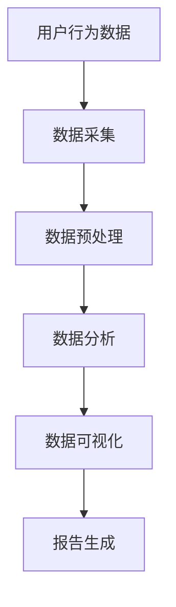

                 

# 如何进行有效的用户行为分析

## 1. 背景介绍

在数字化时代，用户行为分析成为了企业理解用户需求、优化用户体验、提升业务价值的重要工具。无论是电商网站、社交媒体平台，还是移动应用，企业都在通过用户行为数据来驱动决策。但如何从海量数据中提取有效的洞察，并转化为可操作的策略，成为了一个复杂且关键的挑战。

### 1.1 问题由来

随着移动互联网和智能设备的普及，用户产生的数据量呈爆炸性增长。以智能手机为例，用户每天在各种应用上浏览、交互、消费，产生了大量的行为数据。这些数据涉及用户的浏览记录、点击行为、购买记录、社交互动等多个方面。但面对如此庞杂的数据，如何提取有用的信息，进行有效的用户行为分析，成为了一个亟待解决的难题。

### 1.2 问题核心关键点

为了解答这个问题，我们需要深入理解用户行为分析的核心内容和方法，以及如何通过数据分析技术实现有效的用户行为洞察。具体来说，核心问题包括：

1. **数据采集与预处理**：如何从不同来源获取用户行为数据，并将其整理成可用于分析的格式。
2. **数据分析与建模**：如何构建模型，从数据中提取有价值的洞察。
3. **可视化与报告**：如何将分析结果以直观的方式呈现，供决策者使用。

## 2. 核心概念与联系

### 2.1 核心概念概述

用户行为分析涉及多个核心概念，每个概念都是数据驱动决策的重要环节。以下是这些核心概念及其相互联系的概述：

- **用户行为数据**：用户在平台上产生的一系列行为记录，如点击、浏览、购买、留言等。
- **数据采集**：从各种数据源（如网站日志、应用数据、社交媒体等）中获取用户行为数据的过程。
- **数据预处理**：清洗、转换和归一化数据，去除噪音，准备数据供分析。
- **数据分析**：通过统计学、机器学习等方法，从数据中提取有意义的洞察。
- **数据可视化**：使用图表、仪表盘等工具，将分析结果以直观的形式呈现。
- **报告生成**：将可视化结果转化为可操作的策略和建议，供业务决策参考。

这些概念之间相互依存，形成一个完整的用户行为分析流程。通过系统化的数据处理和分析，企业可以从中获得洞察，优化产品和服务，提升用户体验和业务绩效。

### 2.2 核心概念原理和架构的 Mermaid 流程图



这个流程图展示了用户行为分析的流程：首先从各种数据源采集用户行为数据，然后进行预处理和分析，将分析结果通过可视化呈现，最后生成报告，供业务决策使用。

## 3. 核心算法原理 & 具体操作步骤

### 3.1 算法原理概述

用户行为分析的核心算法原理主要基于数据挖掘和机器学习技术。通过统计学方法，我们可以发现用户行为中的模式和趋势，而通过机器学习，我们可以构建模型，预测用户未来的行为。以下是从数据预处理到模型训练的详细过程。

### 3.2 算法步骤详解

用户行为分析的主要步骤包括：

1. **数据采集**：从网站日志、应用数据、社交媒体等渠道获取用户行为数据。
2. **数据预处理**：清洗和转换数据，去除噪音，准备数据供分析。
3. **数据分析**：通过统计学和机器学习方法，分析数据并提取洞察。
4. **模型构建**：使用机器学习模型，如决策树、随机森林、神经网络等，预测用户行为。
5. **结果可视化**：将分析结果以图表、仪表盘等形式呈现。
6. **报告生成**：根据可视化结果，生成可操作的策略和建议，供业务决策参考。

### 3.3 算法优缺点

用户行为分析算法具有以下优点：

- **全面性**：能够从多维度、多渠道的数据中提取洞察，提供全面的用户画像。
- **预测能力**：通过机器学习模型，能够预测用户未来的行为，提供业务优化建议。
- **实时性**：通过流式数据处理技术，能够实时分析用户行为，快速响应市场变化。

同时，用户行为分析算法也存在一些缺点：

- **复杂性**：涉及数据采集、预处理、分析、建模等多个环节，技术门槛较高。
- **数据隐私**：用户行为数据涉及用户隐私，需要严格的数据保护措施。
- **模型依赖**：模型性能依赖于数据质量和特征选择，需要持续优化和调参。

### 3.4 算法应用领域

用户行为分析的应用领域非常广泛，涵盖了电商、社交、金融、健康等多个行业。以下是一些典型的应用场景：

- **电商行业**：通过分析用户的浏览、购买记录，优化商品推荐，提升销售转化率。
- **社交媒体**：通过分析用户互动行为，提升用户体验，增加用户粘性。
- **金融行业**：通过分析用户交易行为，识别潜在风险，优化风险管理。
- **健康行业**：通过分析用户行为数据，提供个性化健康建议，提升用户健康管理水平。

## 4. 数学模型和公式 & 详细讲解 & 举例说明

### 4.1 数学模型构建

用户行为分析的数学模型构建主要涉及统计学和机器学习。以下是一个典型的用户行为分析模型构建流程：

1. **数据预处理**：
   - 数据清洗：去除缺失值、异常值。
   - 特征工程：选择、转换、构建特征。
   - 数据标准化：将数据归一化到[0,1]或[-1,1]区间。

2. **数据分析**：
   - 描述性统计：计算均值、中位数、标准差等统计量。
   - 探索性数据分析：绘制直方图、散点图、箱线图等。
   - 假设检验：进行T检验、卡方检验等，检验假设。

3. **模型构建**：
   - 分类模型：使用逻辑回归、决策树、随机森林等算法。
   - 回归模型：使用线性回归、岭回归、支持向量机等算法。
   - 聚类模型：使用K-means、层次聚类等算法。

4. **模型评估**：
   - 交叉验证：使用K-fold交叉验证评估模型性能。
   - 误差分析：绘制混淆矩阵，分析模型误差来源。
   - 模型调参：使用网格搜索、随机搜索等方法优化模型参数。

### 4.2 公式推导过程

以线性回归模型为例，推导其最小二乘估计公式：

假设有一组数据集 $(x_i, y_i)$，其中 $x_i$ 为自变量，$y_i$ 为因变量。线性回归模型假设 $y_i$ 与 $x_i$ 之间存在线性关系：

$$
y_i = \beta_0 + \beta_1 x_i + \epsilon_i
$$

其中 $\beta_0$ 和 $\beta_1$ 为模型参数，$\epsilon_i$ 为误差项。

最小二乘估计的目标是最小化误差平方和：

$$
\sum_{i=1}^n (y_i - \hat{y}_i)^2
$$

其中 $\hat{y}_i = \beta_0 + \beta_1 x_i$ 为模型预测值。

通过求导并令导数为0，可得到：

$$
\beta_1 = \frac{\sum_{i=1}^n (x_i - \bar{x})(y_i - \bar{y})}{\sum_{i=1}^n (x_i - \bar{x})^2}
$$

$$
\beta_0 = \bar{y} - \beta_1 \bar{x}
$$

其中 $\bar{x}$ 和 $\bar{y}$ 分别为自变量和因变量的均值。

### 4.3 案例分析与讲解

以下是一个具体的案例分析：

假设某电商平台希望通过分析用户行为，预测用户的购买概率。他们收集了用户的浏览记录、购买记录、搜索行为等数据。通过数据预处理，选择了年龄、性别、浏览次数、购买金额等特征。构建了一个逻辑回归模型，通过交叉验证和误差分析，调整了模型参数，最终得出了一个高精度的购买概率预测模型。该模型被应用于实时推荐系统中，根据用户的当前行为，推荐合适的商品，显著提升了销售转化率。

## 5. 项目实践：代码实例和详细解释说明

### 5.1 开发环境搭建

在进行用户行为分析实践前，我们需要准备好开发环境。以下是使用Python进行数据分析的开发环境配置流程：

1. 安装Anaconda：从官网下载并安装Anaconda，用于创建独立的Python环境。
2. 创建并激活虚拟环境：
```bash
conda create -n analytics-env python=3.8 
conda activate analytics-env
```

3. 安装必要的数据分析和机器学习库：
```bash
pip install pandas numpy scikit-learn matplotlib seaborn statsmodels
```

4. 安装可视化工具：
```bash
pip install matplotlib seaborn plotly
```

5. 安装数据处理和流式处理工具：
```bash
pip install dask[complete] pyspark
```

完成上述步骤后，即可在`analytics-env`环境中开始数据分析实践。

### 5.2 源代码详细实现

以下是一个具体的用户行为分析实践代码实现，包括数据采集、预处理、分析、可视化等环节。

```python
import pandas as pd
import numpy as np
from sklearn.model_selection import train_test_split
from sklearn.linear_model import LogisticRegression
from sklearn.metrics import accuracy_score
from statsmodels.stats.proportion import prop_ztest
import matplotlib.pyplot as plt
import seaborn as sns

# 数据采集
data = pd.read_csv('user_behavior.csv')
```

**数据预处理**：

```python
# 数据清洗
data = data.dropna()

# 特征选择和构建
features = ['age', 'gender', 'clicks', 'spent']
X = data[features]
y = data['purchased']

# 数据标准化
from sklearn.preprocessing import StandardScaler
scaler = StandardScaler()
X = scaler.fit_transform(X)
```

**数据分析**：

```python
# 描述性统计
print(X.describe())

# 探索性数据分析
sns.pairplot(X)
plt.show()

# 假设检验
proportion = X['clicks'].value_counts(normalize=True)
p = prop_ztest(proportion, alternative='two-sided', proportion='proportion')[1]
print(f"点击次数的p值: {p}")
```

**模型构建**：

```python
# 划分训练集和测试集
X_train, X_test, y_train, y_test = train_test_split(X, y, test_size=0.2, random_state=42)

# 构建逻辑回归模型
model = LogisticRegression()
model.fit(X_train, y_train)

# 预测并评估模型
y_pred = model.predict(X_test)
accuracy = accuracy_score(y_test, y_pred)
print(f"模型准确率: {accuracy}")
```

**结果可视化**：

```python
# 绘制混淆矩阵
from sklearn.metrics import confusion_matrix
conf_matrix = confusion_matrix(y_test, y_pred)
sns.heatmap(conf_matrix, annot=True, fmt='d')
plt.show()

# 绘制ROC曲线
from sklearn.metrics import roc_curve
fpr, tpr, threshold = roc_curve(y_test, y_pred)
plt.plot(fpr, tpr)
plt.show()
```

### 5.3 代码解读与分析

让我们再详细解读一下关键代码的实现细节：

**数据预处理**：

- `data.dropna()`：删除含有缺失值的数据。
- `features = ['age', 'gender', 'clicks', 'spent']`：选择需要的特征。
- `X = data[features]`：构建特征矩阵。
- `y = data['purchased']`：构建目标变量。
- `StandardScaler()`：对特征进行标准化。

**数据分析**：

- `X.describe()`：计算描述性统计量。
- `sns.pairplot(X)`：绘制特征之间的相关性图。
- `proportion = X['clicks'].value_counts(normalize=True)`：计算点击次数的比例。
- `prop_ztest()`：进行卡方检验，检验点击次数是否均匀分布。

**模型构建**：

- `train_test_split()`：将数据划分为训练集和测试集。
- `LogisticRegression()`：构建逻辑回归模型。
- `model.fit()`：训练模型。
- `y_pred = model.predict(X_test)`：预测测试集。
- `accuracy_score()`：计算模型准确率。

**结果可视化**：

- `confusion_matrix()`：计算混淆矩阵。
- `sns.heatmap()`：绘制混淆矩阵热图。
- `roc_curve()`：绘制ROC曲线。

可以看到，通过上述代码实现，我们完成了从数据预处理到模型训练和结果可视化的完整流程。开发者可以根据具体需求，进一步优化和扩展代码。

## 6. 实际应用场景

### 6.1 电商行业

电商行业通过用户行为分析，可以优化商品推荐，提升用户体验和销售转化率。具体而言：

1. **用户画像**：通过分析用户的浏览记录、购买记录，构建详细的用户画像，了解用户偏好和需求。
2. **个性化推荐**：基于用户画像，构建推荐模型，推荐用户可能感兴趣的商品，提升点击率和购买率。
3. **库存管理**：分析用户购买行为，优化库存管理，避免库存积压和缺货。

### 6.2 社交媒体

社交媒体平台通过用户行为分析，可以提升用户粘性和活跃度。具体而言：

1. **内容推荐**：分析用户互动行为，推荐相关内容，增加用户粘性。
2. **广告投放**：通过分析用户兴趣，精准投放广告，提升广告效果和转化率。
3. **用户留存**：分析用户流失原因，采取措施提高用户留存率。

### 6.3 金融行业

金融行业通过用户行为分析，可以优化风险管理和客户服务。具体而言：

1. **风险评估**：分析用户交易行为，评估用户风险，优化贷款审批和信用评估。
2. **客户服务**：通过分析客户行为，提供个性化服务，提升客户满意度。
3. **欺诈检测**：分析异常交易行为，及时发现和防范欺诈行为。

### 6.4 未来应用展望

未来，用户行为分析的应用场景将更加广泛，技术手段也将更加多样。以下是一些未来趋势：

1. **大数据分析**：随着数据量的增加，大数据分析技术将成为用户行为分析的重要工具。
2. **实时分析**：通过流式数据处理技术，实现实时行为分析，快速响应市场变化。
3. **多模态分析**：结合文本、图像、语音等多种数据类型，进行多模态用户行为分析。
4. **人工智能**：通过深度学习等技术，构建更加精确的预测模型，提升分析效果。
5. **联邦学习**：保护用户隐私的前提下，通过联邦学习技术，实现跨平台用户行为分析。

## 7. 工具和资源推荐

### 7.1 学习资源推荐

为了帮助开发者系统掌握用户行为分析的理论基础和实践技巧，以下是一些优质的学习资源：

1. **《Python数据分析实战》**：全面介绍数据分析的各个环节，涵盖数据预处理、统计分析、机器学习等内容。
2. **《机器学习实战》**：介绍多种机器学习算法及其应用，提供丰富的实践案例。
3. **Coursera的《数据科学与机器学习》课程**：由斯坦福大学教授主讲，涵盖统计学、机器学习、数据可视化等内容。
4. **Kaggle数据科学竞赛**：提供大量真实世界的数据集，供开发者实践和竞赛。

### 7.2 开发工具推荐

用户行为分析涉及大量的数据处理和计算，以下是一些常用的开发工具：

1. **Jupyter Notebook**：交互式的编程环境，适合数据分析和模型构建。
2. **RStudio**：R语言的数据分析和可视化工具，支持大规模数据处理。
3. **Spark**：分布式计算框架，适合处理大规模数据集。
4. **TensorFlow**：深度学习框架，适合复杂数据分析和预测模型构建。
5. **Apache Airflow**：数据管道工具，支持任务的自动化和调度。

### 7.3 相关论文推荐

用户行为分析的研究领域非常广泛，以下是一些有代表性的论文，推荐阅读：

1. **《用户行为分析的理论与实践》**：系统介绍用户行为分析的基本概念和方法。
2. **《多模态用户行为分析》**：研究多模态数据融合，提升用户行为分析的准确性。
3. **《基于深度学习的用户行为预测》**：通过深度学习模型，预测用户行为，提升推荐系统的效果。
4. **《隐私保护的用户行为分析》**：研究如何在保护用户隐私的前提下，进行数据挖掘和分析。

## 8. 总结：未来发展趋势与挑战

### 8.1 总结

本文对用户行为分析的核心内容和方法进行了全面系统的介绍。首先阐述了用户行为分析的背景和重要性，明确了数据分析在驱动业务决策中的关键作用。其次，从数据采集到模型评估，详细讲解了用户行为分析的各个环节，并提供了具体的代码实现。最后，展望了用户行为分析的未来趋势，强调了大数据、实时性、多模态分析等方向的发展潜力。

### 8.2 未来发展趋势

未来，用户行为分析将朝着以下几个方向发展：

1. **数据驱动决策**：通过全面、准确的数据分析，驱动业务决策，提升业务绩效。
2. **实时数据分析**：实时处理用户行为数据，快速响应市场变化。
3. **多模态融合**：结合多种数据类型，提升用户行为分析的准确性。
4. **人工智能**：通过深度学习等技术，提升预测模型的性能。
5. **隐私保护**：在保护用户隐私的前提下，进行数据挖掘和分析。

### 8.3 面临的挑战

尽管用户行为分析技术已经取得了显著进展，但在实施过程中仍面临以下挑战：

1. **数据质量问题**：数据不完整、不规范，影响了分析结果的准确性。
2. **数据隐私问题**：用户行为数据涉及隐私，需要严格的数据保护措施。
3. **计算资源限制**：大规模数据分析需要高性能计算资源，资源不足会影响分析效率。
4. **模型复杂性**：复杂的分析模型需要持续优化和调参，增加了技术难度。
5. **业务需求多样性**：不同业务需求需要不同类型的数据分析，增加了分析复杂性。

### 8.4 研究展望

未来，用户在面对这些挑战时，可以通过以下几个方面寻求突破：

1. **数据清洗和预处理**：提高数据质量和规范性，确保分析结果的准确性。
2. **隐私保护技术**：采用数据匿名化、差分隐私等技术，保护用户隐私。
3. **高性能计算**：通过分布式计算、云计算等手段，提升数据处理能力。
4. **模型自动化**：开发自动化模型调参工具，降低技术门槛。
5. **业务定制化**：根据不同业务需求，定制化数据分析解决方案。

这些研究方向和突破方向，将帮助用户行为分析技术更好地服务于业务决策，推动数字化转型进程。

## 9. 附录：常见问题与解答

**Q1: 用户行为分析的目的是什么？**

A: 用户行为分析的目的是通过分析用户在不同场景下的行为，挖掘用户需求和行为模式，从而优化产品和服务，提升用户体验和业务绩效。

**Q2: 数据采集有哪些常见方式？**

A: 数据采集的常见方式包括：
1. 网站日志：记录用户访问网站的行为。
2. 应用数据：记录用户在应用中的行为。
3. 社交媒体：记录用户在社交平台上的互动行为。
4. 传感器数据：记录用户行为数据，如位置、时间等。

**Q3: 数据预处理包括哪些步骤？**

A: 数据预处理包括：
1. 数据清洗：去除缺失值、异常值。
2. 特征工程：选择、转换、构建特征。
3. 数据标准化：将数据归一化到[0,1]或[-1,1]区间。

**Q4: 常用的用户行为分析模型有哪些？**

A: 常用的用户行为分析模型包括：
1. 线性回归：用于预测连续变量。
2. 逻辑回归：用于预测二分类变量。
3. 决策树：用于分类和回归。
4. 随机森林：用于分类和回归。
5. 神经网络：用于复杂的非线性预测。

**Q5: 数据可视化有哪些常用工具？**

A: 数据可视化的常用工具包括：
1. Matplotlib：绘制2D图表。
2. Seaborn：绘制统计图表。
3. Plotly：绘制交互式图表。
4. Tableau：商业智能可视化工具。
5. Power BI：商业智能可视化工具。

通过这些详细解释和说明，相信读者能够更好地理解用户行为分析的核心概念和方法，掌握数据分析的实践技巧，从而在实际工作中应用自如。

---

作者：禅与计算机程序设计艺术 / Zen and the Art of Computer Programming

