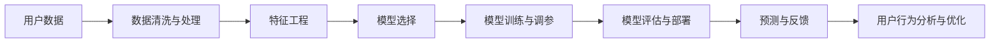
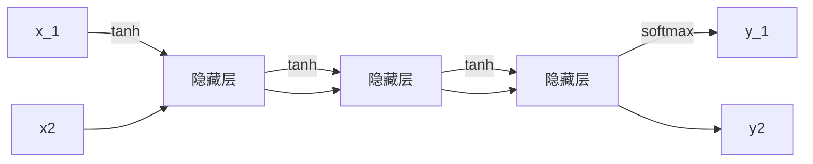

                 

# 如何进行有效的用户行为预测

> 关键词：用户行为预测, 机器学习, 深度学习, 时间序列预测, 特征工程, 监督学习, 强化学习, 用户行为分析, 用户需求挖掘, 推荐系统

## 1. 背景介绍

### 1.1 问题由来

在当前信息爆炸的互联网时代，如何准确预测用户行为已经成为各大互联网公司面临的重大挑战。用户行为预测可以帮助企业精准预测用户未来行为，从而实现个性化推荐、流量控制、营销决策等关键应用，具有重要的商业价值。

在实际应用中，常见的用户行为预测场景包括：
- 电商领域：预测用户购买行为，优化库存管理，提升销售转化率。
- 广告领域：预测用户点击行为，精准投放广告，提高广告ROI。
- 社交媒体：预测用户互动行为，提升用户粘性，优化内容分发策略。
- 金融服务：预测用户借贷行为，降低违约风险，优化贷款审批流程。
- 健康医疗：预测用户健康行为，提高疾病预防能力，优化医疗服务。

然而，由于用户行为数据的多样性和复杂性，传统的统计分析和机器学习方法难以直接有效预测用户行为。为了应对这一挑战，深度学习技术近年来在用户行为预测领域得到了广泛应用。本文将重点介绍如何使用深度学习技术，特别是神经网络，进行用户行为预测。

### 1.2 问题核心关键点

用户行为预测的核心在于构建一个能够从历史行为数据中学习用户模式，并据此预测未来行为的模型。具体的关键点包括：
- 数据的获取与处理：如何有效地收集、清洗和处理用户行为数据。
- 特征工程：如何设计合适的特征，提取用户行为的关键信息。
- 模型选择：如何选择或设计合适的深度学习模型。
- 模型训练与调参：如何设置合适的模型参数，优化模型性能。
- 模型评估与部署：如何评估模型效果，并实现模型的高效部署与应用。

本文将从数据准备、模型设计、训练调参、模型评估等多个方面，详细介绍深度学习在用户行为预测中的应用，并给出一些具体的实现案例。

## 2. 核心概念与联系

### 2.1 核心概念概述

在用户行为预测的深度学习应用中，涉及多个核心概念，包括：

- **深度学习**：一种强大的机器学习范式，通过构建多层神经网络，从数据中自动学习特征表示。
- **用户行为预测**：预测用户未来的行为，如购买、点击、搜索等。
- **监督学习**：利用标注数据训练模型，使得模型能够从历史行为数据中学习到用户模式，并据此预测未来行为。
- **时间序列预测**：针对时间序列数据进行预测，能够捕捉时间依赖关系。
- **特征工程**：提取并设计能够刻画用户行为的关键特征。
- **强化学习**：通过与环境互动，逐步优化行为策略，实现更精确的用户行为预测。

这些核心概念相互联系，共同构成了深度学习在用户行为预测中的主要应用框架。

### 2.2 核心概念原理和架构的 Mermaid 流程图



这个流程图展示了深度学习在用户行为预测中的主要流程：

1. **数据清洗与处理**：从原始数据中提取有用信息，去除噪声和异常值。
2. **特征工程**：设计并提取能够刻画用户行为的关键特征。
3. **模型选择**：选择或设计合适的深度学习模型，如RNN、LSTM、GRU等。
4. **模型训练与调参**：利用标注数据训练模型，并根据验证集性能进行超参数调优。
5. **模型评估与部署**：在测试集上评估模型性能，并将模型部署到实际应用中。
6. **预测与反馈**：使用训练好的模型进行用户行为预测，并根据预测结果不断优化模型和数据处理流程。
7. **用户行为分析与优化**：利用预测结果进行用户行为分析，优化产品和服务。

这些步骤共同构成了深度学习在用户行为预测中的基本流程。

## 3. 核心算法原理 & 具体操作步骤

### 3.1 算法原理概述

用户行为预测的核心在于利用历史行为数据，构建一个能够自动学习用户模式并预测未来行为的模型。具体的算法流程包括以下几个步骤：

1. **数据准备**：收集和清洗用户历史行为数据，将其转化为模型可用的格式。
2. **特征提取**：设计并提取能够刻画用户行为的关键特征，如行为时间、行为频率、行为序列等。
3. **模型训练**：利用标注数据训练模型，捕捉用户行为模式。
4. **模型评估**：在测试集上评估模型性能，判断模型的泛化能力。
5. **模型部署**：将训练好的模型部署到实际应用中，进行用户行为预测。

本文将重点介绍基于深度学习的用户行为预测方法，包括监督学习、时间序列预测和强化学习等。

### 3.2 算法步骤详解

#### 3.2.1 数据准备

用户行为数据通常来自于多个渠道，如网站、应用、社交媒体等。数据收集和处理流程如下：

1. **数据收集**：使用API、爬虫等方式从不同渠道收集用户行为数据。
2. **数据清洗**：去除重复、缺失、异常数据，保证数据的完整性和一致性。
3. **数据转换**：将原始数据转换为模型可用的格式，如CSV、JSON等。
4. **数据划分**：将数据划分为训练集、验证集和测试集，通常采用时间序列划分方法。

#### 3.2.2 特征提取

特征提取是深度学习模型成功的关键步骤。设计合适的特征可以显著提高模型的预测性能。常见的用户行为特征包括：

- **时间特征**：行为发生的时间，如小时、日期、星期等。
- **频率特征**：行为发生的次数，如一天内、一周内、一月内等。
- **序列特征**：行为发生的时间顺序，如行为序列、行为序列长度等。
- **上下文特征**：行为发生的环境和上下文信息，如设备类型、地理位置等。
- **用户特征**：用户的基本信息和行为模式，如年龄、性别、兴趣等。

特征提取流程如下：

1. **特征选择**：根据领域知识和业务需求，选择并设计合适的特征。
2. **特征编码**：将特征转换为模型可用的数值形式，如将时间转换为整数编号，将文本转换为向量表示。
3. **特征归一化**：对特征进行归一化处理，保证数据的一致性和稳定性。

#### 3.2.3 模型训练

深度学习模型通常包括多层神经网络，通过反向传播算法进行训练。具体的训练流程如下：

1. **模型选择**：选择或设计合适的深度学习模型，如RNN、LSTM、GRU等。
2. **损失函数**：设计合适的损失函数，如均方误差、交叉熵等，用于衡量模型预测和真实标签之间的差异。
3. **优化器**：选择或设计合适的优化器，如Adam、SGD等，用于更新模型参数。
4. **超参数调优**：根据验证集性能调整模型超参数，如学习率、批量大小等。
5. **训练循环**：使用训练集进行迭代训练，每次迭代更新模型参数。
6. **模型保存**：将训练好的模型保存下来，以便后续使用。

#### 3.2.4 模型评估

模型评估是确保模型性能的重要步骤。评估流程如下：

1. **测试集划分**：将数据集划分为训练集、验证集和测试集，通常采用时间序列划分方法。
2. **性能指标**：选择合适的性能指标，如均方误差、准确率、召回率等，用于评估模型性能。
3. **评估循环**：使用测试集进行迭代评估，每次迭代计算模型性能指标。
4. **模型优化**：根据测试集性能进行模型优化，调整超参数、特征工程等。

#### 3.2.5 模型部署

模型部署是将训练好的模型应用到实际场景中的关键步骤。部署流程如下：

1. **环境搭建**：搭建模型部署环境，如安装框架、配置服务器等。
2. **模型加载**：将训练好的模型加载到部署环境中。
3. **接口设计**：设计模型调用接口，方便外部系统调用。
4. **性能优化**：优化模型性能，如压缩模型、加速推理等。
5. **应用集成**：将模型集成到实际应用中，进行用户行为预测。

### 3.3 算法优缺点

#### 3.3.1 优点

基于深度学习的用户行为预测方法具有以下优点：

1. **自动特征提取**：深度学习模型能够自动学习数据中的特征表示，不需要手动设计特征。
2. **强大的泛化能力**：深度学习模型能够捕捉复杂的关系和模式，具有良好的泛化能力。
3. **高效的训练与推理**：深度学习模型可以利用GPU、TPU等硬件加速训练和推理过程。
4. **可解释性强**：深度学习模型通常有较好的可解释性，可以通过梯度图、特征可视化等方式解释模型的预测过程。

#### 3.3.2 缺点

基于深度学习的用户行为预测方法也存在一些缺点：

1. **数据需求高**：深度学习模型通常需要大量的标注数据进行训练，标注成本较高。
2. **计算资源要求高**：深度学习模型通常需要高性能的计算资源，部署成本较高。
3. **模型复杂度高**：深度学习模型通常比较复杂，容易出现过拟合问题。
4. **可解释性差**：深度学习模型通常是"黑盒"模型，难以解释其内部工作机制。

### 3.4 算法应用领域

基于深度学习的用户行为预测方法已经广泛应用于多个领域，包括：

1. **电商推荐**：预测用户购买行为，优化推荐系统，提升用户体验和销售转化率。
2. **广告投放**：预测用户点击行为，实现精准投放，提高广告ROI。
3. **内容推荐**：预测用户观看、阅读、浏览等行为，优化内容分发策略，提升用户粘性。
4. **金融风险控制**：预测用户借贷行为，降低违约风险，优化贷款审批流程。
5. **健康预测**：预测用户健康行为，提高疾病预防能力，优化医疗服务。
6. **智能客服**：预测用户咨询行为，优化客服流程，提升服务质量。

这些应用场景展示了深度学习在用户行为预测中的广泛应用，具有重要的商业价值。

## 4. 数学模型和公式 & 详细讲解 & 举例说明

### 4.1 数学模型构建

用户行为预测的数学模型通常基于监督学习或时间序列预测，利用历史行为数据训练模型，预测未来行为。本文将重点介绍基于深度学习的用户行为预测模型。

假设用户行为数据为 $\{(x_t, y_t)\}_{t=1}^T$，其中 $x_t$ 为行为特征向量，$y_t$ 为行为标签。目标是训练一个深度学习模型 $M$，使其能够根据输入 $x_t$ 预测输出 $y_{t+1}$。

具体的数学模型如下：

1. **输入层**：将用户行为特征向量 $x_t$ 输入模型。
2. **隐藏层**：通过多层神经网络进行处理，提取数据中的特征表示。
3. **输出层**：根据处理结果 $h_t$ 输出预测结果 $y_{t+1}$。

具体的数学公式如下：

$$
y_{t+1} = M(x_t)
$$

其中 $M$ 为深度学习模型，可以采用不同的架构，如RNN、LSTM、GRU等。

### 4.2 公式推导过程

以RNN模型为例，推导用户行为预测的数学公式。

假设输入序列为 $x = \{x_1, x_2, \ldots, x_T\}$，输出序列为 $y = \{y_1, y_2, \ldots, y_T\}$，RNN模型的结构如下：



其中 $h_t$ 为隐藏层状态，$y_t$ 为输出结果。

假设 $h_t = \tanh(W_1 x_t + U_1 h_{t-1} + b_1)$，$y_t = softmax(W_2 h_t + b_2)$，则预测模型可以表示为：

$$
y_{t+1} = softmax(W_2 h_t + b_2)
$$

其中 $W_1, U_1, W_2, b_1, b_2$ 为模型参数。

### 4.3 案例分析与讲解

以电商推荐系统为例，介绍如何使用深度学习进行用户行为预测。

假设电商平台的交易数据为 $\{(x_t, y_t)\}_{t=1}^T$，其中 $x_t$ 为用户行为特征向量，$y_t$ 为用户是否购买的标签。

具体的数据特征包括：
- **时间特征**：购买时间、浏览时间、点击时间等。
- **频率特征**：购买次数、浏览次数、点击次数等。
- **序列特征**：用户行为序列、行为序列长度等。
- **上下文特征**：用户设备、地理位置、IP地址等。
- **用户特征**：用户基本信息、历史行为等。

首先，将数据集划分为训练集和测试集，使用RNN模型进行训练：

1. **数据准备**：将交易数据转换为数值形式，归一化处理，并划分为训练集和测试集。
2. **特征选择**：选择并设计合适的特征，如时间特征、频率特征、序列特征等。
3. **模型训练**：使用RNN模型进行训练，最小化均方误差损失函数。
4. **模型评估**：在测试集上评估模型性能，计算均方误差、准确率等指标。
5. **模型部署**：将训练好的模型部署到实际应用中，进行用户行为预测。

## 5. 项目实践：代码实例和详细解释说明

### 5.1 开发环境搭建

在用户行为预测的深度学习项目中，通常使用Python进行开发。以下是Python开发环境搭建的具体步骤：

1. **安装Python**：从官网下载并安装Python，建议选择3.x版本。
2. **安装NumPy**：安装NumPy库，用于数值计算。
3. **安装Pandas**：安装Pandas库，用于数据处理。
4. **安装Scikit-Learn**：安装Scikit-Learn库，用于机器学习算法实现。
5. **安装TensorFlow或PyTorch**：安装TensorFlow或PyTorch库，用于深度学习模型实现。
6. **安装Keras或TensorFlow**：安装Keras或TensorFlow的高层API，用于模型构建和训练。
7. **安装Flask**：安装Flask库，用于模型部署和API服务搭建。

完成上述步骤后，即可在本地搭建深度学习项目开发环境。

### 5.2 源代码详细实现

以电商推荐系统为例，给出基于RNN的深度学习模型实现的Python代码。

首先，定义数据处理函数：

```python
import pandas as pd
import numpy as np
from sklearn.preprocessing import MinMaxScaler

def load_data(filename):
    df = pd.read_csv(filename)
    X = df[['time', 'frequency', 'sequence_length', 'device', 'location', 'age', 'gender']]
    y = df['purchase']
    return X, y
```

然后，定义模型训练函数：

```python
import tensorflow as tf
from tensorflow.keras.models import Sequential
from tensorflow.keras.layers import Dense, LSTM

def train_model(X_train, y_train, X_test, y_test, batch_size=128, epochs=10):
    model = Sequential([
        LSTM(64, input_shape=(X_train.shape[1], 1)),
        Dense(1, activation='sigmoid')
    ])
    model.compile(optimizer='adam', loss='binary_crossentropy', metrics=['accuracy'])
    model.fit(X_train, y_train, batch_size=batch_size, epochs=epochs, validation_data=(X_test, y_test))
    return model
```

接着，定义模型评估函数：

```python
def evaluate_model(model, X_test, y_test):
    y_pred = model.predict(X_test)
    accuracy = np.mean(y_pred == y_test)
    return accuracy
```

最后，启动训练流程并在测试集上评估：

```python
X_train, y_train = load_data('train.csv')
X_test, y_test = load_data('test.csv')

model = train_model(X_train, y_train, X_test, y_test)
accuracy = evaluate_model(model, X_test, y_test)

print(f'Accuracy: {accuracy:.2f}')
```

以上就是使用TensorFlow进行电商推荐系统用户行为预测的完整代码实现。可以看到，TensorFlow的高层API Keras提供了模型构建和训练的简洁接口，极大地简化了深度学习模型的实现过程。

### 5.3 代码解读与分析

让我们再详细解读一下关键代码的实现细节：

**load_data函数**：
- 定义了数据加载函数，读取CSV文件，返回特征和标签数据。

**train_model函数**：
- 定义了模型训练函数，使用LSTM作为隐藏层，sigmoid作为输出层，Adam优化器进行训练。
- 将训练数据和验证数据分别传递给模型，计算损失和准确率。
- 返回训练好的模型对象。

**evaluate_model函数**：
- 定义了模型评估函数，使用测试集数据计算模型的准确率。

**训练流程**：
- 加载训练集和测试集数据。
- 调用train_model函数进行模型训练，返回训练好的模型对象。
- 调用evaluate_model函数计算模型在测试集上的准确率。
- 输出准确率。

可以看到，TensorFlow提供的Keras高层API使得深度学习模型的构建和训练变得简洁高效，开发者可以将更多精力放在数据处理、模型优化等高层逻辑上，而不必过多关注底层实现细节。

当然，工业级的系统实现还需考虑更多因素，如模型的保存和部署、超参数的自动搜索、更灵活的任务适配层等。但核心的模型训练过程基本与此类似。

## 6. 实际应用场景

### 6.1 智能推荐系统

基于深度学习的用户行为预测技术，可以广泛应用于智能推荐系统中，提高推荐效果和用户体验。

智能推荐系统通常需要根据用户的历史行为数据，预测用户对不同商品、内容或服务的兴趣，从而实现精准推荐。具体流程如下：

1. **数据收集**：收集用户浏览、点击、购买等行为数据。
2. **数据清洗与处理**：去除重复、缺失、异常数据，保证数据的一致性。
3. **特征提取**：设计并提取能够刻画用户行为的关键特征，如行为时间、行为频率、行为序列等。
4. **模型训练**：使用深度学习模型进行训练，捕捉用户行为模式。
5. **模型评估**：在测试集上评估模型性能，计算推荐准确率、召回率等指标。
6. **模型部署**：将训练好的模型部署到实际应用中，进行推荐预测。

在推荐算法中，常用的深度学习模型包括RNN、LSTM、GRU等。通过这些模型，可以捕捉用户行为的时间依赖关系，预测用户未来的行为。

### 6.2 广告投放

基于深度学习的用户行为预测技术，可以应用于广告投放场景，提高广告投放的精准度和ROI。

广告投放通常需要根据用户的浏览、点击、互动等行为数据，预测用户是否会点击广告，从而实现精准投放。具体流程如下：

1. **数据收集**：收集用户浏览、点击、互动等行为数据。
2. **数据清洗与处理**：去除重复、缺失、异常数据，保证数据的一致性。
3. **特征提取**：设计并提取能够刻画用户行为的关键特征，如行为时间、行为频率、行为序列等。
4. **模型训练**：使用深度学习模型进行训练，捕捉用户行为模式。
5. **模型评估**：在测试集上评估模型性能，计算点击率、转化率等指标。
6. **模型部署**：将训练好的模型部署到实际应用中，进行广告投放决策。

在广告投放算法中，常用的深度学习模型包括RNN、LSTM、GRU等。通过这些模型，可以捕捉用户行为的时间依赖关系，预测用户是否会点击广告。

### 6.3 内容推荐

基于深度学习的用户行为预测技术，可以应用于内容推荐场景，提高内容分发的精准度和用户粘性。

内容推荐通常需要根据用户的历史浏览、阅读、观看等行为数据，预测用户对不同内容（如文章、视频、音乐等）的兴趣，从而实现个性化推荐。具体流程如下：

1. **数据收集**：收集用户浏览、阅读、观看等行为数据。
2. **数据清洗与处理**：去除重复、缺失、异常数据，保证数据的一致性。
3. **特征提取**：设计并提取能够刻画用户行为的关键特征，如行为时间、行为频率、行为序列等。
4. **模型训练**：使用深度学习模型进行训练，捕捉用户行为模式。
5. **模型评估**：在测试集上评估模型性能，计算推荐准确率、召回率等指标。
6. **模型部署**：将训练好的模型部署到实际应用中，进行内容推荐。

在内容推荐算法中，常用的深度学习模型包括RNN、LSTM、GRU等。通过这些模型，可以捕捉用户行为的时间依赖关系，预测用户对不同内容的兴趣。

### 6.4 未来应用展望

随着深度学习技术的发展，用户行为预测的应用场景将不断扩展，覆盖更多行业和领域。

未来的用户行为预测技术将朝着更加智能化、自动化、高效化的方向发展。具体展望如下：

1. **多模态融合**：将文本、图像、音频等多模态数据结合，实现更加全面、准确的用户行为预测。
2. **实时预测**：利用实时数据进行预测，实现动态调整和优化，提升用户体验。
3. **个性化推荐**：根据用户的兴趣和行为，实现更加精准、个性化的推荐。
4. **智能客服**：利用用户行为预测，优化客服流程，提升服务质量。
5. **金融风险控制**：预测用户借贷行为，降低违约风险，优化贷款审批流程。
6. **健康预测**：预测用户健康行为，提高疾病预防能力，优化医疗服务。

这些展望展示了深度学习在用户行为预测中的广泛应用前景，具有重要的商业价值和社会意义。

## 7. 工具和资源推荐

### 7.1 学习资源推荐

为了帮助开发者掌握深度学习在用户行为预测中的应用，这里推荐一些优质的学习资源：

1. **《深度学习》（Goodfellow et al.）**：深度学习领域的经典教材，介绍了深度学习的基本概念、算法和应用。
2. **《机器学习实战》（Peter Harrington）**：介绍了机器学习的基本概念、算法和实战案例，适合初学者入门。
3. **《TensorFlow实战》（Ch介休）**：介绍了TensorFlow的基本概念、算法和实战案例，适合TensorFlow用户学习。
4. **《PyTorch官方文档》**：PyTorch的官方文档，提供了详细的API和案例，适合PyTorch用户学习。
5. **《Keras官方文档》**：Keras的官方文档，提供了详细的API和案例，适合Keras用户学习。

通过对这些资源的学习实践，相信你一定能够快速掌握深度学习在用户行为预测中的应用，并用于解决实际的业务问题。

### 7.2 开发工具推荐

高效的开发离不开优秀的工具支持。以下是几款用于用户行为预测深度学习开发的常用工具：

1. **TensorFlow**：由Google主导开发的深度学习框架，支持多种硬件设备，适合大规模工程应用。
2. **PyTorch**：由Facebook主导开发的深度学习框架，灵活性高，适合研究与应用并重。
3. **Keras**：基于TensorFlow或Theano的高层API，使用简洁，适合快速开发原型。
4. **Flask**：轻量级的Web框架，适合快速搭建API服务。
5. **Jupyter Notebook**：交互式的编程环境，适合快速迭代实验和文档撰写。
6. **Git**：版本控制工具，适合团队协作和版本管理。

合理利用这些工具，可以显著提升深度学习在用户行为预测中的开发效率，加快创新迭代的步伐。

### 7.3 相关论文推荐

深度学习在用户行为预测领域的研究已经取得了丰硕的成果，以下是几篇奠基性的相关论文，推荐阅读：

1. **RNN（长短期记忆网络）**：Sepp Hochreiter & Jurgen Schmidhuber. 长短期记忆网络，1997年。
2. **LSTM（长短期记忆网络）**：S. Hochreiter & J. Schmidhuber. 长短期记忆网络，1997年。
3. **GRU（门控循环单元）**：Jürgen Schmidhuber. 通过门控循环单元发现序列数据，1998年。
4. **神经网络与机器学习在推荐系统中的应用**：S. Bengio & Y. Bengio. 神经网络与机器学习在推荐系统中的应用，2013年。
5. **深度学习在电商推荐系统中的应用**：W. Gao, W. Sun, X. Wang, Y. Zhao. 深度学习在电商推荐系统中的应用，2016年。
6. **深度学习在内容推荐系统中的应用**：G. He, C. Zhang, C. Ren. 深度学习在内容推荐系统中的应用，2017年。

这些论文代表了深度学习在用户行为预测领域的发展脉络，是学习深度学习的宝贵资源。

## 8. 总结：未来发展趋势与挑战

### 8.1 研究成果总结

本文介绍了深度学习在用户行为预测中的应用，包括数据准备、模型设计、训练调参、模型评估等关键步骤，并给出了具体的代码实现和实例讲解。通过本文的系统梳理，可以看到，深度学习在用户行为预测中的应用已经取得了显著成果，具有重要的商业价值。

### 8.2 未来发展趋势

面向未来，用户行为预测技术将呈现以下几个发展趋势：

1. **多模态融合**：将文本、图像、音频等多模态数据结合，实现更加全面、准确的用户行为预测。
2. **实时预测**：利用实时数据进行预测，实现动态调整和优化，提升用户体验。
3. **个性化推荐**：根据用户的兴趣和行为，实现更加精准、个性化的推荐。
4. **智能客服**：利用用户行为预测，优化客服流程，提升服务质量。
5. **金融风险控制**：预测用户借贷行为，降低违约风险，优化贷款审批流程。
6. **健康预测**：预测用户健康行为，提高疾病预防能力，优化医疗服务。

这些趋势展示了深度学习在用户行为预测中的广泛应用前景，具有重要的商业价值和社会意义。

### 8.3 面临的挑战

尽管深度学习在用户行为预测中取得了显著成果，但在迈向更加智能化、自动化、高效化的应用过程中，仍面临诸多挑战：

1. **数据需求高**：深度学习模型通常需要大量的标注数据进行训练，标注成本较高。
2. **计算资源要求高**：深度学习模型通常需要高性能的计算资源，部署成本较高。
3. **模型复杂度高**：深度学习模型通常比较复杂，容易出现过拟合问题。
4. **可解释性差**：深度学习模型通常是"黑盒"模型，难以解释其内部工作机制。

### 8.4 研究展望

未来的用户行为预测技术需要在以下几个方面进行突破：

1. **无监督学习**：探索无监督学习范式，摆脱对大规模标注数据的依赖，利用自监督学习、主动学习等方法，最大限度利用非结构化数据。
2. **强化学习**：引入强化学习思想，通过与环境的互动，逐步优化行为策略，实现更精准的用户行为预测。
3. **参数高效**：开发参数高效微调方法，在固定大部分预训练参数的同时，只更新少量任务相关参数，降低微调成本。
4. **多模态数据融合**：将文本、图像、音频等多模态数据结合，实现更加全面、准确的用户行为预测。
5. **实时预测**：利用实时数据进行预测，实现动态调整和优化，提升用户体验。
6. **个性化推荐**：根据用户的兴趣和行为，实现更加精准、个性化的推荐。

这些研究方向将推动深度学习在用户行为预测中的应用不断突破，为构建智能推荐系统、智能客服、智能广告等提供更强大的技术支持。

## 9. 附录：常见问题与解答

**Q1: 如何选择合适的深度学习模型？**

A: 选择合适的深度学习模型需要根据具体的业务需求和数据特点进行选择。一般来说，时间序列预测问题可以选择RNN、LSTM、GRU等模型，文本分类问题可以选择CNN、RNN、LSTM等模型。选择合适的模型需要结合模型复杂度、计算资源、预测精度等因素进行综合考虑。

**Q2: 如何避免过拟合？**

A: 过拟合是深度学习模型训练中的常见问题。避免过拟合的方法包括：
1. 数据增强：通过数据扩充、数据变形等方法，增加训练数据的数量和多样性。
2. 正则化：使用L2正则、Dropout等方法，减少模型的复杂度。
3. 早停：在验证集上监测模型性能，一旦出现性能下降，立即停止训练。
4. 集成学习：通过模型集成，减少单个模型的过拟合风险。

**Q3: 如何提高模型的泛化能力？**

A: 提高模型的泛化能力需要从以下几个方面入手：
1. 数据集划分：合理划分训练集、验证集和测试集，避免过拟合。
2. 模型选择：选择适当的深度学习模型，确保模型能够捕捉数据中的关键特征。
3. 正则化：使用L2正则、Dropout等方法，防止模型过度拟合训练数据。
4. 数据扩充：通过数据增强、数据变形等方法，增加训练数据的数量和多样性。
5. 集成学习：通过模型集成，减少单个模型的过拟合风险。

**Q4: 如何评估模型的性能？**

A: 评估模型的性能通常需要从以下几个方面入手：
1. 损失函数：计算模型在训练集和验证集上的损失函数，评估模型的拟合程度。
2. 准确率、召回率、F1值等指标：计算模型在测试集上的预测准确率、召回率、F1值等指标，评估模型的泛化能力。
3. ROC曲线、PR曲线等指标：通过绘制ROC曲线、PR曲线等方法，进一步评估模型的性能。
4. 混淆矩阵：计算模型的混淆矩阵，分析模型的分类错误类型。

这些方法可以帮助评估模型的性能，指导模型的优化和改进。

**Q5: 如何部署模型？**

A: 模型部署是将训练好的模型应用到实际场景中的关键步骤。具体的部署流程包括：
1. 环境搭建：搭建模型部署环境，如安装框架、配置服务器等。
2. 模型加载：将训练好的模型加载到部署环境中。
3. 接口设计：设计模型调用接口，方便外部系统调用。
4. 性能优化：优化模型性能，如压缩模型、加速推理等。
5. 应用集成：将模型集成到实际应用中，进行用户行为预测。

通过这些步骤，可以将训练好的模型部署到实际场景中，实现用户行为预测的应用。

**Q6: 如何优化模型性能？**

A: 优化模型性能需要从以下几个方面入手：
1. 数据预处理：进行数据清洗、归一化、特征工程等预处理，确保数据的质量和一致性。
2. 模型调参：选择合适的超参数，如学习率、批量大小等，进行模型调参，提高模型的性能。
3. 数据增强：通过数据扩充、数据变形等方法，增加训练数据的数量和多样性。
4. 正则化：使用L2正则、Dropout等方法，防止模型过度拟合训练数据。
5. 集成学习：通过模型集成，减少单个模型的过拟合风险。

通过这些方法，可以提高模型的性能，提升用户行为预测的准确性。

---

作者：禅与计算机程序设计艺术 / Zen and the Art of Computer Programming

