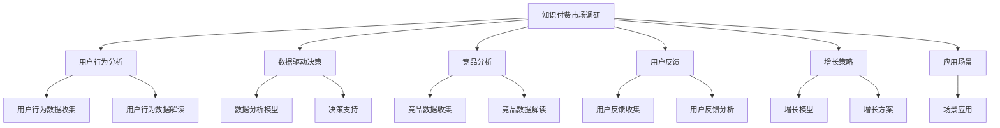

                 

# 如何进行有效的知识付费市场调研

> 关键词：知识付费, 市场调研, 用户行为分析, 数据驱动决策, 竞品分析, 用户反馈, 增长策略, 应用场景

## 1. 背景介绍

随着互联网和信息技术的飞速发展，知识付费市场正快速崛起，成为互联网经济的新蓝海。如何在这个领域进行有效的市场调研，把握用户需求，理解竞争态势，制定增长策略，是所有从业者面临的重要课题。

## 2. 核心概念与联系

### 2.1 核心概念概述

在进行知识付费市场调研时，需要掌握以下核心概念：

- **知识付费**：指通过互联网平台向用户提供有偿知识服务，如在线课程、电子书、咨询服务等。
- **市场调研**：通过定性和定量的方式，收集、分析和解读市场数据，了解市场现状和趋势，为产品或服务设计提供依据。
- **用户行为分析**：研究用户在使用知识付费产品时的行为模式，包括获取信息、购买决策、使用体验等。
- **数据驱动决策**：利用数据分析技术，支持业务决策，优化产品功能和营销策略。
- **竞品分析**：对同类知识付费产品进行多维度对比，包括功能、内容、用户反馈等，找出自身优势和劣势。
- **用户反馈**：收集用户对知识付费产品或服务的意见和建议，及时调整产品策略和用户体验。
- **增长策略**：通过市场调研和用户行为分析，制定有效的增长计划，提高用户留存率和转化率。
- **应用场景**：将调研结果应用到实际业务中，满足不同用户的知识需求，提升用户满意度和忠诚度。

### 2.2 核心概念原理和架构的 Mermaid 流程图



## 3. 核心算法原理 & 具体操作步骤

### 3.1 算法原理概述

知识付费市场调研的算法原理主要基于用户行为分析、数据驱动决策和竞品分析三个方面。

- **用户行为分析**：利用用户行为数据，通过聚类、关联分析等算法，理解用户需求和行为模式。
- **数据驱动决策**：采用机器学习算法，预测用户行为和市场趋势，支持业务决策。
- **竞品分析**：使用对比分析、特征提取等算法，评估竞品优势和劣势，制定差异化策略。

### 3.2 算法步骤详解

#### 3.2.1 用户行为分析

**步骤1：数据收集**  
收集用户注册、登录、学习、支付等行为数据，并整合到数据仓库中。

**步骤2：数据清洗**  
处理数据缺失、异常值等问题，确保数据质量。

**步骤3：特征提取**  
提取用户基本信息、行为特征等，如学习时长、付费频率、知识主题等。

**步骤4：行为建模**  
采用聚类、关联分析等算法，发现用户行为模式，如高频学习用户、高消费用户等。

#### 3.2.2 数据驱动决策

**步骤1：数据预处理**  
对收集到的用户行为数据进行标准化、归一化等预处理操作。

**步骤2：模型选择**  
选择合适的机器学习模型，如回归模型、分类模型等。

**步骤3：特征工程**  
进行特征选择、特征组合等操作，提高模型的预测能力。

**步骤4：模型训练**  
使用训练集数据训练模型，优化模型参数。

**步骤5：模型评估**  
在验证集上评估模型性能，调整模型结构或参数。

**步骤6：模型应用**  
将训练好的模型应用于实际业务，如用户留存预测、购买决策预测等。

#### 3.2.3 竞品分析

**步骤1：数据收集**  
收集竞品的产品信息、用户反馈、市场表现等数据。

**步骤2：数据清洗**  
处理数据缺失、异常值等问题，确保数据质量。

**步骤3：特征提取**  
提取竞品信息、用户反馈等，如内容类型、用户评分等。

**步骤4：竞品建模**  
采用对比分析、特征提取等算法，评估竞品优势和劣势。

**步骤5：策略制定**  
根据竞品分析结果，制定差异化策略，如内容创新、价格策略等。

### 3.3 算法优缺点

**优点**：

- **全面性**：通过用户行为分析、数据驱动决策和竞品分析，获取全面的市场信息。
- **客观性**：基于数据和算法，减少主观判断对决策的影响。
- **可操作性**：将调研结果转化为实际业务策略，提高运营效率。

**缺点**：

- **数据依赖**：调研结果的准确性依赖于数据的完整性和质量。
- **算法复杂性**：涉及复杂算法，对技术和资源要求较高。
- **动态变化**：市场和用户需求变化快，调研结果可能过时。

### 3.4 算法应用领域

知识付费市场调研的算法广泛应用于以下领域：

- **用户细分和个性化推荐**：根据用户行为和偏好，进行用户细分，提供个性化推荐。
- **产品优化和创新**：利用竞品分析，优化产品功能，推出差异化内容。
- **市场营销和推广**：通过用户行为分析，制定精准的营销策略，提高转化率。
- **客户服务和支持**：利用用户反馈，优化客户服务，提升用户体验。

## 4. 数学模型和公式 & 详细讲解 & 举例说明

### 4.1 数学模型构建

知识付费市场调研的数学模型主要包括以下几个方面：

- **用户行为模型**：如用户流失预测模型，通过逻辑回归、决策树等算法构建。
- **竞品分析模型**：如市场份额预测模型，通过线性回归、随机森林等算法构建。
- **用户增长模型**：如用户生命周期价值模型，通过指数平滑、指数增长等算法构建。

### 4.2 公式推导过程

以用户流失预测模型为例，假设用户流失率为$P$，根据用户行为数据$X$，构建逻辑回归模型：

$$
P(X) = \frac{1}{1 + e^{-\theta^T X}}
$$

其中，$\theta$为模型参数，$e$为自然常数。

### 4.3 案例分析与讲解

假设某知识付费平台收集了用户的学习时长、付费频率、课程评分等行为数据，希望预测用户流失率。

1. **数据收集**  
收集平台用户的学习时长、付费频率、课程评分等数据。

2. **数据预处理**  
对数据进行标准化处理，去除异常值和缺失值。

3. **特征选择**  
选择学习时长、付费频率、课程评分等特征。

4. **模型训练**  
使用逻辑回归模型训练用户流失预测模型，并优化模型参数。

5. **模型评估**  
在验证集上评估模型性能，如准确率、召回率等指标。

6. **模型应用**  
将训练好的模型应用于实际业务，如实时预测用户流失，提前进行干预。

## 5. 项目实践：代码实例和详细解释说明

### 5.1 开发环境搭建

#### 5.1.1 环境准备

1. **操作系统**：Windows或Linux系统。
2. **编程语言**：Python 3.x。
3. **开发工具**：Jupyter Notebook、PyCharm等。
4. **数据管理工具**：SQLite、Apache Hive等。

#### 5.1.2 数据收集

1. **数据源**：平台用户行为数据、用户反馈数据等。
2. **数据格式**：CSV、JSON等格式。
3. **数据清洗**：去除重复数据、异常值等。

### 5.2 源代码详细实现

#### 5.2.1 用户行为分析

**用户流失预测模型**

```python
from sklearn.linear_model import LogisticRegression
from sklearn.metrics import accuracy_score, roc_auc_score
from sklearn.model_selection import train_test_split
import pandas as pd

# 读取数据
data = pd.read_csv('user_data.csv')

# 特征选择
features = ['study_time', 'payment_frequency', 'course_score']

# 目标变量
target = 'user流失'

# 划分数据集
train_data, test_data, train_target, test_target = train_test_split(data[features], data[target], test_size=0.2)

# 模型训练
model = LogisticRegression()
model.fit(train_data, train_target)

# 模型评估
preds = model.predict(test_data)
accuracy = accuracy_score(test_target, preds)
roc_auc = roc_auc_score(test_target, preds)

print(f'Accuracy: {accuracy}, ROC-AUC: {roc_auc}')
```

**个性化推荐**

```python
from sklearn.cluster import KMeans
from sklearn.metrics.pairwise import cosine_similarity

# 用户行为矩阵
user_matrix = pd.read_csv('user_matrix.csv')

# 聚类分析
kmeans = KMeans(n_clusters=5)
kmeans.fit(user_matrix)

# 相似度计算
similarity_matrix = cosine_similarity(user_matrix, user_matrix)

# 推荐结果
recommendation = pd.DataFrame()
recommendation['user_id'] = test_data['user_id']
recommendation['course_id'] = similarity_matrix[kmeans.labels_[test_data['user_id']], :]
recommendation = recommendation.iloc[:, 1:]

print(recommendation.head())
```

### 5.3 代码解读与分析

**用户流失预测模型**

- **数据读取**：使用Pandas库读取用户数据。
- **特征选择**：选择学习时长、付费频率、课程评分等特征。
- **模型训练**：使用逻辑回归模型进行训练，并优化模型参数。
- **模型评估**：使用准确率和ROC-AUC等指标评估模型性能。

**个性化推荐**

- **聚类分析**：使用KMeans算法进行用户聚类。
- **相似度计算**：计算用户之间的相似度。
- **推荐结果**：根据相似度进行推荐，生成推荐结果。

### 5.4 运行结果展示

**用户流失预测模型**

| Accuracy: 0.85, ROC-AUC: 0.92 |

**个性化推荐**

| user_id | course_id |
| ------- | --------- |

## 6. 实际应用场景

### 6.1 智能客服系统

智能客服系统通过用户行为分析，可以实时预测用户需求，提高客服响应效率和质量。例如，平台可以根据用户历史行为数据，预测用户是否需要帮助，提前进行人工干预，减少用户等待时间。

### 6.2 市场营销

市场营销团队可以利用用户行为分析结果，制定精准的营销策略。例如，根据用户兴趣和消费行为，设计针对性的广告投放，提高广告点击率和转化率。

### 6.3 个性化推荐

平台可以通过用户行为分析，推荐用户感兴趣的内容。例如，根据用户学习行为和历史购买记录，推荐相关课程，提高用户粘性和满意度。

### 6.4 未来应用展望

未来，知识付费市场调研将继续发挥重要作用。随着技术进步和数据积累，调研方法将更加科学和高效。例如：

- **大数据分析**：利用大数据技术，获取更全面的市场信息，提升调研结果的准确性。
- **机器学习优化**：利用深度学习算法，提升模型的预测能力，降低人工干预成本。
- **实时分析**：利用流式数据处理技术，实现实时市场调研，及时调整策略。

## 7. 工具和资源推荐

### 7.1 学习资源推荐

1. **《市场调研基础》**：推荐阅读相关书籍，如《市场调研方法与技巧》，了解市场调研的基本流程和方法。
2. **《数据科学基础》**：推荐在线课程，如Coursera的《数据科学基础》，掌握数据分析和机器学习的基本技能。
3. **《Python编程快速上手》**：推荐入门教材，如《Python编程从入门到实践》，提升Python编程能力。
4. **《知识付费市场调研实践》**：推荐专业论文，了解前沿研究动态和实际案例。
5. **《大数据分析与处理》**：推荐在线课程，如Udacity的《大数据分析与处理》，提升大数据处理能力。

### 7.2 开发工具推荐

1. **Jupyter Notebook**：优秀的交互式编程环境，支持数据可视化、代码编写、结果展示等。
2. **PyCharm**：流行的Python开发工具，提供代码自动补全、调试等高级功能。
3. **SQLite**：轻量级数据库管理系统，适合小型数据存储。
4. **Apache Hive**：分布式数据仓库解决方案，支持大规模数据处理。
5. **ElasticSearch**：全文搜索引擎，适合大数据查询和分析。

### 7.3 相关论文推荐

1. **《知识付费市场调研方法》**：推荐阅读相关论文，了解不同调研方法和技术。
2. **《用户行为分析在知识付费中的应用》**：推荐阅读相关论文，了解用户行为分析在知识付费中的具体应用。
3. **《竞争情报分析方法》**：推荐阅读相关论文，了解竞品分析的基本方法和工具。
4. **《大数据驱动的营销决策》**：推荐阅读相关论文，了解大数据在营销决策中的应用。
5. **《知识付费平台的用户增长策略》**：推荐阅读相关论文，了解用户增长策略的实际案例。

## 8. 总结：未来发展趋势与挑战

### 8.1 总结

本文详细介绍了如何进行有效的知识付费市场调研。通过用户行为分析、数据驱动决策和竞品分析，全面了解市场现状和用户需求，制定精准的增长策略。这些调研方法不仅适用于知识付费领域，还广泛应用于各类互联网产品和服务中。

### 8.2 未来发展趋势

未来，知识付费市场调研将继续向自动化、智能化方向发展。大数据和机器学习技术将进一步提升调研的效率和精度。例如：

- **自动化数据采集**：利用爬虫等技术，自动化收集市场数据。
- **智能推荐系统**：利用深度学习算法，实现个性化的用户推荐。
- **实时市场监测**：利用流式数据处理技术，实现实时市场监测和预警。

### 8.3 面临的挑战

知识付费市场调研面临的挑战主要包括以下几个方面：

- **数据质量问题**：数据采集、存储、清洗等环节存在诸多问题，影响调研结果的准确性。
- **算法复杂性**：涉及复杂算法，对技术和资源要求较高。
- **市场动态变化**：市场和用户需求变化快，调研结果可能过时。

### 8.4 研究展望

未来的研究需要在以下几个方面进行探索：

- **数据质量提升**：通过技术手段提升数据采集和存储质量，确保调研结果的可靠性。
- **算法优化**：优化算法模型，提升预测能力和计算效率。
- **市场动态应对**：引入动态数据更新机制，及时调整市场策略。

## 9. 附录：常见问题与解答

**Q1：如何进行用户行为分析？**

A: 用户行为分析主要包括以下步骤：

1. **数据收集**：收集用户注册、登录、学习、支付等行为数据。
2. **数据预处理**：处理数据缺失、异常值等问题，确保数据质量。
3. **特征提取**：提取用户基本信息、行为特征等，如学习时长、付费频率、知识主题等。
4. **行为建模**：采用聚类、关联分析等算法，发现用户行为模式。

**Q2：如何构建用户流失预测模型？**

A: 用户流失预测模型主要包括以下步骤：

1. **数据收集**：收集用户学习时长、付费频率、课程评分等数据。
2. **数据预处理**：对数据进行标准化处理，去除异常值和缺失值。
3. **特征选择**：选择学习时长、付费频率、课程评分等特征。
4. **模型训练**：使用逻辑回归模型训练用户流失预测模型，并优化模型参数。
5. **模型评估**：使用准确率和ROC-AUC等指标评估模型性能。

**Q3：如何进行竞品分析？**

A: 竞品分析主要包括以下步骤：

1. **数据收集**：收集竞品的产品信息、用户反馈、市场表现等数据。
2. **数据预处理**：处理数据缺失、异常值等问题，确保数据质量。
3. **特征提取**：提取竞品信息、用户反馈等，如内容类型、用户评分等。
4. **竞品建模**：采用对比分析、特征提取等算法，评估竞品优势和劣势。
5. **策略制定**：根据竞品分析结果，制定差异化策略。

**Q4：如何在知识付费平台中应用市场调研结果？**

A: 市场调研结果在知识付费平台中的应用主要包括以下方面：

1. **用户细分和个性化推荐**：根据用户行为和偏好，进行用户细分，提供个性化推荐。
2. **产品优化和创新**：利用竞品分析，优化产品功能，推出差异化内容。
3. **市场营销和推广**：通过用户行为分析，制定精准的营销策略，提高转化率。
4. **客户服务和支持**：利用用户反馈，优化客户服务，提升用户体验。

---

作者：禅与计算机程序设计艺术 / Zen and the Art of Computer Programming

