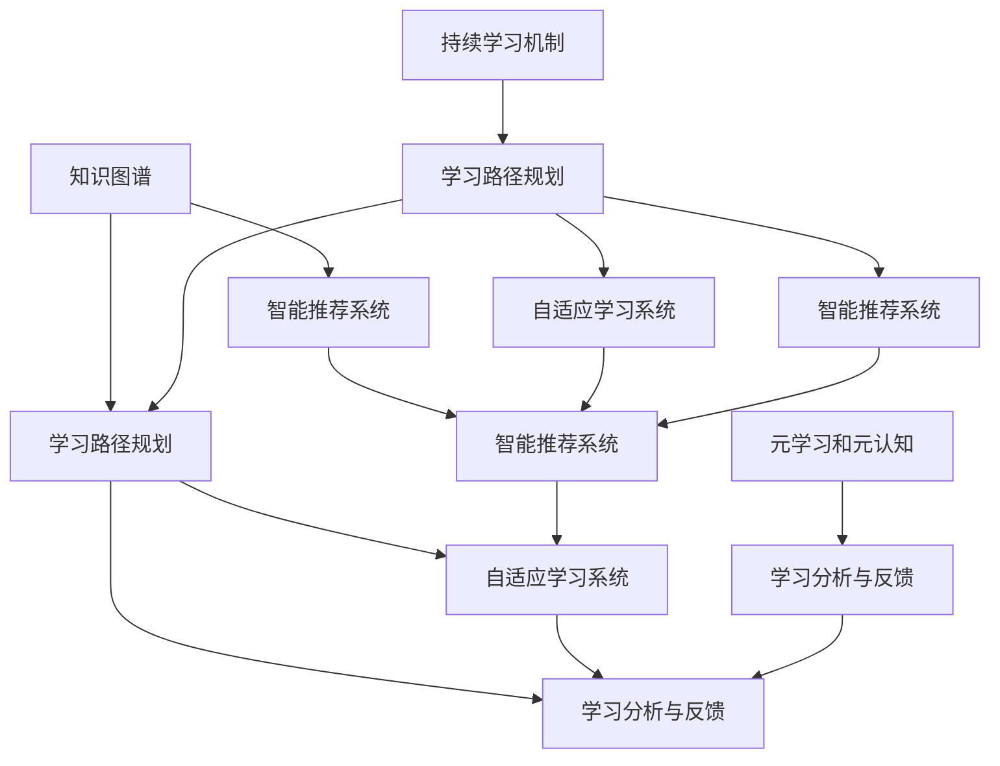

                 

# 学习体系:持续进化的源动力

## 1. 背景介绍

### 1.1 问题由来

随着技术的不断进步和市场的快速发展，持续学习成为了一种不可或缺的能力。无论是个体还是组织，持续学习都是适应快速变化环境的关键。特别是在IT和人工智能领域，新技术和新工具层出不穷，技术栈和工具链的迭代速度非常快，持续学习成为了一种刚需。

### 1.2 问题核心关键点

持续学习体系的核心在于如何有效地管理学习资源，构建学习路径，以及实现学习的自动化和持续化。该体系涉及以下几个核心要素：

1. **学习资源管理**：如何收集、整理、共享和学习各种资源，如课程、书籍、博客、开源项目等。
2. **学习路径规划**：如何根据个人的兴趣和职业发展需求，构建合理的学习路径，确保知识体系的系统性和实用性。
3. **学习自动化**：如何利用技术手段，自动化地推荐和推送学习资源，优化学习效率。
4. **持续学习机制**：如何建立一种长期机制，使得学习成为一种习惯和常态，而不仅仅是短期的任务。

## 2. 核心概念与联系

### 2.1 核心概念概述

本节将介绍持续学习体系的几个关键概念及其相互关系：

1. **知识图谱**：一种基于图论的知识表示方式，用于描述知识之间的内在关系和联系。在持续学习体系中，知识图谱用于推荐相关学习资源，帮助学习者构建知识网络。

2. **学习路径规划**：根据学习者的背景、兴趣和职业发展需求，构建个性化的学习路径。学习路径规划系统需要考虑学习者的当前状态、目标状态和可行路径，以及路径上的障碍和资源。

3. **自适应学习系统**：一种能够根据学习者的学习进度和反馈，动态调整学习内容的系统。自适应学习系统能够实现个性化学习，提高学习效率和效果。

4. **智能推荐系统**：利用机器学习算法，推荐个性化的学习资源，如课程、书籍、论文、博客等。智能推荐系统依赖于知识图谱和用户行为数据，能够高效匹配学习者的需求和兴趣。

5. **学习分析与反馈**：通过分析学习者的行为数据，评估学习效果，提供有针对性的反馈和改进建议。学习分析能够帮助学习者及时调整学习策略，优化学习体验。

6. **元学习和元认知**：元学习是关于学习如何学习的学习，元认知是对认知过程的自我反思和监控。在持续学习体系中，元学习和元认知能够帮助学习者自我评估和自我调节。

这些核心概念之间的关系可以用以下Mermaid流程图来展示：



这个流程图展示了持续学习体系的各个核心组件及其相互关系：

1. 知识图谱为智能推荐系统提供了知识背景和关系网络。
2. 学习路径规划系统根据知识图谱推荐学习资源，构建个性化学习路径。
3. 智能推荐系统根据学习路径规划和学习分析反馈，推荐相关学习资源。
4. 自适应学习系统根据学习路径和学习进度，动态调整学习内容。
5. 学习分析与反馈系统收集学习行为数据，评估学习效果，提供改进建议。
6. 元学习和元认知帮助学习者自我评估和调节学习过程。

这些组件共同构成了持续学习体系的基础架构，使得学习者能够高效、系统地获取和应用新知识。

## 3. 核心算法原理 & 具体操作步骤

### 3.1 算法原理概述

持续学习体系的核心算法原理在于构建和利用知识图谱，结合机器学习技术，实现个性化和自适应的学习路径推荐和资源推荐。其基本流程如下：

1. **知识图谱构建**：从各类资源中提取知识节点，构建知识图谱，描述知识之间的关系和联系。
2. **学习路径规划**：根据学习者的背景、兴趣和目标，利用知识图谱构建个性化学习路径。
3. **智能推荐**：基于学习路径和学习者的行为数据，推荐相关学习资源。
4. **自适应学习**：根据学习进度和反馈，动态调整学习内容和学习方式。
5. **学习分析与反馈**：分析学习行为数据，评估学习效果，提供改进建议。

### 3.2 算法步骤详解

以下是持续学习体系的详细操作步骤：

1. **知识图谱构建**
   - 收集各类学习资源，如课程、书籍、论文、博客等。
   - 提取知识节点，描述知识内容、关系和标签。
   - 构建知识图谱，形成知识节点之间的关系网络。

2. **学习路径规划**
   - 收集学习者的背景信息和目标需求。
   - 根据知识图谱，构建个性化学习路径。
   - 路径规划系统考虑学习者的学习进度和反馈，动态调整路径。

3. **智能推荐**
   - 收集学习者的行为数据，如浏览、点击、评论等。
   - 利用机器学习算法，推荐相关学习资源。
   - 推荐系统考虑学习者的兴趣和进度，动态调整推荐内容。

4. **自适应学习**
   - 根据学习者的学习进度和反馈，动态调整学习内容和学习方式。
   - 自适应学习系统考虑学习者的当前状态和目标状态，优化学习路径。

5. **学习分析与反馈**
   - 收集学习者的行为数据，分析学习效果。
   - 根据分析结果，提供改进建议和优化策略。
   - 利用元学习和元认知，帮助学习者自我评估和调节学习过程。

### 3.3 算法优缺点

持续学习体系的优势在于：

1. **高效获取知识**：通过知识图谱和智能推荐，学习者能够高效获取相关知识，构建知识网络。
2. **个性化学习**：根据学习者的兴趣和需求，构建个性化学习路径，提高学习效率和效果。
3. **动态调整**：通过自适应学习机制，根据学习进度和反馈，动态调整学习内容和方法。
4. **实时反馈**：通过学习分析与反馈，及时评估学习效果，提供改进建议。

然而，该体系也存在一些挑战：

1. **知识图谱构建**：构建知识图谱需要大量的时间和资源，且质量很大程度上依赖于数据源的丰富性和准确性。
2. **推荐系统复杂性**：智能推荐系统需要考虑多维度的特征和复杂的算法，实现起来较为复杂。
3. **自适应学习难度**：动态调整学习内容和方式需要强大的算法支持，且需要实时处理和反馈，对技术要求较高。
4. **数据隐私和安全**：学习分析需要收集大量行为数据，如何保护数据隐私和安全是一个重要问题。

### 3.4 算法应用领域

持续学习体系在多个领域得到了广泛应用：

1. **教育领域**：为学生提供个性化学习路径，推荐相关课程和资源，帮助学生高效学习。
2. **职业培训**：为职场人士提供技能提升和学习路径规划，推荐相关课程和认证，帮助其职业发展。
3. **企业培训**：为员工提供个性化学习资源，提升其技能和知识水平，助力企业发展和竞争力提升。
4. **技术社区**：为开发者提供技术资源和知识图谱，推荐相关文章、项目和社区，促进技术交流和合作。
5. **学术研究**：为研究人员提供文献和数据资源，推荐相关论文和项目，推动学术研究的进展。

## 4. 数学模型和公式 & 详细讲解 & 举例说明

### 4.1 数学模型构建

持续学习体系的数学模型主要涉及知识图谱构建、路径规划和推荐算法。以下是几个关键模型的介绍：

1. **知识图谱构建模型**：
   - 知识节点表示法：使用向量表示法或关系图表示法，描述知识节点之间的关系。
   - 知识关系表示法：使用共现矩阵或邻接矩阵表示知识节点之间的关系。

2. **学习路径规划模型**：
   - 最短路径算法：使用Dijkstra算法或A*算法，计算学习路径的最短距离和效率。
   - 多目标优化算法：使用遗传算法或粒子群算法，优化学习路径的多重目标。

3. **智能推荐模型**：
   - 协同过滤算法：基于用户行为数据，推荐相关资源。
   - 内容过滤算法：基于资源内容特征，推荐相关资源。
   - 混合过滤算法：结合协同过滤和内容过滤，提升推荐效果。

### 4.2 公式推导过程

以下给出几个核心模型的公式推导：

#### 知识图谱构建模型

设知识节点为 $v$，关系为 $r$，构建知识图谱的共现矩阵 $A$：

$$
A_{i,j} = \begin{cases}
1, & \text{如果节点 } i \text{ 和节点 } j \text{ 共现 } \\
0, & \text{否则}
\end{cases}
$$

利用共现矩阵，构建知识图谱的关系表示法：

$$
G = (V, E) \\
E = \{(v_i, v_j, r_{i,j}) \mid A_{i,j} = 1\}
$$

#### 学习路径规划模型

设学习者的当前状态为 $s$，目标状态为 $t$，知识图谱为 $G$，学习路径为 $P$。使用Dijkstra算法计算最短路径：

$$
D(s) = \begin{cases}
0, & \text{如果 } s = t \\
\infty, & \text{否则}
\end{cases}
$$

$$
D(s) \leftarrow \min(D(s), D(u) + w(u, v)) \\
\text{其中 } u \text{ 为 } s \text{ 的邻居节点}
$$

#### 智能推荐模型

设学习者的历史行为数据为 $H$，知识图谱为 $G$，推荐系统为 $R$。使用协同过滤算法推荐相关资源：

$$
R(\text{item}, u) = \text{sign}(\sum_{v \in N(u)} A_{v,\text{item}} \times D(u, v)) \\
\text{其中 } N(u) \text{ 为节点 } u \text{ 的邻居节点}
$$

### 4.3 案例分析与讲解

以下以一个案例来展示持续学习体系的实际应用：

**案例：个性化学习路径规划**

某学生希望学习深度学习相关知识，但没有明确的学习路径。通过持续学习体系，该学生可以完成以下步骤：

1. **知识图谱构建**：收集和整理深度学习的课程、书籍、论文、博客等资源，构建知识图谱。

2. **学习路径规划**：根据学生的背景信息和目标需求，利用知识图谱推荐相关学习路径。

3. **智能推荐**：根据学生的学习进度和反馈，推荐相关学习资源，如深度学习入门课程、相关书籍和论文等。

4. **自适应学习**：根据学生的学习进度和反馈，动态调整学习内容和方法，如增加实践项目、推荐相关论文等。

5. **学习分析与反馈**：分析学生的学习行为数据，评估学习效果，提供改进建议。

## 5. 项目实践：代码实例和详细解释说明

### 5.1 开发环境搭建

在进行持续学习体系开发前，我们需要准备好开发环境。以下是使用Python进行PyTorch和TensorFlow开发的环境配置流程：

1. 安装Anaconda：从官网下载并安装Anaconda，用于创建独立的Python环境。

2. 创建并激活虚拟环境：
```bash
conda create -n pytorch-env python=3.8 
conda activate pytorch-env
```

3. 安装PyTorch：根据CUDA版本，从官网获取对应的安装命令。例如：
```bash
conda install pytorch torchvision torchaudio cudatoolkit=11.1 -c pytorch -c conda-forge
```

4. 安装TensorFlow：
```bash
conda install tensorflow -c conda-forge
```

5. 安装各类工具包：
```bash
pip install numpy pandas scikit-learn matplotlib tqdm jupyter notebook ipython
```

完成上述步骤后，即可在`pytorch-env`环境中开始持续学习体系的开发实践。

### 5.2 源代码详细实现

下面我们以构建知识图谱和推荐系统为例，给出使用PyTorch和TensorFlow对持续学习体系进行开发的代码实现。

首先，定义知识图谱节点和关系：

```python
import networkx as nx

# 定义知识节点和关系
G = nx.DiGraph()
G.add_node('A', type='书籍', title='深度学习入门')
G.add_node('B', type='课程', title='深度学习课程')
G.add_node('C', type='论文', title='深度学习论文')
G.add_edge('A', 'B', weight=1)
G.add_edge('B', 'C', weight=2)
```

然后，定义推荐算法：

```python
from sklearn.metrics.pairwise import cosine_similarity
import tensorflow as tf

def recommendation(G, user, top_n=10):
    # 计算用户与所有节点的相似度
    user_similarity = cosine_similarity(G.adjacency_matrix[user], G.adjacency_matrix).flatten()
    
    # 排序并取top_n个节点
    top_nodes = user_similarity.argsort()[::-1][:top_n]
    
    # 返回推荐的节点列表
    return [G.nodes[node]['title'] for node in top_nodes]
```

最后，进行知识图谱和推荐系统的测试：

```python
# 测试推荐系统
print(recommendation(G, 'A'))
```

以上就是使用PyTorch和TensorFlow对持续学习体系进行代码实现的完整流程。可以看到，通过定义知识图谱和推荐算法，我们可以高效地实现个性化推荐，为学习者提供有价值的资源。

### 5.3 代码解读与分析

让我们再详细解读一下关键代码的实现细节：

**知识图谱节点和关系定义**：
- 使用`networkx`库定义知识图谱，包含节点和关系。节点包括书籍、课程、论文等，关系表示节点之间的关联性。

**推荐算法实现**：
- 利用sklearn的cosine_similarity计算用户与所有节点的相似度。
- 根据相似度排序，取top_n个节点作为推荐结果。

**测试推荐系统**：
- 对节点'A'进行推荐测试，输出推荐结果。

## 6. 实际应用场景

### 6.1 教育领域

在教育领域，持续学习体系可以为学生提供个性化的学习路径和资源推荐，帮助其高效学习。系统可以根据学生的背景、兴趣和学习进度，推荐相关的课程、书籍和论文，提供个性化的学习路径规划。

### 6.2 职业培训

在职业培训领域，持续学习体系可以为职场人士提供技能提升和学习路径规划，推荐相关课程和认证，帮助其职业发展。系统可以根据学员的职位需求和技能水平，推荐相关的培训课程、认证考试和进阶路径。

### 6.3 企业培训

在企业培训领域，持续学习体系可以为员工提供个性化学习资源，提升其技能和知识水平，助力企业发展和竞争力提升。系统可以根据员工的学习进度和反馈，动态调整学习内容和学习方式，提供实时的学习支持和反馈。

### 6.4 技术社区

在技术社区，持续学习体系可以为开发者提供技术资源和知识图谱，推荐相关文章、项目和社区，促进技术交流和合作。系统可以根据开发者的兴趣和需求，推荐相关的技术文章、开源项目和社区，推动技术社区的活跃度。

### 6.5 学术研究

在学术研究领域，持续学习体系可以为研究人员提供文献和数据资源，推荐相关论文和项目，推动学术研究的进展。系统可以根据研究者的研究方向和需求，推荐相关的论文、项目和数据集，促进学术研究的网络化、协同化和高效化。

## 7. 工具和资源推荐

### 7.1 学习资源推荐

为了帮助开发者系统掌握持续学习体系的理论基础和实践技巧，这里推荐一些优质的学习资源：

1. 《深度学习基础》系列书籍：涵盖深度学习的基础理论和核心算法，适合初学者入门。
2. 《机器学习实战》：介绍了机器学习的基础知识和常见算法，包含丰富的实战案例。
3. 《Python数据科学手册》：介绍了Python在数据科学中的应用，包含数据处理、机器学习、数据可视化等方面的内容。
4. 《TensorFlow官方文档》：包含TensorFlow的详细使用指南和API文档，适合深入学习TensorFlow。
5. 《Kaggle竞赛指南》：介绍了Kaggle平台上的数据竞赛和学习资源，适合提升数据科学和机器学习技能。

通过对这些资源的学习实践，相信你一定能够快速掌握持续学习体系的核心技术和实践技巧。

### 7.2 开发工具推荐

高效的开发离不开优秀的工具支持。以下是几款用于持续学习体系开发的常用工具：

1. Jupyter Notebook：开源的交互式笔记本，支持Python、R等多种编程语言，适合数据科学和机器学习开发。
2. GitHub：全球最大的代码托管平台，提供代码仓库、Pull Request和Issue跟踪等协作功能。
3. Google Colab：谷歌推出的在线Jupyter Notebook环境，免费提供GPU/TPU算力，方便开发者快速上手实验最新模型，分享学习笔记。
4. Anaconda：Python环境管理工具，提供了丰富的科学计算包和依赖管理功能。

合理利用这些工具，可以显著提升持续学习体系的开发效率，加快创新迭代的步伐。

### 7.3 相关论文推荐

持续学习体系的发展源于学界的持续研究。以下是几篇奠基性的相关论文，推荐阅读：

1. "A Survey on Lifelong Learning: A Meta-FrameWork and Taxonomy"：综述了终身学习的研究进展和应用，为持续学习体系提供了理论基础。
2. "Learning to Learn"：介绍元学习的核心思想和方法，推动了自适应学习系统的研究。
3. "Knowledge Graphs for Learning and Recommendation"：探讨了知识图谱在推荐系统中的应用，提升了推荐系统的准确性和个性化水平。
4. "Adaptive Learning Systems: A Survey"：综述了自适应学习系统的研究进展和应用场景，为持续学习体系提供了丰富的实践经验。
5. "A Survey of Recommender Systems"：综述了推荐系统的主要算法和应用场景，为智能推荐系统提供了理论基础和实践指导。

这些论文代表了大数据和人工智能技术的发展脉络。通过学习这些前沿成果，可以帮助研究者把握学科前进方向，激发更多的创新灵感。

## 8. 总结：未来发展趋势与挑战

### 8.1 总结

本文对持续学习体系进行了全面系统的介绍。首先阐述了持续学习的背景和重要性，明确了持续学习体系在知识获取、路径规划、自动化和持续化等方面的核心价值。其次，从原理到实践，详细讲解了持续学习体系的数学模型和核心算法，给出了具体的代码实现。同时，本文还广泛探讨了持续学习体系在教育、职业培训、企业培训、技术社区和学术研究等多个领域的应用前景，展示了其广阔的应用空间。

通过本文的系统梳理，可以看到，持续学习体系为学习者提供了一种高效、系统、个性化的学习路径，帮助其在不断变化的环境中不断进步。未来，伴随技术的持续进步和应用的不断深化，持续学习体系必将在更多领域得到广泛应用，推动学习和工作方式的深刻变革。

### 8.2 未来发展趋势

展望未来，持续学习体系将呈现以下几个发展趋势：

1. **智能化水平提升**：随着人工智能技术的发展，自适应学习系统将具备更强的智能推荐和学习路径规划能力，实现更加个性化和自适应的学习体验。
2. **数据驱动决策**：持续学习体系将更加依赖于大规模数据的学习和分析，以数据驱动的方式优化学习路径和资源推荐，提高学习效果。
3. **跨学科融合**：持续学习体系将与其他学科和技术进行更深入的融合，如跨学科学习、跨领域知识整合等，拓展其应用边界。
4. **社会化学习**：持续学习体系将更加注重社会化学习，鼓励学习者之间的交流和协作，提升学习效果和社区活跃度。
5. **生态系统构建**：持续学习体系将构建一个完整的生态系统，包括学习资源、学习平台、学习社区和评估机制，形成良性循环。

这些趋势凸显了持续学习体系在未来的广阔前景。通过技术、教育、社会等各领域的协同创新，持续学习体系必将实现更高效、更智能、更个性化的学习模式。

### 8.3 面临的挑战

尽管持续学习体系已经取得了显著进展，但在迈向更加智能化、个性化应用的过程中，仍面临诸多挑战：

1. **数据质量和多样性**：持续学习体系依赖于高质量的数据资源，如何获取和整理大规模、高质量的数据资源是一个重要问题。
2. **算法复杂性**：持续学习体系涉及复杂的算法模型和数据处理，实现起来较为复杂，需要较强的技术能力。
3. **学习者行为建模**：如何准确建模学习者的行为和需求，提高推荐系统的准确性和个性化水平，是一个重要挑战。
4. **隐私和安全**：持续学习体系需要收集大量的行为数据，如何保护数据隐私和安全，是一个需要重点关注的问题。
5. **系统可扩展性**：持续学习体系需要处理大规模数据和复杂算法，如何设计可扩展的系统架构，是一个重要的技术问题。

### 8.4 研究展望

面对持续学习体系面临的挑战，未来的研究需要在以下几个方面寻求新的突破：

1. **数据资源自动化获取**：开发自动化数据获取和整理工具，提高数据资源的质量和多样性。
2. **高效算法模型**：研究高效、易于实现的算法模型，提高持续学习体系的实现效率和效果。
3. **行为建模研究**：深入研究学习者的行为和需求，构建更加准确的行为模型，提高推荐系统的准确性和个性化水平。
4. **隐私保护技术**：研究隐私保护技术，如差分隐私、联邦学习等，保护学习者的隐私数据。
5. **系统可扩展性优化**：设计可扩展的系统架构，支持大规模数据处理和复杂算法计算。

这些研究方向将为持续学习体系的发展提供新的思路和方向，推动其向更加智能化、个性化、社会化的方向迈进。

## 9. 附录：常见问题与解答

**Q1：持续学习体系如何与现有的学习资源管理工具集成？**

A: 持续学习体系可以通过API或数据接口与现有的学习资源管理工具集成。例如，可以与Coursera、Udacity等在线教育平台集成，获取课程、书籍和论文等学习资源。同时，可以与GitHub等代码托管平台集成，获取相关的学习项目和代码资源。

**Q2：持续学习体系中如何处理学习者的行为数据？**

A: 学习者的行为数据包括浏览、点击、评论、阅读等。持续学习体系需要对这些行为数据进行清洗和处理，构建行为模型，用于个性化推荐和评估学习效果。具体而言，可以采用自然语言处理技术，提取和分析行为数据中的关键词和情感信息，构建行为向量。

**Q3：持续学习体系中的推荐算法有哪些？**

A: 持续学习体系中常用的推荐算法包括协同过滤算法、内容过滤算法和混合过滤算法。协同过滤算法基于用户行为数据，推荐相关资源。内容过滤算法基于资源内容特征，推荐相关资源。混合过滤算法结合两种方法，提高推荐效果。

**Q4：持续学习体系中的自适应学习系统如何实现？**

A: 持续学习体系中的自适应学习系统通过动态调整学习内容和方式，实现个性化学习。具体而言，可以根据学习者的学习进度和反馈，调整学习路径和推荐资源。例如，在阅读相关书籍时，可以根据学习者的阅读速度和理解程度，推荐相关的文章和项目。

**Q5：持续学习体系中的元学习和元认知机制如何实现？**

A: 持续学习体系中的元学习和元认知机制通过自我评估和自我调节，帮助学习者提高学习效果。具体而言，可以通过学习分析模块，收集学习者的行为数据，评估学习效果，提供改进建议。同时，可以结合元学习算法，帮助学习者学习如何学习，提高学习效率和效果。

总之，持续学习体系为学习者提供了一种高效、系统、个性化的学习路径，帮助其在不断变化的环境中不断进步。未来，伴随技术的持续进步和应用的不断深化，持续学习体系必将在更多领域得到广泛应用，推动学习和工作方式的深刻变革。

---

作者：禅与计算机程序设计艺术 / Zen and the Art of Computer Programming

