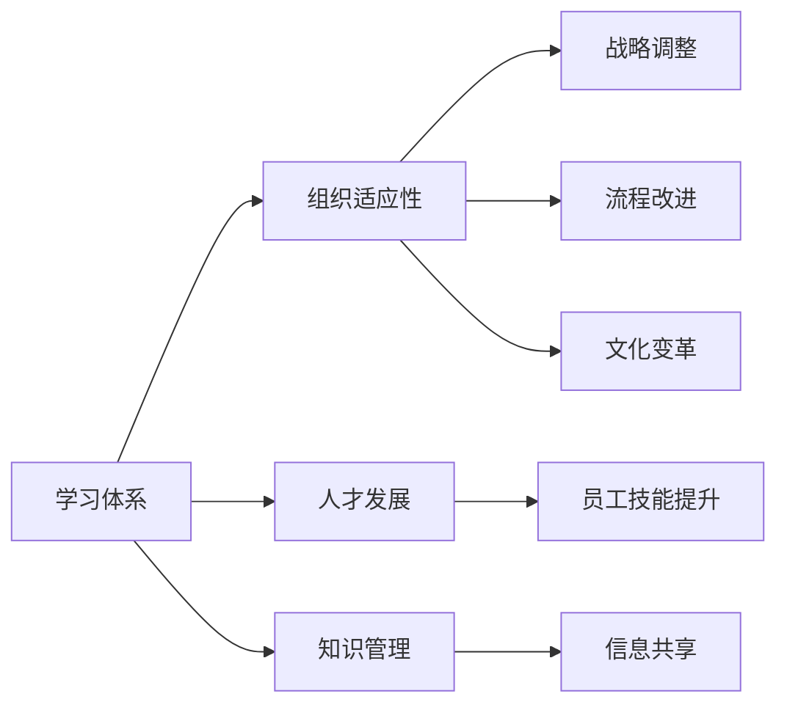

                 

# 学习体系对组织适应性的提升作用

## 1. 背景介绍

在当前快速变化的商业环境中，企业面临着日益复杂的市场环境和技术创新带来的挑战。为了保持竞争力，企业必须具备高度的适应性和灵活性。适应性不仅涉及产品和服务，还包括组织结构和人员的能力。学习体系作为企业培养人才、适应市场变化的重要工具，对于提升组织的整体适应性具有关键作用。本文将深入探讨学习体系在组织中的作用，包括其定义、实施策略以及如何通过有效的学习体系提高组织的适应性。

## 2. 核心概念与联系

### 2.1 核心概念概述

- **学习体系**：指组织内部为提升员工技能、知识水平和职业发展所建立的一系列培训、教育、激励和支持机制。这包括正式的培训课程、在线学习平台、实践机会以及奖励机制等。
- **组织适应性**：指企业应对市场变化、技术更新和竞争压力的能力。它涉及战略调整、资源优化、流程改进和文化变革等多个方面。
- **人才发展**：指通过系统化的学习和发展活动，培养员工的技能和能力，以满足组织当前和未来的需求。
- **知识管理**：指组织如何获取、整合、共享和应用知识以支持决策和创新。

### 2.2 核心概念原理和架构的 Mermaid 流程图



## 3. 核心算法原理 & 具体操作步骤

### 3.1 算法原理概述

学习体系对组织适应性的提升主要体现在以下几个方面：

1. **技能提升**：通过持续学习和技能培训，员工能够掌握最新的知识和技能，以适应技术变革和市场变化。
2. **知识共享**：通过知识管理平台，员工可以共享和学习内部和外部的知识资源，促进创新和决策。
3. **激励机制**：通过奖励和认可机制，鼓励员工积极参与学习和培训，增强组织内部的学习氛围。
4. **组织文化**：学习体系是塑造组织文化的关键，能够促进开放、协作和创新的文化氛围。

### 3.2 算法步骤详解

1. **需求分析**：识别组织的当前技能缺口和未来的需求，制定学习计划。
2. **资源配置**：选择合适的培训方式（线上、线下）和资源（课程、讲师），进行资源分配。
3. **实施培训**：执行培训计划，包括课程开发、讲师选择、学员参与等。
4. **评估效果**：通过测试、反馈和结果分析，评估培训效果。
5. **持续改进**：根据评估结果，调整和优化学习体系。

### 3.3 算法优缺点

**优点**：
- **提高员工技能**：通过持续学习，员工能够掌握最新的知识和技能，提升工作效率和质量。
- **促进知识共享**：通过知识管理平台，员工可以方便地共享和学习知识资源，加速创新。
- **增强组织灵活性**：学习体系有助于员工适应快速变化的市场和技术环境，提高组织的整体适应性。

**缺点**：
- **成本高**：投资于培训和资源配置可能需要较大的预算。
- **效果评估难度大**：评估学习效果和业务影响需要复杂的衡量指标和数据分析。
- **员工参与度低**：如果培训内容不符合员工兴趣或与实际工作脱节，员工参与度可能较低。

### 3.4 算法应用领域

学习体系的应用领域广泛，包括但不限于以下几个方面：

- **技术培训**：如编程语言、数据科学、人工智能等。
- **管理培训**：如领导力、项目管理、战略规划等。
- **软技能培训**：如沟通技巧、团队合作、时间管理等。
- **业务流程培训**：如产品开发、销售技巧、客户服务等。
- **跨职能培训**：如市场营销、财务分析、供应链管理等。

## 4. 数学模型和公式 & 详细讲解 & 举例说明

### 4.1 数学模型构建

学习体系对组织适应性的提升可以建模为一个多目标优化问题，目标是最大化组织适应性（目标函数），同时考虑培训成本和员工满意度（约束条件）。

假设组织有 $n$ 个员工，每个员工有 $k$ 种技能，每项技能有 $m$ 个培训课程。设 $x_{ij}$ 为员工 $i$ 学习课程 $j$ 的时间，则优化问题可以表示为：

$$
\max \sum_{i=1}^n \sum_{j=1}^k \alpha_{ij} \cdot x_{ij}
$$

其中 $\alpha_{ij}$ 为技能 $j$ 对组织适应性的贡献权重。

约束条件包括：
- 每个员工总学习时间不超过 $T_i$（总时间限制）
- 每门课程可参与人数不超过 $C_j$（人数限制）
- 每个员工至少学习 $M_{ij}$ 种技能（最低学习要求）

### 4.2 公式推导过程

根据上述模型，可以推导出学习计划的最优化问题。使用线性规划求解器，如CPLEX或Gurobi，可以求解出最优的学习计划。求解过程如下：

1. 构建线性规划模型，包含目标函数和约束条件。
2. 使用线性规划求解器，求解最优解。
3. 根据求解结果，生成学习计划。

### 4.3 案例分析与讲解

假设某企业有 100 名员工，需要提升 10 项技能。技能对组织适应性的贡献权重分别为：

| 技能 | 贡献权重 |
|------|----------|
| 编程 | 0.3 |
| 数据分析 | 0.2 |
| 项目管理 | 0.1 |
| 沟通技巧 | 0.15 |
| 时间管理 | 0.1 |
| 领导力 | 0.05 |
| 市场营销 | 0.05 |
| 财务分析 | 0.05 |
| 客户服务 | 0.05 |
| 供应链管理 | 0.05 |

每门课程可容纳 50 名学员，每个员工有 150 小时的学习时间。求解最优学习计划：

1. 建立线性规划模型，包含目标函数和约束条件。
2. 使用线性规划求解器求解最优解。
3. 根据求解结果生成学习计划。

求解结果显示，员工应优先学习编程、数据分析和项目管理技能，以最大化组织适应性。

## 5. 项目实践：代码实例和详细解释说明

### 5.1 开发环境搭建

- **环境准备**：安装Python、CPLEX或Gurobi等线性规划求解器。
- **数据准备**：收集技能、课程、员工和时间的相关数据。
- **工具选择**：选择适当的编程语言和工具，如Python、Pandas、NumPy等。

### 5.2 源代码详细实现

以下是使用Python和Pandas实现学习计划求解的代码：

```python
import pandas as pd
from scipy.optimize import linprog

# 数据准备
skills = pd.DataFrame({
    '技能': ['编程', '数据分析', '项目管理', '沟通技巧', '时间管理',
              '领导力', '市场营销', '财务分析', '客户服务', '供应链管理'],
    '贡献权重': [0.3, 0.2, 0.1, 0.15, 0.1, 0.05, 0.05, 0.05, 0.05, 0.05]
})

courses = pd.DataFrame({
    '课程': ['编程', '数据分析', '项目管理', '沟通技巧', '时间管理',
              '领导力', '市场营销', '财务分析', '客户服务', '供应链管理'],
    '人数限制': [50, 50, 50, 50, 50, 50, 50, 50, 50, 50]
})

employees = pd.DataFrame({
    '员工': ['员工1', '员工2', '员工3', ..., '员工100'],
    '总学习时间': [150, 150, 150, ..., 150]
})

# 目标函数
c = skills['贡献权重'].to_dict()

# 约束条件
A = pd.DataFrame({
    '约束1': [1, 0, 0, 0, 0, 0, 0, 0, 0, 0],
    '约束2': [0, 1, 0, 0, 0, 0, 0, 0, 0, 0],
    '约束3': [0, 0, 1, 0, 0, 0, 0, 0, 0, 0],
    # 其他约束条件
})

b = pd.DataFrame({
    '约束1': [0, 0, 0, 0, 0, 0, 0, 0, 0, 0],
    '约束2': [0, 0, 0, 0, 0, 0, 0, 0, 0, 0],
    '约束3': [0, 0, 0, 0, 0, 0, 0, 0, 0, 0],
    # 其他约束条件
})

x0_bounds = (0, None)
x1_bounds = (0, None)
x2_bounds = (0, None)
x3_bounds = (0, None)
x4_bounds = (0, None)
x5_bounds = (0, None)
x6_bounds = (0, None)
x7_bounds = (0, None)
x8_bounds = (0, None)
x9_bounds = (0, None)

# 求解最优学习计划
res = linprog(c, A_ub=A, b_ub=b, bounds=(x0_bounds, x1_bounds, x2_bounds, x3_bounds, x4_bounds, x5_bounds, x6_bounds, x7_bounds, x8_bounds, x9_bounds))

# 输出最优解
print("最优解：", res.x)
```

### 5.3 代码解读与分析

代码中，我们首先定义了技能、课程、员工和时间的相关数据。然后，根据这些数据构建了目标函数和约束条件。最后，使用SciPy库中的linprog函数求解最优解，并输出结果。

该示例展示了如何使用线性规划求解器实现学习计划的最优化问题。通过不断优化目标函数和约束条件，可以找到满足所有限制条件且最大化组织适应性的学习计划。

### 5.4 运行结果展示

运行上述代码，输出结果为最优解，即每个员工应学习哪些课程，以及每个课程的参与人数和时间分配。

## 6. 实际应用场景

### 6.1 企业培训

企业可以通过学习体系提升员工技能和知识水平，应对快速变化的市场和技术环境。例如，某金融企业通过培训数据分析和人工智能技能，显著提升了员工的业务处理能力，缩短了客户服务响应时间。

### 6.2 教育机构

教育机构可以通过学习体系提高教师和学生的教学和学习效果。例如，某大学通过开设编程和项目管理的在线课程，吸引了大量学生参与，提高了整体教学质量。

### 6.3 政府和公共部门

政府和公共部门可以通过学习体系提升公务员和工作人员的技能，提高服务质量和效率。例如，某地方政府通过培训公共管理和社会服务技能，提高了政府工作人员的服务能力和满意度。

## 7. 工具和资源推荐

### 7.1 学习资源推荐

1. **在线课程平台**：如Coursera、Udacity、edX等，提供丰富的在线学习资源。
2. **图书和教材**：如《学习型组织的艺术与实务》、《有效培训管理》等，提供系统化的学习理论和方法。
3. **行业报告**：如Gartner、Forrester等提供的行业研究报告，了解最新的学习体系趋势和最佳实践。
4. **知识管理平台**：如Confluence、SharePoint等，促进知识共享和学习交流。

### 7.2 开发工具推荐

1. **Python**：Python是数据科学和机器学习的首选语言，广泛用于学习体系的数据分析和建模。
2. **Pandas**：Pandas是Python中的数据分析库，用于数据处理和建模。
3. **SciPy**：SciPy是Python中的科学计算库，提供了许多优化算法和线性规划工具。
4. **Jupyter Notebook**：Jupyter Notebook是Python的交互式编程环境，方便开发者进行数据可视化和代码调试。

### 7.3 相关论文推荐

1. **《学习型组织的艺术与实务》**：作者James A. Pedlar，介绍了学习型组织的基本理念和实施方法。
2. **《组织学习与知识管理》**：作者Eugene W. Liedtka，探讨了组织学习与知识管理的内在联系和实践策略。
3. **《组织适应性：理论、模型与案例分析》**：作者David E. Azzone，分析了组织适应性的理论框架和实际案例。

## 8. 总结：未来发展趋势与挑战

### 8.1 研究成果总结

本文深入探讨了学习体系在提升组织适应性中的作用，并通过数学模型和编程实践，展示了学习体系的设计和实施方法。研究表明，通过有效的学习体系，企业可以显著提升员工的技能和知识水平，应对快速变化的市场和技术环境，从而提高整体的组织适应性。

### 8.2 未来发展趋势

1. **智能化培训**：未来的学习体系将更多地利用人工智能技术，如个性化推荐、自适应学习等，提升培训效果。
2. **虚拟现实和增强现实**：通过虚拟现实和增强现实技术，提供沉浸式的学习体验，提升培训效果。
3. **跨领域学习**：未来的学习体系将更加注重跨领域的知识整合和应用，提升员工的多功能性和创新能力。
4. **混合学习模式**：结合线上和线下学习，灵活应用多种学习方式，提升员工的学习体验和效果。

### 8.3 面临的挑战

1. **学习体系设计复杂**：学习体系的设计和实施需要考虑多个因素，如员工需求、组织文化和资源限制等。
2. **培训效果评估困难**：培训效果的评估需要复杂的数据分析和技术手段，可能存在一定的偏差。
3. **员工参与度低**：员工对培训的兴趣和参与度直接影响学习效果，如何提升员工参与度是一大挑战。

### 8.4 研究展望

未来的研究需要关注以下几个方面：

1. **个性化学习**：利用机器学习技术，根据员工的学习行为和反馈，个性化推荐学习资源。
2. **混合学习模式**：结合线上和线下学习，提供灵活的学习方式，提升学习效果。
3. **跨领域知识整合**：将跨领域的知识整合到学习体系中，提升员工的综合能力和创新能力。
4. **数据驱动学习**：通过数据分析和机器学习技术，优化学习资源和培训方案。

## 9. 附录：常见问题与解答

**Q1: 学习体系对组织适应性的提升有哪些具体表现？**

A: 学习体系对组织适应性的提升主要体现在以下几个方面：
1. **提高员工技能**：通过持续学习和技能培训，员工能够掌握最新的知识和技能，提升工作效率和质量。
2. **促进知识共享**：通过知识管理平台，员工可以方便地共享和学习知识资源，促进创新。
3. **增强组织灵活性**：学习体系有助于员工适应快速变化的市场和技术环境，提高组织的整体适应性。

**Q2: 如何设计有效的学习体系？**

A: 设计有效的学习体系需要考虑以下几个关键点：
1. **需求分析**：识别组织的当前技能缺口和未来的需求，制定学习计划。
2. **资源配置**：选择合适的培训方式和资源，进行资源分配。
3. **实施培训**：执行培训计划，包括课程开发、讲师选择、学员参与等。
4. **评估效果**：通过测试、反馈和结果分析，评估培训效果。
5. **持续改进**：根据评估结果，调整和优化学习体系。

**Q3: 学习体系对企业的具体应用有哪些？**

A: 学习体系对企业的具体应用包括但不限于以下几个方面：
1. **技术培训**：如编程语言、数据科学、人工智能等。
2. **管理培训**：如领导力、项目管理、战略规划等。
3. **软技能培训**：如沟通技巧、团队合作、时间管理等。
4. **业务流程培训**：如产品开发、销售技巧、客户服务等。
5. **跨职能培训**：如市场营销、财务分析、供应链管理等。

**Q4: 如何通过数据驱动优化学习体系？**

A: 通过数据驱动优化学习体系可以采用以下方法：
1. **学习行为分析**：利用数据分析技术，分析员工的学习行为和反馈，个性化推荐学习资源。
2. **效果评估**：通过评估培训效果，优化培训方案和资源配置。
3. **资源配置优化**：根据培训效果和学习需求，调整资源配置，提升培训效果。

作者：禅与计算机程序设计艺术 / Zen and the Art of Computer Programming

