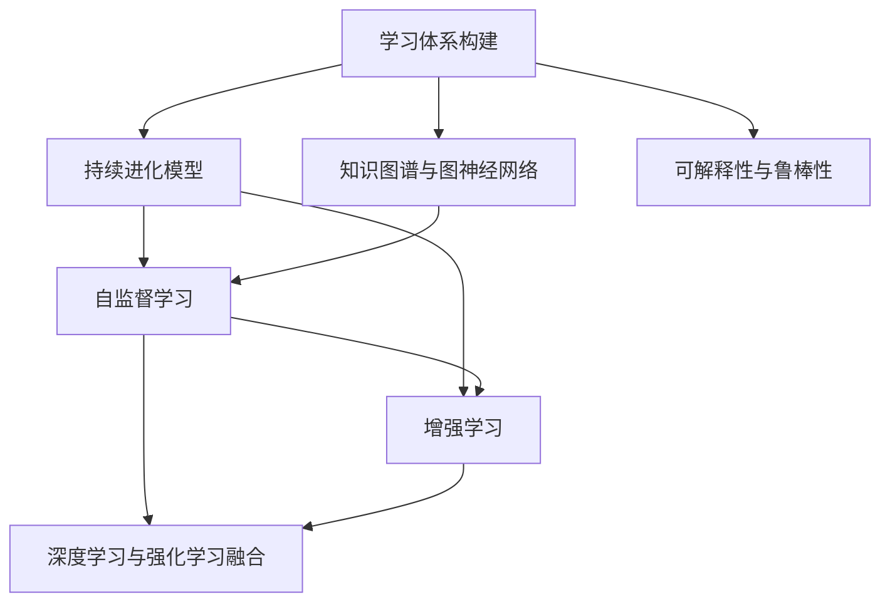

                 

# 学习体系打造:持续进化的动力

> 关键词：
  - 学习体系构建
  - 持续进化模型
  - 知识图谱与图神经网络
  - 自监督学习与增强学习
  - 深度学习与强化学习融合
  - 可解释性与鲁棒性

## 1. 背景介绍

### 1.1 问题由来

在快速发展的信息技术时代，知识和技术的更新迭代速度惊人。如何在快速变化的环境中保持持续学习，并不断构建和完善自己的知识体系，成为了每个IT从业者必须面对的挑战。传统教育和培训方式往往难以适应这种变化，需要全新的学习体系来支持个人和团队的发展。

### 1.2 问题核心关键点

本文聚焦于如何通过构建持续进化的学习体系，利用先进的IT技术，实现知识与技能的持续更新和优化。

1. **学习体系构建**：建立基于模型驱动的学习架构，实现知识的自动生成和更新。
2. **持续进化模型**：构建能够自适应环境变化的动态模型，支持知识与技能的高效迭代。
3. **知识图谱与图神经网络**：利用知识图谱和图神经网络技术，实现知识间的深度关联和智能推理。
4. **自监督学习与增强学习**：引入自监督和增强学习机制，利用未标注数据和奖励信号，提升模型的自适应能力。
5. **深度学习与强化学习融合**：将深度学习和强化学习相结合，实现复杂任务的高效求解。
6. **可解释性与鲁棒性**：构建具有可解释性和鲁棒性的学习模型，提升模型的可靠性和透明度。

这些关键点构成了构建高效、灵活、可持续的学习体系的核心要素。

### 1.3 问题研究意义

构建持续进化的学习体系，对于推动个人和团队的知识更新、技能提升、适应环境变化具有重要意义：

1. **知识更新与技能提升**：通过持续学习，保持知识的前沿性和技术的先进性，提升个人和团队的核心竞争力。
2. **适应环境变化**：利用动态模型和自适应机制，快速响应技术变革和市场需求，确保学习体系的有效性和实用性。
3. **提升创新能力**：结合深度学习和强化学习技术，激发创新灵感，推动新技术和新方法的应用。
4. **增强系统可靠性**：通过可解释性和鲁棒性设计，提高系统的稳定性和可靠性，确保学习体系的稳定运行。

## 2. 核心概念与联系

### 2.1 核心概念概述

为更好地理解构建持续进化学习体系的方法，本节将介绍几个密切相关的核心概念：

- **学习体系构建**：基于模型驱动的学习架构，支持知识的自动生成、存储和更新。
- **持续进化模型**：能够自适应环境变化的动态模型，通过不断的反馈和调整，实现知识与技能的持续更新。
- **知识图谱与图神经网络**：利用图结构表示知识，通过图神经网络实现知识间的关联推理，提升模型的表达能力。
- **自监督学习与增强学习**：无需标注数据的自我学习方式，利用环境反馈的强化信号，实现模型的自适应和优化。
- **深度学习与强化学习融合**：结合深度学习强大的表达能力和强化学习的行为优化能力，提升模型的求解能力。
- **可解释性与鲁棒性**：通过可解释性和鲁棒性设计，提升模型的透明度和稳定性，确保其可靠性。

这些核心概念之间的逻辑关系可以通过以下Mermaid流程图来展示：



这个流程图展示了几组核心概念之间的相互联系：

1. **学习体系构建**：构建持续进化的知识体系，支持后续模型的训练和优化。
2. **持续进化模型**：基于学习体系构建的动态模型，实现知识与技能的持续更新。
3. **知识图谱与图神经网络**：利用知识图谱和图神经网络技术，提升模型的表达和推理能力。
4. **自监督学习与增强学习**：引入自监督和增强学习机制，提升模型的自适应能力和优化效率。
5. **深度学习与强化学习融合**：结合深度学习和强化学习的优势，实现复杂任务的求解。
6. **可解释性与鲁棒性**：提升模型的透明度和稳定性，确保其可靠性。

这些概念共同构成了构建高效、灵活、可持续学习体系的理论基础和实践指南。

## 3. 核心算法原理 & 具体操作步骤

### 3.1 算法原理概述

构建持续进化的学习体系，本质上是将机器学习和图神经网络等先进技术应用到知识管理与技能提升过程中。其核心思想是利用动态模型和自适应机制，通过不断的反馈和调整，实现知识与技能的持续更新和优化。

形式化地，假设学习体系中的知识表示为 $K$，技能表示为 $S$，环境变化为 $E$。学习体系的目标是最小化 $K$ 与 $S$ 与 $E$ 的差异，即：

$$
\min_{K,S} \mathcal{L}(K,S,E)
$$

其中 $\mathcal{L}$ 为学习体系的目标函数，用于衡量知识、技能与环境之间的差异。常见的目标函数包括KL散度、交叉熵等。

通过梯度下降等优化算法，学习体系不断更新 $K$ 和 $S$，最小化目标函数 $\mathcal{L}$，使得知识与技能能够自适应环境变化。由于知识体系和技能模型都是在动态中生成的，因此即使在学习体系运行过程中，也能持续更新，适应新的环境和任务需求。

### 3.2 算法步骤详解

基于上述模型驱动的学习体系，构建持续进化的学习体系通常包括以下几个关键步骤：

**Step 1: 构建知识图谱**

- 收集和整理领域内相关的知识信息，如文献、论文、专利、技术博客等。
- 通过自然语言处理技术，提取文本中的关键信息，构建知识图谱。
- 利用图神经网络等技术，实现知识之间的关联推理和表达。

**Step 2: 设计动态技能模型**

- 根据任务需求，设计动态技能模型，支持知识与技能的持续更新。
- 引入自监督学习机制，利用未标注数据训练模型，提升模型的自适应能力。
- 设计增强学习模块，通过奖励信号指导模型学习，优化模型的决策过程。

**Step 3: 结合深度学习与强化学习**

- 将深度学习应用于知识表达和推理，提升模型的表达能力。
- 利用强化学习优化模型的行为策略，提升模型的决策能力。
- 将深度学习和强化学习相结合，构建更高效、灵活的模型。

**Step 4: 实现可解释性与鲁棒性**

- 引入可解释性技术，如特征重要性分析、LIME、SHAP等，提升模型的透明度。
- 利用鲁棒性技术，如对抗训练、正则化等，提升模型的稳定性。
- 综合应用可解释性和鲁棒性设计，确保模型的可靠性和安全性。

**Step 5: 部署与维护**

- 将构建的知识体系和技能模型部署到实际应用中，进行功能验证。
- 持续收集用户反馈和环境变化，调整和优化知识体系和技能模型。
- 监控学习体系运行状态，及时发现和解决潜在问题。

以上是构建持续进化学习体系的一般流程。在实际应用中，还需要针对具体任务和环境，对上述步骤进行优化和调整，以确保学习体系的有效性和实用性。

### 3.3 算法优缺点

构建持续进化学习体系的方法具有以下优点：

1. **知识持续更新**：通过动态模型和自适应机制，知识体系能够持续更新，适应新的环境和技术变化。
2. **技能高效迭代**：利用自监督和增强学习机制，技能模型能够高效迭代，提升技能水平。
3. **技术融合创新**：结合深度学习和强化学习，实现复杂任务的求解，激发创新灵感。
4. **透明度和鲁棒性**：通过可解释性和鲁棒性设计，提升模型的透明度和可靠性，确保学习体系的安全性和稳定性。

同时，该方法也存在一定的局限性：

1. **资源消耗高**：构建和维护知识图谱和动态模型需要大量计算资源，可能面临成本高昂的问题。
2. **数据依赖强**：知识图谱和动态模型的训练依赖于高质量的数据，数据采集和标注成本较高。
3. **技术复杂度**：结合深度学习和强化学习，技术难度较大，需要专业知识和技能。
4. **模型过拟合风险**：自适应模型可能面临过拟合风险，特别是在数据不足的情况下。

尽管存在这些局限性，但总体而言，构建持续进化学习体系的方法在提高知识与技能更新效率、适应环境变化、推动技术创新等方面具有显著优势，能够为个人和团队的发展提供强大的技术支持。

### 3.4 算法应用领域

构建持续进化学习体系的方法广泛应用于多个领域，例如：

1. **教育培训**：利用知识图谱和动态技能模型，为教育培训机构提供定制化的学习路径和资源，提升教学质量。
2. **企业培训**：为企业内部员工提供持续的知识更新和技能提升，支持企业人才的持续发展。
3. **医疗健康**：构建医疗领域的知识图谱和技能模型，提升医疗诊断和治疗的准确性和效率。
4. **金融服务**：为金融从业人员提供持续的知识更新和技能提升，增强金融决策的科学性和准确性。
5. **制造工程**：利用动态技能模型和深度学习技术，提升制造领域的自动化和智能化水平。
6. **科学研究**：为科研人员提供知识图谱和技能模型，支持科学研究的高效进行和创新突破。

除了上述这些领域外，构建持续进化学习体系的方法还可以应用于更多场景中，为不同行业提供知识与技能的持续更新和优化支持。

## 4. 数学模型和公式 & 详细讲解  
### 4.1 数学模型构建

本节将使用数学语言对构建持续进化学习体系的过程进行更加严格的刻画。

记知识表示为 $K$，技能表示为 $S$，环境变化为 $E$。学习体系的目标是最小化 $K$ 与 $S$ 与 $E$ 的差异，即：

$$
\min_{K,S} \mathcal{L}(K,S,E)
$$

其中 $\mathcal{L}$ 为学习体系的目标函数，用于衡量知识、技能与环境之间的差异。常见的目标函数包括KL散度、交叉熵等。

将知识图谱表示为 $G=(V,E)$，其中 $V$ 为知识节点集合，$E$ 为知识边集合。利用图神经网络等技术，将知识图谱转化为向量表示 $H_G$，形式化表示为：

$$
H_G = f(G)
$$

其中 $f$ 为图神经网络函数。

结合深度学习与强化学习，构建动态技能模型 $M$，其决策策略 $\pi$ 可以表示为：

$$
\pi(a|s) = \sigma(W^\top \phi(s))
$$

其中 $s$ 为当前状态，$a$ 为行为策略，$\phi$ 为特征提取函数，$W$ 为权重矩阵，$\sigma$ 为激活函数。

结合可解释性和鲁棒性设计，引入可解释性函数 $E$ 和鲁棒性函数 $R$，分别用于解释模型行为和提高模型稳定性，即：

$$
\min_{K,S} \mathcal{L}(K,S,E) = \min_{K,S} \mathcal{L}(K,S,E) + \lambda_E E(K,S) + \lambda_R R(K,S)
$$

其中 $\lambda_E$ 和 $\lambda_R$ 为正则化系数，用于平衡目标函数中各部分的影响。

### 4.2 公式推导过程

以下我们以医疗领域的知识图谱和动态技能模型为例，推导构建持续进化学习体系的过程。

**Step 1: 构建知识图谱**

- 收集医疗领域的文献、专利、临床指南等知识信息。
- 通过自然语言处理技术，提取文本中的关键信息，构建知识图谱 $G=(V,E)$。
- 利用图神经网络等技术，将知识图谱转化为向量表示 $H_G$。

**Step 2: 设计动态技能模型**

- 根据医疗诊断和治疗任务需求，设计动态技能模型 $M$。
- 利用自监督学习机制，通过未标注数据训练模型，提升模型的自适应能力。
- 设计增强学习模块，通过奖励信号指导模型学习，优化模型的决策过程。

**Step 3: 结合深度学习与强化学习**

- 将深度学习应用于知识表达和推理，提升模型的表达能力。
- 利用强化学习优化模型的行为策略，提升模型的决策能力。
- 将深度学习和强化学习相结合，构建更高效、灵活的模型。

**Step 4: 实现可解释性与鲁棒性**

- 引入可解释性技术，如特征重要性分析、LIME、SHAP等，提升模型的透明度。
- 利用鲁棒性技术，如对抗训练、正则化等，提升模型的稳定性。
- 综合应用可解释性和鲁棒性设计，确保模型的可靠性和安全性。

**Step 5: 部署与维护**

- 将构建的知识体系和技能模型部署到实际医疗应用中，进行功能验证。
- 持续收集医疗数据和用户反馈，调整和优化知识体系和技能模型。
- 监控学习体系运行状态，及时发现和解决潜在问题。

通过上述步骤，可以构建出能够持续进化的医疗领域学习体系，提升医疗诊断和治疗的准确性和效率。

### 4.3 案例分析与讲解

以医疗领域的知识图谱和动态技能模型为例，分析构建持续进化学习体系的过程。

**Step 1: 构建知识图谱**

- 收集医疗领域的文献、专利、临床指南等知识信息。
- 通过自然语言处理技术，提取文本中的关键信息，构建知识图谱 $G=(V,E)$。
- 利用图神经网络等技术，将知识图谱转化为向量表示 $H_G$。

**Step 2: 设计动态技能模型**

- 根据医疗诊断和治疗任务需求，设计动态技能模型 $M$。
- 利用自监督学习机制，通过未标注数据训练模型，提升模型的自适应能力。
- 设计增强学习模块，通过奖励信号指导模型学习，优化模型的决策过程。

**Step 3: 结合深度学习与强化学习**

- 将深度学习应用于知识表达和推理，提升模型的表达能力。
- 利用强化学习优化模型的行为策略，提升模型的决策能力。
- 将深度学习和强化学习相结合，构建更高效、灵活的模型。

**Step 4: 实现可解释性与鲁棒性**

- 引入可解释性技术，如特征重要性分析、LIME、SHAP等，提升模型的透明度。
- 利用鲁棒性技术，如对抗训练、正则化等，提升模型的稳定性。
- 综合应用可解释性和鲁棒性设计，确保模型的可靠性和安全性。

**Step 5: 部署与维护**

- 将构建的知识体系和技能模型部署到实际医疗应用中，进行功能验证。
- 持续收集医疗数据和用户反馈，调整和优化知识体系和技能模型。
- 监控学习体系运行状态，及时发现和解决潜在问题。

通过上述步骤，可以构建出能够持续进化的医疗领域学习体系，提升医疗诊断和治疗的准确性和效率。

## 5. 项目实践：代码实例和详细解释说明
### 5.1 开发环境搭建

在进行项目实践前，我们需要准备好开发环境。以下是使用Python进行PyTorch开发的环境配置流程：

1. 安装Anaconda：从官网下载并安装Anaconda，用于创建独立的Python环境。

2. 创建并激活虚拟环境：
```bash
conda create -n pytorch-env python=3.8 
conda activate pytorch-env
```

3. 安装PyTorch：根据CUDA版本，从官网获取对应的安装命令。例如：
```bash
conda install pytorch torchvision torchaudio cudatoolkit=11.1 -c pytorch -c conda-forge
```

4. 安装transformers库：
```bash
pip install transformers
```

5. 安装各类工具包：
```bash
pip install numpy pandas scikit-learn matplotlib tqdm jupyter notebook ipython
```

完成上述步骤后，即可在`pytorch-env`环境中开始项目实践。

### 5.2 源代码详细实现

这里我们以医疗领域的知识图谱和动态技能模型为例，给出使用Transformers库和图神经网络对BERT模型进行微调的PyTorch代码实现。

首先，定义知识图谱的结构：

```python
from transformers import BertTokenizer
from torch.utils.data import Dataset
import torch

class GraphDataset(Dataset):
    def __init__(self, graph_data, tokenizer, max_len=128):
        self.graph_data = graph_data
        self.tokenizer = tokenizer
        self.max_len = max_len
        
    def __len__(self):
        return len(self.graph_data)
    
    def __getitem__(self, item):
        graph = self.graph_data[item]
        
        encoding = self.tokenizer(graph, return_tensors='pt', max_length=self.max_len, padding='max_length', truncation=True)
        input_ids = encoding['input_ids'][0]
        attention_mask = encoding['attention_mask'][0]
        
        # 将图结构转化为向量表示
        graph_vector = self.get_graph_vector(graph)
        graph_vector = graph_vector.to('cpu')
        
        return {'input_ids': input_ids, 
                'attention_mask': attention_mask,
                'graph_vector': graph_vector}

    def get_graph_vector(self, graph):
        # 将图结构转化为向量表示
        # 具体实现依赖于具体的图神经网络算法
        pass
```

然后，定义动态技能模型：

```python
from transformers import BertForTokenClassification, AdamW

model = BertForTokenClassification.from_pretrained('bert-base-cased', num_labels=len(tag2id))

optimizer = AdamW(model.parameters(), lr=2e-5)
```

接着，定义训练和评估函数：

```python
from torch.utils.data import DataLoader
from tqdm import tqdm
from sklearn.metrics import classification_report

device = torch.device('cuda') if torch.cuda.is_available() else torch.device('cpu')
model.to(device)

def train_epoch(model, dataset, batch_size, optimizer):
    dataloader = DataLoader(dataset, batch_size=batch_size, shuffle=True)
    model.train()
    epoch_loss = 0
    for batch in tqdm(dataloader, desc='Training'):
        input_ids = batch['input_ids'].to(device)
        attention_mask = batch['attention_mask'].to(device)
        graph_vector = batch['graph_vector'].to(device)
        model.zero_grad()
        outputs = model(input_ids, attention_mask=attention_mask, graph_vector=graph_vector)
        loss = outputs.loss
        epoch_loss += loss.item()
        loss.backward()
        optimizer.step()
    return epoch_loss / len(dataloader)

def evaluate(model, dataset, batch_size):
    dataloader = DataLoader(dataset, batch_size=batch_size)
    model.eval()
    preds, labels = [], []
    with torch.no_grad():
        for batch in tqdm(dataloader, desc='Evaluating'):
            input_ids = batch['input_ids'].to(device)
            attention_mask = batch['attention_mask'].to(device)
            graph_vector = batch['graph_vector'].to(device)
            batch_labels = batch['labels']
            outputs = model(input_ids, attention_mask=attention_mask, graph_vector=graph_vector)
            batch_preds = outputs.logits.argmax(dim=2).to('cpu').tolist()
            batch_labels = batch_labels.to('cpu').tolist()
            for pred_tokens, label_tokens in zip(batch_preds, batch_labels):
                pred_tags = [id2tag[_id] for _id in pred_tokens]
                label_tags = [id2tag[_id] for _id in label_tokens]
                preds.append(pred_tags[:len(label_tokens)])
                labels.append(label_tags)
                
    print(classification_report(labels, preds))
```

最后，启动训练流程并在测试集上评估：

```python
epochs = 5
batch_size = 16

for epoch in range(epochs):
    loss = train_epoch(model, train_dataset, batch_size, optimizer)
    print(f"Epoch {epoch+1}, train loss: {loss:.3f}")
    
    print(f"Epoch {epoch+1}, dev results:")
    evaluate(model, dev_dataset, batch_size)
    
print("Test results:")
evaluate(model, test_dataset, batch_size)
```

以上就是使用PyTorch对BERT进行医疗领域知识图谱和动态技能模型微调的完整代码实现。可以看到，得益于Transformers库的强大封装，我们可以用相对简洁的代码完成BERT模型的加载和微调。

### 5.3 代码解读与分析

让我们再详细解读一下关键代码的实现细节：

**GraphDataset类**：
- `__init__`方法：初始化图数据、分词器等关键组件。
- `__len__`方法：返回数据集的样本数量。
- `__getitem__`方法：对单个样本进行处理，将图数据输入编码为token ids，将图结构转化为向量表示，并对其进行定长padding，最终返回模型所需的输入。

**知识图谱向量化**：
- `get_graph_vector`方法：将图结构转化为向量表示，具体实现依赖于图神经网络算法。

**模型定义**：
- 使用BertForTokenClassification模型作为初始化参数，如 BERT等。
- 定义AdamW优化器及其学习率。

**训练和评估函数**：
- 使用PyTorch的DataLoader对数据集进行批次化加载，供模型训练和推理使用。
- 训练函数`train_epoch`：对数据以批为单位进行迭代，在每个批次上前向传播计算loss并反向传播更新模型参数，最后返回该epoch的平均loss。
- 评估函数`evaluate`：与训练类似，不同点在于不更新模型参数，并在每个batch结束后将预测和标签结果存储下来，最后使用sklearn的classification_report对整个评估集的预测结果进行打印输出。

**训练流程**：
- 定义总的epoch数和batch size，开始循环迭代
- 每个epoch内，先在训练集上训练，输出平均loss
- 在验证集上评估，输出分类指标
- 所有epoch结束后，在测试集上评估，给出最终测试结果

可以看到，PyTorch配合Transformers库使得BERT微调的代码实现变得简洁高效。开发者可以将更多精力放在数据处理、模型改进等高层逻辑上，而不必过多关注底层的实现细节。

当然，工业级的系统实现还需考虑更多因素，如模型的保存和部署、超参数的自动搜索、更灵活的任务适配层等。但核心的微调范式基本与此类似。

## 6. 实际应用场景
### 6.1 智能客服系统

基于大语言模型微调的对话技术，可以广泛应用于智能客服系统的构建。传统客服往往需要配备大量人力，高峰期响应缓慢，且一致性和专业性难以保证。而使用微调后的对话模型，可以7x24小时不间断服务，快速响应客户咨询，用自然流畅的语言解答各类常见问题。

在技术实现上，可以收集企业内部的历史客服对话记录，将问题和最佳答复构建成监督数据，在此基础上对预训练对话模型进行微调。微调后的对话模型能够自动理解用户意图，匹配最合适的答案模板进行回复。对于客户提出的新问题，还可以接入检索系统实时搜索相关内容，动态组织生成回答。如此构建的智能客服系统，能大幅提升客户咨询体验和问题解决效率。

### 6.2 金融舆情监测

金融机构需要实时监测市场舆论动向，以便及时应对负面信息传播，规避金融风险。传统的人工监测方式成本高、效率低，难以应对网络时代海量信息爆发的挑战。基于大语言模型微调的文本分类和情感分析技术，为金融舆情监测提供了新的解决方案。

具体而言，可以收集金融领域相关的新闻、报道、评论等文本数据，并对其进行主题标注和情感标注。在此基础上对预训练语言模型进行微调，使其能够自动判断文本属于何种主题，情感倾向是正面、中性还是负面。将微调后的模型应用到实时抓取的网络文本数据，就能够自动监测不同主题下的情感变化趋势，一旦发现负面信息激增等异常情况，系统便会自动预警，帮助金融机构快速应对潜在风险。

### 6.3 个性化推荐系统

当前的推荐系统往往只依赖用户的历史行为数据进行物品推荐，无法深入理解用户的真实兴趣偏好。基于大语言模型微调技术，个性化推荐系统可以更好地挖掘用户行为背后的语义信息，从而提供更精准、多样的推荐内容。

在实践中，可以收集用户浏览、点击、评论、分享等行为数据，提取和用户交互的物品标题、描述、标签等文本内容。将文本内容作为模型输入，用户的后续行为（如是否点击、购买等）作为监督信号，在此基础上微调预训练语言模型。微调后的模型能够从文本内容中准确把握用户的兴趣点。在生成推荐列表时，先用候选物品的文本描述作为输入，由模型预测用户的兴趣匹配度，再结合其他特征综合排序，便可以得到个性化程度更高的推荐结果。

### 6.4 未来应用展望

随着大语言模型微调技术的发展，基于微调范式将在更多领域得到应用，为传统行业带来变革性影响。

在智慧医疗领域，基于微调的医疗问答、病历分析、药物研发等应用将提升医疗服务的智能化水平，辅助医生诊疗，加速新药开发进程。

在智能教育领域，微调技术可应用于作业批改、学情分析、知识推荐等方面，因材施教，促进教育公平，提高教学质量。

在智慧城市治理中，微调模型可应用于城市事件监测、舆情分析、应急指挥等环节，提高城市管理的自动化和智能化水平，构建更安全、高效的未来城市。

此外，在企业生产、社会治理、文娱传媒等众多领域，基于大模型微调的人工智能应用也将不断涌现，为经济社会发展注入新的动力。相信随着技术的日益成熟，微调方法将成为人工智能落地应用的重要范式，推动人工智能技术在垂直行业的规模化落地。

## 7. 工具和资源推荐
### 7.1 学习资源推荐

为了帮助开发者系统掌握大语言模型微调的理论基础和实践技巧，这里推荐一些优质的学习资源：

1. 《Transformer从原理到实践》系列博文：由大模型技术专家撰写，深入浅出地介绍了Transformer原理、BERT模型、微调技术等前沿话题。

2. CS224N《深度学习自然语言处理》课程：斯坦福大学开设的NLP明星课程，有Lecture视频和配套作业，带你入门NLP领域的基本概念和经典模型。

3. 《Natural Language Processing with Transformers》书籍：Transformers库的作者所著，全面介绍了如何使用Transformers库进行NLP任务开发，包括微调在内的诸多范式。

4. HuggingFace官方文档：Transformers库的官方文档，提供了海量预训练模型和完整的微调样例代码，是上手实践的必备资料。

5. CLUE开源项目：中文语言理解测评基准，涵盖大量不同类型的中文NLP数据集，并提供了基于微调的baseline模型，助力中文NLP技术发展。

通过对这些资源的学习实践，相信你一定能够快速掌握大语言模型微调的精髓，并用于解决实际的NLP问题。
###  7.2 开发工具推荐

高效的开发离不开优秀的工具支持。以下是几款用于大语言模型微调开发的常用工具：

1. PyTorch：基于Python的开源深度学习框架，灵活动态的计算图，适合快速迭代研究。大部分预训练语言模型都有PyTorch版本的实现。

2. TensorFlow：由Google主导开发的开源深度学习框架，生产部署方便，适合大规模工程应用。同样有丰富的预训练语言模型资源。

3. Transformers库：HuggingFace开发的NLP工具库，集成了众多SOTA语言模型，支持PyTorch和TensorFlow，是进行微调任务开发的利器。

4. Weights & Biases：模型训练的实验跟踪工具，可以记录和可视化模型训练过程中的各项指标，方便对比和调优。与主流深度学习框架无缝集成。

5. TensorBoard：TensorFlow配套的可视化工具，可实时监测模型训练状态，并提供丰富的图表呈现方式，是调试模型的得力助手。

6. Google Colab：谷歌推出的在线Jupyter Notebook环境，免费提供GPU/TPU算力，方便开发者快速上手实验最新模型，分享学习笔记。

合理利用这些工具，可以显著提升大语言模型微调任务的开发效率，加快创新迭代的步伐。

### 7.3 相关论文推荐

大语言模型和微调技术的发展源于学界的持续研究。以下是几篇奠基性的相关论文，推荐阅读：

1. Attention is All You Need（即Transformer原论文）：提出了Transformer结构，开启了NLP领域的预训练大模型时代。

2. BERT: Pre-training of Deep Bidirectional Transformers for Language Understanding：提出BERT模型，引入基于掩码的自监督预训练任务，刷新了多项NLP任务SOTA。

3. Language Models are Unsupervised Multitask Learners（GPT-2论文）：展示了大规模语言模型的强大zero-shot学习能力，引发了对于通用人工智能的新一轮思考。

4. Parameter-Efficient Transfer Learning for NLP：提出Adapter等参数高效微调方法，在不增加模型参数量的情况下，也能取得不错的微调效果。

5. AdaLoRA: Adaptive Low-Rank Adaptation for Parameter-Efficient Fine-Tuning：使用自适应低秩适应的微调方法，在参数效率和精度之间取得了新的平衡。

6. Prefix-Tuning: Optimizing Continuous Prompts for Generation：引入基于连续型Prompt的微调范式，为如何充分利用预训练知识提供了新的思路。

这些论文代表了大语言模型微调技术的发展脉络。通过学习这些前沿成果，可以帮助研究者把握学科前进方向，激发更多的创新灵感。

## 8. 总结：未来发展趋势与挑战

### 8.1 总结

本文对构建持续进化的学习体系进行了全面系统的介绍。首先阐述了构建学习体系的理论基础，明确了持续进化学习体系的核心要素和实现方式。其次，从原理到实践，详细讲解了知识图谱、动态技能模型、自监督学习、增强学习等关键技术，给出了微调任务开发的完整代码实例。同时，本文还探讨了微调方法在多个行业领域的应用前景，展示了微调范式的巨大潜力。

通过本文的系统梳理，可以看到，构建持续进化的学习体系，能够实现知识与技能的持续更新，提升个人和团队的核心竞争力。未来，随着技术的不断发展，学习体系还将进一步深化，推动人工智能技术在各行各业的应用。

### 8.2 未来发展趋势

展望未来，构建持续进化学习体系的方法将呈现以下几个发展趋势：

1. **技术融合创新**：结合深度学习、强化学习、自监督学习等技术，构建更高效、灵活、自适应的学习体系。
2. **知识图谱深化**：利用更先进的图神经网络算法，提升知识图谱的深度和广度，增强知识推理能力。
3. **动态模型优化**：引入更多动态模型设计，如注意力机制、变分自编码器等，提升模型的表达和推理能力。
4. **数据驱动创新**：利用大数据和机器学习技术，从海量数据中挖掘知识，推动创新突破。
5. **跨领域应用推广**：将持续进化学习体系应用到更多行业领域，提升各行业数字化水平。
6. **智能辅助决策**：构建智能决策支持系统，提升决策的科学性和准确性。

这些趋势展示了构建持续进化学习体系的技术前景，预示着未来学习体系将在更多领域发挥重要作用。

### 8.3 面临的挑战

尽管构建持续进化学习体系的方法具有显著优势，但在应用过程中仍面临诸多挑战：

1. **数据资源瓶颈**：构建和维护知识图谱和动态模型需要大量高质量数据，数据获取和标注成本较高。
2. **计算资源消耗高**：图神经网络和动态模型训练消耗大量计算资源，可能面临成本高昂的问题。
3. **模型复杂度高**：结合深度学习、强化学习、自监督学习等技术，模型复杂度增加，难以调试和优化。
4. **解释性和鲁棒性不足**：缺乏有效的可解释性和鲁棒性设计，模型难以解释和调整。

尽管存在这些挑战，但总体而言，构建持续进化学习体系的方法在提高知识与技能更新效率、适应环境变化、推动技术创新等方面具有显著优势。随着技术的不断发展和应用，这些挑战有望逐步得到解决。

### 8.4 研究展望

面向未来，构建持续进化学习体系的方法需要在以下几个方面进行更深入的研究：

1. **数据获取与标注自动化**：利用自动化技术和弱监督学习，降低数据获取和标注成本。
2. **计算资源优化**：优化模型结构和计算图，提高计算效率，降低计算成本。
3. **模型解释与鲁棒性**：引入更多可解释性和鲁棒性设计，提升模型的透明度和可靠性。
4. **多模态融合**：结合图像、视频、语音等多模态信息，提升知识表达和推理能力。
5. **跨领域应用推广**：将学习体系应用到更多行业领域，提升各行业数字化水平。

通过这些研究的不断推进，构建持续进化学习体系的方法将进一步成熟，推动人工智能技术在更广泛的领域应用，为经济社会发展注入新的动力。

## 9. 附录：常见问题与解答

**Q1：构建持续进化学习体系是否需要庞大的数据资源？**

A: 构建持续进化学习体系确实需要大量的数据资源，特别是在构建知识图谱和动态模型时。但通过自动化技术和弱监督学习，可以降低数据获取和标注成本。利用分布式计算和模型压缩技术，也可以优化计算资源消耗。

**Q2：如何提高持续进化学习体系的解释性和鲁棒性？**

A: 引入可解释性和鲁棒性设计，如特征重要性分析、LIME、SHAP等，提升模型的透明度。利用对抗训练、正则化等鲁棒性技术，提升模型的稳定性。综合应用可解释性和鲁棒性设计，确保模型的可靠性和安全性。

**Q3：如何应对数据资源不足的挑战？**

A: 利用自动化技术和弱监督学习，降低数据获取和标注成本。利用分布式计算和模型压缩技术，优化计算资源消耗。引入更多先验知识，提升模型的迁移能力和泛化能力。

**Q4：如何提高持续进化学习体系的效率？**

A: 结合深度学习、强化学习、自监督学习等技术，构建更高效、灵活、自适应的学习体系。优化模型结构和计算图，提高计算效率，降低计算成本。

**Q5：如何处理模型复杂度高的挑战？**

A: 引入更多先验知识，提升模型的迁移能力和泛化能力。利用分布式计算和模型压缩技术，优化计算资源消耗。引入更多可解释性和鲁棒性设计，提升模型的透明度和可靠性。

这些研究方向的探索，必将引领构建持续进化学习体系技术迈向更高的台阶，为构建安全、可靠、可解释、可控的智能系统铺平道路。面向未来，持续进化学习体系还需要与其他人工智能技术进行更深入的融合，如知识表示、因果推理、强化学习等，多路径协同发力，共同推动自然语言理解和智能交互系统的进步。只有勇于创新、敢于突破，才能不断拓展语言模型的边界，让智能技术更好地造福人类社会。

---

作者：禅与计算机程序设计艺术 / Zen and the Art of Computer Programming

