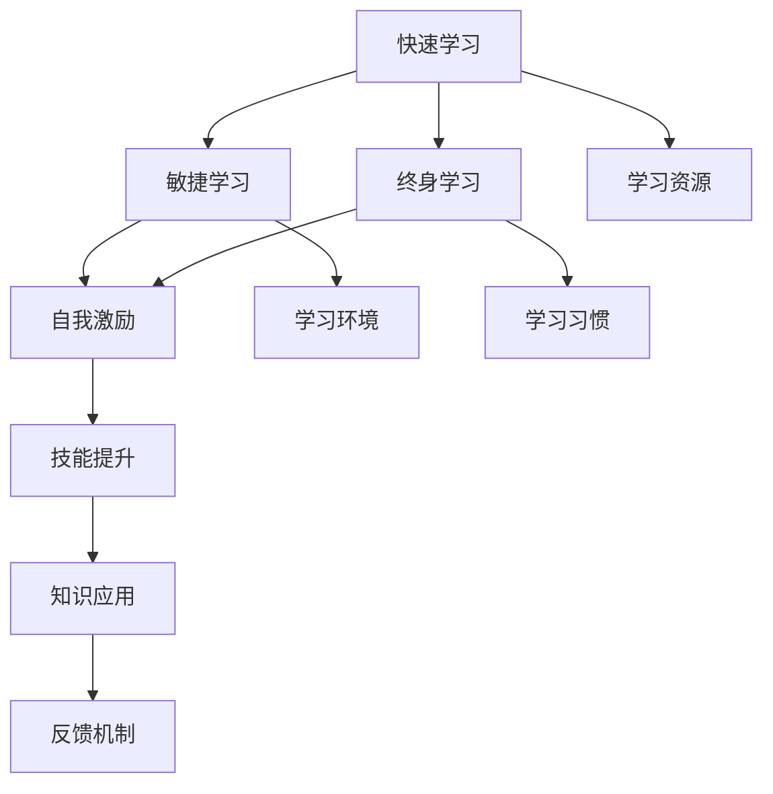

                 

# 学习体系：VUCA时代的重要技能

> 关键词：学习体系, 快速学习, 敏捷学习, 终身学习, 自我激励, 技能提升

## 1. 背景介绍

### 1.1 问题由来
在21世纪第三个十年，我们正处于一个不断变化、充满不确定性的VUCA（Volatile, Uncertain, Complex, Ambiguous）时代。环境快速变化、技术迭代加速、信息爆炸和全球化趋势愈发明显，这些因素都在不断地挑战着我们的适应能力和应对能力。在这样的背景下，如何构建高效、灵活的学习体系，成为当今知识工作者不可或缺的技能。

### 1.2 问题核心关键点
学习体系构建的核心在于理解并掌握知识的获取、加工和应用过程，使学习者能够在变化的环境中快速适应和成长。其关键点包括：
1. **快速学习（Rapid Learning）**：在信息爆炸的时代，如何快速掌握新知识。
2. **敏捷学习（Agile Learning）**：如何在快速变化的环境中灵活调整学习策略。
3. **终身学习（Lifelong Learning）**：如何保持持续的学习动力，使学习成为一种习惯。
4. **自我激励（Self-Motivation）**：如何激发内在的学习动力，克服学习中的障碍。
5. **技能提升（Skill Enhancement）**：如何系统性地提升个人的专业技能，增强竞争力。

构建一个有效的学习体系，能够帮助学习者更好地应对VUCA时代的挑战，提升个人和组织的学习效率，推动创新和进步。

### 1.3 问题研究意义
学习体系的研究对于推动个人发展和组织成长具有重要意义：

1. **个人发展**：帮助个人在快速变化的时代保持竞争力，提升职业发展的可能性。
2. **组织能力提升**：帮助组织提高员工的学习能力，增强团队的整体竞争力。
3. **社会进步**：通过提高整个社会的学习能力，推动社会的创新和发展。

本文将系统地介绍如何构建一个高效的学习体系，探讨其在VUCA时代的实践意义和具体应用。

## 2. 核心概念与联系

### 2.1 核心概念概述

为了更好地理解学习体系的构建，我们需要先掌握一些核心概念：

1. **快速学习**：指在短时间内掌握新知识和技能的能力。这通常涉及到高效的学习方法和技巧。
2. **敏捷学习**：指在不断变化的环境中快速调整学习策略和计划的能力。
3. **终身学习**：指将学习贯穿于个人生涯的各个阶段，使之成为一种持续的生活习惯。
4. **自我激励**：指通过内在的动机和自我认可，持续保持学习的热情和动力。
5. **技能提升**：指通过系统化的学习和实践，持续提升个人的专业技能和通用能力。

这些概念之间存在紧密的联系，相互支持，共同构成了一个完整的学习体系。

### 2.2 核心概念原理和架构的 Mermaid 流程图



这个流程图展示了学习体系中各个核心概念之间的逻辑关系：

1. 快速学习是基础，通过高效的学习方法和资源获取新知识。
2. 敏捷学习确保在变化的环境中灵活调整学习策略，保持学习的持续性。
3. 终身学习将学习贯穿于整个生涯，使之成为一种长期习惯。
4. 自我激励通过内在的动机维持学习的热情和动力。
5. 技能提升通过系统化的学习和实践，提升个人专业技能。
6. 学习资源和环境为学习提供必要的支持。
7. 学习习惯和知识应用是学习的持续反馈和产出环节。
8. 反馈机制帮助调整学习策略，优化学习过程。

## 3. 核心算法原理 & 具体操作步骤

### 3.1 算法原理概述

构建学习体系的基本原理是通过系统的学习和实践，逐步提升个人的知识水平和技能。这通常包括以下几个关键步骤：

1. **目标设定**：明确学习的目标和预期成果。
2. **资源准备**：准备必要的学习资源和环境，包括书籍、课程、工具等。
3. **策略制定**：制定学习策略和方法，选择合适的学习路径。
4. **实施学习**：执行学习计划，完成知识掌握和技能实践。
5. **效果评估**：评估学习效果，反馈调整学习策略。
6. **持续改进**：根据评估结果，持续改进学习策略和计划。

### 3.2 算法步骤详解

下面详细介绍如何构建一个高效的学习体系：

**Step 1: 目标设定**

- **SMART原则**：设定具体的（Specific）、可测量的（Measurable）、可达成的（Achievable）、相关的（Relevant）、有时间限制的（Time-bound）目标。例如，学习一门编程语言，目标可以是“在3个月内，通过完成至少20个项目，掌握Python的基础知识”。

**Step 2: 资源准备**

- **资源筛选**：从书籍、课程、在线教程、社区讨论等渠道获取学习资源。
- **环境搭建**：准备必要的硬件和软件环境，如电脑、软件工具、学习空间等。
- **时间管理**：制定学习时间表，保证充足的学习时间。

**Step 3: 策略制定**

- **学习方法**：选择合适的学习方法，如阅读、练习、观看视频、参加课程等。
- **学习路径**：制定学习路径，明确学习的先后顺序和重点内容。
- **资源整合**：整合多种学习资源，形成学习系统。

**Step 4: 实施学习**

- **基础知识**：从基础知识入手，逐步深入。
- **实践应用**：通过实践项目、练习、模拟测试等方式，巩固所学知识。
- **交流讨论**：参加学习小组、论坛讨论，获取反馈和灵感。

**Step 5: 效果评估**

- **自我评估**：通过自测、项目展示等方式，评估学习效果。
- **他人反馈**：获取他人的评价和建议，调整学习策略。
- **定期复盘**：定期回顾学习进展，调整学习计划。

**Step 6: 持续改进**

- **反思总结**：总结学习过程中的经验和教训，优化学习策略。
- **调整计划**：根据评估结果，调整学习目标和计划。
- **反馈机制**：建立反馈机制，持续改进学习过程。

### 3.3 算法优缺点

构建学习体系的方法具有以下优点：

1. **系统化**：通过系统化的学习和实践，保证学习的全面性和深度。
2. **持续性**：通过持续的反馈和改进，保持学习的连续性和进展。
3. **灵活性**：在变化的环境中灵活调整学习策略，适应新挑战。

同时，也存在一些缺点：

1. **资源需求高**：需要投入大量时间和精力进行资源准备和计划制定。
2. **执行难度大**：在实际操作中，可能会遇到各种困难和挑战。
3. **反馈滞后**：效果的评估和反馈可能需要较长时间，影响学习的持续性。

### 3.4 算法应用领域

学习体系的应用范围非常广泛，涵盖个人发展、组织培训、教育等领域。以下是一个典型应用场景的介绍：

**案例：一家公司的员工培训体系**

- **目标设定**：明确公司需要培训的技能，如编程、数据分析、项目管理等。
- **资源准备**：准备相应的课程、教材、讲师和培训设施。
- **策略制定**：制定培训计划，包括课程安排、学习时间、评估标准等。
- **实施学习**：组织员工参加培训课程，完成相关项目和练习。
- **效果评估**：通过考试、项目评审等方式评估培训效果。
- **持续改进**：根据评估结果，调整培训计划和策略。

## 4. 数学模型和公式 & 详细讲解 & 举例说明

### 4.1 数学模型构建

构建学习体系的数学模型主要基于学习者的认知模型和行为模型。假设学习者 $L$ 通过学习 $S$ 项技能，掌握 $K$ 项知识，完成 $T$ 项任务。其数学模型可以表示为：

$$
L = f(S,K,T)
$$

其中 $f$ 表示学习函数，依赖于技能掌握、知识掌握和任务完成情况。

### 4.2 公式推导过程

设学习者 $L$ 的技能掌握度为 $S$，知识掌握度为 $K$，任务完成度为 $T$，则：

$$
L = S \times K \times T
$$

在实践中，我们可以将其分解为：

1. **技能掌握度**：$S = \sum_{i=1}^{n} s_i$
   其中 $s_i$ 表示第 $i$ 项技能的掌握度，可以通过考试、项目评审等方式量化。
2. **知识掌握度**：$K = \sum_{i=1}^{m} k_i$
   其中 $k_i$ 表示第 $i$ 项知识的掌握度，可以通过书籍学习、课程培训等方式量化。
3. **任务完成度**：$T = \sum_{i=1}^{p} t_i$
   其中 $t_i$ 表示第 $i$ 项任务的完成度，可以通过项目实践、模拟测试等方式量化。

### 4.3 案例分析与讲解

**案例：学习Python编程**

- **目标设定**：在3个月内，通过完成至少20个项目，掌握Python的基础知识。
- **资源准备**：准备Python教程、在线课程、编程工具等。
- **策略制定**：制定学习计划，包括基础知识、编程练习、项目实践等步骤。
- **实施学习**：按计划进行学习，完成基础知识、练习和项目。
- **效果评估**：通过完成项目、编写代码、自测等方式评估学习效果。
- **持续改进**：根据评估结果，调整学习计划和方法。

## 5. 项目实践：代码实例和详细解释说明

### 5.1 开发环境搭建

在构建学习体系时，开发环境的搭建是非常重要的一环。以下是一个简单的开发环境搭建流程：

1. **安装开发环境**：安装Python、Git、IDE等开发工具。
2. **设置开发环境**：配置开发环境变量，确保所有工具和库正常工作。
3. **创建项目目录**：创建项目文件夹，组织文件和代码。
4. **版本控制**：使用Git进行版本控制，记录开发过程和代码变化。

### 5.2 源代码详细实现

**实现步骤：**

1. **定义学习目标**：
```python
def set_learning_goals():
    # 设定学习目标，如学习一门编程语言
    goals = {
        "language": "Python",
        "duration": "3 months",
        "projects": 20
    }
    return goals
```

2. **准备学习资源**：
```python
def prepare_learning_resources():
    # 准备学习资源，如书籍、课程、工具等
    resources = {
        "books": ["Python Crash Course", "Automate the Boring Stuff with Python"],
        "courses": ["Coursera Python for Everybody", "Udacity Intro to Python"],
        "tools": ["Jupyter Notebook", "PyCharm"]
    }
    return resources
```

3. **制定学习策略**：
```python
def define_learning_strategy():
    # 制定学习策略，如学习路径、学习方法等
    strategy = {
        "path": ["基础知识", "基础练习", "项目实践", "项目评审"],
        "methods": ["阅读书籍", "观看视频", "练习编程", "参加课程"]
    }
    return strategy
```

4. **实施学习计划**：
```python
def execute_learning_plan():
    # 实施学习计划，完成知识掌握和技能实践
    plan = {
        "phase1": "基础知识",
        "phase2": "基础练习",
        "phase3": "项目实践",
        "phase4": "项目评审"
    }
    return plan
```

5. **评估学习效果**：
```python
def evaluate_learning效果的():
    # 评估学习效果，通过自测、项目评审等方式
    effects = {
        "self_test": "完成基础练习",
        "project_review": "完成项目评审"
    }
    return effects
```

6. **持续改进学习计划**：
```python
def improve_learning_plan():
    # 持续改进学习计划，根据评估结果调整
    improvements = {
        "adjusted_path": "调整学习路径",
        "new_goals": "设定新目标"
    }
    return improvements
```

### 5.3 代码解读与分析

通过上述代码，我们可以看到构建学习体系的各个关键步骤的实现：

- **目标设定**：通过定义学习目标，明确学习的方向和期望成果。
- **资源准备**：准备必要的学习资源，包括书籍、课程、工具等。
- **策略制定**：制定学习策略，选择合适的学习路径和方法。
- **实施学习**：按计划执行学习，完成知识掌握和技能实践。
- **效果评估**：评估学习效果，获取反馈和改进建议。
- **持续改进**：根据评估结果，调整学习计划和策略。

### 5.4 运行结果展示

在实际应用中，可以通过以下方式展示学习效果：

1. **学习进度报告**：记录每个阶段的学习进度和完成情况。
2. **项目展示**：通过项目展示和评审，评估学习效果。
3. **自我评估**：通过自测和问卷调查，获取学习者的自我反馈。

## 6. 实际应用场景

### 6.1 个人职业发展

在个人职业发展的过程中，构建高效的学习体系能够帮助学习者快速提升技能，适应职场变化。

**案例：职业转换**

- **目标设定**：从软件开发转型为数据科学。
- **资源准备**：准备数据科学相关的书籍、课程、工具等。
- **策略制定**：制定学习计划，包括数据科学基础知识、数据清洗、数据分析、机器学习等步骤。
- **实施学习**：按计划进行学习，完成相关项目和练习。
- **效果评估**：通过项目实践、面试等方式评估学习效果。
- **持续改进**：根据评估结果，调整学习计划和方法。

### 6.2 企业员工培训

在企业员工培训中，构建高效的学习体系能够帮助员工提升专业技能，增强团队整体竞争力。

**案例：新员工培训**

- **目标设定**：提升新员工的市场营销技能。
- **资源准备**：准备市场营销相关的书籍、课程、工具等。
- **策略制定**：制定培训计划，包括市场营销基础知识、客户分析、销售技巧等步骤。
- **实施学习**：组织新员工参加培训课程，完成相关项目和练习。
- **效果评估**：通过考试、项目评审等方式评估培训效果。
- **持续改进**：根据评估结果，调整培训计划和策略。

### 6.3 教育领域

在教育领域，构建高效的学习体系能够帮助学生提升学习效率，适应课堂和考试要求。

**案例：小学数学教育**

- **目标设定**：在一年内，掌握小学数学的所有知识点。
- **资源准备**：准备小学数学的教材、练习册、教学视频等。
- **策略制定**：制定学习计划，包括基础知识、练习、复习等步骤。
- **实施学习**：按计划进行学习，完成相关练习和复习。
- **效果评估**：通过考试、作业等方式评估学习效果。
- **持续改进**：根据评估结果，调整学习计划和方法。

### 6.4 未来应用展望

未来，随着技术的不断进步和应用场景的拓展，学习体系的构建将变得更加智能化和个性化。以下是一些可能的未来应用方向：

1. **智能化学习助手**：开发智能学习助手，根据学习者的个性化需求和学习进度，提供定制化的学习建议和资源推荐。
2. **数据驱动学习**：通过数据分析和学习效果评估，优化学习计划和策略，提高学习效率。
3. **跨平台学习**：实现跨平台的学习管理，支持多种设备和平台的学习应用。
4. **社会化学习**：建立社会化学习网络，支持学习者之间的互动和合作，共享学习资源和经验。
5. **游戏化学习**：引入游戏化元素，增加学习的趣味性和互动性，提升学习者的参与度和动力。

## 7. 工具和资源推荐

### 7.1 学习资源推荐

为了帮助开发者和学生系统掌握学习体系的构建，这里推荐一些优质的学习资源：

1. **Coursera、edX、Udacity**：提供各种在线课程，涵盖编程、数据科学、商业管理等多个领域。
2. **Khan Academy、Duolingo**：提供免费的在线学习资源，涵盖数学、语言、科学等多个学科。
3. **Google Digital Garage、IBM Skills**：提供各种实用技能培训，涵盖数字营销、云计算、人工智能等。
4. **Codecademy、LeetCode**：提供编程练习和项目实战，帮助学习者提升编程技能。
5. **TED-Ed、CrashCourse**：提供优质的视频课程，涵盖历史、艺术、科学等多个领域。
6. **Harvard Business Review**：提供商业管理和领导力相关的文章和视频。

### 7.2 开发工具推荐

高效的开发和学习离不开优秀的工具支持。以下是几款常用的工具：

1. **Google Colab**：免费在线Jupyter Notebook环境，支持GPU计算，方便快速上手实验。
2. **Jupyter Notebook**：免费的开源笔记本环境，支持代码编写、数据处理、可视化等多种功能。
3. **GitHub**：全球最大的代码托管平台，支持版本控制、代码分享、项目协作等。
4. **Anki**：一款基于间隔重复算法的记忆卡片应用，帮助学习者高效记忆知识点。
5. **Khan Academy**：提供免费的在线学习资源，支持个性化学习和进度跟踪。
6. **Evernote**：一款笔记应用，支持文本、图片、音频等多种格式，方便学习者整理和回顾知识点。

### 7.3 相关论文推荐

学习体系的研究源于学界的持续探索。以下是几篇奠基性的相关论文，推荐阅读：

1. **“Learning to Learn” by Barbara Oakley**：介绍学习心理学的最新研究，提出有效的学习方法和策略。
2. **“Learning Analytics: From Research to Practice” by Anne Greenaway et al.**：介绍学习分析的理论和实践，通过数据分析优化学习效果。
3. **“Empirical Study of Learning in Information Systems” by Andrew Ng et al.**：通过数据分析，研究学习者的行为和特征，优化学习路径和资源推荐。
4. **“Learning Analytics in Higher Education: A Review” by Bartleby Smith et al.**：综述了学习分析在高等教育中的应用，提出基于数据的个性化学习策略。
5. **“The Science of Learning: A Guide to Overcome the Invisible Barriers** by Robert Bjork**：介绍学习科学的最新研究，提出有效的学习方法和策略。

## 8. 总结：未来发展趋势与挑战

### 8.1 总结

本文对构建高效的学习体系进行了全面系统的介绍。首先阐述了学习体系在VUCA时代的构建背景和意义，明确了快速学习、敏捷学习、终身学习、自我激励和技能提升在其中的重要性。其次，从原理到实践，详细讲解了学习体系的构建步骤和数学模型，给出了具体的代码实现。同时，本文还探讨了学习体系在多个领域的应用，展示了其在个人职业发展、企业培训、教育等场景中的实践意义。

通过本文的系统梳理，可以看到，构建高效的学习体系是应对VUCA时代挑战的关键。有效的学习体系能够帮助学习者快速适应变化，持续提升技能，推动创新和进步。未来，随着技术的不断进步和应用场景的拓展，学习体系的构建将变得更加智能化和个性化，为个人和组织的发展注入新的动力。

### 8.2 未来发展趋势

展望未来，学习体系的发展将呈现以下几个趋势：

1. **智能化**：通过AI技术，实现个性化学习路径和资源推荐，提升学习效率。
2. **数据驱动**：基于学习数据分析，优化学习策略和计划，提供精准的学习建议。
3. **跨平台**：实现跨平台的学习管理，支持多种设备和平台的学习应用。
4. **社会化**：建立社会化学习网络，支持学习者之间的互动和合作，共享学习资源和经验。
5. **游戏化**：引入游戏化元素，增加学习的趣味性和互动性，提升学习者的参与度和动力。

这些趋势将进一步推动学习体系的智能化和个性化发展，使学习者能够更加高效、灵活地应对VUCA时代的挑战。

### 8.3 面临的挑战

尽管学习体系在构建和发展中取得了不少进展，但仍面临一些挑战：

1. **资源获取**：学习资源的获取和整合仍然是一个挑战，特别是在资源多样性和质量上。
2. **学习策略**：学习策略的选择和制定需要适应不同的学习者需求，找到有效的平衡点。
3. **持续激励**：如何保持学习者的长期动力和兴趣，特别是在面对复杂和枯燥的学习内容时。
4. **个性化**：如何根据学习者的特点和需求，定制化学习计划和资源，实现个性化学习。
5. **应用落地**：如何将学习体系的理论和技术有效地应用到实际场景中，解决实际问题。

### 8.4 研究展望

未来学习体系的研究方向包括：

1. **智能化学习助手**：开发智能学习助手，提供个性化学习建议和资源推荐。
2. **数据驱动学习**：通过数据分析优化学习策略和计划，提高学习效率。
3. **跨平台学习**：实现跨平台的学习管理，支持多种设备和平台的学习应用。
4. **社会化学习**：建立社会化学习网络，支持学习者之间的互动和合作。
5. **游戏化学习**：引入游戏化元素，增加学习的趣味性和互动性。

这些研究方向将推动学习体系的进一步发展，为学习者提供更加高效、灵活的学习体验，助力其在VUCA时代的成长和发展。

## 9. 附录：常见问题与解答

**Q1：学习体系是否适用于所有学习者？**

A: 学习体系适用于大多数学习者，但需要根据不同学习者的特点和需求进行个性化调整。可以通过问卷调查和数据分析，了解学习者的兴趣、学习风格和动机，制定合适的学习计划和资源。

**Q2：如何评估学习效果？**

A: 学习效果的评估可以通过自测、项目评审、考试成绩等方式进行。同时，可以引入学习管理系统（LMS），跟踪学习进度和评估学习效果，提供即时反馈和改进建议。

**Q3：如何持续改进学习计划？**

A: 持续改进学习计划的关键在于定期评估学习效果，收集反馈和建议，根据评估结果调整学习策略和资源。可以建立反馈机制，如学习日志、定期会议等，持续优化学习过程。

**Q4：学习体系是否需要定期更新？**

A: 是的，学习体系需要根据环境变化和新技术发展进行定期更新和优化。可以通过在线课程、专业书籍、技术社区等渠道，不断获取新的学习资源和策略，保持学习体系的前沿性和实用性。

**Q5：如何激励学习者持续学习？**

A: 可以通过设定明确的学习目标、建立奖励机制、创建学习社区等方式激励学习者持续学习。同时，可以通过定期复盘和反馈，保持学习者的动力和兴趣，使学习成为一种习惯。

---

作者：禅与计算机程序设计艺术 / Zen and the Art of Computer Programming

