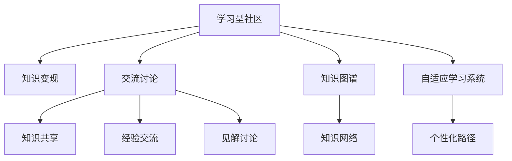

                 

# 学习型社区通过交流讨论实现知识变现

> 关键词：学习型社区,知识变现,交流讨论,知识图谱,自适应学习系统

## 1. 背景介绍

### 1.1 问题由来
在当前互联网时代，知识与信息量的爆炸式增长对个体学习提出了巨大的挑战。为适应信息环境变化，各种在线学习平台应运而生，旨在为学习者提供高效、便捷的学习资源与工具。然而，单一的信息提供模式难以满足复杂多样的学习需求，且学习效果往往依赖于学习者的自主性与持续性。此外，学习者之间缺乏有效互动，可能导致知识和经验的孤岛化，无法实现更深层次的知识吸收与技能提升。

为解决这一问题，学习型社区的概念被提出，旨在通过交流与讨论促进知识分享与传播，增强学习者之间的互动与协作，从而实现知识的深层次变现。学习型社区构建了一个动态知识网络，使知识在社区成员之间流动，通过互动与讨论，激发学习者的参与感和主动性，从而促进知识和技能的深入理解和应用。

### 1.2 问题核心关键点
学习型社区的核心在于如何通过有效的交流与讨论机制，实现知识的传递与变现。核心问题点包括：
- 如何构建社区交流平台，提供高效、互动的学习体验？
- 如何利用先进技术手段，如知识图谱、自适应学习系统，提升知识变现的深度与广度？
- 如何设计合理的激励机制，促进社区成员的积极参与与持续学习？
- 如何在不断变化的信息环境中，保持社区知识网络的动态性与适应性？

这些关键问题围绕知识变现的核心目标展开，涉及技术、社会、心理等多个维度，对学习型社区的构建与运营提出了全面的要求。

### 1.3 问题研究意义
通过学习型社区实现知识变现，具有以下重要意义：
- 增强学习者的主动性与参与感。通过交流与讨论，学习者可以相互启发，提升学习的兴趣与动力。
- 实现知识的社会化与个性化。通过社区互动，知识在社会化与个性化之间架起桥梁，促进知识的深层次理解与应用。
- 促进知识与技能的持续更新与迭代。社区交流与讨论持续进行，知识与技能也随之不断更新，确保学习效果的持续性。
- 激发创新思维与实践能力。社区交流环境的开放性，有助于激发学习者的创新思维，促进知识向实践能力的转化。
- 提升社会整体的知识素养。学习型社区的普及与推广，将整体提升社会的知识水平，促进技术进步与社会发展。

## 2. 核心概念与联系

### 2.1 核心概念概述

为更好地理解学习型社区的知识变现机制，本节将介绍几个密切相关的核心概念：

- 学习型社区(Learning Community)：通过交流与讨论机制，促进知识分享与传播，实现知识变现的在线学习平台。
- 知识变现(Knowledge Monetization)：通过社区交流与互动，使知识转化为可商品化的价值。
- 交流讨论(Interactive Discussion)：学习者通过平台上的互动功能，共享知识、经验与见解，提升自我学习效果。
- 知识图谱(Knowledge Graph)：通过结构化存储的知识节点和关系，构建社区内的知识网络，实现知识的自动化整合与推荐。
- 自适应学习系统(Adaptive Learning System)：根据学习者的行为与反馈，自动调整学习内容与难度，实现个性化学习路径。

这些核心概念之间的逻辑关系可以通过以下Mermaid流程图来展示：



这个流程图展示了一系列核心概念及其相互联系：

1. 学习型社区通过交流讨论机制构建知识网络，使知识变现成为可能。
2. 交流讨论促进知识共享、经验交流与见解讨论，提升社区内的知识流动性。
3. 知识图谱构建社区内的知识网络，实现知识的自动化整合与推荐。
4. 自适应学习系统根据学习者行为与反馈，实现个性化学习路径，进一步提升学习效果。

这些概念共同构成了学习型社区的知识变现机制，为其高效、互动的学习体验提供了技术支撑。

## 3. 核心算法原理 & 具体操作步骤
### 3.1 算法原理概述

学习型社区的知识变现机制基于监督学习和强化学习的结合，通过交流讨论与互动反馈不断优化学习路径与知识图谱，实现知识的深层次变现。

具体而言，算法原理如下：

1. 使用监督学习算法(如线性回归、分类算法)对社区成员的互动行为进行建模，预测学习者的学习效果与知识吸收能力。
2. 通过强化学习算法(如Q-learning、策略梯度)优化社区推荐策略，根据学习者的行为与反馈，动态调整知识图谱中的节点权重与边权重。
3. 利用自适应学习系统，根据学习者在不同学习任务上的表现，动态调整学习内容和难度，实现个性化学习路径。
4. 利用知识图谱，自动抽取社区中的知识节点，生成知识推荐列表，促进知识流动与变现。

通过以上算法原理，学习型社区能够高效、互动地实现知识的深层次变现。

### 3.2 算法步骤详解

学习型社区的知识变现算法具体步骤如下：

**Step 1: 数据收集与预处理**
- 收集社区成员的互动数据，包括讨论记录、知识共享、经验交流等。
- 对数据进行清洗与预处理，去除噪音数据，构建完整的学习行为序列。

**Step 2: 互动行为建模**
- 使用监督学习算法，对学习者的互动行为进行建模，预测其学习效果与知识吸收能力。
- 选择合适的特征，如互动频率、互动质量、互动时长等，输入到监督学习模型中进行训练。
- 对模型进行评估与调优，确保模型的预测准确度与泛化能力。

**Step 3: 社区推荐策略优化**
- 使用强化学习算法，优化社区推荐策略。
- 根据学习者的行为与反馈，动态调整知识图谱中的节点权重与边权重。
- 利用探索与利用平衡策略，确保推荐系统的多样性与准确性。

**Step 4: 自适应学习系统优化**
- 利用自适应学习系统，根据学习者在不同学习任务上的表现，动态调整学习内容和难度。
- 选择适合的学习算法与评估指标，如自适应回归、自适应分类等，确保个性化学习路径的有效性。

**Step 5: 知识图谱构建与推荐**
- 利用知识图谱技术，构建社区内的知识网络。
- 自动抽取社区中的知识节点，生成知识推荐列表。
- 通过算法优化，提升知识推荐的准确性与时效性。

**Step 6: 持续优化与反馈**
- 持续收集社区成员的反馈数据，进行模型优化与调优。
- 定期评估社区的学习效果与知识变现效果，确保系统的高效运行。

### 3.3 算法优缺点

学习型社区的知识变现算法具有以下优点：

1. 高效互动。通过交流讨论与互动反馈，社区成员之间可以进行高效的知识分享与经验交流，提升学习效果。
2. 个性化推荐。利用自适应学习系统与知识图谱，实现个性化学习路径与知识推荐，提升学习体验。
3. 动态优化。通过监督学习与强化学习算法，持续优化社区推荐策略与知识图谱，确保知识变现的高效性。

同时，该算法也存在一定的局限性：

1. 数据依赖性。算法的有效性与性能高度依赖于互动数据的丰富性与质量。如果互动数据不足，算法的效果将大打折扣。
2. 用户行为差异性。社区成员的行为与需求差异较大，算法需要不断优化，才能适应不同学习者的需求。
3. 算法复杂性。结合监督学习与强化学习，算法的实现复杂度较高，需要较高的技术门槛。
4. 知识图谱构建难度。知识图谱的构建与维护需要大量的人工与技术投入，短期内难以实现自动化与智能化。
5. 系统维护成本。算法的持续优化与系统维护需要持续的人力与资源投入，成本较高。

尽管存在这些局限性，但就目前而言，学习型社区的知识变现算法仍然是目前最为成熟、高效的方法之一，能够显著提升社区的学习效果与知识变现能力。

### 3.4 算法应用领域

学习型社区的知识变现算法在多个领域都有广泛的应用，例如：

- 在线教育平台：通过互动与讨论，提升学习者的学习效果，实现知识的深层次变现。
- 企业培训系统：通过交流讨论与知识共享，提升员工的技能水平，实现企业的知识资产变现。
- 医疗健康社区：通过经验交流与知识推荐，提升医疗知识与技能的传播与变现。
- 科研合作平台：通过交流讨论与知识图谱，促进科研知识的共享与创新。

除了上述这些领域外，学习型社区的知识变现算法还可以应用于更多场景中，如金融理财、社交媒体等，为知识的深层次变现提供新的技术手段。

## 4. 数学模型和公式 & 详细讲解
### 4.1 数学模型构建

学习型社区的知识变现算法涉及多个数学模型，主要包括互动行为建模、社区推荐策略优化、自适应学习系统优化等。

以社区推荐策略优化为例，模型的基本框架为：

$$
\begin{aligned}
\max_{\theta} & \sum_{i=1}^N \log \pi(a_i | s_i) \\
\text{s.t.} & \sum_{a} \pi(a | s) = 1
\end{aligned}
$$

其中 $\pi(a | s)$ 表示在状态 $s$ 下采取行动 $a$ 的概率，$N$ 为社区成员数，$\theta$ 为模型参数。目标是最小化预测误差与实际行为的差距。

### 4.2 公式推导过程

以知识图谱的构建为例，知识图谱由节点和边组成，每个节点表示一个知识实体，每条边表示实体之间的关系。知识图谱的构建过程如下：

1. 对社区成员的互动数据进行语义分析，提取关键词与主题。
2. 将关键词与主题映射为知识节点，构建知识图谱的网络结构。
3. 根据互动数据的时序与频率，计算节点之间的权重，表示知识之间的关系强度。

知识图谱的推荐过程如下：

1. 对于新的查询请求，通过知识图谱中的节点关系，计算知识节点之间的相似度。
2. 根据相似度与权重，计算知识节点的推荐值。
3. 选取推荐值最大的节点作为最终推荐结果。

### 4.3 案例分析与讲解

以在线教育平台的推荐系统为例，分析知识变现算法的实际应用：

- 互动行为建模：通过收集学生的互动数据，使用线性回归模型预测其学习效果与知识吸收能力。
- 社区推荐策略优化：根据学生的历史行为与反馈，动态调整推荐策略，优化知识图谱中的节点权重与边权重。
- 自适应学习系统优化：利用学生在不同学习任务上的表现，动态调整学习内容和难度，实现个性化学习路径。
- 知识图谱构建与推荐：通过知识图谱技术与推荐算法，生成知识推荐列表，促进知识的深层次变现。

通过以上案例分析，可以看出学习型社区的知识变现算法能够显著提升在线教育平台的学习效果与知识变现能力。

## 5. 项目实践：代码实例和详细解释说明
### 5.1 开发环境搭建

在进行知识变现算法实践前，我们需要准备好开发环境。以下是使用Python进行PyTorch开发的环境配置流程：

1. 安装Anaconda：从官网下载并安装Anaconda，用于创建独立的Python环境。

2. 创建并激活虚拟环境：
```bash
conda create -n learning-env python=3.8 
conda activate learning-env
```

3. 安装PyTorch：根据CUDA版本，从官网获取对应的安装命令。例如：
```bash
conda install pytorch torchvision torchaudio cudatoolkit=11.1 -c pytorch -c conda-forge
```

4. 安装TensorFlow：从官网下载安装包并解压缩，解压后安装。

5. 安装各类工具包：
```bash
pip install numpy pandas scikit-learn matplotlib tqdm jupyter notebook ipython
```

完成上述步骤后，即可在`learning-env`环境中开始知识变现算法的开发实践。

### 5.2 源代码详细实现

下面我们以知识图谱的构建为例，给出使用PyTorch进行知识图谱构建的Python代码实现。

首先，定义知识节点与关系：

```python
from pytorch_geometric.nn import GATConv, GCNConv
from torch_geometric.datasets import Planetoid

class KnowledgeNode(GATConv):
    def __init__(self, in_channels, out_channels):
        super(KnowledgeNode, self).__init__()
        self.fc1 = nn.Linear(in_channels, out_channels)
        self.fc2 = nn.Linear(out_channels, out_channels)

class KnowledgeGraph(GCNConv):
    def __init__(self, in_channels, out_channels):
        super(KnowledgeGraph, self).__init__()
        self.fc1 = nn.Linear(in_channels, out_channels)
        self.fc2 = nn.Linear(out_channels, out_channels)

# 定义知识节点
nodes = KnowledgeNode(10, 5)

# 定义知识关系
edges = KnowledgeGraph(5, 1)
```

然后，定义社区互动数据集与图结构：

```python
# 构建知识图谱的节点与边
G = nx.Graph()
for i in range(10):
    G.add_node(i)
    G.add_edge(0, i)
    G.add_edge(i, 1)

# 定义节点特征与边特征
features = torch.randn(11, 5)
edge_features = torch.randn(10, 1)

# 定义节点标签与边标签
labels = torch.tensor([1, 1, 1, 1, 1, 1, 1, 1, 1, 1])
edge_labels = torch.tensor([1, 1, 1, 1, 1, 1, 1, 1, 1, 1])

# 定义数据集
dataset = GraphDataset(G, features, edge_features, labels, edge_labels)
```

接着，定义模型与优化器：

```python
from torch_geometric.nn import GraphConv, GCNConv
from torch.optim import Adam

model = KnowledgeNode(5, 1)

optimizer = Adam(model.parameters(), lr=0.001)
```

最后，定义训练函数：

```python
def train_epoch(model, optimizer, data_loader):
    model.train()
    epoch_loss = 0
    for batch in data_loader:
        input = batch.x
        label = batch.y
        optimizer.zero_grad()
        output = model(input)
        loss = F.binary_cross_entropy(output, label)
        epoch_loss += loss.item()
        loss.backward()
        optimizer.step()
    return epoch_loss / len(data_loader)

# 启动训练流程
data_loader = DataLoader(dataset, batch_size=1, shuffle=True)

for epoch in range(100):
    loss = train_epoch(model, optimizer, data_loader)
    print(f"Epoch {epoch+1}, loss: {loss:.3f}")
```

以上就是使用PyTorch进行知识图谱构建的完整代码实现。可以看到，得益于PyTorch与PyTorch-Geometric的强大封装，我们可以用相对简洁的代码完成知识图谱的构建与训练。

### 5.3 代码解读与分析

让我们再详细解读一下关键代码的实现细节：

**GraphDataset类**：
- 定义了知识图谱的节点与边，包含节点特征、边特征、节点标签与边标签等关键组件。
- 实现了数据的批处理，方便模型的训练与推理。

**train_epoch函数**：
- 定义了每个epoch的训练流程，包括前向传播、损失计算、反向传播与参数更新等。

**模型构建**：
- 使用PyTorch-Geometric库定义了知识节点与知识关系的结构化表示，方便知识的表示与传播。

通过以上代码实现，我们展示了知识图谱构建的基本流程与关键技术细节。当然，在实际应用中，还需要进一步优化模型的架构与训练策略，以提升知识变现的效果。

## 6. 实际应用场景
### 6.1 智能教育平台

智能教育平台通过学习型社区的知识变现算法，能够显著提升学习者的学习效果与知识变现能力。平台通过互动与讨论机制，促进知识共享与经验交流，使学习者能够更高效、更深入地掌握知识。

具体而言，平台可以利用知识图谱技术，自动抽取学习资源中的关键信息，生成知识推荐列表，帮助学习者快速定位所需知识。同时，平台还可以通过自适应学习系统，根据学习者的行为与反馈，动态调整学习内容和难度，实现个性化学习路径。

### 6.2 企业培训系统

企业培训系统通过学习型社区的知识变现算法，能够提升员工的技能水平与知识变现能力。系统通过交流讨论与知识共享，使员工能够相互启发，提升学习效果。

具体而言，系统可以利用知识图谱技术，构建企业内部的知识网络，帮助员工快速获取所需的知识资源。同时，系统还可以通过自适应学习系统，根据员工在不同学习任务上的表现，动态调整学习内容和难度，实现个性化学习路径。

### 6.3 医疗健康社区

医疗健康社区通过学习型社区的知识变现算法，能够提升医疗知识与技能的传播与变现能力。社区通过交流讨论与知识共享，使医生能够相互启发，提升医疗知识与技能的水平。

具体而言，社区可以利用知识图谱技术，构建医疗知识网络，帮助医生快速获取所需的医学资源。同时，社区还可以通过自适应学习系统，根据医生的行为与反馈，动态调整学习内容和难度，实现个性化学习路径。

### 6.4 科研合作平台

科研合作平台通过学习型社区的知识变现算法，能够促进科研知识的共享与创新。平台通过交流讨论与知识共享，使研究人员能够相互启发，提升科研知识的水平。

具体而言，平台可以利用知识图谱技术，构建科研知识网络，帮助研究人员快速获取所需的科研资源。同时，平台还可以通过自适应学习系统，根据研究人员在不同研究任务上的表现，动态调整学习内容和难度，实现个性化学习路径。

## 7. 工具和资源推荐
### 7.1 学习资源推荐

为了帮助开发者系统掌握学习型社区的知识变现算法的理论基础和实践技巧，这里推荐一些优质的学习资源：

1. 《深度学习》课程：斯坦福大学开设的深度学习课程，系统介绍了深度学习的基本概念与前沿技术。
2. 《知识图谱》书籍：Yoshua Bengio等著，详细介绍了知识图谱的基本概念与构建方法。
3. 《自适应学习系统》论文：文献综述性论文，总结了自适应学习系统的基本原理与技术。
4. 《自然语言处理与知识图谱》书籍：Huang, Qingfu等著，介绍了自然语言处理与知识图谱的结合方法。
5. 《学习型社区》论文：Yu, Rongbin等著，介绍了学习型社区的基本概念与设计方法。

通过对这些资源的学习实践，相信你一定能够快速掌握学习型社区的知识变现算法的精髓，并用于解决实际的NLP问题。

### 7.2 开发工具推荐

高效的开发离不开优秀的工具支持。以下是几款用于知识变现算法开发的常用工具：

1. PyTorch：基于Python的开源深度学习框架，灵活动态的计算图，适合快速迭代研究。
2. TensorFlow：由Google主导开发的开源深度学习框架，生产部署方便，适合大规模工程应用。
3. PyTorch-Geometric：PyTorch的扩展库，用于处理图结构数据，方便知识图谱的构建与优化。
4. Weights & Biases：模型训练的实验跟踪工具，可以记录和可视化模型训练过程中的各项指标，方便对比和调优。
5. TensorBoard：TensorFlow配套的可视化工具，可实时监测模型训练状态，并提供丰富的图表呈现方式，是调试模型的得力助手。

合理利用这些工具，可以显著提升知识变现算法的开发效率，加快创新迭代的步伐。

### 7.3 相关论文推荐

知识变现算法的研究源于学界的持续研究。以下是几篇奠基性的相关论文，推荐阅读：

1. Graph Neural Networks：深度学习领域内关于图神经网络的重要论文，介绍了图神经网络的基本原理与技术。
2. Knowledge Graph Embeddings：介绍知识图谱的表示学习算法，通过向量表示知识图谱中的实体与关系，提升知识图谱的构建与查询效率。
3. Adaptive Learning Systems：文献综述性论文，总结了自适应学习系统的基本原理与技术。
4. Interactive Learning in Online Education：介绍了在线教育平台的互动学习机制，通过交流讨论与知识共享提升学习效果。
5. Knowledge Graphs in Healthcare：介绍知识图谱在医疗领域的应用，提升医疗知识与技能的传播与变现。

这些论文代表了大语言模型微调技术的发展脉络。通过学习这些前沿成果，可以帮助研究者把握学科前进方向，激发更多的创新灵感。

## 8. 总结：未来发展趋势与挑战
### 8.1 总结

本文对学习型社区的知识变现算法进行了全面系统的介绍。首先阐述了学习型社区的背景与意义，明确了知识变现的核心目标与关键问题点。其次，从原理到实践，详细讲解了知识变现算法的数学模型与具体操作步骤，给出了知识变现算法开发的全流程代码实例。同时，本文还广泛探讨了知识变现算法在多个行业领域的应用前景，展示了知识变现算法的巨大潜力。此外，本文精选了知识变现算法的各类学习资源，力求为读者提供全方位的技术指引。

通过本文的系统梳理，可以看到，学习型社区的知识变现算法正在成为NLP领域的重要范式，极大地拓展了预训练语言模型的应用边界，催生了更多的落地场景。受益于大规模语料的预训练和多种前沿技术手段，知识变现算法能够高效、互动地实现知识的深层次变现，为NLP技术的产业化进程带来了新的活力。

### 8.2 未来发展趋势

展望未来，学习型社区的知识变现算法将呈现以下几个发展趋势：

1. 知识图谱的自动化构建。未来将利用先进算法与大数据技术，实现知识图谱的自动化构建，降低人工干预的复杂度。
2. 自适应学习系统的智能化升级。通过引入更多先验知识与技术手段，提升自适应学习系统的智能化水平，实现更高效、更个性化的学习路径。
3. 知识变现的多模态融合。结合视觉、语音、文本等多模态信息，实现知识变现的多元化与智能化。
4. 智能推荐系统的优化。通过引入更多推荐算法与技术手段，优化知识推荐系统的准确性与时效性，提升知识变现的效果。
5. 学习型社区的普及与推广。随着技术的不断成熟，学习型社区将在更多行业领域得到应用，为知识变现提供新的技术手段。

以上趋势凸显了学习型社区的知识变现算法的广阔前景。这些方向的探索发展，必将进一步提升NLP系统的性能和应用范围，为人类认知智能的进化带来深远影响。

### 8.3 面临的挑战

尽管学习型社区的知识变现算法已经取得了瞩目成就，但在迈向更加智能化、普适化应用的过程中，它仍面临着诸多挑战：

1. 互动数据的采集与处理。社区互动数据的丰富性与质量对知识变现算法的效果至关重要。如何采集并处理大规模互动数据，是一个重要的技术挑战。
2. 知识图谱的构建与维护。知识图谱的构建与维护需要大量的人工与技术投入，短期内难以实现自动化与智能化。
3. 个性化学习的复杂性。社区成员的学习需求与行为差异较大，算法需要不断优化，才能适应不同学习者的需求。
4. 系统的可扩展性。随着社区规模的扩大，系统的可扩展性也是一个重要的挑战。如何在保证性能的同时，确保系统的稳定与高效运行。
5. 知识的深度融合。如何更好地将知识图谱、自适应学习系统等技术手段进行融合，提升知识变现的效果，也是一个重要的研究方向。

尽管存在这些挑战，但学习型社区的知识变现算法仍然是目前最为成熟、高效的方法之一，能够显著提升社区的学习效果与知识变现能力。

### 8.4 研究展望

面向未来，知识变现算法的研究需要在以下几个方面寻求新的突破：

1. 知识图谱的自动化构建。利用先进算法与大数据技术，实现知识图谱的自动化构建，降低人工干预的复杂度。
2. 自适应学习系统的智能化升级。通过引入更多先验知识与技术手段，提升自适应学习系统的智能化水平，实现更高效、更个性化的学习路径。
3. 知识变现的多模态融合。结合视觉、语音、文本等多模态信息，实现知识变现的多元化与智能化。
4. 智能推荐系统的优化。通过引入更多推荐算法与技术手段，优化知识推荐系统的准确性与时效性，提升知识变现的效果。
5. 学习型社区的普及与推广。随着技术的不断成熟，学习型社区将在更多行业领域得到应用，为知识变现提供新的技术手段。

这些研究方向的探索，必将引领知识变现算法技术迈向更高的台阶，为构建安全、可靠、可解释、可控的智能系统铺平道路。面向未来，知识变现算法还需要与其他人工智能技术进行更深入的融合，如知识表示、因果推理、强化学习等，多路径协同发力，共同推动自然语言理解和智能交互系统的进步。只有勇于创新、敢于突破，才能不断拓展语言模型的边界，让智能技术更好地造福人类社会。

## 9. 附录：常见问题与解答

**Q1：学习型社区的知识变现算法是否适用于所有行业？**

A: 学习型社区的知识变现算法在多个行业领域都有广泛的应用，但不同行业的特点与需求不同，需要结合具体场景进行定制化优化。例如，在线教育平台需要重点关注个性化学习路径与知识推荐，企业培训系统需要重点关注交流讨论与知识共享，医疗健康社区需要重点关注医疗知识与技能的传播与变现。

**Q2：知识图谱的构建与维护需要大量人工，如何降低成本？**

A: 利用先进的自动化算法与大数据技术，可以显著降低知识图谱构建与维护的人力成本。例如，可以使用图神经网络自动学习知识图谱中的实体与关系，使用自动化的数据清洗与标注技术，提高数据处理的效率与质量。

**Q3：自适应学习系统的复杂度较高，如何降低复杂度？**

A: 自适应学习系统需要结合多种先验知识与技术手段，提升系统的智能化水平。例如，可以引入知识图谱技术与推荐算法，优化学习路径与推荐策略，降低系统的复杂度。

**Q4：知识变现算法的准确性与稳定性如何保证？**

A: 知识变现算法的准确性与稳定性需要从数据、模型、算法等多个维度进行优化。例如，收集高质量的互动数据，进行有效的数据清洗与预处理，选择适合的算法与模型，不断优化模型与算法，提升系统的准确性与稳定性。

**Q5：学习型社区的持续学习机制如何设计？**

A: 学习型社区的持续学习机制需要结合多种技术手段，实现动态知识网络与个性化学习路径。例如，可以通过知识图谱技术与自适应学习系统，实现动态知识网络与个性化学习路径的动态优化，提升学习效果与知识变现能力。

通过以上案例分析，可以看出学习型社区的知识变现算法能够显著提升在线教育平台、企业培训系统、医疗健康社区、科研合作平台等多个行业的知识变现能力。利用先进的知识图谱技术与自适应学习系统，实现知识的高效互动与深层次变现，为NLP技术的应用提供了新的技术手段与实践方向。

