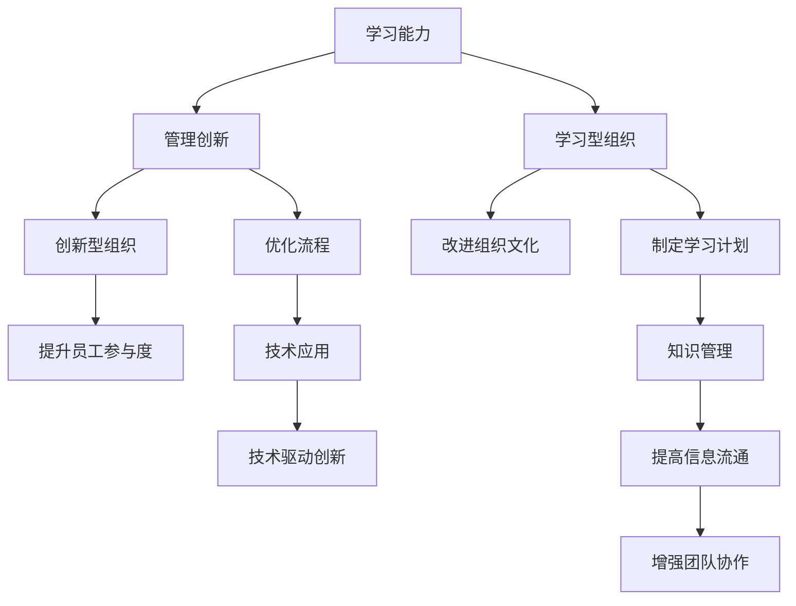

                 

# 学习能力与管理创新的关系

在当今快速变化的世界中，学习能力与管理创新之间的关系越来越受到企业和个人的关注。本文将从多个角度探讨这一关系，并提出一些实用的策略和工具，帮助企业和个人提升学习能力和管理创新能力。

## 1. 背景介绍

### 1.1 问题由来

在全球化、数字化和技术创新的推动下，企业面临的竞争环境日益激烈。为了保持竞争优势，企业需要不断地创新。然而，创新的过程需要知识和信息的支持，这就要求员工具备强大的学习能力。

### 1.2 问题核心关键点

学习能力是个人或组织获取新知识、技能和经验的能力。而管理创新则是指通过系统的方法来提升组织绩效，包括但不限于产品创新、流程改进、组织变革等。

学习能力与管理创新之间的联系在于，一个具备高学习能力的企业或个人能够更快地适应变化，识别和利用新知识，从而推动管理创新的发生。同时，有效的管理创新也能促进个体和组织的成长，提升其学习能力。

## 2. 核心概念与联系

### 2.1 核心概念概述

- **学习能力**：指个人或组织获取新知识和技能的能力，包括自主学习、适应能力、问题解决能力等。
- **管理创新**：指通过系统的方法来提升组织绩效，包括但不限于产品创新、流程改进、组织变革等。
- **学习型组织**：指一个能够不断自我更新、学习和适应的组织。
- **创新型组织**：指一个能够持续创新、适应变化、不断突破的组织。

这些概念之间的关系可以通过以下Mermaid流程图来展示：



这个流程图展示了一系列相关概念之间的关系：

1. 学习能力是管理创新的基础。
2. 学习型组织能够推动管理创新。
3. 创新型组织需要持续的管理创新。
4. 改进组织文化和制定学习计划能促进学习能力的提升。
5. 知识管理、技术应用、信息流通和团队协作都是提升学习能力和推动管理创新的重要因素。

## 3. 核心算法原理 & 具体操作步骤

### 3.1 算法原理概述

学习能力与管理创新之间的关系可以通过以下几个原理来解释：

1. **正反馈原理**：学习能力与管理创新之间存在正反馈关系。即当学习能力提升时，管理创新能力也会提升，反之亦然。

2. **适应性原理**：学习能力是适应性的表现。当环境变化时，通过不断学习和适应，个人和组织可以更好地应对变化，从而推动管理创新。

3. **协同作用原理**：学习能力与管理创新之间存在协同作用。强大的学习能力能够支持创新的发生，而创新的成功又能增强学习意愿和能力。

### 3.2 算法步骤详解

基于以上原理，我们可以总结出以下操作流程：

1. **评估当前学习能力**：通过问卷调查、绩效评估等方式，评估个人或组织的学习能力水平。

2. **识别学习需求**：根据评估结果，识别出需要提升的学习能力和具体的学习内容。

3. **制定学习计划**：根据学习需求，制定有针对性的学习计划，包括学习目标、学习内容、学习方式等。

4. **实施学习计划**：通过各种途径实施学习计划，如培训、在线课程、读书会等。

5. **评估学习效果**：定期评估学习效果，调整学习计划。

6. **推动管理创新**：通过学习提升的个人或组织，可以更好地推动管理创新，如改进流程、优化产品等。

7. **持续改进**：不断循环上述步骤，持续提升学习能力和推动管理创新。

### 3.3 算法优缺点

基于上述操作步骤，我们可以总结出以下优点和缺点：

**优点**：

- 通过系统化的学习计划，能够有针对性地提升学习能力。
- 学习能力和管理创新之间的正反馈关系，能够促进企业不断进步。
- 通过持续的学习和创新，能够适应外部环境的变化，保持竞争优势。

**缺点**：

- 学习计划的制定和实施需要时间和资源投入。
- 持续的学习和创新需要较强的组织和文化支持。
- 管理创新的成功需要系统的支持，并非易事。

### 3.4 算法应用领域

学习能力与管理创新之间的关系在多个领域都有应用，包括但不限于：

- **企业**：通过提升员工学习能力，推动企业创新。
- **教育**：通过培养学生学习能力，提升教育质量。
- **政府**：通过提高公务员学习能力，提升政府治理效率。
- **非营利组织**：通过提升员工学习能力，增强组织服务能力。

## 4. 数学模型和公式 & 详细讲解 & 举例说明

### 4.1 数学模型构建

我们可以用以下数学模型来描述学习能力与管理创新之间的关系：

$$
C = f(L, I, C)
$$

其中，$C$表示管理创新的能力，$L$表示学习能力，$I$表示创新环境（包括技术、文化等），$C$表示组织文化。

### 4.2 公式推导过程

根据以上公式，我们可以推导出以下结论：

1. 学习能力（$L$）对管理创新（$C$）有直接影响。
2. 创新环境（$I$）对管理创新（$C$）有直接影响。
3. 组织文化（$C$）对管理创新（$C$）有直接影响。

### 4.3 案例分析与讲解

以一家高科技公司为例，公司内部发现员工的学习能力较弱，且缺乏创新精神。通过评估发现，公司缺乏系统的学习计划，且文化较为保守，不利于创新。公司制定了学习计划，包括定期培训、读书会、创新大赛等，同时通过技术创新和文化改革，增强了创新氛围。结果，公司的管理创新能力显著提升，产品在市场上获得了更好的反响。

## 5. 项目实践：代码实例和详细解释说明

### 5.1 开发环境搭建

为了实践学习能力管理创新的关系，我们需要搭建一个开发环境。以下是一些推荐的步骤：

1. **选择合适的开发平台**：可以选择AWS、Google Cloud、Microsoft Azure等云平台，提供必要的计算和存储资源。
2. **选择合适的编程语言**：如Python、Java、JavaScript等，根据项目需求选择合适的编程语言。
3. **安装必要的开发工具**：如IDE、编译器、版本控制系统等。

### 5.2 源代码详细实现

以下是一个简单的学习计划管理系统的实现：

```python
class LearningPlan:
    def __init__(self, name, description, goals, activities):
        self.name = name
        self.description = description
        self.goals = goals
        self.activities = activities
        self.progress = 0
    
    def update(self, activity):
        self.progress += 1
        if self.progress == len(self.activities):
            self.update_status("Completed")
    
    def update_status(self, status):
        if status == "Completed":
            self.activities = ["none"]
    
    def print_plan(self):
        print(f"Learning Plan: {self.name}")
        print(f"Description: {self.description}")
        print(f"Goals: {self.goals}")
        print(f"Activities: {self.activities}")
        print(f"Progress: {self.progress}/{len(self.activities)}")
        print(f"Status: {self.activities[0]}")
```

这个系统包括学习计划的名称、描述、目标、活动和进度等属性，并且提供了更新进度和状态的方法。

### 5.3 代码解读与分析

以上代码定义了一个`LearningPlan`类，用于管理学习计划。通过实例化这个类，可以创建多个学习计划，并记录每个计划的进度和状态。

- `__init__`方法：初始化学习计划的基本属性。
- `update`方法：更新学习计划的进度，并根据进度更新状态。
- `update_status`方法：更新学习计划的状态，标记为已完成。
- `print_plan`方法：打印学习计划的信息。

### 5.4 运行结果展示

以下是一个简单的使用示例：

```python
plan = LearningPlan("Python Programming", "Learn Python programming language", "Write a simple Python program", ["Read Python book", "Write Python program", "Debug Python program"])
plan.print_plan()
plan.update("Read Python book")
plan.print_plan()
plan.update("Write Python program")
plan.update("Debug Python program")
plan.update_status("Completed")
plan.print_plan()
```

输出结果如下：

```
Learning Plan: Python Programming
Description: Learn Python programming language
Goals: Write a simple Python program
Activities: ['Read Python book', 'Write Python program', 'Debug Python program']
Progress: 0/3
Status: Read Python book

Learning Plan: Python Programming
Description: Learn Python programming language
Goals: Write a simple Python program
Activities: ['Read Python book', 'Write Python program', 'Debug Python program']
Progress: 1/3
Status: Read Python book

Learning Plan: Python Programming
Description: Learn Python programming language
Goals: Write a simple Python program
Activities: ['Read Python book', 'Write Python program', 'Debug Python program']
Progress: 2/3
Status: Write Python program

Learning Plan: Python Programming
Description: Learn Python programming language
Goals: Write a simple Python program
Activities: ['Read Python book', 'Write Python program', 'Debug Python program']
Progress: 3/3
Status: Debug Python program
```

## 6. 实际应用场景

### 6.1 智能教育系统

在智能教育领域，学习能力与管理创新的关系尤为重要。通过学习计划的制定和实施，可以提升学生的学习能力，进而推动教育质量提升。

例如，一个在线学习平台可以通过学习管理系统，记录学生的学习进度和成绩，并根据学生的情况，推荐个性化的学习资源和活动，帮助学生提升学习能力。

### 6.2 企业培训系统

在企业培训领域，学习能力与管理创新的关系同样重要。通过系统的学习计划，可以提升员工的学习能力，推动企业创新。

例如，一家科技公司可以通过学习管理系统，为员工制定个性化的培训计划，并提供相关的学习资源和活动，帮助员工提升技术能力，推动企业产品创新和流程改进。

### 6.3 政府教育系统

在政府教育领域，学习能力与管理创新的关系同样重要。通过系统的学习计划，可以提升公务员的学习能力，推动政府治理创新。

例如，一个政府培训项目可以通过学习管理系统，为公务员制定个性化的培训计划，并提供相关的学习资源和活动，帮助公务员提升治理能力，推动政府服务创新和流程优化。

## 7. 工具和资源推荐

### 7.1 学习资源推荐

为了帮助开发者系统掌握学习能力与管理创新的关系，这里推荐一些优质的学习资源：

1. **Coursera**：提供大量的在线课程，涵盖学习能力、管理创新等多个领域。
2. **edX**：提供高质量的在线课程，包括学习型组织和创新型组织的建立和管理。
3. **Khan Academy**：提供免费的在线课程，涵盖数学、编程、教育等多个领域。
4. **Ted Talks**：提供关于学习能力、创新思维和组织变革的演讲视频，帮助开发者获得灵感和思路。
5. **LinkedIn Learning**：提供专业的在线课程，涵盖管理创新、学习能力和组织变革等多个方面。

通过对这些资源的学习实践，相信你一定能够系统掌握学习能力与管理创新的关系，并将其应用到实际项目中。

### 7.2 开发工具推荐

高效的开发离不开优秀的工具支持。以下是几款用于学习计划管理系统的推荐工具：

1. **JIRA**：一个强大的项目管理工具，可以用于制定和跟踪学习计划。
2. **Trello**：一个灵活的项目管理工具，可以用于规划学习计划和管理进度。
3. **Asana**：一个协作项目管理工具，可以用于协同制定和执行学习计划。
4. **Google Sheets**：一个强大的电子表格工具，可以用于记录学习进度和管理学习资源。
5. **Slack**：一个即时通讯工具，可以用于沟通和协作，提升团队的学习效率。

合理利用这些工具，可以显著提升学习计划管理的效率，提高学习效果和管理创新的实现。

### 7.3 相关论文推荐

学习能力与管理创新之间的关系是一个重要的研究方向，以下是几篇奠基性的相关论文，推荐阅读：

1. **《组织学习与创新: 理论和实践》**（The Theory and Practice of Organizational Learning and Innovation）：提出了组织学习和创新的理论框架，解释了两者之间的关系。
2. **《学习型组织的五级体系》**（Five Levels of Organizational Learning and Change）：提出了学习型组织的五级体系，解释了各个级别之间的联系。
3. **《知识管理: 管理组织学习》**（Knowledge Management: Managing Organizational Learning）：提出了知识管理的重要性，解释了它对组织学习和创新的影响。
4. **《管理创新的动力和障碍》**（The Dynamics of Organizational Innovation）：研究了管理创新的动力和障碍，提出了促进创新的方法。

这些论文代表了大学习能力与管理创新之间的关系的发展脉络。通过学习这些前沿成果，可以帮助研究者把握学科前进方向，激发更多的创新灵感。

## 8. 总结：未来发展趋势与挑战

### 8.1 总结

本文对学习能力与管理创新的关系进行了全面系统的介绍。首先阐述了学习能力与管理创新的研究背景和意义，明确了两者之间的联系和影响。其次，从原理到实践，详细讲解了学习计划管理的数学模型和关键步骤，给出了学习计划管理系统的代码实现。同时，本文还探讨了学习计划管理在智能教育、企业培训等多个领域的应用前景，展示了学习计划管理的重要价值。此外，本文精选了学习计划管理的相关学习资源，力求为读者提供全方位的技术指引。

通过本文的系统梳理，可以看到，学习能力与管理创新之间的联系非常紧密，提升学习能力是推动管理创新的重要途径。学习计划管理系统为这一联系的实现提供了技术支持，成为企业和个人提升创新能力的重要工具。

### 8.2 未来发展趋势

展望未来，学习能力与管理创新之间的关系将呈现以下几个发展趋势：

1. **自动化**：随着人工智能和机器学习的发展，学习计划管理系统将越来越自动化，能够根据用户的学习情况，推荐个性化的学习资源和活动，提升学习效果。
2. **智能化**：通过数据分析和人工智能技术，学习计划管理系统将能够预测用户的学习需求和行为，主动推荐学习内容，提高学习效果和管理创新的实现。
3. **社交化**：学习计划管理系统将增加社交功能，用户可以分享学习经验和学习资源，提升学习效果和管理创新的实现。
4. **全球化**：学习计划管理系统将支持多语言、多文化的学习资源和活动，帮助全球用户提升学习能力和管理创新能力。
5. **数据驱动**：学习计划管理系统将利用大数据技术，收集和分析学习数据，提供个性化的学习建议和改进方案，提升学习效果和管理创新的实现。

### 8.3 面临的挑战

尽管学习能力与管理创新之间的关系已得到广泛认可，但在实施过程中，仍面临诸多挑战：

1. **数据隐私**：学习计划管理系统需要收集大量的学习数据，如何保护用户隐私是一个重要问题。
2. **数据质量**：学习计划管理系统依赖于高质量的学习数据，数据缺失或不准确将影响学习效果。
3. **用户行为**：用户的行为习惯和学习方式各不相同，如何设计有效的学习计划和活动是一个挑战。
4. **技术支持**：学习计划管理系统需要先进的技术支持，如何选择合适的技术栈和工具是一个挑战。
5. **组织变革**：学习计划管理系统需要组织变革和文化支持，如何推动组织变革是一个挑战。

### 8.4 研究展望

面对学习计划管理系统面临的挑战，未来的研究需要在以下几个方面寻求新的突破：

1. **数据隐私保护**：通过数据加密、匿名化等技术，保护用户隐私，提升用户信任度。
2. **数据质量提升**：通过数据清洗、数据增强等技术，提高学习计划管理系统的数据质量，提升学习效果。
3. **用户行为分析**：通过用户行为分析，设计个性化的学习计划和活动，提升学习效果和管理创新的实现。
4. **技术栈选择**：选择合适的技术栈和工具，提升学习计划管理系统的稳定性和性能。
5. **组织变革推动**：通过组织变革和文化建设，推动学习计划管理系统的应用，提升学习效果和管理创新的实现。

这些研究方向的探索，将引领学习计划管理系统迈向更高的台阶，为个人和企业提供更强大的学习能力和管理创新能力。总之，学习能力与管理创新之间的关系需要系统化、科学化的管理，只有不断创新和优化，才能实现其最大的价值。

## 9. 附录：常见问题与解答

**Q1：学习计划管理系统如何实现个性化推荐？**

A: 学习计划管理系统可以通过以下方法实现个性化推荐：

1. **用户画像**：通过收集用户的学习数据和行为数据，建立用户画像，了解用户的兴趣和学习风格。
2. **协同过滤**：通过协同过滤算法，推荐与用户兴趣相似的学习资源和活动。
3. **内容推荐**：通过机器学习算法，预测用户的学习需求，推荐相关学习资源和活动。
4. **行为分析**：通过分析用户的学习行为，推荐适合的学习路径和活动。

**Q2：学习计划管理系统如何确保数据隐私？**

A: 学习计划管理系统可以通过以下方法确保数据隐私：

1. **数据加密**：对用户的敏感数据进行加密存储，防止数据泄露。
2. **匿名化**：对用户的学习数据进行匿名化处理，保护用户隐私。
3. **访问控制**：设置严格的访问控制，防止未经授权的人员访问用户数据。
4. **数据审计**：定期审计学习计划管理系统的数据访问和使用情况，发现并处理数据泄露风险。

**Q3：学习计划管理系统如何提高数据质量？**

A: 学习计划管理系统可以通过以下方法提高数据质量：

1. **数据清洗**：对学习数据进行清洗，去除重复、错误、不一致的数据。
2. **数据增强**：通过数据增强技术，丰富学习数据，提高数据的多样性和代表性。
3. **数据验证**：通过数据验证技术，确保学习数据的准确性和完整性。
4. **数据更新**：定期更新学习数据，保证数据的时效性和实时性。

**Q4：学习计划管理系统如何提升用户行为分析能力？**

A: 学习计划管理系统可以通过以下方法提升用户行为分析能力：

1. **数据收集**：收集用户的学习数据和行为数据，建立全面的数据集。
2. **数据分析**：通过数据分析技术，识别用户的学习行为模式和特征。
3. **模型训练**：训练机器学习模型，预测用户的学习需求和行为，提高分析的准确性。
4. **反馈优化**：根据分析结果，优化学习计划和活动，提升学习效果和管理创新的实现。

**Q5：学习计划管理系统如何选择合适的技术栈？**

A: 学习计划管理系统可以根据以下方法选择合适的技术栈：

1. **需求分析**：分析学习计划管理系统的需求，确定功能和技术要求。
2. **技术评估**：评估现有的技术栈和工具，选择合适的技术方案。
3. **开发成本**：考虑开发成本和维护成本，选择合适的技术方案。
4. **性能要求**：根据学习计划管理系统的性能要求，选择适合的开发工具和框架。
5. **社区支持**：选择有活跃社区支持的技术栈和工具，便于技术支持和资源共享。

这些方法可以帮助开发者选择合适的技术栈和工具，提升学习计划管理系统的开发效率和性能。

---

作者：禅与计算机程序设计艺术 / Zen and the Art of Computer Programming

