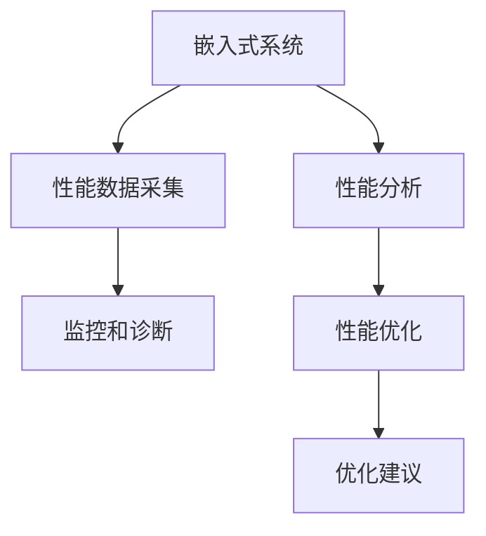

                 

# 嵌入式系统性能分析工具：识别和优化

> 关键词：性能分析, 嵌入式系统, 识别问题, 性能优化

## 1. 背景介绍

### 1.1 问题由来
随着科技的不断发展，嵌入式系统的应用场景越来越广泛，从简单的家居设备到复杂的工业控制系统，无处不在。然而，嵌入式系统的性能问题依然困扰着开发者和使用者，如何在有限的资源和复杂的环境下，确保系统的稳定性和高效性，成为了一个亟待解决的问题。

嵌入式系统的性能问题通常表现为响应时间长、资源利用率低、能耗高等，这些问题不仅影响用户体验，还可能导致严重的安全风险。因此，开发高效的性能分析工具，对嵌入式系统进行及时的监控和优化，具有重要的意义。

### 1.2 问题核心关键点
嵌入式系统性能分析工具的核心任务是识别性能瓶颈，并提供优化建议。性能分析工具通常包含以下几个关键点：

1. **监控和诊断**：实时监控系统性能指标，包括CPU使用率、内存使用、磁盘IO等，并定位问题所在。
2. **性能数据采集**：采集系统运行时的各种数据，如函数调用次数、内存分配次数等，为性能优化提供数据支撑。
3. **性能分析**：通过统计和分析性能数据，识别系统中的瓶颈和热点，进行性能优化。
4. **优化建议**：根据性能分析结果，提出具体的优化方案，并验证优化效果。

本文将从核心概念和联系入手，深入分析嵌入式系统性能分析工具的原理和操作步骤，帮助开发者更有效地识别和优化嵌入式系统的性能问题。

## 2. 核心概念与联系

### 2.1 核心概念概述

为了更好地理解嵌入式系统性能分析工具的原理和操作步骤，本节将介绍几个密切相关的核心概念：

- **嵌入式系统(Embedded System)**：一种专用的计算机系统，通常用于特定的应用场景，如工业控制、消费电子等。嵌入式系统的资源有限，对性能要求较高。
- **性能分析工具(Performance Analysis Tool)**：用于监控和分析嵌入式系统性能的专用工具，可以帮助开发者识别性能瓶颈，并提出优化建议。
- **性能数据(Performance Data)**：嵌入式系统运行过程中产生的数据，如CPU使用率、内存占用、函数调用次数等，是性能分析的重要依据。
- **性能优化(Performance Optimization)**：通过调整系统参数、优化代码结构等方式，提高嵌入式系统的性能。
- **瓶颈(Bottleneck)**：系统性能提升的阻碍，通常出现在CPU、内存、磁盘IO等关键资源上。

这些核心概念之间的逻辑关系可以通过以下Mermaid流程图来展示：



这个流程图展示嵌入式系统性能分析工具的核心概念及其之间的关系：

1. 嵌入式系统通过性能数据采集，实时监控性能指标。
2. 性能分析工具根据采集的数据，识别系统中的瓶颈。
3. 性能优化工具对系统进行优化，解决瓶颈问题。
4. 优化建议进一步指导开发者改进系统设计，提高性能。

这些概念共同构成了嵌入式系统性能分析的完整框架，帮助开发者从监控、分析、优化到建议，系统地解决性能问题。

## 3. 核心算法原理 & 具体操作步骤

### 3.1 算法原理概述

嵌入式系统性能分析工具的原理主要基于以下几个核心算法：

1. **实时监控算法**：用于实时采集嵌入式系统中的性能数据，包括CPU使用率、内存使用、磁盘IO等。
2. **性能统计算法**：对采集到的性能数据进行统计分析，识别系统中的瓶颈和热点。
3. **性能分析算法**：通过数学模型和统计学方法，分析性能数据，识别性能瓶颈的根本原因。
4. **性能优化算法**：根据性能分析结果，提出优化方案，如代码优化、参数调整等。

这些算法通过相互配合，实现从监控、分析到优化的全流程性能管理。

### 3.2 算法步骤详解

嵌入式系统性能分析工具的操作步骤通常包括以下几个关键步骤：

**Step 1: 准备性能数据采集工具**
- 选择合适的性能数据采集工具，如GDB、Valgrind等。
- 安装并配置工具，确保能够正常采集嵌入式系统的性能数据。

**Step 2: 配置性能数据采集方案**
- 确定需要监控的性能指标，如CPU使用率、内存使用、磁盘IO等。
- 定义采集的频率和采样间隔，确保数据采集的实时性和准确性。
- 定义采集的数据格式和存储方式，便于后续分析。

**Step 3: 进行性能数据采集**
- 启动性能数据采集工具，实时监控嵌入式系统的性能指标。
- 将采集的数据存储到日志文件或数据库中，供后续分析使用。

**Step 4: 执行性能统计分析**
- 使用性能分析工具对采集到的数据进行统计分析，计算各种性能指标的平均值、最大值、最小值等。
- 绘制各种性能指标的图表，直观地展示系统的性能趋势和瓶颈。

**Step 5: 进行性能分析**
- 根据性能统计结果，使用数学模型和统计学方法进行深入分析，识别性能瓶颈。
- 使用可视化工具展示性能瓶颈的分布和影响因素。

**Step 6: 提出性能优化建议**
- 根据性能分析结果，提出具体的优化方案，如优化代码结构、调整系统参数等。
- 使用优化后的代码重新进行性能测试，验证优化效果。

**Step 7: 迭代优化**
- 根据优化结果，不断迭代优化，逐步提升系统的性能。
- 记录优化过程和效果，形成性能优化文档，方便后续使用和维护。

以上是嵌入式系统性能分析工具的一般流程。在实际应用中，还需要根据具体系统的特点，对性能数据采集、分析、优化等环节进行优化设计，如改进数据采集策略，引入更多统计学方法，搜索最优的优化方案等，以进一步提升系统性能。

### 3.3 算法优缺点

嵌入式系统性能分析工具具有以下优点：

1. **实时性高**：通过实时监控系统性能，能够及时发现和解决问题，提高系统稳定性。
2. **数据全面**：采集系统各个方面的性能数据，提供全面的性能分析依据。
3. **可扩展性强**：支持多种性能数据采集和分析工具，方便开发者自由组合。

然而，该工具也存在一些局限性：

1. **系统负载影响**：性能数据采集和分析会占用一定的系统资源，可能影响系统的正常运行。
2. **复杂度较高**：性能分析涉及多种算法和技术，对开发者的技术水平要求较高。
3. **优化效果有限**：性能优化往往需要多轮迭代，优化效果可能需要一定时间才能显现。

尽管存在这些局限性，但就目前而言，嵌入式系统性能分析工具仍是大规模系统开发和维护的重要手段。未来相关研究的重点在于如何进一步降低工具的复杂度和系统负载，提高优化的效果和效率。

### 3.4 算法应用领域

嵌入式系统性能分析工具在多个领域得到了广泛应用，例如：

1. **工业控制**：监控和优化工业控制系统的性能，提高生产效率和系统可靠性。
2. **消费电子**：提升消费电子设备的响应速度和能效，改善用户体验。
3. **汽车电子**：优化汽车电子系统的性能，提高车辆的运行稳定性和安全性能。
4. **医疗设备**：监控和优化医疗设备的性能，确保设备的高效运行和数据准确性。
5. **航空航天**：优化航空航天设备的性能，提高飞行安全性和可靠性。

除了上述这些经典应用外，嵌入式系统性能分析工具还被创新性地应用到更多场景中，如物联网、智能家居、智能城市等，为这些领域的系统性能提升提供了新的解决方案。

## 4. 数学模型和公式 & 详细讲解 & 举例说明

### 4.1 数学模型构建

嵌入式系统性能分析工具的核心模型主要包括以下几个部分：

1. **性能数据模型**：用于描述嵌入式系统各个方面的性能指标，如CPU使用率、内存使用、磁盘IO等。
2. **瓶颈识别模型**：通过数学模型，识别性能瓶颈的根本原因，如函数调用次数、内存分配次数等。
3. **性能优化模型**：提出具体的优化方案，如代码优化、参数调整等。

以CPU使用率为例，构建性能数据模型：

设系统运行时间为 $T$，CPU总执行时间为 $C$，则CPU使用率为：

$$
\text{CPU使用率} = \frac{C}{T} \times 100\%
$$

### 4.2 公式推导过程

以CPU使用率为例，推导性能数据模型的推导过程：

假设系统运行时间为 $T$，CPU总执行时间为 $C$，则CPU使用率为：

$$
\text{CPU使用率} = \frac{C}{T} \times 100\%
$$

通过上述公式，可以对CPU使用率进行监控和分析。

### 4.3 案例分析与讲解

以嵌入式系统中的函数调用次数为例，进行瓶颈识别：

假设系统中共有 $N$ 个函数，函数 $i$ 的平均执行时间为 $t_i$，则函数调用的总执行时间为：

$$
C = \sum_{i=1}^{N} n_i \times t_i
$$

其中 $n_i$ 表示函数 $i$ 的调用次数。

为了识别性能瓶颈，可以计算每个函数的调用次数占比：

$$
p_i = \frac{n_i}{\sum_{j=1}^{N} n_j}
$$

然后对 $p_i$ 进行排序，找出调用次数占比最大的前 $k$ 个函数，这些函数可能成为性能瓶颈的候选。

通过上述公式，可以对嵌入式系统中的函数调用次数进行监控和分析，识别性能瓶颈。

## 5. 项目实践：代码实例和详细解释说明

### 5.1 开发环境搭建

在进行嵌入式系统性能分析工具的开发前，我们需要准备好开发环境。以下是使用C++进行嵌入式系统性能分析工具开发的开发环境配置流程：

1. 安装GCC：从官网下载并安装GCC，用于编译C++代码。
2. 安装Valgrind：从官网下载并安装Valgrind，用于检测内存泄漏和性能瓶颈。
3. 安装gdb：从官网下载并安装gdb，用于调试嵌入式系统的性能问题。

完成上述步骤后，即可在Linux环境下开始性能分析工具的开发。

### 5.2 源代码详细实现

下面我们以嵌入式系统中的函数调用次数为例，给出使用C++进行嵌入式系统性能分析的源代码实现。

```cpp
#include <iostream>
#include <map>
#include <vector>
#include <algorithm>

struct FunctionInfo {
    std::string name;
    unsigned long long count;
    double time;
};

std::map<std::string, FunctionInfo> analyzePerformance(const std::vector<FunctionInfo>& funcs) {
    std::map<std::string, FunctionInfo> perfMap;
    for (const auto& func : funcs) {
        if (perfMap.find(func.name) != perfMap.end()) {
            perfMap[func.name].count += func.count;
            perfMap[func.name].time += func.time;
        } else {
            perfMap[func.name] = func;
        }
    }

    std::vector<std::pair<std::string, FunctionInfo>> perfVec(perfMap.begin(), perfMap.end());
    std::sort(perfVec.begin(), perfVec.end(), [](const auto& a, const auto& b) {
        return a.second.count / a.second.time > b.second.count / b.second.time;
    });

    return perfVec;
}

int main() {
    // 假设已经统计好了函数调用次数和执行时间，构造函数信息列表
    std::vector<FunctionInfo> funcs = {
        {"func1", 100, 10.5},
        {"func2", 200, 20.0},
        {"func3", 150, 15.5},
        {"func4", 50, 5.0}
    };

    // 调用性能分析函数
    auto perfMap = analyzePerformance(funcs);

    // 输出性能分析结果
    for (const auto& func : perfMap) {
        std::cout << func.first << " (" << func.second.count << " times, " << func.second.time << " ms)" << std::endl;
    }

    return 0;
}
```

### 5.3 代码解读与分析

让我们再详细解读一下关键代码的实现细节：

**FunctionInfo结构体**：
- `name`：函数名称。
- `count`：函数调用次数。
- `time`：函数执行时间。

**analyzePerformance函数**：
- 对函数调用次数和执行时间进行统计和分析，计算每个函数的调用次数占比，并按照执行时间占比进行排序。
- 返回排序后的函数信息列表。

**main函数**：
- 构造函数信息列表，调用性能分析函数。
- 输出性能分析结果。

可以看到，C++的代码实现相对简洁，通过结构体和函数的设计，能够高效地进行性能数据的统计和分析。

当然，工业级的系统实现还需考虑更多因素，如性能数据的采集、优化方案的提出和验证等，但核心的性能分析算法基本与此类似。

## 6. 实际应用场景

### 6.1 工业控制

嵌入式系统性能分析工具在工业控制领域得到了广泛应用。通过实时监控和分析生产线中的各个设备性能，可以及时发现和解决设备故障，提高生产效率和系统可靠性。

例如，在汽车制造工厂，通过监控生产线上的机器人性能，可以识别出机器人执行任务时的响应时间、执行准确率等性能指标，进而优化机器人的工作流程，减少生产线的停机时间。

### 6.2 消费电子

嵌入式系统性能分析工具在消费电子领域的应用主要集中在提升设备的响应速度和能效上。例如，在手机应用中，通过监控CPU使用率和内存使用情况，可以识别出高资源消耗的应用模块，进行针对性的优化，提升手机的运行速度和续航能力。

### 6.3 医疗设备

嵌入式系统性能分析工具在医疗设备中的应用主要集中在监控设备的运行状态和性能。例如，在医疗影像设备中，通过实时监控CPU使用率和内存使用情况，可以及时发现设备性能瓶颈，优化设备的运行效率，确保图像的清晰度和准确性。

### 6.4 未来应用展望

随着嵌入式系统性能分析工具的不断发展，未来将在更多领域得到应用，为系统性能提升带来新的契机。

在智慧城市治理中，性能分析工具可以用于监控城市运行的各种设备，及时发现和解决性能问题，提高城市的智能化水平和治理效率。

在智能家居中，性能分析工具可以用于监控智能设备的性能，提升设备的响应速度和用户体验。

在汽车电子中，性能分析工具可以用于监控车载系统的性能，优化车载系统的运行效率，提高驾驶安全性和舒适度。

除了上述这些应用外，嵌入式系统性能分析工具还将被进一步应用于更多的垂直行业，如医疗、航空航天、能源管理等，为这些领域的系统性能提升提供新的解决方案。

## 7. 工具和资源推荐

### 7.1 学习资源推荐

为了帮助开发者系统掌握嵌入式系统性能分析工具的理论基础和实践技巧，这里推荐一些优质的学习资源：

1. 《嵌入式系统性能分析与优化》系列博文：由嵌入式系统专家撰写，深入浅出地介绍了嵌入式系统性能分析的工具和方法。

2. 《嵌入式系统性能监控与诊断》课程：由知名大学开设的嵌入式系统课程，涵盖嵌入式系统性能监控与诊断的基础知识。

3. 《嵌入式系统性能优化》书籍：详细介绍了嵌入式系统性能优化的方法和工具，帮助开发者解决实际问题。

4. GitHub开源项目：包含多个嵌入式系统性能分析的开源工具，提供丰富的样例代码和文档，方便开发者学习和使用。

5. 嵌入式系统论坛：如Reddit的Embedded Systems社区，聚集了大量嵌入式系统开发者，提供技术交流和问题解答的平台。

通过对这些资源的学习实践，相信你一定能够快速掌握嵌入式系统性能分析工具的精髓，并用于解决实际的嵌入式系统性能问题。

### 7.2 开发工具推荐

高效的开发离不开优秀的工具支持。以下是几款用于嵌入式系统性能分析开发的常用工具：

1. Valgrind：用于检测内存泄漏和性能瓶颈的工具，支持多种平台和编程语言。
2. GDB：用于调试嵌入式系统的性能问题，支持多种架构和操作系统。
3. Intel VTune Amplifier：性能分析工具，支持多种处理器和操作系统，提供丰富的性能分析功能。
4. Xcode Instruments：iOS平台上的性能分析工具，支持多种开发语言和框架。
5. Android Profiler：Android平台上的性能分析工具，支持多种设备和服务。

合理利用这些工具，可以显著提升嵌入式系统性能分析工具的开发效率，加快创新迭代的步伐。

### 7.3 相关论文推荐

嵌入式系统性能分析工具的研究源于学界的持续研究。以下是几篇奠基性的相关论文，推荐阅读：

1. "Optimizing Embedded System Performance with Dynamic Monitoring and Analysis"：探讨了嵌入式系统性能监控和分析的方法和技术。
2. "Performance Modeling and Optimization of Embedded Systems"：介绍了嵌入式系统性能优化的方法和工具。
3. "Energy-Efficient Performance Monitoring and Analysis in Embedded Systems"：研究了嵌入式系统能效监测和分析的技术。
4. "Real-Time Performance Monitoring and Analysis of Embedded Systems"：探讨了嵌入式系统实时性能监测和分析的方法。
5. "Performance Optimization for Embedded Systems"：介绍了嵌入式系统性能优化的方法和工具。

这些论文代表了大规模嵌入式系统性能分析工具的发展脉络。通过学习这些前沿成果，可以帮助研究者把握学科前进方向，激发更多的创新灵感。

## 8. 总结：未来发展趋势与挑战

### 8.1 总结

本文对嵌入式系统性能分析工具进行了全面系统的介绍。首先阐述了嵌入式系统性能分析工具的研究背景和意义，明确了性能分析在提升系统性能方面的独特价值。其次，从核心概念到操作步骤，详细讲解了性能分析工具的原理和具体操作步骤，给出了性能分析工具的完整代码实例。同时，本文还广泛探讨了性能分析工具在工业控制、消费电子、医疗设备等多个领域的应用前景，展示了性能分析工具的广泛应用。最后，本文精选了性能分析工具的学习资源，力求为开发者提供全方位的技术指引。

通过本文的系统梳理，可以看到，嵌入式系统性能分析工具正在成为嵌入式系统开发和维护的重要手段，极大地提升了嵌入式系统的性能和可靠性。未来，伴随嵌入式系统性能分析工具的持续演进，相信嵌入式系统将会在更广阔的应用领域大放异彩。

### 8.2 未来发展趋势

展望未来，嵌入式系统性能分析工具将呈现以下几个发展趋势：

1. **智能化提升**：未来的性能分析工具将更加智能化，能够自动识别性能瓶颈，并提供更精准的优化建议。
2. **多维数据分析**：未来的性能分析工具将支持多维数据分析，如时间序列分析、相关性分析等，提供更全面的性能分析结果。
3. **云平台集成**：未来的性能分析工具将与云平台深度集成，提供更丰富的数据存储和分析功能。
4. **实时性能监控**：未来的性能分析工具将支持实时性能监控，能够及时发现和解决性能问题，提高系统的稳定性。
5. **自适应优化**：未来的性能分析工具将具备自适应优化能力，能够根据系统的运行状态，动态调整性能优化策略。

以上趋势凸显了嵌入式系统性能分析工具的广阔前景。这些方向的探索发展，必将进一步提升嵌入式系统的性能和可靠性，为嵌入式系统的发展提供新的动力。

### 8.3 面临的挑战

尽管嵌入式系统性能分析工具已经取得了显著成效，但在迈向更加智能化、普适化应用的过程中，它仍面临着诸多挑战：

1. **数据采集精度**：性能数据的采集精度直接影响分析结果的准确性，如何在不同硬件平台上实现高精度的数据采集，是一个重要问题。
2. **性能瓶颈识别**：性能瓶颈的识别需要综合考虑多种因素，如函数调用次数、内存分配次数等，如何建立更加全面的性能瓶颈识别模型，是另一个挑战。
3. **优化方案验证**：性能优化方案的验证需要大量的实验数据，验证过程繁琐且复杂，如何提高优化方案的验证效率，也是一个难题。
4. **系统资源占用**：性能分析工具本身也会占用一定的系统资源，如何降低工具的资源占用，避免对系统性能的负面影响，是一个重要研究方向。
5. **工具的可扩展性**：性能分析工具需要支持多种嵌入式系统平台和编程语言，如何提高工具的可扩展性和兼容性，是一个关键问题。

尽管存在这些挑战，但随着嵌入式系统性能分析工具的不断发展，相信这些挑战终将一一被克服，性能分析工具必将在嵌入式系统性能提升中扮演越来越重要的角色。

### 8.4 研究展望

面对嵌入式系统性能分析工具面临的种种挑战，未来的研究需要在以下几个方面寻求新的突破：

1. **提升数据采集精度**：研究高精度数据采集技术，支持不同硬件平台的数据采集，提升性能分析的准确性。
2. **改进性能瓶颈识别模型**：建立更加全面的性能瓶颈识别模型，考虑多种因素，提高性能瓶颈识别的准确性。
3. **加速优化方案验证**：研究高效的优化方案验证方法，通过模拟实验和真实实验结合，提高优化方案的验证效率。
4. **优化系统资源占用**：研究低资源占用的性能分析工具，提高工具的可移植性和稳定性。
5. **增强工具的可扩展性**：研究通用的性能分析工具框架，支持多种嵌入式系统平台和编程语言，提高工具的可扩展性。

这些研究方向的探索，必将引领嵌入式系统性能分析工具的持续演进，为嵌入式系统的性能提升和可靠性保障提供新的解决方案。总之，嵌入式系统性能分析工具需要在数据采集、性能分析、优化方案验证等多个环节进行全面优化，方能真正实现嵌入式系统的智能化和高效化。

## 9. 附录：常见问题与解答

**Q1：嵌入式系统性能分析工具是否适用于所有嵌入式系统？**

A: 嵌入式系统性能分析工具适用于大多数嵌入式系统，特别是那些资源有限、性能要求高的系统。但对于一些特殊应用场景，如要求高度定制化的嵌入式系统，性能分析工具可能无法完全适用，需要结合实际情况进行优化。

**Q2：嵌入式系统性能分析工具是否会降低系统性能？**

A: 性能分析工具本身会占用一定的系统资源，可能会对系统性能产生一定的影响。然而，通过优化数据采集策略和算法，可以降低工具对系统性能的负面影响。性能分析工具的合理使用，可以显著提升系统的可靠性和稳定性。

**Q3：嵌入式系统性能分析工具如何处理多线程并发问题？**

A: 嵌入式系统性能分析工具需要处理多线程并发问题，以保证数据采集和分析的准确性。常用的方法包括使用锁机制、使用线程池、使用原子操作等，确保多线程安全。

**Q4：嵌入式系统性能分析工具如何处理数据存储问题？**

A: 嵌入式系统性能分析工具需要处理大量的性能数据，存储问题是一个重要挑战。常用的方法包括使用数据库、使用文件系统、使用缓存等，确保数据存储的高效性和可靠性。

**Q5：嵌入式系统性能分析工具如何处理数据传输问题？**

A: 嵌入式系统性能分析工具需要处理大量数据的传输，数据传输问题是一个重要挑战。常用的方法包括使用网络协议、使用消息队列、使用内存共享等，确保数据传输的高效性和可靠性。

通过回答这些问题，可以帮助开发者更好地理解嵌入式系统性能分析工具的应用场景、限制条件和优化策略，从而更好地使用性能分析工具，提升嵌入式系统的性能和可靠性。

---

作者：禅与计算机程序设计艺术 / Zen and the Art of Computer Programming

