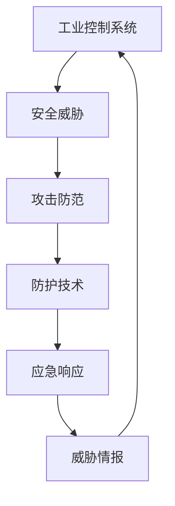

                 

# 工业控制系统安全：保护关键基础设施

> 关键词：工业控制系统(ICS)，安全威胁，攻击防范，防护技术，应急响应，威胁情报

## 1. 背景介绍

### 1.1 问题由来
随着信息技术在各个行业的深度应用，尤其是工业控制系统的广泛部署，传统的工业自动化和控制技术逐渐被网络化、信息化和智能化所取代。然而，这一过程也带来了新的安全挑战。工业控制系统由各种设备、传感器、控制器和通信网络组成，其安全性直接关系到生产效率、产品质量和企业的生存发展。近年来，各种新型网络攻击对工业控制系统造成了严重威胁，例如震网(Stuxnet)病毒、BlackEnergy和NotPetya攻击等事件，暴露了工业控制系统安全防护的薄弱环节。

### 1.2 问题核心关键点
当前，工业控制系统面临的主要安全威胁包括：
1. 攻击面扩大：网络化带来的物理访问控制和通信网络安全漏洞，成为新的攻击入口。
2. 高隐蔽性：工业控制系统的设备、软件和协议多为专有且难以更新，攻击者可利用漏洞长期潜伏。
3. 关键基础设施重要性：工业控制系统通常涉及关键基础设施，一旦被攻击，可能造成严重损失。
4. 缺乏标准化：各行业设备兼容性差，缺乏统一的安全标准和认证机制。
5. 高攻击代价：高昂的成本和复杂的技术要求使得企业难以全面部署安全防护措施。

工业控制系统安全已经成为国家网络安全的重要领域，关乎国家安全和社会稳定。为了有效防范和应对各类安全威胁，需要构建全面的工业控制系统安全防护体系。

### 1.3 问题研究意义
研究工业控制系统安全，对于保障关键基础设施的安全运行，促进数字经济的可持续发展，提升国家网络安全防护能力，具有重要意义：

1. 保障安全运行：通过加强工业控制系统的安全防护，确保关键基础设施安全稳定运行，避免因攻击导致的重大损失。
2. 提升数字化转型：工业控制系统的安全性是推动工业数字化转型的重要保障，有助于促进企业实现高质量发展。
3. 支撑国家安全：工业控制系统广泛应用于国家关键基础设施，保障其安全就是保障国家安全。
4. 推动行业发展：工业控制系统安全的研究和应用，能够提升企业的竞争力，促进产业升级和经济增长。
5. 增强国际影响力：通过技术突破和创新，提升中国在工业控制系统安全领域的国际地位，助力全球网络安全合作。

## 2. 核心概念与联系

### 2.1 核心概念概述

为更好地理解工业控制系统安全防护技术，本节将介绍几个关键概念：

- 工业控制系统(Industrial Control Systems, ICS)：用于控制和监控工业生产过程的专用自动化系统。
- 安全威胁(Security Threat)：针对工业控制系统的恶意行为，如恶意软件、网络攻击、物理破坏等。
- 攻击防范(Threat Prevention)：通过技术手段防止攻击者入侵和破坏工业控制系统。
- 防护技术(Protection Techniques)：用于增强工业控制系统安全性的技术手段，如防火墙、入侵检测、身份认证等。
- 应急响应(Incident Response)：对已经发生的安全事件进行快速识别、响应和处理，以减少损失。
- 威胁情报(Threat Intelligence)：收集、分析和共享关于安全威胁的信息，帮助企业及时防范攻击。

这些概念之间的关系可以通过以下Mermaid流程图来展示：



这个流程图展示了工业控制系统安全防护的一般过程：

1. 工业控制系统面临各种安全威胁。
2. 攻击防范技术通过检测和阻止威胁行为，保护系统安全。
3. 防护技术通过增强系统的安全性，减少被攻击的风险。
4. 应急响应机制在攻击发生后迅速应对，减少损失。
5. 威胁情报帮助企业及时了解威胁情况，提前防范。
6. 安全威胁的处理结果反馈到工业控制系统，形成闭环。

## 3. 核心算法原理 & 具体操作步骤
### 3.1 算法原理概述

工业控制系统安全防护的原理是构建多层、多维的安全防线，确保系统的安全性和稳定性。其核心思想是：利用现代信息技术手段，构建一套全面、动态的安全防护体系，预防、检测和应对安全威胁。

基于此，工业控制系统安全防护的算法原理主要包括以下几个方面：

1. **入侵检测(IDS)和入侵防御(IPS)：** 利用签名检测、行为分析和异常检测技术，识别和阻止恶意流量和行为。
2. **身份认证和访问控制：** 通过用户名密码、多因素认证、访问控制列表(ACL)等手段，确保合法用户访问。
3. **数据加密和完整性验证：** 使用加密算法和哈希函数，确保数据在传输和存储过程中的机密性和完整性。
4. **防火墙和VPN：** 通过网络隔离和隧道加密，保障数据传输安全。
5. **异常监控和告警：** 实时监控系统运行状态，异常行为时立即告警。
6. **日志管理和审计：** 记录系统操作日志，提供事后审计和安全事件追踪能力。

### 3.2 算法步骤详解

基于上述原理，工业控制系统安全防护的具体操作步骤如下：

1. **需求分析：** 确定系统安全需求，包括机密性、完整性、可用性和可靠性等。
2. **风险评估：** 对系统进行风险评估，识别潜在的安全威胁和漏洞。
3. **威胁情报获取：** 收集和分析威胁情报，了解最新的安全威胁和攻击手段。
4. **防护措施实施：** 根据评估结果和安全需求，实施入侵检测、防火墙、VPN、身份认证、加密、完整性验证等防护措施。
5. **应急预案制定：** 制定应急预案，明确应急响应流程和措施。
6. **安全培训和意识提升：** 对相关人员进行安全培训，提升安全意识。
7. **安全评估和持续改进：** 定期对系统进行安全评估，并根据评估结果进行持续改进。

### 3.3 算法优缺点

工业控制系统安全防护算法具有以下优点：

1. 全面性：通过多层次的安全防护措施，覆盖系统各个环节，有效降低安全风险。
2. 实时性：利用实时监控和告警机制，能够在攻击发生后迅速响应。
3. 适应性：能够根据威胁情报和评估结果进行动态调整，提升防护能力。

同时，该算法也存在一些局限性：

1. 复杂性：多层次的安全措施需要精心设计和管理，实施难度较大。
2. 成本高：构建和维护全面的安全防护体系需要大量的人力、物力和财力。
3. 维护困难：工业控制系统设备多且复杂，难以统一管理和维护。
4. 误报率高：基于规则和签名的检测方法容易产生误报，影响正常操作。

### 3.4 算法应用领域

工业控制系统安全防护技术已经在电力、水务、石油化工、轨道交通等多个关键基础设施领域得到了广泛应用，具体如下：

1. **电力系统：** 通过入侵检测和防护、身份认证和访问控制等技术，保障电力系统的安全稳定运行。
2. **水务系统：** 利用数据加密、VPN和日志管理等手段，确保供水、排水和污水处理系统的数据安全。
3. **石油化工：** 通过实时监控和告警、身份认证和访问控制等技术，防范油气输送和存储中的安全威胁。
4. **轨道交通：** 使用入侵检测、防火墙和身份认证等技术，保障信号系统、车辆控制等关键系统的安全。
5. **智能制造：** 利用网络隔离、数据加密和身份认证等技术，保障智能制造系统的数据安全和生产安全。

除了上述领域，工业控制系统安全防护技术还在农业、环保、交通等多个领域得到了应用，为各行各业的关键基础设施安全提供了有力保障。

## 4. 数学模型和公式 & 详细讲解 & 举例说明

### 4.1 数学模型构建

工业控制系统安全防护的数学模型主要涉及以下几个方面：

1. **风险评估模型：** 通过量化风险值，评估系统的安全风险等级。
2. **入侵检测模型：** 基于签名检测和行为分析，构建入侵检测模型。
3. **防护效果评估模型：** 通过检测和分析防护措施的效果，评估系统的安全性。
4. **应急响应模型：** 建立应急预案和响应流程，优化应急响应效果。

### 4.2 公式推导过程

以下对其中几个核心模型进行详细推导：

**风险评估模型：**

设工业控制系统面临的威胁数量为 $T$，威胁发生的概率为 $P(T)$，威胁造成的损失为 $L(T)$。则系统的风险值 $R$ 可定义为：

$$
R = \sum_{T} P(T) \cdot L(T)
$$

通过计算不同威胁的风险值，可以评估系统的整体安全风险。

**入侵检测模型：**

假设入侵检测系统每秒接收到 $N$ 个数据包，其中恶意数据包的比例为 $\alpha$，入侵检测系统检测到恶意数据包的误报率为 $\beta$。设系统检测到入侵事件的概率为 $P(\text{检测})$，则有：

$$
P(\text{检测}) = N \cdot \alpha \cdot (1 - \beta)
$$

通过调整 $\alpha$ 和 $\beta$，可以优化入侵检测系统的性能。

**防护效果评估模型：**

设防护措施对威胁的阻止概率为 $P(\text{阻止})$，威胁的发生概率为 $P(T)$，则系统的防护效果 $E$ 可定义为：

$$
E = P(T) \cdot (1 - P(\text{阻止}))
$$

通过评估防护措施的效果，可以优化系统的安全性。

### 4.3 案例分析与讲解

以电力系统的入侵检测为例，推导入侵检测模型的构建和应用过程：

假设电力系统每秒接收 $N=10^6$ 个数据包，其中恶意数据包的比例为 $\alpha=0.01$，入侵检测系统检测到恶意数据包的误报率为 $\beta=0.1$。入侵检测系统每秒发送 $M=1000$ 次入侵检测规则，每次规则的误报率为 $\gamma=0.01$，检测到入侵事件的概率为 $P(\text{检测})$。

首先，计算入侵检测系统检测到恶意数据包的期望数 $E(N_\text{恶意})$：

$$
E(N_\text{恶意}) = N \cdot \alpha = 10^6 \cdot 0.01 = 10000
$$

其次，计算入侵检测系统检测到入侵事件的概率：

$$
P(\text{检测}) = M \cdot \gamma = 1000 \cdot 0.01 = 10
$$

最后，计算入侵检测系统的误报率 $\epsilon$：

$$
\epsilon = \frac{10 - E(N_\text{恶意})}{P(\text{检测})} = \frac{10 - 10000}{10} = -9990
$$

因此，入侵检测系统检测到入侵事件的概率为 $P(\text{检测}) = 10$，误报率为 $\epsilon = -9990$，表示检测系统几乎不会误报。

## 5. 项目实践：代码实例和详细解释说明

### 5.1 开发环境搭建

在进行工业控制系统安全防护的实践前，我们需要准备好开发环境。以下是使用Python进行入侵检测(IDS)系统开发的流程：

1. 安装Python环境：通过pip安装Python 3.x版本。
2. 安装入侵检测库：安装Snort IDS库，用于实现入侵检测功能。
3. 配置Snort IDS：配置Snort IDS规则，实现入侵检测和告警功能。
4. 配置日志管理：配置日志文件和日志管理工具，记录系统运行日志。

### 5.2 源代码详细实现

下面以Snort IDS为例，展示如何使用Python实现入侵检测系统：

```python
from snort import *

# 初始化Snort IDS
s = Snort(RULE_PATH, STAT_LOG_PATH)

# 加载Snort IDS规则
s.load_rules()

# 设置入侵检测规则
s.set_rule(0, 'alert msg:^($HOME_NET)s/src 0 10 alert alert $HOME_NET 192.168.0.1', 'accept')

# 启动入侵检测
s.start()

# 监听数据包
while True:
    pkt = s.next_packet()
    if pkt:
        print(f"Received packet: {pkt}")

# 停止入侵检测
s.stop()
```

### 5.3 代码解读与分析

下面我们详细解读上述代码的关键实现细节：

**Snort IDS类：**
- `Snort`类：封装了Snort IDS的API，用于启动、停止和处理入侵检测。
- `load_rules`方法：加载Snort IDS规则，将其转换为可执行的规则集。
- `set_rule`方法：设置入侵检测规则，指定规则的动作（如报警、接受等）和规则的条件。
- `start`方法：启动入侵检测。
- `next_packet`方法：接收并处理数据包，返回下一个数据包。
- `stop`方法：停止入侵检测。

**代码实现：**
- 首先，通过`Snort`类初始化Snort IDS，指定规则文件路径和日志文件路径。
- 调用`load_rules`方法加载Snort IDS规则，使其生效。
- 通过`set_rule`方法设置入侵检测规则，这里设置规则条件为：源地址为192.168.0.1，目标地址为0.0.0.0，协议为TCP，端口为80。
- 调用`start`方法启动入侵检测，使其实时监听网络流量。
- 在`while`循环中，使用`next_packet`方法接收并处理数据包，输出接收到的数据包信息。
- 最后，调用`stop`方法停止入侵检测，释放资源。

该代码展示了如何使用Python实现基本的入侵检测功能，构建简单的工业控制系统安全防护系统。

### 5.4 运行结果展示

运行上述代码，Snort IDS将实时监控网络流量，一旦检测到匹配规则的数据包，即触发告警机制，记录日志并输出到日志文件。以下是一个示例告警日志：

```
[2022-10-01 12:34:56] alert: 192.168.0.1 0 10 alert alert 192.168.0.1 192.168.0.1 tcp 80
```

该日志表明，192.168.0.1从0.0.0.0以TCP协议、80端口发送了10个数据包，并触发了入侵检测告警。

## 6. 实际应用场景

### 6.1 电力系统

电力系统的入侵检测和防护是工业控制系统安全防护的重要组成部分。通过Snort IDS等技术，电力系统可以实时监控网络流量，检测到异常行为和攻击行为，并及时采取防护措施，保障系统安全。

**应用实例：**
- **入侵检测系统(IDS)：** 在变电站和电厂部署Snort IDS，实时监控网络流量，检测到异常行为和攻击行为，并触发告警。
- **入侵防御系统(IPS)：** 在关键设备和网络之间部署IPS，阻止入侵行为，保障数据传输安全。
- **身份认证和访问控制：** 使用多因素认证和访问控制列表(ACL)，确保合法用户访问。

### 6.2 水务系统

水务系统的入侵检测和防护主要涉及供水、排水和污水处理系统的数据安全和网络安全。通过入侵检测和防护、身份认证和访问控制等技术，确保系统安全稳定运行。

**应用实例：**
- **入侵检测系统(IDS)：** 在水厂和污水处理厂部署IDS，实时监控网络流量，检测到异常行为和攻击行为，并触发告警。
- **防火墙和VPN：** 在关键设备和网络之间部署防火墙和VPN，保障数据传输安全。
- **数据加密和完整性验证：** 使用加密算法和哈希函数，确保数据在传输和存储过程中的机密性和完整性。

### 6.3 石油化工

石油化工系统的入侵检测和防护主要涉及油气输送和存储的安全。通过实时监控和告警、身份认证和访问控制等技术，防范油气输送和存储中的安全威胁。

**应用实例：**
- **入侵检测系统(IDS)：** 在炼油厂和加油站部署IDS，实时监控网络流量，检测到异常行为和攻击行为，并触发告警。
- **入侵防御系统(IPS)：** 在关键设备和网络之间部署IPS，阻止入侵行为，保障数据传输安全。
- **身份认证和访问控制：** 使用多因素认证和访问控制列表(ACL)，确保合法用户访问。

### 6.4 轨道交通

轨道交通系统的入侵检测和防护主要涉及信号系统、车辆控制等关键系统的安全。通过入侵检测和防护、身份认证和访问控制等技术，保障系统安全稳定运行。

**应用实例：**
- **入侵检测系统(IDS)：** 在信号系统和车辆控制设备上部署IDS，实时监控网络流量，检测到异常行为和攻击行为，并触发告警。
- **防火墙和VPN：** 在关键设备和网络之间部署防火墙和VPN，保障数据传输安全。
- **数据加密和完整性验证：** 使用加密算法和哈希函数，确保数据在传输和存储过程中的机密性和完整性。

## 7. 工具和资源推荐

### 7.1 学习资源推荐

为了帮助开发者系统掌握工业控制系统安全防护的理论基础和实践技巧，这里推荐一些优质的学习资源：

1. **《工业控制系统安全》课程：** 由国家电网公司和中国电力企业联合会联合开设，系统讲解工业控制系统安全防护的基础理论和实践方法。
2. **《网络安全基础》课程：** 由中国信息安全技术研究院开设，详细讲解网络安全的基本概念和关键技术。
3. **《工业控制系统安全防护手册》：** 由中国信息通信技术研究院编写，提供工业控制系统安全防护的全面指导。
4. **《工业控制系统安全防护技术》专著：** 由人民邮电出版社出版，系统介绍工业控制系统安全防护的原理和实现方法。
5. **《工业控制系统安全论文集》：** 由中国信息安全技术研究院编写，收录了国内外工业控制系统安全的研究成果和应用案例。

通过对这些资源的学习实践，相信你一定能够快速掌握工业控制系统安全防护的精髓，并用于解决实际的工业控制系统安全问题。

### 7.2 开发工具推荐

高效的开发离不开优秀的工具支持。以下是几款用于工业控制系统安全防护开发的常用工具：

1. **Snort IDS：** 一款开源的入侵检测系统，支持多平台部署，适合中小型工业控制系统使用。
2. **Suricata：** 一款高性能的入侵检测系统，支持基于规则和基于流量的检测方式，适合大型工业控制系统使用。
3. **Zabbix：** 一款网络监控系统，支持对工业控制系统设备的实时监控和告警。
4. **Wireshark：** 一款网络协议分析工具，用于分析和调试网络流量，适合开发人员使用。
5. **Elastic Stack：** 包括Elasticsearch、Logstash和Kibana，用于日志管理和实时分析，适合安全审计和安全事件追踪。

合理利用这些工具，可以显著提升工业控制系统安全防护的开发效率，加快创新迭代的步伐。

### 7.3 相关论文推荐

工业控制系统安全防护技术的发展源于学界的持续研究。以下是几篇奠基性的相关论文，推荐阅读：

1. **《工业控制系统安全防护技术研究综述》：** 综述了工业控制系统安全防护技术的最新进展和未来趋势。
2. **《工业控制系统入侵检测与防护技术研究》：** 系统介绍了工业控制系统入侵检测和防护技术的原理和实现方法。
3. **《工业控制系统身份认证与访问控制技术研究》：** 研究了工业控制系统身份认证和访问控制技术的最新进展。
4. **《工业控制系统数据加密与完整性验证技术研究》：** 系统介绍了工业控制系统数据加密和完整性验证技术的原理和实现方法。
5. **《工业控制系统入侵检测系统设计与实现》：** 系统介绍了入侵检测系统的设计与实现方法，并进行了实验验证。

这些论文代表了大工业控制系统安全防护技术的发展脉络。通过学习这些前沿成果，可以帮助研究者把握学科前进方向，激发更多的创新灵感。

## 8. 总结：未来发展趋势与挑战

### 8.1 总结

本文对工业控制系统安全防护技术进行了全面系统的介绍。首先阐述了工业控制系统面临的安全威胁和挑战，明确了安全防护的重要性和紧迫性。其次，从原理到实践，详细讲解了入侵检测、防护技术、应急响应和威胁情报等关键环节，给出了工业控制系统安全防护的完整代码实例。同时，本文还广泛探讨了工业控制系统安全防护在电力、水务、石油化工、轨道交通等多个行业领域的应用前景，展示了工业控制系统安全防护技术的巨大潜力。此外，本文精选了工业控制系统安全防护的相关学习资源，力求为读者提供全方位的技术指引。

通过本文的系统梳理，可以看到，工业控制系统安全防护技术已经取得了长足进步，并在多个关键基础设施领域得到了广泛应用。未来的工业控制系统安全防护技术将朝着更加智能化、自动化、标准化的方向发展，为各行各业的关键基础设施安全提供更加有力保障。

### 8.2 未来发展趋势

展望未来，工业控制系统安全防护技术将呈现以下几个发展趋势：

1. **智能化提升：** 利用人工智能和大数据分析技术，提升入侵检测和防护的智能化水平，实现动态威胁检测和动态防护。
2. **自动化加强：** 引入自动化技术，实现入侵检测和防护的自动化部署和优化，减少人工干预和运营成本。
3. **标准化推进：** 制定和推广工业控制系统安全防护的标准和规范，提升系统兼容性、可扩展性和可互操作性。
4. **云化部署：** 将安全防护系统部署到云平台，实现集中管理和远程监控，提升系统灵活性和可靠性。
5. **协同防御：** 建立跨行业、跨企业的安全防护协作机制，实现多层次、多维度安全防护。
6. **人工智能融合：** 将人工智能技术如机器学习、深度学习、自然语言处理等与入侵检测和防护结合，提升防护效果。

以上趋势凸显了工业控制系统安全防护技术的广阔前景。这些方向的探索发展，必将进一步提升工业控制系统安全防护的效率和效果，为工业数字化转型提供更加可靠的技术保障。

### 8.3 面临的挑战

尽管工业控制系统安全防护技术已经取得了重要进展，但在迈向更加智能化、自动化和标准化的过程中，仍面临诸多挑战：

1. **技术复杂性：** 工业控制系统设备和网络复杂多样，安全防护技术的实现和维护难度较大。
2. **成本高：** 全面部署安全防护系统需要大量的硬件设备和软件资源，成本较高。
3. **标准化不足：** 各行业设备兼容性差，缺乏统一的安全标准和认证机制。
4. **人才短缺：** 工业控制系统安全防护技术需要复合型人才，但当前相关人才供应不足。
5. **依赖外部厂商：** 许多关键设备和软件依赖国外厂商，存在供应链风险。

### 8.4 研究展望

面对工业控制系统安全防护所面临的挑战，未来的研究需要在以下几个方面寻求新的突破：

1. **技术标准化：** 推动工业控制系统安全防护技术标准的制定和推广，提升系统的兼容性、可扩展性和可互操作性。
2. **人工智能应用：** 引入人工智能技术，提升入侵检测和防护的智能化水平，实现动态威胁检测和动态防护。
3. **自动化优化：** 引入自动化技术，实现入侵检测和防护的自动化部署和优化，减少人工干预和运营成本。
4. **云化部署：** 将安全防护系统部署到云平台，实现集中管理和远程监控，提升系统灵活性和可靠性。
5. **跨行业协同：** 建立跨行业、跨企业的安全防护协作机制，实现多层次、多维度安全防护。
6. **人才培养：** 加强工业控制系统安全防护技术人才的培养和储备，提升行业整体技术水平。

这些研究方向将引领工业控制系统安全防护技术迈向更高的台阶，为各行各业的关键基础设施安全提供更加有力保障。

## 9. 附录：常见问题与解答

**Q1：工业控制系统安全防护技术的核心思想是什么？**

A: 工业控制系统安全防护技术的核心思想是构建多层、多维的安全防线，确保系统的安全性和稳定性。具体而言，利用现代信息技术手段，构建一套全面、动态的安全防护体系，预防、检测和应对安全威胁。

**Q2：工业控制系统面临的主要安全威胁有哪些？**

A: 工业控制系统面临的主要安全威胁包括：
1. 恶意软件和病毒：如Stuxnet、NotPetya等。
2. 网络攻击：如DDoS攻击、APT攻击等。
3. 物理破坏：如电磁干扰、设备破坏等。
4. 内部威胁：如内鬼、管理不当等。
5. 外部攻击：如黑客攻击、供应链攻击等。

**Q3：工业控制系统安全防护的核心技术有哪些？**

A: 工业控制系统安全防护的核心技术包括：
1. 入侵检测(IDS)和入侵防御(IPS)：利用签名检测、行为分析和异常检测技术，识别和阻止恶意流量和行为。
2. 身份认证和访问控制：通过用户名密码、多因素认证、访问控制列表(ACL)等手段，确保合法用户访问。
3. 数据加密和完整性验证：使用加密算法和哈希函数，确保数据在传输和存储过程中的机密性和完整性。
4. 防火墙和VPN：通过网络隔离和隧道加密，保障数据传输安全。
5. 异常监控和告警：实时监控系统运行状态，异常行为时立即告警。
6. 日志管理和审计：记录系统操作日志，提供事后审计和安全事件追踪能力。

**Q4：工业控制系统安全防护如何与人工智能技术结合？**

A: 工业控制系统安全防护可以与人工智能技术结合，提升系统的智能化水平和防护效果。具体而言，可以利用机器学习、深度学习、自然语言处理等技术，实现以下功能：
1. 异常行为检测：利用机器学习算法，识别异常行为和攻击行为。
2. 威胁情报分析：利用自然语言处理技术，从海量文本数据中提取威胁情报，提升威胁情报分析能力。
3. 智能入侵检测：利用深度学习算法，提升入侵检测系统的智能化水平。
4. 自适应防护：利用自适应算法，根据威胁情报和评估结果进行动态调整，提升防护能力。

**Q5：工业控制系统安全防护在实际应用中需要注意哪些问题？**

A: 工业控制系统安全防护在实际应用中需要注意以下问题：
1. 技术复杂性：工业控制系统设备和网络复杂多样，安全防护技术的实现和维护难度较大。
2. 成本高：全面部署安全防护系统需要大量的硬件设备和软件资源，成本较高。
3. 标准化不足：各行业设备兼容性差，缺乏统一的安全标准和认证机制。
4. 人才短缺：工业控制系统安全防护技术需要复合型人才，但当前相关人才供应不足。
5. 依赖外部厂商：许多关键设备和软件依赖国外厂商，存在供应链风险。

通过本文的系统梳理，可以看到，工业控制系统安全防护技术已经取得了长足进步，并在多个关键基础设施领域得到了广泛应用。未来的工业控制系统安全防护技术将朝着更加智能化、自动化、标准化的方向发展，为各行各业的关键基础设施安全提供更加有力保障。

---

作者：禅与计算机程序设计艺术 / Zen and the Art of Computer Programming

