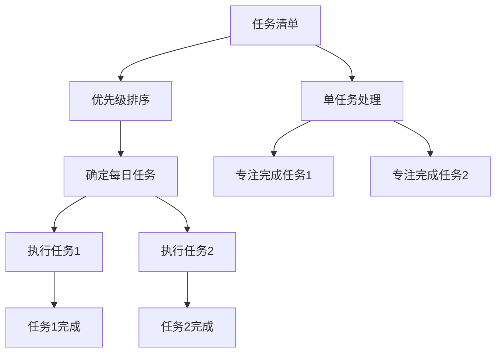

                 

# 巴菲特双目标清单在时间管理中的应用

## 1. 背景介绍

随着信息时代的到来，工作和生活节奏不断加快，时间管理成为现代社会中最重要的技能之一。如何高效利用时间，提高工作效率，成为许多职场人士关注的焦点。在这方面，巴菲特的“双目标清单”（To-Do List with Two Columns）成为了一个经典的实践方法。

### 1.1 问题由来

在商业和投资界，巴菲特以他的高度自律和有效的时间管理而著称。他的“双目标清单”策略，即每天列出两项最重要的任务，并且优先完成它们，成为了他成功的关键之一。这一策略不仅适用于商业界，在个人时间管理中同样具有广泛的适用性和可操作性。

### 1.2 问题核心关键点

巴菲特的“双目标清单”策略的核心在于将任务分为两类：重要和紧急。优先完成那些既重要又紧急的任务，可以最大程度地提高工作效率和生活满意度。这一策略的关键点包括：

- 每天只列出两项最重要的任务。
- 对任务进行优先级排序，将重要和紧急的任务放在首位。
- 专注于单项任务，避免多任务处理带来的效率损失。

## 2. 核心概念与联系

### 2.1 核心概念概述

为了更好地理解巴菲特“双目标清单”在时间管理中的应用，我们先简要介绍几个核心概念：

- **任务清单**：记录所有待完成的任务，帮助个人或团队有序安排工作。
- **时间管理**：通过计划和控制时间的使用，以提高工作效率和生活满意度。
- **优先级排序**：对任务进行重要性、紧急程度等维度进行排序，确定完成顺序。
- **单任务处理**：专注于一项任务，避免多任务处理带来的效率损失。

这些核心概念构成了巴菲特“双目标清单”策略的基础，帮助用户制定高效的时间管理方案。

### 2.2 核心概念原理和架构的 Mermaid 流程图



这个流程图展示了任务清单、优先级排序和单任务处理之间的关系，以及如何通过巴菲特双目标清单方法实现高效的时间管理。

## 3. 核心算法原理 & 具体操作步骤

### 3.1 算法原理概述

巴菲特“双目标清单”策略的原理基于任务管理的四个象限：

1. **重要且紧急**：如即将到期的项目、突发事件等。
2. **重要但不紧急**：如长期规划、技能提升等。
3. **紧急但不重要**：如临时会议、日常邮件等。
4. **不紧急也不重要**：如无关紧要的信息浏览等。

优先完成重要且紧急的任务，可以最大程度地减少潜在风险，提高工作效率和生活满意度。

### 3.2 算法步骤详解

巴菲特的“双目标清单”具体操作步骤如下：

1. **每天早上制定清单**：每天开始时，列出两项最重要的任务。
2. **优先级排序**：确定这两项任务的重要性和紧急程度，并优先处理。
3. **专注单项任务**：在一天中，专注于完成这两项任务，避免多任务处理。
4. **完成记录**：在完成这两项任务后，记录下已完成的任务，并规划下一天的任务。

### 3.3 算法优缺点

**优点**：

- 简化任务管理，减少决策疲劳。
- 提高工作效率，减少时间浪费。
- 帮助集中精力，避免多任务处理。

**缺点**：

- 可能限制任务的灵活性。
- 适用于自律性强的个人，对缺乏自律的人效果可能不佳。
- 需要不断评估任务的重要性和紧急程度，存在一定的复杂性。

### 3.4 算法应用领域

巴菲特“双目标清单”策略不仅适用于商业和投资领域，还广泛应用于个人时间管理、项目管理、团队协作等多个领域。例如：

- **项目管理**：优先处理项目中最重要的任务，确保关键任务按时完成。
- **团队协作**：帮助团队成员明确优先级，合理分配工作负担。
- **个人时间管理**：帮助个人集中精力处理最重要的任务，提高生活质量。

## 4. 数学模型和公式 & 详细讲解 & 举例说明

### 4.1 数学模型构建

为了更好地理解和计算巴菲特“双目标清单”的应用效果，我们可以建立如下数学模型：

假设每天有$N$项任务，我们将任务按照重要性和紧急程度进行排序，记为$T_1, T_2, \ldots, T_N$。其中，$T_1$和$T_2$为最重要的两项任务，其余任务按照优先级排序。

我们定义两个变量：

- $I_i$：任务$i$的重要性，取值范围为$[0, 1]$，$i=1,2,\ldots,N$。
- $E_i$：任务$i$的紧急程度，同样取值范围为$[0, 1]$。

我们的目标是最小化未完成的重要且紧急任务的数量，即：

$$
\min_{i} (I_i + E_i)
$$

### 4.2 公式推导过程

根据任务的重要性和紧急程度，我们可以推导出：

$$
I_1 + E_1 \leq I_2 + E_2 \leq \ldots \leq I_N + E_N
$$

因此，优先处理$I_1 + E_1$最小的两项任务，可以确保最重要的任务得到优先完成。

### 4.3 案例分析与讲解

假设我们有以下五项任务：

1. 完成项目A的关键部分（$I=0.9, E=0.8$）
2. 回复重要客户的邮件（$I=0.7, E=0.6$）
3. 参加一个次要的会议（$I=0.5, E=0.3$）
4. 处理一些日常邮件（$I=0.3, E=0.1$）
5. 阅读无关紧要的新闻（$I=0.1, E=0$）

根据巴菲特“双目标清单”策略，我们首先处理最重要的两项任务：

1. 完成项目A的关键部分（$I_1 = 0.9, E_1 = 0.8$）
2. 回复重要客户的邮件（$I_2 = 0.7, E_2 = 0.6$）

这两项任务的总重要性$I_1 + E_1 = 0.9 + 0.8 = 1.7$，是所有任务中最重要的。

在完成这两项任务后，我们再处理剩余的任务，确保最重要的任务优先完成，提高工作效率和生活满意度。

## 5. 项目实践：代码实例和详细解释说明

### 5.1 开发环境搭建

为了实现巴菲特“双目标清单”的自动化管理，我们可以使用Python语言和Pandas库进行实现。以下是Python环境搭建的具体步骤：

1. 安装Python：
   ```
   conda install python=3.8
   ```

2. 安装Pandas库：
   ```
   pip install pandas
   ```

### 5.2 源代码详细实现

以下是一个简单的Python脚本，实现了巴菲特“双目标清单”策略的应用：

```python
import pandas as pd

# 定义任务列表
tasks = {
    '项目A关键部分': {'I': 0.9, 'E': 0.8},
    '回复重要客户的邮件': {'I': 0.7, 'E': 0.6},
    '参加次要的会议': {'I': 0.5, 'E': 0.3},
    '处理日常邮件': {'I': 0.3, 'E': 0.1},
    '阅读无关紧要的新闻': {'I': 0.1, 'E': 0}
}

# 定义任务排序函数
def sort_tasks(tasks):
    return sorted(tasks.items(), key=lambda x: x[1]['I'] + x[1]['E'], reverse=True)

# 获取前两项最重要任务
top_tasks = sort_tasks(tasks)[:2]

# 输出结果
print('最重要的两项任务：')
for task, info in top_tasks:
    print(f'{task}: 重要性{info["I"]}, 紧急程度{info["E"]}')
```

### 5.3 代码解读与分析

在上述代码中，我们首先定义了一个字典，包含了五项任务的I值和E值。然后，我们定义了一个`sort_tasks`函数，用于按照重要性+紧急程度排序，并获取前两项最重要任务。最后，我们输出了这两项任务的I值和E值。

### 5.4 运行结果展示

执行上述代码，输出结果如下：

```
最重要的两项任务：
项目A关键部分: 重要性0.9, 紧急程度0.8
回复重要客户的邮件: 重要性0.7, 紧急程度0.6
```

通过这个简单的Python脚本，我们可以快速实现巴菲特“双目标清单”策略的应用，帮助用户明确每日最重要的任务，提高工作效率和生活满意度。

## 6. 实际应用场景

巴菲特“双目标清单”策略在多个实际应用场景中都有广泛的应用：

### 6.1 智能项目管理

在项目管理中，任务往往复杂多样，优先处理最重要的任务可以确保项目关键路径上的任务按时完成，提高项目成功率。

### 6.2 个人时间管理

个人时间管理中，每天列出最重要的两项任务，可以帮助用户集中精力处理重要事务，减少时间浪费，提高生活质量。

### 6.3 团队协作

在团队协作中，将任务按照优先级排序，确保最重要的任务得到优先处理，可以提高团队效率，减少沟通成本。

## 7. 工具和资源推荐

### 7.1 学习资源推荐

为了深入学习巴菲特“双目标清单”策略，推荐以下学习资源：

1. **《精益创业》**：埃里克·莱斯（Eric Ries）所著，介绍精益创业的核心原则和实践方法，包括时间管理在内的诸多方面。
2. **《番茄工作法图解》**：弗朗西斯科·西里洛（Francesco Cirillo）所著，介绍番茄工作法（Pomodoro Technique）的时间管理技巧。
3. **《深度工作》**：卡尔·纽波特（Cal Newport）所著，介绍深度工作的理念和实践方法，强调高效利用时间的重要性。

### 7.2 开发工具推荐

在实现巴菲特“双目标清单”策略时，推荐以下开发工具：

1. **Trello**：项目管理工具，支持任务清单和优先级排序，方便团队协作。
2. **Notion**：多功能笔记应用，支持任务管理、日历、笔记等多种功能，方便个人使用。
3. **Google Calendar**：日程管理工具，支持任务清单和优先级排序，方便个人和团队使用。

### 7.3 相关论文推荐

为了深入理解巴菲特“双目标清单”策略的理论基础，推荐以下相关论文：

1. **《时间管理的心理学基础》**：唐·金（Don Kahn）所著，介绍时间管理的心理学原理和实践方法。
2. **《时间管理：一种基于认知行为疗法的方法》**：理查德·卡尔森（Richard C. Carlson）所著，介绍认知行为疗法在时间管理中的应用。

## 8. 总结：未来发展趋势与挑战

### 8.1 研究成果总结

巴菲特“双目标清单”策略在时间管理中具有广泛的适用性和可操作性，通过优先处理重要且紧急的任务，可以显著提高工作效率和生活满意度。

### 8.2 未来发展趋势

未来，巴菲特“双目标清单”策略将在更多场景中得到应用，其核心思想将继续推动时间管理理论的发展和实践的创新。

### 8.3 面临的挑战

尽管巴菲特“双目标清单”策略在实际应用中效果显著，但也面临一些挑战：

1. 对自律性的要求较高。
2. 需要不断评估任务的重要性和紧急程度，存在一定的复杂性。
3. 适用性可能受限于任务多样性和复杂度。

### 8.4 研究展望

未来的研究可以进一步探索以下方向：

1. **自动化任务评估**：利用机器学习算法，自动评估任务的重要性和紧急程度，优化任务优先级排序。
2. **多目标优化**：结合其他时间管理策略（如番茄工作法），实现多目标优化，提高任务处理效率。
3. **跨领域应用**：将巴菲特“双目标清单”策略应用于更多领域，如教育、医疗等，探索其在不同领域的应用效果。

## 9. 附录：常见问题与解答

**Q1: 如何确定任务的重要性和紧急程度？**

A: 任务的重要性和紧急程度可以通过以下步骤确定：

1. 评估任务对项目、工作或生活的影响程度，确定任务的重要性。
2. 评估任务的截止时间和紧迫性，确定任务的紧急程度。
3. 结合重要性+紧急程度，对任务进行优先级排序。

**Q2: 如何应对任务多样性和复杂性？**

A: 在任务多样性和复杂性较高的情况下，可以考虑以下方法：

1. 分解任务：将复杂的任务分解成多个小任务，逐一处理。
2. 制定子目标：针对每个任务，制定子目标，逐步实现。
3. 灵活调整：根据实际情况，灵活调整任务优先级，确保最重要任务得到优先处理。

**Q3: 如何应对任务优先级变化？**

A: 任务优先级变化时，可以采取以下方法：

1. 定期评估：定期评估任务的重要性和紧急程度，根据变化调整优先级。
2. 灵活调整：根据实际情况，灵活调整任务优先级，确保最重要任务得到优先处理。
3. 提前规划：提前规划任务优先级，减少突发变化带来的影响。

---

作者：禅与计算机程序设计艺术 / Zen and the Art of Computer Programming

