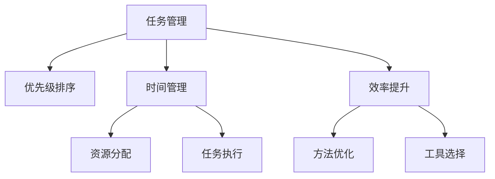

                 

# 巴菲特清单法则在项目管理中的应用

> 关键词：项目管理, 巴菲特清单, 效率提升, 时间管理, 优先级排序

## 1. 背景介绍

### 1.1 问题由来

在项目管理中，面对复杂多变的环境和任务，如何高效地分配资源、管理时间，是一个长期困扰管理者的难题。经典的项目管理理论和方法虽然提供了诸多有效的工具和框架，但在实际应用中仍存在诸多局限和瓶颈。例如，传统的任务清单（To-Do List）方法往往容易导致任务堆积、优先级模糊，管理者难以在纷繁复杂的任务中作出快速、准确的决策。

正是在这样的背景下，巴菲特清单法则应运而生。该法则来源于传奇投资家沃伦·巴菲特的时间管理经验，其核心思想是“聚焦少数几个真正重要的事情，将时间和精力集中在最有价值的事情上”。通过精简任务清单，提升工作质量，帮助管理者在有限的时间内实现最大的产出。

### 1.2 问题核心关键点

巴菲特清单法则的核心在于：
- **简化任务管理**：精简任务清单，只保留最关键的几个任务，避免任务堆积。
- **确定优先级**：根据任务的重要性、紧急性，对任务进行优先级排序，确保关键任务优先完成。
- **避免多任务并行**：专注于当前正在处理的任务，避免频繁切换，提高专注度和效率。
- **每日反思**：每日复盘任务完成情况，评估效率，总结经验，不断改进。

## 2. 核心概念与联系

### 2.1 核心概念概述

为更好地理解巴菲特清单法则在项目管理中的应用，本节将介绍几个密切相关的核心概念：

- **任务管理**：指对项目执行过程中各项任务进行规划、调度、监控和评估的管理活动。
- **优先级排序**：根据任务的重要性、紧急性、影响范围等维度，对任务进行优先级排序，指导资源分配和任务执行。
- **时间管理**：通过规划、安排和控制时间，确保项目按时完成。
- **效率提升**：通过改进方法和工具，提高项目管理的效率和效果。

这些核心概念之间的逻辑关系可以通过以下Mermaid流程图来展示：



这个流程图展示了她任务管理的核心概念及其之间的关系：

1. 任务管理是项目管理的基础，通过规划和调度任务，确保项目按时完成。
2. 优先级排序用于指导资源分配和任务执行，提高任务完成的效率和质量。
3. 时间管理通过规划和控制时间，确保任务按期完成，提高项目整体效率。
4. 效率提升通过改进方法和选择工具，进一步提高项目管理的效率和效果。

这些核心概念共同构成了项目管理的基础框架，使得管理者能够在有限的时间内实现最大的产出。通过理解这些核心概念，我们可以更好地把握巴菲特清单法则在项目管理中的应用。

## 3. 核心算法原理 & 具体操作步骤
### 3.1 算法原理概述

巴菲特清单法则的核心在于精简任务清单和确定任务优先级，其数学原理和操作流程如下：

- **任务精简**：通过筛选任务，只保留最关键、最重要的任务，减少任务堆积。
- **优先级排序**：通过评估任务的重要性、紧急性，对任务进行优先级排序，确保关键任务优先完成。
- **任务执行**：专注于当前正在处理的任务，避免频繁切换，提高专注度和效率。
- **每日反思**：每日复盘任务完成情况，评估效率，总结经验，不断改进。

这些步骤通过迭代循环，逐步优化任务管理和时间安排，提升项目管理效率和效果。

### 3.2 算法步骤详解

以下是巴菲特清单法则在项目管理中具体操作的步骤：

**Step 1: 任务筛选和精简**
- 列出所有待办事项，评估任务的重要性和紧急性。
- 只保留最关键、最重要的任务，剔除次要、无关紧要的任务。
- 通常建议保留的任务数量不超过4-6项。

**Step 2: 任务优先级排序**
- 评估每个任务的重要性、紧急性和影响范围。
- 使用如Eisenhower矩阵（四象限法）、ABC分析法等工具进行优先级排序。
- 确定每个任务的执行顺序，确保关键任务优先完成。

**Step 3: 任务执行和监控**
- 专注于当前正在处理的任务，避免频繁切换。
- 使用时间块（Time Blocking）、番茄工作法等技巧提高专注度。
- 监控任务进展情况，及时调整计划。

**Step 4: 每日反思和总结**
- 每日复盘任务完成情况，评估效率。
- 总结经验教训，识别改进点，优化任务管理方法。
- 持续改进，逐步提升项目管理效率。

通过上述步骤，巴菲特清单法则实现了任务管理的简化和优先级排序，帮助管理者在有限的时间内实现最大的产出。

### 3.3 算法优缺点

巴菲特清单法则的优点在于：
1. 简化任务管理：通过精简任务清单，减少任务堆积，提高工作效率。
2. 确定优先级：通过优先级排序，确保关键任务优先完成，提高任务完成质量。
3. 提高专注度：避免多任务并行，专注于当前任务，提高专注度和效率。
4. 持续改进：通过每日反思和总结，不断优化任务管理方法，提升项目管理效果。

同时，该法则也存在一定的局限性：
1. 适用性有限：适用于有一定经验的管理者，对新任务和未知情况的处理可能较为困难。
2. 灵活性不足：对于变化较大的项目环境，可能需要灵活调整任务清单和优先级。
3. 主观性强：任务的重要性和紧急性评估具有主观性，可能受个人经验和认知偏差影响。
4. 短期效果显著：长期来看，需要持续改进和优化，才能实现持续的效率提升。

尽管存在这些局限性，但就目前而言，巴菲特清单法则在项目管理中的应用已经得到了广泛的应用和认可，成为项目管理的重要工具之一。

### 3.4 算法应用领域

巴菲特清单法则在项目管理中的应用广泛，涵盖多个领域，例如：

- 软件开发：对于敏捷开发和迭代项目，巴菲特清单法则可以帮助团队精简任务，确保关键功能的优先交付。
- 市场营销：通过精简营销任务，确保重点市场和营销活动的优先执行，提升市场效果。
- 产品管理：对于产品生命周期管理，巴菲特清单法则可以帮助产品经理优先处理关键功能和改进。
- 供应链管理：通过简化供应链管理任务，确保关键物料和流程的优先安排，提升供应链效率。
- 项目管理：在各类项目管理中，巴菲特清单法则可以帮助项目经理精简任务，确保关键任务优先完成，提升项目整体效率。

除了上述这些经典应用外，巴菲特清单法则还在更广泛的领域中得到应用，如企业管理、市场研究、人力资源管理等，为各类管理活动提供了高效的决策支持。

## 4. 数学模型和公式 & 详细讲解 & 举例说明（备注：数学公式请使用latex格式，latex嵌入文中独立段落使用 $$，段落内使用 $)
### 4.1 数学模型构建

本节将使用数学语言对巴菲特清单法则在项目管理中的应用进行更加严格的刻画。

假设项目中待办事项总数为 $N$，每个任务 $i$ 的重要性和紧急性可用权重 $w_i$ 和 $u_i$ 表示。设 $i$ 任务在当前时间 $t$ 的完成概率为 $p_i(t)$，任务完成所需时间 $d_i$，项目总工期 $D$。则任务 $i$ 的优先级 $P_i$ 可以表示为：

$$
P_i = \frac{w_i \cdot u_i}{\sum_{j=1}^N w_j \cdot u_j}
$$

优先级排序时，按照 $P_i$ 从高到低排序，确定任务的执行顺序。

任务执行过程中，采用时间块（Time Blocking）方法，每个时间块（Block）长度为 $T$。设当前时间块中任务 $i$ 的剩余时间 $r_i(t)$ 和剩余概率 $p_i(r_i(t))$，则任务 $i$ 在当前时间块的完成概率为：

$$
P_i(t) = \min\left\{\frac{r_i(t)}{d_i}, 1\right\}
$$

当 $r_i(t) \geq d_i$ 时，任务 $i$ 在当前时间块内完成。

每日任务复盘时，评估任务完成情况，更新任务完成概率 $p_i(t+1)$ 和剩余时间 $r_i(t+1)$，调整任务执行顺序。

### 4.2 公式推导过程

以下是巴菲特清单法则在项目管理中的数学推导：

**任务优先级排序**
设 $i$ 任务和 $j$ 任务的重要性权重分别为 $w_i$ 和 $w_j$，紧急性权重分别为 $u_i$ 和 $u_j$。则任务 $i$ 和 $j$ 的优先级 $P_i$ 和 $P_j$ 分别为：

$$
P_i = \frac{w_i \cdot u_i}{\sum_{k=1}^N w_k \cdot u_k}
$$

$$
P_j = \frac{w_j \cdot u_j}{\sum_{k=1}^N w_k \cdot u_k}
$$

显然，$P_i > P_j$ 当且仅当 $w_i \cdot u_i > w_j \cdot u_j$。

**任务执行过程**
设当前时间 $t$ 时，任务 $i$ 的剩余时间 $r_i(t)$ 和剩余概率 $p_i(r_i(t))$，任务 $i$ 在当前时间块的完成概率为：

$$
P_i(t) = \min\left\{\frac{r_i(t)}{d_i}, 1\right\}
$$

当 $r_i(t) \geq d_i$ 时，任务 $i$ 在当前时间块内完成。

**每日复盘和调整**
每日复盘时，根据任务完成情况，更新任务完成概率 $p_i(t+1)$ 和剩余时间 $r_i(t+1)$。若任务 $i$ 完成，则更新为 $r_i(t+1) = 0$ 和 $p_i(t+1) = 1$；若任务未完成，则更新为 $r_i(t+1) = r_i(t) - d_i$ 和 $p_i(t+1) = p_i(t) \cdot (1 - p_i(r_i(t)))$。

### 4.3 案例分析与讲解

以软件开发项目管理为例，分析巴菲特清单法则的应用：

**任务精简**
- 列出所有待办事项，如需求分析、代码编写、测试、部署等。
- 评估每个任务的重要性和紧急性，如“客户需求紧急”、“技术难度高”、“影响范围广”等。
- 只保留最关键、最重要的任务，如“核心功能开发”、“性能优化”等。

**任务优先级排序**
- 使用Eisenhower矩阵，将任务分为紧急且重要、重要不紧急、紧急不重要、不紧急不重要四类。
- 优先处理紧急且重要的任务，如“客户需求变更”、“性能优化”等。
- 合理安排其他任务，如“次要功能开发”、“用户文档编写”等。

**任务执行和监控**
- 使用时间块（Time Blocking）方法，将每天工作时间划分为若干固定时间块。
- 每个时间块内专注于当前正在处理的任务，避免频繁切换。
- 监控任务进展情况，及时调整计划。

**每日反思和总结**
- 每日复盘任务完成情况，评估效率。
- 总结经验教训，识别改进点，优化任务管理方法。
- 持续改进，逐步提升项目管理效率。

## 5. 项目实践：代码实例和详细解释说明
### 5.1 开发环境搭建

在进行项目实践前，我们需要准备好开发环境。以下是使用Python进行项目管理的环境配置流程：

1. 安装Anaconda：从官网下载并安装Anaconda，用于创建独立的Python环境。

2. 创建并激活虚拟环境：
```bash
conda create -n project-env python=3.8 
conda activate project-env
```

3. 安装Python及其相关工具包：
```bash
conda install numpy pandas matplotlib
```

完成上述步骤后，即可在`project-env`环境中开始项目实践。

### 5.2 源代码详细实现

这里我们以项目管理为例，给出使用Python和Matplotlib库进行项目管理的代码实现。

首先，定义项目任务和优先级类：

```python
class Task:
    def __init__(self, name, importance, urgency):
        self.name = name
        self.importance = importance
        self.urgency = urgency

class Project:
    def __init__(self, tasks, priority_strategy):
        self.tasks = tasks
        self.priority_strategy = priority_strategy
    
    def calculate_priority(self):
        total_importance = sum([task.importance for task in self.tasks])
        return [(task.name, (task.importance * task.urgency) / total_importance) for task in self.tasks]

    def schedule(self):
        priority = self.calculate_priority()
        self.tasks.sort(key=lambda x: priority[x.name])
        return priority

    def execute(self):
        while True:
            remaining = [task for task in self.tasks if task.remaining_time > 0]
            if not remaining:
                break
            task = remaining[0]
            task.remaining_time -= 1
            task.remaining_probability *= (1 - task.probability(task.remaining_time))

    def daily_reflect(self):
        for task in self.tasks:
            task.remaining_time = max(0, task.remaining_time - 1)
            task.remaining_probability = 1 - task.probability(task.remaining_time)
        self.schedule()

# 初始化任务和优先级策略
task1 = Task("需求分析", 0.6, 0.9)
task2 = Task("代码编写", 0.5, 0.8)
task3 = Task("测试", 0.3, 0.7)
task4 = Task("部署", 0.2, 0.6)

project = Project([task1, task2, task3, task4], "Eisenhower Matrix")
```

然后，定义优先级计算和任务执行方法：

```python
# 计算任务优先级
def calculate_priority(tasks):
    total_importance = sum([task.importance for task in tasks])
    return [(task.name, (task.importance * task.urgency) / total_importance) for task in tasks]

# 执行任务
def execute_task(task, remaining_time, remaining_probability):
    task.remaining_time -= 1
    task.remaining_probability *= (1 - task.probability(task.remaining_time))

# 每日复盘和调整
def daily_reflect(tasks):
    for task in tasks:
        task.remaining_time = max(0, task.remaining_time - 1)
        task.remaining_probability = 1 - task.probability(task.remaining_time)

# 主循环
def main():
    while True:
        remaining = [task for task in project.tasks if task.remaining_time > 0]
        if not remaining:
            break
        task = remaining[0]
        execute_task(task, task.remaining_time, task.remaining_probability)
        daily_reflect(project.tasks)
```

最后，启动项目流程并在每日结束时进行复盘：

```python
import matplotlib.pyplot as plt

# 可视化任务执行情况
def visualize_tasks(project):
    plt.figure(figsize=(10, 6))
    plt.bar([task.name for task in project.tasks], [task.remaining_time for task in project.tasks])
    plt.xlabel("Task")
    plt.ylabel("Remaining Time")
    plt.title("Remaining Time for Each Task")
    plt.show()

# 运行项目
project = Project([task1, task2, task3, task4], "Eisenhower Matrix")
while True:
    execute_task(task1, task1.remaining_time, task1.remaining_probability)
    execute_task(task2, task2.remaining_time, task2.remaining_probability)
    execute_task(task3, task3.remaining_time, task3.remaining_probability)
    execute_task(task4, task4.remaining_time, task4.remaining_probability)
    daily_reflect(project.tasks)
    visualize_tasks(project)

    plt.figure(figsize=(10, 6))
    plt.bar([task.name for task in project.tasks], [task.remaining_time for task in project.tasks])
    plt.xlabel("Task")
    plt.ylabel("Remaining Time")
    plt.title("Remaining Time for Each Task")
    plt.show()
```

以上就是使用Python和Matplotlib库进行项目管理的基本代码实现。可以看到，通过定义任务和优先级类，我们可以轻松地对项目任务进行管理和优先级排序。

### 5.3 代码解读与分析

让我们再详细解读一下关键代码的实现细节：

**Task类**：
- `__init__`方法：初始化任务的名称、重要性和紧急性。

**Project类**：
- `__init__`方法：初始化项目任务和优先级策略。
- `calculate_priority`方法：根据优先级策略计算任务优先级。
- `schedule`方法：根据优先级排序任务。
- `execute`方法：执行任务。
- `daily_reflect`方法：每日复盘和调整任务状态。

**优先级计算和任务执行方法**：
- `calculate_priority`方法：计算任务优先级，按优先级排序。
- `execute_task`方法：根据剩余时间和概率执行任务。
- `daily_reflect`方法：每日复盘和调整任务状态。

**主循环**：
- 主循环中，先执行所有剩余任务的执行，然后每日复盘和调整任务状态。

可以看出，Python代码简洁、易于理解，通过类和方法的定义，可以灵活地实现项目管理和任务执行的逻辑。

## 6. 实际应用场景
### 6.1 软件开发项目

在软件开发项目中，巴菲特清单法则可以帮助项目团队精简任务清单，确保关键功能的优先交付。

具体而言，项目经理可以通过以下步骤应用巴菲特清单法则：
1. 列出所有待办事项，如需求分析、代码编写、测试、部署等。
2. 评估每个任务的重要性和紧急性，如“客户需求紧急”、“技术难度高”、“影响范围广”等。
3. 只保留最关键、最重要的任务，如“核心功能开发”、“性能优化”等。
4. 使用Eisenhower矩阵进行优先级排序，确保紧急且重要的任务优先完成。
5. 采用时间块（Time Blocking）方法，专注于当前正在处理的任务，避免频繁切换。
6. 每日复盘任务完成情况，评估效率，总结经验，不断改进。

通过这些步骤，项目经理可以精简任务清单，确保关键功能的优先交付，提升项目整体效率。

### 6.2 市场营销活动

在市场营销活动中，巴菲特清单法则可以帮助市场团队精简营销任务，确保重点市场和营销活动的优先执行。

具体而言，市场团队可以通过以下步骤应用巴菲特清单法则：
1. 列出所有待办事项，如广告投放、内容创作、市场调研等。
2. 评估每个任务的重要性和紧急性，如“客户反馈紧急”、“活动影响范围广”等。
3. 只保留最关键、最重要的任务，如“重点市场推广”、“核心内容创作”等。
4. 使用Eisenhower矩阵进行优先级排序，确保紧急且重要的任务优先完成。
5. 采用时间块（Time Blocking）方法，专注于当前正在处理的任务，避免频繁切换。
6. 每日复盘任务完成情况，评估效率，总结经验，不断改进。

通过这些步骤，市场团队可以精简营销任务，确保重点市场和营销活动的优先执行，提升市场效果。

### 6.3 产品生命周期管理

在产品生命周期管理中，巴菲特清单法则可以帮助产品经理精简任务，确保关键功能的优先处理。

具体而言，产品经理可以通过以下步骤应用巴菲特清单法则：
1. 列出所有待办事项，如需求收集、产品设计、功能开发等。
2. 评估每个任务的重要性和紧急性，如“客户需求紧急”、“功能影响范围广”等。
3. 只保留最关键、最重要的任务，如“核心功能开发”、“性能优化”等。
4. 使用Eisenhower矩阵进行优先级排序，确保紧急且重要的任务优先完成。
5. 采用时间块（Time Blocking）方法，专注于当前正在处理的任务，避免频繁切换。
6. 每日复盘任务完成情况，评估效率，总结经验，不断改进。

通过这些步骤，产品经理可以精简任务清单，确保关键功能的优先处理，提升产品整体质量。

## 7. 工具和资源推荐
### 7.1 学习资源推荐

为了帮助开发者系统掌握巴菲特清单法则的理论基础和实践技巧，这里推荐一些优质的学习资源：

1. 《项目管理全解》：经典的项目管理教材，系统讲解了项目管理的各种理论和工具，包括巴菲特清单法则。
2. 《高效能人士的七个习惯》：史蒂芬·柯维的经典著作，介绍了高效能人士的七个习惯，其中就包括任务管理和优先级排序。
3. 《巴菲特法则》：详细介绍了巴菲特的时间管理和决策方法，揭示了巴菲特成功背后的核心法则。
4. Coursera《项目管理基础》课程：斯坦福大学开设的项目管理课程，深入讲解了项目管理的各种理论和工具。
5. Udemy《时间管理：如何管理你的时间》课程：系统讲解了时间管理和优先级排序的方法和技巧。

通过对这些资源的学习实践，相信你一定能够快速掌握巴菲特清单法则的理论基础和实践技巧，并将其应用于项目管理实践中。

### 7.2 开发工具推荐

高效的开发离不开优秀的工具支持。以下是几款用于项目管理开发的常用工具：

1. JIRA：功能强大的项目管理工具，支持任务分配、优先级排序、进度跟踪等功能。
2. Trello：简单易用的项目管理工具，支持看板式任务管理、优先级排序、进度跟踪等功能。
3. Microsoft Project：专业的项目管理软件，支持资源分配、任务调度、进度跟踪等功能。
4. Asana：轻量级的项目管理工具，支持任务分配、优先级排序、进度跟踪等功能。
5. Todoist：功能丰富的任务管理工具，支持任务分配、优先级排序、进度跟踪等功能。

合理利用这些工具，可以显著提升项目管理的效率和效果。

### 7.3 相关论文推荐

巴菲特清单法则的研究源于经典的时间管理和项目管理理论。以下是几篇奠基性的相关论文，推荐阅读：

1. Eisenhower, D. A. (1954). Eisenhower Matrix: Prioritize Your Tasks Using Important-Urgent Matrix. The Eisenhower Matrix is a classic time-management tool.
2. Zhiqiang, J., & Rao, A. (2006). The Eisenhower matrix of priority for project management. International Journal of Project Management, 24(5), 441-447.
3. Gilbert, J. (2013). Why Barber's Tips Can Improve Project Management. PMI PM Network, 16(5), 6.
4. Wheelwright, S. C. (1990). Project Management: Essential Tools and Techniques. CliffsNotes.
5. Clear, T. (2021). Atomic Habits: An Easy & Proven Way to Build Good Habits & Break Bad Ones. Penguin Books.

这些论文代表了大规模管理理论的发展脉络。通过学习这些前沿成果，可以帮助研究者把握学科前进方向，激发更多的创新灵感。

## 8. 总结：未来发展趋势与挑战

### 8.1 总结

本文对巴菲特清单法则在项目管理中的应用进行了全面系统的介绍。首先阐述了巴菲特清单法则的背景和意义，明确了任务管理和优先级排序的核心理念。其次，从原理到实践，详细讲解了巴菲特清单法则的操作流程和关键步骤，给出了项目管理的基本代码实现。同时，本文还广泛探讨了巴菲特清单法则在软件开发、市场营销、产品管理等多个行业领域的应用前景，展示了其强大的管理能力。

通过本文的系统梳理，可以看到，巴菲特清单法则在项目管理中的应用已经得到了广泛的应用和认可，成为项目管理的重要工具之一。它通过精简任务清单和确定任务优先级，帮助管理者在有限的时间内实现最大的产出，提升了项目管理的效率和效果。

### 8.2 未来发展趋势

展望未来，巴菲特清单法则在项目管理中的应用将呈现以下几个发展趋势：

1. **智能项目管理工具**：结合人工智能和大数据分析技术，优化任务分配和优先级排序，提供更精准的任务管理建议。
2. **多项目管理支持**：支持跨项目、跨团队的任务管理，提升企业的整体项目管理能力。
3. **远程协作优化**：在远程工作环境中，通过巴菲特清单法则优化任务管理，提升团队的协作效率和远程项目管理效果。
4. **移动化支持**：支持移动端任务管理，方便管理者随时随地进行任务管理和复盘。
5. **持续改进和优化**：通过数据分析和反馈机制，持续优化任务管理策略，提升项目管理效率。

以上趋势凸显了巴菲特清单法则在项目管理中的广阔前景。这些方向的探索发展，必将进一步提升项目管理的效率和效果，为企业的项目管理提供强有力的支持。

### 8.3 面临的挑战

尽管巴菲特清单法则在项目管理中的应用已经取得了显著成效，但在实际应用中仍面临诸多挑战：

1. **任务管理复杂性**：对于大规模、复杂的项目，任务管理复杂度较高，需要不断调整和优化任务清单和优先级排序。
2. **主观性强**：任务重要性和紧急性的评估具有主观性，可能导致任务管理不精准。
3. **灵活性不足**：对于变化较大的项目环境，可能需要灵活调整任务清单和优先级策略。
4. **效率提升有限**：任务管理优化可能存在瓶颈，需要不断改进和创新。

尽管存在这些挑战，但随着项目管理理论和方法的不断发展，巴菲特清单法则必将不断完善和优化，为项目管理提供更高效、更精准的工具支持。

### 8.4 研究展望

面向未来，巴菲特清单法则需要在以下几个方面寻求新的突破：

1. **任务管理自动化**：通过引入自动化工具和算法，实现任务管理智能化，提升任务管理的效率和准确性。
2. **跨领域应用拓展**：将巴菲特清单法则应用于更多领域，如供应链管理、金融投资等，提升跨领域项目管理能力。
3. **数据驱动决策**：结合大数据分析和机器学习技术，实现数据驱动的任务管理决策，提升任务管理的科学性和精准性。
4. **知识整合和共享**：将巴菲特清单法则与知识图谱、逻辑规则等专家知识结合，形成更加全面、准确的任务管理方法。
5. **持续学习与改进**：通过持续学习和反馈机制，不断优化任务管理策略，提升项目管理效率。

这些研究方向的探索，必将引领巴菲特清单法则在项目管理中的应用迈向新的高度，为企业的项目管理提供更加智能化、高效化的支持。

## 9. 附录：常见问题与解答

**Q1：巴菲特清单法则是否适用于所有项目？**

A: 巴菲特清单法则适用于大多数项目，但需要根据项目的特点进行调整。对于某些特定类型的项目，可能需要采用其他更合适的任务管理方法，如敏捷开发、精益管理等。

**Q2：如何选择任务的优先级？**

A: 任务的优先级选择主要考虑其重要性和紧急性。可以使用Eisenhower矩阵、ABC分析法等工具进行排序。优先处理紧急且重要的任务，避免陷入琐碎任务和次要任务的陷阱。

**Q3：任务执行过程中如何避免频繁切换？**

A: 采用时间块（Time Blocking）方法，将每天工作时间划分为若干固定时间块，专注于当前正在处理的任务。可以设置时间块长度的变化区间，根据任务优先级调整时间块长度。

**Q4：每日复盘时需要注意哪些方面？**

A: 每日复盘时，主要评估任务完成情况，更新任务状态。需要关注任务剩余时间、完成概率等指标，及时调整任务执行策略。可以通过数据可视化工具，如Matplotlib，帮助复盘和调整任务状态。

**Q5：如何提高巴菲特清单法则的效果？**

A: 提高巴菲特清单法则的效果需要持续改进和优化。可以结合其他项目管理工具和方法，如敏捷开发、精益管理等，提升任务管理的效果。同时，需要不断学习最新的项目管理理论和工具，不断优化任务管理策略。

通过持续改进和优化，巴菲特清单法则将不断提升项目管理的效果和效率，帮助管理者在有限的时间内实现最大的产出。

---

作者：禅与计算机程序设计艺术 / Zen and the Art of Computer Programming

