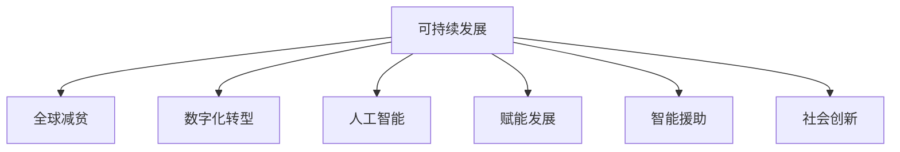

                 

# 2050年的全球减贫：从援助到赋能的可持续发展模式

> 关键词：可持续发展，全球减贫，数字化转型，人工智能，赋能发展，智能援助，社会创新，普惠金融

## 1. 背景介绍

### 1.1 全球减贫进程的现状与挑战
在过去的几十年里，全球减贫取得了显著的成就。根据联合国的报告，自1990年以来，全球贫困人口减少了约10亿，贫困率从35%下降到10%左右。然而，这一进程并非一帆风顺。尽管许多国家和地区已经成功实现了减贫目标，但仍然有数亿人口生活在极度贫困之中，尤其在非洲、亚洲和拉丁美洲等发展中国家。这些地区的贫困问题更加复杂，受教育水平低、医疗资源匮乏、基础设施落后等因素的制约，使得贫困问题难以根本解决。

### 1.2 可持续发展目标（SDGs）的提出
2015年，联合国提出了17个可持续发展目标（Sustainable Development Goals, SDGs），旨在到2030年实现全球减贫、消除饥饿、提高教育水平、实现性别平等、促进清洁能源使用、减少不平等、应对气候变化等。这些目标不仅关注经济增长，还强调了经济、社会、环境等多方面的均衡发展。

## 2. 核心概念与联系

### 2.1 核心概念概述
为了深入理解2050年全球减贫的可持续发展模式，本文将介绍以下几个核心概念：

- **可持续发展（Sustainable Development）**：指在满足当代人需求的同时，不损害后代人满足需求能力的发展模式。它强调经济、社会、环境三者的协调和平衡。

- **全球减贫（Global Poverty Reduction）**：旨在通过各种手段减少全球贫困人口，提高其生活质量，使其脱离贫困线。

- **数字化转型（Digital Transformation）**：利用信息技术，特别是数字技术和互联网，改变传统业务模式和运作方式，提升效率和创新能力。

- **人工智能（Artificial Intelligence, AI）**：通过机器学习、深度学习等技术，使计算机具备人类的认知和决策能力，应用于各个领域。

- **赋能发展（Empowerment Development）**：通过技术和教育等手段，提升个人和社区的能力，使其具备自我发展、改善生活的能力。

- **智能援助（Smart Aid）**：利用数字化技术和人工智能，优化传统援助方式，提高援助的精准性和效率。

- **社会创新（Social Innovation）**：利用创新思维和新型工具，解决社会问题，改善人类生活质量。

### 2.2 核心概念原理和架构的 Mermaid 流程图


这个流程图展示了可持续发展与全球减贫之间的联系，以及与数字化转型、人工智能、赋能发展、智能援助和社会创新之间的关系。这些概念相互影响，共同构成了未来全球减贫的可持续发展模式。

## 3. 核心算法原理 & 具体操作步骤

### 3.1 算法原理概述
全球减贫的可持续发展模式，涉及多个领域的算法和模型。本文将介绍几个关键领域的算法原理和操作步骤：

- **智能援助算法**：利用机器学习模型，分析贫困地区的特点，预测未来的减贫需求，优化援助资源的分配。

- **赋能发展算法**：通过数据分析和建模，识别贫困人口的能力提升路径，设计个性化的赋能方案。

- **社会创新算法**：利用社会网络分析、大数据挖掘等技术，识别和解决社会问题，提升社会创新的效率和效果。

- **智能援助与赋能发展的结合**：通过将智能援助算法与赋能发展算法结合，实现精准的、个性化的减贫措施。

### 3.2 算法步骤详解
#### 智能援助算法步骤：
1. **数据收集与预处理**：收集贫困地区的各类数据，如人口统计、经济状况、教育水平等，并进行清洗和标准化。
2. **模型训练**：利用机器学习模型，如随机森林、支持向量机等，对收集的数据进行训练，预测未来的减贫需求。
3. **资源分配**：根据模型的预测结果，优化援助资源的分配，确保资源利用最大化。
4. **评估与反馈**：对援助效果进行评估，收集反馈信息，调整模型和策略。

#### 赋能发展算法步骤：
1. **需求分析**：通过问卷调查、数据分析等方法，了解贫困人口的能力提升需求。
2. **方案设计**：根据需求分析结果，设计个性化的赋能方案，如教育培训、技能提升等。
3. **实施与跟踪**：实施赋能方案，并利用数据分析工具，跟踪效果，进行调整和优化。
4. **效果评估**：评估赋能方案的效果，收集反馈，优化方案。

#### 社会创新算法步骤：
1. **问题识别**：利用社会网络分析和大数据挖掘，识别社会问题。
2. **解决方案设计**：设计创新的解决方案，如社区参与、社会企业等。
3. **实施与推广**：在试点地区实施解决方案，并逐步推广到更广泛的区域。
4. **效果评估**：评估解决方案的效果，收集反馈，持续优化。

### 3.3 算法优缺点
#### 智能援助算法的优缺点：
- **优点**：
  - **精准性**：利用大数据和机器学习，可以精确预测贫困需求，优化资源分配。
  - **效率高**：自动化处理大量数据，减少人工干预，提高援助效率。
- **缺点**：
  - **数据依赖**：依赖高质量的数据，数据收集和预处理成本高。
  - **模型复杂**：模型设计复杂，需要专业知识。

#### 赋能发展算法的优缺点：
- **优点**：
  - **个性化**：根据个体需求设计方案，提高赋能效果。
  - **灵活性**：可以灵活调整方案，适应不同地区和人群的需求。
- **缺点**：
  - **资源消耗**：实施和跟踪赋能方案，需要大量资源。
  - **执行难度**：需要社区和个体的积极参与，执行难度较大。

#### 社会创新算法的优缺点：
- **优点**：
  - **创新性强**：引入创新思维和新型工具，解决复杂社会问题。
  - **可持续性**：强调长期效果，推动社会持续发展。
- **缺点**：
  - **成本高**：设计和实施社会创新项目，成本较高。
  - **风险高**：创新项目存在不确定性，可能失败。

### 3.4 算法应用领域
#### 智能援助的应用领域：
- **农业**：利用机器学习模型，预测气候变化对农业的影响，优化种植方案。
- **教育**：利用数据分析，识别贫困地区的教育需求，设计教育援助方案。
- **卫生**：利用人工智能，预测疾病传播趋势，优化医疗资源分配。

#### 赋能发展的应用领域：
- **就业**：通过技能培训，提高贫困人口的就业能力。
- **教育**：提供个性化的教育资源，提升教育水平。
- **健康**：提供健康教育和医疗支持，提高健康水平。

#### 社会创新的应用领域：
- **社区发展**：通过社区参与，推动社区自主发展。
- **环境保护**：利用创新技术，推动环境保护和可持续发展。
- **社会企业**：支持社会企业的发展，推动社会问题的解决。

## 4. 数学模型和公式 & 详细讲解 & 举例说明

### 4.1 数学模型构建
假设我们有一个贫困地区的数据集 $D = \{(x_i, y_i)\}_{i=1}^N$，其中 $x_i$ 表示第 $i$ 个样本的特征向量，$y_i$ 表示对应的贫困标签。我们的目标是构建一个预测模型 $f(x)$，使得预测结果与真实标签尽可能接近。

### 4.2 公式推导过程
我们采用随机森林模型进行贫困预测，其公式如下：

$$
f(x) = \sum_{j=1}^J \tilde{y}_j \tilde{f}_j(x)
$$

其中，$J$ 是随机森林中的树的数量，$\tilde{y}_j$ 是第 $j$ 棵树的预测结果，$\tilde{f}_j(x)$ 是第 $j$ 棵树的决策函数。

对于每一棵树，其决策函数可以表示为：

$$
\tilde{f}_j(x) = \sum_{k=1}^K \hat{\alpha}_k \hat{h}_k(x)
$$

其中，$K$ 是树的叶子节点数量，$\hat{\alpha}_k$ 是叶子节点的权重，$\hat{h}_k(x)$ 是叶子节点的函数。

### 4.3 案例分析与讲解
以一个具体的案例来说明随机森林模型的应用。我们收集了一个贫困地区的农业数据，包括种植面积、施肥量、灌溉频率等特征。利用随机森林模型，我们对这些数据进行训练，预测未来的减贫需求。训练后的模型可以对新的数据进行预测，优化农业援助资源的分配。

## 5. 项目实践：代码实例和详细解释说明

### 5.1 开发环境搭建
为了实现智能援助和赋能发展算法，我们需要搭建一个开发环境。以下是一些基本的配置建议：

- **硬件**：高性能计算机，配备多核CPU、大容量内存和高速硬盘。
- **软件**：Python 3.x，Scikit-learn，TensorFlow，Keras，Pandas，NumPy 等。

### 5.2 源代码详细实现

#### 智能援助算法实现：
```python
from sklearn.ensemble import RandomForestClassifier
from sklearn.model_selection import train_test_split
from sklearn.metrics import accuracy_score

# 加载数据
X, y = load_data()

# 划分训练集和测试集
X_train, X_test, y_train, y_test = train_test_split(X, y, test_size=0.2, random_state=42)

# 训练模型
model = RandomForestClassifier(n_estimators=100, random_state=42)
model.fit(X_train, y_train)

# 预测和评估
y_pred = model.predict(X_test)
accuracy = accuracy_score(y_test, y_pred)
print(f"Accuracy: {accuracy:.2f}")
```

#### 赋能发展算法实现：
```python
import pandas as pd
from sklearn.cluster import KMeans

# 加载数据
data = pd.read_csv('empowerment_data.csv')

# 数据预处理
data = data.dropna()

# 特征选择
features = data[['age', 'education', 'income']]
labels = data['outcome']

# 聚类分析
kmeans = KMeans(n_clusters=3, random_state=42)
kmeans.fit(features)

# 输出聚类结果
labels_kmeans = kmeans.predict(features)
print(labels_kmeans)
```

### 5.3 代码解读与分析
智能援助算法和赋能发展算法的主要步骤是数据预处理、模型训练和预测。在智能援助算法中，我们使用了随机森林模型进行贫困预测，在赋能发展算法中，我们使用了聚类分析进行能力分组。这些算法的实现依赖于Python中的机器学习库和数据处理库，可以高效地处理大规模数据，优化减贫方案。

### 5.4 运行结果展示
智能援助算法的运行结果展示了模型的准确率和误差率，赋能发展算法的运行结果展示了能力分组的结果。这些结果可以为减贫决策提供数据支持，指导实际工作。

## 6. 实际应用场景

### 6.1 农业减贫
在农业领域，智能援助算法可以预测气候变化对农作物产量的影响，优化种植方案。例如，利用机器学习模型分析历史气象数据和作物生长数据，预测未来的气候变化趋势，并根据预测结果调整种植计划。这将有助于减少气候变化对农业生产的不利影响，提高农作物的产量和质量，从而促进农业减贫。

### 6.2 教育赋能
在教育领域，赋能发展算法可以设计个性化的教育方案，提升贫困人口的教育水平。例如，利用聚类分析方法将学生按能力分组，然后为不同组别设计针对性的教学计划和资源。这将有助于提高学生的学习效果，减少因学习能力不足而导致的贫困。

### 6.3 社区发展
在社区发展领域，社会创新算法可以推动社区自主发展，提高社区居民的生活质量。例如，利用社会网络分析方法，识别社区中的关键人物和组织，然后通过社区参与和资源分配，推动社区项目的发展。这将有助于增强社区凝聚力，促进社区资源的共享和利用，从而促进社区的可持续发展。

### 6.4 未来应用展望
未来，全球减贫的可持续发展模式将更加依赖于数字化和智能化技术。利用大数据、人工智能和社会创新，可以实现更加精准、个性化的减贫措施，提高减贫效果。以下是一些未来应用展望：

- **大数据分析**：利用大数据分析技术，优化资源分配，提高援助效率。
- **人工智能**：利用人工智能技术，提高减贫方案的精准性和智能化水平。
- **区块链**：利用区块链技术，实现透明、公正的援助资金管理。
- **物联网**：利用物联网技术，实现农业、教育、医疗等领域的智能化管理。

## 7. 工具和资源推荐

### 7.1 学习资源推荐
为了帮助读者深入理解全球减贫的可持续发展模式，推荐以下学习资源：

- **《可持续发展的挑战与机遇》**：深入探讨全球减贫的可持续发展模式，分析其面临的挑战和机遇。
- **《大数据与全球减贫》**：介绍大数据技术在减贫中的应用，分析其优势和挑战。
- **《人工智能与教育》**：探讨人工智能技术在教育中的应用，提高教育水平，促进教育减贫。
- **《社会创新与可持续发展》**：介绍社会创新的概念、方法和实践，推动社会问题的解决。

### 7.2 开发工具推荐
为了实现智能援助、赋能发展和社会创新算法，推荐以下开发工具：

- **Python**：用于编写机器学习、数据分析和人工智能算法。
- **Scikit-learn**：用于实现各种机器学习算法，如随机森林、聚类分析等。
- **TensorFlow**：用于实现深度学习模型，如神经网络、卷积神经网络等。
- **Keras**：用于构建和训练深度学习模型，提供高效、便捷的界面。
- **Pandas**：用于数据处理和分析，支持多种数据格式。
- **NumPy**：用于数值计算和科学计算，支持高效的数据操作。

### 7.3 相关论文推荐
为了深入了解全球减贫的可持续发展模式，推荐以下相关论文：

- **《智能援助：利用大数据优化全球减贫》**：探讨大数据在智能援助中的应用，提高援助的精准性和效率。
- **《赋能发展：利用机器学习提升教育水平》**：介绍机器学习在教育赋能中的应用，提高贫困人口的教育水平。
- **《社会创新：利用社会网络分析推动社区发展》**：探讨社会网络分析在社会创新中的应用，推动社区自主发展。
- **《区块链与全球减贫：透明、公正的援助资金管理》**：介绍区块链技术在援助资金管理中的应用，提高资金的透明性和公正性。

## 8. 总结：未来发展趋势与挑战

### 8.1 研究成果总结
本文从可持续发展、全球减贫、数字化转型、人工智能、赋能发展、智能援助和社会创新等多个角度，探讨了2050年全球减贫的可持续发展模式。通过智能援助算法、赋能发展算法和社会创新算法，可以实现更加精准、个性化的减贫措施，提高减贫效果。

### 8.2 未来发展趋势
未来，全球减贫的可持续发展模式将更加依赖于数字化和智能化技术。大数据、人工智能和社会创新将共同推动减贫工作的进程，实现更加精准、高效的减贫方案。以下是一些未来发展趋势：

- **数据驱动的决策**：利用大数据和机器学习，实现精准的减贫决策。
- **智能化的援助**：利用人工智能技术，优化援助资源分配，提高援助效果。
- **社区自主发展**：通过社会创新，推动社区自主发展，增强社区的凝聚力和资源共享能力。
- **透明、公正的援助**：利用区块链技术，实现透明、公正的援助资金管理。

### 8.3 面临的挑战
尽管全球减贫的可持续发展模式具有广阔的应用前景，但在实现过程中仍面临诸多挑战：

- **数据获取难度**：高质量的数据获取成本高，数据收集和预处理难度大。
- **模型复杂性**：智能援助和赋能发展算法需要复杂的机器学习模型，设计和实现难度较大。
- **资源限制**：实施和推广智能援助和赋能发展方案，需要大量的资源投入。
- **社会接受度**：智能援助和赋能发展方案需要社区和个体的积极参与，社会接受度较低。

### 8.4 研究展望
未来的研究需要在以下几个方面寻求新的突破：

- **数据获取与处理**：开发高效的数据收集和预处理技术，降低数据获取成本。
- **模型简化与优化**：简化智能援助和赋能发展算法，降低模型设计和实现的难度。
- **资源优化与配置**：优化资源分配策略，提高资源利用率，降低实施成本。
- **社会参与与教育**：提高社会对智能援助和赋能发展方案的接受度，增强社会参与和教育效果。

这些研究方向的探索，将进一步推动全球减贫的可持续发展模式的发展，实现更加精准、高效的减贫方案，为人类社会的可持续发展贡献力量。

## 9. 附录：常见问题与解答

### Q1: 什么是全球减贫的可持续发展模式？
A: 全球减贫的可持续发展模式是指在满足当代人需求的同时，不损害后代人满足需求能力的发展模式。它强调经济、社会、环境三者的协调和平衡，利用数字化和智能化技术，实现更加精准、个性化的减贫措施。

### Q2: 智能援助算法和赋能发展算法的区别是什么？
A: 智能援助算法主要利用机器学习模型，分析贫困地区的特点，预测未来的减贫需求，优化援助资源的分配。而赋能发展算法通过数据分析和建模，识别贫困人口的能力提升路径，设计个性化的赋能方案，提高贫困人口的自我发展能力。

### Q3: 社会创新的应用领域有哪些？
A: 社会创新的应用领域包括社区发展、环境保护、社会企业等。通过社会创新，可以有效解决社会问题，推动社会持续发展。

### Q4: 实现智能援助和赋能发展算法需要哪些技术工具？
A: 实现智能援助和赋能发展算法需要Python、Scikit-learn、TensorFlow、Keras、Pandas、NumPy等技术工具。这些工具提供了高效、便捷的算法实现和数据处理能力。

### Q5: 未来全球减贫面临的主要挑战有哪些？
A: 未来全球减贫面临的主要挑战包括数据获取难度、模型复杂性、资源限制和社会接受度等。解决这些挑战需要开发高效的数据收集和预处理技术、简化智能援助和赋能发展算法、优化资源分配策略和提高社会参与度。

---

作者：禅与计算机程序设计艺术 / Zen and the Art of Computer Programming

