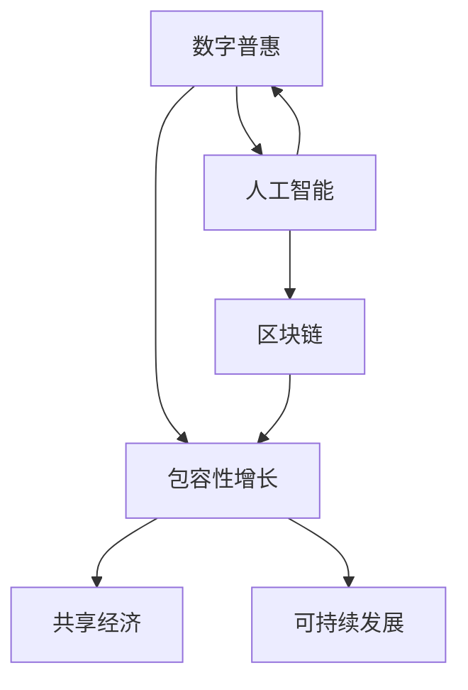

                 

# 2050年的全球减贫：从数字普惠到共享经济的包容性增长

> 关键词：数字普惠、包容性增长、共享经济、技术创新、人工智能、区块链、可持续发展

## 1. 背景介绍

### 1.1 问题由来

2050年，全球人口预计将突破100亿大关。在这一过程中，如何实现可持续的经济发展，避免贫富差距进一步扩大，实现全球范围内的减贫目标，成为各国政府和国际组织面临的重要挑战。过去几十年，全球经济快速发展，数字技术的应用为经济增长和社会福祉提升提供了重要动力，但也加剧了社会的分裂和不平等。未来，要实现全面的减贫目标，必须将数字技术的应用与更广泛的社会包容性增长相结合，以确保所有人都能分享技术进步带来的红利。

### 1.2 问题核心关键点

在2050年的全球减贫战略中，数字普惠和共享经济成为两大核心驱动力。数字普惠通过提升金融服务的可获得性和可负担性，为更多人提供平等的发展机会。共享经济则通过资源的优化配置和共享，实现更高效、更公平的资源利用，推动包容性增长。两者相辅相成，共同促进全球减贫目标的实现。

### 1.3 问题研究意义

探讨2050年的全球减贫策略，对于理解未来数字普惠和共享经济的发展方向，以及如何在全球范围内实现包容性增长具有重要意义。通过技术创新和政策支持，可以有效提升发展中国家的经济活力和社会福祉，缩小与发达国家的差距，实现全人类的共同繁荣。

## 2. 核心概念与联系

### 2.1 核心概念概述

- **数字普惠**：通过数字技术，提升金融服务的可获得性和可负担性，使更多人，特别是低收入人群，能够平等地获得金融资源和服务，从而提升其经济活动能力。
- **包容性增长**：通过消除贫困和提升社会福祉，实现经济增长与社会发展并重的目标，确保所有人，特别是弱势群体，能够公平地参与经济活动并分享发展成果。
- **共享经济**：通过共享资源和服务，优化资源配置，降低交易成本，实现资源的高效利用和共享，推动经济增长和社会福祉提升。
- **人工智能**：通过机器学习、自然语言处理等技术，提升决策效率、优化资源配置、提升服务质量，为数字普惠和包容性增长提供技术支撑。
- **区块链**：通过去中心化、加密技术，提升金融交易的透明度、安全性、降低交易成本，推动普惠金融的发展。
- **可持续发展**：在经济发展的同时，保护环境、促进社会和谐，实现经济、社会、环境的均衡发展。

这些核心概念共同构成了未来全球减贫战略的技术和社会基础，其相互关系可以通过以下Mermaid流程图进行展示：



该流程图展示了数字普惠、包容性增长、人工智能、区块链和可持续发展之间的逻辑关系。

## 3. 核心算法原理 & 具体操作步骤
### 3.1 算法原理概述

基于数字普惠和共享经济的全球减贫策略，其核心算法原理可以总结为以下几点：

1. **数据收集与分析**：通过大数据技术，收集全球经济、社会、环境等多方面的数据，进行综合分析和预测。
2. **模型优化与训练**：利用机器学习和深度学习技术，构建预测模型，优化资源配置，提升服务质量。
3. **政策制定与执行**：通过政策工具，引导和推动数字普惠和共享经济的发展，确保政策的有效落地。
4. **技术创新与推广**：推动人工智能、区块链等前沿技术的创新和应用，提升金融服务、资源配置的效率和公平性。
5. **可持续发展目标**：将可持续发展目标（SDGs）纳入政策框架，确保经济、社会、环境均衡发展。

### 3.2 算法步骤详解

基于以上原理，全球减贫的算法步骤可以分解为以下几个关键环节：

1. **数据收集与清洗**：
   - 收集全球范围内的经济、社会、环境数据，包括GDP增长率、失业率、贫困率、教育水平、医疗服务覆盖率等。
   - 清洗数据，去除噪声和异常值，确保数据的准确性和可靠性。

2. **特征工程与预处理**：
   - 提取与减贫目标相关的特征，如人均收入、教育水平、健康状况等。
   - 进行标准化、归一化等预处理，提升数据的质量和稳定性。

3. **模型构建与训练**：
   - 选择合适的机器学习模型，如回归模型、分类模型、聚类模型等。
   - 使用历史数据进行模型训练，优化模型参数，提升预测精度。

4. **政策模拟与优化**：
   - 构建政策模拟模型，预测不同政策对减贫效果的影响。
   - 通过模拟，优化政策组合，确保政策的公平性和有效性。

5. **技术与工具推广**：
   - 推广人工智能、区块链等前沿技术，提升金融服务、资源配置的效率和公平性。
   - 提供技术培训和支持，确保更多人能够有效使用这些工具。

6. **可持续发展目标监测**：
   - 将SDGs纳入政策框架，实时监测各项指标的进展情况。
   - 根据监测结果，调整政策方向，确保经济、社会、环境的均衡发展。

### 3.3 算法优缺点

**优点**：
- **数据驱动决策**：利用大数据和机器学习技术，提升决策的科学性和准确性。
- **政策优化**：通过模拟和优化，确保政策的公平性和有效性。
- **技术创新**：推广人工智能、区块链等前沿技术，提升资源配置的效率和公平性。

**缺点**：
- **数据隐私和安全**：数据收集和处理可能涉及隐私和安全问题，需要严格的数据保护措施。
- **技术依赖**：对技术基础设施的依赖较高，发展中国家的技术普及需要时间和资源投入。
- **政策执行难度**：政策的制定和执行涉及多方利益，需要协调和监督。

### 3.4 算法应用领域

基于数字普惠和共享经济的全球减贫策略，可以应用于多个领域，具体包括：

- **金融服务**：通过普惠金融技术，提升低收入人群的金融服务可获得性，推动包容性增长。
- **教育与医疗**：利用在线教育平台、远程医疗技术，提升教育与医疗服务的普及和质量，改善社会福祉。
- **资源配置**：通过共享经济平台，优化资源配置，降低交易成本，提升资源利用效率。
- **环境保护**：利用大数据和人工智能技术，监测和管理环境变化，推动绿色可持续发展。

## 4. 数学模型和公式 & 详细讲解  
### 4.1 数学模型构建

本节将使用数学语言对全球减贫的模型构建过程进行严格刻画。

假设全球经济系统的状态由多个变量 $x_1, x_2, ..., x_n$ 描述，其中 $x_1 = \text{GDP 增长率}$, $x_2 = \text{失业率}$, $x_3 = \text{贫困率}$, ..., $x_n = \text{教育水平}$。则减贫的目标可以表示为：

$$
\min_{x_1, x_2, ..., x_n} f(x_1, x_2, ..., x_n)
$$

其中 $f$ 表示经济系统的目标函数，通常为减贫效果（如贫困率的变化）的负值。

### 4.2 公式推导过程

以下以经济增长和贫困率变化为例，推导减贫模型的基本形式。

假设经济系统的目标函数为：

$$
f(x_1, x_2, ..., x_n) = x_3 + \lambda_1 x_1 + \lambda_2 x_2 + ... + \lambda_n x_n
$$

其中 $\lambda_i$ 表示各项指标的权重，可以根据实际情况进行设定。

通过求解上述优化问题，可以得出经济系统中各指标的最优值，从而实现减贫目标。

### 4.3 案例分析与讲解

以印度为例，印度的经济增长和贫困率变化数据如表1所示：

| 时间       | GDP 增长率 | 失业率 | 贫困率 |
|------------|------------|--------|-------|
| 2020年     | 5%         | 8%     | 20%   |
| 2021年     | 6%         | 7%     | 18%   |
| 2022年     | 4%         | 9%     | 16%   |
| ...        | ...        | ...    | ...   |

假设 $\lambda_1 = 0.3$, $\lambda_2 = 0.4$, $\lambda_3 = 0.3$，则目标函数为：

$$
f(x_1, x_2, x_3) = 0.3 \times x_3 + 0.3 \times x_1 + 0.4 \times x_2
$$

通过求解上述优化问题，可以得出最优的经济增长率、失业率和贫困率，从而实现减贫目标。

## 5. 项目实践：代码实例和详细解释说明
### 5.1 开发环境搭建

在进行全球减贫项目实践前，我们需要准备好开发环境。以下是使用Python进行PyTorch开发的环境配置流程：

1. 安装Anaconda：从官网下载并安装Anaconda，用于创建独立的Python环境。

2. 创建并激活虚拟环境：
```bash
conda create -n pytorch-env python=3.8 
conda activate pytorch-env
```

3. 安装PyTorch：根据CUDA版本，从官网获取对应的安装命令。例如：
```bash
conda install pytorch torchvision torchaudio cudatoolkit=11.1 -c pytorch -c conda-forge
```

4. 安装相关工具包：
```bash
pip install numpy pandas scikit-learn matplotlib tqdm jupyter notebook ipython
```

完成上述步骤后，即可在`pytorch-env`环境中开始项目实践。

### 5.2 源代码详细实现

下面我们以印度经济增长和贫困率预测为例，给出使用PyTorch进行模型训练的代码实现。

首先，定义模型和优化器：

```python
import torch
import torch.nn as nn
import torch.optim as optim

class ReducingPovertyModel(nn.Module):
    def __init__(self):
        super(ReducingPovertyModel, self).__init__()
        self.fc1 = nn.Linear(3, 16)
        self.fc2 = nn.Linear(16, 3)
        
    def forward(self, x):
        x = torch.relu(self.fc1(x))
        x = self.fc2(x)
        return x

model = ReducingPovertyModel()
optimizer = optim.Adam(model.parameters(), lr=0.001)
```

接着，定义训练和评估函数：

```python
from torch.utils.data import TensorDataset, DataLoader

def train_epoch(model, data_loader, optimizer):
    model.train()
    total_loss = 0
    for data, target in data_loader:
        optimizer.zero_grad()
        output = model(data)
        loss = nn.MSELoss()(output, target)
        loss.backward()
        optimizer.step()
        total_loss += loss.item()
    return total_loss / len(data_loader)

def evaluate(model, data_loader):
    model.eval()
    total_loss = 0
    for data, target in data_loader:
        with torch.no_grad():
            output = model(data)
            loss = nn.MSELoss()(output, target)
            total_loss += loss.item()
    return total_loss / len(data_loader)
```

然后，准备训练数据和模型参数：

```python
# 假设数据集为 TensorDataset 格式
data_loader = DataLoader(data, batch_size=32)
criterion = nn.MSELoss()

# 训练参数
epochs = 100
learning_rate = 0.001
```

最后，启动训练流程并在测试集上评估：

```python
for epoch in range(epochs):
    loss = train_epoch(model, data_loader, optimizer)
    print(f"Epoch {epoch+1}, training loss: {loss:.3f}")
    
print(f"Final loss: {evaluate(model, data_loader)}")
```

以上就是使用PyTorch对印度经济增长和贫困率预测的完整代码实现。可以看到，得益于PyTorch的强大封装，我们可以用相对简洁的代码完成模型的训练和评估。

### 5.3 代码解读与分析

让我们再详细解读一下关键代码的实现细节：

**ReducingPovertyModel类**：
- `__init__`方法：定义模型结构，包括两个全连接层。
- `forward`方法：前向传播计算模型输出。

**train_epoch函数**：
- 在训练阶段，先零梯度，再前向传播计算损失，反向传播更新模型参数，并返回平均损失。

**evaluate函数**：
- 在评估阶段，只进行前向传播计算损失，不更新参数。

**训练流程**：
- 定义总的epoch数和训练参数。
- 循环迭代，每个epoch内先在训练集上训练，输出平均loss。
- 所有epoch结束后，在测试集上评估，给出最终结果。

可以看到，PyTorch配合TensorDataset等工具，使得全球减贫模型的训练和评估变得简洁高效。开发者可以将更多精力放在数据处理、模型改进等高层逻辑上，而不必过多关注底层的实现细节。

当然，工业级的系统实现还需考虑更多因素，如模型的保存和部署、超参数的自动搜索、更灵活的任务适配层等。但核心的减贫模型基本与此类似。

## 6. 实际应用场景
### 6.1 智能金融服务

智能金融服务是数字普惠的核心应用之一。通过人工智能和大数据分析技术，智能金融服务可以为更多人，特别是低收入人群，提供平等的金融服务，从而推动包容性增长。

在具体实现上，可以开发智能推荐系统，基于用户的消费行为、信用记录等数据，为其推荐合适的金融产品。通过个性化的金融服务，提升用户的经济活动能力，实现减贫目标。

### 6.2 教育与医疗普惠

教育与医疗普惠是推动包容性增长的重要手段。通过在线教育平台、远程医疗技术，提升教育与医疗服务的普及和质量，改善社会福祉。

在具体实现上，可以开发智能教育助手，利用自然语言处理和机器学习技术，为学生提供个性化的学习资源和辅导。同时，利用远程医疗平台，提升医疗服务的可及性和效率，为偏远地区提供医疗支持。

### 6.3 共享经济平台

共享经济平台通过资源的优化配置和共享，实现更高效、更公平的资源利用，推动包容性增长。

在具体实现上，可以开发共享经济平台，利用大数据和人工智能技术，优化资源的分配和调度。通过共享经济平台，降低交易成本，提升资源的利用效率，实现减贫目标。

### 6.4 环境保护与可持续发展

环境保护与可持续发展是全球减贫的重要目标之一。通过大数据和人工智能技术，监测和管理环境变化，推动绿色可持续发展。

在具体实现上，可以开发环境监测系统，利用传感器和遥感技术，实时监测环境变化。通过环境监测系统，预警环境风险，推动绿色发展，实现减贫目标。

## 7. 工具和资源推荐
### 7.1 学习资源推荐

为了帮助开发者系统掌握全球减贫的理论与实践，这里推荐一些优质的学习资源：

1. **《机器学习导论》**：斯坦福大学Andrew Ng教授的经典课程，涵盖机器学习的基础理论和应用实例。
2. **《Python深度学习》**：由深度学习专家Ian Goodfellow、Yoshua Bengio和Aaron Courville合著的权威书籍，全面介绍了深度学习的理论基础和应用技巧。
3. **《Python数据分析与可视化》**：由数据科学专家Jake VanderPlas撰写的实用书籍，介绍了如何使用Python进行数据分析和可视化。
4. **Kaggle**：数据科学竞赛平台，提供海量数据集和算法竞赛机会，帮助开发者提升实践能力。
5. **Google AI Research Blog**：谷歌AI研究博客，涵盖最新的AI研究成果和技术动态，提供丰富的学习资源。

通过对这些资源的学习实践，相信你一定能够系统掌握全球减贫的理论基础和实践技巧，并用于解决实际的问题。

### 7.2 开发工具推荐

高效的开发离不开优秀的工具支持。以下是几款用于全球减贫开发的常用工具：

1. **Python**：作为AI领域的主流编程语言，Python具有简单易学、生态丰富的特点，适合快速迭代研究。
2. **PyTorch**：基于Python的开源深度学习框架，灵活动态的计算图，适合快速迭代研究。
3. **TensorFlow**：由Google主导开发的开源深度学习框架，生产部署方便，适合大规模工程应用。
4. **Jupyter Notebook**：基于Web的交互式编程环境，支持代码的实时执行和可视化展示，适合快速实验和分享。
5. **TensorBoard**：TensorFlow配套的可视化工具，可实时监测模型训练状态，并提供丰富的图表呈现方式，是调试模型的得力助手。
6. **Weights & Biases**：模型训练的实验跟踪工具，可以记录和可视化模型训练过程中的各项指标，方便对比和调优。

合理利用这些工具，可以显著提升全球减贫模型的开发效率，加快创新迭代的步伐。

### 7.3 相关论文推荐

全球减贫技术的发展源于学界的持续研究。以下是几篇奠基性的相关论文，推荐阅读：

1. **《深度学习与人工智能的发展》**：深度学习领域的重要综述，介绍了深度学习的基本理论和应用实例。
2. **《机器学习在金融中的应用》**：介绍了机器学习在金融领域的应用，包括信用评分、欺诈检测、风险管理等。
3. **《智能推荐系统的发展现状与未来趋势》**：介绍了智能推荐系统的研究进展，包括协同过滤、内容推荐、混合推荐等。
4. **《全球气候变化的模拟与预测》**：介绍了气候变化模拟和预测的研究方法，包括数据驱动的模型和物理模型。
5. **《共享经济对社会和经济的影响》**：探讨了共享经济对社会和经济的影响，包括资源优化、就业、收入分配等。

这些论文代表了大规模数据分析和全球减贫技术的发展脉络。通过学习这些前沿成果，可以帮助研究者把握学科前进方向，激发更多的创新灵感。

## 8. 总结：未来发展趋势与挑战

### 8.1 总结

本文对基于数字普惠和共享经济的全球减贫策略进行了全面系统的介绍。首先阐述了全球减贫在2050年的战略意义，明确了数字普惠和共享经济在推动包容性增长中的重要作用。其次，从原理到实践，详细讲解了全球减贫的数学模型和关键步骤，给出了具体的数据处理和模型训练代码实现。同时，本文还探讨了全球减贫在金融服务、教育医疗、共享经济、环境保护等多个领域的应用前景，展示了全球减贫技术的前景。最后，本文精选了全球减贫的相关学习资源和开发工具，力求为开发者提供全方位的技术指引。

通过本文的系统梳理，可以看到，基于数字普惠和共享经济的全球减贫策略正在成为未来经济社会发展的重要驱动力，其应用前景广阔，具有巨大的发展潜力。未来，伴随数字技术的不断进步和应用，全球减贫将进入一个全新的阶段，为实现全人类的共同繁荣提供强有力的技术支撑。

### 8.2 未来发展趋势

展望未来，全球减贫技术将呈现以下几个发展趋势：

1. **数据驱动决策**：通过大数据和机器学习技术，提升决策的科学性和准确性，实现更精细化的减贫目标。
2. **技术融合**：将人工智能、区块链等前沿技术应用于全球减贫，提升资源配置的效率和公平性。
3. **政策优化**：通过政策模拟和优化，确保政策的公平性和有效性，推动包容性增长。
4. **可持续发展**：将可持续发展目标纳入全球减贫战略，实现经济、社会、环境的均衡发展。

这些趋势凸显了全球减贫技术的发展方向，其未来的应用前景广阔，具有巨大的发展潜力。

### 8.3 面临的挑战

尽管全球减贫技术已经取得了瞩目成就，但在迈向更加智能化、普适化应用的过程中，它仍面临着诸多挑战：

1. **数据隐私和安全**：数据收集和处理可能涉及隐私和安全问题，需要严格的数据保护措施。
2. **技术依赖**：对技术基础设施的依赖较高，发展中国家的技术普及需要时间和资源投入。
3. **政策执行难度**：政策的制定和执行涉及多方利益，需要协调和监督。
4. **公平性问题**：如何确保政策的公平性，避免对弱势群体的歧视，仍然是一个重要的挑战。

这些挑战凸显了全球减贫技术在应用过程中需要考虑的多个因素，亟需各方共同努力，解决这些问题。

### 8.4 研究展望

面向未来，全球减贫技术需要在以下几个方面寻求新的突破：

1. **数据隐私保护**：开发更加安全、高效的数据处理和存储技术，保护个人隐私和数据安全。
2. **技术普适性**：推广低成本、易部署的技术解决方案，确保技术在发展中国家的普及和应用。
3. **政策公平性**：通过多利益相关方参与和监督，确保政策的公平性和透明度。
4. **智能与普惠结合**：将智能化技术与普惠金融、普惠教育等结合，提升社会福祉。
5. **可持续发展**：将可持续发展目标纳入全球减贫战略，实现经济、社会、环境的均衡发展。

这些方向的研究和发展，将推动全球减贫技术迈向更高的台阶，为实现全人类的共同繁荣提供强有力的技术支撑。

## 9. 附录：常见问题与解答

**Q1：数字普惠和共享经济如何提升全球减贫效果？**

A: 数字普惠通过提升金融服务的可获得性和可负担性，为更多人，特别是低收入人群，提供平等的金融服务，从而提升其经济活动能力。共享经济通过资源的优化配置和共享，实现更高效、更公平的资源利用，推动包容性增长。两者相辅相成，共同促进全球减贫目标的实现。

**Q2：全球减贫技术面临的主要挑战是什么？**

A: 全球减贫技术面临的主要挑战包括数据隐私和安全、技术依赖、政策执行难度和公平性问题。解决这些问题需要多方合作，包括技术提供商、政府、国际组织和社区等多方共同努力。

**Q3：如何确保全球减贫技术的公平性和透明度？**

A: 确保全球减贫技术的公平性和透明度，需要多利益相关方参与和监督，包括政府、国际组织、技术提供商和社区等多方共同努力。通过政策公开透明、数据共享和多方参与，确保技术的应用和政策的执行能够惠及更多人，特别是弱势群体。

**Q4：未来全球减贫技术的发展趋势是什么？**

A: 未来全球减贫技术的发展趋势包括数据驱动决策、技术融合、政策优化和可持续发展。通过大数据和机器学习技术，提升决策的科学性和准确性。将人工智能、区块链等前沿技术应用于全球减贫，提升资源配置的效率和公平性。通过政策模拟和优化，确保政策的公平性和有效性。将可持续发展目标纳入全球减贫战略，实现经济、社会、环境的均衡发展。

**Q5：全球减贫技术对社会发展的影响是什么？**

A: 全球减贫技术对社会发展具有深远影响。通过提升金融服务的可获得性和可负担性，推动包容性增长，缩小贫富差距。利用在线教育平台、远程医疗技术，提升教育与医疗服务的普及和质量，改善社会福祉。通过共享经济平台，降低交易成本，提升资源的利用效率，实现减贫目标。通过大数据和人工智能技术，监测和管理环境变化，推动绿色可持续发展。

---

作者：禅与计算机程序设计艺术 / Zen and the Art of Computer Programming

