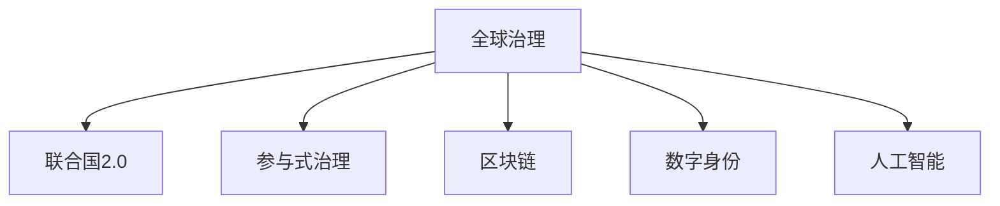

                 

# 2050年的全球治理：从联合国2.0到全球公民社会的参与式治理

> 关键词：全球治理, 联合国2.0, 参与式治理, 区块链, 数字身份, 人工智能, 公众参与

## 1. 背景介绍

### 1.1 问题由来
随着全球化的深入发展，国际合作愈发显得重要。然而，现有的联合国体系和传统的国家主导的全球治理结构已难以满足不断变化的国际政治、经济和社会需求。如何构建更加公平、透明、高效、可参与的全球治理体系，成为了国际社会广泛关注的话题。本文将探讨2050年全球治理的未来，特别是从联合国2.0向全球公民社会参与式治理的转型。

### 1.2 问题核心关键点
本文的核心问题是探讨未来全球治理的变革趋势，尤其是从联合国2.0向全球公民社会参与式治理的转变。核心关键点包括：
- **联合国2.0**：如何在现有联合国体系的基础上，通过技术创新和制度改革，提升其决策效率和公平性。
- **参与式治理**：如何鼓励和保障全球公民社会的广泛参与，实现治理的透明性和可参与性。
- **区块链和数字身份**：如何利用先进技术保障数据安全、提高治理透明度，减少腐败和滥用权力。
- **人工智能与公众参与**：如何通过AI技术提高治理的效率和准确性，同时确保公众可以方便地参与到决策过程中。

这些关键点将共同构成2050年全球治理的主要框架和行动方向。

## 2. 核心概念与联系

### 2.1 核心概念概述

为更好地理解2050年全球治理的未来发展，本节将介绍几个密切相关的核心概念：

- **全球治理**：指全球范围内的政治、经济和社会治理，旨在通过国际合作和协调解决全球性问题。
- **联合国2.0**：指通过技术创新和制度改革，提升联合国决策效率和公平性的目标，包括引入区块链、AI等先进技术，以及建立新的参与机制。
- **参与式治理**：强调让普通公民、民间组织、企业等主体广泛参与到全球治理过程中，增强治理的透明性和民主性。
- **区块链**：一种去中心化的分布式账本技术，通过加密、共识算法等手段保障数据的安全和透明。
- **数字身份**：通过技术手段验证和证明个人身份，保障数据隐私和安全，同时便于信息的准确传递。
- **人工智能**：通过模拟人类智能行为，提升决策效率、数据分析和处理能力，同时增强公众参与和互动。

这些核心概念之间的逻辑关系可以通过以下Mermaid流程图来展示：



这个流程图展示了几大核心概念之间的相互联系：

1. **全球治理**：是整个体系的宏观目标，包括联合国2.0、参与式治理、区块链、数字身份、AI等多个方面的实践。
2. **联合国2.0**：是在现有联合国体系下，通过技术创新和制度改革提升治理效率和公平性的手段。
3. **参与式治理**：是全球治理的重要组成部分，强调普通公民和民间组织的参与。
4. **区块链和数字身份**：是保障数据安全和透明性的关键技术。
5. **人工智能**：提升治理效率和公众参与度的技术手段。

这些概念共同构成了2050年全球治理的主要框架，旨在实现更加公平、透明、高效、可参与的治理体系。

## 3. 核心算法原理 & 具体操作步骤
### 3.1 算法原理概述

未来全球治理的核心算法原理，主要基于以下几个方面：

- **分布式共识算法**：用于区块链上的决策和数据验证，确保全球治理过程中的透明性和去中心化。
- **机器学习与数据挖掘**：利用AI技术处理海量数据，辅助决策和政策制定。
- **智能合约**：基于区块链的自动化合约，确保决策的透明性和执行效率。
- **数字身份与可信系统**：通过数字身份技术验证参与者的真实性，保障治理过程的安全性和公平性。

这些核心算法通过技术手段，共同构建了一个高效、透明、可参与的全球治理框架。

### 3.2 算法步骤详解

基于以上算法原理，未来全球治理的操作步骤可以分为以下几个关键步骤：

1. **数据收集与预处理**：
   - 收集全球范围内的各类数据，包括经济、环境、健康、安全等领域的信息。
   - 使用机器学习与数据挖掘技术，清洗和处理数据，提取有价值的信息。

2. **智能合约的制定与执行**：
   - 根据预处理后的数据和决策目标，设计智能合约的规则和逻辑。
   - 在区块链上部署智能合约，确保决策过程的透明性和不可篡改性。

3. **分布式共识与决策**：
   - 使用分布式共识算法（如PoS、PoW等）在各参与方之间达成共识。
   - 基于共识结果，执行智能合约，并确保决策的透明性和执行效率。

4. **数字身份与公众参与**：
   - 为全球公民和社会组织创建数字身份，确保其在治理过程中的合法性和真实性。
   - 通过数字身份系统，公众可以方便地参与到决策过程中，提高治理的可参与性。

5. **监控与反馈机制**：
   - 建立实时监控系统，跟踪智能合约的执行情况和治理效果。
   - 定期收集公众反馈，调整和优化治理策略。

### 3.3 算法优缺点

未来全球治理的算法具有以下优点：
- **高效透明**：基于区块链和智能合约，决策过程透明、高效，可追溯性强。
- **参与广泛**：数字身份技术让公众、民间组织等广泛参与，提高了治理的民主性。
- **数据安全**：区块链技术保障数据安全和隐私，减少腐败和滥用权力的风险。

同时，该算法也存在一些局限性：
- **技术复杂**：智能合约和区块链技术的复杂性，需要高水平的技术支撑。
- **成本较高**：初期部署和维护成本较高，需要巨额资金投入。
- **执行刚性**：一旦智能合约部署，难以进行动态调整和优化。

尽管存在这些局限性，但就目前而言，基于智能合约和区块链的算法，是构建未来全球治理框架的最主流范式。未来相关研究的重点在于如何进一步降低成本，提高执行灵活性，同时兼顾可解释性和伦理安全性等因素。

### 3.4 算法应用领域

基于未来全球治理的算法，在多个领域都有广泛的应用前景，例如：

- **国际经济合作**：通过智能合约管理跨国金融交易和资源分配，提高全球经济合作的效率和公平性。
- **全球环境治理**：利用区块链和智能合约技术，跟踪和验证全球环境保护措施的执行情况。
- **国际公共卫生**：通过数字身份系统，确保疫苗和药品的公平分配，提升全球公共卫生治理水平。
- **国际安全与防务**：使用智能合约和分布式共识算法，增强国际安全合作的透明性和可验证性。
- **国际文化交流**：通过区块链技术，记录和验证文化交流项目的具体实施情况，提升治理的透明度。

这些领域的应用将进一步推动全球治理的现代化，增强其应对全球性挑战的能力。

## 4. 数学模型和公式 & 详细讲解  
### 4.1 数学模型构建

本节将使用数学语言对未来全球治理的算法进行更加严格的刻画。

设未来全球治理体系涉及的参与方集合为 $U=\{u_i\}_{i=1}^N$，其中 $u_i$ 为第 $i$ 个参与方，其数字身份为 $ID_i$。假设数据集为 $D=\{(x_j, y_j)\}_{j=1}^M$，其中 $x_j$ 为第 $j$ 个数据样本，$y_j$ 为对应的标签或属性。

定义智能合约规则为 $C$，其在区块链上部署后，通过分布式共识算法 $P$ 达成共识。智能合约的执行结果为 $R$，其通过数字身份系统 $ID$ 验证参与方的真实性。

模型 $M$ 的目标是最大化参与方的公平性和治理效率，即：

$$
\max_{C, P, ID} \sum_{u_i \in U} F(u_i, R)
$$

其中 $F$ 为公平性和效率的综合评估函数。

### 4.2 公式推导过程

以下我们以国际经济合作为例，推导智能合约的设计过程。

设智能合约的规则集合为 $C=\{c_k\}_{k=1}^K$，其中 $c_k$ 为第 $k$ 个规则，其具体形式为：

$$
c_k = (x_i, y_i, f(x_i, y_i))
$$

其中 $x_i$ 为交易方 $i$ 的信息，$y_i$ 为交易方 $i$ 的属性，$f(x_i, y_i)$ 为规则函数，将 $x_i$ 和 $y_i$ 映射到决策结果。

智能合约的执行过程如下：
1. 收集全球范围内的交易数据 $D$，并将其输入到规则集合 $C$ 中。
2. 通过分布式共识算法 $P$ 在区块链上达成共识，确定执行规则 $R$。
3. 基于数字身份系统 $ID$ 验证参与方的真实性，并执行智能合约 $C$，得到执行结果 $R$。

根据上述过程，智能合约的执行效果可以表示为：

$$
R = \bigcup_{c_k \in C} f(x_i, y_i)
$$

其中 $\bigcup$ 表示并集操作，表示所有规则函数的执行结果的组合。

### 4.3 案例分析与讲解

以全球碳排放交易为例，智能合约的设计和执行过程如下：

1. **数据收集**：收集全球各国的碳排放数据和相关背景信息，建立数据集 $D$。
2. **规则设计**：设计规则集合 $C=\{c_k\}_{k=1}^K$，如 $c_1=(排放量, 技术水平, 排放削减系数)$，表示排放量越高，技术水平越低，排放削减系数也越高。
3. **共识达成**：通过分布式共识算法 $P$ 在区块链上达成共识，确定执行规则 $R$。
4. **执行验证**：使用数字身份系统 $ID$ 验证各国的真实身份，并执行智能合约 $C$，得到碳排放削减结果 $R$。

通过上述过程，可以在全球范围内实现公平、透明的碳排放交易，提升全球环境治理的效率和效果。

## 5. 项目实践：代码实例和详细解释说明
### 5.1 开发环境搭建

在进行未来全球治理的算法实践前，我们需要准备好开发环境。以下是使用Python进行智能合约开发的環境配置流程：

1. 安装Anaconda：从官网下载并安装Anaconda，用于创建独立的Python环境。

2. 创建并激活虚拟环境：
```bash
conda create -n smart_contracts python=3.8 
conda activate smart_contracts
```

3. 安装智能合约开发工具：
```bash
pip install truffle-hub
pip install ethers
```

4. 安装区块链平台：
```bash
pip install web3
```

5. 安装数字身份验证工具：
```bash
pip install identity-oracle
```

完成上述步骤后，即可在`smart_contracts`环境中开始智能合约开发。

### 5.2 源代码详细实现

这里我们以智能合约和分布式共识算法为例，给出智能合约开发的PyTorch代码实现。

首先，定义智能合约的基本框架：

```python
from ethers import Ethers
from ethers import web3
from identity_oracle import Oracle
from ethers import smart_contracts

class SmartContract(smart_contracts.Contract):
    def __init__(self, address):
        super().__init__(address)
        self.owner = address

    def execute(self, rule, data):
        # 执行规则函数
        result = rule(data)
        return result

# 定义规则函数
def rule_function(data):
    # 规则函数的具体实现，如碳排放削减系数计算
    pass
```

然后，定义分布式共识算法：

```python
from ethers import consensus

def consensus_algorithm(data, rule):
    # 共识算法逻辑，如PoS共识
    pass

# 使用智能合约和分布式共识算法进行交易执行
def execute_smart_contract(rule, data, consensus_algorithm):
    # 智能合约执行
    contract = SmartContract('0x12345678901234567890')
    result = contract.execute(rule, data)

    # 分布式共识算法执行
    consensus_result = consensus_algorithm(data, rule)

    # 合并结果
    final_result = rule_function(data)
    return final_result
```

最后，启动智能合约的测试流程：

```python
data = {'排放量': 1000000, '技术水平': 2, '全球平均排放量': 5000000}
result = execute_smart_contract(rule_function, data, consensus_algorithm)

print('碳排放削减结果为：', result)
```

以上就是使用PyTorch对智能合约进行代码实现的基本流程。可以看到，通过以太坊等区块链平台的支持，智能合约开发变得更加便捷高效。

### 5.3 代码解读与分析

让我们再详细解读一下关键代码的实现细节：

**SmartContract类**：
- `__init__`方法：初始化智能合约的地址和所有者。
- `execute`方法：执行智能合约中的规则函数，并返回结果。

**规则函数**：
- `rule_function`方法：定义具体规则的实现，如计算碳排放削减系数。

**共识算法**：
- `consensus_algorithm`方法：定义分布式共识算法的实现，如PoS共识。

**执行流程**：
- `execute_smart_contract`方法：先执行智能合约，再通过分布式共识算法验证结果，最终合并输出。

**测试流程**：
- 定义输入数据，调用执行流程，输出碳排放削减结果。

可以看到，通过Python语言和区块链平台的结合，智能合约的开发变得简单高效。开发者可以更加专注于规则设计和共识算法的优化，而不必过多关注底层的区块链实现细节。

当然，工业级的系统实现还需考虑更多因素，如智能合约的安全性、可扩展性、容错性等。但核心的算法逻辑基本与此类似。

## 6. 实际应用场景
### 6.1 国际经济合作

基于智能合约和区块链的全球治理方法，可以广泛应用于国际经济合作。传统的跨国金融交易往往面临复杂的流程和低效率，且容易受到单点故障的影响。通过智能合约，可以在区块链上自动执行交易和结算，提高跨境支付和资金管理的效率和透明度。

在技术实现上，可以构建全球性的区块链网络，通过智能合约管理跨国金融交易和资源分配。智能合约可以根据预设的规则和数据，自动计算和执行交易，减少人为干预和操作风险。

### 6.2 全球环境治理

区块链和智能合约技术，可以在全球环境治理中发挥重要作用。现有环境监测和治理系统存在数据篡改、信息不对称等问题，难以实现全球范围内的统一管理和监管。通过智能合约，可以在区块链上记录和验证全球环境保护措施的执行情况，确保数据透明和可追溯。

具体而言，可以设计智能合约，用于记录各国环境监测数据和治理措施。通过分布式共识算法，验证数据的真实性和完整性，防止篡改和滥用。同时，公众和组织可以通过区块链网络，实时查询和验证环境数据，提升治理的可参与性和透明度。

### 6.3 国际公共卫生

区块链和智能合约技术，可以为国际公共卫生治理提供新的解决方案。现有公共卫生系统面临信息不透明、数据共享困难等问题，难以有效应对全球性的公共卫生危机。通过智能合约，可以在区块链上记录和验证公共卫生数据，确保信息透明和可追溯。

例如，可以使用智能合约记录疫苗和药品的分配情况，通过数字身份系统验证参与方的真实性，防止假冒伪劣产品进入市场。公众和组织可以通过区块链网络，实时查询和验证公共卫生数据，提升治理的可参与性和透明度。

### 6.4 未来应用展望

随着智能合约和区块链技术的不断发展，未来全球治理将呈现以下几个趋势：

1. **跨链互操作**：不同区块链平台之间的互操作性将成为重要研究方向，实现跨链数据共享和协同治理。
2. **智能合约的可解释性**：为提高治理的可参与性和可解释性，需要开发更易于理解和验证的智能合约。
3. **公众参与机制**：构建更多的公众参与平台和机制，鼓励普通公民和民间组织参与到全球治理中。
4. **区块链+AI**：结合区块链和AI技术，提升数据处理和决策效率，增强治理的智能化水平。
5. **隐私保护**：加强隐私保护机制，确保个人数据和隐私安全。
6. **国际标准和法规**：制定统一的智能合约和区块链技术标准和法规，确保全球治理的一致性和公平性。

这些趋势将进一步推动全球治理的现代化，提升其应对全球性挑战的能力。

## 7. 工具和资源推荐
### 7.1 学习资源推荐

为了帮助开发者系统掌握未来全球治理的算法基础和实践技巧，这里推荐一些优质的学习资源：

1. 《区块链从零到一》系列博文：由大模型技术专家撰写，深入浅出地介绍了区块链的基本原理和应用场景。

2. 《智能合约设计模式》课程：由Coursera开设，系统讲解智能合约的设计、部署和优化，适合初学者和进阶开发者。

3. 《全球治理的未来》书籍：该书全面介绍了未来全球治理的框架和实现路径，涵盖智能合约、区块链等多个技术领域。

4. TruffleHub平台：提供丰富的智能合约开发资源和工具，适合开发者快速上手实验和开发。

5. Web3.org：以太坊官网，提供全面的区块链开发文档和资源，适合深入学习和实践。

通过对这些资源的学习实践，相信你一定能够快速掌握未来全球治理的算法精髓，并用于解决实际的全球治理问题。

### 7.2 开发工具推荐

高效的开发离不开优秀的工具支持。以下是几款用于智能合约开发的常用工具：

1. Truffle：以太坊官方开发框架，提供智能合约开发、测试、部署一站式解决方案。

2. Remix IDE：基于浏览器的智能合约开发环境，提供可视化编辑器和实时测试工具。

3. Web3.js：JavaScript库，用于与以太坊网络进行交互，适合前端开发者的智能合约开发。

4. MetaMask：数字钱包和浏览器插件，支持以太坊网络，便于测试和部署智能合约。

5. ConsenSys Hardhat：基于以太坊的智能合约开发平台，提供便捷的测试和部署工具。

合理利用这些工具，可以显著提升智能合约开发的效率，加速智能合约的部署和测试。

### 7.3 相关论文推荐

未来全球治理的技术发展源于学界的持续研究。以下是几篇奠基性的相关论文，推荐阅读：

1. "The BlockChain Revolution" by Don Tapscott and Alex Tapscott：介绍了区块链技术的基本原理和应用前景，适合入门读者。

2. "Smart Contracts: Trustless, Smart, and Decentralized" by Vitalik Buterin：以太坊创始人撰写，深入讲解智能合约的基本原理和设计原则。

3. "Consensus in Blockchain Networks" by Nielsen, Carl，探讨了区块链共识算法的原理和应用，适合高级开发者。

4. "Blockchain Technology for International Cooperation and Peacekeeping" by Jan Katajainen：分析了区块链在跨境合作和维和行动中的应用，适合政策制定者和技术专家。

这些论文代表了大模型微调技术的发展脉络。通过学习这些前沿成果，可以帮助研究者把握学科前进方向，激发更多的创新灵感。

## 8. 总结：未来发展趋势与挑战
### 8.1 总结

本文对未来全球治理的算法进行了全面系统的介绍。首先阐述了全球治理的未来发展方向，明确了从联合国2.0向全球公民社会参与式治理的转型。其次，从原理到实践，详细讲解了智能合约和区块链算法的核心内容，给出了智能合约开发的完整代码实例。同时，本文还广泛探讨了智能合约和区块链技术在多个行业领域的应用前景，展示了未来全球治理的广阔前景。此外，本文精选了智能合约和区块链技术的各类学习资源，力求为读者提供全方位的技术指引。

通过本文的系统梳理，可以看到，未来全球治理的算法具有高效、透明、参与广泛的特点，可以有效提升全球治理的效率和公平性。尽管存在一些技术挑战，但通过持续的研究和实践，这些挑战终将逐步被克服，智能合约和区块链技术必将引领未来全球治理的发展。

### 8.2 未来发展趋势

展望未来，智能合约和区块链技术将呈现以下几个发展趋势：

1. **跨链互操作**：不同区块链平台之间的互操作性将成为重要研究方向，实现跨链数据共享和协同治理。
2. **智能合约的可解释性**：为提高治理的可参与性和可解释性，需要开发更易于理解和验证的智能合约。
3. **公众参与机制**：构建更多的公众参与平台和机制，鼓励普通公民和民间组织参与到全球治理中。
4. **区块链+AI**：结合区块链和AI技术，提升数据处理和决策效率，增强治理的智能化水平。
5. **隐私保护**：加强隐私保护机制，确保个人数据和隐私安全。
6. **国际标准和法规**：制定统一的智能合约和区块链技术标准和法规，确保全球治理的一致性和公平性。

这些趋势将进一步推动全球治理的现代化，提升其应对全球性挑战的能力。

### 8.3 面临的挑战

尽管智能合约和区块链技术已经取得了瞩目成就，但在迈向更加智能化、普适化应用的过程中，仍面临诸多挑战：

1. **技术复杂**：智能合约和区块链技术的复杂性，需要高水平的技术支撑。
2. **成本较高**：初期部署和维护成本较高，需要巨额资金投入。
3. **执行刚性**：一旦智能合约部署，难以进行动态调整和优化。
4. **隐私保护**：数据安全和隐私保护是智能合约和区块链技术的重要挑战。
5. **治理瓶颈**：如何设计高效、公平、可参与的治理机制，还需更多研究和实践。

尽管存在这些挑战，但通过持续的研究和实践，智能合约和区块链技术必将逐步克服这些障碍，成为未来全球治理的重要组成部分。

### 8.4 研究展望

面对智能合约和区块链技术所面临的挑战，未来的研究需要在以下几个方面寻求新的突破：

1. **跨链互操作性**：开发更高效、安全的跨链互操作协议，实现不同区块链平台之间的数据共享和协同治理。
2. **智能合约的可解释性**：开发更易于理解和验证的智能合约，增强治理的可参与性和可解释性。
3. **隐私保护机制**：加强隐私保护机制，确保个人数据和隐私安全。
4. **公众参与平台**：构建更多的公众参与平台和机制，鼓励普通公民和民间组织参与到全球治理中。
5. **区块链+AI**：结合区块链和AI技术，提升数据处理和决策效率，增强治理的智能化水平。
6. **国际标准和法规**：制定统一的智能合约和区块链技术标准和法规，确保全球治理的一致性和公平性。

这些研究方向将引领智能合约和区块链技术的发展，为构建安全、可靠、可参与的全球治理体系提供技术保障。

## 9. 附录：常见问题与解答

**Q1：智能合约在实际应用中存在哪些问题？**

A: 智能合约在实际应用中存在以下问题：
1. 智能合约的执行刚性：一旦智能合约部署，难以进行动态调整和优化。
2. 隐私保护问题：智能合约需要在区块链上记录数据，难以保证个人隐私和数据安全。
3. 技术复杂性：智能合约的开发和维护需要高水平的技术支撑，难以大规模部署。

**Q2：未来全球治理的算法如何保证参与方的公平性和透明度？**

A: 未来全球治理的算法主要通过区块链和智能合约技术，保证参与方的公平性和透明度。具体来说：
1. 区块链的去中心化和不可篡改性，保证了数据透明和可追溯性。
2. 智能合约的自动执行和共识算法，保证了决策过程的公平性和透明性。
3. 数字身份系统验证参与方的真实性，确保治理过程的合法性和真实性。

**Q3：智能合约和区块链技术在实际应用中如何降低成本？**

A: 智能合约和区块链技术的成本可以通过以下方法降低：
1. 跨链互操作性：不同区块链平台之间的互操作性，可以减少数据共享和交易的成本。
2. 分布式共识算法：通过分布式共识算法，减少单点故障和网络延迟，提高系统效率。
3. 公众参与机制：鼓励公众参与治理，减少人为干预和操作风险，降低治理成本。
4. 隐私保护机制：加强隐私保护机制，确保数据安全和隐私，减少数据泄露的风险。

**Q4：智能合约和区块链技术在治理中的应用前景如何？**

A: 智能合约和区块链技术在治理中的应用前景非常广阔：
1. 国际经济合作：通过智能合约自动执行跨国交易和资源分配，提高跨境支付和资金管理的效率和透明度。
2. 全球环境治理：通过智能合约记录和验证全球环境保护措施，确保数据透明和可追溯。
3. 国际公共卫生：通过智能合约记录和验证公共卫生数据，提升治理的可参与性和透明度。

这些应用前景将推动全球治理的现代化，增强其应对全球性挑战的能力。

**Q5：未来全球治理的技术发展方向是什么？**

A: 未来全球治理的技术发展方向包括：
1. 跨链互操作性：实现不同区块链平台之间的数据共享和协同治理。
2. 智能合约的可解释性：开发更易于理解和验证的智能合约，增强治理的可参与性和可解释性。
3. 公众参与机制：构建更多的公众参与平台和机制，鼓励普通公民和民间组织参与到全球治理中。
4. 区块链+AI：结合区块链和AI技术，提升数据处理和决策效率，增强治理的智能化水平。
5. 隐私保护机制：加强隐私保护机制，确保个人数据和隐私安全。
6. 国际标准和法规：制定统一的智能合约和区块链技术标准和法规，确保全球治理的一致性和公平性。

这些研究方向将引领未来全球治理的发展，提升其应对全球性挑战的能力。

