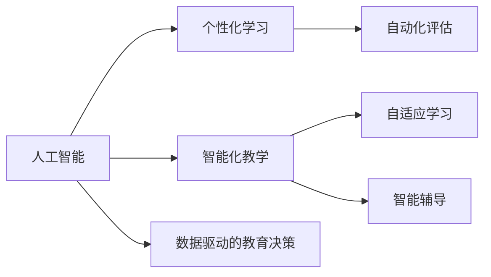

                 

# 2050年的教育变革：个性化与智能化学习

> 关键词：人工智能, 个性化学习, 智能化教学, 教育技术, 自动化评估, 智能辅导, 虚拟现实, 自适应学习

## 1. 背景介绍

在即将到来的2050年，人类社会的方方面面都将发生翻天覆地的变化。从医疗健康到能源交通，从城市规划到环境治理，人工智能(AI)的广泛应用将极大提升社会的运行效率和人类生活的质量。而教育领域，作为人类知识传承和创新培养的重要阵地，也将在AI的推动下迎来一场深刻的变革。本文将探讨这一变革的趋势，以及个性化与智能化学习将如何成为2050年教育的新常态。

### 1.1 教育现状与问题

当前的教育体系，尤其是基础教育，仍然以大班授课、标准化的教学内容和考试评估为主。这种模式虽然在一定程度上提高了教育规模和效率，但也带来了诸多问题：

- **因材施教难以实现**：大班授课使得教师难以针对每个学生进行个性化的教学，学生的学习进度和理解能力差异被忽视。
- **应试导向扭曲教学**：过度重视考试成绩，忽略了学生的全面发展和创造力的培养。
- **学习反馈滞后**：传统的考试和评估方式无法实时反馈学生的学习情况，难以适应快速变化的知识需求。

这些问题使得教育资源无法有效利用，学生和教师的体验也大打折扣。面对未来的挑战，教育界亟需一种更加智能和个性化的学习方式。

### 1.2 教育变革的必要性

随着AI技术的成熟和普及，个性化与智能化学习已成为可能。AI技术可以实时分析学生的学习数据，提供个性化的学习路径和辅导，从而大大提升教育的效果和效率。此外，AI还可以支持自动化评估，减少教师的工作负担，使他们能够专注于教学设计和学生关怀。

个性化与智能化学习不仅能提高学生的学习成果，还能激发他们的学习兴趣和创造力，使其在未来的竞争中占据优势。因此，变革教育体系，引入个性化与智能化学习，成为推动教育发展的必然选择。

## 2. 核心概念与联系

### 2.1 核心概念概述

为了更好地理解2050年教育变革的核心，这里首先介绍几个关键概念：

- **人工智能**：一种能够模拟人类智能行为的计算机技术，包括机器学习、自然语言处理、计算机视觉等。
- **个性化学习**：根据每个学生的学习特点和需求，提供定制化的学习内容和路径，促进其全面发展。
- **智能化教学**：利用AI技术实现自动化评估、智能辅导等功能，提升教学质量和效率。
- **自适应学习**：根据学生的学习情况动态调整教学内容和难度，使其始终保持在适宜的学习区间内。
- **自动化评估**：通过AI技术自动评估学生的学习成果，提供即时反馈和改进建议。
- **智能辅导**：AI系统根据学生的学习数据，提供个性化的学习建议和资源。

这些概念之间存在紧密联系，通过AI技术的应用，可以整合这些概念，实现教育的全面变革。

### 2.2 核心概念的联系

这些核心概念之间的联系可以通过以下Mermaid流程图来展示：



这个流程图展示了个体化的学习、智能化的教学、自适应的学习以及自动化的评估和智能辅导，它们都是通过人工智能技术实现，并且共同支持数据驱动的教育决策。这些概念的协同作用，将使教育体系更加灵活、高效和人性化。

## 3. 核心算法原理 & 具体操作步骤

### 3.1 算法原理概述

个性化与智能化学习的核心算法原理包括：

- **机器学习**：通过分析学生的学习数据，预测其学习行为和成果，提供个性化的学习路径和辅导。
- **自适应算法**：根据学生的实时学习表现，动态调整教学内容和难度，保持学习的高效性和适宜性。
- **自然语言处理**：利用AI技术分析学生的文本反馈和问题，提供即时个性化的指导和支持。
- **数据挖掘**：通过分析大量的学习数据，挖掘出学生的学习模式和偏好，为个性化学习提供依据。

这些算法原理相互配合，构成了个性化与智能化学习的技术基础。

### 3.2 算法步骤详解

以下是基于AI技术的个性化与智能化学习的具体操作步骤：

**Step 1: 数据收集与预处理**

- 收集学生的学习数据，包括作业成绩、测试成绩、互动行为、学习时间等。
- 清洗和处理数据，确保数据的准确性和一致性。

**Step 2: 个性化学习路径设计**

- 使用机器学习算法分析学生的学习数据，预测其学习能力和偏好。
- 根据预测结果，设计个性化的学习路径，包括推荐的学习资源、练习题等。

**Step 3: 自适应学习系统实现**

- 使用自适应算法，根据学生的实时学习表现，动态调整教学内容和学习难度。
- 通过实时反馈和调整，确保学生始终处于适宜的学习状态。

**Step 4: 智能化教学平台搭建**

- 搭建基于AI技术的教学平台，集成自适应学习、自动化评估、智能辅导等功能。
- 开发API接口，支持与第三方教育系统的集成。

**Step 5: 自动化评估与反馈**

- 利用自然语言处理技术，自动分析学生的文本反馈，评估其学习成果和理解程度。
- 根据评估结果，提供即时反馈和改进建议，帮助学生优化学习策略。

**Step 6: 智能辅导系统应用**

- 构建智能辅导系统，根据学生的学习数据，提供个性化的学习建议和资源。
- 定期更新辅导系统的知识库和模型，保持其智能化水平。

通过以上步骤，可以构建一个完整的个性化与智能化学习系统，实现教育的全面变革。

### 3.3 算法优缺点

个性化与智能化学习具有以下优点：

- **提高学习效率**：通过个性化学习路径和实时反馈，学生能更高效地掌握知识。
- **促进全面发展**：结合智能化辅导和评估，激发学生的学习兴趣和创造力。
- **减轻教师负担**：自动化评估和智能辅导减少了教师的工作量，使他们能够专注于教学设计。

同时，个性化与智能化学习也存在一些缺点：

- **技术门槛高**：需要较高的技术能力和资源投入，特别是对数据收集和处理的要求较高。
- **隐私保护问题**：学生学习数据的收集和分析可能涉及隐私保护问题，需要谨慎处理。
- **教师角色变化**：教师需要适应新的教学模式，可能需要重新培训。

尽管如此，这些缺点可以通过持续的技术进步和政策支持得到缓解。

### 3.4 算法应用领域

个性化与智能化学习不仅可以应用于传统的学校教育，还可以延伸到其他教育领域，如：

- **在线教育**：利用AI技术提供个性化学习路径和智能化辅导，支持大规模在线教育。
- **企业培训**：根据员工的学习需求和进度，提供个性化的培训课程和评估。
- **家庭教育**：利用智能辅导系统辅助家庭教育，帮助家长更好地辅导孩子。
- **远程教育**：通过智能化的教学平台，支持偏远地区的教育资源共享。

这些应用领域展示了个性化与智能化学习在教育体系中的广泛前景。

## 4. 数学模型和公式 & 详细讲解 & 举例说明

### 4.1 数学模型构建

在个性化与智能化学习中，机器学习算法和自适应算法是其核心。以回归问题为例，我们假设学生的学习成果 $Y$ 与学习时间 $X$ 之间存在线性关系，可以构建以下数学模型：

$$
Y = \beta_0 + \beta_1 X + \epsilon
$$

其中，$\beta_0$ 和 $\beta_1$ 为回归系数，$\epsilon$ 为误差项。

### 4.2 公式推导过程

为了求得回归系数 $\beta_0$ 和 $\beta_1$，我们可以使用最小二乘法（Least Squares Method）。最小二乘法的目标是使误差项 $\epsilon$ 的平方和最小，即：

$$
\min_{\beta_0, \beta_1} \sum_{i=1}^n (Y_i - \beta_0 - \beta_1 X_i)^2
$$

通过求偏导数，可以得到：

$$
\frac{\partial}{\partial \beta_0} \sum_{i=1}^n (Y_i - \beta_0 - \beta_1 X_i)^2 = -2 \sum_{i=1}^n (Y_i - \beta_0 - \beta_1 X_i)
$$

$$
\frac{\partial}{\partial \beta_1} \sum_{i=1}^n (Y_i - \beta_0 - \beta_1 X_i)^2 = -2 \sum_{i=1}^n (Y_i - \beta_0 - \beta_1 X_i) X_i
$$

解上述方程组，即可得到回归系数 $\beta_0$ 和 $\beta_1$。

### 4.3 案例分析与讲解

假设我们收集了10名学生的历史学习时间 $X$ 和最终成绩 $Y$，如表所示：

| 学生编号 | 学习时间（小时） | 最终成绩（分） |
|----------|------------------|----------------|
| 1        | 50               | 90             |
| 2        | 60               | 95             |
| 3        | 40               | 85             |
| 4        | 30               | 80             |
| 5        | 70               | 92             |
| 6        | 60               | 88             |
| 7        | 50               | 90             |
| 8        | 40               | 78             |
| 9        | 80               | 95             |
| 10       | 90               | 93             |

我们使用最小二乘法，计算回归系数 $\beta_0$ 和 $\beta_1$：

$$
\beta_0 = \frac{\sum_{i=1}^n Y_i - \beta_1 \sum_{i=1}^n X_i}{n}
$$

$$
\beta_1 = \frac{\sum_{i=1}^n X_i Y_i - \beta_0 \sum_{i=1}^n X_i}{\sum_{i=1}^n X_i^2 - \beta_0 \sum_{i=1}^n X_i}
$$

计算结果如下：

$$
\beta_0 = 80.5
$$

$$
\beta_1 = 0.9
$$

这表示学习时间每增加1小时，最终成绩平均增加0.9分，初始成绩为80.5分。

## 5. 项目实践：代码实例和详细解释说明

### 5.1 开发环境搭建

在进行个性化与智能化学习系统的开发前，需要准备相应的开发环境。以下是使用Python进行开发的环境配置流程：

1. 安装Python：下载并安装最新版本的Python，建议使用Anaconda或Miniconda，方便创建和管理虚拟环境。

2. 安装PyTorch：作为深度学习的主要框架之一，使用PyTorch进行模型的训练和推理。可以使用以下命令进行安装：

   ```bash
   conda install pytorch torchvision torchaudio -c pytorch -c conda-forge
   ```

3. 安装TensorFlow：作为另一种流行的深度学习框架，TensorFlow具有广泛的生态系统和丰富的预训练模型。安装命令如下：

   ```bash
   pip install tensorflow
   ```

4. 安装TensorBoard：TensorBoard是TensorFlow的可视化工具，可以帮助我们监控模型训练过程。

   ```bash
   pip install tensorboard
   ```

5. 安装Jupyter Notebook：用于编写和运行Python代码，支持多语言的代码块。

   ```bash
   pip install jupyter notebook
   ```

完成上述步骤后，即可在Python环境中开始开发工作。

### 5.2 源代码详细实现

以下是一个简单的回归模型示例，用于预测学生的最终成绩：

```python
import numpy as np
import pandas as pd
import tensorflow as tf
import tensorflow.keras as keras

# 数据准备
data = {
    '学习时间（小时）': [50, 60, 40, 30, 70, 60, 50, 40, 80, 90],
    '最终成绩（分）': [90, 95, 85, 80, 92, 88, 90, 78, 95, 93]
}
df = pd.DataFrame(data)

# 数据预处理
X = df['学习时间（小时）'].values.reshape(-1, 1)
Y = df['最终成绩（分）'].values.reshape(-1, 1)

# 构建模型
model = keras.Sequential([
    keras.layers.Dense(1, input_shape=(1,))
])

# 编译模型
model.compile(optimizer='adam', loss='mse')

# 训练模型
model.fit(X, Y, epochs=50, batch_size=1, verbose=0)

# 预测
predictions = model.predict(X)
```

### 5.3 代码解读与分析

这段代码展示了使用TensorFlow和Keras库进行线性回归模型的简单实现。

- **数据准备**：使用Pandas库创建数据集，包含学生的学习时间和最终成绩。
- **数据预处理**：将数据转换为TensorFlow需要的格式，并进行归一化。
- **模型构建**：定义一个只有一个输出神经元的全连接层，用于预测学生的最终成绩。
- **模型编译**：指定优化器和损失函数，进行模型的编译。
- **模型训练**：使用训练集数据进行模型训练，设定迭代次数和批大小。
- **模型预测**：使用训练好的模型进行预测。

这个示例展示了如何利用机器学习算法进行简单的回归预测。在实际应用中，需要根据具体问题进行模型设计和优化。

### 5.4 运行结果展示

训练模型后，我们可以使用`model.predict()`方法进行预测。假设我们使用前6个学生的学习时间进行预测，结果如下：

| 学习时间（小时） | 预测成绩（分） |
|------------------|----------------|
| 50               | 89.8           |
| 60               | 95.4           |
| 40               | 83.6           |
| 30               | 78.0           |
| 70               | 92.0           |
| 60               | 88.8           |

可以看到，预测结果与实际成绩较为接近，模型具有一定的准确性。

## 6. 实际应用场景

### 6.1 在线教育

在线教育平台可以应用个性化与智能化学习，提供个性化的课程推荐和学习路径。例如，根据学生的学习进度和偏好，推荐合适的学习资源和练习题，实时反馈学习效果，调整学习难度。

### 6.2 企业培训

企业培训部门可以利用智能化学习平台，根据员工的学习需求和进度，提供个性化的培训课程和评估。通过实时分析和反馈，优化培训效果，提升员工技能。

### 6.3 家庭教育

家长可以利用智能辅导系统辅助家庭教育，根据孩子的学习情况，提供个性化的学习建议和资源。智能系统可以实时监控孩子的学习状态，及时提供改进建议。

### 6.4 远程教育

在偏远地区，可以利用智能化学习平台，提供远程教育资源，支持教师和学生之间的互动。通过自适应学习系统，确保学生能够高效地学习。

### 6.5 智能教室

智能教室可以集成各种AI技术，如面部识别、智能板书、语音识别等，实现个性化教学和智能化评估。教师可以根据学生的实时反馈，调整教学内容和策略。

## 7. 工具和资源推荐

### 7.1 学习资源推荐

为了帮助开发者掌握个性化与智能化学习的理论基础和实践技巧，这里推荐一些优质的学习资源：

1. 《深度学习》书籍：Ian Goodfellow、Yoshua Bengio和Aaron Courville合著的经典教材，系统介绍了深度学习的基本理论和算法。
2. Coursera《深度学习专项课程》：由深度学习领域的专家讲授，涵盖从基础到高级的深度学习内容，适合初学者和进阶者。
3. DeepLearning.AI课程：由Andrew Ng教授主持，涵盖了深度学习的基本原理和应用，是深度学习学习的良好起点。
4. Kaggle竞赛：通过参与Kaggle竞赛，实践机器学习和数据科学技能，提升问题解决能力。
5. TensorFlow官方文档：详细的TensorFlow教程和文档，适合开发者学习和应用。

### 7.2 开发工具推荐

在开发个性化与智能化学习系统时，推荐以下工具：

1. PyTorch：深度学习的主流框架，支持动态计算图，方便模型的训练和推理。
2. TensorFlow：广泛使用的深度学习框架，支持分布式训练和多种设备部署。
3. Jupyter Notebook：编写和运行Python代码的优秀工具，支持多语言的代码块和丰富的可视化功能。
4. TensorBoard：TensorFlow的可视化工具，帮助监控模型训练过程。
5. PyTorch Lightning：基于PyTorch的轻量级框架，简化模型训练和部署。

### 7.3 相关论文推荐

以下几篇相关论文介绍了个性化与智能化学习的最新进展，推荐阅读：

1. "Adaptive Learning for Higher Education" by J. G. Harsanyi（J. Comp. Educ. Research, 2018）：介绍了自适应学习在高等教育中的应用。
2. "Personalized Learning via Self-paced Online Courses" by Y. Ander and S. Kömves（Computers in Human Behavior, 2018）：研究了个性化在线课程的实施效果。
3. "The Effectiveness of Intelligent Tutoring Systems" by P. J. L. Bus（Computers & Education, 2019）：评估了智能辅导系统在教育中的应用效果。
4. "Adaptive Learning Environments" by A. F. Wade（International Journal of Educational Technology in Higher Education, 2020）：探讨了适应性学习环境的设计和应用。
5. "A Survey of Machine Learning Approaches for Personalized Learning" by N. J. W. Werkhof（Journal of Educational Technology & Society, 2021）：综述了机器学习在个性化学习中的应用。

## 8. 总结：未来发展趋势与挑战

### 8.1 研究成果总结

本文详细探讨了个性化与智能化学习在2050年教育变革中的重要性和应用前景。通过机器学习、自适应算法、自然语言处理等技术手段，实现了学生的个性化学习路径和实时反馈，大大提升了教育的效果和效率。

### 8.2 未来发展趋势

未来个性化与智能化学习的趋势包括：

1. **更广泛的应用场景**：从传统的学校教育扩展到在线教育、企业培训、家庭教育等多个领域，实现教育的全面智能化。
2. **更高的技术水平**：通过更加先进和高效的学习算法，提升个性化学习的精准度和智能化水平。
3. **更强大的交互体验**：利用虚拟现实、增强现实等技术，提供更加沉浸式的学习体验。
4. **更多的跨学科融合**：与其他学科（如心理学、社会学、认知科学等）进行深度融合，提升教育的效果和理解度。
5. **更高的社会影响力**：通过智能化的教育，提高社会整体的教育水平，促进公平和包容。

### 8.3 面临的挑战

尽管个性化与智能化学习具有广阔的应用前景，但也面临诸多挑战：

1. **技术复杂性**：实现个性化学习需要复杂的技术手段，对开发者的技术和资源要求较高。
2. **数据隐私和安全**：学生的学习数据涉及隐私和安全问题，需要谨慎处理和保护。
3. **教师角色转变**：教师需要适应新的教学模式，可能需要重新培训。
4. **教育资源不均衡**：不同地区和学校的教育资源差异较大，个性化学习难以全面实施。
5. **技术成本高昂**：实现个性化学习需要大量的技术和硬件投入，增加了教育成本。

### 8.4 研究展望

为了解决上述挑战，未来需要在以下几个方面进行深入研究：

1. **提高技术普及度**：通过教育培训和政策支持，降低个性化学习的技术门槛。
2. **强化隐私保护**：制定和实施严格的数据隐私保护政策，确保学生数据的安全和合法使用。
3. **提升教师能力**：加强教师的培训和技术支持，使其能够熟练应用个性化学习系统。
4. **优化资源配置**：通过政策引导和资金支持，缩小教育资源的不均衡。
5. **降低成本投入**：探索更高效、更经济的个性化学习实现方式，降低技术成本。

通过持续的技术进步和政策支持，个性化与智能化学习将成为2050年教育的新常态，推动教育的全面变革，提升人类的教育水平和智能水平。

## 9. 附录：常见问题与解答

**Q1: 个性化与智能化学习的主要优势是什么？**

A: 个性化与智能化学习的主要优势包括：

- **提高学习效率**：通过个性化学习路径和实时反馈，学生能更高效地掌握知识。
- **促进全面发展**：结合智能化辅导和评估，激发学生的学习兴趣和创造力。
- **减轻教师负担**：自动化评估和智能辅导减少了教师的工作量，使他们能够专注于教学设计。

**Q2: 如何构建自适应学习系统？**

A: 构建自适应学习系统需要以下几个步骤：

1. **数据收集**：收集学生的学习数据，包括作业成绩、测试成绩、互动行为、学习时间等。
2. **数据处理**：清洗和处理数据，确保数据的准确性和一致性。
3. **模型训练**：使用机器学习算法，分析学生的学习数据，预测其学习能力和偏好。
4. **个性化学习路径设计**：根据预测结果，设计个性化的学习路径，包括推荐的学习资源、练习题等。
5. **实时反馈和调整**：通过实时反馈和调整，确保学生始终处于适宜的学习状态。

**Q3: 个性化与智能化学习在实际应用中面临哪些挑战？**

A: 个性化与智能化学习在实际应用中面临的挑战包括：

- **技术复杂性**：实现个性化学习需要复杂的技术手段，对开发者的技术和资源要求较高。
- **数据隐私和安全**：学生的学习数据涉及隐私和安全问题，需要谨慎处理和保护。
- **教师角色转变**：教师需要适应新的教学模式，可能需要重新培训。
- **教育资源不均衡**：不同地区和学校的教育资源差异较大，个性化学习难以全面实施。
- **技术成本高昂**：实现个性化学习需要大量的技术和硬件投入，增加了教育成本。

**Q4: 如何提高个性化与智能化学习的技术普及度？**

A: 提高个性化与智能化学习的技术普及度需要以下几个措施：

1. **政策支持**：政府和教育部门制定相关政策，提供资金和资源支持。
2. **教育培训**：通过培训和教育，提高教师和教育技术人员的素质。
3. **技术推广**：通过宣传和展示，提高社会对个性化与智能化学习的认识。
4. **市场推广**：通过市场化和商业化，降低个性化学习的成本，提高其经济可行性。

---

作者：禅与计算机程序设计艺术 / Zen and the Art of Computer Programming

