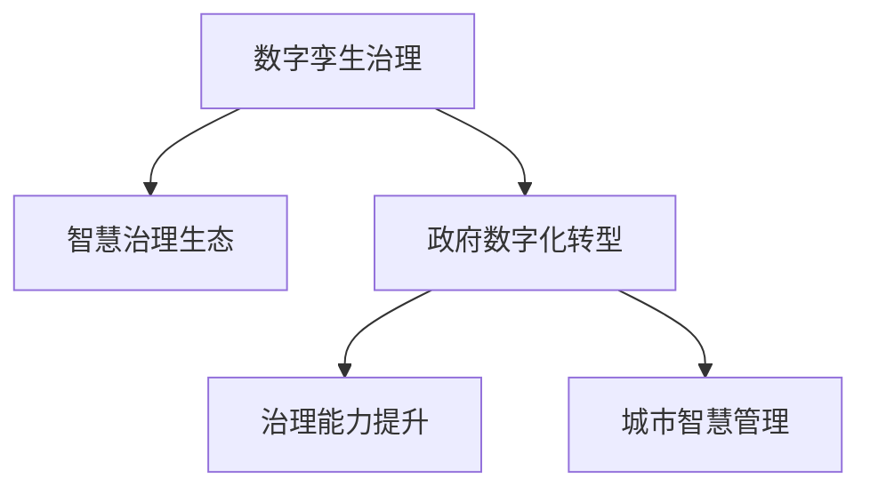

                 

# 2050年的数字治理：从数字孪生治理到智慧治理生态的数字治理升级

> 关键词：数字孪生治理,智慧治理生态,政府数字化转型,治理能力提升,城市智慧管理,大数据,人工智能,区块链,数据安全

## 1. 背景介绍

### 1.1 问题由来
随着数字化进程的加速，数字治理成为全球各国政府及城市管理的重要战略方向。当前，传统的数字治理模式已难以适应快速变化的数字时代，需要通过先进的科技手段和技术框架进行升级和创新。数字治理的核心目标是通过数字技术优化政府及社会治理流程，提升公共服务效率，增强治理能力，实现智慧社会。

### 1.2 问题核心关键点
当前数字治理面临的主要挑战包括：
- **数据孤岛**：各政府部门和城市管理系统间数据共享不足，导致信息孤岛和决策碎片化。
- **治理效率低**：传统的人工操作和信息处理方式无法满足实时、高效、精细化的治理需求。
- **数据安全**：海量数据的收集、存储、传输和使用过程中存在隐私保护和数据安全的风险。
- **用户体验差**：现有系统多采用冗余、复杂的操作界面，用户体验不佳。
- **技术迭代慢**：数字化转型涉及多领域多部门，技术更新迭代速度与业务需求对接不及时。

### 1.3 问题研究意义
开展数字治理升级研究，有助于：
- 提升政府及城市管理效率和决策科学性，实现智能化、精准化治理。
- 优化数据流通和共享机制，打破信息孤岛，实现全域治理。
- 强化数据安全防护措施，确保治理数据的安全可靠。
- 改善用户体验，提高政府服务的可访问性、易用性和满意度。
- 加速技术创新，促进数字化转型与业务需求的对接。

## 2. 核心概念与联系

### 2.1 核心概念概述

为更好地理解数字治理升级的框架与机制，本节将介绍几个核心概念：

- **数字孪生治理**：通过数字模型来映射现实世界，创建虚拟的双生治理系统，实现对真实治理过程的预测、优化和监控。
- **智慧治理生态**：由政府、企业、社会组织等多方参与，利用大数据、云计算、人工智能、区块链等技术构建的智慧化治理网络。
- **政府数字化转型**：通过技术手段改造政府业务流程，提升政务服务效率和治理能力。
- **治理能力提升**：通过数字化手段提升政府的预测能力、决策能力和执行能力。
- **城市智慧管理**：利用智慧技术提升城市规划、环境监测、公共安全等方面的管理水平。

这些核心概念之间的逻辑关系可以通过以下Mermaid流程图来展示：



这个流程图展示了大语言模型的核心概念及其之间的关系：

1. 数字孪生治理通过构建虚拟治理系统，映射现实世界的治理过程。
2. 智慧治理生态利用多项技术构建智慧化的治理网络。
3. 政府数字化转型通过技术手段优化政府业务流程。
4. 治理能力提升旨在提升政府预测、决策和执行能力。
5. 城市智慧管理通过智慧技术提升城市管理水平。

这些概念共同构成了未来数字治理的基本框架，引领着数字治理技术的不断创新和应用。

## 3. 核心算法原理 & 具体操作步骤
### 3.1 算法原理概述

数字治理升级的核心在于通过数字化手段提升治理能力，构建智慧治理生态。其核心思想是：
- **数据驱动**：利用大数据、人工智能等技术，从海量数据中提取治理规律和决策依据。
- **智能决策**：结合预测分析和机器学习算法，进行智能决策和预测。
- **协同治理**：通过区块链、互联网等技术实现多方协同治理。
- **智慧监管**：利用智慧技术实现对治理过程的实时监控和风险预警。

通过这些技术手段，数字治理系统可以实现从简单任务处理到复杂决策优化的全面升级，从而实现治理能力的质的飞跃。

### 3.2 算法步骤详解

数字治理升级的具体实施步骤可以分为以下几个关键环节：

**Step 1: 数据采集与治理**
- 收集和整合来自政府部门、城市管理系统的多源数据，如人口信息、交通数据、环境数据、公共服务数据等。
- 采用数据清洗、去重、整合等方法处理数据质量问题。
- 使用大数据技术对数据进行预处理，如数据存储、索引、分类等。

**Step 2: 数据融合与分析**
- 使用数据融合技术将不同来源的数据进行整合，消除数据孤岛。
- 利用机器学习和深度学习技术，对数据进行多维度分析，提取治理规律和特征。
- 构建多层次、多角度的治理数据模型，支持复杂决策和预测。

**Step 3: 智能决策与预测**
- 结合预测分析和机器学习算法，构建智能决策引擎，实现精准预测和决策。
- 开发智能推荐系统，根据用户行为和偏好进行个性化服务。
- 使用决策树、随机森林、神经网络等算法进行风险评估和异常预警。

**Step 4: 协同治理与监管**
- 利用区块链技术构建协同治理平台，实现多方数据共享和协同决策。
- 使用互联网和物联网技术，实现智慧城市管理和实时监控。
- 开发智能监管系统，实时监控治理过程，及时发现和处理风险。

**Step 5: 系统集成与部署**
- 将各子系统集成到统一的治理平台，确保系统间的互操作性和数据流通。
- 采用微服务架构，实现系统模块化、可扩展化。
- 部署系统到云平台，确保系统的可用性、稳定性和扩展性。

### 3.3 算法优缺点

数字治理升级的优势包括：
1. **高效性**：通过数据驱动和智能决策，提高治理效率和决策准确性。
2. **全面性**：结合多源数据和多层次分析，实现全面治理。
3. **协同性**：利用协同治理平台，实现多方协同，提升治理合力。
4. **智能化**：采用智慧技术，实现治理过程的自动化和智能化。
5. **持续性**：通过持续学习和优化，不断提升治理能力。

不足之处在于：
1. **数据依赖**：数字治理依赖高质量数据，数据收集和处理成本较高。
2. **技术复杂**：涉及大数据、人工智能、区块链等技术，技术门槛较高。
3. **隐私保护**：数据隐私保护和安全防范需进一步加强。
4. **人才需求**：需要多领域技术人才，培养和引进难度较大。
5. **系统集成**：系统集成和互操作性问题需逐步解决。

尽管存在这些局限，数字治理升级仍然是未来政府及城市治理的重要方向，需要通过不断创新和技术迭代，逐步解决上述问题。

### 3.4 算法应用领域

数字治理升级技术已在多个领域得到应用，以下是几个典型的应用场景：

- **智慧城市管理**：利用智慧技术提升城市规划、交通管理、公共服务等方面的管理水平。
- **公共卫生治理**：通过大数据分析预测疾病流行趋势，实现疫情监测、疫苗接种管理等。
- **环境治理**：利用智慧监测系统，实时监测污染源和环境数据，提升环保管理能力。
- **社会治安治理**：结合预测分析和智能监控系统，提升社会治安防范能力。
- **应急管理**：通过大数据分析，预测自然灾害和突发事件，提前做好应对准备。

此外，数字治理升级技术还广泛应用于国土资源管理、教育公平、医疗健康等多个领域，为社会治理提供强有力的技术支撑。

## 4. 数学模型和公式 & 详细讲解 & 举例说明
### 4.1 数学模型构建

数字治理升级的技术实现依赖于多个数学模型和算法，以下简要介绍几个核心模型及其应用。

**数据融合模型**
- 模型定义：将来自不同来源的数据进行融合，消除数据孤岛。
- 公式表示：$\text{Fusion}(\mathcal{D}_1, \mathcal{D}_2, \ldots, \mathcal{D}_n) = \bigcup_{i=1}^n \mathcal{D}_i$

**智能决策模型**
- 模型定义：利用预测分析和机器学习算法，进行智能决策和预测。
- 公式表示：$\text{Decision}(\mathcal{D}, \mathcal{M}) = f(\mathcal{D}, \mathcal{M})$，其中 $\mathcal{D}$ 为治理数据集，$\mathcal{M}$ 为机器学习模型。

**协同治理模型**
- 模型定义：利用区块链和互联网技术，实现多方协同治理。
- 公式表示：$\text{Collaboration}(\mathcal{P}, \mathcal{B}, \mathcal{I}) = \text{Multi-party}(\mathcal{P}, \mathcal{B}, \mathcal{I})$，其中 $\mathcal{P}$ 为参与方集合，$\mathcal{B}$ 为区块链，$\mathcal{I}$ 为智能合约。

**智慧监管模型**
- 模型定义：利用智慧技术实现对治理过程的实时监控和风险预警。
- 公式表示：$\text{Supervision}(\mathcal{S}, \mathcal{I}, \mathcal{A}) = \text{Real-time}(\mathcal{S}, \mathcal{I}, \mathcal{A})$，其中 $\mathcal{S}$ 为被监管对象，$\mathcal{I}$ 为智能感知设备，$\mathcal{A}$ 为异常检测算法。

### 4.2 公式推导过程

以下对智能决策模型和数据融合模型的推导过程进行详细讲解：

**智能决策模型推导**
假设治理数据集为 $\mathcal{D} = \{(x_i, y_i)\}_{i=1}^N$，其中 $x_i$ 为治理特征，$y_i$ 为治理目标。机器学习模型为 $\mathcal{M} = (h, \theta)$，其中 $h$ 为决策函数，$\theta$ 为模型参数。

智能决策模型的推导步骤如下：
1. 数据预处理：对治理数据进行归一化、特征选择等预处理。
2. 模型训练：通过训练数据集 $\mathcal{D}$ 训练模型参数 $\theta$。
3. 模型预测：使用训练好的模型对新数据进行预测。
4. 模型评估：对预测结果进行评估，选择性能最佳的模型。

**数据融合模型推导**
数据融合模型通过将多个数据源进行整合，消除数据孤岛。其推导过程如下：
1. 数据收集：从不同来源收集治理数据 $\mathcal{D}_1, \mathcal{D}_2, \ldots, \mathcal{D}_n$。
2. 数据清洗：对收集到的数据进行清洗、去重等处理。
3. 数据集成：将数据进行统一存储和索引。
4. 数据融合：将数据进行整合，消除数据孤岛。

通过上述模型推导，可以更好地理解数字治理升级的核心算法和原理。

### 4.3 案例分析与讲解

**智慧城市管理案例分析**
以智慧城市管理为例，其治理数据集 $\mathcal{D}$ 包括交通流量、环境污染、公共服务使用情况等数据。使用数据融合模型将不同来源的数据进行整合，构建城市治理数据模型。结合智能决策模型，预测交通拥堵情况，优化交通管理策略。同时，利用智慧技术实现对城市治理的实时监控和风险预警，提升城市治理能力。

**环境治理案例分析**
在环境治理中，治理数据集 $\mathcal{D}$ 包括污染源数据、气象数据、环境监测数据等。通过数据融合模型将数据进行整合，构建环境治理数据模型。结合智能决策模型，预测环境污染趋势，制定环保管理措施。同时，利用智慧技术实时监控环境污染情况，及时发现和处理污染源，提升环保管理水平。

## 5. 项目实践：代码实例和详细解释说明
### 5.1 开发环境搭建

在进行数字治理升级实践前，我们需要准备好开发环境。以下是使用Python进行PyTorch开发的环境配置流程：

1. 安装Anaconda：从官网下载并安装Anaconda，用于创建独立的Python环境。

2. 创建并激活虚拟环境：
```bash
conda create -n digital-governance python=3.8 
conda activate digital-governance
```

3. 安装PyTorch：根据CUDA版本，从官网获取对应的安装命令。例如：
```bash
conda install pytorch torchvision torchaudio cudatoolkit=11.1 -c pytorch -c conda-forge
```

4. 安装Transformers库：
```bash
pip install transformers
```

5. 安装各类工具包：
```bash
pip install numpy pandas scikit-learn matplotlib tqdm jupyter notebook ipython
```

完成上述步骤后，即可在`digital-governance`环境中开始实践。

### 5.2 源代码详细实现

下面我们以智慧城市管理为例，给出使用Transformers库对BERT模型进行微调的PyTorch代码实现。

首先，定义智慧城市管理的数据处理函数：

```python
from transformers import BertTokenizer
from torch.utils.data import Dataset
import torch

class SmartCityDataset(Dataset):
    def __init__(self, texts, tags, tokenizer, max_len=128):
        self.texts = texts
        self.tags = tags
        self.tokenizer = tokenizer
        self.max_len = max_len
        
    def __len__(self):
        return len(self.texts)
    
    def __getitem__(self, item):
        text = self.texts[item]
        tags = self.tags[item]
        
        encoding = self.tokenizer(text, return_tensors='pt', max_length=self.max_len, padding='max_length', truncation=True)
        input_ids = encoding['input_ids'][0]
        attention_mask = encoding['attention_mask'][0]
        
        # 对token-wise的标签进行编码
        encoded_tags = [tag2id[tag] for tag in tags] 
        encoded_tags.extend([tag2id['O']] * (self.max_len - len(encoded_tags)))
        labels = torch.tensor(encoded_tags, dtype=torch.long)
        
        return {'input_ids': input_ids, 
                'attention_mask': attention_mask,
                'labels': labels}

# 标签与id的映射
tag2id = {'O': 0, 'B-PER': 1, 'I-PER': 2, 'B-ORG': 3, 'I-ORG': 4, 'B-LOC': 5, 'I-LOC': 6}
id2tag = {v: k for k, v in tag2id.items()}

# 创建dataset
tokenizer = BertTokenizer.from_pretrained('bert-base-cased')

train_dataset = SmartCityDataset(train_texts, train_tags, tokenizer)
dev_dataset = SmartCityDataset(dev_texts, dev_tags, tokenizer)
test_dataset = SmartCityDataset(test_texts, test_tags, tokenizer)
```

然后，定义模型和优化器：

```python
from transformers import BertForTokenClassification, AdamW

model = BertForTokenClassification.from_pretrained('bert-base-cased', num_labels=len(tag2id))

optimizer = AdamW(model.parameters(), lr=2e-5)
```

接着，定义训练和评估函数：

```python
from torch.utils.data import DataLoader
from tqdm import tqdm
from sklearn.metrics import classification_report

device = torch.device('cuda') if torch.cuda.is_available() else torch.device('cpu')
model.to(device)

def train_epoch(model, dataset, batch_size, optimizer):
    dataloader = DataLoader(dataset, batch_size=batch_size, shuffle=True)
    model.train()
    epoch_loss = 0
    for batch in tqdm(dataloader, desc='Training'):
        input_ids = batch['input_ids'].to(device)
        attention_mask = batch['attention_mask'].to(device)
        labels = batch['labels'].to(device)
        model.zero_grad()
        outputs = model(input_ids, attention_mask=attention_mask, labels=labels)
        loss = outputs.loss
        epoch_loss += loss.item()
        loss.backward()
        optimizer.step()
    return epoch_loss / len(dataloader)

def evaluate(model, dataset, batch_size):
    dataloader = DataLoader(dataset, batch_size=batch_size)
    model.eval()
    preds, labels = [], []
    with torch.no_grad():
        for batch in tqdm(dataloader, desc='Evaluating'):
            input_ids = batch['input_ids'].to(device)
            attention_mask = batch['attention_mask'].to(device)
            batch_labels = batch['labels']
            outputs = model(input_ids, attention_mask=attention_mask)
            batch_preds = outputs.logits.argmax(dim=2).to('cpu').tolist()
            batch_labels = batch_labels.to('cpu').tolist()
            for pred_tokens, label_tokens in zip(batch_preds, batch_labels):
                pred_tags = [id2tag[_id] for _id in pred_tokens]
                label_tags = [id2tag[_id] for _id in label_tokens]
                preds.append(pred_tags[:len(label_tokens)])
                labels.append(label_tags)
                
    print(classification_report(labels, preds))
```

最后，启动训练流程并在测试集上评估：

```python
epochs = 5
batch_size = 16

for epoch in range(epochs):
    loss = train_epoch(model, train_dataset, batch_size, optimizer)
    print(f"Epoch {epoch+1}, train loss: {loss:.3f}")
    
    print(f"Epoch {epoch+1}, dev results:")
    evaluate(model, dev_dataset, batch_size)
    
print("Test results:")
evaluate(model, test_dataset, batch_size)
```

以上就是使用PyTorch对BERT进行智慧城市管理任务微调的完整代码实现。可以看到，得益于Transformers库的强大封装，我们可以用相对简洁的代码完成BERT模型的加载和微调。

### 5.3 代码解读与分析

让我们再详细解读一下关键代码的实现细节：

**SmartCityDataset类**：
- `__init__`方法：初始化文本、标签、分词器等关键组件。
- `__len__`方法：返回数据集的样本数量。
- `__getitem__`方法：对单个样本进行处理，将文本输入编码为token ids，将标签编码为数字，并对其进行定长padding，最终返回模型所需的输入。

**tag2id和id2tag字典**：
- 定义了标签与数字id之间的映射关系，用于将token-wise的预测结果解码回真实的标签。

**训练和评估函数**：
- 使用PyTorch的DataLoader对数据集进行批次化加载，供模型训练和推理使用。
- 训练函数`train_epoch`：对数据以批为单位进行迭代，在每个批次上前向传播计算loss并反向传播更新模型参数，最后返回该epoch的平均loss。
- 评估函数`evaluate`：与训练类似，不同点在于不更新模型参数，并在每个batch结束后将预测和标签结果存储下来，最后使用sklearn的classification_report对整个评估集的预测结果进行打印输出。

**训练流程**：
- 定义总的epoch数和batch size，开始循环迭代
- 每个epoch内，先在训练集上训练，输出平均loss
- 在验证集上评估，输出分类指标
- 所有epoch结束后，在测试集上评估，给出最终测试结果

可以看到，PyTorch配合Transformers库使得BERT微调的代码实现变得简洁高效。开发者可以将更多精力放在数据处理、模型改进等高层逻辑上，而不必过多关注底层的实现细节。

当然，工业级的系统实现还需考虑更多因素，如模型的保存和部署、超参数的自动搜索、更灵活的任务适配层等。但核心的微调范式基本与此类似。

## 6. 实际应用场景
### 6.1 智能客服系统

基于数字孪生治理和智慧治理生态的智能客服系统，可以应用于各种政府部门和公共服务机构。传统客服往往需要配备大量人力，高峰期响应缓慢，且一致性和专业性难以保证。

在技术实现上，可以收集企业内部的历史客服对话记录，将问题和最佳答复构建成监督数据，在此基础上对预训练对话模型进行微调。微调后的对话模型能够自动理解用户意图，匹配最合适的答案模板进行回复。对于客户提出的新问题，还可以接入检索系统实时搜索相关内容，动态组织生成回答。如此构建的智能客服系统，能大幅提升客户咨询体验和问题解决效率。

### 6.2 公共卫生治理

数字化公共卫生治理体系，通过大数据分析预测疾病流行趋势，实现疫情监测、疫苗接种管理等。具体而言，可以收集公共卫生领域的相关数据，如病例数、疫苗接种情况、公共卫生事件等。使用数据融合模型将不同来源的数据进行整合，构建公共卫生治理数据模型。结合智能决策模型，预测疾病流行趋势，制定相应的防控措施。同时，利用智慧技术实时监控公共卫生事件，及时发现和处理风险。

### 6.3 环境治理

利用数字治理升级技术，可以构建智能化的环境治理体系。通过智慧监测系统，实时收集环境污染数据，如大气质量、水质、噪声等。使用数据融合模型将数据进行整合，构建环境治理数据模型。结合智能决策模型，预测环境污染趋势，制定环保管理措施。同时，利用智慧技术实时监控环境污染情况，及时发现和处理污染源，提升环保管理水平。

### 6.4 未来应用展望

随着数字治理技术的不断发展，未来数字治理将呈现以下几个发展趋势：

1. **智能化和自动化**：数字治理将更多地采用智能化和自动化手段，如AI决策、智慧监管等，提升治理效率和精度。
2. **数据驱动**：数据驱动将成为数字治理的核心，通过大数据分析提取治理规律，实现精准决策。
3. **跨部门协同**：数字治理将实现跨部门协同，打破信息孤岛，提升治理合力。
4. **多模态融合**：利用多模态数据（如文本、视频、图像等）进行综合治理，提升治理效果。
5. **隐私保护**：数字治理将高度重视数据隐私保护，构建安全可靠的治理体系。

以上趋势凸显了数字治理技术的广阔前景。这些方向的探索发展，必将进一步提升政府及城市治理的智能化水平，为构建智慧社会提供坚实技术支撑。

## 7. 工具和资源推荐
### 7.1 学习资源推荐

为了帮助开发者系统掌握数字治理升级的理论基础和实践技巧，这里推荐一些优质的学习资源：

1. 《数字治理技术与应用》系列博文：由数字治理专家撰写，深入浅出地介绍了数字治理的技术原理和应用场景。

2. 《数字政府建设与实践》课程：国内外知名高校开设的NLP明星课程，有Lecture视频和配套作业，带你入门数字治理领域的基本概念和经典模型。

3. 《智慧城市管理与治理》书籍：全面介绍智慧城市管理与治理的理论和技术，涵盖数据融合、智能决策、智慧监管等多个方面。

4. 《数字治理升级之路》一书：详细阐述数字治理升级的理论与实践，涵盖数字孪生治理、智慧治理生态、政府数字化转型等多个方向。

5. 数字治理升级官网：提供最新动态、技术分享、项目案例等资源，是了解数字治理升级的重要平台。

通过对这些资源的学习实践，相信你一定能够快速掌握数字治理升级的精髓，并用于解决实际的治理问题。
###  7.2 开发工具推荐

高效的开发离不开优秀的工具支持。以下是几款用于数字治理升级开发的常用工具：

1. PyTorch：基于Python的开源深度学习框架，灵活动态的计算图，适合快速迭代研究。大部分预训练语言模型都有PyTorch版本的实现。

2. TensorFlow：由Google主导开发的开源深度学习框架，生产部署方便，适合大规模工程应用。同样有丰富的预训练语言模型资源。

3. Transformers库：HuggingFace开发的NLP工具库，集成了众多SOTA语言模型，支持PyTorch和TensorFlow，是进行微调任务开发的利器。

4. Weights & Biases：模型训练的实验跟踪工具，可以记录和可视化模型训练过程中的各项指标，方便对比和调优。与主流深度学习框架无缝集成。

5. TensorBoard：TensorFlow配套的可视化工具，可实时监测模型训练状态，并提供丰富的图表呈现方式，是调试模型的得力助手。

6. Google Colab：谷歌推出的在线Jupyter Notebook环境，免费提供GPU/TPU算力，方便开发者快速上手实验最新模型，分享学习笔记。

合理利用这些工具，可以显著提升数字治理升级任务的开发效率，加快创新迭代的步伐。

### 7.3 相关论文推荐

数字治理升级的研究源于学界的持续研究。以下是几篇奠基性的相关论文，推荐阅读：

1. 《数字治理技术与应用》：提出数字治理的理论与实践框架，阐述数据融合、智能决策、智慧监管等多个关键技术。

2. 《智能城市治理体系》：通过智慧城市治理案例，展示数字治理在实际应用中的效果和优势。

3. 《智慧治理生态系统构建》：提出智慧治理生态系统的理论模型，阐述跨部门协同治理的机制与方法。

4. 《数字治理中的数据融合技术》：详细介绍数据融合技术在数字治理中的应用，涵盖数据清洗、数据集成等多个环节。

5. 《数字治理的未来展望》：通过展望未来数字治理的发展趋势，探讨智能治理、数据驱动、跨部门协同等方向。

这些论文代表了大语言模型微调技术的发展脉络。通过学习这些前沿成果，可以帮助研究者把握学科前进方向，激发更多的创新灵感。

## 8. 总结：未来发展趋势与挑战
### 8.1 研究成果总结

本文对数字治理升级的框架与机制进行了全面系统的介绍。首先阐述了数字治理升级的背景和意义，明确了数字治理升级在提升政府及城市治理效率、优化决策、保障数据安全等方面的重要作用。其次，从原理到实践，详细讲解了数字治理升级的数学模型和核心算法，给出了微调任务开发的完整代码实例。同时，本文还广泛探讨了数字治理升级在智慧城市管理、公共卫生治理、环境治理等多个领域的应用前景，展示了数字治理技术的巨大潜力。此外，本文精选了数字治理升级的学习资源，力求为读者提供全方位的技术指引。

通过本文的系统梳理，可以看到，数字治理升级是未来政府及城市治理的重要方向，通过数字化手段提升治理能力，构建智慧治理生态，必将在数字化转型中发挥重要作用。

### 8.2 未来发展趋势

展望未来，数字治理升级技术将呈现以下几个发展趋势：

1. **智能化和自动化**：数字治理将更多地采用智能化和自动化手段，如AI决策、智慧监管等，提升治理效率和精度。
2. **数据驱动**：数据驱动将成为数字治理的核心，通过大数据分析提取治理规律，实现精准决策。
3. **跨部门协同**：数字治理将实现跨部门协同，打破信息孤岛，提升治理合力。
4. **多模态融合**：利用多模态数据（如文本、视频、图像等）进行综合治理，提升治理效果。
5. **隐私保护**：数字治理将高度重视数据隐私保护，构建安全可靠的治理体系。

以上趋势凸显了数字治理技术的广阔前景。这些方向的探索发展，必将进一步提升政府及城市治理的智能化水平，为构建智慧社会提供坚实技术支撑。

### 8.3 面临的挑战

尽管数字治理升级技术已经取得了瞩目成就，但在迈向更加智能化、普适化应用的过程中，它仍面临诸多挑战：

1. **数据质量问题**：数字治理依赖高质量数据，数据收集和处理成本较高。数据质量的提升是未来发展的重要方向。
2. **技术复杂性**：数字治理涉及大数据、人工智能、区块链等技术，技术门槛较高。需要跨领域的知识储备和技术储备。
3. **数据隐私保护**：数据隐私保护和安全防范需进一步加强，确保数据使用的合规性和安全性。
4. **系统集成和互操作性**：系统集成和互操作性问题需逐步解决，确保各子系统间的协同工作。
5. **人才需求**：需要多领域技术人才，培养和引进难度较大。

尽管存在这些局限，数字治理升级仍然是未来政府及城市治理的重要方向，需要通过不断创新和技术迭代，逐步解决上述问题。

### 8.4 研究展望

面对数字治理升级所面临的挑战，未来的研究需要在以下几个方面寻求新的突破：

1. **数据治理技术创新**：通过数据清洗、数据集成、数据融合等技术手段，提升数据质量，降低数据依赖。
2. **智能决策系统优化**：优化智能决策模型，提高预测和决策的精度和可靠性。
3. **跨部门协同机制建设**：构建跨部门协同治理平台，实现数据共享和协同决策。
4. **智慧监管系统完善**：完善智慧监管系统，实现对治理过程的实时监控和风险预警。
5. **隐私保护技术研究**：研究隐私保护技术，确保数据使用的合规性和安全性。

这些研究方向的探索，必将引领数字治理技术的不断创新和应用，为构建智慧治理生态提供技术支撑。面向未来，数字治理技术还需要与其他人工智能技术进行更深入的融合，如知识表示、因果推理、强化学习等，多路径协同发力，共同推动数字化治理的进步。

## 9. 附录：常见问题与解答

**Q1：数字治理升级是否适用于所有NLP任务？**

A: 数字治理升级在大多数NLP任务上都能取得不错的效果，特别是对于数据量较小的任务。但对于一些特定领域的任务，如医学、法律等，仅仅依靠通用语料预训练的模型可能难以很好地适应。此时需要在特定领域语料上进一步预训练，再进行微调，才能获得理想效果。

**Q2：微调过程中如何选择合适的学习率？**

A: 微调的学习率一般要比预训练时小1-2个数量级，如果使用过大的学习率，容易破坏预训练权重，导致过拟合。一般建议从1e-5开始调参，逐步减小学习率，直至收敛。也可以使用warmup策略，在开始阶段使用较小的学习率，再逐渐过渡到预设值。需要注意的是，不同的优化器(如AdamW、Adafactor等)以及不同的学习率调度策略，可能需要设置不同的学习率阈值。

**Q3：采用数字治理升级时会面临哪些资源瓶颈？**

A: 当前主流的预训练大模型动辄以亿计的参数规模，对算力、内存、存储都提出了很高的要求。GPU/TPU等高性能设备是必不可少的，但即便如此，超大批次的训练和推理也可能遇到显存不足的问题。因此需要采用一些资源优化技术，如梯度积累、混合精度训练、模型并行等，来突破硬件瓶颈。同时，模型的存储和读取也可能占用大量时间和空间，需要采用模型压缩、稀疏化存储等方法进行优化。

**Q4：如何缓解数字治理升级过程中的过拟合问题？**

A: 过拟合是数字治理升级面临的主要挑战，尤其是在标注数据不足的情况下。常见的缓解策略包括：
1. 数据增强：通过回译、近义替换等方式扩充训练集
2. 正则化：使用L2正则、Dropout、Early Stopping等避免过拟合
3. 对抗训练：引入对抗样本，提高模型鲁棒性
4. 参数高效微调：只调整少量参数(如Adapter、Prefix等)，减小过拟合风险
5. 多模型集成：训练多个数字治理模型，取平均输出，抑制过拟合

这些策略往往需要根据具体任务和数据特点进行灵活组合。只有在数据、模型、训练、推理等各环节进行全面优化，才能最大限度地发挥数字治理升级的威力。

**Q5：数字治理升级在落地部署时需要注意哪些问题？**

A: 将数字治理升级模型转化为实际应用，还需要考虑以下因素：
1. 模型裁剪：去除不必要的层和参数，减小模型尺寸，加快推理速度
2. 量化加速：将浮点模型转为定点模型，压缩存储空间，提高计算效率
3. 服务化封装：将模型封装为标准化服务接口，便于集成调用
4. 弹性伸缩：根据请求流量动态调整资源配置，平衡服务质量和成本
5. 监控告警：实时采集系统指标，设置异常告警阈值，确保服务稳定性
6. 安全防护：采用访问鉴权、数据脱敏等措施，保障数据和模型安全

数字治理升级为智慧社会治理提供了强有力的技术支撑，但如何将强大的性能转化为稳定、高效、安全的业务价值，还需要工程实践的不断打磨。唯有从数据、算法、工程、业务等多个维度协同发力，才能真正实现数字治理升级的效果。总之，数字治理升级需要开发者根据具体任务，不断迭代和优化模型、数据和算法，方能得到理想的效果。

---

作者：禅与计算机程序设计艺术 / Zen and the Art of Computer Programming

