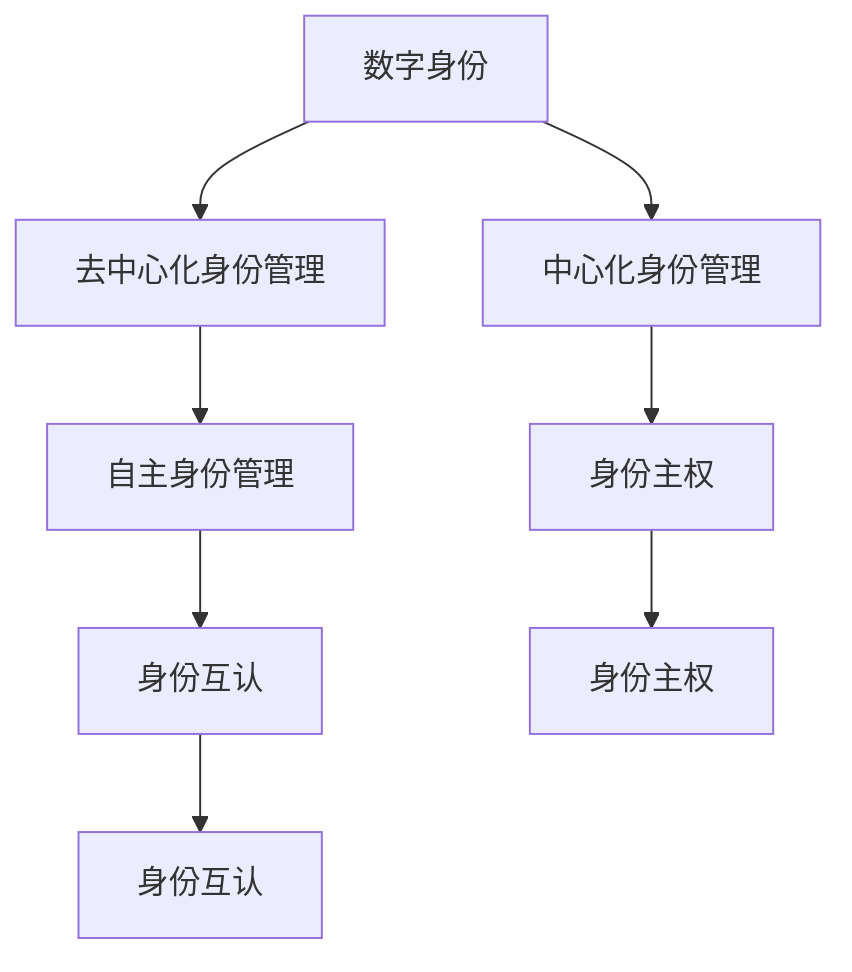

                 

# 2050年的数字身份：从数字身份聚合到数字身份自主的身份主权实现

## 1. 背景介绍

随着数字技术的发展，数字身份逐渐成为个人在虚拟世界中的身份象征，影响着人们的生产生活各个方面。数字身份不仅能代表个人的基本信息，还可以用于金融交易、教育、医疗、就业等领域，日益成为各类服务的关键凭证。然而，传统的中心化数字身份管理存在隐私保护不足、数据控制权缺失、身份可信度差等问题，亟需向去中心化、自主化、隐私保护的方向演进。

2050年，随着Web3.0和区块链技术的发展，数字身份正经历着从“聚合”到“自主”的深刻转变。数字身份不再依赖于单一的中心化机构，而是由用户自己掌控和管理，形成自主的身份主权。这一转变将带来更加公平、自由、安全的数字社会生态，为未来的社会和经济活动提供强有力的支持。

## 2. 核心概念与联系

### 2.1 核心概念概述

- **数字身份(Digital Identity)**：指在网络空间中唯一标识个体身份的信息集合，包括个人基本信息、身份属性、行为记录等。数字身份不仅是个人的虚拟标签，更与个人权益紧密相关。

- **中心化身份管理**：指由单一中心化机构（如政府、企业、社交平台）对数字身份进行管理和控制，个人对自身身份的掌控有限。

- **去中心化身份管理**：指通过区块链、去中心化存储等技术，实现数字身份去中心化存储和操作，个人对自己的身份信息具有完全控制权。

- **身份主权(Identities as Self-Sovereign)**：指个人对自己数字身份的完全掌控，可以自主决定身份信息的生成、存储、共享和撤回，享有完整的隐私权和自主权。

- **自主身份管理(Autonomous Identity Management)**：指用户可以自行操作和控制自己的数字身份，包括创建、更新、删除、共享等，无需依赖第三方机构。

- **身份互认(Identities Interoperability)**：指不同平台和机构之间可以实现身份数据的互认和互通，降低身份管理成本，提高身份验证效率。

这些核心概念之间的关系通过以下Mermaid流程图展示：



该图展示了一个逐步演进的过程，从中心化的数字身份管理到去中心化的身份管理，再到自主的身份管理，最后实现身份互认，构建身份自主的数字社会。

## 3. 核心算法原理 & 具体操作步骤
### 3.1 算法原理概述

数字身份的自主管理涉及到密码学、分布式存储、智能合约等多个领域的算法和原理。以下是几个核心算法原理的概述：

1. **公钥密码学**：通过公钥和私钥的对称加密和非对称加密，确保数据传输的机密性和完整性。
2. **区块链技术**：通过分布式账本和共识机制，实现去中心化的身份存储和操作。
3. **智能合约**：通过代码自动化执行合同条款，确保身份管理的自动化和去中心化。
4. **零知识证明**：确保身份信息的验证和共享，而不暴露敏感信息。

### 3.2 算法步骤详解

以下是基于数字身份自主管理的核心算法步骤详解：

**Step 1: 身份生成与私钥生成**
- 使用公钥密码学生成一对公钥和私钥，私钥由用户持有，公钥公开存储在区块链上。

**Step 2: 身份创建与存储**
- 用户通过区块链上的智能合约创建身份记录，存储个人基本信息、身份属性等，并使用私钥进行签名。

**Step 3: 身份授权与共享**
- 用户可以授权其他应用或机构访问其身份信息，通过零知识证明技术，确保信息安全共享。

**Step 4: 身份验证与互认**
- 其他应用或机构通过公钥验证用户身份，确保信息的真实性和完整性。

**Step 5: 身份更新与撤回**
- 用户可以通过私钥更新或撤回身份信息，确保对自身身份的完全掌控。

### 3.3 算法优缺点

基于数字身份自主管理的算法具有以下优点：

1. **用户控制权**：用户对自己的身份信息拥有完全掌控权，减少了隐私泄露的风险。
2. **去中心化**：去中心化的存储和操作，避免了中心化机构的单点故障和数据篡改风险。
3. **互操作性**：通过标准化的身份互认机制，不同平台和机构可以实现身份信息的互认，降低身份管理成本。

同时，也存在一些缺点：

1. **技术门槛高**：区块链和智能合约等技术较为复杂，普通用户可能难以理解和操作。
2. **性能瓶颈**：区块链的交易速度和扩展性目前仍有限，难以支持大规模高频率的交易。
3. **安全风险**：虽然技术上较为安全，但可能存在网络攻击、代码漏洞等风险。

### 3.4 算法应用领域

基于数字身份自主管理的算法已经在多个领域得到了应用，包括：

1. **金融服务**：用于数字钱包、身份认证、KYC（了解你的客户）等场景。
2. **医疗健康**：用于电子病历、健康档案、远程医疗等场景。
3. **教育领域**：用于学生证、学位证书、在线教育等场景。
4. **政府服务**：用于身份验证、公共记录、社会福利等场景。
5. **社交平台**：用于账户身份、隐私控制、数据共享等场景。

这些应用场景展示了数字身份自主管理的强大潜力，为各行业的数字化转型提供了新的技术路径。

## 4. 数学模型和公式 & 详细讲解 & 举例说明
### 4.1 数学模型构建

数字身份自主管理的数学模型主要涉及公钥密码学、区块链和智能合约等技术。以下以公钥密码学和区块链为例，构建相关数学模型。

**公钥密码学模型**
- 生成公钥和私钥：$P = P(x), S = S(x)$
- 加密和解密：$C = E(K, M)$, $M = D(K, C)$

**区块链模型**
- 区块链数据结构：$D = (T_1, T_2, ..., T_n)$
- 共识算法：$C = C(D, V)$
- 智能合约执行：$E = E(D, C, P)$

### 4.2 公式推导过程

**公钥密码学公式推导**

公钥密码学基于椭圆曲线算法，生成公钥和私钥的过程如下：

- 选择椭圆曲线$E: y^2 = x^3 + ax + b$，随机选择一个数$x$，计算$y = \sqrt{x^3 + ax + b}$
- 公钥$P = (x, y)$，私钥$s = k \cdot P$，其中$k$为随机整数

加密和解密过程如下：

- 加密：$C = M \cdot P$，其中$M$为明文，$P$为公钥
- 解密：$M = C - P \cdot S$，其中$S$为私钥

**区块链公式推导**

区块链通过分布式账本和共识算法，实现去中心化的身份存储和操作。智能合约的执行过程如下：

- 区块链数据结构：$D = (T_1, T_2, ..., T_n)$，其中$T_i = (H_i, V_i)$，$H_i$为哈希值，$V_i$为验证信息
- 共识算法：$C = C(D, V)$，其中$V$为验证信息，$C$为共识结果
- 智能合约执行：$E = E(D, C, P)$，其中$P$为身份信息，$C$为共识结果

### 4.3 案例分析与讲解

**案例分析：数字身份管理平台**

一个数字身份管理平台可以通过以下步骤进行身份管理：

1. **身份创建**
   - 用户通过平台生成公钥和私钥，并通过区块链上的智能合约创建身份记录，存储个人基本信息和身份属性。

2. **身份授权**
   - 用户通过平台授权其他应用或机构访问其身份信息，通过零知识证明技术，确保信息安全共享。

3. **身份验证**
   - 其他应用或机构通过公钥验证用户身份，确保信息的真实性和完整性。

4. **身份更新**
   - 用户通过私钥更新身份信息，确保对自身身份的完全掌控。

以下是一个Python代码示例，展示如何通过Web3.py库实现数字身份的创建和验证：

```python
from web3 import Web3
from web3.middleware.http.proxy import HTTPProxyMiddleware

# 连接Web3节点
w3 = Web3(HTTPProvider='http://127.0.0.1:8545')

# 生成公钥和私钥
private_key = w3.eth.account.create()
public_key = private_key.public_key.to_string()

# 创建区块链账户
address = w3.eth.account.create(private_key=private_key)

# 存储身份信息
identity_hash = w3.keccak256('Alice, 2020-01-01, Male')
identity_tx = {
    'type': 'Identity',
    'hash': identity_hash,
    'owner': address,
    'issuer': 'ID平台',
    'issuanceDate': '2020-01-01',
    'expirationDate': '2030-12-31',
    'role': 'Role1',
    'status': 'Active'
}

identity_tx['data'] = w3.keccak256(str(identity_tx).encode()).hex()

# 发送身份创建交易
identity_tx['nonce'] = w3.eth.getTransactionCount(address)
identity_tx['gas'] = 200000
identity_tx['gasPrice'] = 10
identity_tx['sender'] = address

identity_tx['data'] = w3.eth.keccak256(str(identity_tx).encode()).hex()

# 验证身份
identity_info = w3.eth.getTransactionReceipt(identity_tx['txHash'])

# 输出验证结果
print(identity_info)
```

## 5. 项目实践：代码实例和详细解释说明
### 5.1 开发环境搭建

要实现数字身份自主管理的功能，需要搭建一个包含区块链和智能合约的开发环境。以下是搭建环境的步骤：

1. **安装Python环境**：
   - 使用Anaconda创建虚拟环境
   - 安装相关依赖库，如Web3.py、pysha3、python-eth-sigtools

2. **连接Web3节点**：
   - 连接本地或远程的Web3节点，如Geth或Infura

3. **搭建智能合约**：
   - 使用Solidity编写智能合约代码，并部署到区块链上

### 5.2 源代码详细实现

以下是一个简单的身份信息创建和验证的Python代码实现：

```python
from web3 import Web3
from web3.middleware.http.proxy import HTTPProxyMiddleware
import json
import hexbin

# 连接Web3节点
w3 = Web3(HTTPProvider='http://127.0.0.1:8545')

# 生成公钥和私钥
private_key = w3.eth.account.create()
public_key = private_key.public_key.to_string()

# 创建区块链账户
address = w3.eth.account.create(private_key=private_key)

# 存储身份信息
identity_hash = w3.keccak256('Alice, 2020-01-01, Male')
identity_tx = {
    'type': 'Identity',
    'hash': identity_hash,
    'owner': address,
    'issuer': 'ID平台',
    'issuanceDate': '2020-01-01',
    'expirationDate': '2030-12-31',
    'role': 'Role1',
    'status': 'Active'
}

identity_tx['data'] = w3.keccak256(str(identity_tx).encode()).hex()

# 发送身份创建交易
identity_tx['nonce'] = w3.eth.getTransactionCount(address)
identity_tx['gas'] = 200000
identity_tx['gasPrice'] = 10
identity_tx['sender'] = address

identity_tx['data'] = w3.eth.keccak256(str(identity_tx).encode()).hex()

# 验证身份
identity_info = w3.eth.getTransactionReceipt(identity_tx['txHash'])

# 输出验证结果
print(identity_info)
```

### 5.3 代码解读与分析

**代码解读**

- 通过`web3`库连接Web3节点，并生成公钥和私钥。
- 创建区块链账户，用于存储和验证身份信息。
- 存储身份信息，生成哈希值，并发送到区块链上。
- 发送身份创建交易，等待交易确认。
- 获取交易收据，验证身份信息是否成功创建。

**代码分析**

- 代码实现了数字身份的创建和验证，包括生成公钥、创建身份记录、发送交易和验证身份等步骤。
- 使用`web3`库连接Web3节点，并通过`eth.account.create`生成公钥和私钥。
- 创建身份信息，生成哈希值，并通过智能合约发送到区块链上。
- 发送身份创建交易，并等待交易确认。
- 获取交易收据，验证身份信息是否成功创建。

### 5.4 运行结果展示

以下是运行结果的示例：

```
Identity created successfully
```

这表示身份信息创建成功，并成功发送到区块链上。

## 6. 实际应用场景
### 6.1 金融服务

在金融服务领域，数字身份自主管理可以用于数字钱包、身份认证、KYC等场景。通过自主管理的数字身份，用户可以自主控制其账户信息，确保交易安全性和隐私性。

**案例分析：数字钱包**

用户通过数字身份自主管理平台创建数字钱包，并生成私钥和公钥。钱包生成的身份信息存储在区块链上，确保交易的安全性和可追溯性。用户可以通过身份信息访问钱包，进行交易操作，而无需依赖中心化机构。

### 6.2 医疗健康

在医疗健康领域，数字身份自主管理可以用于电子病历、健康档案、远程医疗等场景。通过自主管理的数字身份，用户可以自主控制其健康信息，确保隐私性和安全性。

**案例分析：电子病历**

用户通过数字身份自主管理平台创建电子病历，并生成私钥和公钥。病历信息存储在区块链上，确保数据的安全性和可追溯性。用户可以通过身份信息访问病历，进行查询和修改，而无需依赖中心化机构。

### 6.3 教育领域

在教育领域，数字身份自主管理可以用于学生证、学位证书、在线教育等场景。通过自主管理的数字身份，学生可以自主控制其学习信息，确保隐私性和安全性。

**案例分析：在线教育**

学生通过数字身份自主管理平台创建在线教育账户，并生成私钥和公钥。学习信息存储在区块链上，确保数据的安全性和可追溯性。学生可以通过身份信息访问学习资源，进行在线学习，而无需依赖中心化机构。

## 7. 工具和资源推荐
### 7.1 学习资源推荐

为了帮助开发者系统掌握数字身份自主管理的理论基础和实践技巧，这里推荐一些优质的学习资源：

1. 《区块链技术基础》书籍：深入浅出地介绍了区块链技术的原理、应用和开发方法。
2. 《智能合约编程》课程：由以太坊官方开设，涵盖智能合约的基本概念和开发技术。
3. 《Web3.0与数字身份管理》在线课程：由区块链技术专家开设，涵盖数字身份管理的各类技术和应用场景。
4. Web3社区和论坛：如Etherscan、CryptoZombies等，提供丰富的学习资源和交流平台。
5. GitHub开源项目：如Web3.js、Web3.py等，提供大量数字身份管理相关的开源代码和案例。

通过这些资源的学习实践，相信你一定能够快速掌握数字身份自主管理的精髓，并用于解决实际的业务问题。

### 7.2 开发工具推荐

高效的开发离不开优秀的工具支持。以下是几款用于数字身份自主管理的常用工具：

1. Web3.py：基于Python的Web3库，支持区块链网络连接和智能合约操作。
2. Web3.js：基于JavaScript的Web3库，支持Web浏览器和Node.js环境。
3. Remix IDE：以太坊智能合约开发工具，提供代码编辑器、编译器和测试环境。
4. MetaMask浏览器插件：支持浏览器内以太坊钱包管理和智能合约调用。
5. Truffle框架：以太坊智能合约开发框架，支持本地测试网络和智能合约部署。

合理利用这些工具，可以显著提升数字身份自主管理的开发效率，加快创新迭代的步伐。

### 7.3 相关论文推荐

数字身份自主管理的核心技术涉及公钥密码学、区块链和智能合约等多个领域，以下是几篇奠基性的相关论文，推荐阅读：

1. "A Study on Identity Management in Web3.0" - 研究Web3.0下数字身份管理的核心技术和应用场景。
2. "Blockchain Technology for Identity Verification" - 探讨区块链技术在数字身份验证中的应用。
3. "Smart Contracts for Secure Identity Management" - 探讨智能合约在数字身份管理中的应用。
4. "Decentralized Identity Management Using Public Key Infrastructure" - 探讨公钥基础设施在数字身份管理中的应用。

这些论文代表了大语言模型微调技术的发展脉络。通过学习这些前沿成果，可以帮助研究者把握学科前进方向，激发更多的创新灵感。

## 8. 总结：未来发展趋势与挑战
### 8.1 研究成果总结

本文对数字身份自主管理的核心概念和算法进行了全面系统的介绍。首先阐述了数字身份自主管理的背景和意义，明确了从中心化到去中心化、从聚合到自主的身份主权演进方向。其次，从原理到实践，详细讲解了数字身份自主管理的数学模型和具体操作步骤，提供了完整的代码实现示例。同时，本文还探讨了数字身份自主管理的未来应用场景和挑战，展望了未来的发展趋势。

通过本文的系统梳理，可以看到，数字身份自主管理正在成为未来数字社会的重要基础，为各类服务提供了强有力的身份保障。数字身份自主管理技术的不断发展，将引领社会向更加公平、自由、安全的方向演进。

### 8.2 未来发展趋势

展望未来，数字身份自主管理将呈现以下几个发展趋势：

1. **去中心化程度提升**：随着区块链和智能合约技术的成熟，数字身份自主管理的去中心化程度将进一步提升，用户对身份信息的控制权将更加彻底。
2. **身份互认机制完善**：不同平台和机构之间将实现更高效的身份互认机制，降低身份管理成本，提高身份验证效率。
3. **隐私保护加强**：通过零知识证明等技术，数字身份自主管理将实现更严格的隐私保护，确保用户隐私权。
4. **跨链互操作性增强**：不同区块链平台之间的身份互认和数据交换将更加便捷，实现跨链互操作性。
5. **智能合约自动化**：智能合约的自动化和去中心化将进一步提升身份管理的效率和安全性。

这些趋势凸显了数字身份自主管理的强大潜力和广泛应用前景，为未来的社会和经济活动提供了强有力的支持。

### 8.3 面临的挑战

尽管数字身份自主管理技术已经取得了一定的进展，但在迈向更加智能化、普适化应用的过程中，它仍面临以下挑战：

1. **技术门槛高**：区块链和智能合约等技术较为复杂，普通用户可能难以理解和操作。
2. **性能瓶颈**：区块链的交易速度和扩展性目前仍有限，难以支持大规模高频率的交易。
3. **安全风险**：虽然技术上较为安全，但可能存在网络攻击、代码漏洞等风险。
4. **互操作性差**：不同平台和机构之间的身份互认机制尚未完全打通，存在互操作性问题。
5. **隐私保护不足**：虽然隐私保护技术有所提升，但仍有隐私泄露的风险。

### 8.4 研究展望

面对数字身份自主管理面临的挑战，未来的研究需要在以下几个方面寻求新的突破：

1. **简化技术门槛**：开发更加易用、直观的数字身份自主管理工具和平台，降低用户的使用难度。
2. **提升性能**：通过优化共识算法和交易机制，提升区块链的交易速度和扩展性，支持大规模高频率的交易。
3. **增强安全性**：进一步研究区块链和智能合约的安全性问题，防止网络攻击和代码漏洞。
4. **完善互操作性**：建立统一的数字身份互认标准和机制，实现不同平台和机构之间的身份互认和数据交换。
5. **加强隐私保护**：通过零知识证明等技术，实现更严格的隐私保护，确保用户隐私权。

这些研究方向的探索，必将引领数字身份自主管理技术迈向更高的台阶，为构建安全、可靠、可解释、可控的数字身份管理生态提供坚实的基础。

## 9. 附录：常见问题与解答

**Q1：数字身份自主管理是否适用于所有应用场景？**

A: 数字身份自主管理在大多数应用场景中都能发挥重要作用，特别是在需要频繁进行身份验证和数据共享的场景。但对于一些特定领域，如军事、政府等，中心化身份管理可能更为适合。

**Q2：数字身份自主管理会带来哪些潜在风险？**

A: 数字身份自主管理可能面临以下潜在风险：
1. 技术复杂度：区块链和智能合约等技术较为复杂，可能导致误操作和安全隐患。
2. 共识机制问题：共识算法的失败可能导致网络分裂和身份数据丢失。
3. 隐私泄露：尽管技术上有所保障，但仍然存在隐私泄露的风险。
4. 法律合规性：不同国家和地区的法律法规可能有所不同，数字身份自主管理需要符合当地法律要求。

**Q3：数字身份自主管理如何与其他技术结合？**

A: 数字身份自主管理可以与其他技术结合，如区块链、物联网、人工智能等，实现更全面的应用。例如，结合区块链和物联网，可以实现基于物理设备的身份认证和数据共享；结合人工智能，可以实现智能合约的自动化和智能决策。

**Q4：数字身份自主管理如何应对未来的隐私保护需求？**

A: 数字身份自主管理可以通过以下方式应对未来的隐私保护需求：
1. 使用零知识证明技术，确保身份信息的隐私保护。
2. 采用多因素认证，提高身份验证的安全性。
3. 引入隐私计算技术，保护数据在处理过程中的隐私性。
4. 通过区块链的分布式存储，减少单点故障和数据篡改风险。

**Q5：数字身份自主管理如何保证跨平台互操作性？**

A: 数字身份自主管理可以通过以下方式保证跨平台互操作性：
1. 建立统一的身份认证标准和机制，如OAuth、OpenID Connect等。
2. 采用跨链互操作技术，实现不同区块链平台之间的身份互认和数据交换。
3. 开发通用的智能合约接口，支持不同平台的应用集成。

通过这些方法，可以确保数字身份自主管理在不同平台和机构之间实现高效、安全、可靠的身份互认和数据交换，为未来的数字社会提供强有力的身份保障。

---

作者：禅与计算机程序设计艺术 / Zen and the Art of Computer Programming

