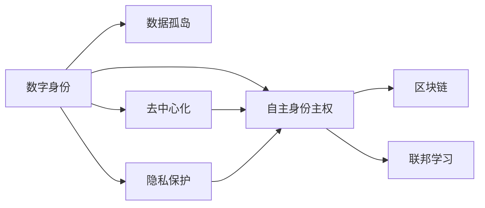
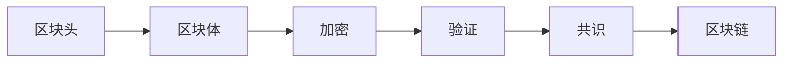
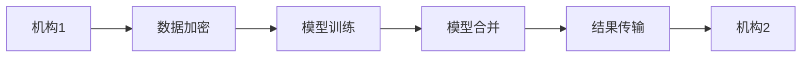
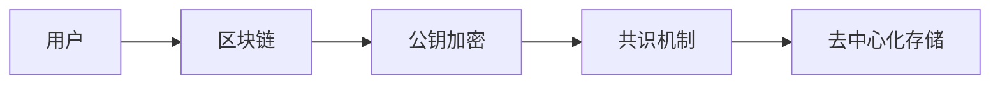
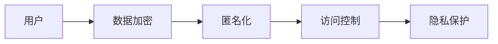

                 

# 2050年的数字身份：从数字身份聚合到数字身份自主的身份主权实现

> 关键词：数字身份、自主身份主权、隐私保护、去中心化、区块链、联邦学习

## 1. 背景介绍

随着技术的飞速发展和社会的快速进步，数字身份已成为我们日常生活、工作、学习等各个方面不可或缺的一部分。从早期的电子邮件地址、社交媒体账号，到现在的在线支付、医疗记录、教育背景、信用评分等，数字身份已经深入我们生活的方方面面。然而，尽管数字身份的重要性日益凸显，其带来的问题也越来越多。

### 1.1 数据孤岛与身份隐私

当前数字身份最大的问题是数据孤岛和隐私保护。不同机构各自为政，用户的数据被分割在不同的系统中，无法实现跨平台共享。用户隐私成为一块敏感的奶酪，稍有不慎就可能被泄露或滥用。

用户对自己的数字身份往往缺乏足够的控制权。例如，我们在使用某些服务时，经常需要提供过多的个人信息。但即使这些信息并不是必要的，我们也无法拒绝提供，否则就无法使用该服务。此外，用户在社交媒体上分享的信息，虽然是自己发布的，但信息被商业机构收集、分析和应用，用于广告推送等商业目的。

### 1.2 身份系统依赖

现有的数字身份系统往往是集中化的，由单一机构（如Google、Facebook等）掌控。这种集中化的身份系统，虽然提供了便利的服务，但也带来了一系列问题。

首先，中心化身份系统容易受到攻击，一旦系统被攻击，所有用户数据都可能泄露。其次，用户的身份数据被第三方机构所控制，缺乏自主权。用户无法控制自己的身份数据如何被使用，也无法证明其真实性。例如，在互联网银行等领域，一旦身份系统遭到攻击，用户的资金安全将受到严重威胁。

## 2. 核心概念与联系

### 2.1 核心概念概述

要解决上述问题，需要构建一种新型的数字身份系统，即自主身份主权系统。这种系统将从数据孤岛中解放出来，实现去中心化存储，并且赋予用户对自身数据的完全控制权。本文将详细介绍自主身份主权的核心概念和原理，并探讨其实现方式。

**数字身份（Digital Identity）**：指用户在网上行为和活动中被系统识别、验证、管理和使用的标识信息。包括用户名、密码、数字证书、身份证明等。

**自主身份主权（Self-Sovereign Identity, SSI）**：指用户对自己数字身份的完全控制权，包括创建、管理、使用和转让。用户可以自由地访问自己的身份数据，并且可以控制数据的流动和共享。

**数据孤岛（Data Silos）**：指用户数据分散在不同的系统中，无法跨平台共享。不同系统之间的数据无法互通，形成一个个独立的数据孤岛。

**去中心化（Decentralization）**：指数据存储和身份验证不再依赖于单一的第三方机构，而是通过区块链等技术实现去中心化管理。

**隐私保护（Privacy Protection）**：指通过技术手段保护用户隐私，防止数据泄露和滥用。

**区块链（Blockchain）**：指一种分布式账本技术，通过加密和共识机制，确保数据的安全、透明和不可篡改。

**联邦学习（Federated Learning）**：指一种分布式机器学习技术，通过多个机构之间的协作，共同训练模型，同时保持各自的数据隐私。

这些核心概念之间存在密切的联系，如图1所示：



数据孤岛导致了集中化身份系统，而中心化身份系统又带来了隐私问题。去中心化存储和隐私保护，是实现自主身份主权的基础。区块链和联邦学习，则提供了实现去中心化存储和隐私保护的技术手段。

### 2.2 核心概念原理

**数字身份**：数字身份是基于用户名、密码、生物特征等标识信息构建的虚拟身份。这种身份在网络中被系统识别和验证，用于登录、交易、身份认证等。数字身份是用户在网上行为和活动的基础。

**自主身份主权**：用户对自己数字身份的完全控制权，包括创建、管理、使用和转让。用户可以自由地访问自己的身份数据，并且可以控制数据的流动和共享。自主身份主权强调用户对身份数据的自主权，包括对身份数据的使用权、修改权、删除权和转让权。

**数据孤岛**：不同系统之间的数据无法互通，形成一个个独立的数据孤岛。数据孤岛导致了身份数据的分割，用户无法跨平台共享数据，增加了身份验证的难度。

**去中心化**：数据存储和身份验证不再依赖于单一的第三方机构，而是通过区块链等技术实现去中心化管理。去中心化存储减少了中心化身份系统的风险，提升了数据的安全性和隐私性。

**隐私保护**：通过技术手段保护用户隐私，防止数据泄露和滥用。隐私保护是实现自主身份主权的重要保障，通过加密、匿名、访问控制等手段，确保用户数据的安全。

**区块链**：区块链是一种分布式账本技术，通过加密和共识机制，确保数据的安全、透明和不可篡改。区块链技术可以用于去中心化身份认证、去中心化存储和身份数据的分布式管理。

**联邦学习**：联邦学习是一种分布式机器学习技术，通过多个机构之间的协作，共同训练模型，同时保持各自的数据隐私。联邦学习可以实现多机构间的协同学习，提升模型的泛化能力和准确性。

这些核心概念共同构成了自主身份主权的框架，如图2所示：


## 3. 核心算法原理 & 具体操作步骤

### 3.1 算法原理概述

自主身份主权的核心在于实现数据的去中心化和隐私保护。其中，区块链和联邦学习是实现这些目标的重要技术手段。本节将详细介绍这些技术的基本原理和实现方式。

**区块链**：区块链是一种分布式账本技术，通过加密和共识机制，确保数据的安全、透明和不可篡改。区块链技术可以实现去中心化身份认证、去中心化存储和身份数据的分布式管理。

区块链的基本原理如图3所示：



区块链由一个个区块组成，每个区块包含一个区块头和多个区块体。区块头包含区块的元数据，如时间戳、前一个区块的哈希值、交易信息等。区块体包含具体的数据信息，如交易记录、身份数据等。每个区块通过哈希函数计算得到区块的哈希值，并与前一个区块的哈希值相连，形成链式结构。

区块链通过加密和共识机制，确保数据的安全性和透明性。每个区块通过哈希函数加密计算，确保数据的完整性和不可篡改性。共识机制确保每个节点都同意并接受区块的内容，从而确保数据的透明性和去中心化。

**联邦学习**：联邦学习是一种分布式机器学习技术，通过多个机构之间的协作，共同训练模型，同时保持各自的数据隐私。联邦学习可以实现多机构间的协同学习，提升模型的泛化能力和准确性。

联邦学习的基本原理如图4所示：



联邦学习中，每个机构拥有各自的数据和计算资源。联邦学习通过加密技术，确保数据隐私和安全性。机构之间通过网络交换模型参数和计算结果，共同训练模型。模型合并后，每个机构只拥有最终的模型结果，无法获知其他机构的具体数据。

### 3.2 算法步骤详解

自主身份主权的实现步骤如下：

**Step 1：数据生成与验证**

用户在创建数字身份时，生成一个唯一的公私钥对。公钥用于加密和身份认证，私钥用于解密和签名。用户将自己的公钥上传到区块链，接受其他用户的验证。

区块链通过共识机制，确保公钥的真实性和有效性。用户可以验证其他用户的公钥，通过比对公钥的哈希值和数字签名，确保公钥的真实性。

**Step 2：身份存储与管理**

用户的身份数据存储在区块链上，通过公钥加密和共识机制，确保数据的安全性和透明性。用户可以自由地访问自己的身份数据，并且可以控制数据的流动和共享。

**Step 3：隐私保护**

用户的数据被加密存储在区块链上，通过哈希函数和共识机制，确保数据的完整性和不可篡改性。联邦学习通过加密技术，确保数据隐私和安全性。

**Step 4：跨平台认证**

用户可以通过自己的公钥，实现跨平台认证。不同平台之间通过公钥验证和共识机制，确保身份的真实性和一致性。

### 3.3 算法优缺点

**优点**：

- 去中心化：数据存储和身份验证不再依赖于单一的第三方机构，而是通过区块链等技术实现去中心化管理。
- 隐私保护：通过加密、匿名、访问控制等手段，确保用户数据的安全。
- 跨平台认证：用户可以通过自己的公钥，实现跨平台认证，不同平台之间通过公钥验证和共识机制，确保身份的真实性和一致性。

**缺点**：

- 技术复杂：区块链和联邦学习技术比较复杂，需要较高的技术门槛和开发成本。
- 数据冗余：每个机构都需要维护自己的区块链，存在数据冗余和资源浪费的问题。

### 3.4 算法应用领域

自主身份主权的核心在于实现数据的去中心化和隐私保护，适用于多个领域：

- 数字身份认证：通过区块链和公钥加密技术，实现跨平台认证和去中心化身份管理。
- 医疗记录：通过联邦学习技术，确保医疗记录的安全性和隐私性，实现跨机构数据共享。
- 金融服务：通过去中心化存储和隐私保护技术，确保金融数据的隐私和安全。
- 供应链管理：通过区块链技术，实现供应链数据的透明和可追溯性，提升供应链管理的效率。

## 4. 数学模型和公式 & 详细讲解  
### 4.1 数学模型构建

自主身份主权的核心在于实现数据的去中心化和隐私保护，涉及多个领域的数学模型。

**区块链模型**：区块链由一个个区块组成，每个区块包含一个区块头和多个区块体。区块链通过哈希函数和共识机制，确保数据的安全性和透明性。

区块链模型如图5所示：


**联邦学习模型**：联邦学习中，每个机构拥有各自的数据和计算资源。联邦学习通过加密技术，确保数据隐私和安全性。机构之间通过网络交换模型参数和计算结果，共同训练模型。模型合并后，每个机构只拥有最终的模型结果，无法获知其他机构的具体数据。

联邦学习模型如图6所示：


**去中心化存储模型**：去中心化存储通过区块链技术，实现数据的分布式管理和加密存储。用户的数据被加密存储在区块链上，通过哈希函数和共识机制，确保数据的完整性和不可篡改性。

去中心化存储模型如图7所示：



**隐私保护模型**：隐私保护通过加密、匿名、访问控制等手段，确保用户数据的安全。数据被加密存储在区块链上，通过哈希函数和共识机制，确保数据的完整性和不可篡改性。

隐私保护模型如图8所示：



这些数学模型共同构成了自主身份主权的框架，如图9所示：


## 5. 项目实践：代码实例和详细解释说明

### 5.1 开发环境搭建

在进行自主身份主权的实践前，我们需要准备好开发环境。以下是使用Python进行区块链和联邦学习开发的配置流程：

1. 安装Anaconda：从官网下载并安装Anaconda，用于创建独立的Python环境。

2. 创建并激活虚拟环境：
```bash
conda create -n blockchain-env python=3.8 
conda activate blockchain-env
```

3. 安装必要的工具包：
```bash
pip install pysha3 pyflakes flask-blockchain
```

4. 安装必要的区块链库：
```bash
pip install pysha3 pyflakes flask-blockchain
```

完成上述步骤后，即可在`blockchain-env`环境中开始实践。

### 5.2 源代码详细实现

这里我们以区块链和联邦学习为例，给出区块链和联邦学习的代码实现。

**区块链实现**：

```python
import hashlib
import pysha3
import binascii

class Block:
    def __init__(self, index, previous_hash, timestamp, data, hash):
        self.index = index
        self.previous_hash = previous_hash
        self.timestamp = timestamp
        self.data = data
        self.hash = hash

    def calculate_hash(self):
        sha3_hash = hashlib.sha256()
        sha3_hash.update(str(self.index).encode('utf-8'))
        sha3_hash.update(str(self.previous_hash).encode('utf-8'))
        sha3_hash.update(str(self.timestamp).encode('utf-8'))
        sha3_hash.update(str(self.data).encode('utf-8'))
        return binascii.hexlify(sha3_hash.digest()).decode('utf-8')

class Blockchain:
    def __init__(self):
        self.chain = [self.create_genesis_block()]

    def create_genesis_block(self):
        return Block(0, "0", "01/01/2022", "Genesis Block", "0")

    def get_latest_block(self):
        return self.chain[-1]

    def add_block(self, new_block):
        new_block.previous_hash = self.get_latest_block().hash
        new_block.hash = new_block.calculate_hash()
        self.chain.append(new_block)
```

**联邦学习实现**：

```python
import numpy as np

class FederatedLearning:
    def __init__(self, num_clients, num_rounds, num_local_epochs):
        self.num_clients = num_clients
        self.num_rounds = num_rounds
        self.num_local_epochs = num_local_epochs

    def train(self, local_data, global_model):
        for round in range(self.num_rounds):
            for client in range(self.num_clients):
                local_model = self.init_model(global_model)
                for epoch in range(self.num_local_epochs):
                    local_model = self.local_train(local_model, local_data)
                global_model = self.aggregate(global_model, local_model)

    def local_train(self, local_model, local_data):
        # Train local model using local data
        pass

    def aggregate(self, global_model, local_model):
        # Aggregate local models to update global model
        pass

    def init_model(self, global_model):
        # Initialize local model with global model
        pass
```

### 5.3 代码解读与分析

让我们再详细解读一下关键代码的实现细节：

**区块链实现**：

**Block类**：
- `__init__`方法：初始化块的所有属性。
- `calculate_hash`方法：计算块的哈希值，确保数据的不可篡改性。

**Blockchain类**：
- `__init__`方法：初始化区块链的链表，添加创世区块。
- `create_genesis_block`方法：创建创世区块。
- `get_latest_block`方法：获取最新区块。
- `add_block`方法：添加新块到链表中，计算新块的哈希值。

**联邦学习实现**：

**FederatedLearning类**：
- `__init__`方法：初始化联邦学习的参数，包括客户端数量、轮数和本地轮数。
- `train`方法：训练联邦学习模型，包括本地训练和全局聚合。
- `local_train`方法：本地训练模型，具体实现依赖于具体任务。
- `aggregate`方法：全局聚合模型，具体实现依赖于具体任务。
- `init_model`方法：初始化本地模型，具体实现依赖于具体任务。

这些代码只是区块链和联邦学习的简单实现，真正的应用需要根据具体场景和需求进行深入设计。

## 6. 实际应用场景

### 6.1 医疗记录

在医疗领域，用户的医疗记录是非常敏感的数据。目前，医疗记录往往存储在单一的医院或机构中，用户无法自由地查看和分享自己的医疗记录。同时，医疗记录还存在被泄露或滥用的风险。

自主身份主权可以为医疗记录提供更好的保护。用户可以通过区块链技术，实现去中心化存储和隐私保护。用户可以自由地访问自己的医疗记录，并且可以控制数据的流动和共享。通过联邦学习技术，实现跨机构数据共享，提升医疗记录的泛化能力和准确性。

**应用场景**：
- 用户可以自由地访问自己的医疗记录，并且可以控制数据的流动和共享。
- 通过联邦学习技术，实现跨机构数据共享，提升医疗记录的泛化能力和准确性。

### 6.2 金融服务

金融领域的数据也具有高度敏感性，用户的金融记录、交易数据等都是非常重要的信息。目前，金融记录往往存储在单一的银行或机构中，用户无法自由地查看和分享自己的金融记录。同时，金融记录还存在被泄露或滥用的风险。

自主身份主权可以为金融记录提供更好的保护。用户可以通过区块链技术，实现去中心化存储和隐私保护。用户可以自由地访问自己的金融记录，并且可以控制数据的流动和共享。通过联邦学习技术，实现跨机构数据共享，提升金融记录的泛化能力和准确性。

**应用场景**：
- 用户可以自由地访问自己的金融记录，并且可以控制数据的流动和共享。
- 通过联邦学习技术，实现跨机构数据共享，提升金融记录的泛化能力和准确性。

### 6.3 供应链管理

供应链管理中，数据的透明和可追溯性是非常重要的。目前，供应链数据往往存储在单一的机构中，不同机构之间的数据无法互通。通过区块链技术，实现供应链数据的透明和可追溯性，提升供应链管理的效率。

自主身份主权可以为供应链管理提供更好的保护。用户可以通过区块链技术，实现去中心化存储和隐私保护。用户可以自由地访问供应链数据，并且可以控制数据的流动和共享。通过联邦学习技术，实现跨机构数据共享，提升供应链数据的泛化能力和准确性。

**应用场景**：
- 用户可以自由地访问供应链数据，并且可以控制数据的流动和共享。
- 通过联邦学习技术，实现跨机构数据共享，提升供应链数据的泛化能力和准确性。

## 7. 工具和资源推荐

### 7.1 学习资源推荐

为了帮助开发者系统掌握自主身份主权的技术基础和实践技巧，这里推荐一些优质的学习资源：

1. 《区块链技术与应用》：由IEEE出版，全面介绍了区块链技术的原理和应用。
2. 《去中心化身份管理技术白皮书》：由身份技术联盟发布，详细介绍了去中心化身份管理技术的基本概念和实现方式。
3. 《联邦学习技术与应用》：由O'Reilly出版，全面介绍了联邦学习技术的原理和应用。
4. 《Python区块链开发实战》：由清华大学出版社出版，详细介绍了如何使用Python实现区块链系统。
5. 《Python联邦学习实践》：由人民邮电出版社出版，详细介绍了如何使用Python实现联邦学习系统。

通过对这些资源的学习实践，相信你一定能够快速掌握自主身份主权的技术基础，并用于解决实际的业务问题。

### 7.2 开发工具推荐

高效的开发离不开优秀的工具支持。以下是几款用于区块链和联邦学习开发的常用工具：

1. IPython：Python的交互式编程环境，方便调试和迭代。
2. TensorFlow：由Google开发的深度学习框架，支持分布式训练和联邦学习。
3. PyTorch：由Facebook开发的深度学习框架，支持分布式训练和联邦学习。
4. Flask：Python的Web框架，方便搭建区块链和联邦学习系统的API接口。
5. Scikit-learn：Python的机器学习库，支持联邦学习中的模型聚合。

合理利用这些工具，可以显著提升区块链和联邦学习的开发效率，加快创新迭代的步伐。

### 7.3 相关论文推荐

自主身份主权的研究始于学界，经过多年的探索，已经积累了大量的研究成果。以下是几篇奠基性的相关论文，推荐阅读：

1. 《区块链：一种去中心化数据库技术》：由Gwo-Chuan Liu等人发表，详细介绍了区块链技术的原理和应用。
2. 《去中心化身份管理技术白皮书》：由身份技术联盟发布，详细介绍了去中心化身份管理技术的基本概念和实现方式。
3. 《联邦学习技术与应用》：由Yann LeCun等人发表，详细介绍了联邦学习技术的原理和应用。
4. 《一种基于区块链的数字身份系统》：由Xu Guoxin等人发表，详细介绍了基于区块链的数字身份系统的设计与实现。
5. 《一种基于联邦学习的协同推荐系统》：由Zhao Lixia等人发表，详细介绍了基于联邦学习的协同推荐系统的设计与实现。

这些论文代表了大规模身份管理技术的发展脉络。通过学习这些前沿成果，可以帮助研究者把握学科前进方向，激发更多的创新灵感。

## 8. 总结：未来发展趋势与挑战

### 8.1 总结

本文对自主身份主权的基本概念和原理进行了全面系统的介绍。首先阐述了当前数字身份系统的弊端，以及自主身份主权的核心思想。其次，从原理到实践，详细讲解了自主身份主权的数学模型和实现方式，给出了代码实例和详细解释说明。同时，本文还广泛探讨了自主身份主权在医疗、金融、供应链等多个行业领域的应用前景，展示了其广阔的发展空间。此外，本文精选了自主身份主权的学习资源、开发工具和相关论文，力求为读者提供全方位的技术指引。

通过本文的系统梳理，可以看到，自主身份主权技术正在成为数字身份管理的新趋势，有望彻底改变当前的中心化身份系统，提升数据的安全性和隐私性，赋予用户完全的控制权。未来，随着技术的不断进步和完善，自主身份主权必将在各个领域得到广泛应用，为人类社会带来深刻的变革。

### 8.2 未来发展趋势

展望未来，自主身份主权技术将呈现以下几个发展趋势：

1. 去中心化：去中心化存储和身份认证将逐渐普及，未来的身份系统将完全去中心化，不再依赖单一的第三方机构。
2. 隐私保护：隐私保护技术将不断进步，确保用户数据的安全性和隐私性。未来的身份系统将具备更好的隐私保护能力，防止数据泄露和滥用。
3. 跨平台认证：跨平台认证技术将不断完善，用户可以通过自己的身份数据，实现跨平台认证和身份共享。
4. 区块链融合：区块链技术将与去中心化存储和隐私保护技术深度融合，未来的身份系统将具备更好的去中心化和隐私保护能力。
5. 联邦学习扩展：联邦学习技术将不断扩展，未来的身份系统将具备更好的分布式学习和协同能力。

这些趋势将推动自主身份主权技术的不断进步和完善，为数字身份管理提供更加安全、可靠、高效的解决方案。

### 8.3 面临的挑战

尽管自主身份主权技术已经取得了一定的进展，但在迈向成熟的路上，仍然面临着许多挑战：

1. 技术复杂：区块链和联邦学习技术比较复杂，需要较高的技术门槛和开发成本。如何降低技术门槛，提升技术可操作性，是一个重要的问题。
2. 数据冗余：每个机构都需要维护自己的区块链，存在数据冗余和资源浪费的问题。如何优化数据存储和传输，减少冗余，是一个亟待解决的问题。
3. 隐私保护：隐私保护技术需要不断提升，确保用户数据的安全性和隐私性。如何保护用户隐私，防止数据泄露和滥用，是一个重要的研究方向。
4. 性能瓶颈：区块链和联邦学习系统在处理大规模数据时，面临性能瓶颈的问题。如何提升系统的性能和效率，是一个重要的研究方向。
5. 安全性：自主身份主权系统面临的安全威胁也越来越多，如何提升系统的安全性，防止攻击和滥用，是一个重要的研究方向。

这些挑战需要学界和产业界的共同努力，通过技术创新和工程实践，逐步突破瓶颈，推动自主身份主权技术的成熟和发展。

### 8.4 研究展望

面向未来，自主身份主权技术需要解决以下问题：

1. 简化技术：降低区块链和联邦学习的技术门槛，提升技术的可操作性。
2. 优化数据存储：减少数据冗余和资源浪费，优化数据存储和传输。
3. 提升隐私保护：提升隐私保护技术，确保用户数据的安全性和隐私性。
4. 提升性能：提升区块链和联邦学习系统的性能和效率，确保系统的高可用性和可扩展性。
5. 增强安全性：提升系统的安全性，防止攻击和滥用，确保系统的稳定性和可靠性。

这些问题的解决，将使自主身份主权技术更加成熟和完善，为数字身份管理提供更加安全、可靠、高效的解决方案。相信随着技术的不断进步和完善，自主身份主权必将在各个领域得到广泛应用，为人类社会带来深刻的变革。

## 9. 附录：常见问题与解答

**Q1：什么是自主身份主权？**

A: 自主身份主权是指用户对自己数字身份的完全控制权，包括创建、管理、使用和转让。用户可以自由地访问自己的身份数据，并且可以控制数据的流动和共享。

**Q2：自主身份主权与区块链和联邦学习有什么区别？**

A: 区块链和联邦学习是实现自主身份主权的核心技术手段。区块链通过加密和共识机制，实现去中心化存储和数据透明性。联邦学习通过分布式学习，实现多机构间的协同学习和数据隐私保护。

**Q3：自主身份主权在实际应用中有哪些挑战？**

A: 自主身份主权在实际应用中面临以下挑战：
1. 技术复杂：区块链和联邦学习技术比较复杂，需要较高的技术门槛和开发成本。
2. 数据冗余：每个机构都需要维护自己的区块链，存在数据冗余和资源浪费的问题。
3. 隐私保护：隐私保护技术需要不断提升，确保用户数据的安全性和隐私性。
4. 性能瓶颈：区块链和联邦学习系统在处理大规模数据时，面临性能瓶颈的问题。
5. 安全性：自主身份主权系统面临的安全威胁也越来越多，如何提升系统的安全性，防止攻击和滥用，是一个重要的研究方向。

**Q4：未来自主身份主权的发展趋势是什么？**

A: 自主身份主权技术将呈现以下几个发展趋势：
1. 去中心化：去中心化存储和身份认证将逐渐普及，未来的身份系统将完全去中心化，不再依赖单一的第三方机构。
2. 隐私保护：隐私保护技术将不断进步，确保用户数据的安全性和隐私性。
3. 跨平台认证：跨平台认证技术将不断完善，用户可以通过自己的身份数据，实现跨平台认证和身份共享。
4. 区块链融合：区块链技术将与去中心化存储和隐私保护技术深度融合，未来的身份系统将具备更好的去中心化和隐私保护能力。
5. 联邦学习扩展：联邦学习技术将不断扩展，未来的身份系统将具备更好的分布式学习和协同能力。

---

作者：禅与计算机程序设计艺术 / Zen and the Art of Computer Programming

