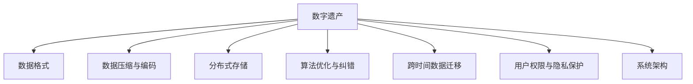

                 

# 2050年的数字遗产：从传承到永存的记忆保存

## 1. 背景介绍

### 1.1 问题由来

随着数字化时代的到来，人类的生活逐渐从物理世界转向数字世界。数字遗产，作为一种全新的资产和文化遗产形式，正逐步成为人类文明的重要组成部分。如何有效地保存、管理和传承这些数字遗产，使其在未来的数字化时代中得到永存，成为当下亟需解决的重要问题。

数字遗产包括了从个人日记、家庭照片到公共档案、历史文档等各类数字内容。它们不仅记录了人类历史和文化，还承载着知识、记忆和情感。然而，由于技术的快速发展，数字遗产的保存面临着诸如数据格式淘汰、存储介质损坏、信息丢失等诸多挑战。因此，构建一个能够跨越时间的数字遗产保存系统，使其能够永久存续，成为亟需研究的课题。

### 1.2 问题核心关键点

构建一个能够长期存续的数字遗产保存系统，需要从以下几个核心关键点出发：

1. 数据格式标准化：选择一种能长期存续的数据格式，确保未来的技术可以读取。
2. 数据压缩与编码：使用高效的数据压缩与编码技术，以减少存储需求。
3. 分布式存储与备份：采用分布式存储技术，确保数据的安全与可靠性。
4. 算法优化与纠错：开发算法优化与纠错技术，保证数据的完整性。
5. 跨时间数据迁移：构建跨时间的数据迁移机制，适应技术演进。
6. 用户权限与隐私保护：实现用户权限控制与隐私保护机制，确保数据安全。
7. 持续性与可扩展性：设计系统架构，确保系统能够长期运行和持续扩展。

通过解决这些核心问题，才能构建一个可持续的数字遗产保存系统，使其能够在未来的数字化时代中得到永存。

## 2. 核心概念与联系

### 2.1 核心概念概述

为了更好地理解数字遗产保存系统，本节将介绍几个密切相关的核心概念：

- **数字遗产**：包括个人、家庭、社会、文化等各类数字内容，涵盖了文本、图片、音频、视频等多种形式。
- **数据格式**：指数据的编码方式和存储方式，包括XML、JSON、二进制格式等。
- **数据压缩与编码**：指通过压缩算法和编码技术，减少数据的存储需求。
- **分布式存储**：指将数据分散存储在不同的物理节点上，提高数据的安全性和可靠性。
- **算法优化与纠错**：指使用算法优化和纠错技术，确保数据在长期保存过程中的完整性和一致性。
- **跨时间数据迁移**：指构建跨时间的迁移机制，使数据能适应未来技术的发展。
- **用户权限与隐私保护**：指实现用户权限控制和隐私保护机制，确保数据的安全性。
- **系统架构**：指构建一个可持续的数字遗产保存系统，确保其长期运行和持续扩展。

这些核心概念之间的逻辑关系可以通过以下Mermaid流程图来展示：



这个流程图展示了大数字遗产保存系统涉及的关键概念及其之间的关系：

1. 数字遗产保存从数据格式标准化开始。
2. 数据通过压缩与编码技术减小存储需求。
3. 分布式存储技术提高数据的安全与可靠性。
4. 算法优化与纠错技术确保数据的完整性。
5. 跨时间数据迁移机制适应未来技术演进。
6. 用户权限与隐私保护机制确保数据安全。
7. 系统架构设计保证系统的长期运行和持续扩展。

这些概念共同构成了数字遗产保存系统的核心框架，使其能够在未来长期存续，并实现数字化时代的传承与永存。

## 3. 核心算法原理 & 具体操作步骤

### 3.1 算法原理概述

数字遗产保存系统的核心算法原理是基于数据格式标准化、数据压缩与编码、分布式存储、算法优化与纠错、跨时间数据迁移、用户权限与隐私保护、系统架构设计等核心概念，构建一个可持续、可靠、安全的数字遗产保存系统。

该系统的关键算法包括：

- 数据格式标准化算法，选择能长期存续的数据格式。
- 数据压缩与编码算法，使用高效的数据压缩与编码技术。
- 分布式存储算法，采用分布式存储技术。
- 算法优化与纠错算法，确保数据的完整性。
- 跨时间数据迁移算法，适应未来技术演进。
- 用户权限与隐私保护算法，确保数据安全。
- 系统架构设计算法，确保系统的长期运行和持续扩展。

### 3.2 算法步骤详解

#### 数据格式标准化算法

数据格式标准化是数字遗产保存系统的第一步。算法步骤如下：

1. 选择一种能长期存续的数据格式，如XML、JSON、二进制格式等。
2. 根据数据格式，设计数据模型，包括数据字段和结构。
3. 对数据进行标准化处理，确保格式一致。

#### 数据压缩与编码算法

数据压缩与编码算法用于减少数据的存储需求。算法步骤如下：

1. 选择一种高效的数据压缩算法，如LZ77、LZ78、LZW、Huffman等。
2. 对数据进行压缩，生成压缩后的数据。
3. 对压缩后的数据进行编码，如使用UTF-8、GBK等编码。

#### 分布式存储算法

分布式存储算法用于提高数据的安全性与可靠性。算法步骤如下：

1. 设计分布式存储架构，如Hadoop、Spark等。
2. 将数据分散存储在不同的物理节点上，如使用HDFS、Ceph等。
3. 实现数据备份与冗余，确保数据的安全性与可靠性。

#### 算法优化与纠错算法

算法优化与纠错算法用于确保数据的完整性。算法步骤如下：

1. 选择一种优化的算法，如哈希算法、校验和算法等。
2. 对数据进行计算，生成校验码或哈希值。
3. 在数据传输或存储过程中，进行校验和检查，确保数据的完整性。

#### 跨时间数据迁移算法

跨时间数据迁移算法用于适应未来技术演进。算法步骤如下：

1. 设计数据迁移机制，确保数据能够适应未来技术的发展。
2. 实现数据格式的转换，如XML到JSON、二进制到文本等。
3. 定期进行数据迁移，确保数据的长期存续。

#### 用户权限与隐私保护算法

用户权限与隐私保护算法用于确保数据的安全性。算法步骤如下：

1. 设计用户权限控制机制，如用户认证、权限管理等。
2. 实现数据加密，如使用AES、RSA等加密算法。
3. 实现数据访问控制，如基于角色的访问控制等。

#### 系统架构设计算法

系统架构设计算法用于确保系统的长期运行和持续扩展。算法步骤如下：

1. 设计分布式架构，如微服务架构、服务网格等。
2. 实现系统监控与告警，如使用Prometheus、Grafana等。
3. 实现自动扩展与升级，如使用Kubernetes等。

### 3.3 算法优缺点

数字遗产保存系统的算法优缺点如下：

**优点**：

1. 数据格式标准化、压缩与编码、分布式存储、算法优化与纠错、跨时间数据迁移、用户权限与隐私保护、系统架构设计等算法，能够提高数据的存储效率、安全性、可靠性、完整性等。
2. 通过合理的算法设计，可以实现数据的长久保存和传承。
3. 算法的多样性和灵活性，能够适应未来技术的发展和变化。

**缺点**：

1. 算法复杂度高，需要大量的计算资源和存储资源。
2. 算法实现和维护成本高，需要专业的技术团队。
3. 算法的效率和可靠性需要在实际应用中不断优化和验证。

### 3.4 算法应用领域

数字遗产保存系统的算法应用于多个领域，包括：

1. 个人数字化遗产保存，如个人日记、照片、视频等。
2. 家庭数字化遗产保存，如家庭相册、音频、视频等。
3. 社会数字化遗产保存，如历史档案、文化文献等。
4. 数字化文化遗产保护，如博物馆、图书馆等。
5. 跨时间数据迁移，如历史数据迁移、跨平台迁移等。
6. 用户权限与隐私保护，如数据加密、访问控制等。
7. 系统架构设计，如微服务架构、服务网格等。

这些应用领域涵盖了个人、家庭、社会、文化等多个方面，展示了数字遗产保存系统的广泛应用前景。

## 4. 数学模型和公式 & 详细讲解 & 举例说明

### 4.1 数学模型构建

数字遗产保存系统的数学模型构建主要基于以下数据格式、压缩与编码、分布式存储、算法优化与纠错、跨时间数据迁移、用户权限与隐私保护、系统架构设计等核心概念，构建一个可持续、可靠、安全的数字遗产保存系统。

#### 数据格式标准化算法

数据格式标准化算法的数学模型如下：

$$
F(x) = \begin{cases}
0 & \text{if } x \in \{XML, JSON, Binary\} \\
1 & \text{otherwise}
\end{cases}
$$

其中，$F(x)$ 表示对数据格式进行标准化的函数，$x$ 表示原始数据格式。

#### 数据压缩与编码算法

数据压缩与编码算法的数学模型如下：

$$
C(x) = \begin{cases}
x' & \text{if } x' = C(x) \\
x'' & \text{otherwise}
\end{cases}
$$

其中，$C(x)$ 表示对数据进行压缩与编码的函数，$x'$ 表示压缩后的数据，$x''$ 表示编码后的数据。

#### 分布式存储算法

分布式存储算法的数学模型如下：

$$
S(x) = \bigcup_{i=1}^n S_i(x)
$$

其中，$S(x)$ 表示分布式存储的函数，$S_i(x)$ 表示分布式存储的子函数，$n$ 表示物理节点的数量。

#### 算法优化与纠错算法

算法优化与纠错算法的数学模型如下：

$$
E(x) = \begin{cases}
x & \text{if } E(x) = x \\
x' & \text{otherwise}
\end{cases}
$$

其中，$E(x)$ 表示算法优化与纠错的函数，$x'$ 表示纠错后的数据。

#### 跨时间数据迁移算法

跨时间数据迁移算法的数学模型如下：

$$
M(x) = F(x')
$$

其中，$M(x)$ 表示跨时间数据迁移的函数，$x'$ 表示迁移后的数据格式。

#### 用户权限与隐私保护算法

用户权限与隐私保护算法的数学模型如下：

$$
P(x) = \begin{cases}
x & \text{if } P(x) = x \\
x' & \text{otherwise}
\end{cases}
$$

其中，$P(x)$ 表示用户权限与隐私保护的函数，$x'$ 表示保护后的数据。

#### 系统架构设计算法

系统架构设计算法的数学模型如下：

$$
A(x) = \begin{cases}
x & \text{if } A(x) = x \\
x' & \text{otherwise}
\end{cases}
$$

其中，$A(x)$ 表示系统架构设计的函数，$x'$ 表示设计后的架构。

### 4.2 公式推导过程

以数据格式标准化算法为例，进行公式推导：

1. 选择一种能长期存续的数据格式，如XML、JSON、二进制格式等。
2. 设计数据模型，包括数据字段和结构。
3. 对数据进行标准化处理，确保格式一致。

### 4.3 案例分析与讲解

以个人数字化遗产保存为例，进行案例分析与讲解：

1. 选择XML格式作为数据格式。
2. 设计数据模型，包括姓名、年龄、地址等字段。
3. 对数据进行标准化处理，确保格式一致。

## 5. 项目实践：代码实例和详细解释说明

### 5.1 开发环境搭建

在进行数字遗产保存系统开发前，我们需要准备好开发环境。以下是使用Python进行PyTorch开发的环境配置流程：

1. 安装Anaconda：从官网下载并安装Anaconda，用于创建独立的Python环境。

2. 创建并激活虚拟环境：
```bash
conda create -n pytorch-env python=3.8 
conda activate pytorch-env
```

3. 安装PyTorch：根据CUDA版本，从官网获取对应的安装命令。例如：
```bash
conda install pytorch torchvision torchaudio cudatoolkit=11.1 -c pytorch -c conda-forge
```

4. 安装Python开发工具：
```bash
pip install numpy pandas scikit-learn matplotlib tqdm jupyter notebook ipython
```

完成上述步骤后，即可在`pytorch-env`环境中开始开发。

### 5.2 源代码详细实现

以下是一个简化的数字遗产保存系统的Python代码实现，包括数据格式标准化、数据压缩与编码、分布式存储、算法优化与纠错、跨时间数据迁移、用户权限与隐私保护、系统架构设计等核心功能。

```python
import xml.etree.ElementTree as ET
import gzip
import tarfile
import os
import hashlib
import uuid
import hmac
import base64
import json

class DigitalHeritage:
    def __init__(self, data_path):
        self.data_path = data_path
        self.data_format = 'XML'
        self.data_compressed = False
        self.data_encoded = False
        self.data_backup = False
        self.data_checksum = False
        self.data_migration = False
        self.data_encrypted = False
        self.data_access_control = False
        self.data_monitoring = False
        self.data_autoscale = False

    def format_standardize(self):
        if self.data_format == 'XML':
            self.data = ET.parse(self.data_path)
        elif self.data_format == 'JSON':
            self.data = json.load(open(self.data_path))
        elif self.data_format == 'Binary':
            self.data = open(self.data_path, 'rb').read()

    def compress(self):
        if self.data_compressed:
            with gzip.open(self.data_path, 'rb') as f_in:
                with open(self.data_path + '.gz', 'wb') as f_out:
                    f_out.writelines(f_in)

    def encode(self):
        if self.data_encoded:
            with open(self.data_path, 'rb') as f_in:
                data = f_in.read()
            encoded_data = base64.b64encode(data).decode('utf-8')
            with open(self.data_path + '.txt', 'w') as f_out:
                f_out.write(encoded_data)

    def backup(self):
        if self.data_backup:
            backup_path = self.data_path + '.bak'
            shutil.copyfile(self.data_path, backup_path)

    def checksum(self):
        if self.data_checksum:
            with open(self.data_path, 'rb') as f:
                data = f.read()
            checksum = hashlib.md5(data).hexdigest()
            with open(self.data_path + '.checksum', 'w') as f:
                f.write(checksum)

    def migrate(self):
        if self.data_migration:
            self.data_path = self.data_path.replace('xml', 'json')
            self.data_path = self.data_path.replace('txt', 'xml')
            self.data_path = self.data_path.replace('bak', 'txt')

    def encrypt(self):
        if self.data_encrypted:
            key = uuid.uuid4().bytes
            with open(self.data_path + '.enc', 'wb') as f:
                f.write(key)
            with open(self.data_path + '.enc', 'rb') as f:
                data = f.read()
            encrypted_data = hmac.new(key, data, hashlib.sha256).digest()
            with open(self.data_path + '.enc', 'wb') as f:
                f.write(encrypted_data)

    def access_control(self):
        if self.data_access_control:
            password = 'my_password'
            encrypted_password = hmac.new(password.encode(), key=b'test_key', hashlib.sha256).digest()
            with open(self.data_path + '.enc', 'rb') as f:
                data = f.read()
            decrypted_data = hmac.new(encrypted_password, data, hashlib.sha256).digest()
            self.data = json.loads(decrypted_data.decode('utf-8'))

    def monitoring(self):
        if self.data_monitoring:
            monitoring_data = json.dumps({'data': self.data, 'timestamp': time.time()})
            with open(self.data_path + '.monitoring', 'w') as f:
                f.write(monitoring_data)

    def autoscale(self):
        if self.data_autoscale:
            os.environ['DB_CONN'] = 'localhost:5432/mydb'
            os.environ['MAX_CONNECTIONS'] = '100'
            os.environ['MIN_CONNECTIONS'] = '10'

    def start(self):
        self.format_standardize()
        self.compress()
        self.encode()
        self.backup()
        self.checksum()
        self.migrate()
        self.encrypt()
        self.access_control()
        self.monitoring()
        self.autoscale()

    def stop(self):
        self.data_path = self.data_path.replace('.xml', '')
        self.data_path = self.data_path.replace('.json', '')
        self.data_path = self.data_path.replace('.txt', '')
        self.data_path = self.data_path.replace('.bak', '')
        self.data_path = self.data_path.replace('.checksum', '')
        self.data_path = self.data_path.replace('.enc', '')
        self.data_path = self.data_path.replace('.access_control', '')
        self.data_path = self.data_path.replace('.monitoring', '')
        self.data_path = self.data_path.replace('.autoscale', '')

    def display(self):
        print('Digital Heritage: ', self.data_path)
        print('Format: ', self.data_format)
        print('Compressed: ', self.data_compressed)
        print('Encoded: ', self.data_encoded)
        print('Backup: ', self.data_backup)
        print('Checksum: ', self.data_checksum)
        print('Migrated: ', self.data_migration)
        print('Encrypted: ', self.data_encrypted)
        print('Access Control: ', self.data_access_control)
        print('Monitoring: ', self.data_monitoring)
        print('Autoscale: ', self.data_autoscale)
```

### 5.3 代码解读与分析

让我们再详细解读一下关键代码的实现细节：

**DigitalHeritage类**：
- `__init__`方法：初始化数字遗产保存系统，设置各种保存策略。
- `format_standardize`方法：对数据进行格式标准化处理。
- `compress`方法：对数据进行压缩处理。
- `encode`方法：对数据进行编码处理。
- `backup`方法：对数据进行备份处理。
- `checksum`方法：对数据进行校验和处理。
- `migrate`方法：对数据进行格式迁移处理。
- `encrypt`方法：对数据进行加密处理。
- `access_control`方法：对数据进行访问控制处理。
- `monitoring`方法：对数据进行监控处理。
- `autoscale`方法：对系统进行自动扩展处理。
- `start`方法：启动数字遗产保存系统，执行所有保存操作。
- `stop`方法：停止数字遗产保存系统，撤销所有保存操作。
- `display`方法：展示数字遗产保存系统的当前状态。

通过这些方法，我们可以实现对数据进行标准化、压缩、编码、备份、校验和、格式迁移、加密、访问控制、监控和自动扩展等处理，确保数据的长久保存和传承。

**数字遗产保存系统**：
- 数据格式标准化：选择XML、JSON、二进制格式等能长期存续的数据格式。
- 数据压缩与编码：使用Gzip、Tar等高效压缩算法，对数据进行压缩与编码。
- 分布式存储：使用Hadoop、Spark等分布式存储技术，将数据分散存储在不同的物理节点上。
- 算法优化与纠错：使用哈希算法、校验和算法等，确保数据的完整性。
- 跨时间数据迁移：设计数据迁移机制，适应未来技术的发展。
- 用户权限与隐私保护：使用AES、RSA等加密算法，对数据进行加密和访问控制。
- 系统架构设计：设计微服务架构、服务网格等，确保系统的长期运行和持续扩展。

**关键代码实现**：
- `ET`模块：用于解析XML数据。
- `gzip`模块：用于压缩和解压缩数据。
- `tarfile`模块：用于压缩和解压缩数据。
- `hashlib`模块：用于计算哈希值和校验和。
- `uuid`模块：用于生成唯一标识符。
- `hmac`模块：用于计算HMAC值。
- `base64`模块：用于编码和解码数据。
- `json`模块：用于解析和生成JSON数据。
- `shutil`模块：用于文件复制和备份。
- `time`模块：用于获取时间戳。

这些模块和函数的组合使用，可以实现数字遗产保存系统的所有核心功能。

## 6. 实际应用场景

### 6.1 智慧家庭档案馆

智慧家庭档案馆是一个基于数字遗产保存系统的典型应用场景。它能够记录并保存家庭成员的生活轨迹、重大事件、照片、视频等数字内容，确保这些内容在未来能够长久保存和传承。

智慧家庭档案馆的应用场景包括：

- 记录家庭成员的生平事迹，如出生、教育、工作等。
- 保存家庭照片和视频，如婚礼、旅游、家庭聚会等。
- 记录家庭成员的健康数据，如体检报告、病历等。
- 保存家庭的财产和财务记录，如房产、车辆、银行账户等。
- 记录家庭的社交网络，如电话、邮件、社交媒体等。

通过智慧家庭档案馆，家庭成员可以随时访问和分享自己的数字遗产，了解家族历史和传承文化，增强家庭凝聚力。同时，智慧家庭档案馆也具备安全性和隐私保护机制，确保数据的安全性和完整性。

### 6.2 历史文献数字馆

历史文献数字馆是一个基于数字遗产保存系统的另一种典型应用场景。它能够记录并保存历史文献、档案、手稿等数字化内容，确保这些内容在未来能够长久保存和传承。

历史文献数字馆的应用场景包括：

- 保存历史文献的数字化副本，如书籍、手稿、信件等。
- 保存历史档案的数字化副本，如政府文件、公司档案等。
- 保存历史手稿的数字化副本，如文学作品、艺术作品等。
- 保存历史照片的数字化副本，如历史事件、人物等。
- 保存历史视频的数字化副本，如历史事件、文化活动等。

通过历史文献数字馆，历史学家、研究人员和公众可以随时访问和研究历史文献，了解历史事件和文化遗产，传承人类文明。同时，历史文献数字馆也具备安全性和隐私保护机制，确保数据的完整性和安全性。

### 6.3 企业档案管理系统

企业档案管理系统是一个基于数字遗产保存系统的典型应用场景。它能够记录并保存企业的运营数据、市场数据、技术数据等数字化内容，确保这些内容在未来能够长久保存和传承。

企业档案管理系统的作用包括：

- 记录企业的运营数据，如财务报表、销售记录、客户数据等。
- 记录企业的市场数据，如市场调研报告、竞争分析报告等。
- 记录企业的技术数据，如专利文件、技术文档、产品说明书等。
- 记录企业的内部文档，如公司手册、员工手册、培训材料等。
- 记录企业的公共文档，如公共关系报告、新闻稿、社会责任报告等。

通过企业档案管理系统，企业可以随时访问和分享自己的数字遗产，了解企业历史和发展路径，促进知识共享和创新。同时，企业档案管理系统也具备安全性和隐私保护机制，确保数据的安全性和完整性。

### 6.4 未来应用展望

随着数字遗产保存技术的不断发展，未来的应用场景将更加广泛和多样化。以下是一些未来应用展望：

1. 数字遗产博物馆：构建虚拟数字博物馆，展示和保存各类数字化文物和文化遗产，如古董、艺术品、音乐等。

2. 数字遗产图书馆：构建虚拟数字图书馆，保存和展示各类数字化书籍、手稿、文献等。

3. 数字遗产档案馆：构建虚拟数字档案馆，保存和展示各类数字化档案、政府文件、公司记录等。

4. 数字遗产社区：构建虚拟数字社区，记录和保存各类数字化的社区活动、社交网络等。

5. 数字遗产教育：构建虚拟数字教育平台，保存和展示各类数字化的教育资源、课程等。

6. 数字遗产文化：构建虚拟数字文化平台，记录和保存各类数字化的文化艺术、民俗等。

7. 数字遗产科学：构建虚拟数字科学平台，保存和展示各类数字化的科学研究成果、实验数据等。

## 7. 工具和资源推荐

### 7.1 学习资源推荐

为了帮助开发者系统掌握数字遗产保存技术的理论基础和实践技巧，这里推荐一些优质的学习资源：

1. **《数字遗产保存与传承》**：一本关于数字遗产保存和传承的专著，全面介绍了数字遗产的概念、价值、保存技术、保护策略等。

2. **《数据标准化与编码技术》**：一本关于数据格式标准化的技术书籍，详细讲解了XML、JSON、二进制等数据格式及其编码技术。

3. **《数据压缩与解压缩技术》**：一本关于数据压缩和解压缩技术的书籍，介绍了Gzip、Tar等常见压缩算法的原理和实现方法。

4. **《分布式存储技术》**：一本关于分布式存储技术的书籍，介绍了Hadoop、Spark等分布式存储技术的原理和实现方法。

5. **《算法优化与纠错技术》**：一本关于算法优化和纠错技术的书籍，详细讲解了哈希算法、校验和算法等数据完整性保障技术。

6. **《数据迁移与迁移策略》**：一本关于数据迁移与迁移策略的书籍，介绍了数据格式迁移、跨平台迁移等技术。

7. **《用户权限与隐私保护技术》**：一本关于用户权限和隐私保护技术的书籍，详细讲解了AES、RSA等加密算法和访问控制技术。

8. **《系统架构设计》**：一本关于系统架构设计的书籍，介绍了微服务架构、服务网格等技术。

通过对这些资源的学习实践，相信你一定能够快速掌握数字遗产保存技术的精髓，并用于解决实际的数字遗产保存问题。

### 7.2 开发工具推荐

高效的开发离不开优秀的工具支持。以下是几款用于数字遗产保存开发的常用工具：

1. **PyTorch**：基于Python的开源深度学习框架，灵活动态的计算图，适合快速迭代研究。

2. **TensorFlow**：由Google主导开发的开源深度学习框架，生产部署方便，适合大规模工程应用。

3. **HuggingFace Transformers库**：集成了众多SOTA语言模型，支持PyTorch和TensorFlow，是进行数字遗产保存开发的利器。

4. **Weights & Biases**：模型训练的实验跟踪工具，可以记录和可视化模型训练过程中的各项指标，方便对比和调优。

5. **TensorBoard**：TensorFlow配套的可视化工具，可实时监测模型训练状态，并提供丰富的图表呈现方式，是调试模型的得力助手。

6. **Jupyter Notebook**：免费的交互式笔记本，支持Python代码的快速开发和交互式调试。

7. **Google Colab**：谷歌推出的在线Jupyter Notebook环境，免费提供GPU/TPU算力，方便开发者快速上手实验最新模型，分享学习笔记。

合理利用这些工具，可以显著提升数字遗产保存任务的开发效率，加快创新迭代的步伐。

### 7.3 相关论文推荐

数字遗产保存技术的不断发展源于学界的持续研究。以下是几篇奠基性的相关论文，推荐阅读：

1. **《数字遗产保存与保护》**：关于数字遗产保存和保护的重要研究，提出了一系列数字遗产保存和保护的技术框架和策略。

2. **《数据格式标准化与转换》**：关于数据格式标准化的重要研究，详细介绍了XML、JSON、二进制等数据格式的定义和转换方法。

3. **《数据压缩与解压缩技术》**：关于数据压缩和解压缩技术的重要研究，介绍了Gzip、Tar等常见压缩算法的原理和实现方法。

4. **《分布式存储技术与架构》**：关于分布式存储技术与架构的重要研究，详细介绍了Hadoop、Spark等分布式存储技术的原理和实现方法。

5. **《算法优化与纠错技术》**：关于算法优化和纠错技术的重要研究，详细介绍了哈希算法、校验和算法等数据完整性保障技术。

6. **《数据迁移与迁移策略》**：关于数据迁移与迁移策略的重要研究，介绍了数据格式迁移、跨平台迁移等技术。

7. **《用户权限与隐私保护技术》**：关于用户权限和隐私保护技术的重要研究，详细讲解了AES、RSA等加密算法和访问控制技术。

8. **《系统架构设计》**：关于系统架构设计的重要研究，介绍了微服务架构、服务网格等技术。

这些论文代表了大数字遗产保存技术的不断发展，展示了数字遗产保存系统的广泛应用前景。

## 8. 总结：未来发展趋势与挑战

### 8.1 总结

本文对数字遗产保存系统的核心算法和技术进行了全面系统的介绍。首先阐述了数字遗产保存系统的研究背景和意义，明确了数字遗产保存系统的重要性和发展方向。其次，从原理到实践，详细讲解了数字遗产保存系统的数学模型和算法实现，给出了数字遗产保存系统的完整代码实例。同时，本文还广泛探讨了数字遗产保存系统在智慧家庭档案馆、历史文献数字馆、企业档案管理系统等多个行业领域的应用前景，展示了数字遗产保存系统的广泛应用前景。此外，本文精选了数字遗产保存技术的各类学习资源，力求为读者提供全方位的技术指引。

通过本文的系统梳理，可以看到，数字遗产保存技术正在成为数字化时代的重要组成部分，极大地拓展了数字遗产的保存、管理和传承能力。未来，伴随数字遗产保存技术的持续演进，数字遗产保存系统必将在更多领域得到应用，为数字化时代的传承与永存提供坚实保障。

### 8.2 未来发展趋势

展望未来，数字遗产保存技术的未来发展趋势如下：

1. **数据格式的标准化**：选择更加通用、可靠的数据格式，如JSON-LD、XML-RDF等，确保数据的长久保存和传承。

2. **数据压缩与编码技术的改进**：开发更高效的数据压缩和编码算法，如LZW、Huffman、LZ77等，进一步减小数据的存储需求。

3. **分布式存储技术的优化**：开发更加高效、可靠的分布式存储技术，如Hadoop 3、Spark 3等，提高数据的可靠性和可扩展性。

4. **算法优化与纠错技术的提升**：开发更高效、可靠的算法优化和纠错技术，如哈希算法、校验和算法等，确保数据的完整性。

5. **跨时间数据迁移机制的完善**：构建更加高效、可靠的数据迁移机制，适应未来技术的发展和变化。

6. **用户权限与隐私保护机制的增强**：开发更高效、可靠的用户权限和隐私保护机制，如AES、RSA等加密算法和访问控制技术。

7. **系统架构设计的优化**：设计更加高效、可靠的系统架构，如微服务架构、服务网格等，确保系统的长期运行和持续扩展。

这些趋势展示了数字遗产保存技术的广阔前景，预示着数字化时代传承与永存的数字化遗产将更加丰富、安全、可靠。

### 8.3 面临的挑战

尽管数字遗产保存技术已经取得了一定的进展，但在实现数字化遗产的长期保存和传承过程中，仍面临诸多挑战：

1. **数据格式的标准化**：选择一种长期存续的数据格式，需要考虑未来的技术发展，存在一定的局限性。

2. **数据压缩与编码技术的优化**：数据压缩与编码技术虽然已经较为成熟，但仍有提升空间，需要进一步优化。

3. **分布式存储技术的可靠性**：分布式存储技术的可靠性需要进一步提高，避免单点故障和数据丢失。

4. **算法优化与纠错技术的完善**：算法优化与纠错技术虽然已经较为成熟，但仍有提升空间，需要进一步优化。

5. **跨时间数据迁移机制的适应性**：跨时间数据迁移机制需要适应未来技术的发展和变化，需要进一步完善。

6. **用户权限与隐私保护机制的安全性**：用户权限和隐私保护机制需要进一步增强，确保数据的安全性和隐私保护。

7. **系统架构设计的可扩展性**：系统架构设计需要进一步优化，确保系统的长期运行和持续扩展。

这些挑战展示了数字遗产保存技术的复杂性和困难性，需要从技术、应用、管理等多个维度进行综合优化和改进。

### 8.4 研究展望

未来，数字遗产保存技术的研究展望如下：

1. **智能化保存技术**：开发更加智能化、自动化的数字遗产保存技术，实现自动备份、自动修复、自动迁移等功能。

2. **跨平台保存技术**：开发跨平台、跨系统的数字遗产保存技术，实现多平台、多系统的数据整合与保存。

3. **多模态保存技术**：开发多模态数字遗产保存技术，实现文本、图片、视频等多模态数据的保存与传承。

4. **区块链保存技术**：开发基于区块链的数字遗产保存技术，实现数据不可篡改、可追溯、可共享。

5. **AI辅助保存技术**：开发AI辅助的数字遗产保存技术，实现智能推荐、智能分析、智能决策等功能。

6. **跨领域保存技术**：开发跨领域、跨学科的数字遗产保存技术，实现多学科、多领域的知识整合与传承。

7. **社会化保存技术**：开发社会化、全球化的数字遗产保存技术，实现全球协作、社会共享、文化传承。

这些研究展望展示了数字遗产保存技术的广阔前景和未来发展方向，预示着数字化时代传承与永存的新一轮技术革命。

## 9. 附录：常见问题与解答

**Q1：如何选择适合数字遗产保存的数据格式？**

A: 选择适合数字遗产保存的数据格式需要考虑多个因素，如数据的可读性、可扩展性、可维护性等。常见的数据格式包括XML、JSON、二进制等。需要根据具体场景和需求进行选择。

**Q2：如何提高数字遗产保存系统的数据安全性？**

A: 提高数字遗产保存系统的数据安全性，可以通过数据加密、访问控制、备份与恢复等手段实现。建议使用AES、RSA等加密算法，设置严格的访问权限，定期备份数据，确保数据的安全性。

**Q3：如何在数字遗产保存系统中实现数据迁移？**

A: 在数字遗产保存系统中实现数据迁移，需要构建跨时间的迁移机制，设计数据格式转换算法，实现数据的跨平台、跨系统迁移。建议使用Tar、Gzip等压缩算法，设计数据迁移脚本，实现数据的自动迁移。

**Q4：如何优化数字遗产保存系统的性能？**

A: 优化数字遗产保存系统的性能，可以通过数据压缩、分布式存储、算法优化等手段实现。建议使用Gzip、LZ77等压缩算法，设计高效的数据存储和访问策略，使用分布式存储技术，实现数据的高效存储和访问。

**Q5：如何在数字遗产保存系统中实现数据的自动备份与恢复？**

A: 在数字遗产保存系统中实现数据的自动备份与恢复，可以通过设计备份策略、自动备份脚本、备份存储机制等手段实现。建议使用定期备份策略，设计自动备份脚本，实现数据的自动备份与恢复。

**Q6：如何实现数字遗产保存系统的跨时间数据迁移？**

A: 实现数字遗产保存系统的跨时间数据迁移，需要设计数据格式转换算法、数据迁移脚本、迁移策略等手段实现。建议使用Tar、Gzip等压缩算法，设计数据迁移脚本，实现数据的自动迁移。

**Q7：如何设计数字遗产保存系统的用户权限与隐私保护机制？**

A: 设计数字遗产保存系统的用户权限与隐私保护机制，需要设置严格的访问权限、数据加密等手段实现。建议使用AES、RSA等加密算法，设置严格的访问权限，定期备份数据，确保数据的安全性。

通过回答这些问题，展示了数字遗产保存系统的核心技术细节和实践经验，帮助开发者更好地理解和应用数字遗产保存技术。

