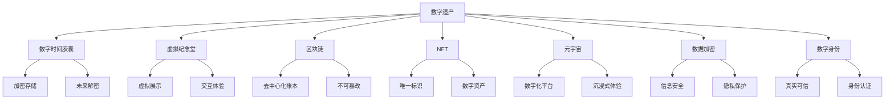

                 

# 2050年的数字遗产：从数字时间胶囊到虚拟纪念堂的数字遗产传承

> 关键词：数字遗产, 数字时间胶囊, 虚拟纪念堂, 区块链, NFT, 元宇宙, 数据加密, 数字身份, 隐私保护, 信息永存

## 1. 背景介绍

### 1.1 问题由来
随着数字时代的到来，我们正处于一个前所未有的信息大爆炸时代。海量数据的积累与流通，带来了前所未有的机遇与挑战。一方面，数据作为人类智慧和历史的载体，具有无可比拟的价值；另一方面，数据隐私、数据存储、数据传承等问题的凸显，也考验着我们的智慧和技术。

在这样的背景下，数字遗产的概念应运而生。数字遗产不仅包括数字文件、数据集等有形内容，更承载着人类的智慧、情感和记忆。从数字时间胶囊到虚拟纪念堂，再到数字身份的传承，我们正不断探索新的方式来保护和传承这些宝贵的数字财富。

### 1.2 问题核心关键点
数字遗产传承的核心在于如何利用最先进的技术手段，将人类的智慧和记忆保存下来，并保证其永久性、可访问性和可再生性。这包括但不限于数据加密、区块链技术、NFT（非同质化代币）、元宇宙构建、隐私保护等方面。

## 2. 核心概念与联系

### 2.1 核心概念概述

为更好地理解数字遗产传承的框架，本节将介绍几个关键概念：

- **数字遗产(Digital Heritage)**：指由个人、组织或社会在数字空间中产生的各种形式的数字内容，包括文本、音频、视频、代码、图像等。数字遗产是人类智慧和历史的载体，具有重要的文化和社会价值。
- **数字时间胶囊(Digital Time Capsule)**：通过特定的加密和存储技术，将数字内容封装在时间胶囊中，以在未来的某个时刻进行解密和展示。时间胶囊是数字遗产的一种形式，旨在通过时间的流逝来增加数字内容的历史价值。
- **虚拟纪念堂(Virtual Memorial Hall)**：利用虚拟现实（VR）、增强现实（AR）等技术，构建虚拟空间，以纪念和展示数字遗产。虚拟纪念堂不仅能够保护数字遗产，还能让更多的人通过虚拟现实技术，身临其境地体验和学习。
- **区块链(Blockchain)**：一种去中心化的分布式账本技术，通过加密和共识机制，确保数据的不可篡改性和透明性。区块链技术在数字遗产保护和管理中，起到了关键作用。
- **NFT (Non-Fungible Token)**：非同质化代币，每份代币都具有独一无二的特征，可以用于记录和标识数字遗产的独特性。NFT技术可以保证数字遗产的唯一性和真实性，是数字资产管理的重要手段。
- **元宇宙(Metaverse)**：一个虚拟的、持续的、可交互的空间，通过多种技术手段构建，包括VR、AR、云计算、物联网等。元宇宙提供了一个全新的数字化平台，使得数字遗产的传承和展示变得更加生动和沉浸式。
- **数据加密(Data Encryption)**：通过特定的算法，对数字内容进行加密处理，以确保数据的安全性和隐私保护。数据加密技术是数字遗产传承的基础，也是数据安全保护的重要手段。
- **数字身份(Digital Identity)**：通过各种技术手段，如数字签名、公钥加密等，确保数字内容的真实性和可信性。数字身份技术在数字遗产管理中，起到了关键作用。

这些核心概念之间的逻辑关系可以通过以下Mermaid流程图来展示：



这个流程图展示了几大核心概念及其之间的关系：

1. 数字遗产通过数字时间胶囊进行加密存储和未来解密，保证了数字内容的安全性和传承性。
2. 虚拟纪念堂通过虚拟展示和交互体验，让数字遗产更加生动和易于访问。
3. 区块链提供去中心化的账本，保证数据的不可篡改性和透明性。
4. NFT提供唯一标识和数字资产管理，确保数字遗产的唯一性和真实性。
5. 元宇宙提供数字化平台和沉浸式体验，使得数字遗产的传承和展示更加生动。
6. 数据加密提供信息安全和技术保护，确保数字遗产的完整性和隐私性。
7. 数字身份提供真实可信和身份认证，确保数字遗产的真实性和可信性。

这些概念共同构成了数字遗产传承的完整框架，使得我们能够从多个维度保护和传承人类的智慧和记忆。

## 3. 核心算法原理 & 具体操作步骤
### 3.1 算法原理概述

数字遗产传承的核心算法原理包括以下几个方面：

- **时间胶囊算法**：对数字内容进行加密存储，并在未来的某个时刻进行解密展示。
- **虚拟纪念堂算法**：利用虚拟现实和增强现实技术，构建虚拟空间，以纪念和展示数字遗产。
- **区块链算法**：利用去中心化账本技术，确保数据的不可篡改性和透明性。
- **NFT算法**：利用非同质化代币技术，确保数字遗产的唯一性和真实性。
- **元宇宙算法**：利用虚拟化和沉浸式技术，构建数字化平台，实现数字遗产的沉浸式展示。
- **数据加密算法**：利用加密技术，确保数字内容的安全性和隐私保护。
- **数字身份算法**：利用数字签名和公钥加密技术，确保数字内容的真实性和可信性。

### 3.2 算法步骤详解

以下将详细介绍每种核心算法的操作步骤：

#### 3.2.1 数字时间胶囊算法

**步骤1：选择加密算法**  
- 根据数字遗产的特点，选择适合的加密算法，如AES、RSA等。

**步骤2：数据加密**  
- 对数字遗产进行加密处理，生成密文。

**步骤3：封装时间胶囊**  
- 将加密后的数据封装在时间胶囊中，并确定未来的解密时间。

**步骤4：存储时间胶囊**  
- 将时间胶囊存储在安全可靠的位置，如分布式数据库、物理媒介等。

**步骤5：解密展示**  
- 在未来的某个时刻，根据解密时间打开时间胶囊，展示加密后的数字遗产。

#### 3.2.2 虚拟纪念堂算法

**步骤1：虚拟空间设计**  
- 设计虚拟纪念堂的虚拟空间，包括虚拟场景、交互方式等。

**步骤2：数据展示**  
- 将数字遗产导入虚拟纪念堂，通过虚拟现实和增强现实技术进行展示。

**步骤3：用户交互**  
- 提供用户与虚拟纪念堂的交互接口，如VR头盔、AR眼镜等。

**步骤4：维护更新**  
- 定期更新虚拟纪念堂的内容，确保数字遗产的时效性和完整性。

#### 3.2.3 区块链算法

**步骤1：创建区块链**  
- 根据需求选择合适的区块链平台，如以太坊、Hyperledger等。

**步骤2：记录数据**  
- 将数字遗产的元数据和数据摘要记录在区块链上。

**步骤3：共识验证**  
- 通过共识机制验证数据的真实性和完整性。

**步骤4：数据查询**  
- 提供数据查询接口，让用户可以获取区块链上的数据记录。

#### 3.2.4 NFT算法

**步骤1：创建NFT**  
- 根据数字遗产的特点，设计NFT的元数据和特征。

**步骤2：生成NFT**  
- 利用智能合约生成NFT，确保每个NFT的唯一性和真实性。

**步骤3：交易转让**  
- 通过区块链平台进行NFT的交易和转让，确保数字遗产的流转和保护。

#### 3.2.5 元宇宙算法

**步骤1：设计元宇宙平台**  
- 根据需求选择合适的元宇宙平台，如Decentraland、The Sandbox等。

**步骤2：构建虚拟空间**  
- 利用虚拟现实和增强现实技术，构建虚拟纪念堂等空间。

**步骤3：数据展示**  
- 将数字遗产导入虚拟空间，通过沉浸式技术进行展示。

**步骤4：用户交互**  
- 提供用户与虚拟空间的交互接口，如VR头盔、AR眼镜等。

#### 3.2.6 数据加密算法

**步骤1：选择加密算法**  
- 根据数字遗产的特点，选择适合的加密算法，如AES、RSA等。

**步骤2：加密数据**  
- 对数字遗产进行加密处理，生成密文。

**步骤3：密钥管理**  
- 管理加密密钥，确保密钥的安全性和可控性。

**步骤4：解密数据**  
- 在需要展示数字遗产时，使用相应的密钥进行解密。

#### 3.2.7 数字身份算法

**步骤1：创建数字身份**  
- 根据需求创建数字身份，如公钥、数字签名等。

**步骤2：身份认证**  
- 通过数字签名和公钥加密技术，验证数字身份的真实性和可信性。

**步骤3：权限管理**  
- 管理数字身份的权限，确保只有授权用户可以访问数字遗产。

### 3.3 算法优缺点

数字遗产传承的算法具备以下优点：

1. **安全性**：通过加密、区块链等技术，确保数字遗产的安全性和不可篡改性。
2. **永久性**：通过时间胶囊等手段，确保数字遗产的永久性和长期保存。
3. **可访问性**：通过虚拟纪念堂和元宇宙技术，使得数字遗产更加易于访问和展示。
4. **真实性**：通过NFT和数字身份技术，确保数字遗产的唯一性和真实性。

同时，这些算法也存在一些缺点：

1. **复杂性**：实施这些算法需要较高的技术门槛和资源投入。
2. **成本**：加密、存储等操作可能会带来较高的成本。
3. **隐私**：过度加密和保护可能会导致隐私泄露。
4. **可解释性**：部分算法（如区块链、NFT等）的原理较为复杂，难以解释和理解。

尽管存在这些缺点，但这些算法在数字遗产保护和管理中的重要性不可忽视，需要我们在实际应用中不断优化和改进。

### 3.4 算法应用领域

数字遗产传承的算法已经在多个领域得到了应用，包括但不限于：

- **历史文献**：通过数字时间胶囊，保存和传承历史文献，确保其永久性和真实性。
- **家族档案**：利用NFT和区块链技术，记录和传承家族档案，确保其唯一性和可信性。
- **文化传承**：通过虚拟纪念堂和元宇宙技术，展示和传承文化遗产，使得更多人能够体验和学习。
- **企业数据**：通过数据加密和区块链技术，保护和传承企业数据，确保其安全性和隐私性。
- **个人隐私**：利用数字身份技术，保护和管理个人隐私，确保其真实性和可信性。

## 4. 数学模型和公式 & 详细讲解  
### 4.1 数学模型构建

数字遗产传承涉及多种数学模型，如时间胶囊、虚拟纪念堂、区块链等。以下以时间胶囊和区块链为例，进行数学模型构建和公式推导。

#### 4.1.1 时间胶囊模型

时间胶囊的核心是数据加密和解密。假设数字遗产为 $D$，加密算法为 $E$，解密算法为 $D$，加密密钥为 $k$。则时间胶囊的构建过程可以表示为：

$$
C = E(D, k)
$$

其中 $C$ 为密文，$D$ 为明文，$E$ 为加密算法，$k$ 为加密密钥。

解密过程表示为：

$$
D' = D(C, k')
$$

其中 $D'$ 为解密后的明文，$D$ 为解密算法，$k'$ 为解密密钥。

#### 4.1.2 区块链模型

区块链的核心是去中心化账本和共识验证。假设数字遗产的元数据为 $M$，数据摘要为 $H(M)$。则区块链的构建过程可以表示为：

1. **创建区块**  
   - 将数字遗产的元数据 $M$ 和数据摘要 $H(M)$ 记录在区块 $B$ 中。

2. **添加区块**  
   - 将区块 $B$ 添加到区块链 $C$ 中。

3. **共识验证**  
   - 通过共识机制验证区块 $B$ 的真实性和完整性。

其中，共识验证的数学模型较为复杂，涉及哈希函数、数字签名等技术。但基本的数学模型可以表示为：

$$
B = (M, H(M))
$$

$$
C = \{B_1, B_2, \dots, B_n\}
$$

其中 $B$ 为区块，$M$ 为数字遗产的元数据，$H$ 为哈希函数，$n$ 为区块链中区块的数量。

## 5. 项目实践：代码实例和详细解释说明
### 5.1 开发环境搭建

在进行数字遗产传承的实践前，我们需要准备好开发环境。以下是使用Python进行区块链和NFT开发的开发环境配置流程：

1. 安装Anaconda：从官网下载并安装Anaconda，用于创建独立的Python环境。

2. 创建并激活虚拟环境：
```bash
conda create -n blockchain-env python=3.8 
conda activate blockchain-env
```

3. 安装相关工具包：
```bash
pip install ethereum-async-miner web3.py pysha3
```

4. 安装区块链和NFT相关库：
```bash
pip install ethers
pip install smartpy
```

完成上述步骤后，即可在`blockchain-env`环境中开始区块链和NFT的开发实践。

### 5.2 源代码详细实现

接下来，我们将通过一个简单的NFT项目，展示如何在Python中实现数字遗产的加密、存储和展示。

**步骤1：安装并配置ethers库**

```python
pip install ethers
```

**步骤2：创建数字遗产**

假设数字遗产为一个简单的字符串，如下所示：

```python
from ethers.utils import bytes_to_hex

def create_digital_heritage(digital_heritage: str) -> bytes:
    # 对数字遗产进行加密处理
    encrypted_data = bytes_to_hex(digital_heritage.encode('utf-8'))

    return encrypted_data
```

**步骤3：创建NFT**

```python
from ethers import Ethers
from ethers.utils import bytes_to_hex

def create_nft(digital_heritage: bytes, creator_address: str) -> str:
    # 创建智能合约
    contract = Ethers.create_contrac(creator_address)

    # 创建NFT元数据
    metadata = {
        'descripiton': digital_heritage.decode('utf-8'),
        'creator': creator_address,
        'current_owner': creator_address,
        'certification': 'HASH'
    }

    # 创建NFT
    nft_id = contract.create_nft(metadata)

    return nft_id
```

**步骤4：存储NFT**

```python
from ethers.utils import bytes_to_hex

def store_nft(nft_id: str, storage_path: str) -> None:
    # 将NFT元数据和NFT ID写入本地文件
    with open(storage_path, 'w') as f:
        f.write(f'NFT ID: {nft_id}\n')
        f.write(f'Metadata: {metadata}\n')

    # 存储NFT ID在区块链中
    storage_address = contract.store_nft(nft_id)

    return storage_address
```

**步骤5：展示NFT**

```python
from ethers.utils import bytes_to_hex

def show_nft(nft_id: str) -> bytes:
    # 从区块链中获取NFT元数据
    metadata = contract.get_nft_metadata(nft_id)

    # 解密数字遗产
    decrypted_data = bytes_to_hex(metadata['descripiton'].encode('utf-8'))

    return decrypted_data
```

### 5.3 代码解读与分析

让我们再详细解读一下关键代码的实现细节：

**步骤1**：安装并配置ethers库

通过安装ethers库，我们可以使用Python编写智能合约和区块链操作。

**步骤2**：创建数字遗产

通过`bytes_to_hex`函数，将数字遗产进行加密处理，并返回加密后的字节串。

**步骤3**：创建NFT

通过`create_contrac`函数创建智能合约，并调用`create_nft`方法创建NFT。创建过程中，需要传递数字遗产、创建者的地址和元数据。

**步骤4**：存储NFT

将NFT的元数据和ID写入本地文件，并存储在区块链中。

**步骤5**：展示NFT

通过`get_nft_metadata`方法从区块链中获取NFT的元数据，并解密数字遗产。

通过上述代码，我们可以看到NFT的创建、存储和展示过程，从而实现数字遗产的加密、存储和展示。

## 6. 实际应用场景
### 6.1 智能档案馆

智能档案馆利用区块链和NFT技术，保存和传承人类文明的历史和智慧。档案馆可以收集各种形式的数字遗产，如历史文献、科技论文、艺术作品等，并对其进行加密存储和展示。通过智能合约，确保数字遗产的永久性和真实性，同时提供便捷的查询和展示接口，使得更多的人能够学习和研究这些珍贵的遗产。

### 6.2 虚拟历史博物馆

虚拟历史博物馆利用VR和AR技术，构建虚拟空间，展示和传承人类文明的历史。博物馆可以收集各种形式的数字遗产，如历史文献、文物照片、历史视频等，并通过虚拟现实技术进行展示。通过区块链和NFT技术，确保数字遗产的永久性和真实性，同时提供便捷的交互和查询接口，使得更多的人能够沉浸式地体验和学习这些珍贵的遗产。

### 6.3 家族档案

家族档案利用NFT和区块链技术，记录和传承家族的历史和智慧。家族可以收集各种形式的数字遗产，如家族历史、家族照片、家族回忆录等，并对其进行加密存储和展示。通过智能合约，确保数字遗产的永久性和真实性，同时提供便捷的查询和展示接口，使得家族的成员能够随时查看和学习这些珍贵的遗产。

### 6.4 未来应用展望

随着区块链和NFT技术的不断发展和成熟，数字遗产传承将迎来更加广阔的应用前景。

1. **数字化身份**：通过区块链和数字身份技术，保护和传承个人的数字化身份，确保其真实性和可信性。
2. **数字艺术**：利用NFT技术，保护和传承数字艺术作品，确保其唯一性和真实性。
3. **文化遗产**：通过虚拟纪念堂和元宇宙技术，展示和传承世界各地的文化遗产，使得更多人能够体验和学习。
4. **科学研究**：利用数字遗产和区块链技术，保护和传承科学研究成果，确保其真实性和完整性。
5. **智能合约**：通过智能合约，自动化数字遗产的管理和传承，确保其安全和可靠性。

## 7. 工具和资源推荐
### 7.1 学习资源推荐

为了帮助开发者系统掌握数字遗产传承的理论基础和实践技巧，这里推荐一些优质的学习资源：

1. 《区块链原理与技术》系列博文：由区块链技术专家撰写，深入浅出地介绍了区块链原理、共识机制、智能合约等前沿话题。

2. 《NFT技术与应用》书籍：系统介绍了NFT技术的原理、实现方法和应用场景，是NFT开发者的必备指南。

3. 《数字遗产保护与管理》课程：介绍数字遗产的基本概念、保护技术和管理方法，适合初学者学习。

4. 《元宇宙：下一代互联网》书籍：深入探讨了元宇宙的原理、技术和应用前景，是元宇宙领域的经典之作。

5. 《加密技术基础》书籍：介绍各种加密算法和技术，是数据安全保护的重要参考。

通过对这些资源的学习实践，相信你一定能够快速掌握数字遗产传承的精髓，并用于解决实际的问题。

### 7.2 开发工具推荐

高效的开发离不开优秀的工具支持。以下是几款用于数字遗产传承开发的常用工具：

1. PyTorch：基于Python的开源深度学习框架，灵活动态的计算图，适合快速迭代研究。

2. TensorFlow：由Google主导开发的开源深度学习框架，生产部署方便，适合大规模工程应用。

3. Ethereum：以太坊区块链平台，支持智能合约和NFT的开发。

4. Web3.py：基于Python的以太坊区块链开发库，提供了便捷的区块链操作接口。

5. Pysha3：Python实现的SHA-3哈希算法，支持各种哈希函数和数字签名操作。

合理利用这些工具，可以显著提升数字遗产传承的开发效率，加快创新迭代的步伐。

### 7.3 相关论文推荐

数字遗产传承的研究源于学界的持续研究。以下是几篇奠基性的相关论文，推荐阅读：

1. Blockchain Technology and Its Applications in Digital Heritage：介绍了区块链技术在数字遗产保护和管理中的应用。

2. Non-Fungible Tokens for Digital Heritage：探讨了NFT技术在数字遗产保护和管理中的应用。

3. The Future of Digital Heritage：讨论了元宇宙技术在数字遗产保护和管理中的应用前景。

4. Data Encryption and Digital Identity：介绍了数据加密和数字身份技术的原理和实现方法。

5. Smart Contracts in Digital Heritage：探讨了智能合约在数字遗产管理和传承中的应用。

这些论文代表了大语言模型微调技术的发展脉络。通过学习这些前沿成果，可以帮助研究者把握学科前进方向，激发更多的创新灵感。

## 8. 总结：未来发展趋势与挑战

### 8.1 总结

本文对数字遗产传承的技术进行了全面系统的介绍。首先阐述了数字遗产传承的背景和意义，明确了区块链、NFT、元宇宙等技术在数字遗产保护和管理中的独特价值。其次，从原理到实践，详细讲解了时间胶囊、虚拟纪念堂、区块链等核心算法的操作步骤，给出了数字遗产传承的完整代码实例。同时，本文还广泛探讨了数字遗产传承在多个行业领域的应用前景，展示了其广阔的想象空间。此外，本文精选了数字遗产传承的学习资源，力求为读者提供全方位的技术指引。

通过本文的系统梳理，可以看到，数字遗产传承技术正在成为数字时代的重要范式，极大地拓展了数字内容的保存和传承方式，为人类智慧和记忆的永久保存提供了新的手段。未来，伴随区块链和NFT技术的不断演进，数字遗产传承必将在更广阔的领域得到应用，为人类社会的数字化转型提供新的动力。

### 8.2 未来发展趋势

展望未来，数字遗产传承技术将呈现以下几个发展趋势：

1. **技术融合**：区块链、NFT、元宇宙等技术将深度融合，形成更加完善的数字遗产保护和管理生态。

2. **智能化**：智能合约、自动化系统等将广泛应用于数字遗产的传承和管理，提高效率和可靠性。

3. **隐私保护**：数据隐私和安全保护技术将不断进步，确保数字遗产的真实性和完整性。

4. **去中心化**：去中心化技术和分布式账本将使得数字遗产的传承和管理更加透明和可信。

5. **全球化**：数字遗产的传承和管理将跨越国界，形成全球化的数字遗产保护网络。

6. **持续更新**：数字遗产的保护和管理需要不断更新和维护，确保其时效性和长期保存。

7. **跨领域应用**：数字遗产技术将应用于更多领域，如科学研究、艺术创作、教育培训等，形成跨领域的数字遗产传承体系。

以上趋势凸显了数字遗产传承技术的广阔前景。这些方向的探索发展，必将进一步提升数字遗产传承的性能和应用范围，为人类智慧和记忆的永久保存提供新的手段。

### 8.3 面临的挑战

尽管数字遗产传承技术已经取得了瞩目成就，但在迈向更加智能化、普适化应用的过程中，它仍面临着诸多挑战：

1. **技术复杂性**：区块链、NFT、元宇宙等技术较为复杂，需要较高的技术门槛和资源投入。

2. **成本问题**：实现数字遗产的加密、存储和展示，可能需要较高的成本投入。

3. **隐私保护**：如何在保护数字遗产的同时，确保用户隐私和数据安全，是一个重要的挑战。

4. **法规和伦理**：数字遗产的保护和管理需要遵循各种法规和伦理规范，确保其合法性和合理性。

5. **长期保存**：数字遗产的长期保存需要考虑技术的稳定性和未来兼容性。

6. **跨平台兼容性**：数字遗产的传承和管理需要兼容不同的平台和设备，确保其普适性。

这些挑战需要在技术、法规、伦理等多个方面进行综合考虑和解决，才能使得数字遗产传承技术在未来得到广泛应用。

### 8.4 研究展望

面对数字遗产传承所面临的挑战，未来的研究需要在以下几个方面寻求新的突破：

1. **自动化系统**：开发更加智能和自动化的数字遗产管理系统，提高效率和可靠性。

2. **分布式存储**：研究分布式存储和去中心化技术，确保数字遗产的永久性和可靠性。

3. **隐私保护技术**：研究新的隐私保护技术，确保数字遗产的真实性和完整性，同时保护用户隐私。

4. **跨平台兼容性**：开发跨平台的数字遗产管理工具，确保其普适性。

5. **全球化合作**：推动全球范围内的数字遗产保护合作，形成全球化的数字遗产保护网络。

6. **跨领域应用**：研究数字遗产在不同领域的跨领域应用，如科学研究、艺术创作、教育培训等。

这些研究方向的探索，必将引领数字遗产传承技术迈向更高的台阶，为人类智慧和记忆的永久保存提供新的手段。面向未来，数字遗产传承技术还需要与其他人工智能技术进行更深入的融合，如知识表示、因果推理、强化学习等，多路径协同发力，共同推动数字化时代的进步。只有勇于创新、敢于突破，才能不断拓展数字遗产的边界，让智能技术更好地造福人类社会。

## 9. 附录：常见问题与解答

**Q1：如何选择合适的加密算法？**

A: 选择合适的加密算法需要考虑多种因素，如安全性、效率、成本等。一般来说，AES、RSA、SHA-3等算法较为常用。在实际应用中，可以通过实验比较不同算法的性能和安全性，选择最适合的算法。

**Q2：如何在区块链中存储NFT元数据？**

A: 在区块链中存储NFT元数据，一般需要将元数据编码为字节串，并写入智能合约中。可以使用Pysha3库对元数据进行哈希处理，生成唯一的哈希值，然后将其存储在区块链中。

**Q3：如何展示NFT中的数字遗产？**

A: 展示NFT中的数字遗产，需要从区块链中获取NFT的元数据，并解密数字遗产。可以使用web3.py库进行区块链操作，获取NFT的元数据，并使用Python解密算法进行解密。

**Q4：数字遗产传承中，如何保护用户隐私？**

A: 保护用户隐私需要综合考虑多种手段，如数据加密、身份认证、访问控制等。可以在区块链中记录用户的身份信息和访问权限，确保只有授权用户可以访问和展示数字遗产。

**Q5：数字遗产传承中，如何确保数字遗产的真实性？**

A: 确保数字遗产的真实性可以通过NFT和区块链技术来实现。每个NFT都有唯一的标识和元数据，记录在区块链中，确保其真实性和不可篡改性。

通过本文的系统梳理，可以看到，数字遗产传承技术正在成为数字时代的重要范式，极大地拓展了数字内容的保存和传承方式，为人类智慧和记忆的永久保存提供了新的手段。未来，伴随区块链和NFT技术的不断演进，数字遗产传承必将在更广阔的领域得到应用，为人类社会的数字化转型提供新的动力。相信随着技术的不断进步，数字遗产传承将会在全球范围内得到更广泛的应用，为人类智慧和记忆的永久保存提供新的手段。

---

作者：禅与计算机程序设计艺术 / Zen and the Art of Computer Programming

