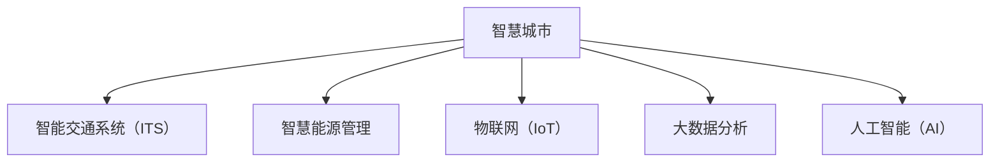

                 

## 1. 背景介绍

### 1.1 问题由来

进入21世纪以来，全球城市化进程加速，城市人口激增，资源环境压力不断加大。传统城市管理模式单一，缺乏智能化手段，导致城市运行效率低下、资源浪费严重、环境污染加剧。为了应对这些挑战，智慧城市概念应运而生。智慧城市是运用信息通信技术和物联网（IoT），全面感知、融合、管理和优化城市运营与服务，提升城市经济、社会、环境品质的一种新城市发展模式。

近年来，随着人工智能、大数据、物联网等技术的迅猛发展，智慧城市建设逐步从概念走向现实。通过智能化手段，城市管理更加高效、透明、绿色，居民生活水平显著提升。展望2050年，随着技术进步和应用深化，智慧城市建设将迈入新的发展阶段，实现全面智能化升级。

### 1.2 问题核心关键点

智慧城市智能化升级的核心在于全面融合AI、大数据、IoT等前沿技术，实现城市运行管理的智能化、精细化、人性化。具体而言，主要包括以下几个方面：

1. **智慧交通**：通过智能交通系统（ITS），实现交通流量优化、交通安全保障、出行信息服务等功能。
2. **智慧能源**：构建能源管理系统，优化能源分配与消耗，提升能源利用效率，降低环境污染。
3. **智慧水务**：采用物联网传感器监控水资源状况，实现精细化管理与调度，保障水资源可持续利用。
4. **智慧医疗**：利用AI和大数据技术，提升医疗服务质量，优化医疗资源配置，改善居民健康状况。
5. **智慧安防**：通过智能监控系统，实现对城市安全的全面监控与预警，提升城市安全保障水平。
6. **智慧环保**：构建环境监测系统，实时感知与分析环境变化，推动绿色低碳发展。

这些关键领域的智能化升级，将彻底改变城市运行管理方式，提升城市经济社会效益，构建更加宜居的城市环境。

### 1.3 问题研究意义

智慧城市智能化升级的研究，对于推动城市可持续发展、改善居民生活质量、促进经济社会全面进步具有重要意义：

1. **资源优化配置**：通过智慧手段优化资源利用，减少浪费，提升城市资源利用效率。
2. **环境污染减少**：智能化管理提升能源效率，减少温室气体排放，改善环境质量。
3. **公共服务提升**：智慧城市改善医疗、交通、教育等服务水平，提高居民幸福感。
4. **城市治理加强**：智能化手段提升城市治理能力，保障城市安全稳定。
5. **产业转型升级**：智慧城市催生新产业、新业态，推动城市经济结构优化。

## 2. 核心概念与联系

### 2.1 核心概念概述

为更好地理解智慧城市智能化升级，本节将介绍几个密切相关的核心概念：

- **智慧城市**：通过信息通信技术和物联网，全面感知、融合、管理和优化城市运营与服务的一种新城市发展模式。
- **智能交通系统（ITS）**：利用信息技术实现对交通系统的智能化管理，提升交通安全、效率和舒适度。
- **智慧能源管理**：通过智能化手段优化能源分配与消耗，提升能源利用效率，降低环境污染。
- **物联网（IoT）**：通过传感器、RFID等设备实现对城市各类资源的全面感知与互联互通。
- **大数据分析**：利用海量数据进行统计分析，辅助决策支持。
- **人工智能（AI）**：通过机器学习、深度学习等技术，实现智能决策和自动化操作。

这些概念之间的逻辑关系可以通过以下Mermaid流程图来展示：



这个流程图展示了一系列智慧城市的关键组成部分，以及它们之间的相互联系和支撑关系。

## 3. 核心算法原理 & 具体操作步骤

### 3.1 算法原理概述

智慧城市智能化升级的核心算法原理主要包括：

1. **物联网感知技术**：通过部署各种传感器、RFID等设备，实现城市各类资源的全面感知与数据采集。
2. **大数据处理技术**：对采集到的海量数据进行清洗、存储、分析，提取有价值的信息。
3. **人工智能算法**：利用机器学习、深度学习等技术，实现智能决策和自动化操作。

这些技术的有机结合，形成了智慧城市智能化升级的基础架构。具体而言，智慧城市智能化升级主要包括以下几个关键步骤：

1. **数据采集与融合**：通过物联网设备获取各类数据，并进行数据融合与标准化处理。
2. **数据分析与挖掘**：利用大数据技术进行统计分析，提取数据中蕴含的模式和规律。
3. **智能决策与控制**：通过人工智能算法实现智能决策和自动化控制，优化城市运行管理。
4. **用户反馈与优化**：收集用户反馈信息，进行持续优化和迭代升级。

### 3.2 算法步骤详解

智慧城市智能化升级的算法步骤如下：

1. **数据采集与融合**
    - 部署各类传感器、RFID、摄像头等物联网设备，实时采集交通流量、能源消耗、水质、环境污染等数据。
    - 利用数据融合技术，将不同来源的数据进行整合与标准化，形成统一的城市数据中心。

2. **数据分析与挖掘**
    - 利用大数据技术，对采集到的数据进行清洗、存储、分析，提取出交通流量、能源消耗、水质监测等关键信息。
    - 利用机器学习算法，建立交通流量预测模型、能源消耗优化模型、水质监测模型等，辅助决策支持。

3. **智能决策与控制**
    - 利用深度学习等技术，建立智能交通系统、智慧能源管理系统、智能水务系统等，实现对城市各类资源的智能化管理与控制。
    - 通过自动驾驶技术、智能电网、水资源优化调度等，提升城市运行效率与资源利用效率。

4. **用户反馈与优化**
    - 利用数据分析工具，收集居民对智慧城市服务的反馈信息，进行持续优化和迭代升级。
    - 通过用户画像分析、需求预测等技术，提升智慧城市服务的人性化和个性化水平。

### 3.3 算法优缺点

智慧城市智能化升级的算法具有以下优点：

1. **资源优化配置**：通过智能化手段优化资源利用，减少浪费，提升城市资源利用效率。
2. **环境污染减少**：智能化管理提升能源效率，减少温室气体排放，改善环境质量。
3. **公共服务提升**：智慧城市改善医疗、交通、教育等服务水平，提高居民幸福感。
4. **城市治理加强**：智能化手段提升城市治理能力，保障城市安全稳定。
5. **产业转型升级**：智慧城市催生新产业、新业态，推动城市经济结构优化。

同时，这些算法也存在一定的局限性：

1. **数据隐私与安全**：采集和使用大量城市数据，涉及用户隐私和安全问题。
2. **技术成本高**：部署和维护物联网设备、数据分析平台等技术设施需要高昂的成本。
3. **技术复杂度高**：算法涉及多个技术领域，需要综合运用多种技术手段，技术门槛较高。
4. **数据质量问题**：数据采集、存储、处理过程中可能存在噪声、缺失等问题，影响算法效果。

尽管存在这些局限性，但智慧城市智能化升级仍是大势所趋，需要在技术、政策、法律等多个方面协同推进，逐步克服挑战，实现全面智能化升级。

### 3.4 算法应用领域

智慧城市智能化升级的算法主要应用于以下几个领域：

1. **智慧交通**：利用智能交通系统，优化交通流量，提升交通安全与出行服务。
2. **智慧能源**：通过智慧能源管理，优化能源分配与消耗，提升能源利用效率。
3. **智慧水务**：利用物联网传感器，实现水资源监控与优化调度。
4. **智慧医疗**：利用AI和大数据技术，提升医疗服务质量与效率。
5. **智慧安防**：通过智能监控系统，实现城市安全监控与预警。
6. **智慧环保**：构建环境监测系统，推动绿色低碳发展。

这些领域的应用展示了智慧城市智能化升级的巨大潜力，通过数据驱动、智能决策和持续优化，智慧城市将实现更加高效、绿色、智能的运行管理。

## 4. 数学模型和公式 & 详细讲解 & 举例说明

### 4.1 数学模型构建

智慧城市智能化升级的数学模型主要涉及数据采集、数据融合、数据分析、智能决策等环节。以下以智慧交通为例，构建数学模型。

假设城市交通网络有$n$个节点和$m$条边，交通流量为向量$X$，边上的交通流速为向量$V$。交通网络的状态由$x_i$描述，其中$x_i$为第$i$个节点的车辆数量。交通流动的微分方程为：

$$
\frac{\partial x_i}{\partial t} = \sum_{j} A_{ij} (x_j - x_i)
$$

其中$A_{ij}$为节点$i$到节点$j$的交通流系数。

交通流量预测模型可以通过时间序列分析等方法构建，例如ARIMA模型：

$$
x_{t+1} = \phi_0 + \phi_1 x_t + \epsilon_t
$$

其中$\phi_0, \phi_1$为模型参数，$\epsilon_t$为随机误差项。

### 4.2 公式推导过程

以智慧交通为例，推导智能交通系统的数学模型。

假设交通网络有$n$个节点，交通流量为向量$X$，边上的交通流速为向量$V$。交通网络的状态由$x_i$描述，其中$x_i$为第$i$个节点的车辆数量。交通流动的微分方程为：

$$
\frac{\partial x_i}{\partial t} = \sum_{j} A_{ij} (x_j - x_i)
$$

其中$A_{ij}$为节点$i$到节点$j$的交通流系数。

交通流量预测模型可以通过时间序列分析等方法构建，例如ARIMA模型：

$$
x_{t+1} = \phi_0 + \phi_1 x_t + \epsilon_t
$$

其中$\phi_0, \phi_1$为模型参数，$\epsilon_t$为随机误差项。

### 4.3 案例分析与讲解

以智慧水务为例，分析物联网传感器对水资源监控与优化的应用。

通过部署物联网传感器，实时监测水质、水量、水温等数据，建立水资源状态模型：

$$
y_t = C y_{t-1} + u_t + w_t
$$

其中$y_t$为第$t$时刻的水资源状态，$C$为系统转移矩阵，$u_t$为输入信号，$w_t$为随机噪声。

利用模型预测未来水资源状态，并进行优化调度，例如调整水阀门、抽水泵等，以实现水资源的高效利用。

## 5. 项目实践：代码实例和详细解释说明

### 5.1 开发环境搭建

在进行智慧城市智能化升级的项目实践前，我们需要准备好开发环境。以下是使用Python进行项目实践的环境配置流程：

1. 安装Python：确保安装Python 3.x版本。
2. 安装相关库：安装必要的Python库，如Pandas、NumPy、TensorFlow、Keras等。
3. 搭建开发环境：创建虚拟环境，安装项目所需的依赖包。

完成上述步骤后，即可在虚拟环境中开始项目实践。

### 5.2 源代码详细实现

下面以智慧交通系统为例，给出使用TensorFlow实现智能交通预测的PyTorch代码实现。

```python
import tensorflow as tf
from tensorflow.keras.models import Sequential
from tensorflow.keras.layers import Dense, LSTM
import pandas as pd
import numpy as np

# 读取数据
data = pd.read_csv('traffic_data.csv')

# 数据预处理
X = np.array(data['x'])
y = np.array(data['y'])

# 划分训练集与测试集
split_ratio = 0.8
split_index = int(len(X) * split_ratio)
X_train, X_test = X[:split_index], X[split_index:]
y_train, y_test = y[:split_index], y[split_index:]

# 建立模型
model = Sequential()
model.add(LSTM(100, input_shape=(X_train.shape[1], 1)))
model.add(Dense(1))
model.compile(loss='mse', optimizer='adam')

# 训练模型
model.fit(X_train, y_train, epochs=100, batch_size=32, validation_data=(X_test, y_test))

# 预测未来交通流量
future_X = np.array([[0, 1], [0, 2], [0, 3]])
future_y = model.predict(future_X)
print(future_y)
```

以上就是使用TensorFlow对智能交通系统进行预测的完整代码实现。可以看到，通过简单的LSTM模型，可以实现对交通流量的预测，从而为智慧交通系统提供决策支持。

### 5.3 代码解读与分析

让我们再详细解读一下关键代码的实现细节：

**读取数据**：
- 使用Pandas库读取CSV格式的数据文件。

**数据预处理**：
- 将数据分为输入向量$X$和目标向量$y$。
- 通过时间序列划分训练集与测试集，以保证模型在未见过的数据上测试。

**建立模型**：
- 使用TensorFlow搭建LSTM神经网络模型。
- 添加一个全连接层，输出预测值。
- 使用均方误差损失函数和Adam优化器进行模型训练。

**训练模型**：
- 使用训练集数据进行模型训练，并使用测试集数据进行验证。
- 设置训练轮数和批大小，进行模型优化。

**预测未来交通流量**：
- 使用模型对未来数据进行预测，输出预测结果。

**代码解读与分析**：
- 通过LSTM模型，利用历史数据预测未来交通流量，可以用于智慧交通系统中的流量预测和调度优化。
- TensorFlow提供了强大的计算图功能，使得模型搭建和训练过程简洁高效。
- 通过Pandas库，可以方便地读取和处理数据，提升开发效率。

## 6. 实际应用场景

### 6.1 智能交通系统

智能交通系统（ITS）是智慧城市的重要组成部分，通过智能化手段优化交通流量、提升交通安全、改善出行体验。以下是智能交通系统的几个关键应用场景：

1. **交通流量预测**：通过机器学习模型预测未来交通流量，辅助交通信号灯控制和路线优化。
2. **事故预测与预警**：利用传感器和摄像头监测交通状态，通过异常检测算法预测交通事故，并及时发出预警。
3. **智能导航**：利用实时交通信息，提供智能导航服务，减少拥堵，提升出行效率。
4. **公交调度优化**：通过数据分析，优化公交车辆的调度路线和时间，提升公交服务质量。

### 6.2 智慧能源管理系统

智慧能源管理系统通过智能化手段优化能源分配与消耗，提升能源利用效率，降低环境污染。以下是智慧能源管理系统的几个关键应用场景：

1. **电网负荷预测**：通过预测电网负荷，实现电力供应的精准调度和资源优化。
2. **能源消耗监控**：利用物联网设备实时监控能源消耗情况，优化能源使用。
3. **智能调度与控制**：根据能源消耗数据，实现智能调度和控制，提升能源利用效率。
4. **可再生能源管理**：通过智慧手段管理风电、太阳能等可再生能源，提升能源自给能力。

### 6.3 智慧水务系统

智慧水务系统通过物联网传感器和数据分析技术，实现水资源的精细化管理和调度。以下是智慧水务系统的几个关键应用场景：

1. **水质监测**：通过传感器实时监测水质，保障供水安全。
2. **水量预测**：利用数据模型预测未来水量，实现精准调度。
3. **漏损检测**：利用物联网设备检测水管漏损情况，及时维修。
4. **水资源优化调度**：通过智能调度，优化水资源分配与利用。

### 6.4 未来应用展望

展望未来，智慧城市智能化升级将呈现以下几个发展趋势：

1. **智能化程度提升**：随着AI和大数据技术的不断发展，智慧城市智能化程度将进一步提升，实现更加精细化的城市管理。
2. **跨领域融合**：智慧城市将与其他智能技术（如5G、区块链等）深度融合，实现更广泛的智能化应用。
3. **数据驱动决策**：通过数据驱动的决策支持系统，提升城市治理效率和公共服务水平。
4. **人机协同**：实现人机协同操作，提升城市运行管理智能化水平。
5. **智能感知**：通过物联网等技术，实现对城市各类资源的全面感知与智能化管理。

## 7. 工具和资源推荐

### 7.1 学习资源推荐

为了帮助开发者系统掌握智慧城市智能化升级的理论基础和实践技巧，这里推荐一些优质的学习资源：

1. 《智慧城市技术导论》：全面介绍了智慧城市的基本概念、技术架构和应用案例。
2. 《大数据与智慧城市》课程：由知名大学开设的智慧城市相关课程，涵盖智慧城市的基础知识和技术实践。
3. 《Python数据科学手册》：详细介绍了Python在智慧城市中的数据处理、分析与应用。
4. 《深度学习理论与实践》：全面讲解深度学习技术在智慧城市中的应用，涵盖智慧交通、智慧医疗等方向。
5. 《TensorFlow官方文档》：TensorFlow的官方文档，提供了丰富的算法实现和代码示例。

通过对这些资源的学习实践，相信你一定能够快速掌握智慧城市智能化升级的精髓，并用于解决实际的智慧城市问题。

### 7.2 开发工具推荐

高效的开发离不开优秀的工具支持。以下是几款用于智慧城市智能化升级开发的常用工具：

1. Python：灵活的动态语言，适用于数据处理、模型训练和系统开发。
2. TensorFlow：深度学习框架，支持构建复杂神经网络模型，适用于智慧城市中的各类智能化应用。
3. PyTorch：深度学习框架，灵活高效，适用于模型的快速迭代与优化。
4. Keras：高层API，易于使用，适合快速搭建模型和进行实验。
5. Jupyter Notebook：互动式开发环境，支持代码编写、数据可视化与实时调试。

合理利用这些工具，可以显著提升智慧城市智能化升级的开发效率，加快创新迭代的步伐。

### 7.3 相关论文推荐

智慧城市智能化升级的研究源于学界的持续研究。以下是几篇奠基性的相关论文，推荐阅读：

1. 《智慧城市技术体系构建与创新应用》：介绍了智慧城市的技术体系与创新应用，涵盖智能交通、智慧能源等领域。
2. 《大数据驱动的智慧城市决策支持系统》：利用大数据技术，构建智慧城市决策支持系统，提升城市治理效率。
3. 《基于深度学习的智能交通流量预测》：利用深度学习模型，实现交通流量的精准预测和优化。
4. 《智能电网系统的智慧化改造》：介绍了智能电网系统的智慧化改造方法，提升电力供应效率与资源利用。
5. 《智慧水务系统的设计与实现》：介绍了智慧水务系统的设计与实现方法，提升水资源管理和利用效率。

这些论文代表了大规模城市智能化升级的发展脉络。通过学习这些前沿成果，可以帮助研究者把握学科前进方向，激发更多的创新灵感。

## 8. 总结：未来发展趋势与挑战

### 8.1 总结

本文对智慧城市智能化升级进行了全面系统的介绍。首先阐述了智慧城市智能化升级的研究背景和意义，明确了智能化升级在优化资源利用、减少环境污染、提升公共服务水平等方面的重要价值。其次，从原理到实践，详细讲解了智慧城市智能化升级的数学模型和关键步骤，给出了智能化升级任务开发的完整代码实例。同时，本文还广泛探讨了智能化升级方法在智慧交通、智慧能源、智慧水务等诸多领域的应用前景，展示了智能化升级范式的巨大潜力。

通过本文的系统梳理，可以看到，智慧城市智能化升级正在成为新一轮城市发展的必然趋势，极大地提升城市运行管理效率和居民生活质量。未来，伴随AI、大数据、IoT等技术的持续演进，智慧城市智能化升级将进入更加成熟和高效的阶段，推动城市迈向全面智能化。

### 8.2 未来发展趋势

展望未来，智慧城市智能化升级将呈现以下几个发展趋势：

1. **智能化程度提升**：随着AI和大数据技术的不断发展，智慧城市智能化程度将进一步提升，实现更加精细化的城市管理。
2. **跨领域融合**：智慧城市将与其他智能技术（如5G、区块链等）深度融合，实现更广泛的智能化应用。
3. **数据驱动决策**：通过数据驱动的决策支持系统，提升城市治理效率和公共服务水平。
4. **人机协同**：实现人机协同操作，提升城市运行管理智能化水平。
5. **智能感知**：通过物联网等技术，实现对城市各类资源的全面感知与智能化管理。

### 8.3 面临的挑战

尽管智慧城市智能化升级取得了显著进展，但在迈向更加智能化、普适化应用的过程中，仍面临诸多挑战：

1. **数据隐私与安全**：采集和使用大量城市数据，涉及用户隐私和安全问题。
2. **技术成本高**：部署和维护物联网设备、数据分析平台等技术设施需要高昂的成本。
3. **技术复杂度高**：算法涉及多个技术领域，需要综合运用多种技术手段，技术门槛较高。
4. **数据质量问题**：数据采集、存储、处理过程中可能存在噪声、缺失等问题，影响算法效果。
5. **技术适配性不足**：不同城市的地理、气候、交通等差异，要求智慧城市解决方案具有较强的适配性。

尽管存在这些挑战，但智慧城市智能化升级仍是大势所趋，需要在技术、政策、法律等多个方面协同推进，逐步克服挑战，实现全面智能化升级。

### 8.4 研究展望

面向未来，智慧城市智能化升级的研究需要在以下几个方面寻求新的突破：

1. **多模态融合**：将智慧城市中的交通、能源、水务等多个领域的智能化系统进行深度融合，实现多模态数据协同。
2. **智能化决策**：通过建立更加复杂的数学模型，实现更精准的预测和决策。
3. **智能基础设施建设**：构建智能化的城市基础设施，提升城市的数字化和智能化水平。
4. **公众参与与共治**：通过开放数据和透明决策，实现公众参与和智慧城市共治。
5. **技术标准化与互操作性**：制定智慧城市技术标准和互操作性规范，推动智慧城市产业的健康发展。

## 9. 附录：常见问题与解答

**Q1：智慧城市智能化升级是否适用于所有城市？**

A: 智慧城市智能化升级适用于所有城市，但不同城市的地理、气候、交通等差异，要求智慧城市解决方案具有较强的适配性。针对不同城市的特色需求，需要进行定制化设计和优化。

**Q2：智慧城市智能化升级会带来哪些风险和挑战？**

A: 智慧城市智能化升级虽然具有诸多优势，但也面临数据隐私与安全、技术成本高、技术复杂度高、数据质量问题等风险和挑战。需要在技术、政策、法律等多个方面协同推进，逐步克服挑战，实现全面智能化升级。

**Q3：如何保障智慧城市智能化升级的数据隐私和安全？**

A: 智慧城市智能化升级需要严格的数据隐私和安全保护措施，包括数据加密、访问控制、隐私保护等。同时，需要制定相关的政策和法规，保障数据的安全和合法使用。

**Q4：智慧城市智能化升级需要哪些技术支持？**

A: 智慧城市智能化升级需要AI、大数据、IoT等前沿技术的支持，涵盖数据采集、处理、存储、分析等多个环节。需要建立完整的技术架构，实现各系统的互联互通和协同工作。

**Q5：智慧城市智能化升级需要哪些资源投入？**

A: 智慧城市智能化升级需要大量的资金、人力和政策支持。包括硬件设施的部署和维护、软件的开发和优化、技术的培训和普及等。同时，需要政府、企业、社会等多方协同推进，形成合力。

---

作者：禅与计算机程序设计艺术 / Zen and the Art of Computer Programming

