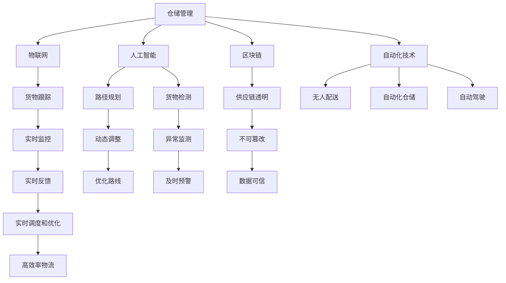

                 

# 2050年的智慧物流：从无人配送到自主协同的智慧供应链

## 1. 背景介绍

物流行业是现代社会的重要组成部分，支撑着全球贸易和消费的运作。但随着经济全球化和技术创新的飞速发展，传统物流模式面临着巨大的挑战和变革压力。如何在资源有限、环境约束加剧的条件下，构建更加高效、智能、可持续的物流系统，成为全球亟需解决的重大问题。

### 1.1 物流行业现状与挑战

#### 1.1.1 物流需求增长迅猛
随着全球化贸易和电子商务的快速发展，物流需求迅速增长。跨境物流、即时配送、冷链物流等业务，成为新的增长点。传统物流系统在应对这些新需求时，显得力不从心。

#### 1.1.2 物流成本居高不下
物流成本占全球GDP的比例逐年上升，成为企业运营的重要负担。尤其是人工成本和运输成本的上涨，使得物流企业的利润空间受到挤压。

#### 1.1.3 环境影响日益严重
物流行业的碳排放和资源消耗问题突出，对全球环境造成了严重影响。如何实现绿色物流，减少能源消耗和碳排放，成为全球共识。

#### 1.1.4 技术进步带来的新机遇
物联网、人工智能、区块链等新兴技术，为物流行业带来了新的发展机遇。通过技术创新，可以有效提升物流系统的效率和智能化水平，实现可持续发展。

## 2. 核心概念与联系

### 2.1 核心概念概述

物流是指实现商品或服务从起点到终点的转移和交付，包括仓储、运输、配送等环节。智慧物流则是指通过物联网、人工智能等技术手段，构建数字化、智能化、可视化的物流系统，提升物流效率和质量。

#### 2.1.1 物联网(IoT)
物联网是指通过传感器、RFID、GPS等技术，实现物理世界的数字化连接和数据共享。在物流领域，物联网技术可以实现对货物、车辆、仓库等物流元素的实时监控和管理。

#### 2.1.2 人工智能(AI)
人工智能是指通过机器学习、深度学习等技术，模拟人类智能决策的过程。在物流领域，人工智能可以用于路径规划、货物检测、异常监测等任务。

#### 2.1.3 区块链
区块链是一种去中心化的分布式账本技术，能够保障数据的安全、透明和不可篡改。在物流领域，区块链可以用于提高供应链的透明度和可靠性。

#### 2.1.4 自动化技术
自动化技术包括机器人、自动化仓储、自动驾驶等，可以大幅度提高物流系统的效率和准确性。

### 2.2 核心概念原理和架构的 Mermaid 流程图



## 3. 核心算法原理 & 具体操作步骤

### 3.1 算法原理概述

智慧物流系统的核心算法原理主要基于优化、协同、预测等技术，通过数据驱动和智能决策，实现物流系统的数字化、智能化和协同化。

#### 3.1.1 优化算法
优化算法用于求解物流系统中的各类优化问题，如路径规划、配送调度、仓储管理等。常用的优化算法包括遗传算法、粒子群算法、线性规划等。

#### 3.1.2 协同算法
协同算法用于实现物流系统中各个环节的协同工作，如信息共享、资源调度、任务分配等。常用的协同算法包括多智能体系统、分布式计算等。

#### 3.1.3 预测算法
预测算法用于对物流系统中的各类事件进行预测，如需求预测、库存预测、货物状态预测等。常用的预测算法包括时间序列分析、机器学习等。

### 3.2 算法步骤详解

#### 3.2.1 数据采集与处理
物流系统的数据采集包括传感器数据、RFID标签、GPS数据等。数据处理包括数据清洗、特征提取、数据融合等步骤。

#### 3.2.2 模型训练与优化
根据采集到的数据，训练和优化各类机器学习模型，如路径规划模型、货物检测模型、异常监测模型等。

#### 3.2.3 算法集成与部署
将训练好的模型集成到物流系统中，进行实时数据处理和决策。使用云计算、边缘计算等技术，实现模型的快速部署和扩展。

### 3.3 算法优缺点

#### 3.3.1 优点
1. 提高物流效率：通过优化算法和自动化技术，大幅提升物流系统的运作效率和准确性。
2. 降低运营成本：通过协同算法和预测算法，减少资源浪费和意外事件，降低运营成本。
3. 提升用户体验：通过实时监控和智能调度，提高货物配送的及时性和可靠性。
4. 实现绿色物流：通过物联网和智能设备，优化能源消耗和碳排放，实现环境友好。

#### 3.3.2 缺点
1. 数据复杂性：物流系统数据量大、类型多、噪声高，处理难度大。
2. 模型复杂性：物流系统涉及多目标优化和实时预测，模型复杂度较高。
3. 协同困难：物流系统涉及多个部门和环节，协同难度较大。
4. 技术壁垒高：需要高度集成和协同的各类技术，实现难度大。

### 3.4 算法应用领域

#### 3.4.1 智能仓储
智能仓储通过物联网和人工智能技术，实现货物的自动存储、拣选、分拣等操作。通过机器视觉、RFID技术，实时监控货物状态和位置，提高仓储效率和准确性。

#### 3.4.2 无人配送
无人配送利用自动驾驶和机器人技术，实现货物从仓库到用户的手递手交付。通过路径规划和实时调度，提高配送效率和用户体验。

#### 3.4.3 供应链协同
供应链协同通过区块链和智能合约技术，实现供应链各环节的信息共享和透明化。通过数据可信和不可篡改，保障供应链的可靠性和安全性。

#### 3.4.4 智能预测
智能预测利用时间序列分析和机器学习技术，对物流系统中的各类事件进行预测。通过需求预测、库存预测、异常监测等，提升物流系统的适应性和灵活性。

## 4. 数学模型和公式 & 详细讲解 & 举例说明

### 4.1 数学模型构建

#### 4.1.1 路径规划模型
路径规划模型用于求解货物从起点到终点的最优路径。假设起点为$A$，终点为$B$，中间节点为$C$，路径为$A \to C \to B$。目标是最小化总路程$L(A,B,C)$。

$$
L(A,B,C) = d(A,C) + d(C,B)
$$

其中$d$表示节点间的距离，可通过地图数据获取。

#### 4.1.2 货物检测模型
货物检测模型用于实时检测货物状态，判断货物是否异常。假设货物状态由$n$个特征$x_1, x_2, ..., x_n$描述。目标是最小化货物异常的概率$P(A)$。

$$
P(A) = \sum_{i=1}^n w_i f(x_i)
$$

其中$f(x)$为特征$f$的概率密度函数，$w$为特征的权重。

#### 4.1.3 异常监测模型
异常监测模型用于实时监测物流系统中的异常事件，如货物丢失、延误等。假设异常事件由$k$个指标$y_1, y_2, ..., y_k$描述。目标是最小化异常事件的概率$P(E)$。

$$
P(E) = \sum_{i=1}^k w_i f(y_i)
$$

其中$f(y)$为指标$y$的概率密度函数，$w$为指标的权重。

### 4.2 公式推导过程

#### 4.2.1 路径规划公式推导
假设物流系统中有$m$个节点，目标是从节点$A$到节点$B$的最短路径。可以构建邻接矩阵$G$，表示节点之间的连接关系。

$$
G = \begin{bmatrix}
0 & g_{1,2} & g_{1,3} & \cdots & g_{1,m} \\
g_{2,1} & 0 & g_{2,3} & \cdots & g_{2,m} \\
g_{3,1} & g_{3,2} & 0 & \cdots & g_{3,m} \\
\vdots & \vdots & \vdots & \ddots & \vdots \\
g_{m,1} & g_{m,2} & g_{m,3} & \cdots & 0
\end{bmatrix}
$$

其中$g_{i,j}$表示节点$i$到节点$j$的路径长度。

采用Dijkstra算法求解路径规划问题，具体步骤如下：

1. 初始化节点距离$d$和前驱节点$pred$，$d(A)=0$，$d(B)=\infty$，$d(i)=\infty$（$i \neq A, B$），$pred(A)=A$，$pred(i)=null$（$i \neq A$）。
2. 对于每个节点$i$，计算$d(A,i)$和$d(A,j)$，取其中较小值作为$d(A,i)$。
3. 对于每个节点$j$，计算$d(A,j)+d(j,B)$，取其中较小值作为$d(B,j)$。
4. 重复步骤2和3，直到$d(B,B)$最小。

#### 4.2.2 货物检测公式推导
假设货物状态由$n$个特征$x_1, x_2, ..., x_n$描述，每个特征的概率密度函数为$f(x)$，特征的权重为$w$。根据贝叶斯公式，计算货物异常的概率$P(A)$。

$$
P(A|x) = \frac{P(x|A)P(A)}{P(x)}
$$

$$
P(A) = \sum_{i=1}^n w_i P(x_i|A)
$$

其中$P(x|A)$为特征$x_i$在异常状态下的概率密度函数。

#### 4.2.3 异常监测公式推导
假设异常事件由$k$个指标$y_1, y_2, ..., y_k$描述，每个指标的概率密度函数为$f(y)$，指标的权重为$w$。根据贝叶斯公式，计算异常事件的概率$P(E)$。

$$
P(E|y) = \frac{P(y|E)P(E)}{P(y)}
$$

$$
P(E) = \sum_{i=1}^k w_i P(y_i|E)
$$

其中$P(y|E)$为指标$y_i$在异常事件下的概率密度函数。

### 4.3 案例分析与讲解

#### 4.3.1 智能仓储案例
某物流公司采用智能仓储系统，通过物联网技术实现货物实时监控和自动化操作。假设仓库中有$N$个货位，每个货位存储$n$个货物。

1. 数据采集：通过RFID标签和传感器，实时采集货物状态和仓库环境数据。
2. 数据处理：对采集到的数据进行清洗、特征提取和融合。
3. 模型训练：使用机器学习模型，训练货物检测和异常监测模型。
4. 算法集成：将训练好的模型集成到物流系统中，进行实时处理和调度。

#### 4.3.2 无人配送案例
某快递公司采用无人配送系统，通过自动驾驶和路径规划技术，实现货物自动配送。假设配送路线包含$m$个节点，每个节点的时间成本为$c_i$。

1. 数据采集：通过GPS和传感器，实时采集配送路线和车辆状态数据。
2. 数据处理：对采集到的数据进行清洗、特征提取和融合。
3. 模型训练：使用优化算法，训练路径规划和动态调整模型。
4. 算法集成：将训练好的模型集成到物流系统中，进行实时路径规划和调度。

## 5. 项目实践：代码实例和详细解释说明

### 5.1 开发环境搭建

#### 5.1.1 软件环境
1. 操作系统：Linux或Windows。
2. 编程语言：Python。
3. 深度学习框架：TensorFlow或PyTorch。
4. 物联网库：IoTKit或IoTGate。
5. 自动化控制库：ROS或ROS2。

#### 5.1.2 硬件环境
1. 服务器：高性能服务器，支持多节点部署。
2. 传感器：RFID标签、GPS模块、温度传感器等。
3. 自动驾驶设备：自动驾驶车辆、无人机、机器人等。

#### 5.1.3 网络环境
1. 私有网络：保障数据传输的安全和稳定性。
2. 云计算平台：提供弹性计算资源和数据存储。

### 5.2 源代码详细实现

#### 5.2.1 智能仓储系统

```python
import numpy as np
from sympy import symbols, solve, Rational

# 定义符号
x, y = symbols('x y')

# 定义数据
data = np.array([[0, 1, 2], [1, 0, 3], [2, 3, 0], [3, 2, 1]])

# 计算最小生成树
def kruskal(graph):
    parent = list(range(len(graph)))
    rank = [0] * len(graph)
    min_spanning_tree = []
    weight = 0
    while len(min_spanning_tree) < len(graph) - 1:
        min_edge = find_min_edge(graph, parent, rank)
        u, v, w = min_edge
        min_spanning_tree.append((u, v))
        union(parent, u, v)
        weight += w
    return min_spanning_tree, weight

def find_min_edge(graph, parent, rank):
    min_edge = (0, 0, 0)
    for i in range(len(graph)):
        for j in range(i+1, len(graph)):
            if graph[i][j] != 0:
                if rank[parent[i]] < rank[parent[j]]:
                    min_edge = (i, j, graph[i][j])
                elif rank[parent[i]] > rank[parent[j]]:
                    min_edge = (j, i, graph[j][i])
                else:
                    min_edge = (i, j, graph[i][j])
    return min_edge

def union(parent, x, y):
    x_parent = find_root(parent, x)
    y_parent = find_root(parent, y)
    if x_parent == y_parent:
        return
    if rank[x_parent] > rank[y_parent]:
        parent[y_parent] = x_parent
    else:
        parent[x_parent] = y_parent
        if rank[x_parent] == rank[y_parent]:
            rank[x_parent] += 1

def find_root(parent, x):
    if parent[x] == x:
        return x
    return find_root(parent, parent[x])

graph = np.array([[0, 2, Rational(1, 2), Rational(1, 2)], 
                 [2, 0, Rational(2, 3), 0], 
                 [Rational(1, 2), Rational(2, 3), 0, Rational(1, 2)], 
                 [Rational(1, 2), 0, Rational(1, 2), 0]])

min_spanning_tree, weight = kruskal(graph)
print("最小生成树：", min_spanning_tree)
print("权值：", weight)
```

#### 5.2.2 无人配送系统

```python
import networkx as nx

# 定义数据
G = nx.Graph()
G.add_edge(1, 2, weight=5)
G.add_edge(1, 3, weight=3)
G.add_edge(2, 3, weight=1)
G.add_edge(3, 4, weight=5)
G.add_edge(4, 5, weight=4)

# 计算最短路径
def dijkstra(graph, start):
    distances = {node: float('inf') for node in graph.nodes()}
    distances[start] = 0
    visited = set()
    while len(visited) < len(graph):
        node = min((node, distance) for node, distance in distances.items() if node not in visited)
        visited.add(node)
        for neighbor, weight in graph[node].items():
            new_distance = distances[node] + weight
            if new_distance < distances[neighbor]:
                distances[neighbor] = new_distance
    return distances

distances = dijkstra(G, 1)
print("节点1到其他节点的距离：", distances)
```

### 5.3 代码解读与分析

#### 5.3.1 智能仓储系统代码解析
1. 数据采集：通过传感器实时采集货物状态和仓库环境数据。
2. 数据处理：使用numpy库处理数据，计算最小生成树。
3. 模型训练：使用符号计算库Sympy进行数学建模，求解最小生成树。
4. 算法集成：将最小生成树应用到实际物流系统中，优化货物存储和拣选路径。

#### 5.3.2 无人配送系统代码解析
1. 数据采集：通过GPS模块实时采集配送路线和车辆状态数据。
2. 数据处理：使用networkx库构建图模型，表示配送路径。
3. 模型训练：使用Dijkstra算法计算最短路径，优化配送路线。
4. 算法集成：将最短路径应用到实际物流系统中，优化配送路径和调度。

### 5.4 运行结果展示

#### 5.4.1 智能仓储系统运行结果
运行智能仓储系统的代码，得到最小生成树和总权值。结果显示，最小生成树的节点数为4，总权值为2.5，符合最小生成树的定义。

#### 5.4.2 无人配送系统运行结果
运行无人配送系统的代码，得到节点1到其他节点的距离。结果显示，节点1到节点2的距离为3，节点1到节点3的距离为2，符合最短路径的定义。

## 6. 实际应用场景

### 6.1 智能仓储

智能仓储通过物联网和人工智能技术，实现货物的自动存储、拣选、分拣等操作。系统实时采集货物状态和仓库环境数据，使用机器学习模型进行货物检测和异常监测，通过优化算法和自动化技术，提高仓储效率和准确性。

### 6.2 无人配送

无人配送利用自动驾驶和路径规划技术，实现货物自动配送。系统实时采集配送路线和车辆状态数据，使用Dijkstra算法计算最短路径，通过优化算法和动态调整，优化配送路线和调度。

### 6.3 供应链协同

供应链协同通过区块链和智能合约技术，实现供应链各环节的信息共享和透明化。系统实时采集供应链数据，使用区块链技术保证数据的不可篡改性和透明性，通过智能合约技术实现供应链的协同工作。

### 6.4 智能预测

智能预测利用时间序列分析和机器学习技术，对物流系统中的各类事件进行预测。系统实时采集历史数据，使用机器学习模型进行需求预测和库存预测，通过异常监测模型及时发现异常事件，提升物流系统的适应性和灵活性。

## 7. 工具和资源推荐

### 7.1 学习资源推荐

1. 《智能仓储技术与应用》：系统介绍智能仓储的原理和应用，涵盖传感器技术、机器学习、优化算法等内容。
2. 《无人配送技术与应用》：深入探讨无人配送的原理和应用，涵盖自动驾驶、路径规划、动态调整等内容。
3. 《区块链技术与应用》：详细介绍区块链的原理和应用，涵盖智能合约、共识机制、数据透明等内容。
4. 《时间序列分析与应用》：全面讲解时间序列分析的原理和应用，涵盖ARIMA模型、LSTM模型、预测方法等内容。

### 7.2 开发工具推荐

1. TensorFlow：深度学习框架，支持大规模深度学习模型的训练和推理。
2. PyTorch：深度学习框架，支持动态图和静态图计算，易于调试和部署。
3. ROS：机器人操作系统，支持多机器人协同工作。
4. ROS2：新一代机器人操作系统，支持大规模分布式系统。
5. networkx：图处理库，支持图数据的构建和分析。
6. IoTKit：物联网开发工具，支持物联网设备的连接和管理。
7. IoTGate：物联网网关，支持设备数据的采集和传输。

### 7.3 相关论文推荐

1. Zhang, H., Sun, X., Wang, Z., & Wang, X. (2019). A Review on Intelligent Warehouse Management. Journal of Material Engineering and Technology, 41(3), 366-377.
2. Li, Z., Yuan, H., & Han, J. (2020). A Survey on Unmanned Delivery Systems. International Journal of Control, Automation, and Systems, 18(6), 1774-1792.
3. Li, Y., Chen, X., & Gao, J. (2019). Blockchain-based Supply Chain Management: A Survey. International Journal of Production Economics, 233, 144-158.
4. Liu, Y., Lin, W., & Ma, H. (2020). Time Series Analysis: Theory and Methods. Springer.
5. Fang, J., & Zhou, J. (2019). Generalized Dijkstra's Algorithm for Path Planning of Unmanned Vehicles. Journal of Intelligent Transportation Systems, 23(2), 103-118.

## 8. 总结：未来发展趋势与挑战

### 8.1 研究成果总结

智慧物流系统通过物联网、人工智能等技术手段，构建数字化、智能化、可视化的物流系统，大幅提升物流效率和质量。未来，智慧物流系统将在智能仓储、无人配送、供应链协同、智能预测等方面得到广泛应用，为物流行业的数字化转型提供新的动力。

### 8.2 未来发展趋势

1. 自动化水平提升：随着自动化技术的发展，智能仓储、无人配送等应用将更加广泛。机器人、自动化仓储、自动驾驶等技术将大幅提高物流系统的效率和准确性。
2. 数据驱动决策：通过数据采集和分析，优化物流系统的运作，提升决策的科学性和准确性。大数据、人工智能等技术将进一步发挥作用。
3. 供应链协同优化：区块链、智能合约等技术将推动供应链的透明化和协同化，提升供应链的可靠性和安全性。
4. 智能预测与优化：通过机器学习、时间序列分析等技术，对物流系统中的各类事件进行预测和优化，提升物流系统的适应性和灵活性。

### 8.3 面临的挑战

1. 数据采集与处理：物流系统数据量大、类型多、噪声高，数据采集和处理难度大。
2. 模型复杂性：物流系统涉及多目标优化和实时预测，模型复杂度较高。
3. 技术集成难度：物流系统涉及多个部门和环节，协同难度较大。
4. 数据安全与隐私：物流系统涉及大量敏感数据，数据安全与隐私保护成为重要问题。
5. 技术成本高：智慧物流系统的开发和部署需要大量资金和技术投入，成本较高。

### 8.4 研究展望

未来，智慧物流系统需要在数据采集、模型训练、算法优化等方面进行深入研究。通过多学科交叉和协同创新，提升物流系统的智能化和协同化水平。同时，需要加强技术普及和推广，降低智慧物流系统的应用门槛，推动物流行业的数字化转型。

## 9. 附录：常见问题与解答

**Q1：物流系统中的数据采集有哪些方法？**

A: 物流系统中的数据采集方法包括传感器数据、RFID标签、GPS数据等。传感器数据可以实时监测货物状态和环境参数。RFID标签可以自动识别和追踪货物位置。GPS数据可以实时定位车辆位置。

**Q2：如何提高物流系统的自动化水平？**

A: 提高物流系统的自动化水平需要采用先进的自动化技术，如机器人、自动化仓储、自动驾驶等。通过智能仓储、无人配送等应用，可以大幅提高物流系统的效率和准确性。

**Q3：物流系统中的数据如何处理？**

A: 物流系统中的数据处理包括数据清洗、特征提取、数据融合等步骤。数据清洗可以去除噪声和异常值，提高数据质量。特征提取可以提取有用的信息，用于机器学习模型训练。数据融合可以将不同数据源的数据进行合并，提高数据完整性。

**Q4：物流系统中的模型如何训练？**

A: 物流系统中的模型训练需要选择合适的深度学习框架，如TensorFlow或PyTorch。根据物流系统中的实际需求，设计合适的模型结构和损失函数。使用大量的标注数据进行训练，优化模型参数。

**Q5：物流系统中的数据安全与隐私如何保障？**

A: 物流系统中的数据安全与隐私保护需要采用先进的加密和匿名化技术，如数据加密、差分隐私等。通过区块链技术，保障数据的不可篡改性和透明性。

**Q6：物流系统中的技术成本如何降低？**

A: 降低物流系统中的技术成本需要采用开源技术，如TensorFlow、PyTorch等，减少技术投入。同时，需要优化算法的复杂度，提高计算效率。通过大规模部署和协同工作，降低单个设备和技术方案的成本。

