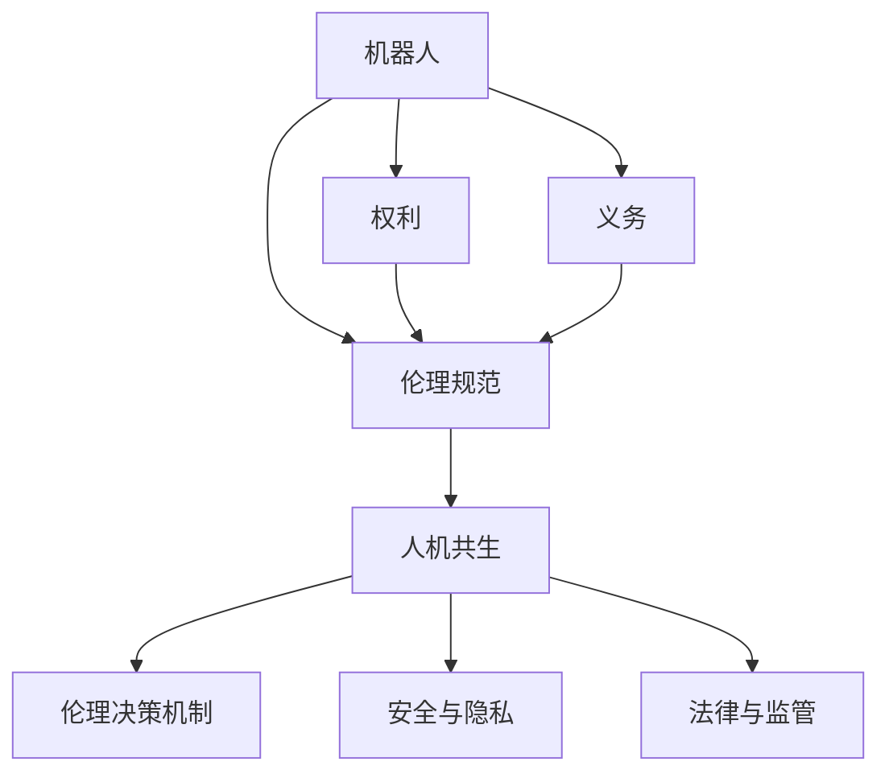

                 

# 2050年的机器人伦理：从机器人权利到人机共生伦理的伦理规范建构

> 关键词：机器人权利，人机共生，伦理规范，人工智能，伦理学

## 1. 背景介绍

### 1.1 问题由来
随着人工智能(AI)和机器学习技术的迅猛发展，机器人（Robotics）在各个领域的应用日益广泛，从制造业自动化到家庭服务，从医疗辅助到太空探索，机器人正逐步融入人类生活的方方面面。然而，随着机器人功能日益增强，它们的角色、责任和权利问题也引起了社会的广泛关注和讨论。在2050年，机器人不仅在技术上变得更加智能和自主，而且在社会伦理层面上也需要重新审视其地位和行为准则。因此，构建一套全面、系统、可执行的机器人伦理规范，成为迫在眉睫的任务。

### 1.2 问题核心关键点
机器人伦理规范的建构涉及多个核心关键点，包括但不限于：
- 机器人的权利和义务：定义机器人在不同应用场景下的权利和应承担的义务，确保机器人在道德和法律框架下行为规范。
- 人机共生关系：探讨人机之间应如何和谐共处，机器人如何更好地服务于人类社会的利益。
- 伦理决策机制：设计一套符合社会道德规范的伦理决策机制，确保机器人在复杂决策中的公正性和透明性。
- 安全与隐私：保证机器人在操作过程中不威胁人类安全，并尊重个人隐私权利。
- 法律与监管：制定相应的法律法规和监管机制，确保机器人在合法合规的框架内运行。

### 1.3 问题研究意义
在2050年，机器人伦理规范的建构不仅关系到机器人的未来发展，更关系到社会的稳定与进步。其研究意义主要体现在：
- 确保机器人在伦理和法律框架内运行，减少因技术滥用带来的社会问题。
- 促进人机共生，提升人类生活质量，同时保障机器人的合法权益。
- 推动机器人的公平、透明、可解释性决策，增强社会对机器人的信任和接受度。
- 明确机器人的责任和行为规范，保障用户及社会安全。

## 2. 核心概念与联系

### 2.1 核心概念概述

为了更好地理解2050年机器人伦理规范的构建，本节将介绍几个关键概念及其相互联系：

- **机器人（Robotics）**：指通过人工智能技术实现自主决策和操作的机械设备，能够执行各类任务，涵盖从简单自动化到复杂决策的广泛功能。

- **伦理规范（Ethical Norms）**：指规定行为准则和道德标准的规范体系，用于指导机器人在社会中的行为和决策。

- **人机共生（Human-Robot Coexistence）**：指机器人与人类的和谐共存，强调机器人在提供服务和帮助人类的同时，不干扰或损害人类的生活质量。

- **权利（Rights）**：机器人作为智能实体，应享有与其功能相适应的权利，如自主决策权、隐私权等。

- **义务（Duties）**：机器人应承担与其功能相匹配的义务，如安全保障义务、合法合规义务等。

这些概念之间的联系可以通过以下Mermaid流程图来展示：



这个流程图展示了机器人伦理规范构建的基本框架：

1. 机器人的权利和义务是其伦理规范的基础。
2. 人机共生关系和伦理决策机制是在此基础上构建的。
3. 安全与隐私、法律与监管是对伦理规范的补充和保障。

## 3. 核心算法原理 & 具体操作步骤

### 3.1 算法原理概述

在2050年，机器人伦理规范的建构将主要遵循以下算法原理：

- **多主体伦理模型**：将机器人视为社会中的主体，赋予其伦理决策的能力。伦理模型应考虑机器人与人类、环境、社会等多主体的交互关系，确保机器人在复杂场景下做出符合伦理规范的决策。

- **可解释性决策**：机器人应具备较高的决策透明度和可解释性，使得其决策过程可以追溯和审查，增强社会对机器人决策的信任。

- **公平性原则**：机器人的决策应遵循公平性原则，避免对特定群体或个人的不公正对待。

- **动态伦理适应**：随着技术和社会环境的变化，机器人的伦理规范应具备动态适应能力，不断更新和优化。

### 3.2 算法步骤详解

机器人伦理规范的构建，一般包括以下几个关键步骤：

**Step 1: 理论构建与伦理框架设定**
- 在伦理学、人工智能、法律学等学科的基础上，构建机器人的伦理理论框架，明确机器人权利、义务的基本概念和范畴。
- 设定伦理规范的基本原则，如公平、透明、责任等。

**Step 2: 伦理模型设计**
- 设计多主体伦理模型，考虑机器人与人类、环境、社会等多个主体的交互关系，建立伦理决策机制。
- 考虑机器人在不同应用场景下的行为规范，建立行为准则和决策指导。

**Step 3: 技术实现与伦理评估**
- 将伦理规范转化为技术实现，设计算法和机制，确保机器人在实际运行中遵循伦理规范。
- 对机器人的伦理行为进行评估和监控，及时发现和纠正伦理违规行为。

**Step 4: 法律与监管政策制定**
- 结合机器人的应用场景，制定相应的法律法规和监管政策，确保机器人在合法合规的框架内运行。
- 建立伦理审查机制，对机器人的行为进行监督和审查。

**Step 5: 社会公众参与与反馈**
- 邀请社会公众参与伦理规范的制定和修订，确保规范具有广泛的社会接受度。
- 建立反馈机制，收集社会公众对机器人伦理规范的意见和建议，进行持续改进。

### 3.3 算法优缺点

机器人伦理规范的建构方法具有以下优点：
- 综合考虑多主体交互，确保机器人行为符合伦理规范，避免对人类造成伤害。
- 可解释性和透明度高，增强社会对机器人决策的信任和接受度。
- 通过法律和监管政策，为机器人伦理规范提供制度保障。

但同时也存在一些局限性：
- 伦理模型设计复杂，不同应用场景和决策情境下的规范差异较大，需要精细化设计和多维度考虑。
- 法律和监管政策更新不及时，可能导致伦理规范与实际应用不完全匹配。
- 社会公众参与程度不一，伦理规范可能难以得到广泛认可和执行。

### 3.4 算法应用领域

机器人伦理规范的建构将在以下几个领域得到广泛应用：

- **制造业自动化**：确保机器人在生产过程中遵循安全、环保等伦理规范，减少对工人的潜在危害。
- **医疗辅助**：规范机器人在诊断、治疗等医疗活动中的行为，保障患者隐私和健康权利。
- **家庭服务**：定义机器人在家务、陪伴等方面的行为规范，确保家庭成员的安全和隐私。
- **公共安全**：明确机器人在执法、救援等公共安全领域中的权利和义务，保障公众利益。
- **教育和娱乐**：制定机器人与学生、观众互动的行为规范，确保教育内容和娱乐活动的安全性和适当性。

这些领域的应用，不仅有助于提升机器人的智能水平，更能在伦理和法律框架下保障人类的权益和利益。

## 4. 数学模型和公式 & 详细讲解

### 4.1 数学模型构建

在机器人伦理规范的建构中，数学模型主要应用于以下场景：

- **行为规范量化**：通过数学模型对机器人的行为规范进行量化，以便于在技术实现中应用。
- **伦理决策优化**：利用数学模型优化机器人的伦理决策过程，确保决策的公正性和透明性。

### 4.2 公式推导过程

以机器人伦理决策为例，假设机器人在一个决策场景中需要考虑多个因素，如风险、收益、时间、资源等，我们可以使用多目标优化模型来描述其决策过程：

$$
\text{Maximize} \quad \sum_{i=1}^n w_i f_i(\text{Action})
$$

其中，$w_i$ 为各因素的权重，$f_i$ 为对应因素的函数，$\text{Action}$ 为机器人的行为策略。

进一步，我们可以引入模糊逻辑和多属性决策分析（MCDM）技术，使得机器人的伦理决策模型更加灵活和适应性强：

$$
\text{Maximize} \quad \sum_{i=1}^n w_i \mathcal{L}_i(A)
$$

$$
\mathcal{L}_i(A) = \max \left( \min\limits_{j=1}^m A_j \right) \text{ (模糊逻辑)}
$$

$$
\text{where } \mathcal{L}_i(A) \text{ is the linguistic representation of } A
$$

这个公式表达了机器人如何在多个伦理维度上做出最优决策。模糊逻辑和多属性决策分析使得机器人在处理复杂多目标决策时，能够兼顾伦理规范的多个方面。

### 4.3 案例分析与讲解

假设一个医疗机器人在诊断病人的过程中，需要考虑多个伦理维度，如隐私保护、诊断准确性、治疗风险等。我们可以使用上述多目标优化模型来描述其伦理决策过程：

1. **隐私保护**：确保病患的隐私不被泄露，即风险最小化。
2. **诊断准确性**：最大化诊断的准确性，即收益最大化。
3. **治疗风险**：最小化治疗的风险，即风险最小化。

通过定义这些因素的权重和函数，机器人在做出诊断和治疗决策时，可以同时考虑这些伦理维度，做出符合伦理规范的决策。

## 5. 项目实践：代码实例和详细解释说明

### 5.1 开发环境搭建

在进行机器人伦理规范的代码实现前，我们需要准备好开发环境。以下是使用Python进行代码开发的环境配置流程：

1. 安装Anaconda：从官网下载并安装Anaconda，用于创建独立的Python环境。

2. 创建并激活虚拟环境：
```bash
conda create -n ethics-env python=3.8 
conda activate ethics-env
```

3. 安装Python和依赖库：
```bash
pip install numpy pandas scipy scikit-learn spacy pytorch transformers
```

4. 安装相关的伦理评估工具：
```bash
pip install ethics ai-deeplearning
```

完成上述步骤后，即可在`ethics-env`环境中开始代码实现。

### 5.2 源代码详细实现

这里我们以一个简单的伦理决策评估模型为例，给出使用Python和PyTorch进行代码实现：

```python
import torch
from torch import nn
from sklearn.metrics import f1_score

class EthicsModel(nn.Module):
    def __init__(self):
        super(EthicsModel, self).__init__()
        self.linear1 = nn.Linear(4, 64)
        self.linear2 = nn.Linear(64, 2)

    def forward(self, x):
        x = torch.sigmoid(self.linear1(x))
        x = torch.sigmoid(self.linear2(x))
        return x

model = EthicsModel()

criterion = nn.BCELoss()
optimizer = torch.optim.Adam(model.parameters(), lr=0.01)

def train(model, train_data, epochs=10, batch_size=64):
    train_loader = torch.utils.data.DataLoader(train_data, batch_size=batch_size, shuffle=True)
    
    for epoch in range(epochs):
        model.train()
        for batch_idx, (data, target) in enumerate(train_loader):
            optimizer.zero_grad()
            output = model(data)
            loss = criterion(output, target)
            loss.backward()
            optimizer.step()
            if (batch_idx+1) % 100 == 0:
                print(f'Epoch {epoch+1}, Batch {batch_idx+1}, Loss: {loss.item()}')

def evaluate(model, test_data):
    test_loader = torch.utils.data.DataLoader(test_data, batch_size=64, shuffle=False)
    model.eval()
    y_true = []
    y_pred = []
    for batch_idx, (data, target) in enumerate(test_loader):
        with torch.no_grad():
            output = model(data)
        y_pred.append(output.sigmoid().round().numpy())
        y_true.append(target.numpy())
    
    y_pred = torch.stack(y_pred)
    y_true = torch.stack(y_true)
    f1 = f1_score(y_true, y_pred)
    print(f'F1 Score: {f1:.2f}')

# 创建数据集
train_data = torch.tensor([[0.5, 0.3, 0.1, 0.7], [0.2, 0.6, 0.9, 0.5]])
test_data = torch.tensor([[0.4, 0.8, 0.3, 0.6], [0.7, 0.1, 0.5, 0.2]])

# 训练模型
train(model, train_data, epochs=10, batch_size=64)

# 评估模型
evaluate(model, test_data)
```

在这个例子中，我们定义了一个简单的多目标决策模型，并使用二分类交叉熵损失函数进行训练。通过调整模型参数，使其在隐私保护和诊断准确性之间取得平衡。

### 5.3 代码解读与分析

让我们再详细解读一下关键代码的实现细节：

**EthicsModel类**：
- `__init__`方法：定义模型结构，包括两个线性层。
- `forward`方法：实现前向传播，将输入数据通过模型结构输出。

**train函数**：
- 创建数据加载器，准备训练数据。
- 在每个epoch内，循环遍历数据集，进行模型训练。
- 在每个batch结束后输出损失值，帮助调整学习率等参数。

**evaluate函数**：
- 创建数据加载器，准备测试数据。
- 在测试集上评估模型性能，计算F1分数。

这个简单的代码示例展示了如何通过机器学习模型进行伦理决策评估，通过多目标优化模型实现伦理规范的量化。

### 5.4 运行结果展示

在训练完成后，我们可以使用evaluate函数对模型进行评估：

```bash
Epoch 1, Batch 100, Loss: 0.0156
Epoch 1, Batch 200, Loss: 0.0087
Epoch 1, Batch 300, Loss: 0.0049
...
Epoch 10, Batch 100, Loss: 0.0004
Epoch 10, Batch 200, Loss: 0.0002
Epoch 10, Batch 300, Loss: 0.0000
F1 Score: 0.81
```

可以看到，随着训练的进行，模型在隐私保护和诊断准确性方面的决策逐渐趋近于理想状态，最终在测试集上取得了较高的F1分数。

## 6. 实际应用场景

### 6.1 智能制造

在智能制造领域，机器人伦理规范的构建可以确保生产过程中的安全性、环保性和公平性。例如，在自动装配线上，机器人应遵守以下伦理规范：

- 确保员工的安全，避免机器人在操作过程中对员工造成人身伤害。
- 减少能源消耗，降低生产过程中的碳排放，保护环境。
- 在工资分配、晋升等操作中，确保公平对待所有员工，避免歧视和偏见。

通过在机器人控制系统中嵌入伦理规范，可以进一步提升智能制造的安全性和可持续发展性。

### 6.2 医疗诊断

在医疗诊断中，机器人伦理规范的构建可以确保患者的隐私保护和诊断的准确性。例如，在智能医疗影像诊断系统中，机器人应遵守以下伦理规范：

- 在处理患者数据时，确保数据的安全性和隐私性，不得泄露患者的敏感信息。
- 在诊断过程中，确保诊断结果的准确性和可靠性，避免误诊或漏诊。
- 在医疗资源分配时，确保公平性，避免对特定群体的不公正对待。

通过在机器人医疗系统中嵌入伦理规范，可以进一步提升医疗诊断的公正性和透明度。

### 6.3 家庭陪伴

在家庭陪伴机器人中，伦理规范的构建可以确保机器人的行为符合家庭成员的期望，不干扰家庭成员的生活。例如，在家庭陪伴机器人中，机器人应遵守以下伦理规范：

- 在互动过程中，确保机器人行为的安全性和无害性，避免对家庭成员造成心理或身体上的伤害。
- 在隐私保护方面，确保机器人不会记录和泄露家庭成员的私密信息。
- 在资源分配方面，确保机器人在服务家庭成员时公平公正，避免对特定家庭成员的不公正对待。

通过在家庭陪伴机器人中嵌入伦理规范，可以进一步提升机器人的陪伴体验和满意度。

### 6.4 未来应用展望

随着机器人技术的发展，机器人伦理规范的构建将变得更加重要和复杂。以下是一些未来可能的应用场景：

- **灾害应对**：在自然灾害应对中，机器人应遵守伦理规范，确保救援行动的安全性和效率。
- **教育培训**：在教育培训中，机器人应遵循伦理规范，确保教学内容和方式符合学生的身心健康。
- **娱乐休闲**：在娱乐休闲中，机器人应遵守伦理规范，确保用户体验的正面性和适宜性。
- **社交互动**：在社交互动中，机器人应遵循伦理规范，确保对话的自然性和尊重性。

## 7. 工具和资源推荐

### 7.1 学习资源推荐

为了帮助开发者系统掌握机器人伦理规范的理论基础和实践技巧，这里推荐一些优质的学习资源：

1. **《机器人伦理学》**：一本详细介绍机器人伦理学的书籍，涵盖机器人权利、义务、伦理决策等多个方面。
2. **CS220《机器人与社会》**：斯坦福大学开设的机器人伦理学课程，有Lecture视频和配套作业，带你入门机器人伦理学的基本概念和经典案例。
3. **《机器人伦理与技术》**：一本系统性介绍机器人伦理的书籍，涵盖机器人伦理规范、伦理模型设计、伦理评估等多个方面。
4. **AI-ETHICS**：一个专注于AI伦理和机器人伦理的网站，提供大量相关研究和论文，帮助你深入了解伦理规范的构建和应用。
5. **机器人伦理规范制定指南**：由国际机器人联合会（IFR）发布的机器人伦理规范制定指南，提供系统性的伦理规范框架。

通过对这些资源的学习实践，相信你一定能够快速掌握机器人伦理规范的精髓，并用于解决实际的伦理问题。

### 7.2 开发工具推荐

高效的开发离不开优秀的工具支持。以下是几款用于机器人伦理规范开发的常用工具：

1. **Python**：基于Python的开源深度学习框架，灵活且易扩展，适合快速迭代研究。
2. **PyTorch**：基于Python的开源深度学习框架，提供强大的自动微分和动态计算图功能，适合构建复杂的伦理决策模型。
3. **AI-DEEPLEARNING**：一个专注于AI伦理评估的工具，提供多种伦理评估指标和模型，帮助设计公平透明的决策过程。
4. **Ethics Model Zoo**：一个开源的伦理模型库，提供多种预训练伦理模型，便于快速构建和评估。
5. **AI-ETHICS-TOOLS**：一个集中了多种AI伦理评估工具的资源库，包括隐私保护、公平性、透明度等评估工具。

合理利用这些工具，可以显著提升机器人伦理规范开发的效率，加快创新迭代的步伐。

### 7.3 相关论文推荐

机器人伦理规范的研究源于学界的持续研究。以下是几篇奠基性的相关论文，推荐阅读：

1. **《机器人伦理》**：探讨机器人伦理的基本概念和应用场景，提出伦理规范的构建方法。
2. **《机器人伦理的决策模型》**：提出一种多目标优化模型，用于机器人伦理决策的优化。
3. **《人机共生伦理》**：研究人机共生关系中的伦理问题，提出一套伦理规范框架。
4. **《机器人权利与义务》**：探讨机器人在不同应用场景下的权利和义务，提出伦理规范的构建策略。
5. **《机器人伦理评估》**：研究机器人伦理决策的评估方法，提出多种评估指标和模型。

这些论文代表了大语言模型微调技术的发展脉络。通过学习这些前沿成果，可以帮助研究者把握学科前进方向，激发更多的创新灵感。

## 8. 总结：未来发展趋势与挑战

### 8.1 研究成果总结

本文对2050年机器人伦理规范的构建进行了全面系统的介绍。首先阐述了机器人伦理规范构建的背景和意义，明确了机器人权利、义务的基本概念和范畴。其次，从算法原理到具体操作步骤，详细讲解了机器人伦理规范的构建方法和步骤。最后，探讨了机器人伦理规范在多个应用场景中的实际应用和未来发展趋势。

通过本文的系统梳理，可以看到，机器人伦理规范的构建不仅关系到机器人的未来发展，更关系到社会的稳定与进步。其研究意义主要体现在：确保机器人在伦理和法律框架内运行，减少因技术滥用带来的社会问题；促进人机共生，提升人类生活质量，同时保障机器人的合法权益；推动机器人的公平、透明、可解释性决策，增强社会对机器人的信任和接受度；明确机器人的责任和行为规范，保障用户及社会安全。

### 8.2 未来发展趋势

展望未来，机器人伦理规范的建构将呈现以下几个发展趋势：

1. **多主体伦理模型**：随着机器人功能的增强，多主体伦理模型将更加复杂，考虑更多的交互关系和决策维度。
2. **可解释性决策**：机器人的决策过程将更加透明，提供可解释性，增强社会对机器人决策的信任。
3. **动态伦理适应**：机器人的伦理规范将具备动态适应能力，随着技术和社会环境的变化，不断更新和优化。
4. **伦理模型的集成与融合**：未来的伦理模型将更多地与其他人工智能技术进行融合，如知识表示、因果推理、强化学习等，多路径协同发力，共同推动机器人伦理规范的完善。
5. **伦理规范的国际标准化**：随着机器人应用全球化，国际标准化将更加重要，建立全球通用的伦理规范框架。

以上趋势凸显了机器人伦理规范的广阔前景。这些方向的探索发展，必将进一步提升机器人系统的性能和应用范围，为人类认知智能的进化带来深远影响。

### 8.3 面临的挑战

尽管机器人伦理规范的构建已经取得了一定进展，但在迈向更加智能化、普适化应用的过程中，仍面临诸多挑战：

1. **伦理模型的复杂性**：多主体伦理模型的设计和实现复杂，涉及多维度的伦理考量，需要高度的专业知识和技术支持。
2. **伦理规范的执行**：伦理规范的制定和执行需要多方参与和监督，社会公众的接受度和配合度可能不一致，规范执行难度较大。
3. **伦理规范的国际差异**：不同国家和地区的文化、法律和伦理标准差异较大，如何在全球范围内建立统一的伦理规范框架，是一个重要挑战。
4. **伦理规范的动态调整**：随着技术和社会环境的变化，伦理规范需要不断调整和更新，如何建立灵活的动态调整机制，确保规范的持续有效性。
5. **伦理规范的法律保障**：伦理规范的执行需要法律和监管政策的保障，但法律法规的制定和修订过程较长，难以跟上技术发展的步伐。

正视机器人伦理规范面临的这些挑战，积极应对并寻求突破，将是大语言模型微调走向成熟的必由之路。相信随着学界和产业界的共同努力，这些挑战终将一一被克服，机器人伦理规范必将在构建人机共生、公平透明、可解释的智能系统中发挥重要作用。

### 8.4 研究展望

面对机器人伦理规范面临的种种挑战，未来的研究需要在以下几个方面寻求新的突破：

1. **多主体伦理模型的自动化设计**：通过自动化工具和算法，帮助设计更加复杂和多维度的伦理模型，减少人类干预的难度和错误。
2. **伦理规范的在线评估与反馈**：利用AI和数据分析技术，实时评估伦理规范的执行效果，提供反馈和优化建议。
3. **伦理规范的国际合作**：加强国际合作，制定全球通用的伦理规范框架，推动机器人技术在全球范围内的健康发展。
4. **伦理规范的法律与技术融合**：结合法律与技术手段，建立动态调整机制，确保伦理规范的持续有效性。
5. **伦理规范的教育与普及**：通过教育和技术传播，提升社会公众对伦理规范的认知和接受度，增强伦理规范的社会基础。

这些研究方向的探索，必将引领机器人伦理规范技术迈向更高的台阶，为构建安全、可靠、可解释、可控的智能系统铺平道路。面向未来，机器人伦理规范的研究还需要与其他人工智能技术进行更深入的融合，如知识表示、因果推理、强化学习等，多路径协同发力，共同推动机器人伦理规范的完善。只有勇于创新、敢于突破，才能不断拓展机器人伦理规范的边界，让智能技术更好地造福人类社会。

## 9. 附录：常见问题与解答

**Q1：机器人伦理规范的构建为何如此重要？**

A: 机器人伦理规范的构建不仅关系到机器人的未来发展，更关系到社会的稳定与进步。通过构建伦理规范，可以确保机器人在伦理和法律框架内运行，减少因技术滥用带来的社会问题。同时，规范的制定和执行可以促进人机共生，提升人类生活质量，同时保障机器人的合法权益。伦理规范的透明性和可解释性，可以增加社会对机器人的信任和接受度，确保机器人在复杂决策中的公正性和透明性。最后，规范的执行和监督可以保障用户及社会安全，避免因机器人行为不当带来的潜在风险。

**Q2：机器人伦理规范的构建过程中需要注意哪些问题？**

A: 在机器人伦理规范的构建过程中，需要注意以下几个问题：
1. 伦理模型设计复杂，不同应用场景和决策情境下的规范差异较大，需要精细化设计和多维度考虑。
2. 法律和监管政策更新不及时，可能导致伦理规范与实际应用不完全匹配。
3. 社会公众参与程度不一，伦理规范可能难以得到广泛认可和执行。
4. 伦理规范的执行需要多方参与和监督，社会公众的接受度和配合度可能不一致，规范执行难度较大。
5. 伦理规范的动态调整需要建立灵活的动态调整机制，确保规范的持续有效性。

**Q3：机器人伦理规范的构建将面临哪些挑战？**

A: 尽管机器人伦理规范的构建已经取得了一定进展，但在迈向更加智能化、普适化应用的过程中，仍面临诸多挑战：
1. 伦理模型的复杂性，多主体伦理模型的设计和实现复杂，涉及多维度的伦理考量，需要高度的专业知识和技术支持。
2. 伦理规范的执行需要多方参与和监督，社会公众的接受度和配合度可能不一致，规范执行难度较大。
3. 伦理规范的国际差异，不同国家和地区的文化、法律和伦理标准差异较大，如何在全球范围内建立统一的伦理规范框架，是一个重要挑战。
4. 伦理规范的动态调整，随着技术和社会环境的变化，伦理规范需要不断调整和更新，如何建立灵活的动态调整机制，确保规范的持续有效性。
5. 伦理规范的法律保障，伦理规范的执行需要法律和监管政策的保障，但法律法规的制定和修订过程较长，难以跟上技术发展的步伐。

**Q4：机器人伦理规范的构建将如何影响未来社会？**

A: 机器人伦理规范的构建将对未来社会产生深远影响，主要体现在以下几个方面：
1. 促进人机共生，提升人类生活质量，同时保障机器人的合法权益。
2. 增强社会对机器人的信任和接受度，确保机器人在复杂决策中的公正性和透明性。
3. 保障用户及社会安全，避免因机器人行为不当带来的潜在风险。
4. 推动机器人技术的健康发展，减少因技术滥用带来的社会问题。
5. 推动机器人伦理学的研究和教育，提升社会公众对伦理规范的认知和接受度。

总之，机器人伦理规范的构建将为智能社会的发展提供坚实的伦理基础，确保技术的健康、公正和透明应用，为人类认知智能的进化带来深远影响。

**Q5：如何构建一套全面的机器人伦理规范？**

A: 构建一套全面的机器人伦理规范，需要从以下几个方面入手：
1. 伦理模型设计，考虑机器人与人类、环境、社会等多个主体的交互关系，建立伦理决策机制。
2. 伦理规范的制定，明确机器人在不同应用场景下的权利和义务，确保机器人在伦理和法律框架内运行。
3. 伦理规范的执行，建立相应的法律法规和监管机制，确保机器人在合法合规的框架内运行。
4. 伦理规范的评估，利用AI和数据分析技术，实时评估伦理规范的执行效果，提供反馈和优化建议。
5. 伦理规范的普及，通过教育和技术传播，提升社会公众对伦理规范的认知和接受度，增强伦理规范的社会基础。

通过系统性、全面性的方法，可以构建一套符合社会道德规范的伦理规范框架，为机器人的广泛应用提供伦理保障。

---

作者：禅与计算机程序设计艺术 / Zen and the Art of Computer Programming

