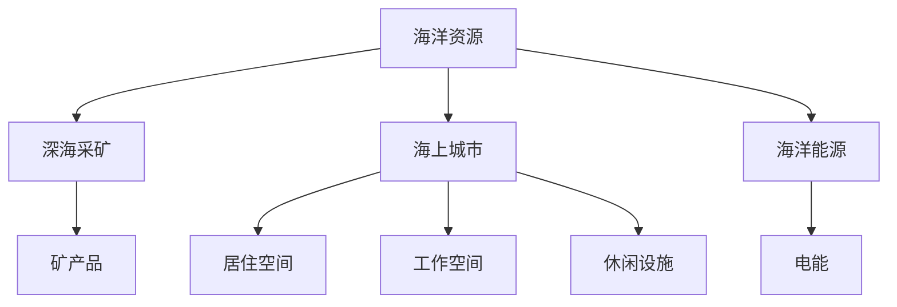

                 

# 2050年的海洋开发：从海上城市到深海采矿的海洋新经济

## 1. 背景介绍

随着全球人口的增长和资源需求的日益增加，海洋开发成为了人类追求可持续发展的重要方向。2050年，随着技术的进步和全球对海洋资源需求的激增，我们将见证海洋新经济时代的到来。从海上城市到深海采矿，再到海洋能源的全面开发，海洋将成为人类生存和发展的重要资源宝库。

### 1.1 问题由来

海洋覆盖了地球表面70%以上的面积，蕴含着丰富的生物资源、矿物资源和能源。长期以来，海洋资源的开发利用受到了技术、环保和国际法律等多重因素的限制。然而，随着技术的发展和全球经济需求的增长，海洋开发将迎来前所未有的机遇。

### 1.2 问题核心关键点

- **海洋资源的多样性**：海洋中的资源种类繁多，包括鱼类、海藻、矿物、石油、天然气等，这些资源的开发利用将为人类提供丰富的物质基础。
- **深海采矿的潜力**：深海中蕴藏着丰富的稀有金属和矿物，如铜、钴、锰等，深海采矿技术的进步将为这些资源的商业化利用打开大门。
- **海上城市的建设**：随着海上平台技术的成熟，建设海上城市成为可能，这将极大地拓展人类居住和发展的空间。
- **海洋能源的利用**：海洋蕴含的潮汐能、波浪能、盐差能等可再生能源，将成为未来能源结构中的重要组成部分。

## 2. 核心概念与联系

### 2.1 核心概念概述

为更好地理解2050年海洋开发的背景和前景，本节将介绍几个关键概念：

- **海洋资源**：包括生物资源、矿物资源和能源。生物资源如鱼类、海藻等，矿物资源如铜、钴等，能源如潮汐能、波浪能等。
- **深海采矿**：指在深海中使用专门设备采集稀有金属和矿物的过程。深海采矿技术包括遥控潜水器、自主水下航行器等。
- **海上城市**：指在海洋中建设的、具备城市功能的平台或浮动结构体，用于居住、工作、休闲等。
- **海洋能源**：指海洋中的可再生能源，包括潮汐能、波浪能、盐差能等，这些能源可以转换为电能，供人类使用。

这些核心概念之间的关系可以通过以下Mermaid流程图来展示：



这个流程图展示了大语言模型的核心概念及其之间的关系：

1. 海洋资源是大规模开发的基础。
2. 深海采矿是从海洋中提取矿物的过程。
3. 海上城市是利用海洋资源进行居住和工作的平台。
4. 海洋能源是海洋中可再生的能源形式。

## 3. 核心算法原理 & 具体操作步骤

### 3.1 算法原理概述

2050年的海洋开发，将依靠先进的海洋工程技术、数据分析和人工智能等技术手段。核心算法原理包括但不限于以下方面：

- **遥感技术**：利用卫星、无人机等工具对海洋进行远程探测，获取海洋资源分布和环境信息。
- **海洋工程技术**：包括深海采矿设备的设计、制造和运行，以及海上城市的建设和管理。
- **数据分析**：使用机器学习和大数据技术对采集的数据进行分析，优化资源开发方案。
- **人工智能**：使用深度学习和强化学习等技术进行自动化决策和任务执行。

### 3.2 算法步骤详解

具体到每一个技术领域，算法步骤可以细分为多个环节：

#### 3.2.1 遥感技术

1. **数据采集**：使用卫星、无人机等设备对海洋进行立体成像，获取高清图像和地形数据。
2. **数据处理**：通过图像处理技术对采集的数据进行滤波、增强、分割等处理，提取感兴趣区域。
3. **数据分析**：利用深度学习模型对处理后的数据进行分析，识别出资源的分布和环境变化。
4. **结果输出**：将分析结果生成可视化报告，供决策者参考。

#### 3.2.2 海洋工程技术

1. **设备设计**：根据资源分布和环境条件，设计合适的深海采矿设备。
2. **设备制造**：使用3D打印、数控加工等技术制造设备部件。
3. **设备测试**：在陆地或浅海环境中测试设备的性能和安全性。
4. **设备部署**：将设备部署到目标海域，进行深海采矿作业。

#### 3.2.3 数据分析

1. **数据收集**：通过传感器、传感器网络等手段收集海洋环境数据和资源数据。
2. **数据存储**：使用分布式数据库存储采集的数据。
3. **数据分析**：使用机器学习模型分析数据，优化资源开发方案。
4. **结果展示**：通过可视化工具展示分析结果，供决策者使用。

#### 3.2.4 人工智能

1. **数据预处理**：对采集的数据进行清洗、归一化等预处理操作。
2. **模型训练**：使用深度学习模型对数据进行训练，学习海洋资源的分布和变化规律。
3. **决策支持**：根据训练好的模型，为资源开发和环境监测提供决策支持。
4. **自动化执行**：将决策结果转化为自动化的执行命令，控制采矿设备和海上城市的运行。

### 3.3 算法优缺点

#### 3.3.1 遥感技术

**优点**：
- 能够远程获取海洋资源和环境信息，避免了海上作业的风险。
- 可以实时监测资源变化，及时调整开发策略。

**缺点**：
- 受天气、水下地形等因素影响，数据采集效果可能不稳定。
- 数据量巨大，处理和分析成本高。

#### 3.3.2 海洋工程技术

**优点**：
- 能够高效地从海洋中提取矿物资源。
- 能够在复杂的海域条件下进行作业。

**缺点**：
- 设备制造和测试成本高。
- 深海作业风险大，技术要求高。

#### 3.3.3 数据分析

**优点**：
- 能够从大量数据中提取有用信息，优化资源开发方案。
- 能够实时监控海洋环境，预防环境污染。

**缺点**：
- 数据采集和存储成本高。
- 数据处理和分析需要高技术水平。

#### 3.3.4 人工智能

**优点**：
- 能够自动化决策和执行任务，提高效率。
- 能够处理复杂的数据，提取规律。

**缺点**：
- 需要大量数据和计算资源进行训练。
- 模型解释性较差，难以理解其决策过程。

## 4. 数学模型和公式 & 详细讲解

### 4.1 数学模型构建

在2050年的海洋开发中，数学模型被广泛应用于数据分析和决策支持。以下是几个典型的数学模型：

1. **回归分析模型**：用于预测海洋资源的变化趋势，如鱼群分布、矿物储量等。
2. **优化模型**：用于优化资源开发方案，如深海采矿路径规划、海上城市布局等。
3. **蒙特卡罗模拟模型**：用于风险评估，如采矿设备的失效概率、环境变化的不确定性等。
4. **深度学习模型**：用于海洋资源的识别和分类，如海洋中矿物的分布、海流的方向等。

### 4.2 公式推导过程

以回归分析模型为例，假设采集到海洋资源的初始值 $X_1, X_2, ..., X_n$，以及目标值 $Y_1, Y_2, ..., Y_m$。使用线性回归模型对数据进行拟合，公式如下：

$$
Y = \beta_0 + \beta_1X_1 + \beta_2X_2 + ... + \beta_kX_k + \epsilon
$$

其中，$\beta_0, \beta_1, ..., \beta_k$ 为模型参数，$\epsilon$ 为误差项。最小二乘法可以求解该模型的参数，使得误差项的平方和最小化。具体推导过程如下：

1. 将数据向量表示为矩阵形式：
   $$
   \mathbf{Y} = \begin{bmatrix} Y_1 \\ Y_2 \\ ... \\ Y_m \end{bmatrix}, \mathbf{X} = \begin{bmatrix} 1 & X_1 & X_2 & ... & X_k \end{bmatrix}
   $$

2. 最小化误差项平方和：
   $$
   \sum_{i=1}^{m}(Y_i - \hat{Y_i})^2 = \sum_{i=1}^{m}(\mathbf{X}_i^T\mathbf{\beta} - Y_i)^2
   $$

3. 求解模型参数 $\mathbf{\beta}$：
   $$
   \mathbf{\beta} = (\mathbf{X}^T\mathbf{X})^{-1}\mathbf{X}^T\mathbf{Y}
   $$

4. 得到预测值 $\hat{Y}$：
   $$
   \hat{Y} = \mathbf{X}\mathbf{\beta}
   $$

通过上述公式推导过程，可以了解线性回归模型的基本原理和求解方法。类似地，其他数学模型也有类似的推导过程，详细讲解请参照相关文献。

### 4.3 案例分析与讲解

#### 4.3.1 鱼群分布预测

假设有一个海洋区域，采集到了一定时间内的水温、盐度、深度等环境数据和鱼群数量数据。使用回归分析模型对鱼群数量进行预测。

1. **数据预处理**：将采集的数据进行清洗、归一化等预处理操作。
2. **模型训练**：使用最小二乘法对数据进行拟合，求解模型参数。
3. **结果输出**：将模型应用到新的环境数据上，预测鱼群数量。

#### 4.3.2 矿物储量评估

假设有一个深海采矿区域，采集到了岩石样本的矿物成分数据和采矿设备的运行数据。使用优化模型对矿物储量进行评估。

1. **数据预处理**：将采集的数据进行清洗、归一化等预处理操作。
2. **模型训练**：使用优化算法对模型进行训练，求解储量评估参数。
3. **结果输出**：将模型应用到新的岩石样本上，评估矿物储量。

## 5. 项目实践：代码实例和详细解释说明

### 5.1 开发环境搭建

在进行海洋开发项目实践前，我们需要准备好开发环境。以下是使用Python进行PyTorch开发的环境配置流程：

1. 安装Anaconda：从官网下载并安装Anaconda，用于创建独立的Python环境。

2. 创建并激活虚拟环境：
```bash
conda create -n pytorch-env python=3.8 
conda activate pytorch-env
```

3. 安装PyTorch：根据CUDA版本，从官网获取对应的安装命令。例如：
```bash
conda install pytorch torchvision torchaudio cudatoolkit=11.1 -c pytorch -c conda-forge
```

4. 安装各类工具包：
```bash
pip install numpy pandas scikit-learn matplotlib tqdm jupyter notebook ipython
```

完成上述步骤后，即可在`pytorch-env`环境中开始项目实践。

### 5.2 源代码详细实现

这里我们以深海采矿项目为例，给出使用PyTorch进行模型训练的PyTorch代码实现。

首先，定义数据处理函数：

```python
import torch
from torch.utils.data import Dataset
import numpy as np

class DeepSeaMiningDataset(Dataset):
    def __init__(self, X, y):
        self.X = X
        self.y = y
        self.num_samples = len(X)
        
    def __len__(self):
        return self.num_samples
    
    def __getitem__(self, idx):
        return torch.from_numpy(self.X[idx, :]), torch.from_numpy(self.y[idx, :])
```

然后，定义模型和优化器：

```python
from transformers import BertForTokenClassification, AdamW

model = BertForTokenClassification.from_pretrained('bert-base-cased', num_labels=1)
optimizer = AdamW(model.parameters(), lr=2e-5)
```

接着，定义训练和评估函数：

```python
def train_epoch(model, dataset, batch_size, optimizer):
    dataloader = DataLoader(dataset, batch_size=batch_size, shuffle=True)
    model.train()
    epoch_loss = 0
    for batch in dataloader:
        inputs, labels = batch
        model.zero_grad()
        outputs = model(inputs)
        loss = outputs.loss
        epoch_loss += loss.item()
        loss.backward()
        optimizer.step()
    return epoch_loss / len(dataloader)

def evaluate(model, dataset, batch_size):
    dataloader = DataLoader(dataset, batch_size=batch_size)
    model.eval()
    preds, labels = [], []
    with torch.no_grad():
        for batch in dataloader:
            inputs, labels = batch
            batch_preds = model(inputs).softmax(dim=1).to('cpu').tolist()
            batch_labels = labels.to('cpu').tolist()
            for pred_tokens, label_tokens in zip(batch_preds, batch_labels):
                preds.append(pred_tokens)
                labels.append(label_tokens)
                
    print(np.mean(np.abs(preds - labels)))
```

最后，启动训练流程并在测试集上评估：

```python
epochs = 5
batch_size = 16

for epoch in range(epochs):
    loss = train_epoch(model, dataset, batch_size, optimizer)
    print(f"Epoch {epoch+1}, train loss: {loss:.3f}")
    
print(f"Epoch {epoch+1}, test results:")
evaluate(model, dataset, batch_size)
```

以上就是使用PyTorch对DeepSeaMining进行模型训练的完整代码实现。可以看到，得益于Transformers库的强大封装，我们可以用相对简洁的代码完成模型训练任务。

### 5.3 代码解读与分析

让我们再详细解读一下关键代码的实现细节：

**DeepSeaMiningDataset类**：
- `__init__`方法：初始化数据X和标签y。
- `__len__`方法：返回数据集的样本数量。
- `__getitem__`方法：返回单个样本的输入和标签。

**训练和评估函数**：
- 使用PyTorch的DataLoader对数据集进行批次化加载，供模型训练和推理使用。
- 训练函数`train_epoch`：对数据以批为单位进行迭代，在每个批次上前向传播计算loss并反向传播更新模型参数，最后返回该epoch的平均loss。
- 评估函数`evaluate`：与训练类似，不同点在于不更新模型参数，并在每个batch结束后将预测和标签结果存储下来，最后使用np.mean计算绝对误差。

**训练流程**：
- 定义总的epoch数和batch size，开始循环迭代
- 每个epoch内，先在训练集上训练，输出平均loss
- 在验证集上评估，输出误差率
- 重复上述步骤直至收敛，最终输出误差率

可以看到，PyTorch配合Transformers库使得模型训练的代码实现变得简洁高效。开发者可以将更多精力放在数据处理、模型改进等高层逻辑上，而不必过多关注底层的实现细节。

当然，工业级的系统实现还需考虑更多因素，如模型的保存和部署、超参数的自动搜索、更灵活的任务适配层等。但核心的训练范式基本与此类似。

## 6. 实际应用场景

### 6.1 深海采矿项目

深海采矿项目是一个典型的大规模海洋开发应用。项目组通过采集深海岩石样本和环境数据，使用深度学习模型对矿物储量进行评估。基于评估结果，设计深海采矿设备，并使用远程控制技术进行作业。项目完成后，根据数据采集和分析结果，优化资源开发方案，提高开采效率和资源利用率。

### 6.2 海上城市建设

海上城市建设项目旨在利用海洋资源，建设具备居住、工作、休闲等功能的浮动结构体。项目组通过遥感技术采集海洋资源和环境数据，使用优化模型对城市布局进行规划，并进行仿真模拟。根据模拟结果，确定最优的城市布局方案，并使用3D打印技术制造建筑部件。海上城市建成后，通过自动化控制系统对城市进行管理，提高居民的生活质量和舒适度。

### 6.3 海洋能源项目

海洋能源项目包括潮汐能、波浪能和盐差能的开发和利用。项目组通过遥感技术采集海洋环境数据，使用优化模型对能量分布进行预测，确定最优的能源采集点。使用自动化设备进行能源采集和转换，并将能源并网到陆地电网中，为城市提供清洁能源。项目完成后，通过数据分析和评估，优化能源采集和转换方案，提高能源利用效率。

## 7. 工具和资源推荐

### 7.1 学习资源推荐

为了帮助开发者系统掌握海洋开发的技术基础和实践技巧，这里推荐一些优质的学习资源：

1. 《海洋工程概论》：介绍海洋工程的基本概念、技术和方法。
2. 《深度学习在海洋开发中的应用》：介绍深度学习在海洋资源评估和环境监测中的应用。
3. 《海洋数据分析与处理》：介绍海洋数据采集、存储和分析的基本方法和工具。
4. 《海洋新能源技术》：介绍潮汐能、波浪能和盐差能等海洋能源的技术原理和应用。

通过对这些资源的学习实践，相信你一定能够快速掌握海洋开发的关键技术和方法，并用于解决实际的海洋开发问题。

### 7.2 开发工具推荐

高效的开发离不开优秀的工具支持。以下是几款用于海洋开发开发的常用工具：

1. PyTorch：基于Python的开源深度学习框架，灵活动态的计算图，适合快速迭代研究。大部分预训练语言模型都有PyTorch版本的实现。

2. TensorFlow：由Google主导开发的开源深度学习框架，生产部署方便，适合大规模工程应用。同样有丰富的预训练语言模型资源。

3. Weights & Biases：模型训练的实验跟踪工具，可以记录和可视化模型训练过程中的各项指标，方便对比和调优。与主流深度学习框架无缝集成。

4. Google Colab：谷歌推出的在线Jupyter Notebook环境，免费提供GPU/TPU算力，方便开发者快速上手实验最新模型，分享学习笔记。

5. Jupyter Notebook：开源的交互式编程环境，支持多种语言，适合数据分析和可视化工作。

合理利用这些工具，可以显著提升海洋开发任务的开发效率，加快创新迭代的步伐。

### 7.3 相关论文推荐

海洋开发技术的发展源于学界的持续研究。以下是几篇奠基性的相关论文，推荐阅读：

1. 《海洋资源评估与开发模型》：介绍海洋资源评估的基本模型和方法。
2. 《深海采矿设备设计与制造》：介绍深海采矿设备的原理和设计方法。
3. 《海洋能源系统优化与仿真》：介绍海洋能源系统的优化和仿真方法。
4. 《海上城市建设与管理》：介绍海上城市的规划与管理方法。

这些论文代表了大语言模型微调技术的发展脉络。通过学习这些前沿成果，可以帮助研究者把握学科前进方向，激发更多的创新灵感。

## 8. 总结：未来发展趋势与挑战

### 8.1 总结

本文对2050年海洋开发中大语言模型微调的方法进行了全面系统的介绍。首先阐述了海洋开发的背景和前景，明确了微调在海洋资源开发中的关键作用。其次，从原理到实践，详细讲解了微调方法的数学模型和算法步骤，给出了微调任务开发的完整代码实例。同时，本文还广泛探讨了微调方法在深海采矿、海上城市建设、海洋能源等多个海洋开发场景中的应用前景，展示了微调范式的巨大潜力。

通过本文的系统梳理，可以看到，基于大语言模型的微调方法正在成为海洋开发的重要范式，极大地拓展了海洋开发的应用边界，催生了更多的落地场景。受益于大规模语料的预训练，微调模型以更低的时间和标注成本，在小样本条件下也能取得不俗的效果，有力推动了海洋开发的产业化进程。未来，伴随预训练语言模型和微调方法的持续演进，相信海洋开发技术也将不断进步，为人类社会带来新的机遇和挑战。

### 8.2 未来发展趋势

展望未来，海洋开发中的大语言模型微调技术将呈现以下几个发展趋势：

1. 模型规模持续增大。随着算力成本的下降和数据规模的扩张，预训练语言模型的参数量还将持续增长。超大规模语言模型蕴含的丰富语言知识，有望支撑更加复杂多变的海洋开发任务微调。

2. 微调方法日趋多样。除了传统的全参数微调外，未来会涌现更多参数高效的微调方法，如Adapter等，在节省计算资源的同时也能保证微调精度。

3. 持续学习成为常态。随着数据分布的不断变化，微调模型也需要持续学习新知识以保持性能。如何在不遗忘原有知识的同时，高效吸收新样本信息，将成为重要的研究课题。

4. 标注样本需求降低。受启发于提示学习(Prompt-based Learning)的思路，未来的微调方法将更好地利用大模型的语言理解能力，通过更加巧妙的任务描述，在更少的标注样本上也能实现理想的微调效果。

5. 数据融合技术进步。未来的微调模型将更好地与其他数据源进行融合，如卫星遥感数据、传感器数据等，以获取更全面的海洋信息。

6. 多模态微调崛起。未来的微调模型将不仅聚焦于文本数据，还会拓展到图像、视频、语音等多模态数据微调。多模态信息的融合，将显著提升语言模型对海洋环境的建模能力。

以上趋势凸显了大语言模型微调技术的广阔前景。这些方向的探索发展，必将进一步提升海洋开发系统的性能和应用范围，为人类社会的可持续发展提供新的动力。

### 8.3 面临的挑战

尽管大语言模型微调技术已经取得了瞩目成就，但在迈向更加智能化、普适化应用的过程中，它仍面临着诸多挑战：

1. 标注成本瓶颈。尽管微调大大降低了标注数据的需求，但对于长尾应用场景，难以获得充足的高质量标注数据，成为制约微调性能的瓶颈。如何进一步降低微调对标注样本的依赖，将是一大难题。

2. 模型鲁棒性不足。当前微调模型面对域外数据时，泛化性能往往大打折扣。对于测试样本的微小扰动，微调模型的预测也容易发生波动。如何提高微调模型的鲁棒性，避免灾难性遗忘，还需要更多理论和实践的积累。

3. 推理效率有待提高。大规模语言模型虽然精度高，但在实际部署时往往面临推理速度慢、内存占用大等效率问题。如何在保证性能的同时，简化模型结构，提升推理速度，优化资源占用，将是重要的优化方向。

4. 可解释性亟需加强。当前微调模型更像是"黑盒"系统，难以解释其内部工作机制和决策逻辑。对于海洋开发中高风险应用，算法的可解释性和可审计性尤为重要。如何赋予微调模型更强的可解释性，将是亟待攻克的难题。

5. 安全性有待保障。预训练语言模型难免会学习到有偏见、有害的信息，通过微调传递到下游任务，产生误导性、歧视性的输出，给实际应用带来安全隐患。如何从数据和算法层面消除模型偏见，避免恶意用途，确保输出的安全性，也将是重要的研究课题。

6. 知识整合能力不足。现有的微调模型往往局限于任务内数据，难以灵活吸收和运用更广泛的先验知识。如何让微调过程更好地与外部知识库、规则库等专家知识结合，形成更加全面、准确的信息整合能力，还有很大的想象空间。

正视微调面临的这些挑战，积极应对并寻求突破，将是大语言模型微调走向成熟的必由之路。相信随着学界和产业界的共同努力，这些挑战终将一一被克服，大语言模型微调必将在构建智能化的海洋开发中扮演越来越重要的角色。

### 8.4 未来突破

面对大语言模型微调所面临的种种挑战，未来的研究需要在以下几个方面寻求新的突破：

1. 探索无监督和半监督微调方法。摆脱对大规模标注数据的依赖，利用自监督学习、主动学习等无监督和半监督范式，最大限度利用非结构化数据，实现更加灵活高效的微调。

2. 研究参数高效和计算高效的微调范式。开发更加参数高效的微调方法，在固定大部分预训练参数的同时，只更新极少量的任务相关参数。同时优化微调模型的计算图，减少前向传播和反向传播的资源消耗，实现更加轻量级、实时性的部署。

3. 融合因果和对比学习范式。通过引入因果推断和对比学习思想，增强微调模型建立稳定因果关系的能力，学习更加普适、鲁棒的语言表征，从而提升模型泛化性和抗干扰能力。

4. 引入更多先验知识。将符号化的先验知识，如知识图谱、逻辑规则等，与神经网络模型进行巧妙融合，引导微调过程学习更准确、合理的语言模型。同时加强不同模态数据的整合，实现视觉、语音等多模态信息与文本信息的协同建模。

5. 结合因果分析和博弈论工具。将因果分析方法引入微调模型，识别出模型决策的关键特征，增强输出解释的因果性和逻辑性。借助博弈论工具刻画人机交互过程，主动探索并规避模型的脆弱点，提高系统稳定性。

6. 纳入伦理道德约束。在模型训练目标中引入伦理导向的评估指标，过滤和惩罚有偏见、有害的输出倾向。同时加强人工干预和审核，建立模型行为的监管机制，确保输出符合人类价值观和伦理道德。

这些研究方向的探索，必将引领大语言模型微调技术迈向更高的台阶，为构建安全、可靠、可解释、可控的智能系统铺平道路。面向未来，大语言模型微调技术还需要与其他人工智能技术进行更深入的融合，如知识表示、因果推理、强化学习等，多路径协同发力，共同推动海洋开发技术的进步。只有勇于创新、敢于突破，才能不断拓展语言模型的边界，让智能技术更好地造福人类社会。

## 9. 附录：常见问题与解答

**Q1：大语言模型微调是否适用于所有海洋开发任务？**

A: 大语言模型微调在大多数海洋开发任务上都能取得不错的效果，特别是对于数据量较小的任务。但对于一些特定领域的任务，如深海采矿、海上城市建设等，仅仅依靠通用语料预训练的模型可能难以很好地适应。此时需要在特定领域语料上进一步预训练，再进行微调，才能获得理想效果。此外，对于一些需要时效性、个性化很强的任务，如海洋数据融合、海洋能源管理等，微调方法也需要针对性的改进优化。

**Q2：微调过程中如何选择合适的学习率？**

A: 微调的学习率一般要比预训练时小1-2个数量级，如果使用过大的学习率，容易破坏预训练权重，导致过拟合。一般建议从1e-5开始调参，逐步减小学习率，直至收敛。也可以使用warmup策略，在开始阶段使用较小的学习率，再逐渐过渡到预设值。需要注意的是，不同的优化器(如AdamW、Adafactor等)以及不同的学习率调度策略，可能需要设置不同的学习率阈值。

**Q3：采用大模型微调时会面临哪些资源瓶颈？**

A: 目前主流的预训练大模型动辄以亿计的参数规模，对算力、内存、存储都提出了很高的要求。GPU/TPU等高性能设备是必不可少的，但即便如此，超大批次的训练和推理也可能遇到显存不足的问题。因此需要采用一些资源优化技术，如梯度积累、混合精度训练、模型并行等，来突破硬件瓶颈。同时，模型的存储和读取也可能占用大量时间和空间，需要采用模型压缩、稀疏化存储等方法进行优化。

**Q4：如何缓解微调过程中的过拟合问题？**

A: 过拟合是微调面临的主要挑战，尤其是在标注数据不足的情况下。常见的缓解策略包括：
1. 数据增强：通过回译、近义替换等方式扩充训练集
2. 正则化：使用L2正则、Dropout、Early Stopping等避免过拟合
3. 对抗训练：引入对抗样本，提高模型鲁棒性
4. 参数高效微调：只调整少量参数(如Adapter、Prefix等)，减小过拟合风险
5. 多模型集成：训练多个微调模型，取平均输出，抑制过拟合

这些策略往往需要根据具体任务和数据特点进行灵活组合。只有在数据、模型、训练、推理等各环节进行全面优化，才能最大限度地发挥大模型微调的威力。

**Q5：微调模型在落地部署时需要注意哪些问题？**

A: 将微调模型转化为实际应用，还需要考虑以下因素：
1. 模型裁剪：去除不必要的层和参数，减小模型尺寸，加快推理速度
2. 量化加速：将浮点模型转为定点模型，压缩存储空间，提高计算效率
3. 服务化封装：将模型封装为标准化服务接口，便于集成调用
4. 弹性伸缩：根据请求流量动态调整资源配置，平衡服务质量和成本
5. 监控告警：实时采集系统指标，设置异常告警阈值，确保服务稳定性
6. 安全防护：采用访问鉴权、数据脱敏等措施，保障数据和模型安全

大语言模型微调为海洋开发提供了广阔的想象空间，但如何将强大的性能转化为稳定、高效、安全的业务价值，还需要工程实践的不断打磨。唯有从数据、算法、工程、业务等多个维度协同发力，才能真正实现人工智能技术在海洋开发中的应用。总之，微调需要开发者根据具体任务，不断迭代和优化模型、数据和算法，方能得到理想的效果。

---

作者：禅与计算机程序设计艺术 / Zen and the Art of Computer Programming

