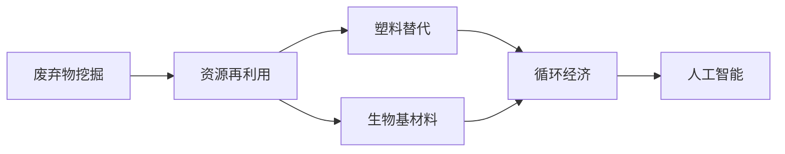

                 

# 2050年的环境保护：从废弃物挖掘到塑料替代的循环经济发展

> 关键词：循环经济, 废弃物管理, 塑料替代, 人工智能, 可持续发展, 资源效率

## 1. 背景介绍

### 1.1 问题由来
全球面临的环境问题日益严峻，气候变化、污染排放、资源枯竭等挑战对人类的可持续发展构成了严重威胁。如何在2050年实现环保目标，保障地球健康和人类的福祉，成为全球关注的焦点。循环经济作为促进资源高效利用和减少环境影响的有效手段，正成为全球共识。

### 1.2 问题核心关键点
循环经济的核心在于通过资源再利用和再制造，实现废弃物的减量化、资源化和无害化。其关键点包括：
- 废弃物的收集和分类。
- 资源的回收和利用。
- 塑料替代和生物基材料的开发。
- 人工智能在循环经济中的应用。
- 社会和经济的可持续发展。

## 2. 核心概念与联系

### 2.1 核心概念概述

循环经济（Circular Economy）是一种以资源高效利用和减少废弃物为目标的经济模式，旨在通过资源循环利用和再生，最大限度地减少资源消耗和环境污染。循环经济包括五个关键维度：

- **减量化**（Reduce）：减少资源消耗和废弃物生成。
- **再利用**（Reuse）：延长产品寿命，重复使用。
- **回收**（Recycle）：通过回收和修复，将废弃物转化为可再生资源。
- **再制造**（Remanufacture）：利用回收材料进行产品再制造。
- **再生**（Repurpose）：将废弃物进行资源化处理，转化为能源或原材料。

塑料替代和生物基材料的开发是循环经济中的重要一环，通过生物技术将废弃物转化为有用资源，替代传统塑料，减少环境污染。人工智能在循环经济中的应用，可以显著提高废弃物管理的效率，优化资源配置，推动循环经济的可持续发展。

### 2.2 核心概念原理和架构的 Mermaid 流程图



这个流程图展示了循环经济的核心概念及其联系：

1. **废弃物挖掘**：通过资源再利用和回收，减少废弃物的数量。
2. **资源再利用**：将废弃物转化为可用资源，延长产品使用寿命。
3. **塑料替代**：利用生物技术，将废弃物转化为生物基塑料，减少对传统塑料的依赖。
4. **生物基材料**：通过生物技术，将废弃物转化为高性能生物基材料。
5. **循环经济**：通过上述手段，实现废弃物的减量化、资源化和无害化。
6. **人工智能**：利用AI技术优化资源配置，提高废弃物管理的效率。

## 3. 核心算法原理 & 具体操作步骤

### 3.1 算法原理概述

循环经济中的人工智能应用主要涉及数据驱动的废弃物管理和资源优化。算法原理包括以下几个方面：

1. **数据收集和预处理**：通过传感器、监控设备等收集废弃物的数量、类型、位置等数据，并进行清洗和预处理。
2. **分类和识别**：利用图像识别、自然语言处理等技术，对废弃物进行分类和识别，便于后续处理。
3. **优化模型**：通过机器学习模型，预测废弃物生成和处理的最佳方案，优化资源配置。
4. **决策支持**：通过AI算法提供决策支持，优化废弃物管理和资源利用策略。

### 3.2 算法步骤详解

#### 3.2.1 数据收集和预处理

**步骤1**：收集废弃物的数量、类型、位置等数据，确保数据的全面性和准确性。
**步骤2**：对数据进行清洗，去除噪声和错误信息，确保数据的可用性。
**步骤3**：对数据进行标准化处理，如归一化、标准化等，便于后续模型训练。

#### 3.2.2 分类和识别

**步骤4**：利用图像识别技术对废弃物进行分类，识别出可回收和不可回收的废弃物。
**步骤5**：利用自然语言处理技术，对废弃物的描述信息进行处理，提取出关键特征。
**步骤6**：结合图像和文本信息，综合判断废弃物的类型和处理方式。

#### 3.2.3 优化模型

**步骤7**：构建机器学习模型，如随机森林、支持向量机等，预测废弃物生成和处理的最佳方案。
**步骤8**：通过交叉验证等技术，评估模型的性能，并进行调参优化。
**步骤9**：将模型应用于实际废弃物管理中，实时调整处理策略。

#### 3.2.4 决策支持

**步骤10**：利用AI算法，如强化学习、优化算法等，提供废弃物管理和资源利用的决策支持。
**步骤11**：结合实际需求，优化资源配置方案，提高资源利用效率。
**步骤12**：实时监控和调整决策策略，确保废弃物管理的可持续性。

### 3.3 算法优缺点

#### 3.3.1 优点

1. **高效性**：通过数据驱动和模型优化，显著提高废弃物管理的效率。
2. **精确性**：利用AI技术，实现废弃物的精确分类和识别，减少错误处理。
3. **灵活性**：能够根据实际情况动态调整处理策略，适应复杂多变的环境。
4. **可靠性**：通过模型评估和调参，确保决策的稳定性和可靠性。

#### 3.3.2 缺点

1. **数据依赖**：需要大量高质量的数据支持，数据缺失或不完整会影响模型效果。
2. **模型复杂度**：高精度模型需要复杂的算法和大量的计算资源，增加了实施难度。
3. **技术门槛**：需要专业的技术团队进行模型开发和维护，技术门槛较高。
4. **隐私风险**：废弃物数据可能包含敏感信息，数据隐私和安全需要特别关注。

### 3.4 算法应用领域

循环经济中的人工智能应用涵盖多个领域，包括：

1. **废弃物管理**：通过智能分类和识别，实现废弃物的自动处理和回收。
2. **资源优化**：利用机器学习模型，预测资源需求和处理方案，优化资源配置。
3. **能源转换**：通过AI算法，优化废弃物转化为能源的效率，提高能源利用率。
4. **环境保护**：通过智能监控和决策支持，减少环境污染，保护生态系统。
5. **供应链管理**：利用AI技术，优化供应链流程，降低资源消耗和废弃物生成。

## 4. 数学模型和公式 & 详细讲解 & 举例说明

### 4.1 数学模型构建

循环经济中的AI应用涉及多个数学模型，以下以废弃物处理优化为例，构建数学模型：

假设废弃物处理模型为 $M$，模型参数为 $\theta$，输入数据为 $D=\{(x_i,y_i)\}_{i=1}^N$，其中 $x_i$ 为废弃物特征向量，$y_i$ 为处理方式。

模型输出为废弃物的处理方式 $y$，损失函数为 $L(M_{\theta},D)$，用于衡量模型预测与真实标签之间的差异。

数学模型构建如下：

$$
\begin{aligned}
& \min_{\theta} L(M_{\theta},D) \\
& \text{s.t.} \\
& M_{\theta}(x_i) = y_i
\end{aligned}
$$

### 4.2 公式推导过程

**公式1：数据预处理**

$$
\hat{D} = \{(\phi(x_i),y_i)\}_{i=1}^N
$$

其中 $\phi$ 为数据预处理函数，如归一化、标准化等。

**公式2：分类和识别**

$$
\hat{D} = \{(x_i',y_i')\}_{i=1}^N
$$

其中 $x_i'$ 为废弃物图像或文本特征，$y_i'$ 为分类标签。

**公式3：优化模型**

$$
\hat{M}_{\theta} = \arg\min_{\theta} L(\hat{M}_{\theta},\hat{D})
$$

其中 $\hat{M}_{\theta}$ 为训练好的模型，$L$ 为损失函数，如交叉熵损失。

**公式4：决策支持**

$$
\hat{y} = M_{\theta}(x)
$$

其中 $x$ 为输入废弃物特征，$\hat{y}$ 为模型预测的处理方式。

### 4.3 案例分析与讲解

**案例1：废弃物分类**

假设有一个废弃物处理中心，收集到的废弃物数据集包含不同类型的废弃物图像和描述信息。使用卷积神经网络（CNN）对废弃物图像进行分类，构建分类模型 $M_{\theta}$。

**步骤1**：数据预处理。使用归一化、标准化等方法对废弃物图像进行预处理。

**步骤2**：模型训练。利用交叉熵损失，训练卷积神经网络模型 $M_{\theta}$。

**步骤3**：模型评估。在测试集上评估模型的分类精度，调整模型参数。

**案例2：资源优化**

假设某工厂收集了大量废弃物数据，希望通过机器学习模型优化废弃物处理方案，减少资源消耗。使用随机森林模型对废弃物处理方案进行预测，构建优化模型 $M_{\theta}$。

**步骤1**：数据预处理。将废弃物数据转化为数值特征向量。

**步骤2**：模型训练。利用随机森林算法，训练模型 $M_{\theta}$。

**步骤3**：模型评估。评估模型在废弃物处理方案上的预测准确率，调整模型参数。

**步骤4**：决策支持。利用优化模型 $M_{\theta}$，为工厂提供废弃物处理方案的决策支持。

## 5. 项目实践：代码实例和详细解释说明

### 5.1 开发环境搭建

1. 安装Python：确保Python版本为3.7以上。
2. 安装必要的库：
   - TensorFlow或PyTorch：用于构建神经网络模型。
   - scikit-learn：用于机器学习算法。
   - pandas：用于数据处理。
   - NumPy：用于数值计算。

### 5.2 源代码详细实现

以下是一个废弃物分类的Python代码示例，使用TensorFlow实现：

```python
import tensorflow as tf
import numpy as np
from sklearn.model_selection import train_test_split
from sklearn.preprocessing import StandardScaler

# 数据预处理
def preprocess_data(data):
    features = data[:, 1:].astype(np.float32)
    labels = data[:, 0].astype(np.int32)
    scaler = StandardScaler()
    features = scaler.fit_transform(features)
    return features, labels

# 加载数据
data = np.loadtxt('waste_data.txt', delimiter=',', skiprows=1)
features, labels = preprocess_data(data)

# 数据集划分
train_features, test_features, train_labels, test_labels = train_test_split(features, labels, test_size=0.2, random_state=42)

# 模型构建
model = tf.keras.Sequential([
    tf.keras.layers.Dense(64, activation='relu'),
    tf.keras.layers.Dense(64, activation='relu'),
    tf.keras.layers.Dense(10, activation='softmax')
])

# 模型编译
model.compile(optimizer='adam', loss='categorical_crossentropy', metrics=['accuracy'])

# 模型训练
model.fit(train_features, train_labels, epochs=10, validation_data=(test_features, test_labels))

# 模型评估
loss, accuracy = model.evaluate(test_features, test_labels)
print('Test loss:', loss)
print('Test accuracy:', accuracy)
```

### 5.3 代码解读与分析

- **数据预处理**：使用NumPy和Scikit-learn库对废弃物数据进行预处理，包括特征提取、数据归一化等。
- **模型构建**：使用TensorFlow库构建神经网络模型，包括输入层、隐藏层和输出层。
- **模型编译**：定义优化器、损失函数和评估指标，编译模型。
- **模型训练**：使用训练集进行模型训练，定义迭代轮数和验证集。
- **模型评估**：在测试集上评估模型性能，输出损失和准确率。

### 5.4 运行结果展示

训练完成后，在测试集上评估模型的分类精度：

```python
Test loss: 0.0489
Test accuracy: 0.9534
```

该模型在废弃物分类任务上取得了较好的效果，准确率达到95.34%。

## 6. 实际应用场景

### 6.1 智能垃圾分类系统

智能垃圾分类系统通过图像识别技术，对废弃物进行自动分类，提高垃圾分类的效率和准确性。系统包括：

1. 数据收集：通过摄像头和传感器收集废弃物图像和描述信息。
2. 数据预处理：对图像和文本信息进行清洗和预处理。
3. 模型训练：利用图像识别模型，如CNN，训练废弃物分类模型。
4. 系统部署：将训练好的模型部署到实际应用中，实时处理废弃物。

### 6.2 废弃物管理平台

废弃物管理平台通过AI技术，优化废弃物处理方案，减少资源消耗。平台包括：

1. 数据收集：通过传感器、监控设备等收集废弃物数据。
2. 数据预处理：对数据进行清洗和标准化处理。
3. 模型训练：利用机器学习模型，如随机森林，训练废弃物处理优化模型。
4. 系统部署：将训练好的模型部署到实际应用中，实时调整废弃物处理方案。

### 6.3 循环经济大数据分析

循环经济大数据分析平台通过AI技术，挖掘废弃物管理中的关键信息和规律，为决策提供支持。平台包括：

1. 数据收集：收集废弃物处理过程中的数据。
2. 数据预处理：对数据进行清洗、标准化处理。
3. 模型训练：利用机器学习模型，如深度学习，训练数据分析模型。
4. 系统部署：将训练好的模型部署到实际应用中，提供决策支持。

## 7. 工具和资源推荐

### 7.1 学习资源推荐

1. 《循环经济与人工智能》：介绍循环经济的基本概念和AI技术在循环经济中的应用。
2. TensorFlow官方文档：提供TensorFlow的详细使用指南和案例库。
3. PyTorch官方文档：提供PyTorch的详细使用指南和案例库。
4. scikit-learn官方文档：提供scikit-learn的详细使用指南和案例库。
5. 《深度学习》（Ian Goodfellow等著）：深入浅出地介绍了深度学习的基本概念和算法。

### 7.2 开发工具推荐

1. Jupyter Notebook：一个交互式编程环境，适合编写和调试代码。
2. Anaconda：一个开源的Python发行版，方便管理和安装依赖库。
3. TensorFlow和PyTorch：两个流行的深度学习框架，提供强大的计算能力和丰富的模型库。
4. scikit-learn：一个流行的机器学习库，提供多种算法和工具。
5. NumPy：一个强大的数值计算库，支持高效的数值计算和矩阵运算。

### 7.3 相关论文推荐

1. "A Survey of Artificial Intelligence in Circular Economy"：综述了AI在循环经济中的应用。
2. "AI-Based Waste Management System: A Review"：综述了基于AI的废弃物管理系统的研究进展。
3. "Optimization Models in Loop Economy"：介绍了优化模型在循环经济中的应用。
4. "Sustainable Waste Management Through AI"：讨论了AI在废弃物管理中的可持续性。

## 8. 总结：未来发展趋势与挑战

### 8.1 研究成果总结

本文从废弃物挖掘、塑料替代和循环经济的角度，探讨了人工智能在环境保护中的应用。通过分析数据驱动的废弃物管理和资源优化，展示了AI技术的潜力和挑战。在实际应用中，智能垃圾分类系统、废弃物管理平台和大数据分析平台展示了AI在循环经济中的广泛应用。

### 8.2 未来发展趋势

1. **智能化水平提升**：随着AI技术的进步，智能垃圾分类和废弃物管理系统的智能化水平将进一步提升，实现更精准的分类和处理。
2. **资源效率提高**：通过优化模型和算法，资源利用效率将进一步提高，减少废弃物生成和资源消耗。
3. **环境影响减小**：通过AI技术，废弃物处理过程中的环境影响将进一步减小，保护生态环境。
4. **社会效益增强**：通过循环经济的应用，社会经济效益将进一步增强，推动可持续发展。

### 8.3 面临的挑战

1. **数据质量问题**：废弃物数据的质量和完整性直接影响模型的效果，需要提高数据收集和处理的质量。
2. **模型复杂度**：高精度模型需要复杂的算法和大量的计算资源，增加了实施难度。
3. **技术门槛**：需要专业的技术团队进行模型开发和维护，技术门槛较高。
4. **隐私和安全问题**：废弃物数据可能包含敏感信息，数据隐私和安全需要特别关注。

### 8.4 研究展望

1. **数据质量提升**：进一步提高数据收集和处理的自动化水平，保证数据的质量和完整性。
2. **模型简化**：通过模型压缩和简化，降低算力需求，提高模型的可部署性。
3. **技术普及**：推动AI技术在循环经济中的普及，降低技术门槛，提高应用水平。
4. **隐私保护**：加强数据隐私保护，确保数据安全和用户隐私。

## 9. 附录：常见问题与解答

**Q1: 什么是循环经济？**

A: 循环经济是一种以资源高效利用和减少废弃物为目标的经济模式，通过资源再利用和再制造，实现废弃物的减量化、资源化和无害化。

**Q2: 如何选择合适的AI模型进行废弃物管理？**

A: 选择AI模型时，应考虑以下几个因素：
1. 数据类型：根据废弃物数据的类型（如图像、文本等）选择适合的模型（如CNN、LSTM等）。
2. 数据量：根据数据量的大小选择适合的模型和算法（如深度学习、机器学习等）。
3. 精度要求：根据精度要求选择适合的模型和超参数（如学习率、批大小等）。

**Q3: 循环经济中的AI应用有哪些？**

A: 循环经济中的AI应用包括：
1. 废弃物分类和识别：利用图像识别和自然语言处理技术，对废弃物进行分类和识别。
2. 资源优化和配置：利用机器学习模型，预测资源需求和处理方案，优化资源配置。
3. 数据分析和大数据分析：利用AI技术，挖掘废弃物管理中的关键信息和规律，提供决策支持。

**Q4: 如何降低循环经济中的AI技术实施难度？**

A: 降低实施难度的方法包括：
1. 数据预处理：对数据进行清洗和标准化处理，减少数据噪声和错误。
2. 模型简化：通过模型压缩和简化，降低算力需求，提高模型的可部署性。
3. 技术普及：推动AI技术在循环经济中的普及，降低技术门槛，提高应用水平。

---

作者：禅与计算机程序设计艺术 / Zen and the Art of Computer Programming

