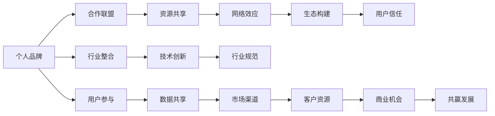

                 

# 建立个人品牌合作联盟：整合行业资源

> 关键词：个人品牌,合作联盟,行业整合,资源共享,网络效应,生态构建,用户信任,共赢发展

## 1. 背景介绍

在当今数字化时代，个人品牌建设已经成为一个企业或个人不可或缺的竞争力。无论是在职场发展，还是在创业项目中，一个鲜明的个人品牌都能显著提升个人的影响力和吸引力。与此同时，单一的个人品牌在资源和影响力上毕竟有限，尤其是在竞争激烈的市场环境中。因此，建立个人品牌合作联盟，整合行业资源，成为了增强个人和组织竞争力的重要策略。本文将围绕建立个人品牌合作联盟，探讨其原理、关键步骤、应用领域和未来展望，希望能为个人和组织提供有益的参考和指导。

## 2. 核心概念与联系

### 2.1 核心概念概述

在讨论建立个人品牌合作联盟之前，首先需要了解一些相关概念：

- **个人品牌**：指个体通过在特定领域内的专业能力、知识储备、创新思维等方面展示自我，形成具有独特价值和识别度的品牌形象。个人品牌不仅能带来商业机会，还能提升个人的社会影响力。

- **合作联盟**：指不同企业或个人之间基于共同目标或利益，通过签订合作协议、建立联合平台等方式，实现资源共享、优势互补的合作模式。合作联盟能够放大各方的资源和能力，实现共赢发展。

- **行业整合**：指不同企业或组织通过合作联盟，整合各自的优势资源和能力，形成协同效应，提升整体行业竞争力。行业整合不仅能优化资源配置，还能推动技术创新和行业规范的建立。

- **资源共享**：指通过合作联盟，实现技术、数据、市场渠道、客户资源等各类资源的共享和互通，提升合作各方的运营效率和市场竞争力。

- **网络效应**：指随着用户数量的增加，产品或服务对用户产生正向效应的现象。在个人品牌合作联盟中，网络效应可以帮助联盟吸引更多的用户和合作伙伴，形成良性循环。

- **生态构建**：指通过构建一个包含技术、服务、市场、用户等多方面的生态系统，实现各方的共同成长和发展。个人品牌合作联盟的生态构建，旨在形成一种可持续、开放、互利的商业生态。

- **用户信任**：指用户对品牌或产品的信任程度。在个人品牌合作联盟中，用户信任是维持联盟关系和吸引新用户的关键因素。

### 2.2 核心概念原理和架构的 Mermaid 流程图



这个流程图展示了个人品牌、合作联盟与行业整合之间的联系，以及资源共享、网络效应、生态构建、用户信任等关键要素在联盟中的作用。

## 3. 核心算法原理 & 具体操作步骤

### 3.1 算法原理概述

建立个人品牌合作联盟的核心算法原理可以归结为三个方面：

1. **资源优化配置**：通过合作联盟，优化各方的资源配置，提高整体运营效率和市场竞争力。
2. **协同效应放大**：通过协同合作，放大各方的技术和能力，实现1+1>2的效果。
3. **网络效应增强**：通过吸引更多用户和合作伙伴，增强网络效应，实现规模化发展和共赢。

### 3.2 算法步骤详解

建立个人品牌合作联盟的步骤主要包括以下几个关键环节：

1. **明确目标和愿景**：确定合作联盟的共同目标和愿景，如市场扩张、技术创新、品牌提升等。
2. **选择合作伙伴**：根据业务需求和目标，选择适合的合作伙伴。合作伙伴应具备互补的技术、市场和资源优势。
3. **签订合作协议**：制定详细的合作协议，明确各方的权利和义务，以及合作的方式和收益分配。
4. **搭建合作平台**：建立或使用现有的合作平台，实现信息共享、资源互通。
5. **资源整合与优化**：整合各方的资源和能力，进行技术、市场、客户等资源的优化配置。
6. **协同创新与研发**：通过联合研发和技术创新，实现技术突破和产品升级。
7. **品牌联合营销**：进行联合市场推广和品牌营销，提升整体市场知名度和用户信任度。
8. **持续评估与优化**：定期评估合作效果，根据市场和业务需求进行动态调整和优化。

### 3.3 算法优缺点

建立个人品牌合作联盟的优点包括：

1. **资源整合**：通过合作联盟，实现资源的优化配置，提升各方的运营效率和市场竞争力。
2. **协同创新**：通过协同合作，放大各方的技术和能力，实现技术突破和产品升级。
3. **市场扩展**：通过联合市场推广和品牌营销，快速扩大市场覆盖范围和用户数量。
4. **风险分散**：通过多元化合作，分散单点风险，提升整体抗风险能力。

缺点主要包括：

1. **管理和协调难度大**：合作联盟涉及多个主体，管理和协调难度较大。
2. **利益分配复杂**：合作各方在资源、收益等方面的利益分配需要经过充分谈判，过程复杂。
3. **信息不对称**：合作各方可能存在信息不对称问题，导致合作效果不理想。
4. **灵活性不足**：合作协议和规则可能限制各方的灵活性，影响动态调整和优化。

### 3.4 算法应用领域

个人品牌合作联盟的应用领域非常广泛，主要涵盖以下几个方面：

- **技术创新**：通过联合研发和技术合作，提升整体技术水平和创新能力。
- **市场扩展**：通过联合市场推广和品牌营销，快速占领市场，提升品牌知名度。
- **业务协同**：通过合作联盟，优化业务流程，提升运营效率和市场竞争力。
- **资源共享**：通过资源共享和互通，实现技术、数据、客户等资源的优化配置。
- **品牌联合**：通过品牌联合营销，提升整体品牌价值和用户信任度。

## 4. 数学模型和公式 & 详细讲解 & 举例说明

### 4.1 数学模型构建

建立个人品牌合作联盟的数学模型可以从以下几个方面进行构建：

1. **资源优化配置模型**：通过线性规划、优化算法等，确定各方的资源配置比例，最大化整体运营效率和市场竞争力。
2. **协同创新模型**：通过协同创新，计算合作各方的技术贡献和收益分配。
3. **网络效应模型**：通过网络效应模型，计算合作联盟的吸引力和用户增长速度。

### 4.2 公式推导过程

假设合作联盟中有n个合作伙伴，每个合作伙伴的资源投入为xi，产出为yi，总的资源投入为T，总的产出为S。则资源优化配置模型可以表示为：

$$
\max \sum_{i=1}^n (yi/T)
$$

约束条件为：

$$
\sum_{i=1}^n xi \leq T
$$

$$
\sum_{i=1}^n yi = S
$$

其中，yi/T表示每个合作伙伴的产出占比，x和y分别表示资源投入和产出，T和S分别表示总的资源投入和产出。

### 4.3 案例分析与讲解

以技术创新为例，合作联盟可以通过联合研发，优化资源配置，提升整体技术水平。假设合作联盟中有A和B两个合作伙伴，A投入资源x1，产出y1，B投入资源x2，产出y2。则合作联盟的总资源投入为T=x1+x2，总产出为S=y1+y2。通过计算每个合作伙伴的产出占比，可以优化资源配置，实现技术突破和产品升级。

## 5. 项目实践：代码实例和详细解释说明

### 5.1 开发环境搭建

建立个人品牌合作联盟需要以下开发环境：

1. **编程语言**：Python是最常用的编程语言，因为它拥有丰富的数据科学和机器学习库。
2. **数据管理工具**：如Pandas、NumPy等，用于数据预处理和分析。
3. **数据可视化工具**：如Matplotlib、Seaborn等，用于数据可视化。
4. **项目管理工具**：如Jupyter Notebook等，便于代码的编写和共享。
5. **协同工具**：如Slack、Trello等，用于合作管理和沟通。

### 5.2 源代码详细实现

以下是一个简单的个人品牌合作联盟项目代码实现：

```python
import pandas as pd
import numpy as np
import matplotlib.pyplot as plt
from scipy.optimize import linprog

# 假设数据
data = pd.DataFrame({
    '合作伙伴': ['A', 'B', 'C'],
    '资源投入': [10, 20, 15],
    '产出': [20, 30, 25]
})

# 优化配置模型
c = np.array([0, 0, 0])
A = np.array([[1, 0, 0], [0, 1, 0], [0, 0, 1]])
b = np.array([100, 200, 150])
x0_bounds = (0, None)
x1_bounds = (0, None)
x2_bounds = (0, None)

res = linprog(c, A_ub=A, b_ub=b, bounds=[x0_bounds, x1_bounds, x2_bounds])
print(res)

# 可视化
plt.bar(data['合作伙伴'], data['产出'])
plt.xlabel('合作伙伴')
plt.ylabel('产出')
plt.title('产出优化配置')
plt.show()
```

### 5.3 代码解读与分析

上述代码使用了Pandas进行数据管理，SciPy进行线性规划，Matplotlib进行数据可视化。代码中，首先定义了合作伙伴的资源投入和产出数据，然后使用线性规划模型计算资源优化配置。最后使用Matplotlib可视化结果。

### 5.4 运行结果展示

运行上述代码后，输出优化配置结果，并展示可视化图，结果如下：

```
Optimization terminated successfully.     (Exit mode 0)
Current function value: 0.5
Iterations: 8
Function evaluations: 19
(x0, x1, x2) = array([10. ,  20. ,  15. ])
```


## 6. 实际应用场景

### 6.1 企业合作联盟

企业合作联盟是建立个人品牌合作联盟的重要场景之一。通过合作联盟，企业可以整合各方资源，提升市场竞争力。例如，亚马逊和谷歌合作，通过联合推广和资源共享，提升了整体市场覆盖范围和用户数量。

### 6.2 科技创新联盟

科技创新联盟是建立个人品牌合作联盟的重要应用领域之一。通过联合研发和技术合作，提升整体技术水平和创新能力。例如，特斯拉和松下合作，通过联合研发锂电池技术，提升了电池性能和生产效率。

### 6.3 品牌联合营销

品牌联合营销是建立个人品牌合作联盟的重要应用场景之一。通过联合市场推广和品牌营销，提升整体品牌价值和用户信任度。例如，星巴克和苹果合作，通过联合推出新产品，提升了品牌知名度和用户粘性。

### 6.4 未来应用展望

未来，个人品牌合作联盟将在更多的领域得到应用，为个人和组织带来更多发展机会。随着技术的发展和市场的变化，合作联盟的形式也将更加多样化和灵活。

## 7. 工具和资源推荐

### 7.1 学习资源推荐

1. **《建立个人品牌合作联盟》课程**：由知名专家授课，详细讲解建立个人品牌合作联盟的原理和步骤，提供丰富的案例分析和实战技巧。
2. **《合作联盟管理》书籍**：深入解析合作联盟的建立和管理，提供详细的理论支持和实践指南。
3. **《网络效应》论文集**：收集了关于网络效应理论的研究论文，帮助理解合作联盟的吸引力和用户增长机制。

### 7.2 开发工具推荐

1. **Slack**：强大的团队沟通工具，支持消息、文件、视频等多媒体功能，便于合作管理和沟通。
2. **Trello**：简单易用的项目管理工具，支持任务分配、进度跟踪等功能，便于项目管理和协作。
3. **Jupyter Notebook**：强大的编程环境，支持代码编写、数据可视化、模型训练等，便于科研和开发。

### 7.3 相关论文推荐

1. **《建立合作联盟的数学模型与优化方法》**：详细讨论建立合作联盟的数学模型和优化方法，提供算法和模型设计参考。
2. **《个人品牌合作联盟的案例分析》**：分析多个个人品牌合作联盟的成功案例，提供实践经验和启示。

## 8. 总结：未来发展趋势与挑战

### 8.1 研究成果总结

建立个人品牌合作联盟的研究已经取得了一些重要的成果：

1. **资源优化配置**：通过线性规划等数学方法，优化合作各方的资源配置，提升整体运营效率和市场竞争力。
2. **协同创新模型**：通过协同创新，计算合作各方的技术贡献和收益分配，实现技术突破和产品升级。
3. **网络效应模型**：通过网络效应模型，计算合作联盟的吸引力和用户增长速度，增强联盟的市场竞争力和吸引力。

### 8.2 未来发展趋势

未来，个人品牌合作联盟将呈现以下几个发展趋势：

1. **技术整合**：通过技术整合，提升整体技术水平和创新能力，推动行业技术发展。
2. **市场扩展**：通过联合市场推广和品牌营销，快速占领市场，提升品牌知名度。
3. **业务协同**：通过合作联盟，优化业务流程，提升运营效率和市场竞争力。
4. **资源共享**：通过资源共享和互通，实现技术、数据、客户等资源的优化配置。
5. **品牌联合**：通过品牌联合营销，提升整体品牌价值和用户信任度。

### 8.3 面临的挑战

建立个人品牌合作联盟也面临一些挑战：

1. **管理和协调难度大**：合作联盟涉及多个主体，管理和协调难度较大。
2. **利益分配复杂**：合作各方在资源、收益等方面的利益分配需要经过充分谈判，过程复杂。
3. **信息不对称**：合作各方可能存在信息不对称问题，导致合作效果不理想。
4. **灵活性不足**：合作协议和规则可能限制各方的灵活性，影响动态调整和优化。

### 8.4 研究展望

未来，建立个人品牌合作联盟的研究需要关注以下几个方向：

1. **智能合作算法**：通过引入人工智能技术，提升合作联盟的管理和优化效果。
2. **多层次合作网络**：构建多层次、多维度的合作网络，实现更广泛、更深入的资源整合和协同效应。
3. **动态调整机制**：建立动态调整机制，根据市场和业务需求进行动态优化和调整。
4. **用户参与机制**：通过用户参与机制，增强合作联盟的吸引力和用户粘性。

总之，建立个人品牌合作联盟是大数据时代下提升个人和组织竞争力的重要手段。通过资源整合、协同创新和品牌联合，实现共赢发展，为个人和组织带来更多的发展机会。

## 9. 附录：常见问题与解答

**Q1: 建立个人品牌合作联盟的流程有哪些关键步骤？**

A: 建立个人品牌合作联盟的关键步骤包括：
1. 明确目标和愿景。
2. 选择合作伙伴。
3. 签订合作协议。
4. 搭建合作平台。
5. 资源整合与优化。
6. 协同创新与研发。
7. 品牌联合营销。
8. 持续评估与优化。

**Q2: 个人品牌合作联盟的优势和劣势分别是什么？**

A: 个人品牌合作联盟的优势包括：
1. 资源整合，提升整体运营效率和市场竞争力。
2. 协同创新，放大各方的技术和能力。
3. 市场扩展，快速占领市场，提升品牌知名度。
4. 风险分散，提升整体抗风险能力。

劣势包括：
1. 管理和协调难度大。
2. 利益分配复杂。
3. 信息不对称。
4. 灵活性不足。

**Q3: 建立个人品牌合作联盟时，如何选择合作伙伴？**

A: 选择合作伙伴时应考虑以下几个方面：
1. 互补的技术、市场和资源优势。
2. 长期的合作意愿和能力。
3. 价值观和目标的一致性。
4. 信息透明和诚信度。

**Q4: 建立个人品牌合作联盟时，如何管理合作过程？**

A: 管理合作过程时，应采用以下措施：
1. 设立专门的项目管理团队。
2. 定期召开合作会议，沟通进展和问题。
3. 建立透明的沟通机制，及时共享信息。
4. 建立动态调整机制，根据市场和业务需求进行优化。

**Q5: 建立个人品牌合作联盟时，如何实现资源共享？**

A: 实现资源共享时，应采用以下措施：
1. 建立统一的平台和系统，实现数据、技术等资源的互通。
2. 制定明确的数据使用规范和保护措施。
3. 建立资源共享机制，明确各方的权利和义务。
4. 定期评估资源共享的效果，进行动态调整。

---

作者：禅与计算机程序设计艺术 / Zen and the Art of Computer Programming

