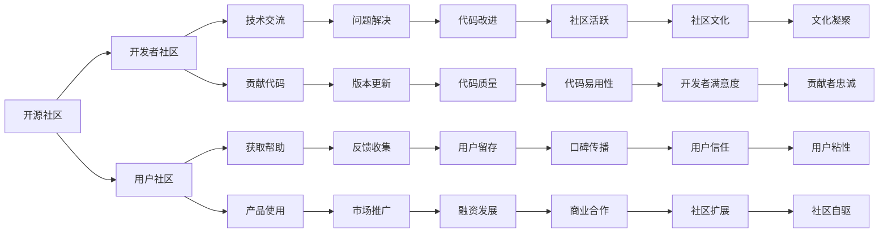

                 

# 建立开源项目的在线社区：社区运营和品牌建设

> 关键词：开源社区, 品牌建设, 社区运营, 开源项目, 用户参与

## 1. 背景介绍

在现代社会，开源项目成为推动技术发展的重要力量。从Linux内核到Apache Web Server，从TensorFlow到React，开源项目的成功离不开强大的社区支持和良好的品牌建设。然而，尽管许多项目拥有庞大的用户基础，但真正能够实现长期稳定发展，并在业界获得广泛认可的并不多。因此，本文将探讨如何通过社区运营和品牌建设，建立并维护一个成功的开源项目在线社区，助力项目的长期发展。

## 2. 核心概念与联系

### 2.1 核心概念概述

开源社区是开发者共同分享代码、合作开发、交流经验的平台。一个好的开源社区能够吸引并留住大量活跃的贡献者和使用者，通过集体的智慧和力量，不断迭代和优化项目，从而实现技术上的突破。

品牌建设则是在社区和用户之间建立信任和认知的重要手段。一个强大的品牌能提升项目的知名度和影响力，使社区的开发者和用户更加忠诚，吸引更多外部资源加入，为项目带来持续的发展动力。

### 2.2 核心概念原理和架构的 Mermaid 流程图(Mermaid 流程节点中不要有括号、逗号等特殊字符)

## 3. 核心算法原理 & 具体操作步骤
### 3.1 算法原理概述

开源项目社区的建立和维护，涉及多个关键算法和操作步骤。以下将从社区吸引、贡献者管理、项目推广和用户反馈四个方面，详细讲解社区运营和品牌建设的算法原理及具体操作步骤。

### 3.2 算法步骤详解

#### 3.2.1 社区吸引

**1. 平台搭建**

- **技术选择**：选择合适的开源协作工具，如GitHub、GitLab、Bitbucket等。这些平台提供了丰富的功能，包括代码托管、版本控制、代码审查等，能够满足开发者和用户的多样化需求。
- **界面设计**：简洁明了的用户界面，使开发者和用户能够快速上手，提升使用体验。

**2. 社区规则制定**

- **贡献者准则**：制定清晰的贡献者贡献指南，包括代码格式、命名规范、代码审查流程等。这有助于规范代码质量，提升项目的技术水平。
- **社区治理**：建立社区治理体系，如组织结构、角色分配、决策机制等，确保社区有序运行，并防止滥用权力。

#### 3.2.2 贡献者管理

**1. 贡献者招募**

- **社区推广**：通过社交媒体、博客、论坛等渠道，推广项目，吸引潜在的贡献者。
- **开发者联盟**：与其他开源项目或技术社区建立合作关系，共享资源，相互促进。

**2. 贡献者激励**

- **贡献奖励**：为积极贡献者提供徽章、积分、荣誉证书等激励措施，提升贡献者的参与感和归属感。
- **反馈机制**：建立快速反馈机制，及时回应贡献者的问题和建议，使其感受到社区的关怀和尊重。

#### 3.2.3 项目推广

**1. 市场宣传**

- **媒体报道**：与技术媒体合作，撰写技术博客、新闻报道，提升项目的曝光度。
- **社交媒体**：利用Twitter、LinkedIn、Facebook等社交平台，发布项目动态、技术文章，吸引关注。

**2. 社区活动**

- **技术会议**：组织或参与技术会议、黑客马拉松、开源峰会等活动，展示项目成果，扩大影响力。
- **线上讨论**：定期组织线上讨论会、技术分享会，与用户和开发者互动交流，增强社区粘性。

#### 3.2.4 用户反馈

**1. 反馈收集**

- **反馈渠道**：建立多渠道反馈机制，包括邮件、社交媒体、社区留言板等，便于用户提供建议和问题。
- **反馈处理**：建立反馈处理流程，定期梳理用户反馈，制定改进计划，提升用户体验。

**2. 版本迭代**

- **用户参与**：邀请用户参与版本测试、功能讨论，使项目更具用户导向，提升产品质量。
- **版本更新**：根据用户反馈和市场需求，定期发布新版本，满足用户需求。

### 3.3 算法优缺点

开源社区和品牌建设的优点包括：

- **社区智慧**：大量开发者和用户的共同参与，汇聚智慧，提升项目的技术水平。
- **品牌效应**：良好的品牌形象能提升项目的知名度和可信度，吸引更多资源。
- **资源共享**：社区内的资源、技术和经验共享，提高开发效率。

然而，这一过程也面临诸多挑战：

- **管理复杂**：社区管理和用户协调工作量较大，需要有效的组织和决策机制。
- **维护成本高**：持续的社区运营和品牌建设，需要投入大量人力和财力。
- **利益冲突**：社区内不同利益方之间的冲突和矛盾，需要妥善处理。

### 3.4 算法应用领域

开源社区和品牌建设的算法原理和操作步骤，不仅适用于软件开发项目，也广泛应用于其他技术领域，如科学计算、数据分析、人工智能等。在实际应用中，开发者需根据项目特点，灵活调整和优化社区运营和品牌建设的策略。

## 4. 数学模型和公式 & 详细讲解 & 举例说明

### 4.1 数学模型构建

**模型定义**：假设开源项目社区的活跃用户数为 $U$，贡献者数为 $C$，项目发布的新版本数为 $N$，用户反馈数为 $F$。社区的吸引力由平台的可用性、贡献者的积极参与、项目的市场推广、用户的满意度等综合因素决定。

**模型目标**：最大化社区的活跃度和项目的推广效果。

**模型变量**：
- $A$：平台搭建和技术选择
- $R$：社区规则制定和治理
- $C$：贡献者招募和管理
- $P$：项目推广和市场宣传
- $F$：用户反馈和版本迭代

### 4.2 公式推导过程

根据上述模型定义，社区吸引力 $A$ 可以表示为：

$$
A = f(A, R, C, P, F)
$$

其中 $f$ 为综合评价函数，表示多个因素的加权和。

### 4.3 案例分析与讲解

以GitHub为例，其社区吸引力和品牌建设主要依靠以下几个关键点：

- **平台选择**：GitHub提供丰富的协作工具和社区功能，如问题追踪、代码审查、代码托管等，使其成为全球最受欢迎的开源协作平台之一。
- **社区治理**：GitHub建立了严格的贡献者准则和开源社区治理机制，确保社区有序运行。
- **贡献者激励**：GitHub通过徽章、荣誉证书等措施，激励开发者积极贡献，形成了庞大的开发者生态。
- **市场宣传**：GitHub通过技术博客、新闻报道、社交媒体等渠道，不断推广平台，提升品牌知名度。
- **用户反馈**：GitHub重视用户反馈，及时回应问题，并通过版本迭代不断优化用户体验。

## 5. 项目实践：代码实例和详细解释说明

### 5.1 开发环境搭建

**环境配置**：

1. **安装GitHubDesktop**：从官网下载安装GitHub Desktop，用于管理本地仓库和远程仓库的同步。
2. **配置GitHub账号**：在GitHub官网注册账号，并下载桌面客户端配置。
3. **选择协作平台**：选择GitHub、GitLab或Bitbucket等协作平台，并创建项目仓库。

**环境调试**：

1. **配置环境变量**：在系统的环境变量中设置GitHub Desktop的路径，确保客户端能够正常运行。
2. **克隆代码仓库**：通过GitHub Desktop克隆代码仓库到本地，并进行初始化配置。

### 5.2 源代码详细实现

**代码实现**：

1. **搭建平台**：使用GitHub Desktop创建代码仓库，并设置项目文件和目录结构。
2. **规则制定**：编写贡献者指南和社区治理规则，并发布到代码仓库中。
3. **招募贡献者**：在GitHub、社交媒体和开发者论坛等渠道发布项目，吸引开发者关注和参与。
4. **贡献者激励**：为积极贡献者提供徽章、积分和荣誉证书，并及时回应反馈和建议。
5. **市场宣传**：在技术博客、新闻报道和社交媒体上发布项目动态和技术文章，提升品牌知名度。
6. **用户反馈**：建立多渠道反馈机制，及时处理用户问题，并发布新版本改进用户体验。

### 5.3 代码解读与分析

**代码解读**：

1. **搭建平台**：使用GitHub Desktop创建代码仓库，并通过`git init`命令初始化仓库。
2. **规则制定**：编写贡献者指南，包括代码格式、命名规范、代码审查流程等，并将其发布到`README.md`文件中。
3. **招募贡献者**：在GitHub官方页面发布项目介绍和贡献指南，并在技术社区和社交媒体上推广。
4. **贡献者激励**：为贡献者提供徽章、积分和荣誉证书，并通过GitHub Desktop的贡献者列表展示其贡献。
5. **市场宣传**：在博客、新闻报道和社交媒体上发布项目动态和技术文章，提升品牌知名度。
6. **用户反馈**：通过GitHub的Issue系统收集用户反馈，并定期发布版本更新和改进计划。

### 5.4 运行结果展示

**运行结果**：

1. **平台搭建**：在GitHub上创建仓库，并通过GitHub Desktop同步本地代码。
2. **规则制定**：通过`README.md`文件展示贡献者指南和社区治理规则，确保社区有序运行。
3. **招募贡献者**：在GitHub和社交媒体上发布项目，吸引开发者关注和参与。
4. **贡献者激励**：为贡献者提供徽章、积分和荣誉证书，并及时回应反馈和建议。
5. **市场宣传**：在博客、新闻报道和社交媒体上发布项目动态和技术文章，提升品牌知名度。
6. **用户反馈**：通过GitHub的Issue系统收集用户反馈，并定期发布版本更新和改进计划。

## 6. 实际应用场景

### 6.1 开源社区的运营实践

**实际应用**：

1. **Slack社区**：Slack建立了一个开发者社区，通过定期技术讨论、代码评审和版本迭代，不断优化社区管理。
2. **LinkedIn开发者群组**：LinkedIn开发者群组通过技术文章、技术直播和开发者联盟等手段，提升了社区的活跃度和影响力。

**案例分析**：

- **Slack社区**：Slack通过技术讨论、代码评审和版本迭代，确保社区有序运行，并不断优化社区管理。
- **LinkedIn开发者群组**：LinkedIn开发者群组通过技术文章、技术直播和开发者联盟等手段，提升了社区的活跃度和影响力。

### 6.2 品牌建设的策略实践

**实际应用**：

1. **Google的开源项目品牌建设**：Google通过技术博客、新闻报道和开发者大会等手段，不断提升开源项目的品牌知名度。
2. **Apache Software Foundation的品牌建设**：Apache通过开源峰会、技术文章和社区活动等手段，建立了强大的品牌形象。

**案例分析**：

- **Google的开源项目品牌建设**：Google通过技术博客、新闻报道和开发者大会等手段，不断提升开源项目的品牌知名度。
- **Apache Software Foundation的品牌建设**：Apache通过开源峰会、技术文章和社区活动等手段，建立了强大的品牌形象。

### 6.3 开源社区的品牌建设实践

**实际应用**：

1. **TensorFlow的品牌建设**：TensorFlow通过技术博客、新闻报道和开发者大会等手段，不断提升品牌知名度，吸引了大量开发者和用户参与。
2. **React的品牌建设**：React通过技术文章、技术直播和社区活动等手段，提升了品牌知名度，吸引了大量开发者和用户参与。

**案例分析**：

- **TensorFlow的品牌建设**：TensorFlow通过技术博客、新闻报道和开发者大会等手段，不断提升品牌知名度，吸引了大量开发者和用户参与。
- **React的品牌建设**：React通过技术文章、技术直播和社区活动等手段，提升了品牌知名度，吸引了大量开发者和用户参与。

## 7. 工具和资源推荐

### 7.1 学习资源推荐

**学习资源**：

1. **GitHub官方文档**：GitHub官方文档详细介绍了GitHub Desktop和Web平台的各项功能，是开发者必备的学习资源。
2. **GitHub教程和培训**：GitHub提供丰富的教程和培训资源，帮助开发者提升使用技能。
3. **GitHub社区论坛**：GitHub社区论坛是开发者交流和互助的重要平台，提供了丰富的学习资源和实践经验。

### 7.2 开发工具推荐

**开发工具**：

1. **GitHub Desktop**：GitHub Desktop提供了便捷的代码管理功能，适合开发者快速上手。
2. **GitLab**：GitLab提供了丰富的协作功能，适合开发者进行代码管理、版本控制和社区交流。
3. **Bitbucket**：Bitbucket提供了全面的协作工具，适合开发者进行代码托管、问题追踪和项目管理。

### 7.3 相关论文推荐

**相关论文**：

1. **开源社区分析**：《Open Source Software as a Collaborative Work of Many Hands》，探讨了开源社区的组织和管理。
2. **品牌建设策略**：《Brand Equity Management in the Digital Era》，探讨了数字时代品牌建设的策略和方法。
3. **社区运营实践**：《Community Building and Management in Open Source Projects》，探讨了开源社区的运营和管理实践。

## 8. 总结：未来发展趋势与挑战

### 8.1 研究成果总结

开源社区和品牌建设是开源项目成功的重要因素。通过合理的社区运营和品牌建设，可以吸引并留住大量活跃的贡献者和使用者，提升项目的知名度和影响力，实现技术的突破和商业化应用。本文详细讲解了开源社区和品牌建设的算法原理和操作步骤，并通过实际案例分析，展示了其具体的实践方法和效果。

### 8.2 未来发展趋势

开源社区和品牌建设的未来发展趋势主要包括以下几个方面：

1. **社区自动化**：通过AI和自动化工具，提升社区管理和运营效率，减少人力成本。
2. **用户个性化**：根据用户行为和反馈，提供个性化的社区推荐和服务，提升用户粘性和满意度。
3. **开源商业化**：开源社区和品牌建设将更多地与商业化应用结合，实现技术的商业价值。
4. **全球化扩展**：开源社区和品牌建设将面向全球，吸引更多国际开发者和用户，提升项目的全球影响力。

### 8.3 面临的挑战

开源社区和品牌建设虽然有许多优势，但也面临诸多挑战：

1. **管理复杂**：开源社区的规模和复杂度不断增加，需要有效的组织和管理机制。
2. **利益冲突**：社区内不同利益方之间的冲突和矛盾，需要妥善处理。
3. **资源投入**：持续的社区运营和品牌建设，需要投入大量人力和财力。
4. **社区分散**：全球化的社区管理需要应对不同地域和文化背景的用户，面临更大的挑战。

### 8.4 研究展望

未来开源社区和品牌建设的研究将更加注重以下几个方面：

1. **自动化和智能化**：通过AI和自动化工具，提升社区管理和运营效率，减少人力成本。
2. **用户个性化**：根据用户行为和反馈，提供个性化的社区推荐和服务，提升用户粘性和满意度。
3. **开源商业化**：开源社区和品牌建设将更多地与商业化应用结合，实现技术的商业价值。
4. **全球化扩展**：开源社区和品牌建设将面向全球，吸引更多国际开发者和用户，提升项目的全球影响力。

## 9. 附录：常见问题与解答

### 9.1 问题1：如何选择适合的开源协作平台？

**解答**：

选择开源协作平台需要考虑以下几个因素：

1. **功能需求**：根据项目的需求选择合适的协作工具，如代码托管、版本控制、问题追踪等。
2. **用户体验**：选择界面简洁、功能易用的协作平台，提高开发者和用户的使用体验。
3. **社区生态**：选择拥有强大社区和活跃用户基础的协作平台，确保社区的稳定运行和资源共享。

### 9.2 问题2：如何吸引并留住活跃的贡献者？

**解答**：

吸引并留住活跃的贡献者需要以下几个策略：

1. **贡献者激励**：通过徽章、积分、荣誉证书等措施，激励开发者积极贡献。
2. **快速反馈**：建立快速反馈机制，及时回应贡献者的问题和建议。
3. **社区文化**：建立正向的社区文化，促进开发者之间的交流和合作。

### 9.3 问题3：如何提升社区的活跃度和影响力？

**解答**：

提升社区的活跃度和影响力需要以下几个策略：

1. **市场宣传**：通过技术博客、新闻报道和社交媒体等渠道，推广项目，提升品牌知名度。
2. **技术交流**：定期组织线上讨论会、技术分享会，与用户和开发者互动交流，增强社区粘性。
3. **社区活动**：组织或参与技术会议、黑客马拉松、开源峰会等活动，展示项目成果，扩大影响力。

### 9.4 问题4：如何管理开源社区的利益冲突？

**解答**：

管理开源社区的利益冲突需要以下几个策略：

1. **透明决策**：建立透明的决策机制，确保所有利益方都有话语权。
2. **利益平衡**：平衡不同利益方之间的利益，避免矛盾和冲突。
3. **利益分享**：通过利益分享机制，确保所有贡献者和用户都能获得合理的回报。

---

作者：禅与计算机程序设计艺术 / Zen and the Art of Computer Programming

