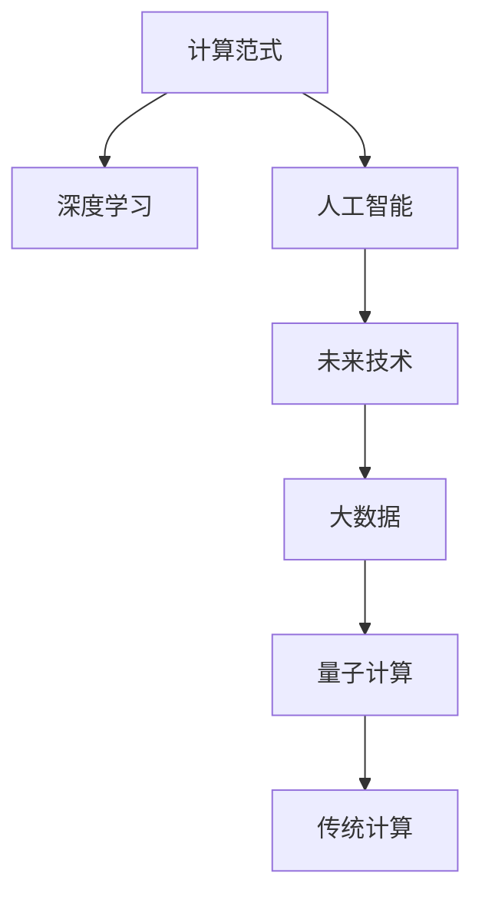

                 

# 开启无限可能：人类计算的新征程

> 关键词：计算范式，深度学习，人工智能，未来技术，大数据，量子计算

## 1. 背景介绍

### 1.1 问题由来

随着人类社会的迅速发展和数字化进程的不断深入，计算能力在各行各业中发挥着越来越重要的作用。从早期的人工电子管计算到后来的集成电路，再到当前广泛使用的基于冯·诺依曼架构的通用计算机，人类计算的方式正在经历着前所未有的变革。然而，在传统计算范式下，面对日趋复杂的计算任务，如大规模数据处理、复杂模拟计算、高级认知任务等，现有的计算方法显得力不从心。

为了应对这一挑战，近年来，人工智能（AI）技术迅速崛起，特别是深度学习在图像识别、自然语言处理、智能推荐等领域取得了显著成果，显示出了巨大的潜力。深度学习通过构建多层次的非线性神经网络结构，能够在海量数据上自动学习出复杂的特征表示，从而在各种任务上取得了突破性的进展。然而，深度学习的发展也面临着数据依赖度高、模型复杂度高、训练成本高等问题，如何在大数据、高性能计算的基础上进一步提升AI的计算能力，是当前计算领域的一大热点。

### 1.2 问题核心关键点

为了进一步推动AI计算能力的提升，人类计算的新范式正在被积极探索和实践。这一范式不仅包括传统的计算技术，还涵盖了数据科学、量子计算、分布式计算、自然计算等前沿技术。这些技术的发展，将为人类计算能力的提升带来无限可能，推动人类社会进入一个全新的智能时代。

在这一背景下，本文旨在通过介绍计算范式、深度学习、人工智能、未来技术、大数据、量子计算等核心概念，阐述人类计算的新征程，并探讨其在实际应用场景中的前景和挑战。

## 2. 核心概念与联系

### 2.1 核心概念概述

为更好地理解人类计算的新范式，本节将介绍几个密切相关的核心概念：

- 计算范式（Computational Paradigm）：指人类进行计算的基本方式和原理，包括传统的冯·诺依曼架构、分布式计算、量子计算等。
- 深度学习（Deep Learning）：基于多层神经网络结构的机器学习方法，能够自动学习特征表示，广泛应用于计算机视觉、自然语言处理等领域。
- 人工智能（Artificial Intelligence, AI）：通过模拟人类智能行为，实现各种自动化、智能化的技术。
- 未来技术（Future Technologies）：包括量子计算、光子计算、生物计算等前沿技术，探索新的计算原理和计算方法。
- 大数据（Big Data）：指海量、高速、多样化的数据，为深度学习、人工智能等提供了丰富的训练样本和测试数据。
- 量子计算（Quantum Computing）：利用量子力学的原理进行计算，能够显著提升计算效率和处理能力。

这些核心概念之间的逻辑关系可以通过以下Mermaid流程图来展示：



这个流程图展示了一系列相关概念之间的关联关系：

1. 计算范式为深度学习、人工智能、未来技术等提供了计算基础。
2. 深度学习和大数据紧密结合，为人工智能提供了强大的数据支持。
3. 未来技术如量子计算，为计算范式的演进带来了新的方向和可能。
4. 传统计算是现有计算能力的基石，为当前各种应用场景提供了支持。

这些概念共同构成了人类计算发展的基本框架，展现了计算技术未来的无限可能。

## 3. 核心算法原理 & 具体操作步骤
### 3.1 算法原理概述

人类计算的新范式，主要是基于深度学习和人工智能技术，通过构建大规模的神经网络模型，在大数据上进行训练，从而实现复杂的计算任务。这一过程包括数据预处理、模型设计、参数优化、模型评估等多个步骤，涉及深度学习的基本原理和算法。

深度学习算法通过神经网络结构对数据进行特征提取和模式学习，逐步构建出能够自动学习并提取特征的模型。而人工智能算法则通过各种优化技术，使得模型能够在复杂数据上得到高效的训练和应用。在实际应用中，还需要结合具体的任务特点，选择合适的算法和模型结构，以实现最佳性能。

### 3.2 算法步骤详解

基于深度学习和大数据的人类计算新范式，通常包括以下几个关键步骤：

**Step 1: 数据预处理**
- 收集和清洗数据，构建数据集。
- 对数据进行标注，划分训练集、验证集和测试集。
- 对数据进行标准化、归一化等预处理，确保数据的一致性和可比性。

**Step 2: 模型设计**
- 选择适合的深度学习模型，如卷积神经网络（CNN）、循环神经网络（RNN）、变换器（Transformer）等。
- 确定模型结构，包括层数、节点数、激活函数等。
- 定义损失函数和优化算法，如交叉熵损失、Adam优化器等。

**Step 3: 参数优化**
- 使用随机梯度下降（SGD）或Adam等优化算法，最小化损失函数。
- 调整学习率、批大小、迭代次数等超参数，优化模型性能。
- 应用正则化技术，如L2正则、Dropout等，防止过拟合。

**Step 4: 模型评估**
- 在验证集上评估模型性能，选择合适的指标，如准确率、召回率、F1值等。
- 根据评估结果，调整模型参数和超参数，优化模型性能。
- 在测试集上最终评估模型性能，确保模型泛化能力。

**Step 5: 模型应用**
- 将训练好的模型应用于实际场景，进行推理、预测等操作。
- 使用模型进行实时计算，处理大规模数据，提升计算效率。
- 结合其他技术和工具，进行模型集成、优化和部署。

以上是基于深度学习和大数据的人类计算新范式的一般流程。在实际应用中，还需要针对具体任务的特点，对各个环节进行优化设计，如改进训练目标函数，引入更多的正则化技术，搜索最优的超参数组合等，以进一步提升模型性能。

### 3.3 算法优缺点

基于深度学习和大数据的人类计算新范式，具有以下优点：
1. 数据驱动。深度学习算法能够自动学习数据的特征表示，无需人工设计特征，减少特征工程的工作量。
2. 泛化能力强。在大数据上进行训练，深度学习模型能够学习到广泛的规律和模式，具有较强的泛化能力。
3. 应用广泛。深度学习算法已经在图像识别、语音识别、自然语言处理等多个领域取得了突破性的进展，具有广泛的应用前景。
4. 计算效率高。通过GPU、TPU等高性能计算设备，深度学习算法能够在大规模数据上进行高效的训练和推理。

同时，该方法也存在一定的局限性：
1. 模型复杂度高。深度学习模型通常包含大量的参数，需要大量计算资源进行训练和优化。
2. 数据依赖性强。深度学习模型的性能很大程度上依赖于数据的质量和数量，获取高质量标注数据的成本较高。
3. 解释性不足。深度学习模型的决策过程通常是"黑盒"的，难以解释其内部工作机制和决策逻辑。
4. 硬件资源需求高。深度学习模型的训练和推理需要大量的计算资源和存储空间，对硬件设备的要求较高。

尽管存在这些局限性，但就目前而言，基于深度学习和大数据的人类计算新范式仍是目前最主流、最有效的计算方法。未来相关研究的重点在于如何进一步降低深度学习对数据的依赖，提高模型的少样本学习和跨领域迁移能力，同时兼顾可解释性和伦理安全性等因素。

### 3.4 算法应用领域

基于深度学习和大数据的人类计算新范式，在各个领域中已经得到了广泛的应用，例如：

- 计算机视觉：如图像分类、目标检测、人脸识别等。通过深度学习模型学习图像特征，实现高效的图像处理和识别。
- 自然语言处理：如机器翻译、语音识别、情感分析等。通过深度学习模型学习文本和语音的语义表示，实现文本和语音的自动处理和分析。
- 智能推荐系统：如电商推荐、新闻推荐、广告推荐等。通过深度学习模型学习用户行为和物品属性，实现个性化的推荐服务。
- 智能医疗：如疾病预测、基因分析、医疗影像诊断等。通过深度学习模型学习医疗数据特征，提高医疗诊断的准确性和效率。
- 智能交通：如自动驾驶、交通流量预测、智慧城市等。通过深度学习模型学习交通数据，实现交通管理的智能化和高效化。
- 金融科技：如风险评估、欺诈检测、量化交易等。通过深度学习模型学习金融数据，提高金融决策的准确性和效率。

除了上述这些经典任务外，深度学习和大数据技术还在更多场景中得到了应用，如物联网、大数据分析、人工智能芯片等，为各行各业带来了深刻的变革。随着深度学习和大数据技术的不断演进，相信在更多领域中，人类计算新范式将展现出更大的潜力，推动人类社会进入一个更加智能、高效、便捷的未来。

## 4. 数学模型和公式 & 详细讲解  
### 4.1 数学模型构建

基于深度学习和大数据的人类计算新范式，涉及到复杂的数学模型和公式。以下我们将重点介绍深度学习模型的数学构建和优化算法的基本原理。

假设深度学习模型为 $M(x; \theta)$，其中 $x$ 为输入数据，$\theta$ 为模型参数。模型通过多层神经网络结构，对输入数据进行特征提取和模式学习，最终输出预测结果 $y$。模型的损失函数为 $L(y, \hat{y})$，用于衡量模型预测结果与真实结果之间的差异。常见的损失函数包括均方误差损失、交叉熵损失等。

优化算法通常采用随机梯度下降（SGD）或Adam等方法，通过反向传播算法计算损失函数对模型参数的梯度，并根据梯度方向更新参数，最小化损失函数。优化算法的更新公式为：

$$
\theta \leftarrow \theta - \eta \nabla_{\theta} L(y, \hat{y})
$$

其中，$\eta$ 为学习率，$\nabla_{\theta} L(y, \hat{y})$ 为损失函数对参数 $\theta$ 的梯度。

### 4.2 公式推导过程

以交叉熵损失函数为例，推导其在深度学习模型中的应用。

假设模型 $M(x; \theta)$ 在输入 $x$ 上的输出为 $\hat{y}=M(x; \theta)$，真实标签 $y \in \{0,1\}$。交叉熵损失函数定义为：

$$
L(y, \hat{y}) = -[y\log \hat{y} + (1-y)\log (1-\hat{y})]
$$

将其代入深度学习模型的训练过程，得到模型的经验风险为：

$$
\mathcal{L}(\theta) = -\frac{1}{N}\sum_{i=1}^N [y_i\log M(x_i; \theta)+(1-y_i)\log(1-M(x_i; \theta))]
$$

根据链式法则，损失函数对参数 $\theta_k$ 的梯度为：

$$
\frac{\partial \mathcal{L}(\theta)}{\partial \theta_k} = -\frac{1}{N}\sum_{i=1}^N (\frac{y_i}{M(x_i; \theta)}-\frac{1-y_i}{1-M(x_i; \theta)}) \frac{\partial M(x_i; \theta)}{\partial \theta_k}
$$

其中 $\frac{\partial M(x_i; \theta)}{\partial \theta_k}$ 可进一步递归展开，利用自动微分技术完成计算。

在得到损失函数的梯度后，即可带入优化算法，完成模型的迭代优化。重复上述过程直至收敛，最终得到训练好的深度学习模型。

## 5. 项目实践：代码实例和详细解释说明
### 5.1 开发环境搭建

在进行深度学习和大数据项目实践前，我们需要准备好开发环境。以下是使用Python进行深度学习开发的环境配置流程：

1. 安装Anaconda：从官网下载并安装Anaconda，用于创建独立的Python环境。

2. 创建并激活虚拟环境：
```bash
conda create -n pytorch-env python=3.8 
conda activate pytorch-env
```

3. 安装PyTorch：根据CUDA版本，从官网获取对应的安装命令。例如：
```bash
conda install pytorch torchvision torchaudio cudatoolkit=11.1 -c pytorch -c conda-forge
```

4. 安装TensorFlow：从官网下载安装包，并按照说明进行安装。

5. 安装各类工具包：
```bash
pip install numpy pandas scikit-learn matplotlib tqdm jupyter notebook ipython
```

完成上述步骤后，即可在`pytorch-env`环境中开始深度学习和大数据项目的开发。

### 5.2 源代码详细实现

这里我们以图像分类任务为例，给出使用PyTorch和TensorFlow进行深度学习模型的PyTorch代码实现。

首先，定义图像分类任务的数据处理函数：

```python
import torch
import torch.nn as nn
import torch.optim as optim
from torch.utils.data import DataLoader
from torchvision import datasets, transforms

# 定义数据预处理函数
transform = transforms.Compose([
    transforms.ToTensor(),
    transforms.Normalize([0.5, 0.5, 0.5], [0.5, 0.5, 0.5])
])

# 加载数据集
train_dataset = datasets.CIFAR10(root='./data', train=True, download=True, transform=transform)
test_dataset = datasets.CIFAR10(root='./data', train=False, download=True, transform=transform)

# 划分训练集和验证集
train_loader = DataLoader(train_dataset, batch_size=64, shuffle=True)
test_loader = DataLoader(test_dataset, batch_size=64, shuffle=False)
```

然后，定义模型和优化器：

```python
# 定义卷积神经网络模型
class Net(nn.Module):
    def __init__(self):
        super(Net, self).__init__()
        self.conv1 = nn.Conv2d(3, 6, 5)
        self.pool = nn.MaxPool2d(2, 2)
        self.conv2 = nn.Conv2d(6, 16, 5)
        self.fc1 = nn.Linear(16 * 5 * 5, 120)
        self.fc2 = nn.Linear(120, 84)
        self.fc3 = nn.Linear(84, 10)

    def forward(self, x):
        x = self.pool(F.relu(self.conv1(x)))
        x = self.pool(F.relu(self.conv2(x)))
        x = x.view(-1, 16 * 5 * 5)
        x = F.relu(self.fc1(x))
        x = F.relu(self.fc2(x))
        x = self.fc3(x)
        return x

# 定义优化器和损失函数
model = Net()
criterion = nn.CrossEntropyLoss()
optimizer = optim.SGD(model.parameters(), lr=0.001, momentum=0.9)

# 训练函数
def train(epoch):
    model.train()
    for batch_idx, (data, target) in enumerate(train_loader):
        optimizer.zero_grad()
        output = model(data)
        loss = criterion(output, target)
        loss.backward()
        optimizer.step()
```

最后，启动训练流程并在测试集上评估：

```python
epochs = 10

for epoch in range(epochs):
    train(epoch)
    print('Epoch: %d, Loss: %.4f' % (epoch + 1, loss.item()))
    
    # 在测试集上评估模型性能
    model.eval()
    correct = 0
    total = 0
    with torch.no_grad():
        for data, target in test_loader:
            output = model(data)
            _, predicted = torch.max(output.data, 1)
            total += target.size(0)
            correct += (predicted == target).sum().item()
    print('Accuracy of the network on the 10000 test images: %d %%' % (
        100 * correct / total))
```

以上就是使用PyTorch和TensorFlow进行图像分类任务深度学习模型的代码实现。可以看到，在深度学习和大数据项目中，依赖强大的框架和丰富的工具库，代码实现变得简洁高效。

### 5.3 代码解读与分析

让我们再详细解读一下关键代码的实现细节：

**数据处理函数**：
- `transform`方法：定义了数据预处理的步骤，包括将图像转换为Tensor类型和归一化处理。
- `datasets.CIFAR10`：从CIFAR-10数据集中加载训练集和测试集。
- `DataLoader`：构建数据批次的加载器，方便模型训练和推理。

**模型定义**：
- `Net`类：定义了卷积神经网络的模型结构，包括卷积层、池化层、全连接层等。
- `nn.Conv2d`、`nn.MaxPool2d`、`nn.Linear`、`nn.ReLU`、`nn.CrossEntropyLoss`：使用PyTorch中的各类模块，构建深度学习模型。

**训练函数**：
- `train`函数：定义了模型的训练过程，包括前向传播、损失计算、反向传播和参数更新等。
- `optimizer.zero_grad()`：清除梯度缓存，准备进行新的前向传播和反向传播。
- `loss.backward()`：计算梯度，进行反向传播。
- `optimizer.step()`：更新模型参数，完成一次迭代。

**评估函数**：
- `model.eval()`：将模型设置为评估模式，关闭dropout等随机操作。
- `correct`和`total`：记录在测试集上的正确预测数和总预测数。
- `torch.no_grad()`：关闭梯度计算，加速模型评估过程。

可以看到，深度学习和大数据项目中，代码实现涉及了大量的模型设计、数据处理、优化算法等关键环节，开发者需要具备较强的数学基础和编程能力。

当然，工业级的系统实现还需考虑更多因素，如模型的保存和部署、超参数的自动搜索、更灵活的任务适配层等。但核心的深度学习和大数据计算流程基本与此类似。

## 6. 实际应用场景
### 6.1 智能医疗

深度学习和大数据技术在智能医疗领域的应用，可以显著提升医疗诊断的准确性和效率。传统的医疗诊断依赖于医生的经验和知识，容易出现误诊、漏诊等问题。而通过深度学习模型，可以自动学习医疗数据中的模式和规律，提高诊断的准确性和效率。

例如，使用深度学习模型对医疗影像数据进行训练，可以实现疾病的自动诊断和分类。通过在大量医学影像数据上进行预训练，深度学习模型可以学习到各类疾病的特征表示，从而在新的医学影像数据上实现快速的诊断和分类。此外，深度学习模型还可以用于疾病预测、基因分析等任务，为医学研究提供强大的支持。

### 6.2 金融科技

在金融科技领域，深度学习和大数据技术已经得到了广泛应用。通过深度学习模型对金融数据进行分析和预测，可以实现风险评估、欺诈检测、量化交易等任务。

例如，使用深度学习模型对金融交易数据进行训练，可以实现交易的异常检测和风险评估。通过在大量金融交易数据上进行预训练，深度学习模型可以学习到各类交易模式的特征表示，从而在新的交易数据上实现异常检测和风险评估。此外，深度学习模型还可以用于资产定价、市场预测等任务，为金融决策提供科学依据。

### 6.3 智能交通

深度学习和大数据技术在智能交通领域的应用，可以显著提升交通管理和智慧城市的智能化水平。传统的交通管理依赖于人工监控和调度，容易出现误判、延误等问题。而通过深度学习模型，可以实现交通流量预测、自动驾驶等任务。

例如，使用深度学习模型对交通流量数据进行训练，可以实现交通流量的预测和调度。通过在大量交通流量数据上进行预训练，深度学习模型可以学习到交通流量的规律和特征，从而在新的交通数据上实现流量预测和调度。此外，深度学习模型还可以用于自动驾驶、智慧城市等任务，为交通管理和智慧城市建设提供支持。

### 6.4 未来应用展望

随着深度学习和大数据技术的不断发展，基于计算范式的新范式将带来更多的应用前景和创新可能。

1. 大数据计算平台：构建高效、分布式的大数据计算平台，为深度学习模型的训练和推理提供强大的计算支持。
2. 量子计算：探索量子计算在深度学习中的应用，通过量子计算加速深度学习模型的训练和推理，提升计算效率和处理能力。
3. 分布式计算：构建大规模、高可扩展的分布式计算集群，实现深度学习模型的并行计算和优化。
4. 人工智能芯片：开发专用的人工智能芯片，提升深度学习模型的计算效率和性能，降低计算成本。
5. 多模态计算：探索多模态数据融合技术，实现视觉、语音、文本等多种模态数据的协同计算。
6. 计算加速：利用GPU、TPU等高性能计算设备，加速深度学习模型的训练和推理。

以上趋势凸显了深度学习和大数据技术在未来计算范式中的重要地位。这些方向的探索发展，将进一步提升计算能力，推动人工智能技术的落地应用，为人类社会带来更加智能、高效、便捷的未来。

## 7. 工具和资源推荐
### 7.1 学习资源推荐

为了帮助开发者系统掌握深度学习和大数据技术，这里推荐一些优质的学习资源：

1. 《深度学习》（Ian Goodfellow等著）：涵盖了深度学习的基本原理和算法，适合初学者和进阶学习者。
2. 《TensorFlow实战》（Jean Baptiste Mouret等著）：介绍了TensorFlow的基本使用方法和实践技巧，适合TensorFlow开发者。
3. 《PyTorch深度学习》（Eli Stevens等著）：介绍了PyTorch的基本使用方法和实践技巧，适合PyTorch开发者。
4. 《TensorFlow官方文档》和《PyTorch官方文档》：提供了详细的API文档和示例代码，适合开发者进行深入学习和实践。
5. 《自然语言处理综论》（Daniel Jurafsky等著）：介绍了自然语言处理的基本原理和算法，适合NLP开发者。

通过对这些资源的学习实践，相信你一定能够快速掌握深度学习和大数据技术的精髓，并用于解决实际的计算问题。

### 7.2 开发工具推荐

高效的开发离不开优秀的工具支持。以下是几款用于深度学习和大数据开发的常用工具：

1. PyTorch：基于Python的开源深度学习框架，灵活动态的计算图，适合快速迭代研究。
2. TensorFlow：由Google主导开发的开源深度学习框架，生产部署方便，适合大规模工程应用。
3. Scikit-learn：Python机器学习库，提供了丰富的数据处理和机器学习算法。
4. Pandas：Python数据处理库，提供了高效的数据读取、清洗、处理和分析功能。
5. Matplotlib：Python绘图库，提供了丰富的绘图功能和可视化工具。
6. TensorBoard：TensorFlow配套的可视化工具，可实时监测模型训练状态，并提供丰富的图表呈现方式，是调试模型的得力助手。
7. Jupyter Notebook：交互式Python编程环境，方便开发者进行数据处理和模型训练。

合理利用这些工具，可以显著提升深度学习和大数据项目的开发效率，加快创新迭代的步伐。

### 7.3 相关论文推荐

深度学习和大数据技术的发展源于学界的持续研究。以下是几篇奠基性的相关论文，推荐阅读：

1. ImageNet Large Scale Visual Recognition Challenge（ILSVRC）：展示了深度学习在图像识别任务上的突破性进展。
2. AlphaGo：利用深度学习技术实现了围棋的自动化对弈，展示了深度学习在复杂决策任务上的潜力。
3. Deep Speech：利用深度学习技术实现了语音识别的突破，展示了深度学习在语音处理任务上的潜力。
4. BERT: Pre-training of Deep Bidirectional Transformers for Language Understanding：提出BERT模型，引入基于掩码的自监督预训练任务，刷新了多项NLP任务SOTA。
5. Generative Adversarial Networks（GANs）：提出生成对抗网络，实现了高质量图像生成和数据增强等任务。
6. Capsule Networks：提出胶囊网络，提高了模型的表征能力和泛化能力。

这些论文代表了大数据和深度学习技术的发展脉络。通过学习这些前沿成果，可以帮助研究者把握学科前进方向，激发更多的创新灵感。

## 8. 总结：未来发展趋势与挑战

### 8.1 研究成果总结

本文通过介绍深度学习和大数据技术，阐述了人类计算的新范式，探讨了其在实际应用场景中的前景和挑战。深度学习和大数据技术已经在图像识别、自然语言处理、智能推荐等领域取得了突破性的进展，展示了强大的计算能力和应用潜力。然而，这一技术也面临着数据依赖度高、模型复杂度高、计算资源需求高等挑战。

### 8.2 未来发展趋势

展望未来，深度学习和大数据技术将在更多领域中得到应用，为人类计算能力的提升带来无限可能：

1. 大数据计算平台：构建高效、分布式的大数据计算平台，为深度学习模型的训练和推理提供强大的计算支持。
2. 量子计算：探索量子计算在深度学习中的应用，通过量子计算加速深度学习模型的训练和推理，提升计算效率和处理能力。
3. 分布式计算：构建大规模、高可扩展的分布式计算集群，实现深度学习模型的并行计算和优化。
4. 人工智能芯片：开发专用的人工智能芯片，提升深度学习模型的计算效率和性能，降低计算成本。
5. 多模态计算：探索多模态数据融合技术，实现视觉、语音、文本等多种模态数据的协同计算。
6. 计算加速：利用GPU、TPU等高性能计算设备，加速深度学习模型的训练和推理。

以上趋势凸显了深度学习和大数据技术在未来计算范式中的重要地位。这些方向的探索发展，将进一步提升计算能力，推动人工智能技术的落地应用，为人类社会带来更加智能、高效、便捷的未来。

### 8.3 面临的挑战

尽管深度学习和大数据技术已经取得了显著进展，但在迈向更加智能化、普适化应用的过程中，它仍面临着诸多挑战：

1. 数据依赖性高。深度学习模型的性能很大程度上依赖于数据的质量和数量，获取高质量标注数据的成本较高。
2. 模型复杂度高。深度学习模型通常包含大量的参数，需要大量计算资源进行训练和优化。
3. 计算资源需求高。深度学习模型的训练和推理需要大量的计算资源和存储空间，对硬件设备的要求较高。
4. 解释性不足。深度学习模型的决策过程通常是"黑盒"的，难以解释其内部工作机制和决策逻辑。
5. 安全性有待保障。深度学习模型可能会学习到有害的信息，传递到下游任务，产生误导性、歧视性的输出，给实际应用带来安全隐患。

### 8.4 研究展望

面对深度学习和大数据技术所面临的挑战，未来的研究需要在以下几个方面寻求新的突破：

1. 探索无监督和半监督学习范式。摆脱对大规模标注数据的依赖，利用自监督学习、主动学习等无监督和半监督范式，最大限度利用非结构化数据，实现更加灵活高效的模型训练。
2. 研究参数高效和计算高效的微调范式。开发更加参数高效的微调方法，在固定大部分预训练参数的同时，只更新极少量的任务相关参数。同时优化微调模型的计算图，减少前向传播和反向传播的资源消耗，实现更加轻量级、实时性的部署。
3. 融合因果和对比学习范式。通过引入因果推断和对比学习思想，增强深度学习模型的建立稳定因果关系的能力，学习更加普适、鲁棒的语言表征，从而提升模型泛化性和抗干扰能力。
4. 引入更多先验知识。将符号化的先验知识，如知识图谱、逻辑规则等，与神经网络模型进行巧妙融合，引导深度学习模型学习更准确、合理的特征表示。
5. 结合因果分析和博弈论工具。将因果分析方法引入深度学习模型，识别出模型决策的关键特征，增强输出解释的因果性和逻辑性。借助博弈论工具刻画人机交互过程，主动探索并规避模型的脆弱点，提高系统稳定性。
6. 纳入伦理道德约束。在深度学习模型的训练目标中引入伦理导向的评估指标，过滤和惩罚有害的输出倾向。同时加强人工干预和审核，建立模型行为的监管机制，确保输出符合人类价值观和伦理道德。

这些研究方向的探索，必将引领深度学习和大数据技术迈向更高的台阶，为构建安全、可靠、可解释、可控的智能系统铺平道路。面向未来，深度学习和大数据技术还需要与其他人工智能技术进行更深入的融合，如知识表示、因果推理、强化学习等，多路径协同发力，共同推动自然语言理解和智能交互系统的进步。只有勇于创新、敢于突破，才能不断拓展深度学习和大数据技术的边界，让智能技术更好地造福人类社会。

## 9. 附录：常见问题与解答

**Q1：深度学习和大数据技术是否适用于所有应用场景？**

A: 深度学习和大数据技术已经在许多领域取得了显著成果，如计算机视觉、自然语言处理、智能推荐等。然而，对于某些特殊领域，如医学、法律等，仅仅依靠通用语料预训练的模型可能难以很好地适应。此时需要在特定领域语料上进一步预训练，再进行微调，才能获得理想效果。此外，对于一些需要时效性、个性化很强的任务，如对话、推荐等，深度学习和大数据技术也需要针对性的改进优化。

**Q2：深度学习模型是否容易过拟合？**

A: 深度学习模型通常很容易过拟合，尤其是在数据量较少的情况下。常见的缓解策略包括：
1. 数据增强：通过回译、近义替换等方式扩充训练集。
2. 正则化：使用L2正则、Dropout、Early Stopping等技术防止过拟合。
3. 对抗训练：引入对抗样本，提高模型鲁棒性。
4. 参数高效微调：只调整少量参数(如Adapter、Prefix等)，减小过拟合风险。
5. 多模型集成：训练多个深度学习模型，取平均输出，抑制过拟合。

**Q3：深度学习模型在实际应用中是否需要调整超参数？**

A: 是的，深度学习模型的性能很大程度上依赖于超参数的选择。常见的超参数包括学习率、批大小、迭代次数、正则化系数等。超参数的选择和调整需要结合具体的任务和数据特点进行，通常需要进行多次实验和调整，才能找到最优的超参数组合。

**Q4：深度学习模型是否容易被误导？**

A: 是的，深度学习模型可能会学习到有害的信息，传递到下游任务，产生误导性、歧视性的输出。因此，在训练和应用过程中，需要对模型进行严格的审查和监管，确保其输出符合伦理道德标准。

**Q5：深度学习模型是否容易受到数据分布变化的影响？**

A: 是的，深度学习模型的性能很大程度上依赖于数据的质量和数量。对于测试样本的微小扰动，深度学习模型容易发生波动。因此，在应用过程中，需要持续收集新的数据，定期重新训练模型，以适应数据分布的变化。

---

作者：禅与计算机程序设计艺术 / Zen and the Art of Computer Programming

