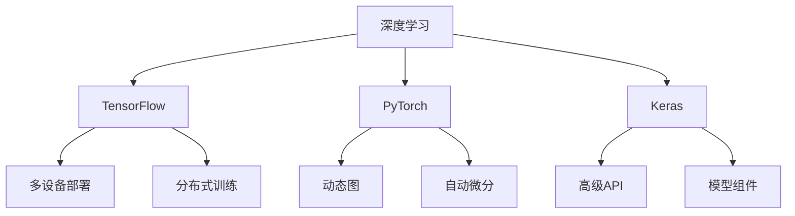

                 

# 开源AI框架的比较:TensorFlow、PyTorch和Keras

> 关键词：
   - 开源AI框架
   - TensorFlow
   - PyTorch
   - Keras
   - 深度学习
   - 机器学习
   - 模型构建
   - 深度学习应用
   - 对比分析
   - 优势与劣势

## 1. 背景介绍

### 1.1 问题由来

随着深度学习技术的发展，越来越多的开发者和研究者需要借助高效、灵活的AI框架进行模型开发和实验。开源AI框架由于其开源性、灵活性和高性能，逐渐成为了深度学习领域的首选工具。TensorFlow、PyTorch和Keras作为当前最流行的开源AI框架，它们各自具有不同的优势和适用场景，开发者需要根据具体需求选择合适的框架。

### 1.2 问题核心关键点

在选择AI框架时，开发者需要考虑以下几个关键点：
1. **性能与效率**：框架的计算效率和内存占用。
2. **易用性**：API设计是否友好、学习曲线是否陡峭。
3. **生态系统**：第三方库和工具的丰富程度。
4. **社区支持**：社区活跃度、更新频率和文档质量。
5. **可扩展性**：框架是否支持多种任务和模型架构。
6. **兼容性**：是否支持多种硬件平台和操作系统。

本文将从以上几个方面，对TensorFlow、PyTorch和Keras进行详细比较，帮助开发者选择最适合自己的框架。

## 2. 核心概念与联系

### 2.1 核心概念概述

为更好地理解这些框架，本节将介绍几个密切相关的核心概念：

- **深度学习**：一种基于神经网络进行数据处理和分类的技术，通常用于处理复杂模式识别和预测问题。
- **开源AI框架**：一系列预先编写的软件代码库，提供深度学习模型的构建和训练功能。
- **TensorFlow**：由Google开发的开源深度学习框架，支持多设备部署和分布式训练。
- **PyTorch**：由Facebook开发的开源深度学习框架，支持动态图和自动微分，易用性高。
- **Keras**：一个基于TensorFlow和Theano的高级深度学习框架，提供简单易用的API和丰富的模型组件。

这些核心概念之间的逻辑关系可以通过以下Mermaid流程图来展示：



这个流程图展示了深度学习与开源AI框架的关系，以及TensorFlow、PyTorch和Keras之间的核心特性。

## 3. 核心算法原理 & 具体操作步骤
### 3.1 算法原理概述

TensorFlow、PyTorch和Keras在核心算法上均基于深度学习，采用神经网络结构进行模型构建和训练。它们的主要区别在于实现方式和设计哲学。

- **TensorFlow**：采用静态图机制，在构建模型时先定义计算图，再进行前向传播和反向传播。
- **PyTorch**：采用动态图机制，在构建模型时直接在Python中定义操作，自动计算图。
- **Keras**：基于TensorFlow和Theano等后端，提供高级API，简化模型构建和训练过程。

### 3.2 算法步骤详解

以下详细介绍TensorFlow、PyTorch和Keras的核心算法步骤：

**TensorFlow算法步骤**：
1. **构建计算图**：定义模型的数据流图，包括输入层、隐藏层和输出层。
2. **定义损失函数**：根据任务目标，选择适当的损失函数（如交叉熵、均方误差等）。
3. **反向传播优化**：使用梯度下降算法更新模型参数，最小化损失函数。
4. **模型保存与加载**：将训练好的模型保存至文件或数据库，供后续推理使用。

**PyTorch算法步骤**：
1. **定义模型**：使用Python语法定义模型结构，如Tensor、Layer等。
2. **定义损失函数**：选择适当的损失函数，并计算损失值。
3. **反向传播优化**：使用autograd自动微分功能计算梯度，更新模型参数。
4. **模型保存与加载**：将模型保存为torch脚本或TensorPack格式，供后续使用。

**Keras算法步骤**：
1. **模型构建**：使用Keras API定义模型结构，如Sequential、Functional等。
2. **定义损失函数**：选择适当的损失函数，并编译模型。
3. **模型训练**：使用fit()函数进行模型训练，优化器默认使用Adam。
4. **模型保存与加载**：将训练好的模型保存为HDF5格式，供后续推理使用。

### 3.3 算法优缺点

**TensorFlow的优缺点**：
- **优点**：
  - 支持大规模分布式训练。
  - 有丰富的API和工具支持，生态系统完善。
  - 支持多种硬件平台和操作系统。
- **缺点**：
  - 静态图机制不够灵活，调试困难。
  - 学习曲线陡峭，新手易出错。
  - 文档和社区资源相对较少。

**PyTorch的优缺点**：
- **优点**：
  - 动态图机制灵活，易于调试和开发。
  - 支持自定义模型和复杂网络结构。
  - 社区活跃，有丰富的教程和资源。
- **缺点**：
  - 相比于TensorFlow，分布式训练功能较弱。
  - 依赖于GPU，非深度学习开发者使用难度较大。
  - 文档相对缺乏，部分API设计不够直观。

**Keras的优缺点**：
- **优点**：
  - 高级API简化模型构建过程，适合快速原型开发。
  - 支持多种后端，易于在不同平台上部署。
  - 文档详细，学习曲线平缓。
- **缺点**：
  - 灵活性较低，限制了某些复杂网络结构的构建。
  - 依赖于后端框架，性能和可扩展性受限。
  - 高级功能（如分布式训练）需要依赖后端实现。

### 3.4 算法应用领域

**TensorFlow的应用领域**：
- 自然语言处理（NLP）
- 计算机视觉（CV）
- 音频处理
- 推荐系统
- 强化学习

**PyTorch的应用领域**：
- 自然语言处理（NLP）
- 计算机视觉（CV）
- 游戏AI
- 强化学习
- 图像分割

**Keras的应用领域**：
- 自然语言处理（NLP）
- 计算机视觉（CV）
- 时间序列预测
- 图像分类
- 推荐系统

## 4. 数学模型和公式 & 详细讲解 & 举例说明

### 4.1 数学模型构建

**TensorFlow数学模型构建**：
使用TensorFlow构建一个简单的全连接神经网络：

```python
import tensorflow as tf
from tensorflow.keras.layers import Dense
from tensorflow.keras.models import Sequential

# 定义模型
model = Sequential()
model.add(Dense(32, input_dim=784, activation='relu'))
model.add(Dense(10, activation='softmax'))

# 编译模型
model.compile(optimizer='adam',
              loss='categorical_crossentropy',
              metrics=['accuracy'])

# 训练模型
model.fit(x_train, y_train, epochs=10, batch_size=32)
```

**PyTorch数学模型构建**：
使用PyTorch构建一个简单的全连接神经网络：

```python
import torch
import torch.nn as nn
import torch.nn.functional as F

# 定义模型
class Net(nn.Module):
    def __init__(self):
        super(Net, self).__init__()
        self.fc1 = nn.Linear(784, 32)
        self.fc2 = nn.Linear(32, 10)
        
    def forward(self, x):
        x = F.relu(self.fc1(x))
        x = F.softmax(self.fc2(x), dim=1)
        return x

# 定义损失函数和优化器
model = Net()
criterion = nn.CrossEntropyLoss()
optimizer = torch.optim.Adam(model.parameters(), lr=0.001)

# 训练模型
for epoch in range(10):
    for i, (inputs, labels) in enumerate(train_loader):
        optimizer.zero_grad()
        outputs = model(inputs)
        loss = criterion(outputs, labels)
        loss.backward()
        optimizer.step()
```

**Keras数学模型构建**：
使用Keras构建一个简单的全连接神经网络：

```python
import keras
from keras.models import Sequential
from keras.layers import Dense

# 定义模型
model = Sequential()
model.add(Dense(32, input_dim=784, activation='relu'))
model.add(Dense(10, activation='softmax'))

# 编译模型
model.compile(optimizer='adam',
              loss='categorical_crossentropy',
              metrics=['accuracy'])

# 训练模型
model.fit(x_train, y_train, epochs=10, batch_size=32)
```

### 4.2 公式推导过程

**TensorFlow公式推导**：
使用TensorFlow计算一个简单的反向传播过程：

```python
import tensorflow as tf

# 定义变量和计算图
x = tf.placeholder(tf.float32, [None, 784])
y_ = tf.placeholder(tf.float32, [None, 10])
W = tf.Variable(tf.zeros([784, 10]))
b = tf.Variable(tf.zeros([10]))
y = tf.nn.softmax(tf.matmul(x, W) + b)

# 定义损失函数和优化器
cross_entropy = tf.reduce_mean(-tf.reduce_sum(y_ * tf.log(y), reduction_indices=[1]))
train_step = tf.train.GradientDescentOptimizer(0.5).minimize(cross_entropy)

# 训练模型
with tf.Session() as sess:
    sess.run(tf.global_variables_initializer())
    for _ in range(1000):
        sess.run(train_step, feed_dict={x: x_train, y_: y_train})
```

**PyTorch公式推导**：
使用PyTorch计算一个简单的反向传播过程：

```python
import torch
import torch.nn as nn
import torch.nn.functional as F

# 定义模型
class Net(nn.Module):
    def __init__(self):
        super(Net, self).__init__()
        self.fc1 = nn.Linear(784, 32)
        self.fc2 = nn.Linear(32, 10)
        
    def forward(self, x):
        x = F.relu(self.fc1(x))
        x = F.softmax(self.fc2(x), dim=1)
        return x

# 定义损失函数和优化器
model = Net()
criterion = nn.CrossEntropyLoss()
optimizer = torch.optim.Adam(model.parameters(), lr=0.001)

# 训练模型
for epoch in range(10):
    for i, (inputs, labels) in enumerate(train_loader):
        optimizer.zero_grad()
        outputs = model(inputs)
        loss = criterion(outputs, labels)
        loss.backward()
        optimizer.step()
```

**Keras公式推导**：
使用Keras计算一个简单的反向传播过程：

```python
import keras
from keras.models import Sequential
from keras.layers import Dense

# 定义模型
model = Sequential()
model.add(Dense(32, input_dim=784, activation='relu'))
model.add(Dense(10, activation='softmax'))

# 编译模型
model.compile(optimizer='adam',
              loss='categorical_crossentropy',
              metrics=['accuracy'])

# 训练模型
model.fit(x_train, y_train, epochs=10, batch_size=32)
```

### 4.3 案例分析与讲解

**TensorFlow案例分析**：
TensorFlow的一个经典案例是Google的图像识别项目Inception。Inception使用TensorFlow构建了一个复杂的卷积神经网络，通过分布式训练在ImageNet数据集上取得了当时的SOTA成绩。

**PyTorch案例分析**：
PyTorch的一个经典案例是Facebook的图像生成器GPT。GPT使用PyTorch构建了一个生成式对抗网络（GAN），通过动态图机制高效地进行模型训练和推理。

**Keras案例分析**：
Keras的一个经典案例是Netflix的电影推荐系统。Netflix使用Keras构建了一个深度学习模型，结合多种数据源和特征，实现了精准的用户推荐。

## 5. 项目实践：代码实例和详细解释说明
### 5.1 开发环境搭建

在进行TensorFlow、PyTorch和Keras的实践时，需要准备好开发环境。以下是使用Python进行开发的环境配置流程：

1. 安装Anaconda：从官网下载并安装Anaconda，用于创建独立的Python环境。

2. 创建并激活虚拟环境：
```bash
conda create -n tensorflow-env python=3.8 
conda activate tensorflow-env
```

3. 安装TensorFlow：根据CUDA版本，从官网获取对应的安装命令。例如：
```bash
pip install tensorflow==2.4.1
```

4. 安装PyTorch：
```bash
pip install torch torchvision torchaudio
```

5. 安装Keras：
```bash
pip install keras==2.4.3
```

完成上述步骤后，即可在`tensorflow-env`环境中开始TensorFlow、PyTorch和Keras的实践。

### 5.2 源代码详细实现

**TensorFlow代码实例**：

```python
import tensorflow as tf

# 定义变量和计算图
x = tf.placeholder(tf.float32, [None, 784])
y_ = tf.placeholder(tf.float32, [None, 10])
W = tf.Variable(tf.zeros([784, 10]))
b = tf.Variable(tf.zeros([10]))
y = tf.nn.softmax(tf.matmul(x, W) + b)

# 定义损失函数和优化器
cross_entropy = tf.reduce_mean(-tf.reduce_sum(y_ * tf.log(y), reduction_indices=[1]))
train_step = tf.train.GradientDescentOptimizer(0.5).minimize(cross_entropy)

# 训练模型
with tf.Session() as sess:
    sess.run(tf.global_variables_initializer())
    for _ in range(1000):
        sess.run(train_step, feed_dict={x: x_train, y_: y_train})
```

**PyTorch代码实例**：

```python
import torch
import torch.nn as nn
import torch.nn.functional as F

# 定义模型
class Net(nn.Module):
    def __init__(self):
        super(Net, self).__init__()
        self.fc1 = nn.Linear(784, 32)
        self.fc2 = nn.Linear(32, 10)
        
    def forward(self, x):
        x = F.relu(self.fc1(x))
        x = F.softmax(self.fc2(x), dim=1)
        return x

# 定义损失函数和优化器
model = Net()
criterion = nn.CrossEntropyLoss()
optimizer = torch.optim.Adam(model.parameters(), lr=0.001)

# 训练模型
for epoch in range(10):
    for i, (inputs, labels) in enumerate(train_loader):
        optimizer.zero_grad()
        outputs = model(inputs)
        loss = criterion(outputs, labels)
        loss.backward()
        optimizer.step()
```

**Keras代码实例**：

```python
import keras
from keras.models import Sequential
from keras.layers import Dense

# 定义模型
model = Sequential()
model.add(Dense(32, input_dim=784, activation='relu'))
model.add(Dense(10, activation='softmax'))

# 编译模型
model.compile(optimizer='adam',
              loss='categorical_crossentropy',
              metrics=['accuracy'])

# 训练模型
model.fit(x_train, y_train, epochs=10, batch_size=32)
```

### 5.3 代码解读与分析

让我们再详细解读一下关键代码的实现细节：

**TensorFlow代码解读**：
- `tf.placeholder`：定义输入占位符。
- `tf.Variable`：定义可训练变量。
- `tf.matmul`：矩阵乘法。
- `tf.nn.softmax`：softmax激活函数。
- `tf.reduce_mean`：计算平均损失。
- `tf.train.GradientDescentOptimizer`：定义优化器。

**PyTorch代码解读**：
- `nn.Linear`：定义线性层。
- `nn.ReLU`：定义ReLU激活函数。
- `nn.Softmax`：定义softmax激活函数。
- `nn.CrossEntropyLoss`：定义交叉熵损失函数。
- `torch.optim.Adam`：定义优化器。

**Keras代码解读**：
- `Sequential`：定义序列模型。
- `Dense`：定义全连接层。
- `compile`：编译模型，设置优化器和损失函数。
- `fit`：训练模型。

## 6. 实际应用场景
### 6.1 图像识别

**TensorFlow应用场景**：
TensorFlow在图像识别领域得到了广泛应用。例如，在Google的ImageNet项目中，使用TensorFlow构建了一个复杂的卷积神经网络，取得了当时的SOTA成绩。此外，TensorFlow在医学影像识别、自动驾驶等高精度需求的应用场景中也表现优异。

**PyTorch应用场景**：
PyTorch在图像识别领域同样表现出色。例如，在Facebook的图像生成器GPT中，使用PyTorch构建了一个生成式对抗网络（GAN），通过动态图机制高效地进行模型训练和推理。

**Keras应用场景**：
Keras在图像识别领域也有不少应用。例如，在Netflix的电影推荐系统中，使用Keras构建了一个深度学习模型，结合多种数据源和特征，实现了精准的用户推荐。

### 6.2 自然语言处理

**TensorFlow应用场景**：
TensorFlow在自然语言处理领域有广泛应用，例如在Google的BERT模型中，使用TensorFlow构建了一个大规模的语言模型，在多种NLP任务上取得了优异的性能。此外，TensorFlow还被广泛应用于机器翻译、情感分析等NLP任务中。

**PyTorch应用场景**：
PyTorch在自然语言处理领域也有广泛应用。例如，在Facebook的NLP研究中，使用PyTorch构建了多种NLP模型，如GPT-2、XLNet等，在机器翻译、文本生成等任务上取得了优异的性能。

**Keras应用场景**：
Keras在自然语言处理领域也有不少应用。例如，在Google的BERT模型中，使用Keras构建了一个大规模的语言模型，在多种NLP任务上取得了优异的性能。此外，Keras还被广泛应用于文本分类、情感分析等NLP任务中。

## 7. 工具和资源推荐
### 7.1 学习资源推荐

为了帮助开发者系统掌握TensorFlow、PyTorch和Keras的理论基础和实践技巧，这里推荐一些优质的学习资源：

1. TensorFlow官方文档：详细介绍了TensorFlow的使用方法和API，是TensorFlow学习的必备资源。
2. PyTorch官方文档：详细介绍了PyTorch的使用方法和API，是PyTorch学习的必备资源。
3. Keras官方文档：详细介绍了Keras的使用方法和API，是Keras学习的必备资源。
4. TensorFlow Tutorial by TensorFlow：提供了丰富的TensorFlow教程，适合初学者入门。
5. PyTorch Tutorial by PyTorch：提供了丰富的PyTorch教程，适合初学者入门。
6. Keras Tutorial by Keras：提供了丰富的Keras教程，适合初学者入门。
7. Deep Learning Specialization by Andrew Ng：提供了深度学习的基础知识和TensorFlow的使用方法，是TensorFlow学习的良好入门资源。
8. Deep Learning Specialization by Andrew Ng：提供了深度学习的基础知识和PyTorch的使用方法，是PyTorch学习的良好入门资源。
9. Deep Learning Specialization by Andrew Ng：提供了深度学习的基础知识和Keras的使用方法，是Keras学习的良好入门资源。

通过对这些资源的学习实践，相信你一定能够快速掌握TensorFlow、PyTorch和Keras的精髓，并用于解决实际的AI问题。

### 7.2 开发工具推荐

高效的开发离不开优秀的工具支持。以下是几款用于TensorFlow、PyTorch和Keras开发的常用工具：

1. Jupyter Notebook：开源的交互式笔记本，支持Python编程，适合TensorFlow、PyTorch和Keras的开发和实验。
2. VS Code：跨平台的开源IDE，支持TensorFlow、PyTorch和Keras的插件，适合TensorFlow、PyTorch和Keras的开发和调试。
3. Spyder：开源的IDE，支持TensorFlow、PyTorch和Keras的开发和调试，适合数据科学和机器学习应用。
4. PyCharm：专业的IDE，支持TensorFlow、PyTorch和Keras的开发和调试，适合数据科学和机器学习应用。
5. TensorBoard：TensorFlow配套的可视化工具，可实时监测模型训练状态，并提供丰富的图表呈现方式，是调试和分析模型的得力助手。
6. PyTorch Lightning：基于PyTorch的高级框架，提供了丰富的模型构建和调试功能，适合PyTorch的开发和实验。
7. Keras Tuner：Keras的超参数优化工具，支持各种深度学习模型的超参数优化，适合Keras的开发和实验。

合理利用这些工具，可以显著提升TensorFlow、PyTorch和Keras的开发效率，加快创新迭代的步伐。

### 7.3 相关论文推荐

TensorFlow、PyTorch和Keras的发展得益于学界的持续研究。以下是几篇奠基性的相关论文，推荐阅读：

1. TensorFlow: Large-Scale Machine Learning on Distributed Systems：提出TensorFlow分布式计算框架，支持大规模分布式训练。
2. PyTorch: A Tensor Computer System for Machine Learning：提出PyTorch动态图机制和自动微分功能，提高模型的灵活性和可扩展性。
3. Keras: Deep Learning for Humans：提出Keras高级API，简化模型构建和训练过程，加速深度学习应用开发。
4. Transformers: Attentions are All You Need：提出Transformer结构，引入自注意力机制，提高了深度学习模型的性能和效率。
5. BERT: Pre-training of Deep Bidirectional Transformers for Language Understanding：提出BERT预训练模型，通过自监督学习任务学习语言表示。
6. T5: Exploring the Limits of Transfer Learning with a Unified Text-to-Text Transformer：提出T5模型，通过统一的语言模型进行多种NLP任务的微调。
7. GPT-2: Language Models are Unsupervised Multitask Learners：提出GPT-2模型，通过无监督学习方式学习语言表示。

这些论文代表了大语言模型和深度学习框架的发展脉络。通过学习这些前沿成果，可以帮助研究者把握学科前进方向，激发更多的创新灵感。

## 8. 总结：未来发展趋势与挑战

### 8.1 总结

本文对TensorFlow、PyTorch和Keras进行了详细比较，从性能与效率、易用性、生态系统、社区支持、可扩展性、兼容性等方面，帮助开发者选择最适合自己的框架。通过本文的系统梳理，可以看到，TensorFlow、PyTorch和Keras在深度学习领域各有优势，开发者需要根据具体需求选择合适的框架。

### 8.2 未来发展趋势

展望未来，TensorFlow、PyTorch和Keras将继续在深度学习领域发挥重要作用，以下是一些发展趋势：

1. TensorFlow：将继续保持其在分布式计算和生产部署方面的优势，特别是在大规模数据集上的训练。
2. PyTorch：将进一步发展其动态图机制和自动微分功能，提高模型的灵活性和可扩展性。
3. Keras：将通过与TensorFlow和PyTorch的深度融合，进一步简化模型构建和训练过程，提高开发效率。

### 8.3 面临的挑战

尽管TensorFlow、PyTorch和Keras在深度学习领域取得了显著成就，但面对未来的发展，仍面临以下挑战：

1. TensorFlow：如何提高动态图的易用性，避免复杂的操作链。
2. PyTorch：如何在保持灵活性的同时，提高分布式训练的性能和稳定性。
3. Keras：如何更好地支持复杂的模型架构和深度学习应用。

### 8.4 研究展望

未来的研究将在以下几个方面寻求新的突破：

1. TensorFlow：如何进一步优化分布式计算框架，提高模型训练的效率和稳定性。
2. PyTorch：如何进一步发展动态图机制，提高模型的灵活性和可扩展性。
3. Keras：如何更好地支持复杂的模型架构和深度学习应用，提高开发效率。

这些研究方向的探索，必将引领TensorFlow、PyTorch和Keras的发展，为深度学习技术带来新的突破。

## 9. 附录：常见问题与解答

**Q1：TensorFlow、PyTorch和Keras各有什么优缺点？**

A: 具体的优缺点对比见上文。

**Q2：如何使用TensorFlow、PyTorch和Keras进行模型训练和推理？**

A: 具体的训练和推理流程见上文。

**Q3：TensorFlow、PyTorch和Keras如何支持分布式训练？**

A: TensorFlow和PyTorch都支持分布式训练，TensorFlow的分布式训练功能较为完善，PyTorch的分布式训练功能也在不断增强。Keras依赖于后端框架进行分布式训练，具体实现方式因后端而异。

**Q4：TensorFlow、PyTorch和Keras各自的社区支持如何？**

A: TensorFlow和PyTorch都有较为活跃的社区，提供了丰富的教程和资源。Keras社区也非常活跃，特别是在快速原型开发方面，Keras提供了大量的预训练模型和模型组件。

**Q5：TensorFlow、PyTorch和Keras各自的生态系统如何？**

A: TensorFlow和PyTorch的生态系统相对完善，支持多种硬件平台和操作系统。Keras的生态系统也在不断扩展，特别是与TensorFlow和PyTorch的深度融合，提高了Keras的可扩展性和灵活性。

---

作者：禅与计算机程序设计艺术 / Zen and the Art of Computer Programming

