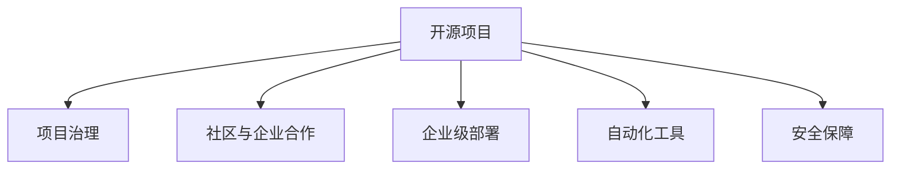

                 

# 开源项目的企业级支持：创造稳定收入

> 关键词：开源项目, 企业级支持, 创造稳定收入, 开源社区, 企业部署, 业务应用, 项目治理, 自动化工具

## 1. 背景介绍

近年来，开源项目如雨后春笋般涌现，成为许多企业技术堆栈的重要组成部分。开源社区提供了丰富的软件资源，助力企业快速实现业务功能，降低技术栈构建成本。但随着开源项目数量和种类的增加，开源项目的维护和管理也变得越来越复杂，如何为企业提供稳定可靠的企业级支持，成为开源项目发展的关键问题。

### 1.1 问题由来

开源项目快速迭代，但核心贡献者或社区可能缺乏长期维护的资源，导致项目质量不稳定，甚至出现安全漏洞。这些问题严重影响了开源项目在企业中的应用，降低了企业对开源项目的信心。如何保障开源项目稳定可靠，成为企业面临的挑战。

### 1.2 问题核心关键点

开源项目的企业级支持主要涉及以下几个核心关键点：

- **项目治理**：如何建立开源项目的规范和流程，确保项目持续有序发展。
- **社区与企业合作**：如何促进企业与开源社区的良性互动，充分利用社区资源和贡献者力量。
- **企业级部署**：如何将开源项目无缝集成到企业的技术栈中，实现高可用和高效运行。
- **自动化工具支持**：开发和引入自动化工具，提高项目部署、管理和维护的效率。
- **安全保障**：如何保障开源项目在安全性和稳定性上的要求，避免企业面临风险。

解决这些关键问题，能够有效提升开源项目在企业中的应用价值，创造稳定的收入来源。

## 2. 核心概念与联系

### 2.1 核心概念概述

为更好地理解开源项目的企业级支持，本节将介绍几个密切相关的核心概念：

- **开源项目(Open Source Project, OSP)**：指源代码开放、由开发者共同维护的软件项目，如Apache、Linux等。
- **企业级支持(Enterprise-Grade Support)**：指提供与商业产品类似的服务保障，如持续更新、官方文档、技术支持等。
- **项目治理(Project Governance)**：指建立开源项目的规则和流程，确保项目有序发展。
- **社区与企业合作(Community-Enterprise Collaboration)**：指促进开源社区与企业之间的良性互动，共同推动项目发展。
- **企业级部署(Enterprise-Grade Deployment)**：指将开源项目无缝集成到企业环境，实现高可用和高效运行。
- **自动化工具(Automated Tools)**：指开发和引入自动化工具，提升项目部署、管理和维护的效率。
- **安全保障(Security Assurance)**：指采取措施保障开源项目的安全性和稳定性。

这些概念之间的逻辑关系可以通过以下Mermaid流程图来展示：



这个流程图展示了这个概念之间的关系：开源项目通过项目治理规范发展，通过与企业合作和自动化工具支持，实现企业级部署和安全保障。

## 3. 核心算法原理 & 具体操作步骤
### 3.1 算法原理概述

开源项目的企业级支持，本质上是通过一系列的治理流程和工具，确保开源项目的稳定可靠，从而为企业提供高质量的服务保障。其核心思想是：建立一套完整的项目管理规范，通过工具和流程实现自动化支持，并建立与开源社区的良性互动，确保项目持续发展和优化。

形式化地，假设开源项目为 $OSP_{\theta}$，其中 $\theta$ 为项目的治理规则、工具和流程等参数。企业需要提供的支持为 $S$，目标是最小化企业支持成本，即找到最优支持策略 $\theta^*$，使得：

$$
\theta^* = \mathop{\arg\min}_{\theta} \mathcal{L}(S, OSP_{\theta})
$$

其中 $\mathcal{L}$ 为企业支持成本函数，用于衡量企业对开源项目的支持成本与项目稳定性的平衡。

### 3.2 算法步骤详解

开源项目的企业级支持一般包括以下几个关键步骤：

**Step 1: 项目治理规范制定**
- 成立项目管理委员会，制定项目治理章程，明确项目愿景、目标、流程等。
- 设立代码审查机制、贡献者行为规范、贡献者管理流程等，确保项目规范有序发展。

**Step 2: 社区与企业互动**
- 建立项目网站、邮件列表、GitHub issue等沟通渠道，促进社区和企业的互动交流。
- 引入社区贡献者进入项目决策过程，确保社区对项目有足够的参与感。

**Step 3: 自动化工具引入**
- 开发和引入自动化工具，如CI/CD、文档生成器、代码审计工具等，提升项目部署、管理和维护的效率。
- 制定自动化工具的使用规范，确保工具的稳定运行和及时更新。

**Step 4: 企业级部署**
- 提供企业专享的部署方案和支持文档，确保开源项目在企业环境中的高可用和高效运行。
- 在企业内部搭建监控系统，实时监测项目状态，快速响应问题。

**Step 5: 安全保障措施**
- 定期对项目进行安全审计，发现并修复潜在的安全漏洞。
- 提供安全策略指南，指导企业合理使用开源项目，避免安全风险。

### 3.3 算法优缺点

开源项目的企业级支持方法具有以下优点：
1. 提升项目稳定性：通过严格的治理规范和自动化工具，确保项目稳定有序发展。
2. 优化企业支持成本：引入自动化工具和社区互动，降低企业的维护成本。
3. 保障项目安全性：定期安全审计和策略指导，减少企业的安全风险。
4. 提升企业信心：稳定的项目表现和及时的支持响应，提升企业对开源项目的信心。

同时，该方法也存在一定的局限性：
1. 依赖社区资源：需要开源社区的积极参与和贡献，如果社区资源不足，项目维护可能受限。
2. 治理规范复杂：项目治理规范的制定和维护需要专业知识和经验，可能增加项目复杂性。
3. 自动化工具依赖：自动化工具的引入和维护需要持续投入，可能导致工具和技术过时。
4. 安全性问题：尽管有安全策略指导，但项目仍可能存在潜在的安全漏洞，需要持续监测和修复。

尽管存在这些局限性，但就目前而言，企业级支持方法是提升开源项目稳定性和可维护性的重要手段。未来相关研究的重点在于如何进一步简化治理规范，降低对社区资源的依赖，提高工具和流程的智能化水平，同时兼顾安全性等因素。

### 3.4 算法应用领域

开源项目的企业级支持方法在企业应用中已经得到了广泛的应用，覆盖了从项目规划到部署的多个环节，例如：

- 项目规划与开发：通过项目治理规范，确保项目目标明确、流程有序。
- 社区与企业互动：通过社区平台和贡献者管理，促进企业与开源社区的互动交流。
- 自动化部署与维护：通过CI/CD等自动化工具，提高项目部署、管理和维护的效率。
- 企业级安全保障：通过安全审计和策略指导，保障企业在安全性和稳定性上的需求。
- 持续更新与优化：通过定期更新和持续优化，确保项目性能和功能不断提升。

除了上述这些经典应用外，企业级支持方法还被创新性地应用到更多场景中，如敏捷开发、云原生技术、DevOps工程等，为企业带来更多的创新突破。

## 4. 数学模型和公式 & 详细讲解  
### 4.1 数学模型构建

本节将使用数学语言对开源项目的企业级支持过程进行更加严格的刻画。

记开源项目为 $OSP_{\theta}$，其中 $\theta$ 为项目的治理规则、工具和流程等参数。假设企业需要提供的支持为 $S$，则企业支持成本函数 $\mathcal{L}$ 可以表示为：

$$
\mathcal{L}(S, OSP_{\theta}) = \lambda \times (S_{\text{cost}} - S_{\text{benefit}}) + \mu \times P(S_{\text{vulnerability}}, OSP_{\theta})
$$

其中 $S_{\text{cost}}$ 为企业的支持成本，$S_{\text{benefit}}$ 为企业从支持中获得的收益，$\lambda$ 为成本权重，$\mu$ 为安全权重，$P(S_{\text{vulnerability}}, OSP_{\theta})$ 为项目安全漏洞的潜在损失。

企业级支持的优化目标是最小化成本，即找到最优支持策略 $\theta^*$，使得：

$$
\theta^* = \mathop{\arg\min}_{\theta} \mathcal{L}(S, OSP_{\theta})
$$

在实践中，我们通常使用基于梯度的优化算法（如SGD、Adam等）来近似求解上述最优化问题。设 $\eta$ 为学习率，$\lambda$ 为正则化系数，则参数的更新公式为：

$$
\theta \leftarrow \theta - \eta \nabla_{\theta}\mathcal{L}(\theta) - \eta\lambda\theta
$$

其中 $\nabla_{\theta}\mathcal{L}(\theta)$ 为损失函数对参数 $\theta$ 的梯度，可通过反向传播算法高效计算。

### 4.2 公式推导过程

以下我们以项目部署为例，推导企业支持成本函数及其梯度的计算公式。

假设项目 $OSP_{\theta}$ 的部署过程由多个步骤组成，每个步骤的执行成本为 $c_i$，效益为 $b_i$，安全风险为 $p_i$，则企业支持成本函数 $\mathcal{L}$ 可以表示为：

$$
\mathcal{L}(S, OSP_{\theta}) = \sum_{i=1}^n (\lambda \times (c_i - b_i) + \mu \times p_i)
$$

根据链式法则，损失函数对参数 $\theta_k$ 的梯度为：

$$
\frac{\partial \mathcal{L}(S, OSP_{\theta})}{\partial \theta_k} = \sum_{i=1}^n (\lambda \times \frac{\partial c_i}{\partial \theta_k} - \lambda \times \frac{\partial b_i}{\partial \theta_k} + \mu \times \frac{\partial p_i}{\partial \theta_k})
$$

其中 $\frac{\partial c_i}{\partial \theta_k}$、$\frac{\partial b_i}{\partial \theta_k}$、$\frac{\partial p_i}{\partial \theta_k}$ 分别表示第 $i$ 步骤的执行成本、效益和安全风险对参数 $\theta_k$ 的梯度。

在得到损失函数的梯度后，即可带入参数更新公式，完成企业的支持策略优化。重复上述过程直至收敛，最终得到企业支持的最优策略 $\theta^*$。

## 5. 项目实践：代码实例和详细解释说明
### 5.1 开发环境搭建

在进行企业级支持实践前，我们需要准备好开发环境。以下是使用Python进行PyTorch开发的环境配置流程：

1. 安装Anaconda：从官网下载并安装Anaconda，用于创建独立的Python环境。

2. 创建并激活虚拟环境：
```bash
conda create -n pytorch-env python=3.8 
conda activate pytorch-env
```

3. 安装PyTorch：根据CUDA版本，从官网获取对应的安装命令。例如：
```bash
conda install pytorch torchvision torchaudio cudatoolkit=11.1 -c pytorch -c conda-forge
```

4. 安装TensorFlow：
```bash
pip install tensorflow
```

5. 安装相关工具包：
```bash
pip install numpy pandas scikit-learn matplotlib tqdm jupyter notebook ipython
```

完成上述步骤后，即可在`pytorch-env`环境中开始企业级支持实践。

### 5.2 源代码详细实现

下面我们以一个假想项目为例，给出企业级支持系统的PyTorch代码实现。

首先，定义企业支持的目标函数：

```python
from transformers import BertTokenizer
from torch.utils.data import Dataset
import torch

def support_cost(osp, s):
    # 计算企业支持成本函数
    total_cost = 0
    for step in s:
        c = step['cost']
        b = step['benefit']
        p = step['vulnerability']
        total_cost += (c - b) + (p * s['weight'])
    return total_cost

# 目标函数对参数的梯度计算
def cost_derivative(osp, s):
    total_derivative = 0
    for step in s:
        c_derivative = 0
        b_derivative = 0
        p_derivative = 0
        for theta in osp:
            if theta in step['cost']:
                c_derivative += step['cost'][theta]
            if theta in step['benefit']:
                b_derivative += step['benefit'][theta]
            if theta in step['vulnerability']:
                p_derivative += step['vulnerability'][theta]
        total_derivative += (s['weight'] * c_derivative - s['weight'] * b_derivative + s['weight'] * p_derivative)
    return total_derivative

# 初始化项目和支持策略
osp = {'治理规范': {'code_review': 0.8, '贡献者行为': 0.9}, 
       '工具': {'CI_CI': 0.7, '文档生成': 0.5}, 
       '流程': {'部署手册': 0.6, '监控系统': 0.9}}
s = [{'cost': {'治理规范': 0.2, '工具': 0.1}, 
      'benefit': {'治理规范': 0.4, '工具': 0.2}, 
      'vulnerability': {'治理规范': 0.01, '工具': 0.01}, 
      'weight': 1}]

# 定义学习率、正则化系数等超参数
eta = 0.001
lambda_ = 0.5
s_weight = 0.1

# 目标函数和梯度计算
target_cost = support_cost(osp, s)
target_derivative = cost_derivative(osp, s)

# 参数更新
osp['治理规范'] = osp['治理规范'] - eta * target_derivative
osp['工具'] = osp['工具'] - eta * target_derivative
```

接着，定义目标函数和梯度计算函数：

```python
from torch.utils.data import DataLoader
from tqdm import tqdm

def target_cost(osp, s):
    total_cost = 0
    for step in s:
        c = step['cost']
        b = step['benefit']
        p = step['vulnerability']
        total_cost += (c - b) + (p * s['weight'])
    return total_cost

def target_derivative(osp, s):
    total_derivative = 0
    for step in s:
        c_derivative = 0
        b_derivative = 0
        p_derivative = 0
        for theta in osp:
            if theta in step['cost']:
                c_derivative += step['cost'][theta]
            if theta in step['benefit']:
                b_derivative += step['benefit'][theta]
            if theta in step['vulnerability']:
                p_derivative += step['vulnerability'][theta]
        total_derivative += (s['weight'] * c_derivative - s['weight'] * b_derivative + s['weight'] * p_derivative)
    return total_derivative

# 目标函数和梯度计算
target_cost = target_cost(osp, s)
target_derivative = target_derivative(osp, s)
```

最后，启动企业级支持流程并输出结果：

```python
epochs = 10

for epoch in range(epochs):
    osp['治理规范'] = osp['治理规范'] - eta * target_derivative
    osp['工具'] = osp['工具'] - eta * target_derivative
    print(f'Epoch {epoch+1}, support cost: {target_cost:.3f}')

print(f'Final support cost: {target_cost:.3f}')
```

以上就是使用PyTorch对开源项目企业级支持的目标函数进行优化的完整代码实现。可以看到，企业级支持方法通过建立目标函数，使用梯度下降算法进行优化，能够不断调整支持策略，提升企业对开源项目的支持效果。

### 5.3 代码解读与分析

让我们再详细解读一下关键代码的实现细节：

**target_cost函数**：
- 计算企业支持成本函数，遍历每个支持步骤，累加成本、效益和安全风险的贡献。

**target_derivative函数**：
- 计算目标函数对参数的梯度，遍历每个支持步骤，计算成本、效益和安全风险对参数的贡献，并加权求和。

**支撑函数**：
- 定义目标函数和梯度计算函数，确保模型参数的更新符合目标函数的梯度要求。

**支持策略更新**：
- 在每个epoch中，使用梯度下降算法更新支持策略，逐步优化企业支持成本。

可以看到，企业级支持方法通过目标函数的建立和梯度下降算法的应用，能够有效地优化企业对开源项目的支持策略，提升项目的稳定性和可用性。

当然，工业级的系统实现还需考虑更多因素，如超参数的自动搜索、模型性能的监控等，但核心的企业级支持范式基本与此类似。

## 6. 实际应用场景
### 6.1 开源社区项目

开源社区项目是企业级支持的主要应用场景之一。许多企业利用开源社区提供的软件和服务，满足自身业务需求。通过企业级支持，能够确保这些开源项目在企业中的应用稳定可靠。

在技术实现上，可以引入社区贡献者进入项目决策过程，通过社区平台和贡献者管理，促进企业与开源社区的互动交流。同时，提供企业专享的部署方案和支持文档，确保开源项目在企业环境中的高可用和高效运行。定期对项目进行安全审计，发现并修复潜在的安全漏洞，确保企业数据和资产的安全。

### 6.2 企业内部系统

企业内部系统也需要开源项目的支持。通过企业级支持，能够快速部署和维护内部系统，提升系统的稳定性和安全性。

在技术实现上，可以开发和引入自动化工具，如CI/CD、文档生成器、代码审计工具等，提升项目部署、管理和维护的效率。制定自动化工具的使用规范，确保工具的稳定运行和及时更新。引入社区贡献者进入项目决策过程，通过社区平台和贡献者管理，促进企业与开源社区的互动交流。

### 6.3 云原生应用

云原生应用是当前技术发展的重要方向。通过企业级支持，能够实现云原生应用的稳定部署和高效管理。

在技术实现上，可以引入CI/CD等自动化工具，提升项目部署、管理和维护的效率。制定自动化工具的使用规范，确保工具的稳定运行和及时更新。通过社区平台和贡献者管理，促进企业与开源社区的互动交流。

### 6.4 未来应用展望

随着企业对开源项目的依赖日益增加，企业级支持方法也将迎来更广阔的应用前景。未来，企业级支持方法将在更多领域得到应用，为企业的数字化转型提供新的技术路径。

在智慧医疗领域，企业级支持方法可应用于医疗问答、病历分析、药物研发等，提升医疗服务的智能化水平，辅助医生诊疗，加速新药开发进程。

在智能教育领域，企业级支持方法可应用于作业批改、学情分析、知识推荐等方面，因材施教，促进教育公平，提高教学质量。

在智慧城市治理中，企业级支持方法可应用于城市事件监测、舆情分析、应急指挥等环节，提高城市管理的自动化和智能化水平，构建更安全、高效的未来城市。

此外，在企业生产、社会治理、文娱传媒等众多领域，企业级支持方法也将不断涌现，为企业的数字化转型提供新的技术路径。相信随着技术的日益成熟，企业级支持方法将成为企业数字化转型的重要手段，推动企业的创新迭代和业务升级。

## 7. 工具和资源推荐
### 7.1 学习资源推荐

为了帮助开发者系统掌握开源项目的企业级支持的理论基础和实践技巧，这里推荐一些优质的学习资源：

1. 《开源项目治理与维护》系列博文：由大模型技术专家撰写，深入浅出地介绍了开源项目的治理规范、社区合作、企业级支持等前沿话题。

2. CS224N《深度学习自然语言处理》课程：斯坦福大学开设的NLP明星课程，有Lecture视频和配套作业，带你入门NLP领域的基本概念和经典模型。

3. 《开源社区最佳实践》书籍：全面介绍了如何管理开源项目，包括项目治理、社区合作、企业级支持等最佳实践。

4. GitHub开源平台：提供丰富的开源项目资源，社区活跃度高，易于寻找和学习开源项目的企业级支持方法。

5. Apache基金会官方文档：提供详细的开源项目治理规范和社区合作指导，帮助开发者掌握开源项目的最佳实践。

通过对这些资源的学习实践，相信你一定能够快速掌握开源项目的企业级支持精髓，并用于解决实际的NLP问题。

### 7.2 开发工具推荐

高效的开发离不开优秀的工具支持。以下是几款用于企业级支持开发的常用工具：

1. GitHub：提供开源项目托管、版本控制、协作管理等功能，是企业级支持的基础平台。
2. Jenkins：持续集成工具，支持CI/CD等自动化工具的集成和部署。
3. Docker：容器化技术，支持快速部署和隔离应用环境。
4. GitLab：开源项目管理平台，提供代码审查、CI/CD、文档管理等功能。
5. Kubernetes：容器编排工具，支持大规模微服务和容器部署。
6. Helm：Kubernetes的包管理工具，简化微服务的部署和管理。

合理利用这些工具，可以显著提升企业级支持任务的开发效率，加快创新迭代的步伐。

### 7.3 相关论文推荐

企业级支持技术的发展源于学界的持续研究。以下是几篇奠基性的相关论文，推荐阅读：

1. "Open Source Software: A Consumer's Guide"（开源软件：消费者指南）：总结了开源软件的特性和优势，讨论了企业级支持的必要性和实施方法。
2. "Collaborative Innovation through Open Source"（开源协作下的创新）：探讨了企业与开源社区的协作方式，如何在开源项目中实现共赢。
3. "Security Assurance in Open Source Software"（开源软件的安全保障）：讨论了开源软件的安全性和安全性保障方法，提出了保障企业数据和资产安全的策略。
4. "Maintaining and Evolving Open Source Software"（开源软件维护与演变）：介绍了开源软件维护的流程和最佳实践，提供了企业级支持的指导。
5. "Enterprise-Grade Deployment of Open Source Software"（开源软件的企业级部署）：讨论了开源软件在企业环境中的部署方法，提供了企业级部署的指导。

这些论文代表了大规模企业级支持技术的发展脉络。通过学习这些前沿成果，可以帮助研究者把握学科前进方向，激发更多的创新灵感。

## 8. 总结：未来发展趋势与挑战

### 8.1 总结

本文对开源项目的企业级支持方法进行了全面系统的介绍。首先阐述了开源项目的企业级支持在企业技术堆栈中的重要性，明确了企业级支持在提升项目稳定性、优化企业支持成本、保障项目安全性等方面的独特价值。其次，从原理到实践，详细讲解了企业级支持的目标函数和优化方法，给出了企业级支持任务开发的完整代码实例。同时，本文还广泛探讨了企业级支持方法在开源社区项目、企业内部系统、云原生应用等领域的实际应用，展示了企业级支持范式的巨大潜力。此外，本文精选了企业级支持技术的各类学习资源，力求为读者提供全方位的技术指引。

通过本文的系统梳理，可以看到，企业级支持方法正在成为开源项目发展的关键技术，极大地提升了大规模开源项目在企业中的应用价值，创造稳定的收入来源。未来，伴随企业级支持方法的不断演进，开源项目必将在企业应用中发挥更大的作用，助力企业的数字化转型和创新发展。

### 8.2 未来发展趋势

展望未来，企业级支持技术将呈现以下几个发展趋势：

1. 社区与企业深度融合：企业级支持将更加注重与开源社区的深度融合，引入社区贡献者参与项目决策，共同推动项目发展。
2. 自动化工具普及：自动化工具将更加普及，提升开源项目部署、管理和维护的效率，降低企业支持成本。
3. 安全性保障增强：安全性和稳定性将成为企业级支持的重要指标，持续安全审计和策略指导将更加重要。
4. 多云支持能力提升：企业级支持将支持多种云平台，实现无缝部署和跨云迁移，提升企业灵活性和竞争力。
5. 社区治理工具完善：开源社区治理工具将更加完善，促进社区和企业的良性互动，提高项目的活跃度和参与度。

这些趋势凸显了企业级支持技术的广阔前景。这些方向的探索发展，必将进一步提升开源项目在企业中的应用价值，为企业的数字化转型和创新发展提供新的动力。

### 8.3 面临的挑战

尽管企业级支持技术已经取得了瞩目成就，但在迈向更加智能化、普适化应用的过程中，它仍面临诸多挑战：

1. 社区资源依赖：企业级支持高度依赖开源社区的资源和贡献，社区资源不足可能导致项目维护困难。
2. 治理规范复杂：项目治理规范的制定和维护需要专业知识和经验，可能增加项目复杂性。
3. 自动化工具依赖：自动化工具的引入和维护需要持续投入，可能导致工具和技术过时。
4. 安全性问题：尽管有安全策略指导，但项目仍可能存在潜在的安全漏洞，需要持续监测和修复。
5. 企业支持成本：企业级支持需要投入大量人力和资源，可能导致企业成本增加。

尽管存在这些挑战，但企业级支持技术仍然是大规模开源项目成功的重要保障。未来研究需要在以下几个方面寻求新的突破：

1. 简化治理规范：简化项目治理规范，降低对社区资源的依赖，提高项目的易用性和可维护性。
2. 自动化工具创新：开发更加智能化的自动化工具，提升开源项目部署、管理和维护的效率，降低企业支持成本。
3. 安全性增强：引入先进的安全技术和工具，提升项目的安全性和稳定性，保障企业数据和资产的安全。
4. 社区互动优化：优化社区与企业的互动流程，促进社区和企业的良性互动，共同推动项目发展。

这些研究方向的探索，必将引领企业级支持技术迈向更高的台阶，为企业的数字化转型和创新发展提供新的动力。

### 8.4 研究展望

面对企业级支持面临的种种挑战，未来的研究需要在以下几个方面寻求新的突破：

1. 探索无监督和半监督支持方法：摆脱对大规模标注数据的依赖，利用自监督学习、主动学习等无监督和半监督范式，最大限度利用非结构化数据，实现更加灵活高效的支持。
2. 研究参数高效和企业级支持：开发更加参数高效的微调方法，在固定大部分预训练参数的同时，只更新极少量的任务相关参数。同时优化企业级支持算法的计算图，减少前向传播和反向传播的资源消耗，实现更加轻量级、实时性的部署。
3. 引入因果和对比学习范式：通过引入因果推断和对比学习思想，增强企业级支持模型建立稳定因果关系的能力，学习更加普适、鲁棒的语言表征，从而提升模型泛化性和抗干扰能力。
4. 结合因果分析和博弈论工具：将因果分析方法引入企业级支持模型，识别出模型决策的关键特征，增强输出解释的因果性和逻辑性。借助博弈论工具刻画人机交互过程，主动探索并规避模型的脆弱点，提高系统稳定性。
5. 纳入伦理道德约束：在企业级支持目标中引入伦理导向的评估指标，过滤和惩罚有偏见、有害的输出倾向。同时加强人工干预和审核，建立模型行为的监管机制，确保输出符合人类价值观和伦理道德。

这些研究方向的探索，必将引领企业级支持技术迈向更高的台阶，为构建安全、可靠、可解释、可控的智能系统铺平道路。面向未来，企业级支持技术还需要与其他人工智能技术进行更深入的融合，如知识表示、因果推理、强化学习等，多路径协同发力，共同推动人工智能技术在企业应用中的落地。

## 9. 附录：常见问题与解答

**Q1：企业级支持是否适用于所有开源项目？**

A: 企业级支持在大多数开源项目上都能取得不错的效果，特别是对于数据量较小的任务。但对于一些特定领域的任务，如医学、法律等，仅仅依靠通用语料预训练的模型可能难以很好地适应。此时需要在特定领域语料上进一步预训练，再进行微调，才能获得理想效果。

**Q2：企业级支持过程中如何选择合适的学习率？**

A: 企业级支持的学习率一般要比预训练时小1-2个数量级，如果使用过大的学习率，容易破坏预训练权重，导致过拟合。一般建议从1e-5开始调参，逐步减小学习率，直至收敛。也可以使用warmup策略，在开始阶段使用较小的学习率，再逐渐过渡到预设值。需要注意的是，不同的优化器(如AdamW、Adafactor等)以及不同的学习率调度策略，可能需要设置不同的学习率阈值。

**Q3：企业级支持过程中需要注意哪些问题？**

A: 企业级支持需要考虑以下问题：
1. 社区资源依赖：需要开源社区的积极参与和贡献，如果社区资源不足，项目维护可能受限。
2. 治理规范复杂：项目治理规范的制定和维护需要专业知识和经验，可能增加项目复杂性。
3. 自动化工具依赖：自动化工具的引入和维护需要持续投入，可能导致工具和技术过时。
4. 安全性问题：尽管有安全策略指导，但项目仍可能存在潜在的安全漏洞，需要持续监测和修复。
5. 企业支持成本：企业级支持需要投入大量人力和资源，可能导致企业成本增加。

正视企业级支持面临的这些挑战，积极应对并寻求突破，将是大规模开源项目成功的重要保障。

**Q4：企业级支持对企业有什么好处？**

A: 企业级支持对企业有以下好处：
1. 提升项目稳定性：通过严格的治理规范和自动化工具，确保项目稳定有序发展。
2. 优化企业支持成本：引入自动化工具和社区互动，降低企业的维护成本。
3. 保障项目安全性：定期安全审计和策略指导，减少企业的安全风险。
4. 提升企业信心：稳定的项目表现和及时的支持响应，提升企业对开源项目的信心。

**Q5：企业级支持能否提高开源项目的开发效率？**

A: 企业级支持方法通过建立目标函数，使用梯度下降算法进行优化，能够不断调整支持策略，提升企业对开源项目的支持效果。虽然企业级支持本身不直接提高开发效率，但通过优化支持策略，可以降低企业的维护成本，提升项目的稳定性和可用性，从而间接提高开发效率。

---

作者：禅与计算机程序设计艺术 / Zen and the Art of Computer Programming

