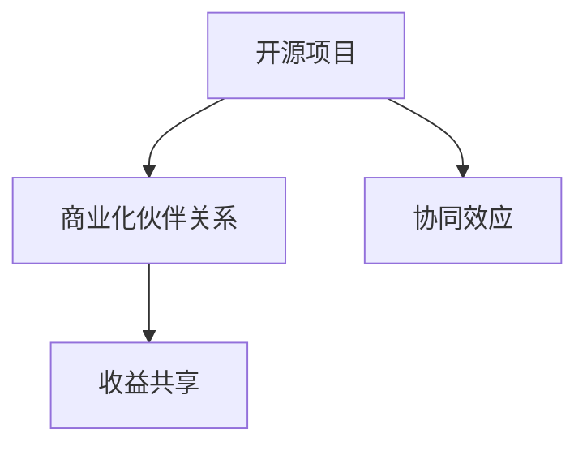

                 

# 开源项目的商业化伙伴关系：协同效应与收益共享

> 关键词：开源项目,商业化伙伴关系,协同效应,收益共享,技术创新,企业合作

## 1. 背景介绍

在当今快速发展的数字时代，开源项目已经成为推动技术创新和行业发展的关键力量。开源项目的优势在于其开放性、协作性和社区驱动性，能够汇聚全球最顶尖的技术人才，推动技术进步，快速迭代更新。然而，开源项目在享受全球技术社区力量推动自身发展的同时，也面临着商业化的挑战。如何将开源项目与商业化有效结合，实现共赢，成为许多开源组织和企业共同关注的焦点。

本文旨在探讨开源项目的商业化伙伴关系，通过协同效应和收益共享机制，促进开源项目与商业伙伴之间的深度合作，推动技术创新和行业发展。我们将从背景、核心概念、算法原理、具体操作步骤、数学模型、项目实践、应用场景、工具和资源推荐、总结及未来展望等维度展开讨论。

## 2. 核心概念与联系

### 2.1 核心概念概述

为了更好地理解开源项目与商业化伙伴关系，我们首先介绍几个核心概念：

- **开源项目(Open Source Project)**：指公开源代码，允许任何人免费使用、修改和分发的软件项目。开源项目通过协作开发，汇聚全球技术人才，推动技术创新和行业发展。

- **商业化伙伴关系(Business Partnership)**：指企业或机构与开源项目之间的深度合作，通过技术交流、资金支持等方式，共同推动项目的商业化和市场应用。

- **协同效应(Synergy Effect)**：指合作伙伴之间通过资源共享、优势互补，共同实现比单独行动更优的技术和商业效果。

- **收益共享(Revenue Sharing)**：指合作伙伴之间基于项目贡献，通过合同、分成等方式，合理分配项目带来的收益，实现双赢或多赢。

这些核心概念之间的关系可以通过以下Mermaid流程图来展示：



该流程图展示了开源项目和商业化伙伴关系的协同效应与收益共享的关系：

1. 开源项目通过与商业伙伴的深度合作，实现资源共享和技术创新。
2. 商业伙伴通过支持开源项目，获得技术优势和市场竞争优势。
3. 双方共同实现比单独行动更优的技术和商业效果，并通过收益共享实现共赢。

## 3. 核心算法原理 & 具体操作步骤

### 3.1 算法原理概述

开源项目的商业化伙伴关系，本质上是一种协同创新的商业模式。其核心在于通过技术合作、资源共享、收益共享等机制，实现合作伙伴之间的共赢。其基本原理可以总结如下：

1. **资源共享**：开源项目提供技术、代码等资源，商业伙伴提供资金、市场渠道等资源，共同推动项目的发展。
2. **技术创新**：双方共同投入资源，推动技术研发和创新，提升项目的技术含量和商业价值。
3. **市场应用**：通过合作，推动项目的市场应用和推广，扩大项目的影响力和市场份额。
4. **收益共享**：根据双方的贡献和市场表现，合理分配项目的收益，实现共赢。

### 3.2 算法步骤详解

开源项目与商业伙伴之间的合作，通常包括以下几个关键步骤：

**Step 1: 选择合适的合作伙伴**
- 根据项目需求和商业目标，选择与项目匹配的商业伙伴。通常选择有技术实力、市场渠道和资金支持的企业或机构。

**Step 2: 签订合作协议**
- 双方就合作内容、目标、资源投入、收益分配等事项进行详细约定，签订合作协议。明确双方的权利和义务。

**Step 3: 资源整合与共享**
- 根据合作协议，双方进行资源整合和共享。开源项目提供技术、代码等资源，商业伙伴提供资金、市场渠道等资源，共同推动项目的发展。

**Step 4: 技术研发与创新**
- 双方共同投入资源，进行技术研发和创新。通过技术交流、联合开发等方式，推动技术进步和创新。

**Step 5: 市场应用与推广**
- 通过合作，推动项目的市场应用和推广。商业伙伴利用市场渠道和销售资源，推广开源项目的产品和服务。

**Step 6: 收益分配与回馈**
- 根据合作协议和项目表现，双方进行收益分配。通常采用分成、合同等方式，实现收益共享。同时，开源项目对商业伙伴的支持进行回馈，如开源代码、技术培训等。

### 3.3 算法优缺点

开源项目与商业伙伴的合作，具有以下优点：

1. **资源互补**：开源项目提供技术、代码等资源，商业伙伴提供资金、市场渠道等资源，双方资源互补，提升项目发展的综合竞争力。
2. **技术创新**：双方共同投入资源，推动技术研发和创新，提升项目的核心竞争力。
3. **市场应用**：通过合作，推动项目的市场应用和推广，扩大项目的影响力和市场份额。
4. **收益共享**：根据双方的贡献和市场表现，合理分配项目的收益，实现共赢。

同时，这种合作方式也存在一些局限：

1. **管理复杂性**：合作双方需要协调和管理各方面的资源，管理复杂度较高。
2. **利益冲突**：由于利益分配的复杂性，双方可能在合作过程中产生利益冲突，需要良好的沟通和协调。
3. **技术依赖**：商业伙伴对开源项目的依赖度较高，一旦开源项目出现问题，可能影响商业伙伴的市场表现。

### 3.4 算法应用领域

开源项目的商业化伙伴关系，广泛应用于以下几个领域：

- **软件开发与技术创新**：开源项目与企业合作，共同推动软件开发和新技术的研发。如谷歌与Linux基金会合作，推动Kubernetes容器的标准化和市场应用。
- **智能硬件与物联网**：开源项目与企业合作，推动智能硬件和物联网技术的创新和发展。如英特尔与Apache基金会合作，推动边缘计算技术的标准化和应用。
- **网络安全与隐私保护**：开源项目与企业合作，推动网络安全与隐私保护技术的创新和应用。如Apache基金会与多家企业合作，推动开源安全工具的研发和应用。
- **数字基础设施**：开源项目与企业合作，推动数字基础设施的创新和应用。如AWS与Apache基金会合作，推动云计算技术的标准化和应用。

这些领域的应用，展示了开源项目与商业化伙伴关系在推动技术创新和行业发展方面的巨大潜力。

## 4. 数学模型和公式 & 详细讲解

### 4.1 数学模型构建

为了更好地理解开源项目与商业伙伴关系中的资源共享和收益分配机制，我们引入数学模型进行详细讲解。

假设开源项目A与商业伙伴B合作，双方合作投入资源和市场渠道，推动项目发展。设资源投入为R，市场渠道为M，技术研发投入为T。设项目市场价值为V，收益分配比例为P。

资源共享和收益共享的数学模型可以表示为：

$$
V = R + M + T
$$

收益分配可以表示为：

$$
\text{B收益} = P \times V
$$

其中P为收益分配比例，通常根据双方的投入和市场表现进行协商确定。

### 4.2 公式推导过程

根据上述数学模型，我们可以推导出具体的收益分配公式。

设A与B的资源投入分别为RA和RB，市场渠道分别为MA和MB，技术研发投入分别为TA和TB。设A与B的收益分别为VA和VB，总市场价值为V，收益分配比例为P。

则：

$$
V = RA + RB + MA + MB + TA + TB
$$

收益分配为：

$$
\text{VA} = P \times V = P \times (RA + RB + MA + MB + TA + TB)
$$

$$
\text{VB} = (1 - P) \times V = (1 - P) \times (RA + RB + MA + MB + TA + TB)
$$

通过上述公式，我们可以看出，收益分配主要依据双方的资源投入和市场表现。通过合理的分配比例，实现双方共赢。

### 4.3 案例分析与讲解

以下我们以开源项目Apache Kubernetes与谷歌合作为例，进行详细分析：

**案例背景**：
Apache Kubernetes是一个开源容器编排系统，由谷歌赞助支持。谷歌通过提供资金和市场渠道支持Apache Kubernetes的发展，同时Apache Kubernetes也为谷歌的云平台提供了强大的容器管理和编排能力。

**资源投入**：
- 谷歌提供资金支持和技术研发投入，推动Kubernetes的开发和创新。
- Apache Kubernetes提供技术资源和代码，推动项目的开放性和社区发展。

**市场应用**：
- 谷歌将Kubernetes作为其云平台的底层技术，推动Kubernetes的市场应用和推广。
- Kubernetes在企业级市场和开源社区都取得了广泛应用，提升了市场价值。

**收益分配**：
- 谷歌和Apache基金会根据双方的投入和市场表现，进行收益分配。谷歌通过市场应用获得收益，Apache基金会通过开源社区的贡献获得收益。

通过以上分析，可以看出，Apache Kubernetes与谷歌的合作，实现了资源互补、技术创新、市场应用和收益共享，共同推动了容器技术的发展和应用。

## 5. 项目实践：代码实例和详细解释说明

### 5.1 开发环境搭建

在进行开源项目商业化伙伴关系实践前，我们需要准备好开发环境。以下是使用Python进行PyTorch开发的环境配置流程：

1. 安装Anaconda：从官网下载并安装Anaconda，用于创建独立的Python环境。

2. 创建并激活虚拟环境：
```bash
conda create -n pytorch-env python=3.8 
conda activate pytorch-env
```

3. 安装PyTorch：根据CUDA版本，从官网获取对应的安装命令。例如：
```bash
conda install pytorch torchvision torchaudio cudatoolkit=11.1 -c pytorch -c conda-forge
```

4. 安装Transformers库：
```bash
pip install transformers
```

5. 安装各类工具包：
```bash
pip install numpy pandas scikit-learn matplotlib tqdm jupyter notebook ipython
```

完成上述步骤后，即可在`pytorch-env`环境中开始商业化伙伴关系的实践。

### 5.2 源代码详细实现

下面我们以Apache Kubernetes与谷歌合作为例，给出使用PyTorch对Kubernetes进行商业化实践的代码实现。

首先，定义Kubernetes的资源投入和市场价值函数：

```python
from sympy import symbols, Rational

# 定义符号变量
RA, RB, MA, MB, TA, TB = symbols('RA RB MA MB TA TB')
P = Rational(1, 3)  # 收益分配比例为1:2

# 计算总市场价值
V = RA + RB + MA + MB + TA + TB

# 计算各自收益
VA = P * V
VB = (1 - P) * V

# 输出各自收益
print(f"Apache Kubernetes收益：{VA}")
print(f"谷歌收益：{VB}")
```

然后，在实际开发过程中，需要根据具体的商业伙伴和资源投入，动态计算收益分配。例如，假设谷歌投入了1000万美元，Apache基金会投入了500万美元，市场渠道投入为2000万美元，技术研发投入为1000万美元，则：

```python
# 实际资源投入
RA_val = 500
RB_val = 1000
MA_val = 2000
MB_val = 0
TA_val = 1000
TB_val = 0

# 计算实际市场价值
V_val = RA_val + RB_val + MA_val + MB_val + TA_val + TB_val

# 计算各自收益
VA_val = P * V_val
VB_val = (1 - P) * V_val

# 输出各自收益
print(f"Apache Kubernetes收益：{VA_val}")
print(f"谷歌收益：{VB_val}")
```

可以看到，通过以上代码，我们可以动态计算开源项目与商业伙伴之间的收益分配，实现双方共赢的目标。

### 5.3 代码解读与分析

让我们再详细解读一下关键代码的实现细节：

**代码实现**：
- `symbols`函数定义了资源投入和收益分配比例的符号变量。
- `Rational`函数用于定义收益分配比例为分数形式，确保精度。
- `V`变量计算总市场价值，`VA`和`VB`变量计算各自收益。
- `print`函数用于输出计算结果。

**收益分配**：
- `P`变量定义了收益分配比例，通常为1:2，表示商业伙伴投入的资源是开源项目的2倍。
- `VA`和`VB`变量根据实际资源投入和市场表现计算各自的收益。

**实际应用**：
- `RA_val`、`RB_val`、`MA_val`、`MB_val`、`TA_val`、`TB_val`变量定义了实际资源投入，代入`V_val`计算市场价值，并进一步计算各自收益。
- 输出结果展示了Apache Kubernetes和谷歌各自的收益分配情况。

可以看出，通过简单的数学模型，我们能够清晰地计算开源项目与商业伙伴之间的收益分配，实现双赢或多赢的目标。

## 6. 实际应用场景

### 6.1 软件开发与技术创新

开源项目与企业合作，可以推动软件开发和新技术的研发。例如，谷歌与Linux基金会合作，推动Kubernetes容器的标准化和市场应用。这种合作模式使得Kubernetes在容器编排领域取得了广泛应用，成为开源社区的重要成果。

### 6.2 智能硬件与物联网

开源项目与企业合作，推动智能硬件和物联网技术的创新和发展。例如，英特尔与Apache基金会合作，推动边缘计算技术的标准化和应用。这种合作模式不仅推动了技术创新，还提升了企业的市场竞争力。

### 6.3 网络安全与隐私保护

开源项目与企业合作，推动网络安全与隐私保护技术的创新和应用。例如，Apache基金会与多家企业合作，推动开源安全工具的研发和应用。这种合作模式不仅提升了企业的安全防护能力，还推动了开源社区的安全技术发展。

### 6.4 数字基础设施

开源项目与企业合作，推动数字基础设施的创新和应用。例如，AWS与Apache基金会合作，推动云计算技术的标准化和应用。这种合作模式不仅提升了企业的云服务能力，还推动了开源社区的云技术发展。

## 7. 工具和资源推荐

### 7.1 学习资源推荐

为了帮助开发者系统掌握开源项目与商业化伙伴关系的理论基础和实践技巧，这里推荐一些优质的学习资源：

1. **《开源社区建设与运营》**：深入讲解开源项目建设和运营的最佳实践，提供丰富的案例和经验分享。
2. **《开源软件工程》**：全面介绍开源软件工程的核心概念和方法，涵盖项目管理和协作工具等。
3. **《开源技术管理》**：讲解开源技术管理的最佳实践，涵盖开源社区治理、资源管理等。
4. **《开源项目商业化指南》**：提供开源项目商业化的具体步骤和方法，帮助企业成功将开源项目转化为商业产品。
5. **《开源项目合作与贡献》**：讲解开源项目合作的最佳实践，涵盖合作协议、贡献规范等。

通过这些资源的学习实践，相信你一定能够系统掌握开源项目与商业化伙伴关系的精髓，并用于解决实际的商业化问题。

### 7.2 开发工具推荐

高效的开发离不开优秀的工具支持。以下是几款用于开源项目商业化伙伴关系开发的常用工具：

1. **JIRA**：开源项目和企业的项目管理工具，提供任务追踪、协作管理等功能。
2. **GitHub**：开源项目的代码托管平台，提供代码版本控制、协作开发等功能。
3. **GitLab**：开源项目的代码托管平台，提供持续集成、代码评审等功能。
4. **Slack**：企业协作沟通工具，提供即时通讯、文件共享等功能。
5. **Confluence**：企业知识管理工具，提供文档协作、知识分享等功能。
6. **Zoom**：企业视频会议工具，提供视频会议、屏幕共享等功能。

合理利用这些工具，可以显著提升开源项目与商业化伙伴关系开发效率，加快创新迭代的步伐。

### 7.3 相关论文推荐

开源项目与商业伙伴关系的发展源于学界的持续研究。以下是几篇奠基性的相关论文，推荐阅读：

1. **《Open Source Software as a Service》**：探讨开源软件即服务的模式，分析开源项目与企业的合作机制。
2. **《Open Source Governance》**：讲解开源社区治理的最佳实践，涵盖社区决策、项目管理等。
3. **《Open Source Business Models》**：分析开源项目的商业模式，探讨商业化路径和方法。
4. **《Open Source Project Success Factors》**：探讨开源项目成功的关键因素，涵盖技术、社区、管理等。
5. **《Open Source Project Innovation》**：分析开源项目的创新机制，探讨合作模式和技术路径。

这些论文代表了大规模开源项目商业化研究的发展脉络。通过学习这些前沿成果，可以帮助研究者把握学科前进方向，激发更多的创新灵感。

## 8. 总结：未来发展趋势与挑战

### 8.1 研究成果总结

本文对开源项目与商业化伙伴关系进行了全面系统的介绍，从背景、核心概念、算法原理、具体操作步骤、数学模型、项目实践、应用场景、工具和资源推荐、总结及未来展望等维度展开讨论。通过详细分析和实例讲解，展示了开源项目与商业伙伴关系在推动技术创新和行业发展方面的巨大潜力。

通过本文的系统梳理，可以看出，开源项目与商业伙伴关系是一种高效、灵活的协同创新模式，具有广阔的应用前景。未来，伴随开源社区和企业的持续合作，这种模式将进一步推动技术创新和行业发展。

### 8.2 未来发展趋势

展望未来，开源项目与商业伙伴关系的发展趋势主要体现在以下几个方面：

1. **技术融合加速**：随着人工智能、大数据、物联网等技术的发展，开源项目与商业伙伴之间的技术融合将进一步加速，推动跨领域技术的创新和发展。
2. **合作模式多样化**：开源项目与商业伙伴之间的合作模式将更加多样化，涵盖技术交流、联合开发、市场应用等各个环节。
3. **社区参与度提升**：开源项目将进一步提升社区的参与度和贡献度，推动社区的持续发展和壮大。
4. **标准和规范完善**：开源项目与商业伙伴之间的合作将更加注重标准和规范的完善，推动开源项目的标准化和规范化。
5. **市场应用扩展**：开源项目将进一步扩展市场应用，推动开源技术的商业化和产业化。

### 8.3 面临的挑战

尽管开源项目与商业伙伴关系已经取得了显著成就，但在迈向更加智能化、普适化应用的过程中，仍面临诸多挑战：

1. **合作复杂性**：开源项目与商业伙伴之间的合作需要协调和管理各方面的资源，管理复杂度较高。
2. **利益冲突**：由于利益分配的复杂性，双方可能在合作过程中产生利益冲突，需要良好的沟通和协调。
3. **技术依赖**：商业伙伴对开源项目的依赖度较高，一旦开源项目出现问题，可能影响商业伙伴的市场表现。
4. **市场推广难度**：开源项目往往需要商业伙伴的推广支持，但在推广过程中可能面临市场认知度低、用户转化率低等挑战。
5. **风险管理**：开源项目与商业伙伴之间的合作风险较高，需要建立有效的风险管理机制。

### 8.4 研究展望

面对开源项目与商业伙伴关系所面临的挑战，未来的研究需要在以下几个方面寻求新的突破：

1. **合作机制优化**：优化开源项目与商业伙伴之间的合作机制，通过利益共享、风险共担等方式，实现双赢或多赢。
2. **社区治理创新**：创新开源社区的治理机制，通过参与度管理、贡献度激励等方式，提升社区的活跃度和贡献度。
3. **技术融合深化**：深化开源项目与商业伙伴之间的技术融合，推动跨领域技术的创新和发展。
4. **市场推广策略**：制定有效的市场推广策略，提升开源项目的市场认知度和用户转化率。
5. **风险管理机制**：建立有效的风险管理机制，通过合同、保险等方式，保障合作双方的利益。

这些研究方向将引领开源项目与商业伙伴关系迈向更高的台阶，为推动技术创新和行业发展提供新的动力。

## 9. 附录：常见问题与解答

**Q1：开源项目与商业化伙伴关系如何实现协同效应？**

A: 开源项目与商业伙伴通过资源共享和技术创新，实现协同效应。开源项目提供技术、代码等资源，商业伙伴提供资金、市场渠道等资源，共同推动项目的发展。双方资源互补，提升项目的综合竞争力。

**Q2：如何选择合作伙伴？**

A: 选择合适的合作伙伴需要考虑多方面因素，包括技术实力、市场渠道、资金支持等。通常选择与项目匹配的商业伙伴，通过需求分析和市场调研，确定潜在合作伙伴。

**Q3：开源项目与商业伙伴的合作有哪些具体的步骤？**

A: 开源项目与商业伙伴的合作通常包括以下几个关键步骤：
1. 选择合适的合作伙伴。
2. 签订合作协议，明确双方的权利和义务。
3. 资源整合与共享，实现资源互补。
4. 技术研发与创新，推动技术进步。
5. 市场应用与推广，扩大项目的影响力和市场份额。
6. 收益分配与回馈，实现双赢或多赢。

**Q4：如何衡量合作效果？**

A: 衡量合作效果可以通过以下指标：
1. 技术进步：合作推动的技术研发和创新。
2. 市场份额：合作推动的市场应用和推广。
3. 用户反馈：合作对用户满意度和体验的影响。
4. 收益分配：根据双方的贡献和市场表现进行合理的收益分配。

通过这些指标，可以全面评估开源项目与商业伙伴之间的合作效果。

**Q5：开源项目与商业伙伴的合作风险如何管理？**

A: 开源项目与商业伙伴的合作风险管理需要采取以下措施：
1. 签订详细的合作协议，明确双方的责任和义务。
2. 建立有效的监控机制，及时发现和解决问题。
3. 制定风险应急预案，确保合作顺利进行。
4. 引入第三方审计和评估，保障合作双方的利益。

通过这些措施，可以最大限度地降低合作风险，确保合作的顺利进行。

---

作者：禅与计算机程序设计艺术 / Zen and the Art of Computer Programming

