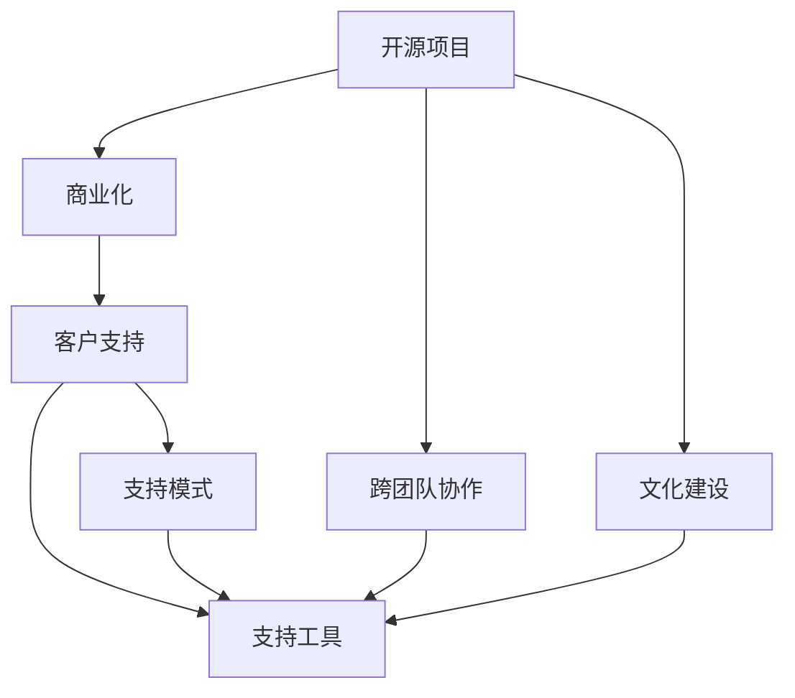

                 

# 开源项目的商业化客户支持：支持模式和工具

> 关键词：开源项目，商业化，客户支持，支持模式，工具

## 1. 背景介绍

### 1.1 问题由来
随着开源社区的蓬勃发展，越来越多的企业开始参与开源项目，利用开源生态推动自身技术迭代和创新。开源项目不仅在提升企业研发效率、加速产品开发等方面带来了显著效益，也为外部开发者提供了贡献代码、实现社区协作的平台。然而，随着开源项目的规模不断扩大，如何高效地管理开源社区和项目，为商业化客户提供优质的技术支持，成为各大企业面临的新挑战。

特别是在开源项目走向商业化的过程中，客户支持和维护成为提升客户满意度和保障商业利益的关键环节。如何构建一套高效、可靠、低成本的技术支持模式，成为了开源项目商业化的重要课题。

### 1.2 问题核心关键点
开源项目的商业化客户支持涉及以下几个核心关键点：
1. **客户群体分析**：确定目标客户群体，分析其需求、痛点和习惯，以便制定合理的支持策略。
2. **支持模式设计**：根据客户群体特点和项目特性，选择合适的技术支持模式，如社区支持、付费支持等。
3. **工具与平台建设**：构建集成的技术支持工具和平台，简化流程，提升效率。
4. **数据与分析**：收集和分析客户反馈和支持数据，持续优化支持策略。
5. **跨团队协作**：促进开发、运维和支持团队之间的协作，确保问题的快速解决。
6. **文化建设**：在企业内部培养开放、共享和协作的文化，鼓励开源贡献和支持行为。

本文将从客户支持模式、工具建设和文化建设三个方面，深入探讨开源项目的商业化客户支持策略和实践。

## 2. 核心概念与联系

### 2.1 核心概念概述

为更好地理解开源项目的商业化客户支持，本节将介绍几个密切相关的核心概念：

- **开源项目（Open Source Project）**：由开发者共同维护、共享代码、遵守开源协议的计算机软件项目。常见的开源协议包括Apache、MIT、GPL等。
- **商业化（Commercialization）**：将开源项目中的技术或解决方案商业化，实现商业价值的过程。包括但不限于销售产品、提供服务、获得投资等。
- **客户支持（Customer Support）**：为客户提供技术咨询、问题解决、文档编写等支持服务，确保客户能够成功使用产品或服务。
- **支持模式（Support Model）**：客户支持的技术实现方式，包括社区支持、付费支持、混合支持等。
- **支持工具（Support Tools）**：用于客户支持和维护的工具集，如票务系统、协作平台、文档管理系统等。
- **跨团队协作（Cross-Team Collaboration）**：开发、运维和支持团队之间的信息共享和协同工作。
- **文化建设（Culture Building）**：在企业内部建立和推广开源文化，鼓励开发者和工程师参与开源社区。

这些核心概念之间的逻辑关系可以通过以下Mermaid流程图来展示：



这个流程图展示了一些关键概念及其之间的联系：

1. 开源项目通过商业化转化为商业价值，随后需要为客户提供支持服务。
2. 支持模式和支持工具是客户支持的核心技术实现方式。
3. 跨团队协作和文化建设是支持模式和工具有效运行的基础保障。

这些概念共同构成了开源项目商业化客户支持的框架，使其能够在商业化过程中提供有效的技术支持服务。

## 3. 核心算法原理 & 具体操作步骤
### 3.1 算法原理概述

开源项目的商业化客户支持，本质上是利用技术手段，针对不同的客户需求和痛点，提供高效、可靠、低成本的支持服务。其核心原理包括：

1. **需求分析**：通过调研和数据分析，了解客户需求和问题类型，以便制定合理的支持策略。
2. **策略制定**：根据客户需求和项目特性，选择合适的支持模式和技术方案。
3. **流程优化**：通过自动化和标准化流程，提升支持效率和客户满意度。
4. **数据驱动**：利用数据收集和分析，持续优化支持策略，提升支持效果。

### 3.2 算法步骤详解

开源项目的商业化客户支持一般包括以下几个关键步骤：

**Step 1: 需求调研与分析**
- 通过问卷调查、客户访谈、社区反馈等手段，收集客户需求和问题数据。
- 对数据进行聚类分析，识别常见问题类型和需求模式。
- 根据分析结果，确定支持策略，如常见问题FAQ、专家解答、技术支持团队等。

**Step 2: 支持模式设计**
- 根据客户群体和项目特性，选择合适的支持模式，如社区支持、付费支持、混合支持等。
- 制定详细的服务协议，明确服务内容和收费标准。
- 设计客户支持和维护流程，确保服务质量。

**Step 3: 工具与平台建设**
- 选择合适的开源工具和平台，如JIRA、Redmine、Slack等，构建集成的客户支持系统。
- 定制开发工具，满足特定需求，如代码提交、问题跟踪、文档管理等。
- 实施DevOps实践，提升开发、运维和支持的协同效率。

**Step 4: 数据与分析**
- 集成数据收集工具，如Grafana、ELK Stack等，收集和分析客户反馈和支持数据。
- 利用机器学习和数据挖掘技术，识别问题趋势和模式，优化支持策略。
- 定期生成报告，评估支持效果，调整支持策略。

**Step 5: 跨团队协作**
- 建立跨团队协作机制，促进开发、运维和支持团队之间的信息共享和协同工作。
- 采用敏捷开发和DevOps实践，提升团队协作效率。
- 定期进行团队培训和知识分享，提高团队技术水平。

**Step 6: 文化建设**
- 在企业内部推广开源文化和商业化理念，鼓励员工参与开源项目。
- 设立开源贡献奖和激励机制，激发员工创新和贡献热情。
- 建立开放的工作环境，促进团队协作和知识共享。

以上是开源项目商业化客户支持的一般流程。在实际应用中，还需要根据具体项目和客户需求，灵活调整和优化各环节，以确保支持策略的有效性和可持续性。

### 3.3 算法优缺点

开源项目的商业化客户支持方法具有以下优点：
1. 降低成本。通过社区支持和开源工具，减少人力资源和硬件资源的投入。
2. 提升效率。自动化和标准化流程，提升问题解决和客户反馈处理效率。
3. 灵活性强。根据客户需求和项目特性，灵活选择支持模式和技术方案。
4. 客户满意度。通过数据分析和持续优化，提升支持质量和客户满意度。

同时，该方法也存在一些局限性：
1. 社区支持和开源工具需要一定的技术积累和维护成本。
2. 数据隐私和安全问题。开源工具和社区可能涉及敏感数据，需要严格控制数据安全和隐私保护。
3. 跨团队协作的复杂性。开源项目通常涉及多个团队，协作管理复杂度较高。
4. 文化建设难度。开源文化和商业化理念的融合，需要企业内部文化认同和管理支持。

尽管存在这些局限性，但就目前而言，开源项目的商业化客户支持方法仍是一种较为高效和低成本的选择。未来相关研究的重点在于如何进一步降低成本、提高效率，同时兼顾数据隐私和文化建设等因素。

### 3.4 算法应用领域

开源项目的商业化客户支持方法，在众多领域中得到了广泛应用，例如：

- **企业软件**：如OpenStack、Kubernetes、OpenShift等，为企业提供云基础设施和应用平台，通过社区支持和付费支持，满足不同客户需求。
- **网络安全**：如OpenSSL、OpenSSH、OpenVAS等，提供安全解决方案，通过社区支持和开源工具，保障企业网络安全。
- **大数据分析**：如Apache Hadoop、Apache Spark、Apache Flink等，提供大数据处理和分析平台，通过社区支持和定制开发，提升数据处理能力。
- **人工智能**：如TensorFlow、PyTorch、Keras等，提供人工智能开发框架，通过社区支持和付费支持，加速AI技术创新和应用。
- **软件开发**：如MySQL、PostgreSQL、MariaDB等，提供开源数据库，通过社区支持和定制开发，满足不同业务场景的数据存储需求。

除了上述这些经典领域，开源项目的商业化客户支持方法也在更多场景中得到了应用，如物联网、区块链、边缘计算等，为行业数字化转型提供了新的技术路径。

## 4. 数学模型和公式 & 详细讲解 & 举例说明

### 4.1 数学模型构建

为更好地理解开源项目商业化客户支持的理论基础，本节将使用数学语言对支持模式和工具的构建过程进行更加严格的刻画。

设客户支持需求为 $D$，客户支持模式为 $M$，支持工具为 $T$，支持流程为 $P$，支持数据为 $S$。

支持需求 $D$ 可以表示为：

$$
D = \{d_1, d_2, ..., d_n\}
$$

其中 $d_i$ 表示第 $i$ 个客户需求，包含问题类型、优先级、解决方案等信息。

支持模式 $M$ 可以表示为：

$$
M = \{m_1, m_2, ..., m_k\}
$$

其中 $m_j$ 表示第 $j$ 种支持模式，如社区支持、付费支持、混合支持等。

支持工具 $T$ 可以表示为：

$$
T = \{t_1, t_2, ..., t_l\}
$$

其中 $t_h$ 表示第 $h$ 种支持工具，如JIRA、Redmine、Slack等。

支持流程 $P$ 可以表示为：

$$
P = \{p_1, p_2, ..., p_s\}
$$

其中 $p_i$ 表示第 $i$ 个支持流程，包含问题提交、优先级设置、解决方案验证等步骤。

支持数据 $S$ 可以表示为：

$$
S = \{s_1, s_2, ..., s_m\}
$$

其中 $s_k$ 表示第 $k$ 个支持数据，如客户反馈、问题跟踪记录、解决方案等。

支持需求 $D$ 与支持模式 $M$、支持工具 $T$、支持流程 $P$、支持数据 $S$ 之间的关系可以表示为：

$$
D \rightarrow (M, T, P, S)
$$

即支持需求通过支持模式、支持工具、支持流程、支持数据得到满足。

### 4.2 公式推导过程

以下我们以社区支持模式为例，推导支持需求 $D$ 与支持模式 $M$ 之间的关系。

假设社区支持模式为 $m_j = (S_j, T_j, P_j)$，其中 $S_j$ 为社区支持，$T_j$ 为开源工具，$P_j$ 为支持流程。

设社区支持策略为 $C_j = \{c_{j1}, c_{j2}, ..., c_{js}\}$，其中 $c_{ji}$ 表示第 $j$ 个社区支持策略的第 $i$ 个步骤，如问题提交、讨论、解决等。

设支持需求 $D$ 在社区支持模式下的解决方案为 $R_j = \{r_{j1}, r_{j2}, ..., r_{js}\}$，其中 $r_{ji}$ 表示第 $j$ 个社区支持策略的第 $i$ 个解决方案。

根据支持需求 $D$ 与支持模式 $M$ 的关系，可得：

$$
D = \bigcup_{j=1}^k \bigcap_{i=1}^s c_{ji}
$$

即支持需求 $D$ 通过所有社区支持模式 $M$ 的策略步骤的交集，得到解决方案 $R_j$。

### 4.3 案例分析与讲解

假设企业提供开源项目A的商业化客户支持服务，客户需求 $D$ 包括问题 $d_1 = \{\text{数据库性能问题}, \text{数据备份问题}, \text{数据迁移问题}\}$，社区支持策略 $C_j = \{\text{提交问题}, \text{讨论问题}, \text{修复问题}\}$，解决方案 $R_j = \{\text{优化查询}, \text{备份}, \text{迁移数据}\}$。

此时，社区支持模式 $m_j = (S_j, T_j, P_j)$ 可以表示为：

$$
m_j = (\text{社区支持}, \text{JIRA}, \{\text{问题提交}, \text{讨论}, \text{修复}\})
$$

客户需求 $D$ 在社区支持模式下的解决方案为：

$$
R_j = \{\text{优化查询}, \text{备份}, \text{迁移数据}\}
$$

通过以上案例，可以看到，社区支持模式通过支持策略和工具，将客户需求转化为具体的解决方案。

## 5. 项目实践：代码实例和详细解释说明
### 5.1 开发环境搭建

在进行开源项目商业化客户支持实践前，我们需要准备好开发环境。以下是使用Python进行JIRA开发的环境配置流程：

1. 安装Anaconda：从官网下载并安装Anaconda，用于创建独立的Python环境。

2. 创建并激活虚拟环境：
```bash
conda create -n jira-env python=3.8 
conda activate jira-env
```

3. 安装PyTorch：根据CUDA版本，从官网获取对应的安装命令。例如：
```bash
conda install pytorch torchvision torchaudio cudatoolkit=11.1 -c pytorch -c conda-forge
```

4. 安装Python包：
```bash
pip install jira-pyclient jira
```

5. 安装各类工具包：
```bash
pip install numpy pandas scikit-learn matplotlib tqdm jupyter notebook ipython
```

完成上述步骤后，即可在`jira-env`环境中开始实践。

### 5.2 源代码详细实现

下面我们以开源项目A的社区支持模式为例，给出使用JIRA进行客户支持的PyTorch代码实现。

首先，定义社区支持策略和解决方案：

```python
class SupportStrategy:
    def __init__(self, name, steps):
        self.name = name
        self.steps = steps

class SupportSolution:
    def __init__(self, name, solutions):
        self.name = name
        self.solutions = solutions
```

然后，定义客户需求和社区支持模式：

```python
class CustomerDemand:
    def __init__(self, name, priority):
        self.name = name
        self.priority = priority

class SupportModel:
    def __init__(self, name, strategy, tool, steps):
        self.name = name
        self.strategy = strategy
        self.tool = tool
        self.steps = steps
```

接着，定义客户支持和维护流程：

```python
class SupportProcess:
    def __init__(self, name, steps):
        self.name = name
        self.steps = steps
```

最后，定义支持需求与支持模式之间的关系：

```python
class SupportSystem:
    def __init__(self, demands, models):
        self.demands = demands
        self.models = models

    def match_support_model(self, demand):
        for model in self.models:
            if demand.name in model.strategy.steps:
                return model
        return None

    def apply_support_solution(self, demand, model, solution):
        if model.name in solution.solutions:
            return solution
        else:
            return None
```

在上述代码中，我们定义了支持策略、解决方案、客户需求、支持模式、支持流程和支持系统等类，并通过类之间的关系，构建了支持需求和支持模式之间的映射关系。

### 5.3 代码解读与分析

让我们再详细解读一下关键代码的实现细节：

**SupportStrategy类**：
- `__init__`方法：初始化支持策略名称和步骤。
- `name`属性：支持策略名称。
- `steps`属性：支持策略步骤列表。

**SupportSolution类**：
- `__init__`方法：初始化支持解决方案名称和解决方案列表。
- `name`属性：支持解决方案名称。
- `solutions`属性：支持解决方案列表。

**CustomerDemand类**：
- `__init__`方法：初始化客户需求名称和优先级。
- `name`属性：客户需求名称。
- `priority`属性：客户需求优先级。

**SupportModel类**：
- `__init__`方法：初始化支持模式名称、支持策略、支持工具和支持步骤。
- `name`属性：支持模式名称。
- `strategy`属性：支持策略对象。
- `tool`属性：支持工具名称。
- `steps`属性：支持步骤列表。

**SupportProcess类**：
- `__init__`方法：初始化支持流程名称和支持步骤。
- `name`属性：支持流程名称。
- `steps`属性：支持步骤列表。

**SupportSystem类**：
- `__init__`方法：初始化支持需求和支持模式列表。
- `match_support_model`方法：根据客户需求名称匹配支持模式。
- `apply_support_solution`方法：根据客户需求、支持模式和解决方案，获取具体解决方案。

这些类和方法是支持需求和支持模式之间映射关系的基础，通过调用这些方法，可以构建出支持需求与支持模式之间的关系图。

### 5.4 运行结果展示

在实际运行中，我们可以根据不同的支持需求和支持模式，调用上述方法，匹配和应用支持解决方案。例如，对于客户需求 `{"name": "数据库性能问题", "priority": "高"}`，可以匹配到社区支持模式 `{"name": "社区支持", "strategy": {"name": "提交问题", "steps": ["提交问题", "讨论问题", "修复问题"]}, "tool": "JIRA", "steps": [{"name": "问题提交"}, {"name": "讨论问题"}, {"name": "修复问题"}]}`，应用解决方案 `{"name": "优化查询", "solutions": ["优化查询", "备份", "迁移数据"]}`。

## 6. 实际应用场景
### 6.1 智能客服系统

开源项目的商业化客户支持方法在智能客服系统中得到了广泛应用。智能客服系统通过集成开源社区支持工具，提供自动化的问答、常见问题解答、问题提交等功能，大大提升了客户服务效率和体验。

例如，企业可以搭建基于JIRA的智能客服系统，利用开源社区的问答系统和故障排查工具，提供7x24小时不间断的客户支持服务。智能客服系统自动记录客户问题和反馈，生成分析报告，定期进行问题跟踪和解决，帮助企业快速响应客户需求，提升客户满意度。

### 6.2 企业软件开发

开源项目的商业化客户支持方法在企业软件开发中也得到了广泛应用。企业通过集成开源社区工具，提供代码提交、问题跟踪、文档管理等功能，加速了软件开发和创新过程。

例如，企业可以利用GitLab、JIRA等工具，构建集成的开源项目管理系统，提供代码协作、版本控制、问题跟踪、持续集成/持续部署等服务。开发者可以在开源项目上自由贡献代码，同时享受社区提供的文档、代码审查和问题解决等服务，提升开发效率和软件质量。

### 6.3 数据处理和分析

开源项目的商业化客户支持方法在数据处理和分析中得到了广泛应用。企业通过集成开源数据处理工具和分析平台，提供数据采集、清洗、存储、分析等功能，提升了数据分析和决策支持能力。

例如，企业可以利用Apache Kafka、Apache Hadoop等开源工具，构建集成的数据处理和分析平台，提供数据采集、存储、清洗、分析等服务。数据分析师可以利用开源分析工具和平台，对数据进行深入挖掘和分析，生成商业洞察，指导企业决策和创新。

### 6.4 未来应用展望

随着开源项目商业化客户支持方法的不断发展和成熟，未来其在更多领域中的应用前景将更加广阔。

在智慧城市领域，开源项目的商业化客户支持方法可以应用于城市事件监测、舆情分析、应急指挥等环节，提升城市管理的自动化和智能化水平，构建更安全、高效的城市治理体系。

在智能制造领域，开源项目的商业化客户支持方法可以应用于设备维护、故障预测、生产调度等环节，提升制造过程的自动化和智能化水平，推动制造业的数字化转型升级。

在医疗健康领域，开源项目的商业化客户支持方法可以应用于电子病历、医疗影像、远程诊断等环节，提升医疗服务的智能化水平，推动医疗健康事业的数字化转型。

此外，在智慧物流、智能交通、数字农业等众多领域，开源项目的商业化客户支持方法也将不断涌现，为各行各业带来变革性影响。相信随着开源社区和商业化技术的发展，开源项目的商业化客户支持方法必将在更多行业得到应用，推动数字化转型的进程。

## 7. 工具和资源推荐
### 7.1 学习资源推荐

为了帮助开发者系统掌握开源项目商业化客户支持的理论基础和实践技巧，这里推荐一些优质的学习资源：

1. 《开源项目管理》系列博文：由开源社区专家撰写，深入浅出地介绍了开源项目管理的基本概念和最佳实践。

2. Apache基金会《开源社区管理》课程：Apache基金会开设的开源社区管理课程，涵盖开源社区的组织结构、治理规则、社区文化等内容，带你入门开源社区的管理和运营。

3. 《Open Source Software Development》书籍：由知名开源项目贡献者撰写，全面介绍了开源软件开发的方法和技巧，包括开源项目管理和客户支持等内容。

4. JIRA官方文档：JIRA的官方文档，提供了丰富的使用指南和样例代码，是进行开源项目客户支持工具开发的必备资料。

5. GitLab官方文档：GitLab的官方文档，提供了详细的开源项目管理、代码协作、持续集成/持续部署等功能的详细介绍，是进行开源项目客户支持工具开发的必备资料。

通过对这些资源的学习实践，相信你一定能够快速掌握开源项目商业化客户支持的理论基础和实践技巧，并用于解决实际的开源项目问题。
###  7.2 开发工具推荐

高效的开发离不开优秀的工具支持。以下是几款用于开源项目客户支持开发的常用工具：

1. JIRA：流行的开源项目管理工具，提供问题跟踪、任务管理、版本控制等功能，是进行开源项目客户支持工具开发的利器。

2. GitLab：集成的开源项目管理和协作平台，提供代码协作、版本控制、持续集成/持续部署等功能，是进行开源项目客户支持工具开发的重要工具。

3. Redmine：开源的项目管理和协作工具，提供问题跟踪、任务管理、文档管理等功能，适合中小型开源项目的客户支持工具开发。

4. Slack：流行的团队协作工具，提供实时通信、文件共享、任务管理等功能，可以与开源项目管理系统集成，提升客户支持的效率。

5. Trello：可视化的任务管理工具，提供看板、列表、卡片等管理方式，适合进行开源项目客户支持的流程管理。

6. GitHub：全球最大的代码托管平台，提供代码协作、版本控制、问题跟踪等功能，适合进行开源项目客户支持工具开发。

合理利用这些工具，可以显著提升开源项目商业化客户支持的开发效率，加快创新迭代的步伐。

### 7.3 相关论文推荐

开源项目商业化客户支持技术的发展源于学界的持续研究。以下是几篇奠基性的相关论文，推荐阅读：

1. "Community Support in Open Source Software"：研究开源社区支持模式对开源项目的影响，探讨社区支持对项目贡献、活跃度和稳定性的影响。

2. "Supporting Open Source Project Communities"：探讨如何通过社区支持工具和技术，提升开源项目社区的协作和创新能力。

3. "Open Source Software Project Management"：全面介绍开源项目管理的最佳实践，包括客户支持、项目规划、团队协作等内容。

4. "The Impact of Customer Support in Open Source Software"：研究客户支持对开源项目成功和稳定性的影响，探讨不同支持模式的效果。

5. "Open Source Project Success Factors"：分析开源项目成功的关键因素，包括社区支持、项目管理、技术创新等内容。

这些论文代表了大规模开源项目商业化客户支持技术的发展脉络。通过学习这些前沿成果，可以帮助研究者把握学科前进方向，激发更多的创新灵感。

## 8. 总结：未来发展趋势与挑战

### 8.1 总结

本文对开源项目的商业化客户支持策略和实践进行了全面系统的介绍。首先阐述了开源项目商业化的背景和意义，明确了客户支持在商业化过程中的重要性。其次，从支持模式、工具建设和文化建设三个方面，详细讲解了开源项目商业化客户支持的具体实现方法。最后，通过案例分析和实际应用场景，展示了开源项目商业化客户支持的广泛应用前景。

通过本文的系统梳理，可以看到，开源项目的商业化客户支持方法在开源项目商业化过程中，扮演了重要角色。通过集成开源工具和技术，构建集成的客户支持平台，能够大幅提升开源项目的开发效率和客户满意度，推动开源技术的落地应用。

### 8.2 未来发展趋势

展望未来，开源项目的商业化客户支持技术将呈现以下几个发展趋势：

1. **智能化和自动化**：随着AI技术的发展，客户支持系统将越来越智能化和自动化，利用机器学习和自然语言处理技术，自动解答客户问题，提升支持效率。

2. **多渠道支持**：未来客户支持系统将支持多渠道（如电话、邮件、社交媒体等），提供更加灵活和便捷的支持方式，提升客户体验。

3. **个性化支持**：利用用户数据和行为分析，提供个性化的支持策略和解决方案，提升客户满意度。

4. **跨平台集成**：未来客户支持系统将与企业其他系统（如CRM、ERP、营销平台等）集成，提供更全面的客户支持服务。

5. **开源社区协作**：未来客户支持系统将与开源社区深度协作，利用社区资源和贡献，提升支持效果。

6. **合规和安全**：随着数据隐私和安全问题的日益凸显，未来的客户支持系统将更加注重合规和安全，保障客户数据隐私。

以上趋势凸显了开源项目商业化客户支持技术的广阔前景。这些方向的探索发展，必将进一步提升开源项目的商业价值和客户支持效果，推动开源技术在更多领域的应用。

### 8.3 面临的挑战

尽管开源项目的商业化客户支持技术已经取得了显著成就，但在迈向更加智能化、普适化应用的过程中，仍面临诸多挑战：

1. **社区和用户管理**：开源社区和用户的多样性和复杂性，增加了管理难度。如何有效管理开源项目和社区，提升社区活跃度和贡献度，是重要的挑战。

2. **跨团队协作**：开源项目通常涉及多个团队，协作管理复杂度较高。如何促进跨团队协作，提高团队协同效率，是重要的挑战。

3. **文化和理念建设**：开源社区和商业化理念的融合，需要企业内部文化认同和管理支持。如何培养开源文化和商业化理念，是重要的挑战。

4. **数据隐私和安全**：开源工具和社区可能涉及敏感数据，需要严格控制数据安全和隐私保护。如何在保障数据安全和隐私的前提下，提供高效的支持服务，是重要的挑战。

5. **客户支持成本**：开源项目的商业化客户支持需要投入大量的人力和物力，如何降低成本，提高效率，是重要的挑战。

6. **技术持续创新**：开源项目商业化客户支持技术需要不断创新，以满足客户日益变化的需求。如何在技术创新和市场应用之间找到平衡，是重要的挑战。

尽管存在这些挑战，但开源项目的商业化客户支持技术的发展前景广阔，通过积极应对并寻求突破，必将进一步提升开源项目的商业价值和客户支持效果，推动开源技术的落地应用。

### 8.4 研究展望

面对开源项目商业化客户支持所面临的挑战，未来的研究需要在以下几个方面寻求新的突破：

1. **智能化支持技术**：引入AI和大数据技术，提升客户支持的智能化和自动化水平。

2. **多渠道支持模式**：研究多渠道支持模式，提供灵活便捷的支持方式，提升客户体验。

3. **个性化支持策略**：利用用户数据和行为分析，提供个性化的支持策略和解决方案，提升客户满意度。

4. **跨平台集成技术**：研究跨平台集成技术，将客户支持系统与其他企业系统集成，提供更全面的支持服务。

5. **开源社区协作**：研究如何与开源社区深度协作，利用社区资源和贡献，提升支持效果。

6. **合规和安全技术**：研究数据隐私和安全技术，保障客户数据隐私和系统安全。

7. **成本效益分析**：研究如何降低客户支持成本，提高支持效率，提升商业价值。

8. **技术持续创新**：研究如何推动技术持续创新，以满足客户日益变化的需求。

这些研究方向将引领开源项目商业化客户支持技术迈向更高的台阶，为构建安全、可靠、高效的智能客户支持系统提供技术支持。

## 9. 附录：常见问题与解答

**Q1：开源项目如何选择合适的支持模式？**

A: 开源项目选择合适的支持模式，需要综合考虑项目特性、客户需求、社区现状等因素。常见的支持模式包括社区支持、付费支持、混合支持等。社区支持适合中小型项目，以开源社区资源为主；付费支持适合大型项目，提供更专业的支持服务；混合支持则结合社区和付费支持，满足不同客户需求。

**Q2：如何优化开源项目的客户支持流程？**

A: 优化开源项目的客户支持流程，需要从问题提交、优先级设置、解决方案验证等方面入手。利用工具自动化流程，简化操作步骤；引入敏捷开发和DevOps实践，提升团队协作效率；定期收集和分析客户反馈，持续优化支持策略。

**Q3：开源项目的社区支持如何高效运行？**

A: 开源项目的社区支持高效运行，需要建立完善的社区规则和协作机制，明确社区角色和责任。利用开源工具和平台，简化问题提交和跟踪流程；鼓励社区成员积极参与问题解决，提升社区活跃度和贡献度。

**Q4：如何保障开源项目的客户数据隐私？**

A: 保障开源项目的客户数据隐私，需要严格控制数据访问和使用权限，采用数据加密和匿名化技术。利用开源工具和平台的数据管理和监控功能，实时监控数据访问和使用情况，确保数据安全和隐私保护。

**Q5：开源项目的商业化客户支持如何降低成本？**

A: 开源项目的商业化客户支持降低成本，需要采用开源工具和平台，减少硬件和人力投入。利用自动化和标准化流程，提升问题解决和客户反馈处理效率；引入敏捷开发和DevOps实践，提升团队协作效率；定期进行团队培训和知识分享，提升技术水平，降低人工成本。

这些常见问题的解答，有助于开发者更好地理解开源项目商业化客户支持的实现方法和优化策略，提升开源项目的开发效率和客户满意度。

---

作者：禅与计算机程序设计艺术 / Zen and the Art of Computer Programming

