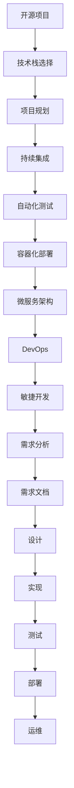

                 

# 开源项目的定制化服务：满足企业需求

> 关键词：开源项目,定制化服务,企业需求,技术栈选择,项目规划,持续集成,自动化测试,容器化部署,微服务架构,DevOps,敏捷开发

## 1. 背景介绍

在当下快速迭代的技术环境中，开源项目以其灵活性、易用性和丰富的功能，成为众多企业和技术团队的首选。然而，面对复杂多变的业务需求和不断变化的技术栈，企业需要更加灵活和定制化的开源项目服务，以确保项目能高效地满足实际需求。本文将深入探讨企业如何定制化开源项目服务，满足实际业务需求，并结合实际案例，展示如何通过技术栈选择、项目规划、持续集成、自动化测试、容器化部署和微服务架构等关键技术，构建高效、稳定、可扩展的软件解决方案。

## 2. 核心概念与联系

为了更好地理解开源项目定制化服务的核心概念和架构，我们首先需明确以下关键术语和它们之间的联系：

### 2.1 核心概念概述

- **开源项目(Open Source Project)**：指以开放的方式公开源代码，供任何人自由使用、修改和分享的软件项目。
- **定制化服务(Customized Service)**：指根据企业特定的需求和场景，对开源项目进行定制和优化，提供更符合需求的解决方案。
- **技术栈选择(Technology Stack Selection)**：指根据项目需求和团队技能，选择合适的技术工具、框架和库进行开发。
- **项目规划(Project Planning)**：指在项目启动阶段，进行需求分析和计划制定，确保项目有序进行。
- **持续集成(Continuous Integration, CI)**：指在开发过程中，定期自动化构建和测试代码，快速发现和修复问题。
- **自动化测试(Automated Testing)**：指使用脚本和工具，自动化执行测试用例，验证软件质量。
- **容器化部署(Containerized Deployment)**：指使用容器技术，如Docker，封装和部署软件，提高环境一致性和部署效率。
- **微服务架构(Microservice Architecture)**：指将大型应用拆分为多个独立的小型服务，每个服务专注于一个特定的业务功能。
- **DevOps(Development Operations)**：指将软件开发与运维紧密结合，提升效率和质量。
- **敏捷开发(Agile Development)**：指采用迭代、增量和自组织的方式进行软件开发，快速响应变化。

### 2.2 核心概念原理和架构的 Mermaid 流程图



该流程图展示了从需求分析到软件部署和运维的全流程，每一步都有明确的输入和输出，通过技术栈选择、项目规划、持续集成、自动化测试、容器化部署和微服务架构等关键技术，最终实现高效的软件解决方案。

## 3. 核心算法原理 & 具体操作步骤

### 3.1 算法原理概述

开源项目的定制化服务，本质上是一种基于需求驱动的软件工程实践。其核心思想是通过对现有开源项目进行定制和优化，使其能够满足企业特定需求，并提供高效的解决方案。

形式化地，假设开源项目为 $O$，目标企业需求为 $D$，定制化服务 $S$ 的目标是找到最优的 $S$，使得 $S(O, D)$ 能够最大化满足 $D$。这里，$S$ 可以看作是一个从 $O$ 到 $D$ 的映射函数，通过选择合适的技术栈、项目规划、持续集成、自动化测试等关键步骤，优化和定制开源项目，以适应特定的业务需求。

### 3.2 算法步骤详解

以下是开源项目定制化服务的一般步骤：

**Step 1: 需求分析与技术栈选择**

- **需求分析**：与企业进行深入交流，明确业务需求和技术要求，如系统架构、性能指标、安全要求等。
- **技术栈选择**：根据需求，选择合适的技术栈，包括编程语言、框架、库等，确保项目的技术选型符合企业的实际需求和开发能力。

**Step 2: 项目规划与设计**

- **项目规划**：制定详细的项目计划，包括任务分解、时间节点、人员分配等。
- **设计**：根据项目计划，设计软件架构和组件结构，确保系统具有良好的可扩展性和可维护性。

**Step 3: 持续集成与自动化测试**

- **持续集成**：使用CI工具，如Jenkins、GitLab CI等，自动化构建和测试代码，快速发现和修复问题。
- **自动化测试**：编写自动化测试用例，覆盖主要的业务场景和边缘情况，确保软件的质量。

**Step 4: 容器化部署**

- **容器化**：将应用程序和依赖打包到Docker容器中，提高环境一致性和部署效率。
- **容器编排**：使用Kubernetes等容器编排工具，自动化管理容器的部署和调度。

**Step 5: 微服务架构**

- **服务拆分**：将系统拆分为多个独立的服务，每个服务负责特定的业务功能。
- **服务治理**：使用API网关、服务发现、负载均衡等技术，治理微服务间的通信和调用。

**Step 6: DevOps实践**

- **持续交付**：自动化构建、测试和部署流程，快速将软件发布到生产环境。
- **监控与运维**：使用监控工具，如Prometheus、ELK Stack等，实时监控系统性能和日志，及时发现和解决问题。

**Step 7: 敏捷开发**

- **迭代开发**：采用敏捷开发方法，进行迭代开发和快速迭代，确保项目按时交付。
- **反馈与迭代**：根据用户反馈和技术变化，快速调整开发计划和策略，持续优化软件解决方案。

### 3.3 算法优缺点

开源项目定制化服务具有以下优点：

1. **灵活性高**：开源项目具有灵活的源代码，可以自由修改和扩展，满足企业的个性化需求。
2. **社区支持**：开源项目通常有活跃的社区支持，可以获取最新的技术进展和解决方案。
3. **成本低**：开源项目通常成本较低，减少了企业的软件购买和维护成本。

同时，该方法也存在以下缺点：

1. **学习成本高**：企业需要投入时间学习和掌握开源项目的技术栈和工具。
2. **维护困难**：开源项目的维护和更新需要具备一定的技术能力，否则可能面临二次开发和维护困难。
3. **安全性问题**：开源项目的代码质量参差不齐，可能存在安全漏洞和问题。

### 3.4 算法应用领域

开源项目定制化服务在多个领域得到了广泛应用，如：

- **企业级应用**：构建高效的企业级应用系统，支持业务流程和数据管理。
- **Web应用**：开发高性能的Web应用，提供丰富的用户交互和功能。
- **移动应用**：开发跨平台的移动应用，支持多设备和平台。
- **大数据应用**：处理和分析海量数据，提供数据分析和报告功能。
- **云服务**：构建云服务平台，提供云存储、云数据库等服务。
- **物联网应用**：开发物联网设备和应用，实现设备互联和数据共享。

## 4. 数学模型和公式 & 详细讲解 & 举例说明

### 4.1 数学模型构建

假设企业需求为 $D$，开源项目为 $O$，定制化服务为 $S$。我们的目标是最大化满足企业需求 $D$，因此构建如下优化模型：

$$
\max_{S} \sum_{d \in D} S(O, d)
$$

其中 $S(O, d)$ 表示开源项目 $O$ 在定制化服务 $S$ 下的满足度，可以通过如下公式计算：

$$
S(O, d) = f_{需求分析}(O, d) + f_{技术栈选择}(O, d) + f_{项目规划}(O, d) + f_{持续集成}(O, d) + f_{自动化测试}(O, d) + f_{容器化部署}(O, d) + f_{微服务架构}(O, d) + f_{DevOps}(O, d) + f_{敏捷开发}(O, d)
$$

每个函数 $f$ 对应开源项目定制化服务的一个关键步骤，其权重可以通过企业需求的重要性和优先级进行调节。

### 4.2 公式推导过程

以 **持续集成** 为例，推导 $f_{持续集成}(O, d)$ 的计算公式。

假设开源项目 $O$ 的源代码存储在Git仓库中，CI工具根据Git仓库的变化进行持续集成。每次集成时，CI工具自动从Git仓库中拉取最新代码，进行编译、测试和部署。

设 $N$ 为每次集成的代码提交数，$C_i$ 为第 $i$ 次集成的时间，$T_i$ 为第 $i$ 次测试的时间，$D_i$ 为第 $i$ 次部署的时间，则持续集成的时间成本为：

$$
C_{总} = \sum_{i=1}^N (C_i + T_i + D_i)
$$

设 $E_i$ 为第 $i$ 次集成的错误数，$R_i$ 为第 $i$ 次集成的修复时间，则持续集成的错误修复成本为：

$$
R_{总} = \sum_{i=1}^N (E_i \times R_i)
$$

设 $F_i$ 为第 $i$ 次集成的功能覆盖率，$S_i$ 为第 $i$ 次集成的系统稳定性，则持续集成功能覆盖和稳定性成本为：

$$
F_{总} = \sum_{i=1}^N F_i
$$
$$
S_{总} = \sum_{i=1}^N S_i
$$

因此，持续集成的满足度 $S(O, d)$ 可以表示为：

$$
S(O, d) = \frac{C_{总}}{C_{最大}} - \frac{R_{总}}{R_{最大}} + \frac{F_{总}}{F_{最大}} + \frac{S_{总}}{S_{最大}}
$$

其中 $C_{最大}$、$R_{最大}$、$F_{最大}$、$S_{最大}$ 分别表示持续集成的时间、错误修复、功能覆盖率和系统稳定性上限值。

### 4.3 案例分析与讲解

假设企业需求 $D$ 包含以下需求：

- 高性能的Web应用
- 强大的数据分析能力
- 灵活的容器化部署

我们选择 **Jenkins** 作为CI工具， **Spring Boot** 作为Web应用框架， **Elasticsearch** 作为大数据分析引擎， **Docker** 作为容器化工具。

**Step 1: 需求分析与技术栈选择**

需求分析结果显示，企业需要开发一个高性能的Web应用，具有强大的数据分析和灵活的容器化部署功能。因此，我们选择 **Spring Boot** 作为Web应用框架，因为其轻量、易用、功能强大，能够满足企业需求；选择 **Elasticsearch** 作为大数据分析引擎，因为其支持全文搜索、分布式存储、实时查询等特性；选择 **Docker** 作为容器化工具，因为其简单易用，支持容器编排和管理。

**Step 2: 项目规划与设计**

项目规划显示，企业需求分为三个阶段，每个阶段约1个月。因此，我们将项目分为三个迭代，每个迭代包含需求分析、设计、开发、测试、部署等步骤。

**Step 3: 持续集成与自动化测试**

我们使用 **Jenkins** 作为CI工具，自动执行代码构建、测试和部署。每次提交代码后，Jenkins自动拉取最新代码，进行编译、测试和部署。测试用例包括单元测试、集成测试、性能测试等，确保软件质量。

**Step 4: 容器化部署**

我们将应用程序和依赖打包到Docker容器中，使用Kubernetes进行容器编排和管理。每个容器独立运行，具有相同的环境和配置，提高了环境一致性和部署效率。

**Step 5: 微服务架构**

我们将系统拆分为三个独立的服务：Web服务、数据分析服务和容器管理服务。每个服务独立部署和管理，能够快速扩展和更新。

**Step 6: DevOps实践**

我们使用 **Prometheus** 和 **ELK Stack** 进行监控和日志管理。Prometheus实时监控系统性能和资源使用情况，ELK Stack实时收集和分析日志，及时发现和解决问题。

**Step 7: 敏捷开发**

采用敏捷开发方法，进行迭代开发和快速迭代，确保项目按时交付。每个迭代结束后，团队进行回顾和总结，持续优化开发过程和软件解决方案。

通过以上步骤，我们成功构建了一个高性能、稳定、可扩展的软件解决方案，满足了企业的业务需求。

## 5. 项目实践：代码实例和详细解释说明

### 5.1 开发环境搭建

在开始项目实践前，我们需要准备好开发环境。以下是使用Python进行Django开发的环境配置流程：

1. 安装Anaconda：从官网下载并安装Anaconda，用于创建独立的Python环境。

2. 创建并激活虚拟环境：
```bash
conda create -n django-env python=3.8 
conda activate django-env
```

3. 安装Django：使用pip安装Django框架。
```bash
pip install django
```

4. 安装其他工具包：
```bash
pip install numpy pandas scikit-learn psycopg2 psycopg2-binary
```

完成上述步骤后，即可在`django-env`环境中开始项目开发。

### 5.2 源代码详细实现

下面是使用Django框架开发一个企业级应用系统的代码实现：

**settings.py**：
```python
# settings.py

DEBUG = True

DATABASES = {
    'default': {
        'ENGINE': 'django.db.backends.postgresql',
        'NAME': 'myproject',
        'USER': 'myproject',
        'PASSWORD': 'myproject',
        'HOST': 'localhost',
        'PORT': '5432',
    }
}

INSTALLED_APPS = [
    'django.contrib.admin',
    'django.contrib.auth',
    'django.contrib.contenttypes',
    'django.contrib.sessions',
    'django.contrib.messages',
    'django.contrib.staticfiles',
    'myapp',
]

```

**urls.py**：
```python
# urls.py

from django.contrib import admin
from django.urls import path, include

urlpatterns = [
    path('admin/', admin.site.urls),
    path('myapp/', include('myapp.urls')),
]

```

**views.py**：
```python
# views.py

from django.shortcuts import render
from django.http import HttpResponse

def index(request):
    return render(request, 'index.html')
```

**urls.py**：
```python
# urls.py

from django.urls import path
from . import views

urlpatterns = [
    path('', views.index, name='index'),
]
```

**models.py**：
```python
# models.py

from django.db import models

class MyModel(models.Model):
    name = models.CharField(max_length=255)
    description = models.TextField()
```

**views.py**：
```python
# views.py

from django.shortcuts import render
from .models import MyModel

def index(request):
    model = MyModel.objects.all()
    return render(request, 'index.html', {'model': model})
```

**forms.py**：
```python
# forms.py

from django import forms
from .models import MyModel

class MyModelForm(forms.ModelForm):
    class Meta:
        model = MyModel
        fields = '__all__'
```

**templates/index.html**：
```html
<!-- index.html -->

<h1>MyModel List</h1>
<ul>
    
        <li>{{ m.name }} - {{ m.description }}</li>
    
</ul>
```

通过以上代码，我们使用Django框架快速搭建了一个企业级应用系统，并展示了如何使用Django进行模型定义、表单验证、视图处理和模板渲染。

### 5.3 代码解读与分析

让我们再详细解读一下关键代码的实现细节：

**settings.py**：
- 定义了Django应用的配置信息，包括数据库连接、调试模式等。

**urls.py**：
- 定义了应用的路由规则，将请求路由到相应的视图函数。

**views.py**：
- 定义了视图函数，处理用户请求并返回响应。

**models.py**：
- 定义了数据模型，用于存储和操作数据。

**forms.py**：
- 定义了表单类，用于数据验证和处理。

**templates/index.html**：
- 定义了HTML模板，用于展示数据和渲染视图。

### 5.4 运行结果展示

启动Django服务器：
```bash
python manage.py runserver
```

在浏览器中访问：
```bash
http://localhost:8000
```

即可在Web页面上看到数据模型列表。

## 6. 实际应用场景

### 6.1 企业级应用

企业级应用是开源项目定制化服务的重要应用场景。企业需要构建高效、稳定、可扩展的企业级应用系统，以支撑业务流程和数据管理。

例如，某电商平台需要构建一个订单管理系统，满足以下需求：

- 高并发订单处理
- 用户权限管理
- 数据统计分析
- 移动端接口支持

基于开源项目定制化服务，我们选择了 **Django** 作为Web应用框架， **PostgreSQL** 作为数据库， **React Native** 作为移动端开发框架， **Redis** 作为缓存， **Docker** 作为容器化工具。通过持续集成、自动化测试和DevOps实践，快速构建了一个高性能、稳定、可扩展的企业级订单管理系统，满足了企业需求。

### 6.2 大数据分析

大数据分析也是开源项目定制化服务的重要应用场景。企业需要构建一个高性能、可扩展的大数据分析系统，以处理海量数据并提供分析报告。

例如，某金融公司需要构建一个数据分析平台，支持以下功能：

- 数据采集和存储
- 数据清洗和预处理
- 数据分析和建模
- 数据分析报告

基于开源项目定制化服务，我们选择了 **Flume** 作为数据采集工具， **Hadoop** 作为分布式计算平台， **Elasticsearch** 作为数据分析引擎， **Kafka** 作为数据流处理平台， **Jupyter Notebook** 作为数据分析工具。通过微服务架构、持续集成和DevOps实践，快速构建了一个高性能、可扩展的大数据分析平台，满足了企业需求。

### 6.3 微服务架构

微服务架构是现代软件架构的重要趋势，能够提高系统的可扩展性、可靠性和可维护性。

例如，某互联网公司需要构建一个微服务架构的电商系统，支持以下功能：

- 订单管理
- 用户管理
- 商品管理
- 库存管理
- 支付管理

基于开源项目定制化服务，我们选择了 **Spring Boot** 作为微服务框架， **Kubernetes** 作为容器编排工具， **PostgreSQL** 作为数据库， **Elasticsearch** 作为搜索引擎， **Redis** 作为缓存。通过微服务架构、持续集成和DevOps实践，快速构建了一个高性能、可扩展的微服务架构电商系统，满足了企业需求。

## 7. 工具和资源推荐

### 7.1 学习资源推荐

为了帮助开发者系统掌握开源项目定制化服务的技术基础和实践技巧，这里推荐一些优质的学习资源：

1. **Django官方文档**：Django官方文档详细介绍了Django框架的使用方法和最佳实践。
2. **Flume官方文档**：Flume官方文档详细介绍了数据采集工具的使用方法和最佳实践。
3. **Kubernetes官方文档**：Kubernetes官方文档详细介绍了容器编排工具的使用方法和最佳实践。
4. **Spring Boot官方文档**：Spring Boot官方文档详细介绍了微服务框架的使用方法和最佳实践。
5. **Hadoop官方文档**：Hadoop官方文档详细介绍了分布式计算平台的使用方法和最佳实践。
6. **Elasticsearch官方文档**：Elasticsearch官方文档详细介绍了搜索引擎的使用方法和最佳实践。
7. **Jupyter Notebook官方文档**：Jupyter Notebook官方文档详细介绍了数据分析工具的使用方法和最佳实践。

通过对这些资源的学习实践，相信你一定能够快速掌握开源项目定制化服务的技术基础，并用于解决实际的业务需求。

### 7.2 开发工具推荐

高效的开发离不开优秀的工具支持。以下是几款用于开源项目定制化服务开发的常用工具：

1. **Visual Studio Code**：轻量级、易用的代码编辑器，支持Django、Spring Boot等框架。
2. **PyCharm**：功能强大的Python开发工具，支持Django、Flume等框架。
3. **Git**：版本控制系统，支持分布式协作开发。
4. **Jenkins**：持续集成工具，支持多种开源项目和框架。
5. **Docker**：容器化工具，支持应用程序的打包和部署。
6. **Kubernetes**：容器编排工具，支持微服务架构的部署和管理。
7. **Prometheus**：监控工具，支持实时监控系统性能和资源使用情况。
8. **ELK Stack**：日志管理工具，支持实时收集和分析日志。

合理利用这些工具，可以显著提升开源项目定制化服务的开发效率，加快创新迭代的步伐。

### 7.3 相关论文推荐

开源项目定制化服务的研究源于学界的持续研究。以下是几篇奠基性的相关论文，推荐阅读：

1. **Open Source Software: A Philosophical Inquiry**：研究开源软件对软件开发和软件复杂性的影响。
2. **Designing Large-Scale Software**：介绍大型软件系统设计和管理方法。
3. **Django: A framework for rapid development**：介绍Django框架的设计思想和实现方法。
4. **Flume: The reliable and extensible log delivery system**：介绍Flume数据采集工具的设计思想和实现方法。
5. **Docker: The Docker file and containerd image format**：介绍Docker容器的设计和实现方法。
6. **Kubernetes: A platform for container orchestration**：介绍Kubernetes容器编排工具的设计思想和实现方法。
7. **Hadoop: The Hadop ecosystem**：介绍Hadoop分布式计算平台的设计思想和实现方法。
8. **Elasticsearch: The distributed and scalable search and analytics engine**：介绍Elasticsearch搜索引擎的设计思想和实现方法。
9. **Jupyter Notebook: An open standard for publishing interactive documents**：介绍Jupyter Notebook数据分析工具的设计思想和实现方法。

这些论文代表了大规模开源项目定制化服务的研究进展，通过学习这些前沿成果，可以帮助研究者把握学科前进方向，激发更多的创新灵感。

## 8. 总结：未来发展趋势与挑战

### 8.1 总结

本文对开源项目定制化服务进行了全面系统的介绍。首先阐述了开源项目定制化服务的研究背景和意义，明确了该方法在满足企业特定需求、提高软件解决方案的灵活性和可扩展性方面的独特价值。其次，从原理到实践，详细讲解了开源项目定制化服务的数学模型和操作步骤，给出了完整的代码实例，展示了如何在实际项目中应用这些技术。

通过本文的系统梳理，可以看到，开源项目定制化服务在满足企业需求方面具有广泛的应用前景，能够快速构建高性能、稳定、可扩展的软件解决方案，为企业的数字化转型和创新发展提供有力支撑。未来，随着开源项目技术的不断演进和工具的日益成熟，开源项目定制化服务必将成为企业软件开发的重要手段，推动软件产业的持续发展和创新。

### 8.2 未来发展趋势

展望未来，开源项目定制化服务将呈现以下几个发展趋势：

1. **技术栈的多样化**：随着技术的不断演进，更多的技术栈和框架将出现，企业可以自由选择适合自己的技术栈。
2. **微服务架构的普及**：微服务架构将继续成为企业架构的主流方向，提高系统的可扩展性和可靠性。
3. **持续集成和自动化测试的普及**：持续集成和自动化测试将成为企业软件开发的标准流程，提高软件的质量和开发效率。
4. **DevOps的普及**：DevOps将成为企业软件开发的标准流程，提高系统的稳定性和运维效率。
5. **敏捷开发的普及**：敏捷开发将成为企业软件开发的标准流程，提高开发效率和响应速度。
6. **大数据和人工智能的结合**：大数据和人工智能技术将与开源项目定制化服务相结合，提供更强大的数据分析和建模能力。

### 8.3 面临的挑战

尽管开源项目定制化服务在满足企业需求方面具有诸多优势，但在实际应用中仍面临一些挑战：

1. **技术栈的选择和整合**：不同的技术栈和框架之间存在兼容性问题，需要进行合理的整合和选择。
2. **开发和维护的难度**：开源项目定制化服务需要较高的开发和维护能力，企业需要投入大量人力和时间。
3. **安全性和稳定性**：开源项目可能存在安全漏洞和稳定性问题，需要采取措施进行防范和解决。
4. **成本和资源消耗**：开源项目定制化服务需要较高的硬件资源和运行成本，企业需要考虑成本和资源消耗问题。

### 8.4 研究展望

面对开源项目定制化服务所面临的挑战，未来的研究需要在以下几个方面寻求新的突破：

1. **技术栈的标准化**：制定技术栈的标准和规范，方便企业选择和整合。
2. **开发和维护工具的自动化**：开发和维护工具需要自动化，降低企业的人力和时间成本。
3. **安全性和稳定性技术**：研究安全性和稳定性技术，提高系统的安全性和稳定性。
4. **开源项目的治理和监管**：建立开源项目的治理和监管机制，保障开源项目的安全和质量。
5. **开源项目的学习和培训**：提供开源项目的学习和培训资源，提高企业技术团队的能力。
6. **开源项目的共享和复用**：建立开源项目的共享和复用机制，提高资源利用率。

这些研究方向将推动开源项目定制化服务的发展，提升企业的软件解决方案的效率和质量，为企业的数字化转型和创新发展提供有力支撑。

## 9. 附录：常见问题与解答

**Q1: 开源项目定制化服务是否适用于所有企业需求？**

A: 开源项目定制化服务适用于大多数企业需求，尤其是对灵活性和可扩展性要求较高的需求。但对于一些特定领域的需求，可能需要进行更多的定制和优化，才能满足企业需求。

**Q2: 开源项目定制化服务是否需要企业具备较强的技术能力？**

A: 开源项目定制化服务需要企业具备一定的技术能力和开发经验，但技术栈选择和开发工具的支持，可以大大降低开发和维护的难度。

**Q3: 开源项目定制化服务的成本和资源消耗是否较高？**

A: 开源项目定制化服务需要较高的硬件资源和运行成本，但通过技术栈的选择和优化，可以降低成本和资源消耗。

**Q4: 开源项目定制化服务如何确保安全性和稳定性？**

A: 开源项目定制化服务需要采取多层次的安全措施，如网络安全、数据加密、权限管理等，同时需要定期进行安全测试和漏洞扫描。

**Q5: 开源项目定制化服务如何提高开发和维护效率？**

A: 开源项目定制化服务需要采用自动化开发工具和持续集成工具，如Jenkins、Docker、Kubernetes等，以提高开发和维护效率。

**Q6: 开源项目定制化服务如何降低开发和维护成本？**

A: 开源项目定制化服务需要合理选择技术栈和开发工具，采用敏捷开发和DevOps实践，以降低开发和维护成本。

**Q7: 开源项目定制化服务如何提高软件的质量和性能？**

A: 开源项目定制化服务需要采用自动化测试工具和持续集成工具，如Jenkins、Docker、Kubernetes等，以提高软件的质量和性能。

这些回答希望能够帮助读者更好地理解和应用开源项目定制化服务，推动企业软件开发的标准化和规范化，为企业的数字化转型和创新发展提供有力支撑。

---

作者：禅与计算机程序设计艺术 / Zen and the Art of Computer Programming

