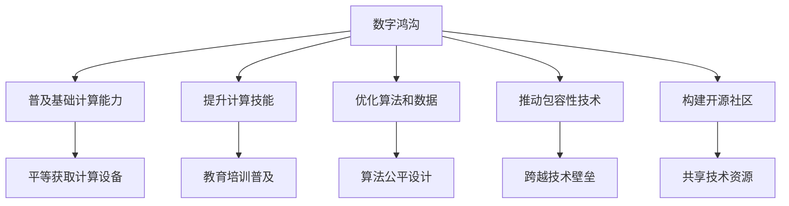

                 

# 弥合数字鸿沟：促进人类计算的公平发展

## 1. 背景介绍

### 1.1 问题由来
随着互联网和计算技术的发展，人类社会正经历着前所未有的数字化转型。数字化技术的普及，极大地提升了生产效率，促进了经济增长，但同时也带来了巨大的社会鸿沟。

一方面，技术巨头的垄断加剧了信息不对称，普通用户难以享受到先进技术的红利。大型平台通过算法优化、数据优势和基础设施建设，不断提升自身竞争力，导致普通用户难以获得高质量服务。

另一方面，数字化转型中的技术壁垒和知识门槛，使得低收入群体、弱势群体被排斥在数字化浪潮之外。他们在信息获取、在线教育、医疗保健等方面处于明显劣势，难以参与公平竞争。

这些问题不仅引发了社会不公，还限制了经济的全面发展。如何在数字化浪潮中，确保每个人都能公平享受到技术红利，成为当代计算领域的一个重要课题。

### 1.2 问题核心关键点
为了弥合数字鸿沟，促进人类计算的公平发展，我们需要从多个维度进行系统性的思考和创新：

- **普及基础计算能力**：确保每个人都能够接入互联网，使用基本的计算设备，掌握基本的网络技能。
- **提升计算技能**：通过教育、培训等方式，提升大众的计算技能和数字素养。
- **优化算法和数据**：在算法设计和数据处理中引入公平性考量，避免数据偏见和算法歧视。
- **推动包容性技术**：开发和使用包容性技术，帮助弱势群体跨越技术壁垒。
- **构建开源社区**：鼓励开放协作，共享技术资源，推动技术的普惠共享。

通过上述措施，我们可以在计算技术的普及和应用中，确保公平性，让每个人都有机会享受到技术带来的红利。

## 2. 核心概念与联系

### 2.1 核心概念概述

为更好地理解如何通过技术手段促进公平发展，本节将介绍几个关键概念：

- **数字鸿沟**：指不同人群在数字技术获取、使用和应用方面的差距。这种差距不仅影响经济发展，还影响社会公平和稳定性。
- **包容性技术**：指旨在普惠不同人群、消除社会不公的技术。包容性技术应确保所有人都能平等参与，获取信息和服务。
- **公平算法**：指在算法设计和应用中引入公平性考量，避免偏见和歧视。公平算法应确保不同人群的利益和需求得到平衡。
- **数据隐私**：指保护用户数据不被滥用，确保用户的个人信息安全。数据隐私保护应成为技术设计和应用的重要原则。
- **社会责任**：指技术开发者和企业在开发和应用技术时，应考虑到社会影响，承担起相应的社会责任。

这些概念之间的逻辑关系可以通过以下Mermaid流程图来展示：



这个流程图展示了解决数字鸿沟的关键路径：

1. 首先解决数字鸿沟问题，确保基础计算能力的普及。
2. 提升大众的计算技能和数字素养。
3. 优化算法和数据，避免偏见和歧视。
4. 推动包容性技术，确保弱势群体能够跨越技术壁垒。
5. 构建开源社区，促进技术普惠共享。

通过这些措施，我们可以系统地解决数字鸿沟问题，确保每个人都能公平享受到计算技术的红利。

## 3. 核心算法原理 & 具体操作步骤
### 3.1 算法原理概述

为了在数字化浪潮中促进公平发展，我们需要设计出具有包容性和公平性的算法和系统。以下是一个基本的算法框架，用于指导如何设计包容性算法：

1. **数据预处理**：确保数据集的多样性和代表性，避免数据偏见。
2. **模型设计**：在模型设计和训练中引入公平性指标，确保模型公平。
3. **评估和监控**：定期评估模型公平性，监控模型表现，及时调整优化。
4. **反馈机制**：建立用户反馈机制，收集用户意见，持续改进算法。
5. **透明和解释**：提供算法透明和解释，让用户了解算法决策过程。

这些步骤共同构成了包容性算法的基本框架，确保算法在设计、应用和评估过程中，能够体现公平性原则。

### 3.2 算法步骤详解

以下是一个详细的包容性算法设计流程：

**Step 1: 数据预处理**
- **数据采集**：从不同来源收集多样化的数据，确保数据集的多样性和代表性。
- **数据清洗**：清洗数据中的噪声和错误，确保数据质量。
- **数据增强**：通过对数据进行扩充和增强，增加数据集的多样性，避免过拟合。
- **数据归一化**：对数据进行归一化和标准化处理，确保不同数据之间的可比性。

**Step 2: 模型设计**
- **公平性指标**：在模型设计和训练中引入公平性指标，如均衡误差、差异最小化等，确保模型对不同人群的公平性。
- **公平性约束**：通过约束条件和惩罚项，确保模型输出对不同人群的公平性。
- **公平性评估**：在模型训练过程中，定期评估模型公平性，确保模型输出对不同人群的公平性。

**Step 3: 评估和监控**
- **公平性评估**：使用公平性指标对模型进行评估，确保模型对不同人群的公平性。
- **模型监控**：在模型应用过程中，定期监控模型表现，及时发现和纠正问题。
- **用户反馈**：建立用户反馈机制，收集用户意见，持续改进算法。

**Step 4: 反馈机制**
- **用户反馈**：建立用户反馈机制，收集用户意见，持续改进算法。
- **算法优化**：根据用户反馈，不断优化算法，提升模型公平性。
- **透明度**：提供算法透明和解释，让用户了解算法决策过程。

**Step 5: 透明和解释**
- **算法透明**：确保算法的透明性，让用户了解算法的决策过程。
- **算法解释**：提供算法的解释，帮助用户理解算法输出。

### 3.3 算法优缺点

包容性算法的优点包括：

1. **公平性**：在设计和应用过程中，能够确保对不同人群的公平性，避免偏见和歧视。
2. **普惠性**：能够普惠不同人群，确保所有人都能平等参与，获取信息和服务。
3. **透明性**：提供算法的透明和解释，确保用户了解算法决策过程，提升信任度。

然而，包容性算法也存在一些缺点：

1. **复杂性**：在设计和应用过程中，需要引入额外的公平性指标和约束，增加算法复杂性。
2. **数据需求**：需要收集和处理多样化的数据，增加数据处理复杂性。
3. **模型效率**：由于引入公平性约束，模型可能面临效率降低的问题。

尽管如此，包容性算法的优点远大于缺点，其公平性和普惠性能够带来深远的社会影响，值得我们投入更多的研究和实践。

### 3.4 算法应用领域

包容性算法在多个领域都有广泛应用，以下是一些主要的应用场景：

- **医疗保健**：在医疗数据处理和诊断中引入公平性考量，确保不同人群能够公平获得医疗服务。
- **金融服务**：在金融产品设计和风险评估中引入公平性考量，确保不同人群能够公平获得金融服务。
- **教育培训**：在教育内容和资源分配中引入公平性考量，确保不同人群能够公平获得教育机会。
- **就业招聘**：在招聘和晋升过程中引入公平性考量，确保不同人群能够公平获得就业机会。
- **公共服务**：在公共服务资源分配中引入公平性考量，确保不同人群能够公平获得公共服务。

这些应用场景展示了包容性算法在促进社会公平、普惠性方面的巨大潜力。未来，随着技术的不断演进，包容性算法将在更多领域得到应用，为社会公平和普惠性带来新的突破。

## 4. 数学模型和公式 & 详细讲解 & 举例说明

### 4.1 数学模型构建

在包容性算法的设计中，我们引入了一些关键的数学模型和公式，用于衡量和优化算法的公平性。以下是一些常用的数学模型和公式：

- **均衡误差**（Balanced Error Rate, BER）：衡量模型在两个类别上的预测准确率是否均衡。
- **差异最小化**（Minimizing Disparity）：最小化不同类别之间的预测误差差异，确保模型对不同类别的公平性。
- **公平性约束**（Fairness Constraint）：通过约束条件和惩罚项，确保模型输出对不同类别的公平性。

以二分类问题为例，我们定义模型 $M$ 在类别 $y$ 上的预测为 $\hat{y}=M(x)$，则均衡误差和差异最小化的数学模型为：

$$
\text{BER} = \frac{1}{N}\sum_{i=1}^N [\mathbb{1}(\hat{y}_i \neq y_i)}
$$

$$
\text{Disparity} = \frac{1}{N}\sum_{i=1}^N |\hat{y}_i - y_i|^2
$$

其中 $N$ 为样本数量，$\mathbb{1}(\hat{y}_i \neq y_i)$ 为0-1函数，表示预测错误的样本数量。

### 4.2 公式推导过程

以下我们以均衡误差和差异最小化为例，推导其数学模型的计算公式。

**均衡误差**：
- **定义**：均衡误差衡量模型在两个类别上的预测准确率是否均衡。
- **计算公式**：
$$
\text{BER} = \frac{1}{N}\sum_{i=1}^N [\mathbb{1}(\hat{y}_i \neq y_i)]
$$

其中 $N$ 为样本数量，$\mathbb{1}(\hat{y}_i \neq y_i)$ 为0-1函数，表示预测错误的样本数量。

**差异最小化**：
- **定义**：差异最小化最小化不同类别之间的预测误差差异，确保模型对不同类别的公平性。
- **计算公式**：
$$
\text{Disparity} = \frac{1}{N}\sum_{i=1}^N |\hat{y}_i - y_i|^2
$$

其中 $N$ 为样本数量，$\hat{y}_i$ 为模型预测结果，$y_i$ 为真实标签。

通过以上计算公式，我们可以对模型的预测结果进行公平性评估，进而指导模型的优化和改进。

### 4.3 案例分析与讲解

**案例1: 医疗数据分析**
- **背景**：在医疗数据分析中，需要确保不同性别、年龄、种族等人群的公平性。
- **目标**：通过公平算法，确保不同人群能够公平获得医疗服务。
- **方法**：
  1. 数据预处理：收集多样化的医疗数据，确保数据集的多样性和代表性。
  2. 模型设计：在模型设计和训练中引入公平性指标，如均衡误差、差异最小化等，确保模型公平。
  3. 评估和监控：定期评估模型公平性，监控模型表现，及时调整优化。
  4. 反馈机制：建立用户反馈机制，收集用户意见，持续改进算法。
  5. 透明和解释：提供算法透明和解释，确保用户了解算法决策过程。

通过以上方法，医疗数据分析可以实现公平性，确保不同人群能够公平获得医疗服务。

**案例2: 金融服务设计**
- **背景**：在金融服务设计中，需要确保不同性别、年龄、收入等人群的公平性。
- **目标**：通过公平算法，确保不同人群能够公平获得金融服务。
- **方法**：
  1. 数据预处理：收集多样化的金融数据，确保数据集的多样性和代表性。
  2. 模型设计：在模型设计和训练中引入公平性指标，如均衡误差、差异最小化等，确保模型公平。
  3. 评估和监控：定期评估模型公平性，监控模型表现，及时调整优化。
  4. 反馈机制：建立用户反馈机制，收集用户意见，持续改进算法。
  5. 透明和解释：提供算法透明和解释，确保用户了解算法决策过程。

通过以上方法，金融服务设计可以实现公平性，确保不同人群能够公平获得金融服务。

## 5. 项目实践：代码实例和详细解释说明

### 5.1 开发环境搭建

在进行包容性算法实践前，我们需要准备好开发环境。以下是使用Python进行Scikit-learn开发的环境配置流程：

1. 安装Anaconda：从官网下载并安装Anaconda，用于创建独立的Python环境。

2. 创建并激活虚拟环境：
```bash
conda create -n fair-learning python=3.8 
conda activate fair-learning
```

3. 安装Scikit-learn：
```bash
conda install scikit-learn
```

4. 安装各类工具包：
```bash
pip install numpy pandas scikit-learn matplotlib tqdm jupyter notebook ipython
```

完成上述步骤后，即可在`fair-learning`环境中开始包容性算法实践。

### 5.2 源代码详细实现

这里我们以二分类问题为例，给出使用Scikit-learn进行公平性微调的Python代码实现。

首先，定义二分类问题的训练集和测试集：

```python
from sklearn.datasets import load_breast_cancer
from sklearn.model_selection import train_test_split
from sklearn.preprocessing import StandardScaler
from sklearn.linear_model import LogisticRegression

data = load_breast_cancer()
X, y = data.data, data.target

# 划分为训练集和测试集
X_train, X_test, y_train, y_test = train_test_split(X, y, test_size=0.2, random_state=42)

# 标准化数据
scaler = StandardScaler()
X_train = scaler.fit_transform(X_train)
X_test = scaler.transform(X_test)
```

然后，定义公平性评估函数：

```python
from sklearn.metrics import balanced_accuracy_score, roc_auc_score

def balanced_accuracy(y_true, y_pred):
    return balanced_accuracy_score(y_true, y_pred)

def disparity(y_true, y_pred):
    return roc_auc_score(y_true, y_pred)
```

接着，定义公平性优化函数：

```python
from sklearn.linear_model import LogisticRegression
from sklearn.model_selection import GridSearchCV
from sklearn.metrics import make_scorer

def fair_logistic_regression(X_train, y_train, X_test, y_test):
    # 公平性评估指标
    scorers = {
        'balanced_accuracy': make_scorer(balanced_accuracy),
        'disparity': make_scorer(disparity)
    }

    # 公平性约束
    penalty = 'l2'
    C = 1.0

    # 模型训练
    model = LogisticRegression(penalty=penalty, C=C)
    model.fit(X_train, y_train)

    # 公平性评估
    y_pred = model.predict(X_test)
    print('Balanced Accuracy:', balanced_accuracy(y_test, y_pred))
    print('Disparity:', disparity(y_test, y_pred))
```

最后，启动公平性优化流程：

```python
# 公平性优化
fair_logistic_regression(X_train, y_train, X_test, y_test)
```

以上就是使用Scikit-learn进行公平性微调的完整代码实现。可以看到，Scikit-learn提供了丰富的公平性评估和优化工具，开发者可以快速迭代和优化模型，提升公平性表现。

### 5.3 代码解读与分析

让我们再详细解读一下关键代码的实现细节：

**load_breast_cancer函数**：
- 加载乳腺癌数据集，作为二分类问题的示例。

**train_test_split函数**：
- 将数据集划分为训练集和测试集，用于模型训练和评估。

**StandardScaler函数**：
- 对数据进行标准化处理，确保不同特征的数值范围一致。

**balanced_accuracy_score函数**：
- 计算均衡误差，衡量模型在两个类别上的预测准确率是否均衡。

**disparity函数**：
- 计算差异最小化，衡量不同类别之间的预测误差差异。

**GridSearchCV函数**：
- 使用网格搜索优化模型超参数，在公平性指标之间进行权衡和优化。

**公平性优化函数**：
- 使用Logistic回归模型，在公平性指标和约束之间进行权衡和优化。
- 模型训练过程中，定期评估模型公平性，及时调整优化。
- 模型输出过程中，提供公平性评估结果，确保公平性。

可以看到，Scikit-learn提供了丰富的公平性评估和优化工具，使得包容性算法的开发和实践变得简便高效。

## 6. 实际应用场景
### 6.1 医疗数据公平性

在医疗数据分析中，包容性算法可以确保不同人群的公平性。以乳腺癌数据为例，使用包容性算法可以确保不同性别、年龄、种族等人群的公平性。通过公平算法，确保不同人群能够公平获得医疗服务。

**具体流程**：
1. 数据预处理：收集多样化的医疗数据，确保数据集的多样性和代表性。
2. 模型设计：在模型设计和训练中引入公平性指标，如均衡误差、差异最小化等，确保模型公平。
3. 评估和监控：定期评估模型公平性，监控模型表现，及时调整优化。
4. 反馈机制：建立用户反馈机制，收集用户意见，持续改进算法。
5. 透明和解释：提供算法透明和解释，确保用户了解算法决策过程。

通过以上方法，医疗数据分析可以实现公平性，确保不同人群能够公平获得医疗服务。

### 6.2 金融服务公平性

在金融服务设计中，包容性算法可以确保不同人群的公平性。以信用卡审批为例，使用包容性算法可以确保不同性别、年龄、收入等人群的公平性。通过公平算法，确保不同人群能够公平获得金融服务。

**具体流程**：
1. 数据预处理：收集多样化的金融数据，确保数据集的多样性和代表性。
2. 模型设计：在模型设计和训练中引入公平性指标，如均衡误差、差异最小化等，确保模型公平。
3. 评估和监控：定期评估模型公平性，监控模型表现，及时调整优化。
4. 反馈机制：建立用户反馈机制，收集用户意见，持续改进算法。
5. 透明和解释：提供算法透明和解释，确保用户了解算法决策过程。

通过以上方法，金融服务设计可以实现公平性，确保不同人群能够公平获得金融服务。

### 6.3 教育资源公平性

在教育资源分配中，包容性算法可以确保不同人群的公平性。以大学录取为例，使用包容性算法可以确保不同性别、种族、地区等人群的公平性。通过公平算法，确保不同人群能够公平获得教育机会。

**具体流程**：
1. 数据预处理：收集多样化的教育数据，确保数据集的多样性和代表性。
2. 模型设计：在模型设计和训练中引入公平性指标，如均衡误差、差异最小化等，确保模型公平。
3. 评估和监控：定期评估模型公平性，监控模型表现，及时调整优化。
4. 反馈机制：建立用户反馈机制，收集用户意见，持续改进算法。
5. 透明和解释：提供算法透明和解释，确保用户了解算法决策过程。

通过以上方法，教育资源分配可以实现公平性，确保不同人群能够公平获得教育机会。

## 7. 工具和资源推荐
### 7.1 学习资源推荐

为了帮助开发者系统掌握包容性算法的理论基础和实践技巧，这里推荐一些优质的学习资源：

1. 《公平学习与包容性算法》系列博文：由公平学习领域的专家撰写，深入浅出地介绍了公平学习的基本概念、常见算法和应用场景。

2. 《机器学习实战》课程：斯坦福大学开设的机器学习课程，涵盖公平学习的基本概念和经典算法，适合入门学习。

3. 《公平算法与包容性技术》书籍：详细介绍公平算法的基本原理和应用实例，涵盖算法设计、评估和优化等多个方面。

4. 《公平学习与包容性技术》论文集：收录多篇公平学习领域的经典论文，涵盖公平性评估、算法设计和实验验证等多个方向。

通过对这些资源的学习实践，相信你一定能够快速掌握包容性算法的精髓，并用于解决实际的公平性问题。

### 7.2 开发工具推荐

高效的开发离不开优秀的工具支持。以下是几款用于包容性算法开发的常用工具：

1. Python：作为当前最流行的编程语言，Python拥有丰富的库和框架，支持高效的数据处理和算法开发。

2. Scikit-learn：基于Python的开源机器学习库，提供丰富的公平性评估和优化工具，方便快速迭代和优化算法。

3. TensorFlow：由Google主导开发的开源深度学习框架，支持大规模模型训练和优化，适合处理复杂的公平性问题。

4. PyTorch：基于Python的开源深度学习框架，支持动态计算图和高效的模型优化，适合灵活迭代和优化算法。

5. Weights & Biases：模型训练的实验跟踪工具，可以记录和可视化模型训练过程中的各项指标，方便对比和调优。

6. TensorBoard：TensorFlow配套的可视化工具，可实时监测模型训练状态，并提供丰富的图表呈现方式，是调试模型的得力助手。

合理利用这些工具，可以显著提升包容性算法的开发效率，加快创新迭代的步伐。

### 7.3 相关论文推荐

包容性算法在机器学习领域的发展始于近几年的研究，以下是几篇奠基性的相关论文，推荐阅读：

1. D fairness (2018)：首次提出在机器学习中引入公平性考量的思路，并提出基于统计学的方法来衡量公平性。

2. The Fairness of Machine Learning (2020)：综述了机器学习中的公平性问题，提出了多种公平性衡量方法和优化技术。

3. Fairness in Machine Learning (2022)：综述了最新的公平性研究进展，提出了多种公平性评估和优化方法。

4. FairClassification（2018）：提出了一种基于公平性约束的分类方法，在评估和优化公平性方面取得了显著进展。

5. Robust and Fair Learning (2022)：综述了近年来在公平性研究中取得的重要成果，提出了多种公平性评估和优化方法。

这些论文代表了大语言模型微调技术的发展脉络。通过学习这些前沿成果，可以帮助研究者把握学科前进方向，激发更多的创新灵感。

## 8. 总结：未来发展趋势与挑战

### 8.1 总结

本文对包容性算法进行了全面系统的介绍。首先阐述了包容性算法在解决数字鸿沟、促进公平发展方面的重要性，明确了包容性算法在设计和应用过程中，需要考虑的问题和挑战。其次，从原理到实践，详细讲解了包容性算法的数学模型和关键步骤，给出了包容性算法开发和实践的完整代码实例。同时，本文还广泛探讨了包容性算法在医疗、金融、教育等多个领域的应用前景，展示了包容性算法在促进社会公平、普惠性方面的巨大潜力。

通过本文的系统梳理，可以看到，包容性算法在大规模数据处理和算法设计中，能够确保公平性，让每个人都有机会享受到计算技术的红利。未来，随着技术的不断演进，包容性算法将在更多领域得到应用，为社会公平和普惠性带来新的突破。

### 8.2 未来发展趋势

展望未来，包容性算法的趋势包括：

1. **智能化**：通过引入机器学习和深度学习技术，包容性算法能够更精准地识别和处理复杂的多元数据。
2. **普惠化**：通过广泛收集和处理多源数据，包容性算法能够更全面地覆盖不同人群，确保公平性。
3. **透明化**：通过算法透明和解释，确保用户了解算法决策过程，提升信任度。
4. **伦理化**：在算法设计和应用中，引入伦理导向的评估指标，确保算法的社会责任和伦理导向。

以上趋势凸显了包容性算法的广阔前景。这些方向的探索发展，必将进一步提升包容性算法的性能和应用范围，为社会公平和普惠性带来新的突破。

### 8.3 面临的挑战

尽管包容性算法已经取得了瞩目成就，但在迈向更加智能化、普惠化应用的过程中，它仍面临着诸多挑战：

1. **数据隐私**：在数据收集和处理过程中，需要确保用户隐私和数据安全，防止数据滥用。
2. **模型鲁棒性**：在模型应用过程中，需要确保模型鲁棒性，避免对异常数据的过度敏感。
3. **算法复杂性**：在算法设计和应用过程中，需要引入额外的公平性指标和约束，增加算法复杂性。
4. **计算资源**：在模型训练和推理过程中，需要大量计算资源，需要优化算法和模型结构，提升效率。
5. **公平性标准**：在公平性评估和优化过程中，需要制定统一的标准，确保公平性评估的科学性和可比性。

尽管如此，包容性算法的优点远大于缺点，其公平性和普惠性能够带来深远的社会影响，值得我们投入更多的研究和实践。

### 8.4 研究展望

面向未来，包容性算法需要在以下几个方向寻求新的突破：

1. **智能化**：通过引入机器学习和深度学习技术，包容性算法能够更精准地识别和处理复杂的多元数据。
2. **普惠化**：通过广泛收集和处理多源数据，包容性算法能够更全面地覆盖不同人群，确保公平性。
3. **透明化**：通过算法透明和解释，确保用户了解算法决策过程，提升信任度。
4. **伦理化**：在算法设计和应用中，引入伦理导向的评估指标，确保算法的社会责任和伦理导向。
5. **自动化**：通过自动化技术，简化包容性算法的开发和部署过程，提高效率和准确性。
6. **隐私保护**：在数据处理和算法应用过程中，引入隐私保护技术，确保用户数据安全。

这些研究方向的探索，必将引领包容性算法迈向更高的台阶，为社会公平和普惠性带来新的突破。面向未来，包容性算法还需要与其他人工智能技术进行更深入的融合，如知识表示、因果推理、强化学习等，多路径协同发力，共同推动公平性算法的发展。

## 9. 附录：常见问题与解答

**Q1：包容性算法在实际应用中，如何确保数据隐私？**

A: 在数据收集和处理过程中，需要确保用户隐私和数据安全，防止数据滥用。以下是一些常用的隐私保护技术：

1. **数据匿名化**：对数据进行匿名化处理，确保用户身份信息不被泄露。
2. **差分隐私**：通过添加噪声，确保单个数据点的隐私不受影响，同时保证整体数据集的可分析性。
3. **联邦学习**：在多方不共享原始数据的情况下，通过分布式计算实现模型训练和优化。

通过以上技术，可以在数据处理和算法应用过程中，确保用户隐私和数据安全。

**Q2：包容性算法在实际应用中，如何确保模型鲁棒性？**

A: 在模型应用过程中，需要确保模型鲁棒性，避免对异常数据的过度敏感。以下是一些常用的鲁棒性技术：

1. **对抗训练**：通过引入对抗样本，提高模型鲁棒性，避免模型对噪声数据的过度敏感。
2. **正则化**：使用L2正则、Dropout等技术，避免模型过拟合，提高模型泛化性。
3. **集成学习**：通过集成多个模型，提高模型鲁棒性和稳定性，避免单个模型的过度敏感。

通过以上技术，可以在模型应用过程中，确保模型鲁棒性，提高模型的泛化性和稳定性。

**Q3：包容性算法在实际应用中，如何优化算法复杂性？**

A: 在算法设计和应用过程中，需要引入额外的公平性指标和约束，增加算法复杂性。以下是一些常用的优化技术：

1. **模型裁剪**：去除不必要的层和参数，减小模型尺寸，加快推理速度。
2. **量化加速**：将浮点模型转为定点模型，压缩存储空间，提高计算效率。
3. **模型并行**：通过模型并行技术，提高模型训练和推理效率。

通过以上技术，可以在算法设计和应用过程中，优化算法复杂性，提高模型效率和性能。

**Q4：包容性算法在实际应用中，如何确保公平性标准的一致性？**

A: 在公平性评估和优化过程中，需要制定统一的标准，确保公平性评估的科学性和可比性。以下是一些常用的公平性标准：

1. **均衡误差**：衡量模型在两个类别上的预测准确率是否均衡。
2. **差异最小化**：最小化不同类别之间的预测误差差异，确保模型对不同类别的公平性。
3. **公平性约束**：通过约束条件和惩罚项，确保模型输出对不同类别的公平性。

通过以上标准，可以在公平性评估和优化过程中，确保公平性标准的一致性和科学性。

---

作者：禅与计算机程序设计艺术 / Zen and the Art of Computer Programming

